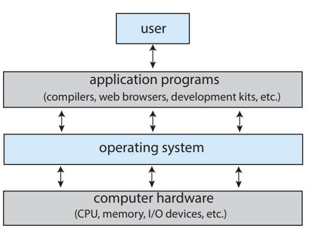
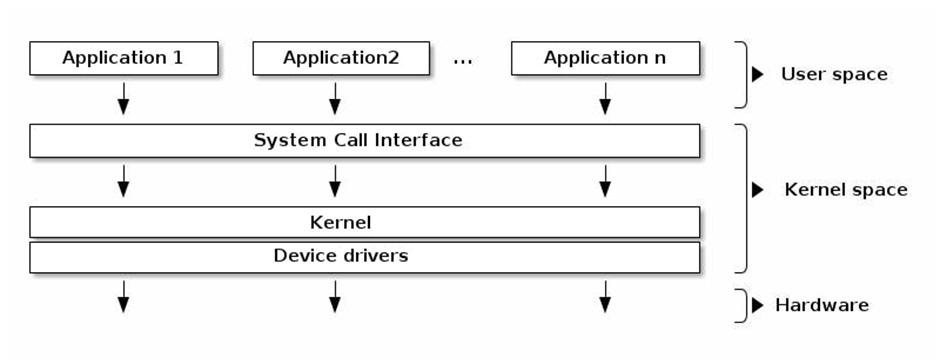
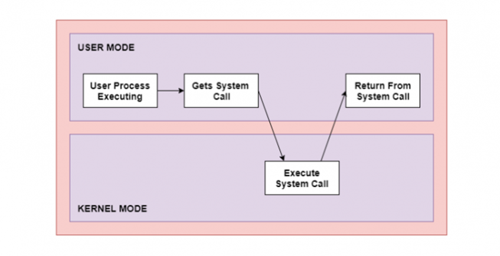
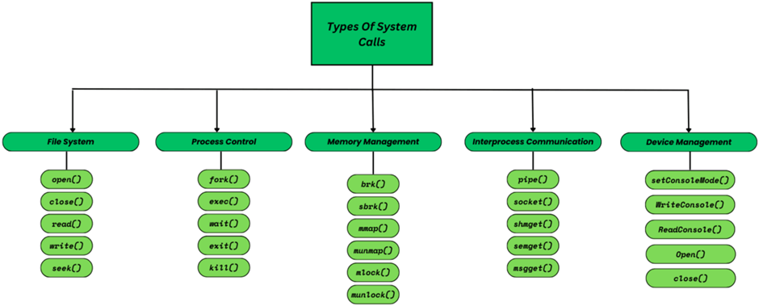

# Operation system overview

## Hệ thống máy tính

Một hệ thống máy tính cả thể tạm chưa thành 4 thành phần gồm: hardware, operating system, application programs và user.

Hardware là tầng thấp nhất, nó cung cấp các tài nguyên phần cứng cơ bản cho hệ thống như Central Processing Unit - CPU và I/O device.

Các application programs như word, excel, compiler và website, nhằm xác định cách thức sử dụng các tài nguyên phần cứng để giải quyết các nhu cầu tính toán của user.

OS sẽ điều khiển phần cứng và điều phối việc sử dụng nó giữa các chương trình ứng dụng khác nhau cho những người dùng khác nhau.

Chức năng của hệ điều hành:
- Quản lý tài nguyên: Đảm bảo các tài nguyên phần cứng như CPU, bộ nhớ, I/O device được sử dụng hiệu quả. I/O device như keyboard, printer, mouse,... 
- Quản lý việc thực hiện các chương trình (phần mềm): những application được cài vào hệ điều hành.

OS chia làm nhiều tính năng và mỗi một tính năng chính được gọi là một subsystem.
- System call interface - SCI
- Process Management - PM
- Virtual File System - VFS
- Memory Management - MM
- Network Stack
- Device Drivers - DD

## Kernel Space, User Space và System call

Hệ điều hành chia bộ nhớ thành hai không gian khác nhau, trong đó:
- Kernel Space: Mã thực thi có quyền truy cập không hạn chế vào bất kỳ không gian địa chỉ nào của memory và tới bất kỳ phần cứng nào, thường dành cho các hoạt động ở low layer. Do đó, bất kỳ sự không ổn định nào bên trong mã thực thi kernel cũng có thể dẫn đến lỗi hệ thống.
- User space: Mã thực thi bị hạn chế quyền truy cập. Nó là không gian địa chỉ mà các process user sẽ chạy. Một điểm đáng chú ý là các process này không thể truy cập trực tiếp tới kernel space được.

Khi process đang chạy ở chế độ user space muốn truy cập vào một vùng nhớ hoặc thành phần phần cứng mà chỉ có chế độ kernel space có thể truy cập thì cần một phương thức để chuyển đổi giữa các chế độ này, đó là thông qua một api đặc biệt gọi là system call.

System call là cách lập trình trong đó một chương trình máy tính yêu cầu một dịch vụ từ kernel của hệ điều hành mà nó được thực thi.

Các loại system call được tóm tắt theo hình sau:

