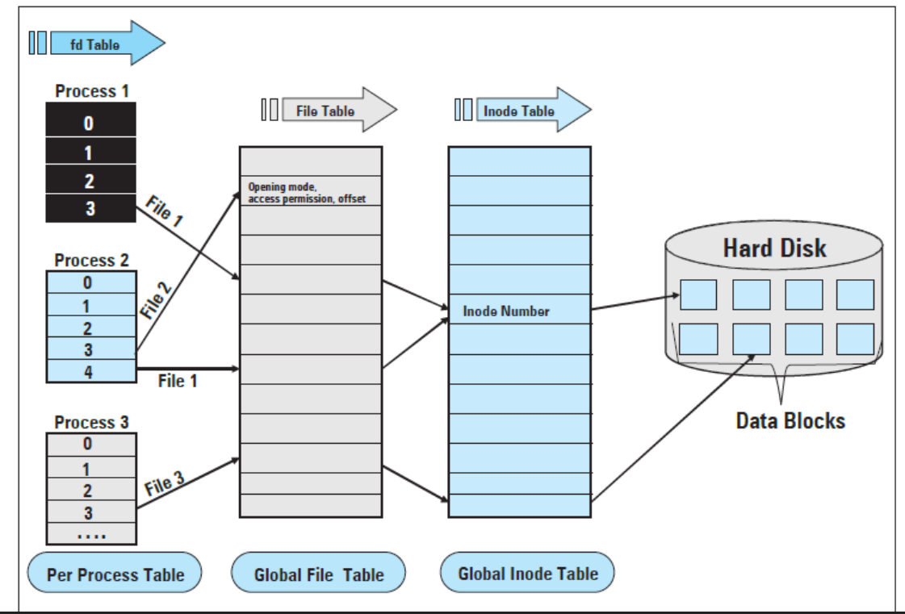

# Linux file system

## Tổng quan

Một chương trình đang chạy trên linux thì bản thân chương trình đấy cũng phải được biểu diễn thông qua một file nào đấy trong hệ thống, ta có thể thao tác với chương trình thông qua file. Hoặc một ví dụ như chuột, bàn phím, màn hình, âm thanh cũng đều được đại diện bằng một file nào đó và ta có thể thao tác với âm thanh hoặc đọc ghi qua màn hình thì đều có thể thông qua các file đại diện cho nó.

**=> Linux quản lý mọi thứ thông qua file.**

Cấu trúc `struct file` được định nghĩa trong `include/linux/fs.h`.

## Các loại file và phân quyền

Khi ta sử dụng lệnh bash `ls -l`

```bash
$ ls -l /
drwxr-xr-x   2 root root  4096 Oct  9  /bin
lrwxrwxrwx   1 root root     7 Oct  9  /lib -> usr/lib
brw-rw----   1 root disk 8,  0 Oct  9  /dev/sda
crw-rw-rw-   1 root tty  5,  0 Oct  9  /dev/tty
-rw-r--r--   1 root root  189 Oct  9  /etc/fstab
```

Ở đây, ký tự đầu tiên trong cột đầu tiên cho biết loại file:

|     | Loại file     | Mô tả |
|-----|---------------|-------|
| `-` | Regular file  | Là file dữ liệu thông thường, có thể chứa text, binary, code, hình ảnh, log… |
| `d` | Directory     | Cũng là một file, nhưng nó chứa danh sách entry tới các file. |
| `l` | Symbolic link | Là liên kết mềm trỏ đến một file khác theo tên. Nếu file gốc trỏ tới bị xoá thì liên kết này sẽ mất hiệu lực. |
| `c` | Character device | File này đại diện cho các thiết bị đọc/ghi theo byte. Ví dụ: uart, chuột, bàn phím,... |
| `b` | Block device  | File này đại diện cho các thiết bị đọc/ghi theo block và có cơ chế cached. Ví dụ: disk, eMMC, SSD,... |
| `p` | FIFO          | File này đại diện cho pipe, là một IPC giao tiếp giữa các tiến trình theo cơ chế FIFO. |
| `s` | socket        | File này đại diện cho một cổng mạng, dùng để giao tiếp giữa các tiến trình trong mạng. |

### Quyền truy cập (permission bits)

Phần còn lại của cột đầu tiên cho biết quyền sử dụng file đó:
- Mỗi ký tự đại diện cho một quyền.
- Mỗi quyền lại được đại diện bởi một bit trong struct `mode_t`.
- Các quyền này được gom theo từng nhóm: User, Group và Other.
- Mỗi nhóm sẽ có 3 loại quyền là:
  + read `r`: Cho phép đọc nội dung file hoặc xem file trong thư mục.
  + write `w`: Cho phép ghi nội dung vào file hoặc xoá file trong thư mục.
  + execute `x`: Cho phép thực thi file hoặc truy cập vào thư muc (`cd`).
- Ký tự `-` cho biết nó không có quyền tương ứng.
- Ngoài ra, còn có 3 bit quyền đặc biệt: bit setuid, bit setgid và bit sticky.

=> Tóm lại quyền cho một file sẽ được đại diện bởi các bit gồm: **3 bit đặc biệt, 3 bit user, 3 bit group và 3 bit other**.

Ví dụ như sau:

```bash
$ ls -l hello.sh
-rwxr-xr--
```

Giải thích:

| Nhóm   | Ký hiệu | Ý nghĩa            |
|--------|---------|--------------------|
| User   | `rwx`	 | Đọc, ghi, thực thi |
| Group  | `r-x`   | Đọc và thực thi    |
| Others | `r--`	 | Chỉ được đọc       |

### Bit đặc biệt

| Bit    | Ký hiệu            | Ứng dụng       | Ý nghĩa                                       |
| ------ | ------------------ | -------------- | --------------------------------------------- |
| setuid | s trong cột user   | File thực thi  | Process chạy với UID của owner file           |
| setgid | s trong cột group  | File/thư mục   | Process/file con kế thừa GID                  |
| sticky | t trong cột others | Thư mục public | Chỉ owner mới được xóa file của mình (vd: `/tmp`) |

Ví dụ:

```bash
$ ls -ld /tmp
drwxrwxrwt 10 root root 4096 Oct 9 /tmp
```

→ t = sticky bit.
→ Người dùng khác không thể xóa file trong thư mục `/tmp`.

### Thay đổi quyền

Ta cũng có thể thay đổi quyền truy cập bằng cách sử dụng:

**Dùng ký hiệu**

```bash
chmod u+x file     # thêm quyền execute cho owner
chmod g-w file     # bỏ quyền write cho group
chmod o+r file     # thêm quyền read cho others
chmod a+r file     # thêm quyền read cho tất cả
```

**Dùng mã bát phân**

| Quyền | Giá trị |
| ----- | ------- |
| r     | 4       |
| w     | 2       |
| x     | 1       |

Ví dụ:

```bash
chmod 755 file   # rwxr-xr-x
chmod 644 file   # rw-r--r--
chmod 700 file   # rwx------
```

**Dùng umask**

Khi một file mới được tạo, mặc định nó sẽ có quyền 666. Ta có dùng lệnh `umask` để xác định **bit quyền sẽ bị tắt** khi tạo file mới.

```bash
$ umask 0022
```

-> File mới tạo sẽ có quyền `666 - 022 = 644` → `rw-r--r--`.

## File descriptor & File Table

### File Descriptor (fd)

**File descriptor hay fd là một số nguyên dương trỏ tới một `struct file` trong kernel và mỗi process sẽ có một bảng file descriptor table riêng.**

`stdin`, `stdout`, `stderr` là 3 file descriptor mặc định được hệ điều hành mở sẵn ngay khi process được khởi tạo.

| FD | Tên    | Mô tả                 |
| -- | ------ | --------------------- |
| 0  | stdin  | Nhập (bàn phím, file) |
| 1  | stdout | Xuất (console)        |
| 2  | stderr | Lỗi (console)         |

Shell có khả năng redirect ba file descriptor mặc định trỏ vào một loại tài nguyên khác. ví dụ:

```bash
./prog < in.txt > out.txt 2>err.txt
```

Lúc này:
- `stdin` trỏ tới `in.txt`
- `stdout` trỏ tới `out.txt`
- `stderr` trỏ tới `err.txt`

Ta có thể kiểm tra các file đang mở của một process bằng lệnh:

```bash
ls /proc/<PID>/fd
```

Nếu một process mở quá nhiều file mà không đóng thì nó có thể gặp lỗi "Too many open files".

### File Table

File table là một bảng chứa thông tin của một file đang mở trong hệ thống:
- con trỏ tới inode
- offset hiện tại
- cờ mở file
- con trỏ `file_operations`
- referenct count: số process đang sử dụng file này.

Mỗi process có thể mở cùng một file, nhưng sẽ có entry trong file table khác nhau nếu nó có offset hoặc cờ mở file khác nhau.



## Inode table & Directory Entry

### Inode là gì

Để kernel biết được thông tin của một file như thời gian tạo, loại, quyền, block chứa dữ liệu của file thì làm kiểu gì? Câu trả lời chính là thông qua inode.

Vậy thì inode là gì?

Inode hay index node là một cấu trúc dữ liệu được lưu trên disk dùng để lưu thông tin metadata của một file hoặc directory, không bao gồm tên file.

Mỗi file hoặc directory có một inode duy nhất được đánh số gọi là inode number.

Một inode thường chứa các thông tin sau:

| Thông tin  | Mô tả                          |
| ---------- | ------------------------------ |
| File type  | regular, directory, symlink... |
| Permission | Quyền read, write, excecute.   |
| UID/GID    | Chủ sở hữu file.               |
| File size  | Kích thước của file tính theo byte.  |
| Timestamp  | `atime`, `mtime`, `ctime`      |
| Link count | Số hard link trỏ đến inode này.|
| Block list | Danh sách block trong disk chứa dữ liệu |

Trong đó, mỗi block là một đơn vị lưu trữ vật lý, thường có kích thước 4KB hoặc 8KB.

:::warning Chú ý
Kernel chỉ thực sự xóa file khi link count = 0 và không có process nào mở file.
:::

### Directory entry (dentry)

Directory là một file đặc biệt, dữ liệu của nó là các directory entry. Mỗi directory entry là ánh xạ giữa tên file và inode number tương ứng. Thông qua inode ta có thể biết được thông tin của file và dữ liệu của file đó.

Ví dụ:

```bash
$ ls -i
1052 file.txt
1053 note.txt
```

→ `file.txt` có inode number = 1052
→ `note.txt` có inode number = 1053

Để kiểm tra thông tin của một file, ta sử dụng lệnh sau:

```bash
$ stat file.txt
File: file.txt
Size: 1024          Blocks: 8          IO Block: 4096   regular file
Device: 803h/2051d    Inode: 1052        Links: 1
Access: (0644/-rw-r--r--)  Uid: (1000/nguyenbui)  Gid: (1000/nguyenbui)
Access: 2025-10-09 13:12:03
Modify: 2025-10-09 13:12:03
Change: 2025-10-09 13:12:03

```

Khi mở một file, kernel sẽ thực hiện tra cứu đường dẫn thông qua directory entry cho đến khi tìm thấy file và inode number tương ứng.

:::warning Chú ý
inode và directory entry là một phần của virtual file system, bởi vì mỗi file system sẽ có cách lưu file trên disk khác nhau.
:::

### Hard link và Symbolic link

**Hard link**

```bash
$ ln file.txt file_link
$ ls -li
1052 -rw-r--r-- 2 user user 1024 Oct 9 file.txt
1052 -rw-r--r-- 2 user user 1024 Oct 9 file_link
```

- Cả hai đều trỏ đến inode 1052, chia sẻ cùng dữ liệu.
- Xóa một file, file kia vẫn tồn tại (vì link count > 0).

**Symbolic link**

```bash
$ ln -s file.txt sym_link
$ ls -li
1052 -rw-r--r-- 1 user user 1024 Oct 9 file.txt
1053 lrwxrwxrwx 1 user user   8 Oct 9 sym_link -> file.txt
```

- `sym_link` có inode khác (1053).
- Chỉ chứa đường dẫn đến file gốc, không trỏ trực tiếp vào block dữ liệu.
- Khi file gốc xoá, symlink chết hay dangling.

## Thao tác với file

**Open file**

- OS kiểm tra xem việc thao tác với file có hợp lệ không?
  + người dùng hiện tại có quyền thao tác với file hay không?
  + file có tồn tại không?
- Khởi tạo một struct file chứa thông tin để làm việc với file đó, struct này được lưu trong ram.
   + con trỏ buffer, nơi lưu dữ liệu đọc ghi xuống file.
   + Vị trí đầu đọc trong file.
- Prototype của hàm như sau:
  ```c
  int open(const char* pathname, int flags)
  ```
- Một số nhóm flag khi sử dụng hàm `open`.
  + Access mode (chỉ chọn 1):
    + `O_RDONLY`: Chỉ đọc.
    + `O_WRONLY`: Chỉ ghi.
    + `O_RDWR`: Đọc và ghi.
  + Creation control:
    + `O_CREAT`: Tạo file nếu chưa có.
    + `O_EXCL`: Báo lỗi nếu file đã tồn tại.
    + `O_TRUNC`: Xóa toàn bộ nội dung file nếu file đã tồn tại.
  + Write behavior:
    + `O_APPEND`: Ghi vào cuối file.
    + `O_SYNC`: Ghi đồng bộ (bỏ qua catched và lưu vào ổ cứng).

**Close file**

- sync buffer chứa dữ liệu đọc ghi của file ở trên ram xuống ổ cứng.
- giải phóng struct file ở trong ram đi.

**Lưu ý**

- Khi đọc file lớn > GB thì cần giới hạn kích thước cho một lần đọc.
- Luôn luôn phải kiểm tra giá trị trả về của các hàm trước khi thực hiện tiếp công việc.
- Sau khi write, nếu chương trình bị crash trước khi gọi hàm close thì dữ liệu có thể chưa được đẩy xuống ổ cứng => gây mất dữ liệu.

## Mount

Mount là quá trình attach một file system vào một point trong cây thư mục, điều này được gọi là mount point.

Tại sao cần mount? Vì Linux coi mọi thứ là file, để truy cập file thì nó phải nằm trong cây thư mục.

Một thiết bị ví dụ như USB, ổ cứng khác, file system ảo,...chỉ có thể truy cập được sau khi được mount.

Ví dụ, thư mục `/proc` là một pseudo file system được kernel mount. Mỗi file trong đó như `cpuinfo`, `meminfo`, `uptime`,...được kernel tạo động khi có truy cập. Nó không có dữ liệu trên disk, chỉ có callback function để cung cấp các thông tin từ kernel.

## Cached data

**Cached là gì trong hệ thống file system**

Cached là vùng nhớ trung gian nằm trên RAM dùng để lưu tạm dữ liệu đọc/ghi, giúp giảm số lần truy cập ổ đĩa.

Truy cập ổ đĩa chậm hơn RAM hàng nghìn lần → Nếu mỗi lần write phải ghi ngay trực tiếp xuống disk → hệ thống rất chậm.

→ Giải pháp:
- Nếu ghi, kernel không ghi ngay lập tức xuống disk, mà kernel sẽ lưu dữ liệu vào cached.
- Nếu đọc, kernel sẽ đọc cả một sector từ disk và lưu dữ liệu này vào cached.

Ví dụ như việc đọc 1 byte từ disk, khi đó OS vẫn đọc cả một sector nên app chỉ cần lấy 1 byte còn các byte còn lại sẽ được cất vào cached nằm trên ram, nếu lần đọc data sau vẫn nằm trong sector đó thì nó sẽ lấy từ cached mà không cần đọc xuống disk.

**Write back và write through**

| Cơ chế         | Mô tả | Ưu điểm | Nhược điểm |
|----------------|-------|---------|------------|
| Write through  | Ghi ngay lập tức xuống disk | Dữ liệu luôn an toàn và đồng bộ | Hiệu năng thấp |
| Write back	  | Khi ghi vào cache thì nó không ghi ngay lập tức xuống disk mà chỉ được ghi khi thực sự cần | Hiệu năng cao | Nguy cơ gây mất dữ liệu nếu mất điện trước khi flush |

Trong kernel có một thread sẽ định kỳ quét các cached để tìm các dirty cached và flush chúng xuống disk, sau đó, xoá cờ dirty. Để có thể chủ động flush dữ liệu trong cached, ta có thể sử dụng lệnh `sync` hoặc setting flag lúc mở file để chỉ định không sử dụng cached (write through).

Ví dụ:
- Khi process gọi system call `write`
  - Kernel sẽ thực hiện sao chép dữ liệu vào page cache (RAM).
  - Đánh dấu page đó là dirty page (đã thay đổi so với disk).
  - `write` trả về ngay lập tức, lúc này process sẽ tưởng là đã ghi xong.
- Kernel sẽ flush các dirty page về disk khi:
  - Hết page cache trống.
  - Định kỳ sync, ví dụ 5s/lần.
  - Force flush khi gọi các api `fsync` hoặc `sync`
- Khi flush:
  - Kernel gọi hàm ghi tương ứng với từng file system.
  - Lúc này, dữ liệu trong page cache được ghi xuống block thật nằm trên disk.
  - Xoá cờ dirty.

## Virtual file system

Virtual file system là một lớp trung gian, nó cho phép kernel xử lý các system call về file mà không cần biết file đó là định dạng file system nào, tức là nó cung cấp một lớp interface thống nhất cho phép các chương trình user có thể thực hiện các thao tác trên các loại file system khác nhau mà không cần phải thay đổi mã nguồn.

Hãy tưởng tượng bạn có nhiều loại hệ thống file khác nhau:
- Ổ đĩa cứng dùng ext4
- USB dùng FAT32
- Ổ mạng dùng NFS
- Thiết bị ảo như procfs, sysfs

Nếu kernel không có VFS, mỗi hệ thống file sẽ phải cung cấp hàm riêng biệt cho từng syscall như `open_ext4`, `open_fat`, `open_nfs`, v.v → Điều này rất phức tạp và không thể mở rộng.

→ VFS giải quyết điều này bằng cách tạo một lớp interface thống nhất giúp chuyển system call như `open` hoặc `read` thành các hàm tương ứng với mỗi file system. Tức là, mỗi file systen khi được đăng ký vào kernel sẽ cung cấp một bảng function table ánh xạ đến những hàm xử lý riêng của nó.

Các loại file system thường gặp:

| **Loại**             | **Ví dụ**              | **Mô tả**                                                           |
| -------------------- | ---------------------- | ------------------------------------------------------------------- |
| **Vật lý (on-disk)** | `ext4`, `vfat`, `ntfs` | Lưu dữ liệu thực trên thiết bị lưu trữ.                             |
| **Ảo (pseudo)**      | `proc`, `sysfs`,       | Không lưu dữ liệu thật, cung cấp giao diện cho kernel hoặc tạm RAM. |
| **Mạng (network)**   | `NFS`, `CIFS`, `SSHFS` | Lưu trữ trên máy chủ qua giao thức mạng.                            |