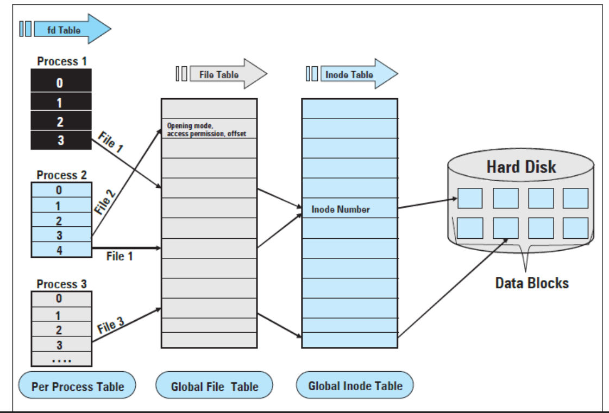

## 1. Tổng quan

Một chương trình đang chạy trên linux thì bản thân chương trình đấy cũng phải được biểu diễn thông qua một file nào đấy trong hệ thống, ta có thể thao tác với chương trình thông qua file. Hoặc một ví dụ như chuột, bàn phím, màn hình, âm thanh cũng đều được đại diện bằng một file nào đó và ta có thể thao tác với âm thanh hoặc đọc ghi qua màn hình thì đều có thể thông qua các file đại diện cho nó.

**=> Linux quản lý mọi thứ thông qua file.**

Cấu trúc `struct file` được định nghĩa trong `include/linux/fs.h`.

## 2. Các loại file và phân quyền

### 2.1. Các loại file

Khi ta sử dụng lệnh bash `ls -l`

```bash
$ ls -l /
drwxr-xr-x   2 root root  4096 Oct  9  /bin
lrwxrwxrwx   1 root root     7 Oct  9  /lib -> usr/lib
brw-rw----   1 root disk 8,  0 Oct  9  /dev/sda
crw-rw-rw-   1 root tty  5,  0 Oct  9  /dev/tty
-rw-r--r--   1 root root  189 Oct  9  /etc/fstab
```

Ở đây, ký tự đầu tiên trong cột đầu tiên cho biết loại file:

|     | Loại file     | Mô tả |
|-----|---------------|-------|
| `-` | Regular file  | Là file dữ liệu thông thường, có thể chứa text, binary, code, hình ảnh, log… |
| `d` | Directory     | Cũng là một file, nhưng nó chứa danh sách entry tới các file. |
| `l` | Symbolic link | Là liên kết mềm trỏ đến một file khác theo tên. Nếu file gốc trỏ tới bị xoá thì liên kết này sẽ mất hiệu lực. |
| `c` | Character device | File này đại diện cho các thiết bị đọc/ghi theo byte. Ví dụ: uart, chuột, bàn phím,... |
| `b` | Block device  | File này đại diện cho các thiết bị đọc/ghi theo block và có cơ chế cached. Ví dụ: disk, eMMC, SSD,... |
| `p` | FIFO          | File này đại diện cho pipe, là một IPC giao tiếp giữa các tiến trình theo cơ chế FIFO. |
| `s` | socket        | File này đại diện cho một cổng mạng, dùng để giao tiếp giữa các tiến trình trong mạng. |

### 2.2. Phân quyền (File permissions)

Ở ví dụ trên, phần còn lại của cột đầu tiên cho biết quyền sử dụng file đó:
- Mỗi ký tự đại diện cho một quyền.
- Mỗi quyền lại được đại diện bởi một bit trong struct `mode_t`.

Các quyền này được gom theo từng nhóm: User, Group và Other.
- User (u): Người sở hữu file, thường là người tạo ra nó.
- Group (g): Nhóm người dùng được gán cho file (ví dụ: team dev, team ops)
- Other (o): Tất cả những người còn lại trên hệ thống

Mỗi nhóm sẽ có 3 loại quyền là:
- read `r`: Cho phép đọc nội dung file hoặc xem file trong thư mục.
- write `w`: Cho phép ghi nội dung vào file hoặc xoá file trong thư mục.
- execute `x`: Cho phép thực thi file hoặc truy cập vào thư muc (`cd`).
- Ký tự `-` cho biết nó không có quyền tương ứng.

Ví dụ như sau:

```bash
$ ls -l hello.sh
-rwxr-xr--
```

Giải thích:

| Nhóm   | Ký hiệu | Ý nghĩa            |
|--------|---------|--------------------|
| User   | `rwx`	 | Đọc, ghi, thực thi |
| Group  | `r-x`   | Đọc và thực thi    |
| Others | `r--`	 | Chỉ được đọc       |

Ngoài ra, còn có 3 bit quyền đặc biệt sau:

| Bit    | Ký hiệu            | Ứng dụng       | Ý nghĩa                                       |
| ------ | ------------------ | -------------- | --------------------------------------------- |
| setuid | s trong cột user   | File thực thi  | Process chạy với UID của owner file           |
| setgid | s trong cột group  | File/thư mục   | Process/file con kế thừa GID                  |
| sticky | t trong cột others | Thư mục public | Chỉ owner mới được xóa file của mình (vd: `/tmp`) |

Ví dụ:

```bash
$ ls -ld /tmp
drwxrwxrwt 10 root root 4096 Oct 9 /tmp
```

$\rightarrow$ t = sticky bit.
$\rightarrow$ Người dùng khác không thể xóa file trong thư mục `/tmp`.

### 2.3. Các tool phân quyền quan trọng

Ta cũng có thể phân quyền bằng cách sử dụng:

**`chmod` - Thay đổi quyền truy cập**

- Dùng symbolic:

  ```bash
  # Symbolic
  chmod u+x file     # thêm quyền execute cho owner
  chmod g-w file     # bỏ quyền write cho group
  chmod o+r file     # thêm quyền read cho others
  chmod a+r file     # thêm quyền read cho tất cả
  ```

- Dùng mã bát phân:

  | Quyền | Giá trị |
  | ----- | ------- |
  | r     | 4       |
  | w     | 2       |
  | x     | 1       |

  Ví dụ:

  ```bash
  chmod 755 file   # rwxr-xr-x
  chmod 644 file   # rw-r--r--
  chmod 700 file   # rwx------
  ```

  Một số giá trị octal phổ biến cần nhớ:

  - 755: Thư mục public, script có thể chạy
  - 644: File văn bản, config thông thường
  - 600: File nhạy cảm (SSH key, env,...)
  - 700: Script chỉ owner mới chạy được

- Dùng recursive:

  ```bash
  chmod -R 644 file
  ```

**chown - Đổi chủ sở hữu file**

```bash
chown alice script.sh         # Đổi owner thành alice
chown alice:devteam script.sh # đổi cả owner lẫn group
```

**chgrp - Đổi nhóm sở hữu**

```bash
chgrp devteam script.sh
```

**umask - quyền mặc định khi tạo file mới**

Khi một file mới được tạo, mặc định nó sẽ có quyền 666. Ta có dùng lệnh `umask` để phân quyền khi tạo file mới.

```bash
$ umask 0022
```

$\rightarrow$ File mới tạo sẽ có quyền `666 - 022 = 644` $\rightarrow$ `rw-r--r--`.

### 2.4. Tại sao cần phân quyền?

Sai phân quyền là nguyên nhân phổ biến của nhiều sự cố thực tế:
- Web server lỗi 403 Forbidden $\rightarrow$ thường do file thiếu quyền `r` hoặc thư mục thiếu `x`
- Script không chạy được $\rightarrow$ thiếu quyền `x`
- Lỗ hổng bảo mật nghiêm trọng $\rightarrow$ file config bị để 777 (ai cũng có thể ghi được)

## 3. File descriptor & File Table

### 3.1. File Descriptor (fd)

> File descriptor hay fd là một số nguyên dương trỏ tới một `struct file` trong kernel và mỗi process sẽ có một bảng file descriptor table riêng.

`stdin`, `stdout`, `stderr` là 3 file descriptor mặc định được hệ điều hành mở sẵn ngay khi process được khởi tạo.

| FD | Tên    | Mô tả                 |
| -- | ------ | --------------------- |
| 0  | stdin  | Nhập (bàn phím, file) |
| 1  | stdout | Xuất (console)        |
| 2  | stderr | Lỗi (console)         |

Shell có khả năng redirect ba file descriptor mặc định trỏ vào một loại tài nguyên khác. ví dụ:

```bash
./prog < in.txt > out.txt 2>err.txt
```

Lúc này:
- `stdin` trỏ tới `in.txt`
- `stdout` trỏ tới `out.txt`
- `stderr` trỏ tới `err.txt`

Ta có thể kiểm tra các file đang mở của một process bằng lệnh:

```bash
ls /proc/<PID>/fd
```

Nếu một process mở quá nhiều file mà không đóng thì nó có thể gặp lỗi "Too many open files".

### 3.2. File Table

File table là một bảng chứa thông tin của một file đang mở trong hệ thống:
- con trỏ tới inode
- offset hiện tại
- cờ mở file
- con trỏ `file_operations`
- referenct count: số process đang sử dụng file này.

Mỗi process có thể mở cùng một file, nhưng sẽ có entry trong file table khác nhau nếu nó có offset hoặc cờ mở file khác nhau.



## 4. Inode table & Directory Entry

### 4.1. Inode là gì?

Để kernel biết được thông tin của một file như thời gian tạo, loại, quyền, block chứa dữ liệu của file thì làm kiểu gì? Câu trả lời chính là thông qua inode.

Vậy thì inode là gì?

> Inode hay index node là một cấu trúc dữ liệu được lưu trên disk dùng để lưu thông tin metadata của một file hoặc directory, không bao gồm tên file.

Một inode thường chứa các thông tin sau:

| Thông tin  | Mô tả                          |
| ---------- | ------------------------------ |
| Inode number | ID duy nhất trong filesystem |
| File type  | regular, directory, symlink... |
| Permission | Quyền read, write, excecute.   |
| UID/GID    | Chủ sở hữu file.               |
| File size  | Kích thước của file tính theo byte.  |
| Timestamp  | `atime`, `mtime`, `ctime`      |
| Link count | Số hard link trỏ đến inode này.|
| Block list | Danh sách các data block trên disk chứa dữ liệu |

Trong đó, mỗi block là một đơn vị lưu trữ vật lý, thường có kích thước 4KB hoặc 8KB.

Với EXT4, mỗi inode có kích thước 256 bytes. Số lượng inode thường được cố định khi format ổ đĩa $\rightarrow$ đây là lý do đôi khi ta hết inode dù còn đầy disk space.

:::warning Chú ý
Kernel chỉ thực sự xóa file khi link count = 0 và không có process nào mở file.
:::

### 4.2. Directory entry (dentry)

Directory là một file đặc biệt, dữ liệu của nó là các directory entry. Mỗi directory entry là ánh xạ giữa tên file và inode number tương ứng. Thông qua inode ta có thể biết được thông tin của file và dữ liệu của file đó.

Ví dụ:

```bash
$ ls -i
1052 file.txt
1053 note.txt
```

$\rightarrow$ `file.txt` có inode number = 1052
$\rightarrow$ `note.txt` có inode number = 1053

Để kiểm tra thông tin của một file, ta sử dụng lệnh sau:

```bash
$ stat file.txt
File: file.txt
Size: 1024          Blocks: 8          IO Block: 4096   regular file
Device: 803h/2051d    Inode: 1052        Links: 1
Access: (0644/-rw-r--r--)  Uid: (1000/nguyenbui)  Gid: (1000/nguyenbui)
Access: 2025-10-09 13:12:03
Modify: 2025-10-09 13:12:03
Change: 2025-10-09 13:12:03

```

:::warning Chú ý
inode và directory entry là một phần của virtual file system, bởi vì mỗi file system sẽ có cách lưu file trên disk khác nhau.
:::

Khi mở một file, kernel sẽ thực hiện tra cứu đường dẫn thông qua directory entry cho đến khi tìm thấy file và inode number tương ứng.

### 4.3. Path lockup

Khi ta gõ `cat /etc/nginx/nginx.conf`, kernel thực hiện từng bước:
- Tra inode của "/" (root): inode số 2 luôn là root, cố định trong mọi EXT filesystem.
- Đọc data block của "/": đây là directory, nội dung là bảng ánh xạ tên $\rightleftarrow$ inode. Tìm entry "etc" $\rightarrow$ inode số X.
- Đọc inode X của "etc": xác nhận đây là directory, kiểm tra permission. Đọc data block $\rightarrow$ tìm "nginx" $\rightarrow$ inode số Y.
- Tiếp tục với "nginx" $\rightarrow$ tìm "nginx.conf" $\rightarrow$ inode số Z.
- Đọc inode Z: lấy block pointers, đọc data blocks thật sự, trả về nội dung file.

Mỗi bước là một lần tra cứu tên tới inode. Nếu lần nào cũng phải hỏi thẳng xuống ổ đĩa (đọc block chứa thư mục, parse entry...) thì mở file sẽ chậm kinh khủng, nhất là với path sâu.

Để giải quyết vấn đề này thì kernel sinh ra dentry cache hay dcache.

Mỗi dentry sau khi resolve xong sẽ được cache lại trong một hash table toàn cục, key là (dentry cha, tên). Lần sau cần tra `nginx` trong `etc`, kernel tra thẳng trong RAM, không đụng tới filesystem thật bên dưới. Đây là lý do lần mở file thứ hai luôn nhanh hơn lần đầu rõ rệt.

Vài điểm hay của dcache:
- Negative dentry: kernel còn cache cả những lần tra cứu thất bại — file không tồn tại. Nhờ vậy `stat()` liên tục lên một file chưa tạo, rất phổ biến khi compiler tìm header hay shell tìm binary trong `$PATH`.
- LRU + shrinker: dcache không giữ mọi thứ mãi mãi. Khi RAM sắp tràn, kernel có cơ chế shrink dcache dựa trên LRU, ưu tiên giữ lại những gì đang dùng.
- RCU-walk: từ Linux 2.6.38, path lookup có chế độ đi qua dcache mà gần như không cần lock (dùng RCU), chỉ fallback về "ref-walk" có lock khi gặp trường hợp phức tạp (symlink, mount point...). Đây là một trong những tối ưu quan trọng nhất giúp lookup scale tốt trên máy nhiều core.

### 4.4. Ứng dụng thực tế

Hiểu inode ở mức này giúp ta giải thích nhiều hiện tượng:
- `chmod`/`chown` chạy rất nhanh dù file 10GB: vì chỉ sửa 2-4 bytes trong inode, không đụng data.
- `mv` file trong cùng partition tức thì: chỉ cập nhật directory entry, inode và data không di chuyển.
- `mv` file khác partition chậm như `cp`: phải copy toàn bộ data block sang inode mới ở filesystem đích.
- `touch` tạo file rỗng: cấp phát inode mới, `i_size = 0`, không cấp phát data block nào cả.

Với embedded developer: khi thiết kế rootfs cho thiết bị IoT, hiểu block pointer giúp ta chọn block size phù hợp, block size lớn tăng tốc đọc file lớn nhưng lãng phí space với nhiều file nhỏ (internal fragmentation).

## 5. Hard link và Symbolic link

Đây là một trong những khái niệm dễ nhầm nhất khi học Linux File System. Cả hai đều tạo ra một shortcut trỏ đến file, nhưng cơ chế bên dưới hoàn toàn khác nhau và nếu dùng sai, ta có thể mất dữ liệu hoặc gặp lỗi khó debug.

### 5.1. Hard link

Trong linux, mỗi file thực chất là một inode. Hard link đơn giản là tạo thêm một directory entry khác trỏ đến inode đó.

Đặc điểm của hard link:
- Cùng inode number với file gốc
- File chỉ bị xóa khi link count = 0, tức là tât cả hard link đều bị xóa
- Không thể tạo hard link đến directory vì dẫn đến nguy cơ circular reference
- Không thể cross filesystem, phải cùng partition

Ví dụ:

```bash
$ ln file.txt file_link
$ ls -li
1052 -rw-r--r-- 2 user user 1024 Oct 9 file.txt
1052 -rw-r--r-- 2 user user 1024 Oct 9 file_link
```

Cả hai đều có chung inode 1052, chia sẻ cùng dữ liệu.

Dùng hard link khi nào?
- Cần backup an toàn trong cùng partition $\rightarrow$ xóa file gốc không mất data
- Dùng trong backup tools như `rsync --link-dest` để tiết kiệm disk space
- Config file cần xuất hiện ở nhiều nơi nhưng luôn đồng bộ nội dung

### 5.2. Symbolic link

Soft link là một file đặc biệt, bên trong chứa đường dẫn đến file gốc, không trỏ trực tiếp vào block dữ liệu.

Khi ta mở soft link thì kernel đọc path bên trong rồi redirect sang file gốc. Nếu file gốc bị xóa hoặc đổi tên thì soft link trở thành dangling link.

Đặc điểm của soft link:
- Có inode riêng, khác với file gốc
- Có thể trỏ đến directory
- Có thể cross filesystem, cross partition 
- Bị ảnh hưởng nếu file đích bị xóa hoặc di chuyển 

Ví dụ:

```bash
$ ln -s file.txt sym_link
$ ls -li
1052 -rw-r--r-- 1 user user 1024 Oct 9 file.txt
1053 lrwxrwxrwx 1 user user   8 Oct 9 sym_link -> file.txt
```

`sym_link` có inode khác (1053).

Dùng soft link khi nào?
- Trỏ đến directory (bắt buộc dùng soft link)
- Cross filesystem: `/data` ở partition khác
- Version management: `/usr/bin/python` $\rightarrow$ `/usr/bin/python3.12`

### 5.3. Tại sao phải hiểu rõ điều này?

Trong thực tế, sai lầm phổ biến nhất là dùng soft link cho backup quan trọng khi file gốc bị xóa nhầm, soft link không cứu được gì. Ngược lại, dùng hard link cross partition sẽ báo lỗi ngay lập tức.

Hiểu rõ hard link vs soft link còn giúp ta debug các vấn đề như: tại sao xóa file mà disk không giảm dung lượng? Do vẫn còn hard link khác.

## 5. Thao tác với file

### 5.1. Open file

- OS kiểm tra xem việc thao tác với file có hợp lệ không?
  + người dùng hiện tại có quyền thao tác với file hay không?
  + file có tồn tại không?
- Khởi tạo một struct file chứa thông tin để làm việc với file đó, struct này được lưu trong ram.
   + con trỏ buffer, nơi lưu dữ liệu đọc ghi xuống file.
   + Vị trí đầu đọc trong file.
- Prototype của hàm như sau:
  ```c
  int open(const char* pathname, int flags)
  ```
- Một số nhóm flag khi sử dụng hàm `open`.
  + Access mode (chỉ chọn 1):
    + `O_RDONLY`: Chỉ đọc.
    + `O_WRONLY`: Chỉ ghi.
    + `O_RDWR`: Đọc và ghi.
  + Creation control:
    + `O_CREAT`: Tạo file nếu chưa có.
    + `O_EXCL`: Báo lỗi nếu file đã tồn tại.
    + `O_TRUNC`: Xóa toàn bộ nội dung file nếu file đã tồn tại.
  + Write behavior:
    + `O_APPEND`: Ghi vào cuối file.
    + `O_SYNC`: Ghi đồng bộ (bỏ qua catched và lưu vào ổ cứng).

### 5.2. Close file

- sync buffer chứa dữ liệu đọc ghi của file ở trên ram xuống ổ cứng.
- giải phóng struct file ở trong ram đi.

### 5.3. Lưu ý

- Khi đọc file lớn > GB thì cần giới hạn kích thước cho một lần đọc.
- Luôn luôn phải kiểm tra giá trị trả về của các hàm trước khi thực hiện tiếp công việc.
- Sau khi write, nếu chương trình bị crash trước khi gọi hàm close thì dữ liệu có thể chưa được đẩy xuống ổ cứng => gây mất dữ liệu.

## 6. Page cache

### 6.1. Page cache là gì?

Page cache là vùng nhớ nằm trên RAM dưới dạng các page, nó  dùng để lưu tạm dữ liệu đọc/ghi, giúp giảm số lần truy cập ổ đĩa.

Truy cập ổ đĩa chậm hơn RAM hàng nghìn lần
$\rightarrow$ Nếu mỗi lần write phải ghi ngay trực tiếp xuống disk
$\rightarrow$ Hệ thống rất chậm
$\rightarrow$ Giải pháp:
- Nếu ghi, kernel không ghi ngay lập tức xuống disk mà kernel sẽ lưu dữ liệu vào page cache.
- Nếu đọc, kernel sẽ đọc cả một sector từ disk và lưu dữ liệu này vào page cache.

Ví dụ như việc đọc 1 byte từ disk, khi đó OS vẫn đọc cả một sector nên app chỉ cần lấy 1 byte còn các byte còn lại sẽ được cất vào cached nằm trên ram, nếu lần đọc data sau vẫn nằm trong sector đó thì nó sẽ lấy từ page cache mà không cần đọc xuống disk.

### 6.2. Write back và write through

| Cơ chế         | Mô tả | Ưu điểm | Nhược điểm |
|----------------|-------|---------|------------|
| Write through  | Ghi ngay lập tức xuống disk | Dữ liệu luôn an toàn và đồng bộ | Hiệu năng thấp |
| Write back	  | Khi ghi vào cache thì nó không ghi ngay lập tức xuống disk mà chỉ được ghi khi thực sự cần | Hiệu năng cao | Nguy cơ gây mất dữ liệu nếu mất điện trước khi flush |

Trong kernel có một thread sẽ định kỳ quét các cached để tìm các dirty cached và flush chúng xuống disk, sau đó, xoá cờ dirty. Để có thể chủ động flush dữ liệu trong cached, ta có thể sử dụng lệnh `sync` hoặc setting flag lúc mở file để chỉ định không sử dụng cached (write through).

Ví dụ:
- Khi process gọi system call `write`
  - Kernel sẽ thực hiện sao chép dữ liệu vào page cache (RAM).
  - Đánh dấu page đó là dirty page (đã thay đổi so với disk).
  - `write` trả về ngay lập tức, lúc này process sẽ tưởng là đã ghi xong.
- Kernel sẽ flush các dirty page về disk khi:
  - Hết page cache trống.
  - Định kỳ sync, ví dụ 5s/lần.
  - Force flush khi gọi các api `fsync` hoặc `sync`
- Khi flush:
  - Kernel gọi hàm ghi tương ứng với từng file system.
  - Lúc này, dữ liệu trong page cache được ghi xuống block thật nằm trên disk.
  - Xoá cờ dirty.

## 7. Virtual file system

### 7.1. Tổng quan

Virtual file system là một lớp trung gian, nó cho phép kernel xử lý các system call về file mà không cần biết file đó là định dạng file system nào, tức là nó cung cấp một lớp interface thống nhất cho phép các chương trình user có thể thực hiện các thao tác trên các loại file system khác nhau mà không cần phải thay đổi mã nguồn.

Hãy tưởng tượng bạn có nhiều loại hệ thống file khác nhau:
- Ổ đĩa cứng dùng ext4
- USB dùng FAT32
- Ổ mạng dùng NFS
- Thiết bị ảo như procfs, sysfs

Nếu kernel không có VFS, mỗi hệ thống file sẽ phải cung cấp hàm riêng biệt cho từng syscall như `open_ext4`, `open_fat`, `open_nfs`,...

$\rightarrow$ Điều này rất phức tạp và không thể mở rộng.

$\rightarrow$ VFS giải quyết điều này bằng cách tạo một lớp interface thống nhất giúp chuyển system call như `open` hoặc `read` thành các hàm tương ứng với mỗi file system. Tức là, mỗi file systen khi muốn đăng ký vào kernel thì nó phải cung cấp một bảng function table ánh xạ đến những hàm xử lý riêng của nó.

Các loại file system thường gặp:

| **Loại**             | **Ví dụ**              | **Mô tả**                                                           |
| -------------------- | ---------------------- | ------------------------------------------------------------------- |
| **Vật lý (on-disk)** | `ext4`, `vfat`, `ntfs` | Lưu dữ liệu thực trên thiết bị lưu trữ.                             |
| **Ảo (pseudo)**      | `proc`, `sysfs`,       | Không lưu dữ liệu thật, cung cấp giao diện cho kernel hoặc tạm RAM. |
| **Mạng (network)**   | `NFS`, `CIFS`, `SSHFS` | Lưu trữ trên máy chủ qua giao thức mạng.                            |

### 7.2. 4 đối tượng cốt lõi

| Đối tượng | Đại diện | Ghi chú |
| --- | --- | --- |
| superblock | Một filesystem đã mount | Metadata toàn cục: kích thước block, số inode, trạng thái |
| inode | Một file hoặc object | Metadata của file, không chứa tên file |
| dentry | Một mục trong thư mục | Ánh xạ tên $\rightarrow$ inode, được cache lại để tra path nhanh hơn |
| file | Một file đang mở của process | Trạng thái mở: offset hiện tại, flags, quyền |

Mỗi đối tượng có một bảng thao tác `inode_operations`, `file_operations`,... mà filesystem cụ thể cài đặt. Đây chính là lý do một filesystem mới chỉ cần hiện thực các hàm này là dùng được ngay với mọi công cụ có sẵn.

### 7.3. Mount

Mount là thao tác gắn cây thư mục của file system vào một thư mục đã có sẵn trong cây hiện tại. Thư mục được chọn làm điểm gắn được gọi là mount point.

Trước khi mount:

```
/
├── etc/
├── home/
└── mnt/
    └── data/   (trống)

/dev/sdb1 (XFS)
  ├── project/
  ├── backup/
  └── notes.txt
```

Sau khi mount:

```
/
├── etc/
├── home/
└── mnt/
    └── data/  <- mount point
        ├── project/
        ├── backup/
        └── notes.txt
        ▲
        └── nội dung của sdb1 hiện ra ở đây
```

Ngoài ra, ta cũng có thể hiểu mount là việc nối superblock của filesystem mới vào một dentry trong cây hiện tại. Dentry đó được đánh dấu `DCACHE_MOUNTED` và path walk khi đi tới nó sẽ nhảy sang root dentry của superblock mới.

**Tại sao cần mount?** Vì Linux coi mọi thứ là file, để truy cập file thì nó phải nằm trong cây thư mục.

Một thiết bị ví dụ như USB, ổ cứng khác, file system ảo,...chỉ có thể truy cập được sau khi được mount.

Ví dụ, thư mục `/proc` là một pseudo file system được kernel mount. Mỗi file trong đó như `cpuinfo`, `meminfo`, `uptime`,...được kernel tạo động khi có truy cập. Nó không có dữ liệu trên disk, chỉ có callback function để cung cấp các thông tin từ kernel.