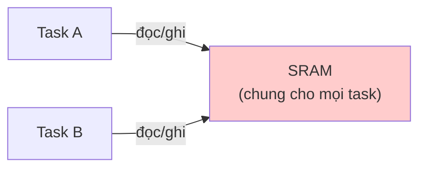
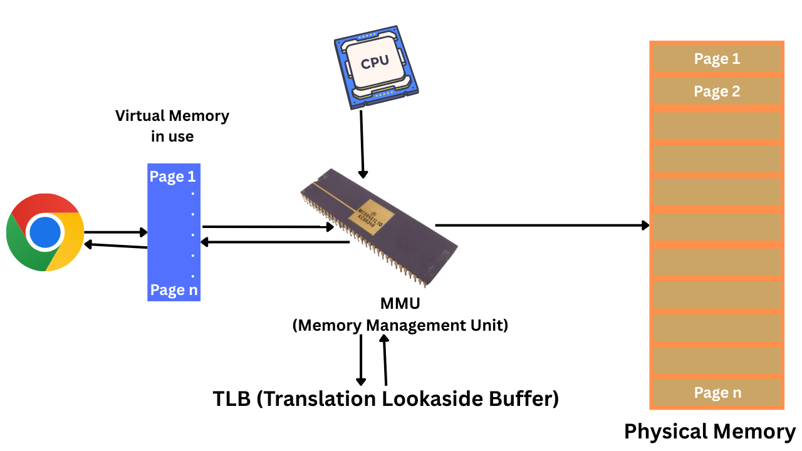
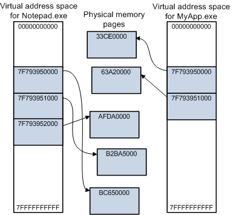
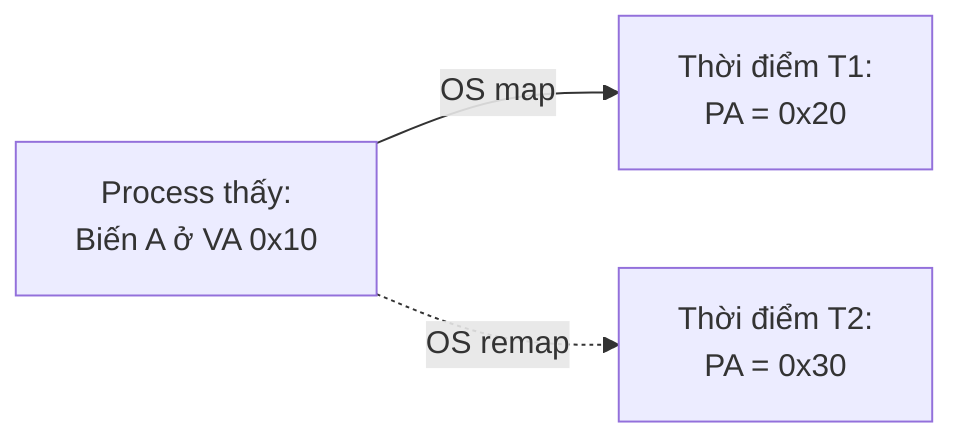
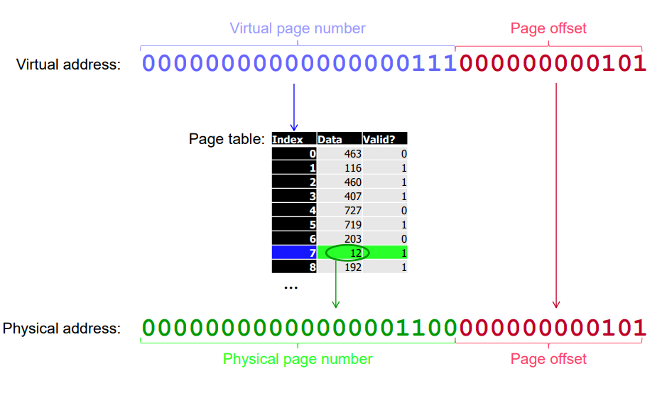
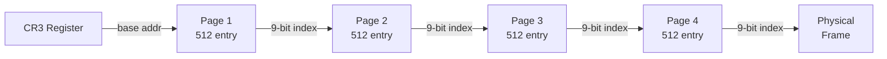
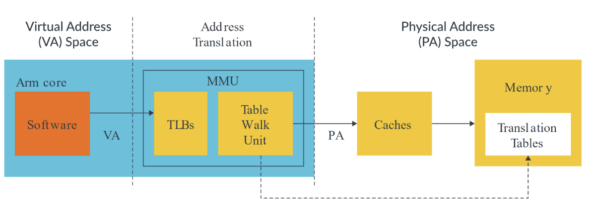
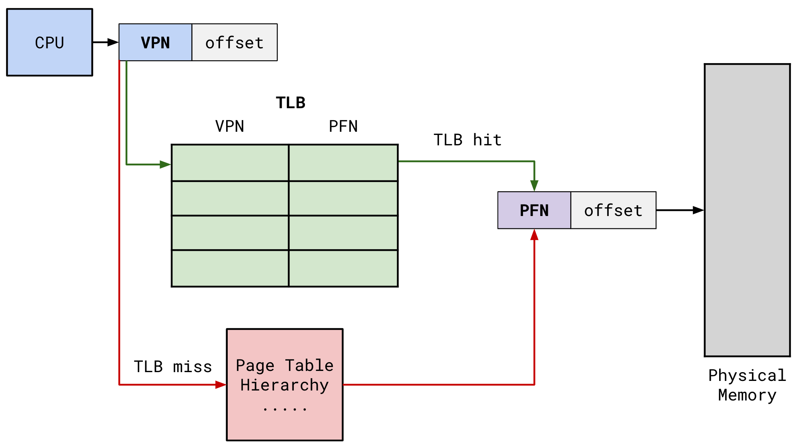
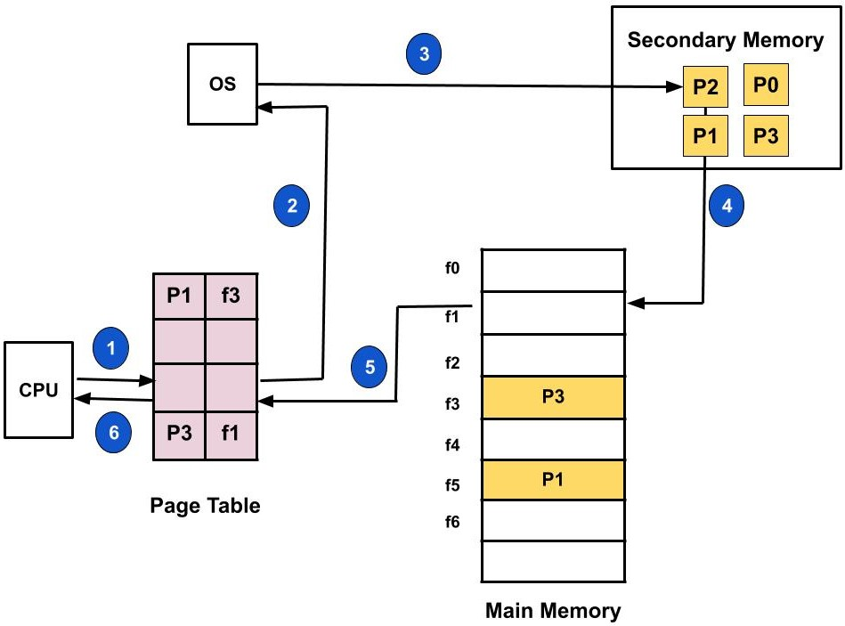

# Virtual memory

## 1. Từ Physical Addressing đến Virtual Memory
 
### 1.1. Mô hình bộ nhớ trên MCU
 
Trước khi tìm hiểu virtual memory, ta cần hiểu cách bộ nhớ hoạt động trên các hệ thống không có virtual memory, điển hình là các vi điều khiển như STM32, ESP32, AVR,...

Khi lập trình trên vi điều khiển, chương trình làm việc trực tiếp với địa chỉ vật lý. Nếu ta ghi vào địa chỉ 0x20001000, đó chính xác là ô nhớ vật lý 0x20001000 trên chip RAM. Mô hình này đơn giản, nhanh, và phù hợp với các hệ thống nhúng chạy một hoặc vài tác vụ cố định. Nhưng khi hệ thống phức tạp hơn, nhiều chương trình chạy đồng thời, bộ nhớ lớn hơn, yêu cầu bảo mật cao hơn thì mô hình này bộc lộ nhiều hạn chế nghiêm trọng.

### 1.2. Những hạn chế của Physical Addressing

#### 1.2.1. Không có sự cô lập giữa các chương trình

Trên MCU, mọi chương trình đều chạy ở trên cùng một không gian địa chỉ. Bất kỳ task nào cũng có thể đọc/ghi vào bất kỳ vùng nhớ trên không gian địa chỉ này, kể cả vùng nhớ không thuộc về nó.



$\rightarrow$ **Hậu quả:** Một task bị lỗi, ví dụ tràn mảng hay con trỏ sai, có thể ghi đè lên vùng nhớ của task khác hoặc thậm chí ghi đè lên code đang chạy. Không có cơ chế phần cứng nào ngăn chặn điều này trên hầu hết MCU thông thường.

Giả sử ta dùng FreeRTOS trên STM32F4 với hai task:

```c
// Task 1: đọc cảm biến nhiệt độ
uint8_t sensor_buffer[64];

void Task_Sensor(void *param) {
    while (1) {
        read_sensor(sensor_buffer, 64);
        vTaskDelay(100);
    }
}

// Task 2: điều khiển motor
uint8_t motor_config[32];

void Task_Motor(void *param) {
    while (1) {
        control_motor(motor_config);
        vTaskDelay(50);
    }
}
```

Hai biến `sensor_buffer` và `motor_config` cùng nằm trong SRAM, có thể chỉ cách nhau vài byte. Nếu `Task_Sensor` có lỗi tràn bộ đệm. Ví dụ cảm biến gửi về nhiều hơn 64 byte - dữ liệu tràn ra sẽ ghi đè thẳng lên `motor_config` hoặc thậm chí lên stack của `Task_Motor`. Kết quả là motor hoạt động sai mà ta debug rất khó tìm ra nguyên nhân vì lỗi xảy ra ở task hoàn toàn khác.

#### 1.2.2. Địa chỉ cố định, không linh hoạt

Khi biên dịch cho vi điều khiển, linker script quy định rõ code nằm ở vùng Ffash nào, ram bắt đầu từ đâu. Nếu ta muốn chạy hai chương trình độc lập, ta phải tự tay chia vùng nhớ cho từng chương trình và đảm bảo chúng không chồng lấn. Việc này cực kỳ cứng nhắc, ta không thể dễ dàng load một chương trình mới vào một vị trí bất kỳ trong RAM.

Khi ta viết linker script cho STM32F103, ta cần quy định rõ ràng:

```
MEMORY
{
    FLASH (rx)  : ORIGIN = 0x08000000, LENGTH = 1024K
    SRAM  (rwx) : ORIGIN = 0x20000000, LENGTH = 128K
}
```

Code luôn chạy từ 0x08000000, RAM luôn bắt đầu từ 0x20000000. Mọi con trỏ hàm, mọi biến toàn cục đều được linker gán địa chỉ cố định tại thời điểm biên dịch.

Bây giờ nếu ta muốn chạy hai chương trình độc lập trên cùng chip. Ví dụ một bootloader và một application, ta phải tự tay chia vùng:

```
Bootloader: 64KB đầu */
FLASH (rx) : ORIGIN = 0x08000000, LENGTH = 64K
SRAM  (rwx): ORIGIN = 0x20000000, LENGTH = 32K

/* Application: phần còn lại */
FLASH (rx) : ORIGIN = 0x08010000, LENGTH = 960K
SRAM  (rwx): ORIGIN = 0x20008000, LENGTH = 96K
```

Mỗi chương trình phải được biên dịch với linker script riêng, biết trước chính xác vùng nhớ của mình. Ta không thể lấy một firmware đã biên dịch cho vùng 0x08010000 rồi chạy nó ở 0x08040000 vì các địa chỉ đã được link cứng vào binary. Nếu muốn thay đổi layout, ta phải biên dịch lại toàn bộ.

#### 1.2.3. Giới hạn phần cứng

MCU thường chỉ có vài chục KB đến vài MB RAM. Nếu chương trình cần nhiều hơn, ta đơn giản là không chạy được. Không có cơ chế nào tự động mở rộng bộ nhớ ra ngoài RAM vật lý.

STM32F103 có 20KB SRAM. Nếu ứng dụng của ta cần xử lý ảnh:

```c
// Mỗi frame 320x240 RGB = 230,400 bytes = 225KB
uint8_t frame_buffer[320 * 240 * 3]; // Không thể cấp phát
```

Lúc này, ta chỉ có hai lựa chọn: giảm độ phân giải, hoặc dùng external RAM (nếu board có) và tự quản lý việc truy cập.

#### 1.2.4. Phân mảnh bộ nhớ

Khi chương trình cấp phát và giải phóng bộ nhớ liên tục, RAM bị phân mảnh thành nhiều khối nhỏ rời rạc. Dù tổng bộ nhớ trống còn đủ nhưng ta không thể cấp phát được một khối liên tục đủ lớn. Trên MCU, ta phải tự quản lý vấn đề này hoặc chấp nhận sống chung với nó.

Giả sử trên STM32, SRAM 20KB, ta cấp phát liên tục:

```c
void *a = pvPortMalloc(4096);   // 4KB - chiếm 0x20000000..0x20000FFF
void *b = pvPortMalloc(4096);   // 4KB - chiếm 0x20001000..0x20001FFF
void *c = pvPortMalloc(4096);   // 4KB - chiếm 0x20002000..0x20002FFF
void *d = pvPortMalloc(4096);   // 4KB - chiếm 0x20003000..0x20003FFF

// Giải phóng a và c
vPortFree(a);   // trống 0x20000000..0x20000FFF
vPortFree(c);   // trống 0x20002000..0x20002FFF

// Tổng trống: 8KB, nhưng...
void *e = pvPortMalloc(8192);   // cần 8KB liên tục → THẤT BẠI!
```

Ta còn 8KB trống nhưng chúng nằm ở hai vùng rời rạc, mỗi vùng 4KB. Trên MCU không có cách nào dồn chúng lại vì các con trỏ đang giữ tham chiếu đến địa chỉ vật lý cố định, di chuyển dữ liệu sẽ làm hỏng toàn bộ con trỏ đang trỏ vào đó.

### 1.3. Ý tưởng của virtual memory

Virtual memory ra đời từ nhu cầu vượt qua chính những hạn chế trên khi hệ thống máy tính phát triển lên quy mô lớn hơn. Ý tưởng cốt lõi là đặt một lớp trừu tượng giữa chương trình và bộ nhớ vật lý. Thay vì làm việc trực tiếp với địa chỉ RAM thật, mỗi chương trình được hệ điều hành cung cấp một không gian địa chỉ ảo riêng biệt. Khi chương trình truy cập một địa chỉ ảo, phần cứng MMU sẽ dịch địa chỉ đó sang địa chỉ vật lý thực sự tại thời điểm truy cập, hoàn toàn trong suốt với chương trình.



Nhờ đó, các chương trình được cô lập hoàn toàn với nhau, có thể được load vào bất kỳ vị trí nào trong RAM vật lý mà không cần biết, có thể sử dụng nhiều bộ nhớ hơn RAM thực có (thông qua swap), và vấn đề phân mảnh được giải quyết ở mức vật lý mà chương trình không hề hay biết.

Lấy ví dụ cụ thể: trên Linux 64-bit, khi ta chạy hai chương trình A và B, cả hai đều có thể có một biến nằm ở địa chỉ ảo 0x00007fff5a3b0000. Nhưng chương trình A thực tế đang dùng ô nhớ vật lý ở 0x1A3F0000, còn chương trình B đang dùng ô nhớ vật lý ở 0x2B710000. Cả hai đều không biết và không cần biết điều này, chúng chỉ làm việc với địa chỉ ảo của mình.

## 2. Đặc điểm của Virtual Memory

### 2.1. Lợi ích của Virtual Memory

#### 2.1.1. Isolation - Cô lập process

Trên hệ điều hành có virtual memory, mỗi tiến trình có một không gian địa chỉ bộ nhớ riêng biệt, điều này làm cho:
- Tiến trình A không thể đọc hoặc ghi vào địa chỉ bộ nhớ của tiến trình B.
- Ngay cả khi cả hai có cùng địa chỉ ảo (ví dụ `0x400000`), chúng sẽ trỏ đến 2 physical address khác nhau.
- OS chịu trách nhiệm duy trì sự cô lập này thông qua page table riêng cho mỗi process.
 


$\rightarrow$ Giúp OS ngăn việc tiến trình A đọc hoặc ghi trái phép vào các vùng nhớ không thuộc về nó. Nếu truy cập sai, phần cứng sẽ phát sinh lỗi (segmentation fault) và OS dừng đúng process lỗi, không ảnh hưởng các process khác.

Tuy nhiên, khi ở kernel mode thì sẽ chỉ có một không gian địa chỉ ảo duy nhất gọi là không gian hệ thống và các đoạn code chạy ở kernel có thể truy cập vào toàn bộ tài nguyên trong hệ thống.

#### 2.1.2. Abstraction - Giấu đi chi tiết vật lý

Trước khi có virtual memory, chương trình phải biết mình nằm ở chỗ nào trong bộ nhớ vật lý như đã nói ở phần [Địa chỉ cố định, không linh hoạt](#122-địa-chỉ-cố-định-không-linh-hoạt). Giờ thì mọi chương trình đều được biên dịch với cùng một layout địa chỉ ảo - code segment, data segment, heap, stack đều ở những vùng địa chỉ ảo quen thuộc. OS lo việc ánh xạ chúng đến bất kỳ vùng RAM vật lý nào còn trống. Chương trình không cần biết và không cần quan tâm mình thực sự nằm ở đâu.

Ngoài ra, khi chương trình chạy hay tiến trình sẽ chỉ biết về địa chỉ ảo, hoàn toàn không biết địa chỉ vật lý tương ứng:
- Địa chỉ ảo của biến A là cố định (ví dụ luôn là `0x10` đối với process).
- Địa chỉ vật lý tương ứng có thể thay đổi - kernel có thể di chuyển page sang frame khác bất cứ lúc nào.
- Chương trình ở user mode không có cách nào biết được địa chỉ vật lý, trừ khi thực hiện system call xuống driver.

Ví dụ: Biến A có địa chỉ ảo là 0x10. Tuỳ thuộc vào OS thì địa chỉ vật lý của nó có thể thay đổi là 0x20, 0x30,...



#### 2.1.3. Efficiency - Tăng hiệu quả dùng RAM

Nhờ cơ chế phân trang (paging) của virtual memory, việc sử dụng ram được tối ưu đáng kể:

**1. Virtual memory cho phép hệ thống máy tính sử dụng bộ nhớ ảo lớn hơn bộ nhớ vật lý có sẵn**

Đây là một đặc điểm mang tính đột phá. Cụ thể, OS có thể đưa những page ít được sử dụng ra ổ đĩa, giải phóng RAM cho các page đang cần. Khi chương trình truy cập lại page đã bị swap ra, phần cứng phát sinh page fault, OS tự động nạp page đó từ ổ đĩa trở lại RAM. Chương trình không hề hay biết, nó chỉ thấy truy cập hơi chậm hơn bình thường. Nhờ vậy, một máy tính 8GB RAM có thể chạy các chương trình tổng cộng sử dụng 16GB hay 20GB bộ nhớ.

**2. Nhiều tiến trình có thể chia sẻ cùng một physical page**

Dù các process được cô lập, OS vẫn có thể ánh xạ cùng một page vật lý vào không gian địa chỉ ảo của nhiều process khi cần. Ví dụ điển hình là shared libraries - thư viện libc chỉ cần load một lần vào RAM vật lý, nhưng hàng trăm process đều có thể ánh xạ nó vào không gian ảo của mình. Mỗi process thấy libc ở một địa chỉ ảo nào đó trong không gian của mình, nhưng tất cả đều trỏ đến cùng các page vật lý. Tiết kiệm rất nhiều RAM.

#### 2.1.4. Protection - Bảo vệ truy cập

Mỗi page table không chỉ chứa ánh xạ địa chỉ, mà còn chứa các permission bits đại diện cho các quyền riêng:
| Bit | Ý nghĩa |
|-----|---------|
| **R (Read)** | Cho phép đọc dữ liệu từ page |
| **W (Write)** | Cho phép ghi dữ liệu vào page |
| **X (Execute)** | Cho phép thực thi code trên page |
| **U/S (User/Supervisor)** | Xác định page thuộc user space hay kernel space |
| **P (Present)** | Page có đang nằm trong RAM không |

Ví dụ:
- Code segment được đánh dấu đọc và thực thi nhưng không write.
- Stack có thể được đánh dấu không thực thi để chống một số kiểu tấn công.

Nếu chương trình vi phạm (ví dụ ghi vào page read-only hoặc truy cập trái phép vào không gian hệ thống), CPU sẽ sinh ra một exception gọi là page fault $\rightarrow$ kernel xử lý hoặc kill process.

#### 2.1.5. Flexibility – Quản lý vùng nhớ linh hoạt

Chương trình luôn nhìn thấy bộ nhớ của mình như một dải liên tục. Bên dưới, OS có thể ánh xạ các virtual page liên tục đến các page vật lý nằm rải rác khắp nơi trong RAM. Quay lại ví dụ phân mảnh trên STM32, hai khối 4KB rời rạc không thể ghép thành 8KB liên tục. Với virtual memory, OS chỉ cần ánh xạ hai virtual page liền kề đến hai page vật lý rời rạc đó, chương trình thấy 8KB liên tục mà không biết sự phân mảnh bên dưới.

Ngoài ra, khi chương trình yêu cầu cấp phát bộ nhớ, OS có thể chỉ đánh dấu vùng địa chỉ ảo đó là đã cấp phát mà chưa gán page vật lý nào. Page vật lý chỉ thực sự được cấp khi chương trình lần đầu truy cập vào địa chỉ đó, lúc đó xảy ra page fault và OS mới cấp page thật. Nhờ vậy, một chương trình `malloc(1GB)` không thực sự chiếm 1GB RAM ngay lập tức, mà chỉ chiếm dần khi nó thực sự sử dụng. Đây chính là đặc điểm của virtual memory để hỗ trợ các API như `malloc()`, `mmap()`, `fork()`, copy-on-write,...

### 2.2. Hạn chế của Virtual Memory

#### 2.2.1. Cần phần cứng chuyên dụng

Việc dịch địa chỉ ảo sang địa chỉ vật lý xảy ra ở mọi lần truy cập bộ nhớ, mỗi lần CPU đọc một instruction, đọc một biến, ghi một giá trị, tất cả đều phải đi qua bước dịch địa chỉ. Nếu làm bằng phần mềm thì chậm không thể chấp nhận được, nên cần một đơn vị phần cứng riêng là MMU tích hợp trong CPU. Đây là lý do các MCU nhỏ như Cortex-M0, M3, M4 không có virtual memory vì chúng không có MMU, vì thêm MMU làm tăng độ phức tạp thiết kế và tiêu thụ năng lượng. Chỉ các processor lớn hơn như Cortex-A mới có MMU.

#### 2.2.2. Hiệu năng không dự đoán được

Đây là hạn chế quan trọng nhất trong ngữ cảnh real-time. Trên MCU, ta có thể tính chính xác một hàm mất bao nhiêu CPU cycle vì mọi truy cập bộ nhớ đều có thời gian cố định. Với virtual memory, cùng một dòng code có thể chạy trong 10ns (dữ liệu trong cache, TLB hit) hoặc 10ms (TLB miss, page fault, đọc từ swap) - chênh lệch cỡ một triệu lần. Đối với hệ thống điều khiển cần phản hồi trong vài microsecond, sự bất định này là không chấp nhận được.


| Tình huống | Thời gian truy cập | Ghi chú |
|---|---|---|
| TLB hit, data in L1 cache | ~1-2 ns | Trường hợp tốt nhất |
| TLB hit, data in RAM | ~100 ns | Bình thường |
| TLB miss → page table walk | ~400 ns | 4 lần truy cập RAM |
| Page fault (minor) | ~1-10 μs | Cấp page mới |
| Page fault (major, từ SSD) | ~100 μs | Đọc từ SSD |
| Page fault (major, từ HDD) | ~5-10 ms | Đọc từ HDD |

#### 2.2.3. Tiêu tốn bộ nhớ

Page table, các cấu trúc VMA (Virtual Memory Area) trong kernel, metadata cho mỗi page vật lý - tất cả đều chiếm RAM. Trên Linux, mỗi page vật lý 4KB có một struct `page` khoảng 64 bytes để quản lý. Một máy 16GB RAM có khoảng 4 triệu page, riêng các struct `page` đã chiếm khoảng 256MB. Thêm page table cho mỗi process, mỗi process có thể chiếm vài KB đến vài MB chỉ riêng cho page table. Trên MCU với vài chục KB RAM, việc dành bộ nhớ cho overhead như vậy là không thể chấp nhận được.

## 3. Page Table

### 3.1. Khái niệm

Như chúng ta đã thảo luận, virtual memory tạo ra một lớp trừu tượng, mỗi process làm việc với địa chỉ ảo còn MMU dịch sang địa chỉ vật lý. Vậy câu hỏi đặt ra là: MMU dựa vào đâu để biết địa chỉ ảo X ánh xạ đến địa chỉ vật lý Y? Câu trả lời chính là page table.

Page table là một cấu trúc dữ liệu do kernel quản lý được lưu trong RAM, đóng vai trò như một bảng tra cứu cho MMU. Mỗi process có một page table riêng và khi process đó đang chạy, MMU sử dụng page table của nó để dịch mọi địa chỉ ảo sang địa chỉ vật lý mà CPU phát ra.

### 3.2. Tại sao không ánh xạ theo byte

Cách đơn giản nhất là lưu ánh xạ cho từng byte: byte ảo 0 nằm ở byte vật lý nào, byte ảo 1 nằm ở byte vật lý nào,... Nhưng hãy tính thử: trên hệ thống 32-bit, không gian địa chỉ có 2^32 = khoảng 4 tỷ byte. Mỗi entry trong bảng cần ít nhất 4 byte để lưu địa chỉ vật lý tương ứng. Vậy bảng tra cứu sẽ cần 4 tỷ × 4 byte = 16GB. Chỉ riêng bảng tra cứu cho một process đã lớn hơn toàn bộ RAM mà nó quản lý. Hoàn toàn không khả thi.

Thay vì ánh xạ từng byte, hệ thống gom nhiều byte liền kề thành một khối có kích thước cố định gọi là page. Kích thước thông thường của một page là 4KB, nhưng kích thước này có thể thay đổi tùy thuộc vào kiến trúc hệ thống. Ví dụ: 2MB hoặc 1GB trong các hệ thống với page lớn.

Bên phía physical memory, RAM cũng được chia thành các khối có cùng kích thước gọi là page frame. Page table lúc này chỉ cần lưu ánh xạ giữa virtual page và page frame - số lượng entry giảm đi hàng nghìn lần.

Tính lại: trên hệ thống 32-bit, 4GB / 4KB = khoảng 1 triệu page. Mỗi entry 4 byte, bảng chỉ cần 4MB.

### 3.3. Cấu trúc của Virtual Address

Một virtual address được chia thành 2 phần chính:
- Index của page table: Dựa vào index này để tìm page frame tương ứng
- Page offset: Được giữ nguyên vì bên trong mỗi page, cấu trúc dữ liệu không thay đổi. chỉ có khối page được đặt ở vị trí khác trong RAM vật lý.

Ví dụ: Khi process truy cập địa chỉ ảo `0x00007005` trên hệ thống 32-bit với page 4KB, hệ thống tách địa chỉ đó thành hai phần:



Nhìn vào hình vẽ trên, hệ thống lấy số thứ tự page bằng 7 làm index tra bảng page table, tìm thấy entry nói rằng virtual page 7 ánh xạ đến page frame 12 (địa chỉ vật lý bắt đầu tại `0x00012000`). Ghép page frame với offset: `0x00012000 + 0x005 = 0x00012005`. Đó là địa chỉ vật lý thật.

### 3.4. Page table entry

Mỗi dòng trong page table được gọi là Page Table Entry (PTE). Nó không chỉ chứa địa chỉ page frame mà còn chứa các bit trạng thái quan trọng.

Ví dụ: Mỗi PTE trên x86-64 chứa:

```
┌─────────────────────────────────────────────────────────────────┐
│ Bit 63: NX │ Bit 12-51: Physical Frame Number │ Bit 0-11: Flags │
└─────────────────────────────────────────────────────────────────┘
```

Các flag quan trọng:
 
| Bit | Tên | Ý nghĩa |
|-----|-----|---------|
| 0 | P (Present) | Page này có đang nằm trong RAM không. Nếu bit này bằng 0, khi truy cập sẽ phát sinh page fault để OS xử lý - có thể page đang nằm trong swap hoặc chưa được cấp phát thật |
| 1 | R/W (Read/Write) | Page này có được phép ghi không. Nếu chương trình cố ghi vào page read-only, CPU phát sinh fault. |
| 2 | U/S (User/Supervisor) | User space có được truy cập page này không. Các page của kernel được đánh dấu supervisor-only sẽ ngăn chương trình user truy cập vào bộ nhớ kernel. |
| 5 | A (Accessed) | CPU tự động set bit này khi page được truy cập. Kernel dùng thông tin này để quyết định page nào ít dùng, nên swap ra khi cần giải phóng RAM. |
| 6 | D (Dirty) | CPU tự động set khi page bị ghi. Kernel dùng bit này để biết page nào đã bị thay đổi và cần ghi lại ra đĩa trước khi giải phóng. |
| 63 | NX (No-Execute) | 1 = không cho phép thực thi |

OS sẽ sử dụng các bit trạng thái này để quản lý bộ nhớ thông qua một struct `page` - ta có thể tìm hiểu chi tiết trong file `/linux/mm_types.h`.

### 3.5. Multi-level Page Table

Trên hệ thống 64-bit sử dụng 48 bit cho địa chỉ ảo. Với page 4KB thì page table cần `2^48 / 4096 = 2^36`, tức khoảng 68 tỷ entry. Mỗi entry 8 byte thì riêng page table đã chiếm `68 tỷ × 8 = 512GB`. Đó là cho một process và đa số các entry sẽ trống vì một process thông thường chỉ dùng một phần rất nhỏ của không gian địa chỉ ảo, có thể chỉ vài MB đến vài GB. Lãng phí khổng lồ. $\rightarrow$ Tổ chức page table thành nhiều cấp

#### 3.5.1. Ý tưởng

Hãy hình dung một cuốn danh bạ điện thoại cho cả nước Việt Nam. Cách đơn giản nhất là liệt kê tất cả mọi người theo thứ tự, một danh sách duy nhất hàng chục triệu dòng. Đây giống page table một cấp.

Cách thực tế hơn là chia theo cấp: đầu tiên tra theo tỉnh/thành phố, rồi tra theo quận/huyện, rồi tra theo phường/xã, cuối cùng mới đến danh sách cụ thể. Nếu một tỉnh không có ai bạn cần tìm, bạn bỏ qua toàn bộ tỉnh đó, không cần giữ danh sách chi tiết cho tỉnh đó.

Page table nhiều cấp hoạt động y hệt. Thay vì một bảng khổng lồ, chúng ta tách thành nhiều bảng nhỏ liên kết với nhau theo cấp. Bảng cấp trên chứa con trỏ đến bảng cấp dưới. Nếu một vùng địa chỉ ảo không được sử dụng, bảng cấp trên ghi không có gì tại entry đó và toàn bộ các bảng cấp dưới tương ứng không cần tồn tại.

#### 3.5.2. Cách hoạt động

Trên x86-64 với 48-bit địa chỉ ảo, linux sử dụng page table 4 cấp (từ kernel 4.12 trở đi hỗ trợ 5 cấp, nhưng 4 cấp là phổ biến). Địa chỉ ảo 48 bit được tách thành 5 phần:

Ví dụ địa chỉ ảo 48-bit:

```
┌─────────┬─────────┬─────────┬─────────┬──────────┐
│ Cấp 1   │ Cấp 2   │ Cấp 3   │ Cấp 4   │ Offset   │
│ (9 bit) │ (9 bit) │ (9 bit) │ (9 bit) │ (12 bit) │
└─────────┴─────────┴─────────┴─────────┴──────────┘
```

9 bit nghĩa là mỗi bảng có `2^9 = 512` entry. Mỗi entry 8 byte, nên mỗi bảng chiếm đúng `512 × 8 = 4KB` - vừa khít một page. 12 bit offset cuối cùng dùng để xác định vị trí trong page, giống như page table một cấp.

Quá trình tra cứu diễn ra tuần tự qua 4 bước. Lấy 9 bit đầu, tra vào bảng cấp 1, được con trỏ đến bảng cấp 2. Lấy 9 bit tiếp, tra vào bảng cấp 2, được con trỏ đến bảng cấp 3. Lấy 9 bit tiếp, tra vào bảng cấp 3, được con trỏ đến bảng cấp 4. Lấy 9 bit tiếp, tra vào bảng cấp 4, được địa chỉ page frame. Cuối cùng ghép page frame với 12 bit offset để ra địa chỉ vật lý.
 


#### 3.5.3. Tại sao cách này tiết kiệm bộ nhớ

Giả sử một process chỉ dùng 8MB bộ nhớ ảo - một vùng nhỏ cho code và một vùng nhỏ cho stack. Với page table một cấp, ta vẫn cần 512GB cho bảng tra cứu vì phải có entry cho mọi virtual page có thể tồn tại.

Với page table 4 cấp, ta cần một bảng cấp 1 (4KB) với 512 entry, nhưng hầu hết entry đều đánh dấu "không có gì". Chỉ có vài entry trỏ đến bảng cấp 2, vài entry ở cấp 2 trỏ đến cấp 3, và tương tự. Tổng cộng có thể chỉ cần vài chục KB cho toàn bộ page table, thay vì 512GB.

Nói cách khác, page table một cấp phải mô tả toàn bộ không gian địa chỉ ảo dù dùng hay không. Page table nhiều cấp chỉ mô tả những vùng thực sự được sử dụng - những nhánh không dùng đến đơn giản là không tồn tại.

#### 3.5.4. Trade-off

Không có gì miễn phí. Page table một cấp chỉ cần một lần truy cập RAM để tra cứu. Page table 4 cấp cần 4 lần truy cập RAM liên tiếp - mỗi cấp một lần. Đây là sự đánh đổi: tiết kiệm bộ nhớ lưu trữ page table, nhưng mỗi lần dịch địa chỉ chậm hơn. Và đây chính là lý do cần có TLB - một khái niệm ta sẽ tìm hiểu ở phần sau.

## 4. Memory Management Unit - MMU

Từ những phần trước, chúng ta biết rằng mỗi process có page table riêng lưu trong RAM, chứa thông tin ánh xạ địa chỉ ảo sang địa chỉ vật lý. Nhưng ai là người thực hiện việc tra cứu page table mỗi khi CPU truy cập bộ nhớ?

Nếu để OS làm việc này, mỗi lần CPU đọc một instruction hay đọc một biến, OS phải chạy code để tra page table - bản thân code đó cũng cần truy cập bộ nhớ, lại phải tra page table tiếp, tạo thành vòng lặp vô tận. Và ngay cả nếu giải quyết được vòng lặp đó, việc dùng phần mềm để dịch địa chỉ ở mọi lần truy cập bộ nhớ sẽ chậm đến mức không thể sử dụng được.

Vì vậy cần một khối phần cứng nằm ngay trong CPU, tự động thực hiện việc dịch địa chỉ mà không cần phần mềm can thiệp. Khối đó là MMU - Memory Management Unit.

### 4.1. MMU là gì?

MMU là một thành phần phần cứng nằm bên trong CPU core, đặt giữa CPU và bộ nhớ. Mọi địa chỉ mà CPU phát ra đều đi qua MMU trước khi ra đến bus bộ nhớ. CPU không bao giờ trực tiếp gửi địa chỉ ảo ra bộ nhớ vật lý - MMU chặn lại, dịch sang địa chỉ vật lý, rồi mới cho truy cập tiếp.

Luồng hoạt động như sau:



Dựa vào hình trên ta có thể diễn giải:

Khi CPU thực hiện lệnh, ví dụ:

```asm
MOV #1, [0x7fff1234]
```

Thì ở đây, `0x7fff1234` là địa chỉ ảo.

MMU sẽ thực hiện như sau:
- Nhận địa chỉ ảo đó.
- Tra bảng page table
- Có thể kết hợp với thông tin TLB nằm trong cache
- Xuất ra địa chỉ vật lý thật để gửi tới bus địa chỉ.

### 4.2. MMU làm những gì?

**1. Dịch địa chỉ**

Đây là chức năng chính. MMU nhận địa chỉ ảo từ CPU, tách thành số page và offset như chúng ta đã thảo luận ở phần page table, tra page table để tìm page frame tương ứng, ghép với offset để ra địa chỉ vật lý. Quá trình này xảy ra hoàn toàn bằng phần cứng, trong vài nanosecond nếu thông tin có sẵn trong TLB.

**2. Kiểm tra quyền truy cập**

Khi tra page table, MMU đồng thời đọc các bit trạng thái trong page table entry. Nếu CPU đang ở user mode mà cố truy cập page chỉ dành cho kernel, MMU chặn lại. Nếu CPU cố ghi vào page read-only, MMU chặn lại. Mỗi lần chặn, MMU phát sinh một tín hiệu lỗi (fault) báo cho CPU biết.

**3. Phát sinh page fault**

Khi MMU tra page table và thấy present bit bằng 0 - nghĩa là page đó chưa có trong RAM (có thể chưa được cấp phát thật, hoặc đã bị swap ra đĩa) - MMU phát sinh page fault. CPU tạm dừng chương trình đang chạy, chuyển sang chạy code xử lý fault trong kernel. Kernel sẽ xử lý tùy tình huống: cấp phát page vật lý mới, nạp dữ liệu từ đĩa, hoặc nếu truy cập không hợp lệ thì gửi tín hiệu segmentation fault đến process.

### 4.3. MMU lưu page table như thế nào?

CPU có một thanh ghi đặc biệt trỏ đến bảng cấp 1 của page table. Trên x86-64, thanh ghi này là CR3. Mỗi khi OS chuyển đổi giữa các process, kernel cập nhật CR3 để trỏ đến page table của process mới. Từ đó MMU tự động sử dụng page table đúng cho process đang chạy.

```
Process A đang chạy:  CR3 → page table của A
        ↓ context switch
Process B đang chạy:  CR3 → page table của B
```

Chỉ kernel mới có quyền thay đổi CR3. Process ở user mode không thể thay đổi, nên không thể tự ý chuyển sang page table của process khác.

## 5. Translation Lookaside Buffer - TLB

Ở phần page table nhiều cấp, chúng ta biết rằng mỗi lần dịch một địa chỉ ảo, MMU phải truy cập RAM 4 lần liên tiếp - mỗi cấp page table một lần. Mỗi lần truy cập RAM mất khoảng 100 nanosecond. Vậy riêng việc dịch địa chỉ đã mất khoảng 400ns, trong khi bản thân việc đọc dữ liệu thật cũng chỉ mất thêm 100ns nữa. Nghĩa là hệ thống chậm đi 5 lần so với khi không có virtual memory.

Và đây không phải chuyện hiếm - CPU truy cập bộ nhớ liên tục, mỗi lần thực hiện instruction, mỗi lần đọc biến, mỗi lần ghi giá trị đều cần dịch địa chỉ. Nếu mỗi lần đều tra page table 4 cấp trong RAM, hiệu năng sẽ tệ đến mức không thể chấp nhận.

Tuy nhiên, ta có thể để ý thấy một đặc điểm trong cách chương trình truy cập bộ nhớ: chúng có tính cục bộ rất cao. Khi CPU đang thực thi một hàm, nó liên tục truy cập các instruction nằm gần nhau - tức cùng một page. Khi hàm đó đọc ghi biến cục bộ trên stack, các biến đó cũng nằm gần nhau - cùng một hoặc vài page. Nghĩa là trong một khoảng thời gian ngắn, CPU thường chỉ truy cập lặp đi lặp lại một số ít page.

Mà kết quả dịch địa chỉ cho một page không thay đổi - nếu virtual page 5 ánh xạ đến page frame 2, thì mọi lần truy cập vào virtual page 5 đều cho cùng kết quả. Vậy tại sao phải tra page table lại 4 lần cho mỗi lần truy cập, trong khi kết quả giống hệt lần trước?

### 5.1. TLB là gì?

TLB là một cache nhỏ nằm bên trong MMU, nhằm lưu lại kết quả của những lần dịch địa chỉ gần đây. Mỗi entry trong TLB lưu một cặp: số virtual page và page frame tương ứng, kèm các bit quyền truy cập.

Khi CPU phát ra một địa chỉ ảo, MMU không tra page table trong RAM ngay. Thay vào đó, MMU kiểm tra TLB trước. Nếu virtual page đó có trong TLB (gọi là TLB hit), MMU lấy kết quả ngay lập tức - chỉ mất vài nanosecond, không cần truy cập RAM lần nào. Chỉ khi virtual page không có trong TLB (gọi là TLB miss), MMU mới phải tra page table 4 cấp trong RAM, và sau khi tra xong thì lưu kết quả vào TLB cho những lần sau.



### 5.2. Kích thước và hiệu quả

TLB rất nhỏ - thường chỉ 64 đến 1024 entry, tùy loại CPU. Nghe có vẻ ít, nhưng mỗi entry đại diện cho một page 4KB. Với 512 entry, TLB bao phủ 512 × 4KB = 2MB bộ nhớ. Nhờ tính cục bộ của chương trình, tỷ lệ TLB hit trong thực tế thường đạt gần 99%. Nghĩa là trong 100 lần truy cập bộ nhớ, chỉ có khoảng 1 lần phải tra page table trong RAM, 99 lần còn lại lấy kết quả từ TLB gần như không mất thêm thời gian.

Đây là lý do virtual memory hoạt động hiệu quả trong thực tế - về lý thuyết mỗi lần truy cập phải tra page table 4 cấp rất tốn kém, nhưng TLB giúp tránh được chi phí đó trong đại đa số trường hợp.

### 5.3. Khi nào TLB bị xóa

TLB lưu ánh xạ của process đang chạy. Khi OS chuyển sang process khác, page table thay đổi (CR3 trỏ đến page table mới), nên các entry trong TLB không còn đúng nữa. Lúc này OS phải xóa TLB (gọi là TLB flush). Sau khi xóa, process mới bắt đầu chạy với TLB trống, lần truy cập đầu tiên đều là TLB miss - MMU phải tra page table trong RAM. TLB sẽ dần được lấp đầy trở lại khi process chạy.

Đây là một chi phí ẩn của context switch mà nhiều người không nghĩ đến. Chuyển process không chỉ mất thời gian lưu và khôi phục thanh ghi CPU, mà còn mất hiệu năng do TLB bị xóa sạch - hàng trăm lần truy cập bộ nhớ sau đó đều chậm hơn bình thường cho đến khi TLB "nóng" trở lại.

### 5.4. Ví dụ: Quan sát ảnh hưởng của TLB với perf
 
Ta có thể dùng `perf` để đo số lần TLB miss trên Linux. Chương trình dưới đây so sánh truy cập tuần tự (sequential - ít TLB miss vì cùng page) với truy cập ngẫu nhiên (random - nhiều TLB miss vì nhảy qua nhiều page):
 
```c
#include <stdio.h>
#include <stdlib.h>
#include <string.h>
#include <time.h>
 
#define ARRAY_SIZE (256 * 1024 * 1024)      // 256MB
#define NUM_ACCESSES (10 * 1000 * 1000)     // 10 triệu lần truy cập
 
int main(int argc, char *argv[]) {
    char *array = malloc(ARRAY_SIZE);
    if (!array) { perror("malloc"); return 1; }
    memset(array, 1, ARRAY_SIZE);
    
    volatile char sink;
    
    if (argc > 1 && strcmp(argv[1], "random") == 0) {
        printf("=== RANDOM ACCESS ===\n");

        unsigned int seed = 42;
        for (long i = 0; i < NUM_ACCESSES; i++) {
            // Mỗi lần nhảy đến page ngẫu nhiên trong 256MB
            // 256MB / 4KB = 65536 page → dễ vượt quá TLB (chỉ ~512-1024 entry)
            long idx = ((long)rand_r(&seed) * 4096) % ARRAY_SIZE;
            sink = array[idx];
        }
    } else {
        printf("=== SEQUENTIAL ACCESS ===\n");
        for (long i = 0; i < NUM_ACCESSES; i++) {
            sink = array[i % ARRAY_SIZE];
        }
    }
    
    free(array);
    return 0;
}
```
 
**Cách chạy:**
 
```bash
$ gcc -O1 -o tlb_demo tlb_demo.c

# Sequential - ít TLB miss
$ perf stat -e dTLB-load-misses,dTLB-loads ./tlb_demo sequential
=== SEQUENTIAL ACCESS ===
 Performance counter stats:
        12,345    dTLB-load-misses    #  0.01% of all dTLB loads
   100,234,567    dTLB-loads

# Random - nhiều TLB miss  
$ perf stat -e dTLB-load-misses,dTLB-loads ./tlb_demo random
=== RANDOM ACCESS ===
 Performance counter stats:
    45,678,901    dTLB-load-misses    # 45.68% of all dTLB loads
   100,000,000    dTLB-loads
```
 
**Quan sát:**
- **Sequential:** chỉ ~0.01% TLB miss - CPU truy cập cùng page liên tục, TLB luôn hit.
- **Random:** ~45% TLB miss - nhảy khắp 256MB (65536 page), TLB chỉ chứa ~512 entry nên liên tục bị evict.
- Thời gian chạy random chậm hơn đáng kể vì mỗi TLB miss phải page table walk (4 lần truy cập RAM).

## 6. Không gian bộ nhớ của Process

### 6.1 Virtual Address Space Layout

Mỗi process có một **virtual address space** riêng biệt, thường được tổ chức như sau:

```
High Address (0xFFFFFFFF)
┌─────────────────────────┐
│       Kernel Space      │ ← Chỉ kernel access được
│    (1GB on 32-bit)      │   
├─────────────────────────┤
│                         │
│         Stack           │ ← Grows downward
│          │              │   
│          ▼              │   
│                         │
│       (Unused)          │
│                         │
│          ▲              │   
│          │              │   
│         Heap            │ ← Grows upward  
│                         │
├─────────────────────────┤
│    Shared Libraries     │ ← libc, libpthread, etc.
├─────────────────────────┤
│       BSS Segment       │ ← Uninitialized global vars
├─────────────────────────┤  
│      Data Segment       │ ← Initialized global vars
├─────────────────────────┤
│      Text Segment       │ ← Program code (read-only)
└─────────────────────────┘
Low Address (0x00000000)
```

:::warning Chú ý
**Mỗi process "nghĩ" mình có toàn bộ address space:**
- 32-bit: Mỗi process có 4GB virtual address space (0x00000000 → 0xFFFFFFFF)
- 64-bit: Mỗi process có 256TB virtual address space

**Nhưng thực tế chỉ một phần nhỏ được map với physical memory:**
:::

### 6.2. Process Memory Segments chi tiết

**1. Text Segment (Code)**
- Chứa machine code của chương trình  
- Bộ nhớ Read-only, executable

**2. Data Segment**  
- Khởi tạo các biến global và static
- Bộ nhớ Read-Write
- Có giá trị khởi tạo từ executable file

**3. BSS Segment**
- Khởi tạo cá biến global và static với giá trị bằng 0.  
- Bộ nhớ Read-Write  
- Được kernel zero-fill khi load.

**4. Heap**
- Cấp pháp bộ nhớ động (`malloc`, `new`)
- Grows upward (tăng địa chỉ)
- Được quản lý bởi allocator (`glibc`)

**5. Stack**
- Local variables, function parameters, return addresses
- Grows downward (giảm địa chỉ)  
- Tự động cleanup khi function returns

**6. Shared Libraries**
- Các thư viện liên kết động (`.so` files)
- Shared memory giữa các process

### 6.3 Virtual Memory Areas (VMAs)

Từ các phần trước, ta biết mỗi process có một không gian địa chỉ ảo riêng. Nhưng process không sử dụng toàn bộ không gian đó - trên hệ thống 64-bit với 48-bit address space, không gian ảo có 256TB, trong khi một process thông thường chỉ dùng vài MB đến vài GB. Phần lớn không gian ảo là trống, không thuộc về process.

Vậy kernel cần một cách để ghi nhận: vùng nào trong không gian địa chỉ ảo là hợp lệ, vùng nào process được phép sử dụng, mỗi vùng có đặc tính gì. VMA (Virtual Memory Area) chính là cấu trúc dữ liệu mà kernel dùng để lưu thông tin này.

#### 6.3.1. VMA là gì?

Mỗi VMA mô tả một vùng địa chỉ ảo liên tục mà process đang sở hữu. Một VMA chứa các thông tin: địa chỉ bắt đầu, địa chỉ kết thúc, quyền truy cập (đọc, ghi, thực thi), và vùng này ánh xạ đến đâu (file trên đĩa hay không ánh xạ đến gì cả).

Một process không có một VMA duy nhất mà có nhiều VMA, mỗi VMA cho một vùng bộ nhớ có đặc tính khác nhau. Ví dụ khi ta chạy một chương trình đơn giản, kernel tạo ra các VMA:

```
Low Virtual Address (0x00000000)
    │
    ├── VMA 1: code (text segment)
    │   địa chỉ: 0x00400000 - 0x00410000
    │   quyền: đọc + thực thi
    │   ánh xạ từ: file /usr/bin/my_program
    │
    ├── VMA 2: dữ liệu đã khởi tạo (data segment)
    │   địa chỉ: 0x00410000 - 0x00412000
    │   quyền: đọc + ghi
    │   ánh xạ từ: file /usr/bin/my_program
    │
    ├── VMA 3: heap
    │   địa chỉ: 0x00500000 - 0x00600000
    │   quyền: đọc + ghi
    │   ánh xạ từ: không (anonymous)
    │
    ├── VMA 4: shared library (ví dụ libc)
    │   địa chỉ: 0x7f1000000000 - 0x7f1000200000
    │   quyền: đọc + thực thi
    │   ánh xạ từ: file /lib/x86_64-linux-gnu/libc.so
    │
    ├── VMA 5: stack
    │   địa chỉ: 0x7ffc00000000 - 0x7ffc00800000
    │   quyền: đọc + ghi
    │   ánh xạ từ: không (anonymous)
    │
High Virtual Address (0xFFFFFFFF)
```

Khoảng trống giữa các VMA là vùng không hợp lệ - process không được truy cập. Nếu truy cập vào khoảng trống đó, page fault xảy ra, kernel tìm không thấy VMA nào chứa địa chỉ đó, và gửi `SIGSEGV`.

#### 6.3.2. Hai loại VMA

**File-backed VMA** là vùng có nội dung ánh xạ từ một file trên đĩa. Code segment ánh xạ từ file chương trình, shared library ánh xạ từ file `.so`. Khi page fault xảy ra trên vùng này mà page chưa có trong RAM, kernel biết phải đọc dữ liệu từ file nào, vị trí nào trong file.

**Anonymous VMA** là vùng không gắn với file nào. Heap và stack thuộc loại này. Khi page fault xảy ra, kernel cấp page frame mới và xóa sạch bằng zero - vì không có dữ liệu từ disk để nạp.

Phân biệt này ảnh hưởng trực tiếp đến cách kernel xử lý page fault.

#### 6.3.3. VMA và page table khác nhau như thế nào

Đây là điểm hay bị nhầm lẫn. Hai cấu trúc này phục vụ hai mục đích khác nhau.

Page table phục vụ MMU - nó lưu ánh xạ cụ thể từ virutal page nào đến page frame vật lý nào, để MMU dịch địa chỉ ở mỗi lần truy cập bộ nhớ. Page table chỉ biết "page này có present không, trỏ đến đâu, quyền gì".

VMA phục vụ kernel - nó lưu ý định của process về bộ nhớ ở mức cao hơn. VMA biết "vùng này dùng để làm gì, ánh xạ từ file nào, process xin vùng này qua system call nào". Page table không lưu những thông tin này.

Khi page fault xảy ra, MMU chỉ biết "tôi không dịch được địa chỉ này". Kernel phải tra VMA để hiểu tại sao page đó chưa có và cần xử lý ra sao. Nếu không có VMA, kernel không biết fault do lazy allocation, do swap, do file mapping, hay do truy cập bất hợp lệ - tất cả đều trông giống nhau từ góc nhìn page table.

#### 6.3.4. Quan sát VMA trên Linux

Ta có thể xem danh sách VMA của bất kỳ process nào qua:

```bash
cat /proc/<pid>/maps
```

Output sẽ có dạng:

```
00400000-00410000 r-xp 00000000 08:01 12345  /usr/bin/my_program
00410000-00412000 rw-p 00010000 08:01 12345  /usr/bin/my_program
00500000-00600000 rw-p 00000000 00:00 0
7f1000000000-7f1000200000 r-xp 00000000 08:01 67890  /lib/libc.so
7ffc00000000-7ffc00800000 rw-p 00000000 00:00 0      [stack]
```

Mỗi dòng là một VMA. Cột đầu là khoảng địa chỉ, cột thứ hai là quyền (r=đọc, w=ghi, x=thực thi, p=private), cột cuối là file ánh xạ nếu có. Những dòng không có tên file là anonymous VMA.

Khi cần kiểm tra nhanh một process đang dùng bao nhiêu bộ nhớ, ta sử dụng:

```bash
cat /proc/<pid>/status | grep Vm
```

Output sẽ có dạng:

```
VmPeak:   512000 kB
VmSize:   480000 kB
VmLck:         0 kB
VmPin:         0 kB
VmHWM:    120000 kB
VmRSS:    100000 kB
VmData:    80000 kB
VmStk:      8192 kB
VmExe:      2048 kB
VmLib:     32000 kB
VmPTE:       512 kB
VmSwap:     4096 kB
```

Mỗi dòng là một con số tổng hợp từ tất cả VMA của process. Đi qua từng dòng:
- **VmSize** là tổng kích thước không gian địa chỉ ảo mà process đang sở hữu - tổng kích thước tất cả VMA cộng lại. Con số này bao gồm cả những vùng chưa được cấp page vật lý do lazy allocation. Vì vậy VmSize có thể rất lớn mà process thực tế không dùng nhiều RAM.
- **VmPeak** là giá trị VmSize cao nhất từng đạt được trong suốt vòng đời của process. Hữu ích khi ta muốn biết process từng xin bao nhiêu bộ nhớ ảo ở thời điểm cao điểm.
- **VmRSS** (Resident Set Size) là lượng RAM vật lý mà process đang thực sự chiếm giữ tại thời điểm hiện tại. Đây là con số quan trọng nhất khi ta muốn biết process đang dùng bao nhiêu RAM thật. So sánh VmRSS với VmSize cho ta thấy hiệu ứng của lazy allocation - VmSize có thể gấp nhiều lần VmRSS.
- **VmHWM** (High Water Mark) là giá trị VmRSS cao nhất từng đạt được. Giúp ta biết process từng chiếm nhiều RAM vật lý nhất là bao nhiêu, dù hiện tại có thể đã giảm do kernel thu hồi page hoặc process giải phóng bộ nhớ.
- **VmData** là tổng kích thước các VMA dành cho data - bao gồm heap và các vùng anonymous private. Khi ta malloc và sử dụng bộ nhớ, con số này tăng.
- **VmStk** là kích thước VMA dành cho stack của thread chính.
- **VmExe** là kích thước VMA chứa code của chương trình - tức text segment ánh xạ từ file binary.
- **VmLib** là tổng kích thước VMA ánh xạ từ shared libraries - libc, libpthread, và các thư viện khác mà chương trình dùng.
- **VmPTE** là lượng RAM mà page table của process chiếm. Đây chính là overhead quản lý mà chúng ta đã nói ở phần hạn chế của virtual memory. Process dùng nhiều vùng bộ nhớ rải rác sẽ có VmPTE lớn hơn vì cần nhiều nhánh page table hơn.
- **VmSwap** là lượng bộ nhớ của process đang nằm trong swap trên đĩa - đã bị kernel đưa ra khỏi RAM. Nếu con số này lớn, process sẽ gặp major page fault thường xuyên khi truy cập lại những vùng đó, ảnh hưởng nghiêm trọng đến hiệu năng.
- **VmLck** là lượng bộ nhớ đã được lock trong RAM bằng `mlock()`, không cho kernel swap ra đĩa. Ứng dụng real-time hoặc ứng dụng bảo mật (giữ khóa mã hóa trong RAM) thường dùng cơ chế này.

Với system programming, đây là công cụ rất hữu ích để hiểu chương trình đang sử dụng bộ nhớ ảo như thế nào - bao nhiêu vùng, mỗi vùng bao lớn, ánh xạ từ đâu, quyền gì.

## 7. Page fault

### 7.1. Page fault là gì?

Page fault là một sự kiện do MMU phát sinh khi nó không thể hoàn thành việc dịch một địa chỉ ảo sang địa chỉ vật lý. Khi điều này xảy ra, MMU không tự giải quyết được - nó tạm dừng lệnh đang thực thi trên CPU và chuyển quyền điều khiển cho kernel để xử lý.

Ba tình huống dẫn đến page fault:
- **Page chưa có trong RAM:** MMU tra page table, thấy present bit bằng 0. Đây là trường hợp phổ biến nhất, xảy ra với lazy allocation (page chưa từng được cấp page frame) và với swap (page đã bị đưa ra đĩa để giải phóng RAM).
- **Vi phạm quyền truy cập:** Page có trong RAM nhưng thao tác không được phép - ví dụ ghi vào page read-only. Đây là trường hợp xảy ra với copy-on-write (page đang được chia sẻ giữa cha và con, bị đánh dấu read-only) hoặc khi chương trình cố ghi vào vùng code.
- **Địa chỉ không hợp lệ:** Chương trình truy cập vào địa chỉ không thuộc bất kỳ vùng nào mà nó đã đăng ký.

### 7.2. Các bước xử lý page fault

Khi page fault xảy ra, kernel thực hiện một chuỗi bước theo thứ tự:

1. Nhận thông tin về fault. CPU tự động lưu lại địa chỉ ảo gây fault và loại thao tác (đọc hay ghi). Trên x86-64, địa chỉ gây fault được lưu trong thanh ghi CR2, loại thao tác nằm trong error code mà CPU đẩy lên stack. Kernel đọc các thông tin này để biết chuyện gì vừa xảy ra.
2. Tìm VMA chứa địa chỉ gây fault. Kernel tìm trong danh sách VMA của process xem địa chỉ đó thuộc vùng nào. Nếu không thuộc bất kỳ VMA nào - ví dụ chương trình dereference con trỏ `0xDEAD` - kernel kết luận đây là truy cập bất hợp lệ, gửi `SIGSEGV` đến process, kết thúc xử lý. Process nhận segmentation fault và thường bị dừng.
3. Kiểm tra quyền. Nếu địa chỉ nằm trong VMA hợp lệ, kernel kiểm tra thao tác có phù hợp với quyền của VMA không. Ví dụ process cố ghi vào vùng mà VMA đánh dấu chỉ đọc (như vùng code). Nếu quyền không khớp và cũng không phải trường hợp copy-on-write, kernel gửi `SIGSEGV`.
4. Xác định loại fault và xử lý. Đến đây kernel biết fault là hợp lệ - địa chỉ đúng, quyền hợp lý - và cần cấp hoặc chuẩn bị page vật lý. Tùy tình huống cụ thể, kernel xử lý khác nhau:
   - Nếu page chưa bao giờ được truy cập (lazy allocation), kernel cấp một page frame mới, xóa sạch nội dung bằng zero, tạo ánh xạ trong page table.
   - Nếu page đang ở trong swap, kernel tìm vị trí page trên đĩa (thông tin này được lưu trong page table entry thay cho địa chỉ vật lý khi page bị swap ra), đọc dữ liệu từ đĩa vào một page frame mới, tạo ánh xạ trong page table.
   - Nếu page là copy-on-write (page đang chia sẻ giữa các process, bị ghi), kernel cấp page frame mới, copy nội dung từ page frame cũ sang, cập nhật page table của process đang ghi để trỏ đến page frame mới với quyền read-write.
   - Nếu page được ánh xạ từ file (memory-mapped file qua mmap), kernel đọc nội dung từ file trên đĩa vào page frame mới, tạo ánh xạ.
5. Cập nhật page table và TLB. Sau khi page frame đã sẵn sàng, kernel ghi entry mới vào page table với present bit bằng 1 và quyền truy cập phù hợp. TLB cũng cần được cập nhật để lần truy cập sau không phải tra page table lại.
6. Quay lại chương trình. Kernel trả quyền điều khiển lại cho process. CPU thực thi lại chính lệnh đã gây fault. Lần này MMU tra page table thành công, lệnh hoàn thành bình thường. Process không hề biết page fault đã xảy ra - từ góc nhìn của nó, lệnh chỉ chạy hơi chậm hơn bình thường.

### 7.3. Minor fault vs major fault

Trong các trường hợp trên, có sự khác biệt rất lớn về thời gian xử lý:

- Minor fault là khi kernel chỉ cần thao tác trong RAM - cấp page frame mới, copy page, hoặc thiết lập ánh xạ. Thời gian xử lý cỡ vài microsecond. Lazy allocation và copy-on-write thường gây minor fault.
- Major fault là khi kernel phải đọc dữ liệu từ đĩa - nạp page từ swap hoặc từ file. Thời gian xử lý cỡ vài millisecond, chậm hơn minor fault hàng trăm đến hàng nghìn lần, vì tốc độ đĩa chậm hơn RAM rất nhiều.

Với system programming, phân biệt hai loại này rất quan trọng. Minor fault là chi phí chấp nhận được và khó tránh. Major fault là dấu hiệu hệ thống đang thiếu RAM hoặc pattern truy cập bộ nhớ không tốt - đây thường là điểm cần tối ưu.

### 7.4. Cách quan sát page fault

#### 7.4.1. Quan sát bằng /usr/bin/time

Trên Linux, ta có thể đo page fault của một chương trình đơn giản bằng:

```bash
/usr/bin/time -v ./my_program
```

Trong output sẽ có hai dòng:

```
Minor (reclaiming a frame) page faults: 1024
Major (requiring I/O) page faults: 3
```

Con số này cho ta biết chương trình gây bao nhiêu minor và major fault trong suốt quá trình chạy - từ đó đánh giá được hành vi sử dụng bộ nhớ của chương trình.

#### 7.4.2. Quan sát bằng perf

`perf` mạnh hơn `/usr/bin/time` rất nhiều vì nó cho phép đo chi tiết hơn và theo dõi theo thời gian thực.

**Cách đơn giản nhất:**

```bash
perf stat ./my_program
```

Output:

```
Performance counter stats for './my_program':

        150.23 msec task-clock
           512      page-faults
     1,200,000      dTLB-load-misses
       800,000      dTLB-store-misses
        50,000      iTLB-load-misses
```

Trong đó:
- `page-faults` là tổng minor và major fault.
- `dTLB-load-misses` là số lần TLB miss khi đọc dữ liệu.
- dTLB-store-misses khi ghi dữ liệu
- iTLB-load-misses khi fetch instruction.

Những con số TLB miss này giúp ta đánh giá hiệu quả truy cập bộ nhớ của chương trình - liên quan trực tiếp đến phần TLB mà chúng ta đã tìm hiểu.

**Nếu muốn tách riêng minor và major fault:**

```bash
perf stat -e minor-faults,major-faults ./my_program
```

Output:

```
5,120   minor-faults
12      major-faults
```

**Nếu chương trình đang chạy và ta muốn xem page fault đang xảy ra ở đâu trong code:**

```bash
perf record -e page-faults ./my_program
perf report
```

`perf record` ghi lại mỗi lần page fault xảy ra cùng với vị trí trong code - hàm nào, dòng nào gây fault. `perf report` hiển thị kết quả dạng bảng, sắp xếp theo số lượng fault giảm dần. Từ đó ta biết chính xác phần nào của chương trình gây nhiều page fault nhất để tập trung tối ưu.

## 8. Demand paging

Thực ra demand paging là tên gọi chung cho cơ chế mà chúng ta đã gặp nhiều lần trong các phần trước. Ý tưởng cốt lõi rất đơn giản: kernel không nạp page vào RAM cho đến khi process thực sự truy cập page đó. Nói cách khác, page chỉ được đưa vào RAM theo yêu cầu (on demand), không phải chuẩn bị trước.



Lazy allocation mà chúng ta sẽ tìm hiểu chính là một dạng của demand paging - malloc xin bộ nhớ nhưng kernel chưa cấp page vật lý, chỉ khi process ghi vào thì mới cấp. Nhưng demand paging không chỉ dừng ở đó, nó bao trùm mọi tình huống mà page được nạp từ disk vào RAM tại thời điểm truy cập.

### 8.1. Các tình huống demand paging xảy ra

**1. Khi chạy một chương trình**

Giả sử ta chạy một chương trình có file binary 50MB. Nếu không có demand paging, kernel sẽ đọc toàn bộ 50MB từ đĩa vào RAM rồi mới bắt đầu chạy - mất thời gian và tốn RAM. Với demand paging, kernel tạo các VMA file-backed ánh xạ từ file binary, nhưng không đọc bất kỳ byte nào từ đĩa. Page table đánh dấu tất cả các page là not present.

Khi CPU bắt đầu thực thi instruction đầu tiên, page fault xảy ra. Kernel đọc page chứa instruction đó từ file binary vào RAM. Chương trình chạy tiếp, gặp page khác chưa có, fault lại, kernel đọc tiếp. Nếu chương trình chỉ thực thi 2MB code trong tổng số 50MB, thì chỉ 2MB được đọc từ đĩa - 48MB còn lại không bao giờ chạm đến.

**2. Khi nạp shared library**

Tương tự, khi process dùng libc hay bất kỳ thư viện nào, kernel tạo VMA ánh xạ file .so nhưng không đọc ngay. Chỉ những hàm thư viện mà process thực sự gọi mới được nạp vào RAM. Nếu libc có hàng nghìn hàm nhưng chương trình chỉ dùng printf và malloc, thì chỉ các page chứa code của những hàm đó được nạp.

**3. Khi đọc file qua `mmap`**.

Khi ta `mmap` một file 1GB, kernel tạo VMA nhưng không đọc gì từ đĩa. Process truy cập vào phần nào của file thì phần đó mới được đọc vào RAM.

**4. Khi page bị swap ra rồi truy cập lại**

Kernel đã swap một page ra disk để giải phóng RAM. Khi process truy cập lại page đó, fault xảy ra, kernel đọc từ swap về RAM.

### 8.2. Demand paging so với nạp toàn bộ

Để thấy rõ lợi ích, hãy so sánh hai cách khi chạy một chương trình 50MB dùng thư viện libc 2MB và malloc 100MB heap:

**Nạp toàn bộ (không demand paging):**

1. Đọc 50MB binary từ đĩa vào RAM
2. Đọc 2MB libc từ đĩa vào RAM
3. Cấp 100MB RAM cho heap, zero toàn bộ
$\rightarrow$ Tốn 152MB RAM ngay lập tức
$\rightarrow$ Chương trình phải đợi đọc xong đĩa mới bắt đầu chạy

**Demand paging:**

1. Tạo VMA cho binary, libc, heap - gần như tức thời
2. Chương trình bắt đầu chạy ngay
3. Chỉ nạp page nào được truy cập

$\rightarrow$ Nếu thực tế chỉ dùng 2MB code + 500KB libc + 5MB heap
$\rightarrow$ Chỉ tốn khoảng 7.5MB RAM
$\rightarrow$ Chương trình khởi động nhanh hơn rất nhiều

### 8.3. Trace-off

Mỗi page được nạp lần đầu đều thông qua page fault, và mỗi page fault có chi phí xử lý. Trong giai đoạn đầu khi chương trình mới chạy, page fault xảy ra rất dồn dập vì page nào cũng chưa có trong RAM. Giai đoạn này chương trình chạy chậm hơn bình thường do liên tục bị gián đoạn bởi fault. Sau khi các page thường dùng đã được nạp hết, fault giảm dần và chương trình chạy ở tốc độ bình thường.

Với ứng dụng cần hiệu năng ổn định ngay từ đầu - ví dụ ứng dụng real-time hoặc game cần tránh giật ở giây đầu tiên - demand paging có thể là vấn đề. Trong những trường hợp đó, lập trình viên có thể dùng các biện pháp để ép nạp trước:

```c
// Cách 1: mlock - ép toàn bộ vùng nhớ vào RAM ngay
char *buf = mmap(..., 100MB, ...);
mlock(buf, 100MB);

// Cách 2: madvise - gợi ý kernel nạp trước
char *buf = mmap(..., 100MB, ...);
madvise(buf, 100MB, MADV_WILLNEED); 

// Cách 3: chạm vào từng page thủ công
char *buf = malloc(100MB);
for (int i = 0; i < 100MB; i += 4096) {
    buf[i] = 0;
}
```

Mỗi cách có đặc điểm khác nhau. `mlock` mạnh nhất - page được nạp ngay và không bao giờ bị swap ra disk. `madvise` với `MADV_WILLNEED` nhẹ nhàng hơn - kernel nạp trước nhưng vẫn có thể swap ra nếu cần. Cách thứ ba đơn giản nhất nhưng thô - ta tự gây page fault cho từng page.

## 9. Cơ chế Copy-on-write

### 9.1. Vấn đề khi không có cơ chế Copy-on-write

Như ta đã biết. Khi một process gọi `fork()`, OS tạo ra một process con là bản sao của process cha. Process con có không gian địa chỉ ảo giống hệt cha - cùng code, cùng dữ liệu, cùng stack, mọi biến đều có cùng giá trị tại thời điểm fork.

Cách đơn giản nhất để thực hiện điều này là copy toàn bộ bộ nhớ vật lý của process cha sang một vùng mới cho process con. Nếu process cha đang dùng 500MB RAM, OS sẽ cấp thêm 500MB, copy từng byte một. Cách này tuy đúng nhưng rất lãng phí, vì hai lý do.

Thứ nhất, việc copy 500MB mất rất nhiều thời gian. Thứ hai, trong rất nhiều trường hợp, process con sau khi `fork` sẽ gọi `exec()` ngay để chạy chương trình khác - lúc đó toàn bộ 500MB vừa copy bị vứt bỏ hoàn toàn, thay bằng chương trình mới. Công copy trở nên vô nghĩa.

### 9.2. Copy-on-write hoạt động như thế nào?

Thay vì copy bộ nhớ ngay, OS làm một việc thông minh hơn đó là tại thời điểm `fork`, OS không copy bất kỳ page vật lý nào. Thay vào đó, OS tạo cho process con một page table mới, nhưng các entry trong page table con đều trỏ đến cùng các page frame vật lý mà process cha đang dùng. Hai process chia sẻ toàn bộ bộ nhớ vật lý.

Tuy nhiên, cả hai page table đều được đánh dấu là read-only - kể cả những page mà trước đó process cha có quyền ghi.

```
Process cha                    Process con
Page table A                   Page table B
┌─────────────────────────┐   ┌─────────────────────────┐
│ page ảo 0 → frame 5 (RO)│   │ page ảo 0 → frame 5 (RO)│
│ page ảo 1 → frame 2 (RO)│   │ page ảo 1 → frame 2 (RO)│
│ page ảo 2 → frame 9 (RO)│   │ page ảo 2 → frame 9 (RO)│
└─────────────────────────┘   └─────────────────────────┘
           │                              │
           └──────── cùng trỏ đến ────────┘
                            │
                RAM vật lý (không copy)
```

Lúc này `fork` trở nên rất nhanh - OS chỉ cần tạo page table mới và copy các entry, không copy dữ liệu thật. Dù process cha dùng 500MB, `fork` gần như tức thời.

### 9.3. Khi nào copy thực sự xảy ra

Cả hai process tiếp tục chạy và đọc bộ nhớ bình thường - đọc thì không có vấn đề gì vì dữ liệu giống nhau, cả hai đều đọc từ cùng page vật lý.

Nhưng khi một trong hai process cố ghi vào một page, MMU phát hiện page đó đang là read-only, nên phát sinh page fault. Kernel nhận fault này, kiểm tra và nhận ra đây không phải lỗi thật - đây là page đang được chia sẻ theo cơ chế copy-on-write. Lúc này kernel mới thực hiện việc copy:

- Cấp phát một page frame mới
- Copy nội dung từ page frame cũ sang page frame mới
- Cập nhật page table của process đã ghi, trỏ đến page frame mới với quyền read-write
- Process còn lại vẫn trỏ đến page frame cũ

### 8.4. Ví dụ: Quan sát Copy-on-Write
 
```c
#include <stdio.h>
#include <stdlib.h>
#include <string.h>
#include <unistd.h>
#include <sys/wait.h>
 
void print_rss(const char* label, int pid) {
    char cmd[256];
    snprintf(cmd, sizeof(cmd),
        "cat /proc/%d/status 2>/dev/null | grep VmRSS | "
        "awk '{printf \"[PID %%d] %%s RSS = %%s %%s\\n\", %d, \"%s\", $2, $3}'",
        pid, pid, label);
    system(cmd);
}
 
int main() {
    printf("Copy-on-write Demo\n\n");
    
    // Cấp phát và ghi toàn bộ 50MB
    size_t size = 50 * 1024 * 1024;  // 50MB
    char *buf = malloc(size);
    memset(buf, 'A', size);  // force all pages allocated
    
    printf("=== Parent trước fork ===\n");
    print_rss("Parent BEFORE fork", getpid());
    
    pid_t child = fork();
    
    if (child == 0) {
        // === CHILD ===
        printf("\n=== Child ngay sau fork (đang share pages) ===\n");
        print_rss("Child AFTER fork", getpid());
        
        // Ghi 1 byte → trigger 1 CoW fault
        buf[0] = 'X';
        printf("\n=== Child sau khi ghi 1 byte (1 page CoW) ===\n");
        print_rss("Child wrote 1 byte", getpid());
        
        // Ghi 10MB → trigger ~2560 CoW faults
        memset(buf, 'Y', 10 * 1024 * 1024);
        printf("\n=== Child sau khi ghi 10MB ===\n");
        print_rss("Child wrote 10MB", getpid());
        
        // Ghi toàn bộ 50MB → tất cả pages bị copy
        memset(buf, 'Z', size);
        printf("\n=== Child sau khi ghi toàn bộ 50MB ===\n");
        print_rss("Child wrote 50MB", getpid());
        
        free(buf);
        _exit(0);
    } else {
        // === PARENT ===
        wait(NULL);
        printf("\n=== Parent sau khi child kết thúc ===\n");
        print_rss("Parent AFTER child", getpid());
        free(buf);
    }
    
    return 0;
}
```
 
**Output mẫu:**
 
```
Copy-on-Write Demo
 
=== Parent trước fork ===
[PID 1234] Parent BEFORE fork RSS = 52224 kB
 
=== Child ngay sau fork (đang share pages) ===
[PID 1235] Child AFTER fork RSS = 1024 kB        ← Rất nhỏ! Share pages
 
=== Child sau khi ghi 1 byte (1 page CoW) ===
[PID 1235] Child wrote 1 byte RSS = 1028 kB      ← +4KB (1 page copy)
 
=== Child sau khi ghi 10MB ===
[PID 1235] Child wrote 10MB RSS = 11264 kB       ← +~10MB (pages copy dần)
 
=== Child sau khi ghi toàn bộ 50MB ===
[PID 1235] Child wrote 50MB RSS = 52224 kB       ← ~50MB (tất cả pages copy)
 
=== Parent sau khi child kết thúc ===
[PID 1234] Parent AFTER child RSS = 52224 kB     ← Không bị ảnh hưởng
```
 
**Quan sát:**
- Ngay sau `fork`, child RSS rất nhỏ - không copy 50MB, chỉ tạo page table mới
- Ghi 1 byte $\rightarrow$ RSS tăng 4KB - kernel chỉ copy 1 page chứa byte đó
- Ghi 10MB $\rightarrow$ RSS tăng ~10MB - copy dần theo nhu cầu
- Ghi 50MB $\rightarrow$ RSS = 50MB - bây giờ child có bản sao hoàn toàn riêng
- Parent RSS không thay đổi - hai process hoàn toàn độc lập sau CoW

## 10. Cơ chế Lazy Allocation

### 10.1. Bài toán

Khi chương trình gọi `malloc(100 * 1024 * 1024)` để xin cấp pháp 100MB bộ nhớ, có hai cách OS có thể xử lý.

Cách thứ nhất là cấp phát ngay 100MB RAM vật lý, tạo ánh xạ trong page table, trả về cho chương trình. Vấn đề là rất nhiều chương trình xin bộ nhớ lớn nhưng không dùng hết ngay, hoặc chỉ dùng một phần nhỏ. Ví dụ chương trình xin 100MB để làm buffer, nhưng thực tế chỉ ghi vào 2MB đầu tiên. 98MB RAM vật lý bị chiếm mà không ai dùng - trong khi các process khác có thể đang cần bộ nhớ.

Lazy allocation là cách thứ hai: OS không cấp RAM vật lý ngay, chỉ ghi nhận rằng process này được quyền sử dụng một vùng địa chỉ ảo 100MB. RAM vật lý chỉ được cấp khi chương trình thực sự truy cập vào từng page.

### 10.2. Cách hoạt động cụ thể

Khi `malloc` yêu cầu 100MB, bên dưới nó gọi `mmap` hoặc `brk` để xin OS mở rộng không gian địa chỉ ảo. OS xử lý bằng cách tạo một bản ghi nội bộ (trên Linux gọi là VMA - Virtual Memory Area) đánh dấu vùng địa chỉ ảo từ ví dụ 0x7f0000000000 đến 0x7f0006400000 là hợp lệ, có quyền đọc ghi. Nhưng OS không cấp phát bộ nhớ vật lý và tạo ánh xạ nào trong page table cho vùng này - các entry tương ứng đều đánh dấu "not present".

Lúc này `malloc` trả về con trỏ gần như tức thời, vì OS hầu như không làm gì nặng.

Giả sử chương trình bắt đầu ghi dữ liệu:

```c
char *buf = malloc(100 * 1024 * 1024);  // xin 100MB
buf[0] = 'A';        // truy cập byte đầu tiên → page đầu tiên
```

Khi CPU thực thi `buf[0] = 'A'`, MMU tra page table và thấy page này "not present". MMU phát sinh page fault. Kernel nhận fault, kiểm tra VMA và thấy địa chỉ này nằm trong vùng hợp lệ mà process đã xin. Lúc này kernel mới cấp phát một page frame vật lý 4KB, xóa sạch nội dung page đó (ghi zero toàn bộ để tránh rò rỉ dữ liệu từ process khác), tạo ánh xạ trong page table trỏ virtual page này đến page frame vừa cấp, rồi cho CPU chạy lại lệnh ghi. Lần này MMU tra page table thành công, lệnh ghi hoàn thành bình thường.

Nếu chương trình tiếp tục ghi vào vùng khác:

```c
buf[50000] = 'B';    // page khác → page fault → cấp thêm 4KB
buf[8000000] = 'C';  // page khác nữa → page fault → cấp thêm 4KB
```

Mỗi lần truy cập một page mới lần đầu, quá trình trên lặp lại. Nếu chương trình chỉ truy cập 3 page trong vùng 100MB, thì chỉ 12KB RAM vật lý được cấp thật - thay vì 100MB.

### 10.3. Memory Overcommit
 
Linux cho phép **memory overcommit** - cấp nhiều virtual memory hơn physical memory có sẵn:

```c
// System có 4GB RAM, nhưng có thể:
char *ptr1 = malloc(2GB);  // OK
char *ptr2 = malloc(2GB);  // OK  
char *ptr3 = malloc(2GB);  // OK - Total 6GB virtual > 4GB physical!
```

Chỉ khi nào thực sự access memory thì kernel mới phải cấp pháp physical pages. Thông thường, đa số process sẽ không dùng hết. Nhưng nếu tất cả đồng thời dùng hết $\rightarrow$ hệ thống hết RAM $\rightarrow$ kernel gọi **OOM Killer**:

### 10.4. Ví dụ: Quan sát Lazy Allocation

```c
#include <stdio.h>
#include <stdlib.h>
#include <unistd.h>
#include <string.h>

void print_memory_usage(const char* stage) {
    int pid = getpid();
    char cmd[256];
    
    printf("\n=== %s ===\n", stage);
    
    // VmRSS = Resident Set Size (physical memory thực tế)
    snprintf(cmd, sizeof(cmd), 
        "cat /proc/%d/status | grep VmRSS | awk '{print \"Physical memory (RSS): \" $2 \" kB\"}'", pid);
    system(cmd);
    
    // VmSize = Virtual memory size  
    snprintf(cmd, sizeof(cmd),
        "cat /proc/%d/status | grep VmSize | awk '{print \"Virtual memory: \" $2 \" kB\"}'", pid);
    system(cmd);
}

int main() {
    printf("Lazy Allocation Demo\n");
    print_memory_usage("INITIAL STATE");
    
    // Step 1: Allocate 10MB virtual memory
    printf("\n1. Allocating 10MB with malloc()...\n");
    char *big_buffer = malloc(10 * 1024 * 1024);  // 10MB
    
    printf("malloc() returned: %p\n", big_buffer);
    print_memory_usage("AFTER MALLOC (no physical memory yet)");
    
    // Step 2: Touch first page
    printf("\n2. Writing to first byte (trigger page fault)...\n");
    big_buffer[0] = 'A';
    print_memory_usage("AFTER FIRST WRITE (1 page allocated)");
    
    // Step 3: Touch middle of buffer  
    printf("\n3. Writing to middle (5MB offset)...\n");
    big_buffer[5 * 1024 * 1024] = 'B';
    print_memory_usage("AFTER MIDDLE WRITE (2 pages allocated)");
    
    // Step 4: Touch entire buffer (force all pages)
    printf("\n4. Writing entire buffer (force all page faults)...\n");
    memset(big_buffer, 'C', 10 * 1024 * 1024);
    print_memory_usage("AFTER MEMSET (all pages allocated)");
    
    free(big_buffer);
    print_memory_usage("AFTER FREE");
    
    return 0;
}
```

**Output:**

```bash
$ ./lazy_demo
Lazy Allocation Demo

=== INITIAL STATE ===
Physical memory (RSS): 1024 kB
Virtual memory: 4368 kB

1. Allocating 10MB with malloc()...
malloc() returned: 0x7f8a1c000000

=== AFTER MALLOC (no physical memory yet) ===
Physical memory (RSS): 1024 kB      ← Không tăng!
Virtual memory: 14644 kB            ← Tăng 10MB

2. Writing to first byte (trigger page fault)...

=== AFTER FIRST WRITE (1 page allocated) ===
Physical memory (RSS): 1028 kB      ← Tăng 4KB (1 page)
Virtual memory: 14644 kB            ← Không đổi

3. Writing to middle (5MB offset)...

=== AFTER MIDDLE WRITE (2 pages allocated) ===
Physical memory (RSS): 1032 kB      ← Tăng thêm 4KB (1 page nữa)
Virtual memory: 14644 kB            ← Không đổi

4. Writing entire buffer (force all page faults)...

=== AFTER MEMSET (all pages allocated) ===
Physical memory (RSS): 11264 kB     ← Tăng ~10MB (tất cả pages)
Virtual memory: 14644 kB            ← Không đổi

=== AFTER FREE ===
Physical memory (RSS): 1024 kB      ← Trở về ban đầu
Virtual memory: 4368 kB             ← Trở về ban đầu
```

## 11. Swap

### 11.1. Swap là gì?

Từ các phần trước, chúng ta đã biết rằng virtual memory cho phép tổng bộ nhớ mà các process sử dụng lớn hơn RAM vật lý. Swap chính là cơ chế hiện thực hóa điều đó - kernel dùng một phần không gian trên đĩa (ổ cứng hoặc SSD) làm nơi lưu tạm những page mà RAM không đủ chỗ chứa.

Khi kernel cần giải phóng RAM, nó chọn một số page ít được sử dụng, ghi nội dung ra vùng swap trên đĩa, rồi đánh dấu page table entry tương ứng là not present. RAM vật lý được giải phóng cho mục đích khác. Khi process truy cập lại page đã bị swap ra, page fault xảy ra, kernel đọc page từ đĩa về RAM - đây chính là major page fault mà chúng ta đã thảo luận.

**Vùng swap nằm ở đâu?**

Trên Linux có hai hình thức:
- Swap partition - một phân vùng riêng trên đĩa, dành hoàn toàn cho swap. Khi cài Linux, trình cài đặt thường tạo sẵn một phân vùng swap.
- Swap file - một file thông thường trên filesystem, được chỉ định làm swap. Linh hoạt hơn vì ta có thể tạo, thay đổi kích thước, hoặc xóa mà không cần phân vùng lại đĩa.

TA có thể xem swap hiện tại bằng:

```bash
swapon --show
```

Output:

```
NAME       TYPE       SIZE   USED
/dev/sda2  partition  4G     512M
/swapfile  file       2G     0B
```

### 11.2. Khi nào kernel thực hiện swap

Kernel không đợi RAM hết sạch mới bắt đầu swap. Nó liên tục theo dõi tình trạng bộ nhớ và quyết định swap dựa trên nhiều yếu tố.

**1. Khi áp lực bộ nhớ tăng.**

Kernel duy trì một ngưỡng RAM trống tối thiểu. Khi lượng RAM trống giảm xuống gần ngưỡng đó - ví dụ do process mới khởi chạy, do process đang chạy cấp phát thêm bộ nhớ, hoặc do nhiều page được nạp qua demand paging - kernel bắt đầu tìm page để swap ra, giải phóng RAM trước khi hết thật sự. Cơ chế này gọi là **page reclaim**.

**2. Khi cần cấp phát page mà không còn RAM trống**

Ví dụ process gây page fault do lazy allocation, kernel cần một page frame để cấp nhưng RAM đã đầy. Kernel buộc phải swap một page khác ra disk để lấy chỗ.

**3. Dựa trên tham số swappiness**

Linux có tham số `vm.swappiness` (giá trị từ 0 đến 200, mặc định 60) ảnh hưởng đến mức độ kernel ưu tiên swap. Giá trị cao nghĩa là kernel sẵn sàng swap hơn, giá trị thấp nghĩa là kernel cố gắng giữ page trong RAM lâu hơn. Ta xem giá trị hiện tại bằng:

```bash
cat /proc/sys/vm/swappiness
```

### 11.3. Kernel chọn page nào để swap

Không phải page nào cũng có thể swap ra. Kernel phân biệt:

**1. Page có thể swap**

anonymous page (heap, stack, dữ liệu chương trình). Đây là ứng cử viên chính cho swap vì nội dung chỉ tồn tại trong RAM, không có bản sao ở đâu khác ngoài swap.

**2. Page không cần swap mà chỉ cần vứt đi**

Ví dụ page chứa code chương trình hoặc shared library. Nội dung giống hệt file trên đĩa, nên khi cần giải phóng RAM, kernel chỉ cần bỏ page đó đi, không cần ghi ra đâu. Khi process truy cập lại, kernel đọc lại từ file gốc.

**3. Page không được phép swap**

Page đã bị lock bằng `mlock` mà chúng ta đã thảo luận ở phần demand paging, hoặc page của kernel.

Trong các page có thể swap, kernel cần chọn page nào ít được sử dụng nhất. Linux dùng cơ chế gần giống LRU (Least Recently Used) - kernel theo dõi accessed bit trong page table entry mà MMU tự động set khi page được truy cập. Page nào lâu không được truy cập sẽ bị chọn để swap ra trước.

### 11.4. Quá trình swap out và swap in

**Swap out** - đưa page từ RAM ra disk:

```
1. Kernel chọn page ít dùng
2. Nếu page bị dirty (đã bị ghi), ghi nội dung ra vùng swap trên disk
3. Ghi nhận vị trí trên disk vào page table entry (thay cho địa chỉ vật lý)
4. Đánh dấu page table entry là not present
5. Xóa TLB entry tương ứng
6. Giải phóng page frame vật lý
```

**Swap in** - đưa page từ disk về RAM:

```
1. Process truy cập page đã bị swap → page fault (major fault)
2. Kernel đọc vị trí trên disk từ page table entry
3. Cấp page frame mới
4. Đọc dữ liệu từ disk vào page frame
5. Cập nhật page table entry: trỏ đến page frame mới, đánh dấu present
6. Cập nhật TLB
7. CPU thực thi lại lệnh đã gây fault
```

### 11.5. Ảnh hưởng đến hiệu năng

Swap là cơ chế an toàn giúp hệ thống không bị crash khi thiếu RAM, nhưng cái giá về hiệu năng rất lớn. Truy cập RAM mất khoảng 100 nanosecond. Đọc từ SSD mất khoảng 100 microsecond - chậm hơn 1000 lần. Đọc từ HDD mất khoảng 10 millisecond - chậm hơn 100,000 lần. Khi hệ thống swap liên tục, ta sẽ thấy máy chậm đi rõ rệt - hiện tượng này gọi là **thrashing**.

Để kiểm tra hệ thống có đang swap không:

```bash
vmstat 1
```

Output cập nhật mỗi giây:

```
procs -----------memory---------- ---swap--
 r  b   swpd   free   buff  cache   si   so
 2  0  51200  12000  80000 320000    0    0
 3  1  51200   8000  80000 320000  200  400
```

Cột `si` (swap in) và `so` (swap out) cho biết lượng dữ liệu đang được đọc vào và ghi ra swap mỗi giây, tính bằng KB. Nếu hai cột này liên tục có giá trị lớn, hệ thống đang thiếu RAM nghiêm trọng.

## 12. Memory mapping - mmap

Kernel dùng `mmap` để ánh xạ file binary khi chạy chương trình, ánh xạ shared library, và `malloc` bên dưới cũng gọi mmap cho các block lớn. Bây giờ hãy tìm hiểu nó ở góc độ developer.

`mmap` là system call cho phép ta tạo một VMA mới trong không gian địa chỉ ảo của process. Nói đơn giản, ta yêu cầu kernel "cho tôi một vùng địa chỉ ảo, ánh xạ đến cái gì đó" - cái gì đó có thể là một file trên disk hoặc không gì cả (anonymous).

### 12.1. Prototype

```c

#include <sys/mman.h>

void *mmap(void *addr, size_t length, int prot, int flags,
           int fd, off_t offset);
```

**Các tham số:**
- `addr`: địa chỉ ảo mà bạn muốn VMA bắt đầu. Thường truyền `NULL` để kernel tự chọn địa chỉ phù hợp. Nếu bạn chỉ định địa chỉ cụ thể, kernel sẽ cố gắng đặt VMA ở đó nhưng không đảm bảo.
- `length`: kích thước vùng ánh xạ, tính bằng byte. Kernel sẽ làm tròn lên bội số của page size (4KB).
- `prot`: quyền truy cập của vùng ánh xạ. Các giá trị có thể kết hợp:
  - `PROT_READ`: cho phép đọc
  - `PROT_WRITE`: cho phép ghi
  - `PROT_EXEC`: cho phép thực thi,
  - `PROT_NONE`: không cho truy cập gì.
- `flags`: cách ánh xạ hoạt động. Đây là tham số phức tạp nhất, tôi sẽ giải thích riêng bên dưới.
- `fd`: file descriptor của file cần ánh xạ. Nếu ánh xạ anonymous (không gắn file), truyền -1.
- `offset`: vị trí bắt đầu trong file, phải là bội số của page size.

### 12.2. Hai loại ánh xạ chính

**File mapping** - ánh xạ nội dung một file vào bộ nhớ ảo:

```c
int fd = open("/path/to/file", O_RDONLY);
char *data = mmap(NULL, file_size, PROT_READ, MAP_PRIVATE, fd, 0);

// Bây giờ truy cập file giống như truy cập mảng

char first_byte = data[0];
char last_byte = data[file_size - 1];
```

Sau khi `mmap`, ta đọc file bằng cách truy cập con trỏ trực tiếp - không cần gọi `read`, không cần quản lý buffer. Kernel tạo VMA file-backed, và nhờ demand paging, chỉ những page ta thực sự truy cập mới được đọc từ đĩa vào RAM.

**Anonymous mapping** - cấp phát vùng nhớ không gắn với file nào:

```c
char *buf = mmap(NULL, 100 * 1024 * 1024, PROT_READ | PROT_WRITE,
                 MAP_PRIVATE | MAP_ANONYMOUS, -1, 0);
```

Kernel tạo VMA anonymous, và nhờ lazy allocation, page vật lý chỉ được cấp khi ta truy cập. Đây chính là cách `malloc` cấp phát block lớn bên dưới.

### 12.3. Các flag quan trọng

- `MAP_PRIVATE`: thay đổi trên vùng ánh xạ chỉ process hiện tại nhìn thấy. Nếu là file mapping, khi bạn ghi vào vùng đó, kernel dùng copy-on-write: tạo bản sao page riêng cho process bạn, file gốc trên đĩa không bị thay đổi. Nếu nhiều process cùng mmap một file với MAP_PRIVATE, ban đầu tất cả chia sẻ cùng page vật lý, chỉ khi process nào ghi thì process đó mới có bản sao riêng.

- `MAP_SHARED`: thay đổi được chia sẻ giữa tất cả process cùng ánh xạ vùng đó, và nếu là file mapping thì thay đổi sẽ được ghi lại xuống file trên đĩa. Đây là cơ chế chính để hai process giao tiếp qua shared memory:

    ```c
    // Process A
    char *shared = mmap(NULL, 4096, PROT_READ | PROT_WRITE,
                        MAP_SHARED, fd, 0);
    shared[0] = 'H';  // Process B sẽ thấy thay đổi này

    // Process B
    char *shared = mmap(NULL, 4096, PROT_READ | PROT_WRITE,
                        MAP_SHARED, fd, 0);
    printf("%c", shared[0]);  // đọc được 'H'
    ```

- `MAP_ANONYMOUS`: không ánh xạ file nào, kết hợp với `MAP_PRIVATE` để cấp phát bộ nhớ thuần túy, hoặc với `MAP_SHARED` để tạo shared memory giữa process cha và con sau `fork`.

### 12.4. So sánh mmap với read/write

Khi đọc file, ta có hai cách:

```c
// Cách 1: read truyền thống
char buf[4096];
int fd = open("file", O_RDONLY);
read(fd, buf, 4096);  // copy dữ liệu từ kernel buffer → buf

// Cách 2: mmap
char *data = mmap(NULL, file_size, PROT_READ, MAP_PRIVATE, fd, 0);
char byte = data[0];  // truy cập trực tiếp, không copy
```

Với `read`, mỗi lần gọi, kernel đọc dữ liệu từ disk vào kernel buffer rồi copy từ kernel buffer sang buffer của ta trong user space. Có một bước copy thừa.

Với `mmap`, kernel ánh xạ trực tiếp page cache (nơi kernel lưu dữ liệu file trong RAM) vào không gian địa chỉ ảo của process. Ta đọc trực tiếp từ page cache, không copy. Với file lớn và truy cập ngẫu nhiên, `mmap` thường hiệu quả hơn vì tránh overhead của mỗi lần gọi system call `read` và tránh bước copy.

Tuy nhiên mmap không phải lúc nào cũng tốt hơn. Với file nhỏ đọc tuần tự một lần, `read` đơn giản và hiệu quả hơn vì `mmap` có overhead thiết lập VMA và page table. Với file cực lớn mà ta truy cập rải rác, `mmap` có thể gây nhiều major page fault.

### 12.5. Giải phóng mmap

Khi không cần nữa, ta gọi munmap:

```c
munmap(data, length);
```

Kernel xóa VMA, giải phóng page table entry, và page vật lý sẽ được thu hồi khi không còn ai dùng.

### 12.6. Ví dụ: Quan sát mmap() file mapping

`mmap()` cho phép ánh xạ file trực tiếp vào virtual address space. Thay vì dùng `read()`/`write()`, chương trình truy cập file như truy cập mảng - kernel tự động nạp nội dung file khi cần qua page fault:

```c
#include <stdio.h>
#include <stdlib.h>
#include <string.h>
#include <fcntl.h>
#include <unistd.h>
#include <sys/mman.h>
#include <sys/stat.h>
#include <sys/resource.h>

void print_state(const char* label) {
    int pid = getpid();
    char cmd[256];
    struct rusage usage;
    getrusage(RUSAGE_SELF, &usage);
    
    printf("\n=== %s ===\n", label);
    printf("Minor faults: %ld | Major faults: %ld\n", 
           usage.ru_minflt, usage.ru_majflt);
    
    snprintf(cmd, sizeof(cmd),
        "cat /proc/%d/status | grep -E 'VmRSS|VmSize'", pid);
    system(cmd);
}

int main() {
    printf("mmap() File Mapping Demo\n");
    
    // Tạo file test 4MB
    const char *path = "/tmp/mmap_test.dat";
    int fd = open(path, O_RDWR | O_CREAT | O_TRUNC, 0644);
    const size_t file_size = 4 * 1024 * 1024;  // 4MB
    
    // Ghi dữ liệu test
    char *tmp = malloc(file_size);
    memset(tmp, 'A', file_size);
    write(fd, tmp, file_size);
    free(tmp);
    
    print_state("1. Trước mmap");
    
    // mmap file vào virtual address space
    char *mapped = mmap(NULL, file_size, 
                        PROT_READ | PROT_WRITE,
                        MAP_SHARED, fd, 0);
    close(fd);
    
    print_state("2. Sau mmap (chưa truy cập - lazy!)");
    
    // Đọc 1 byte → trigger page fault, kernel đọc page từ file
    volatile char c = mapped[0];
    print_state("3. Đọc 1 byte (1 page từ file)");
    
    // Đọc mỗi page → trigger fault cho từng page
    for (size_t i = 0; i < file_size; i += 4096) {
        c = mapped[i];
    }
    print_state("4. Đọc toàn bộ 4MB (tất cả pages từ file)");
    
    // Ghi → dirty pages, sẽ được kernel sync lại file
    memset(mapped, 'B', file_size);
    print_state("5. Ghi toàn bộ 4MB (dirty pages)");
    
    munmap(mapped, file_size);
    print_state("6. Sau munmap");
    
    unlink(path);
    return 0;
}
```

**Output mẫu:**

```
mmap() File Mapping Demo

=== 1. Trước mmap ===
Minor faults: 150 | Major faults: 0
VmSize:    4368 kB
VmRSS:     1024 kB

=== 2. Sau mmap (chưa truy cập - lazy!) ===
Minor faults: 150 | Major faults: 0           ← Không fault!
VmSize:    8464 kB      ← VmSize tăng 4MB (VMA mới)
VmRSS:     1024 kB      ← RSS không đổi (chưa cấp page)

=== 3. Đọc 1 byte (1 page từ file) ===
Minor faults: 150 | Major faults: 1           ← 1 major fault (đọc từ đĩa)
VmRSS:     1028 kB      ← +4KB

=== 4. Đọc toàn bộ 4MB (tất cả pages từ file) ===
Minor faults: 150 | Major faults: 1024        ← ~1024 major faults (4MB/4KB)
VmRSS:     5120 kB      ← +4MB (toàn bộ file trong RAM)

=== 5. Ghi toàn bộ 4MB (dirty pages) ===
Minor faults: 150 | Major faults: 1024        ← Không thêm fault (pages đã trong RAM)
VmRSS:     5120 kB

=== 6. Sau munmap ===
Minor faults: 150 | Major faults: 1024
VmSize:    4368 kB      ← VmSize trở về (VMA bị xóa)
VmRSS:     1024 kB      ← RSS trở về (pages giải phóng)
```

**Quan sát:**
- `mmap()` rất nhanh - chỉ tạo VMA, không đọc file. VmSize tăng nhưng RSS không đổi.
- Mỗi lần đọc page mới từ file $\rightarrow$ major page fault (kernel đọc 4KB từ đĩa).
- Sau khi page đã trong RAM, ghi vào không gây thêm fault - chỉ đánh dấu dirty.
- `munmap()` giải phóng VMA, dirty pages được kernel sync ngược lại file.