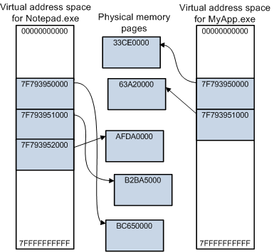
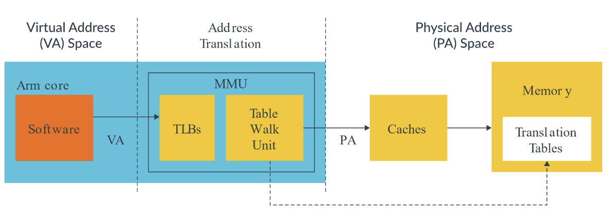

# Virtual memory

## Bối cảnh

Vào những năm 1970, bộ nhớ RAM trong máy tính rất hạn chế và khả năng lưu trữ cũng như xử lý dữ liệu của máy tính bị giới hạn bởi dung lượng bộ nhớ vật lý, ở đây là RAM. Với sự phát triển của các ứng dụng ngày càng yêu cầu bộ nhớ lớn hơn, khái niệm virtual memory đã ra đời để giải quyết vấn đề này.

Virtual memory cho phép hệ thống máy tính sử dụng bộ nhớ ảo lớn hơn bộ nhớ vật lý có sẵn. Cụ thể, một hệ thống với 100MB RAM có thể cung cấp bộ nhớ cho các ứng dụng lên đến 1GB bằng cách sử dụng cơ chế swapping (hoán đổi giữa RAM và disk). Trong cơ chế này, những phần dữ liệu ít được sử dụng sẽ được chuyển từ RAM vào disk, trong khi những phần dữ liệu hay được sử dụng sẽ nằm trong RAM. Cơ chế này giúp hệ thống 100MB RAM có thể hỗ trợ các ứng dụng yêu cầu đến 1GB bộ nhớ.

## Đặc điểm của virtual memory

**Isolation – Cô lập process**

Khi ở user mode, mỗi tiến trình sẽ có một không gian địa chỉ bộ nhớ riêng, điều này làm cho:
- Tiến trình A không thể đọc hoặc ghi vào địa chỉ bộ nhớ của tiến trình B
- Ngay cả khi cả hai có cùng địa chỉ ảo (ví dụ `0x400000`), chúng sẽ trỏ đến 2 physical address khác nhau.



→ Giúp kernel ngăn việc tiến trình A đọc hoặc ghi trái phép vào các vùng nhớ không thuộc về nó.

Tuy nhiên, khi ở kernel mode thì sẽ chỉ có một không gian địa chỉ ảo duy nhất gọi là không gian hệ thống và các đoạn code chạy ở kernel có thể truy cập vào toàn bộ tài nguyên trong hệ thống.

**Abstraction – Giấu đi chi tiết vật lý**

Trước khi có virtual memory, tiến trình phải biết mình nằm ở chỗ nào trong bộ nhớ vật lý. Giờ thì tiến trình sẽ chỉ biết về địa chỉ ảo mà không biết gì về địa chỉ vật lý của nó. Điều này sẽ được kernel ánh xạ thông qua cơ chế page table.

→ Địa chỉ ảo của một biến cố định nhưng địa chỉ vậy lý tương ứng có thể bị thay đổi.

Ví dụ: Biến A có địa chỉ ảo là 0x10. Tuỳ thuộc vào OS thì địa chỉ vật lý của nó có thể thay đổi là 0x20, 0x30,...

Ngoài ra, chương trình chạy ở user mode sẽ không có bất kỳ phương pháp nào để có thể biết được địa chỉ vật lý của nó, trừ khi nó thực hiện system call xuống driver để driver đọc địa chỉ vật lý.

**Efficiency – Tăng hiệu quả dùng RAM**

Nhờ cơ chế page của virtual memory:
- Mỗi tiến trình chỉ nạp những phần thực sự cần vào RAM.
- Phần còn lại có thể swap ra disk.
- Nhiều tiến trình có thể chia sẻ cùng một physical page như shared library.

→ Virtual memory cho phép “RAM logic” lớn hơn “RAM thật”.

**Protection – Bảo vệ truy cập**

Mỗi page trong page table có bit quyền:
- Read / Write / Execute
- User / Supervisor

Nếu chương trình vi phạm (ví dụ ghi vào page read-only hoặc truy cập trái phép vào không gian hệ thống), CPU sinh ra **page fault** → kernel xử lý hoặc kill process.

**Flexibility – Quản lý vùng nhớ linh hoạt**

Nhờ virtual memory, kernel có thể:
- Tạo stack, heap, mmap, shared memory, file mapping…
- Gộp, tách, map, unmap các vùng mà không làm thay đổi code của process.

→ Toàn bộ các cơ chế như malloc(), mmap(), fork(), copy-on-write đều dựa vào lớp ảo hóa này.

## Memory Page

Trong mô hình quản lý bộ nhớ, memory page (hoặc chỉ đơn giản là page) là đơn vị nhỏ nhất mà hệ điều hành sử dụng để quản lý và phân bổ bộ nhớ.

Trong đó virtual memory được tổ chức thành các khối có kích thước bằng nhau gọi là page và physical memory được tổ chức thành các khối có kích thước bằng nhau gọi là frame.

Một page là một vùng bộ nhớ có kích thước cố định mà hệ điều hành sẽ sử dụng để phân bổ bộ nhớ cho các process. Các thông tin của một page như quyền truy cập (đọc, ghi), quyền sở hữu, trạng thái của bộ nhớ, v.v. đều được quản lý thông qua một struct page.

Vì mỗi page chứa nhiều thông tin như vậy, thay vì quản lý bộ nhớ theo từng byte, hệ điều hành quản lý bộ nhớ theo từng page. Kích thước thông thường của một page là 4KB, nhưng kích thước này có thể thay đổi tùy thuộc vào kiến trúc hệ thống. Ví dụ: 2MB hoặc 1GB trong các hệ thống với page lớn.

Trong Linux, việc quản lý memory page được thực hiện thông qua các cấu trúc dữ liệu và bạn có thể tìm hiểu chi tiết về việc này trong file `/linux/mm_types.h`.

## Page Table

Page table là một cấu trúc dữ liệu do kernel quản lý v nằm trên RAM, dùng để ánh xạ giữa các địa chỉ ảo và địa chỉ vậy lý. Mỗi entry nằm trong page table ánh xạ một page trong virtual address space tới một page trong physical address.

=> Số entry của page table trong mỗi process bằng tổng số page của process đó.

Dưới đây là minh hoạ quá trình translate giữa virtual memory và physical memory:

Trong đó một virtual address được chia thành 2 phần chính:
- 1 phần tượng trưng cho index của page table
- 1 phần tượng trưng cho offset trong page.

Nếu một chương trình yêu cầu nhiều bộ nhớ hơn mức có thể chứa trong RAM, thì dữ liệu này có thể được lưu trữ ở một nơi khác, có thể là Disk. Khi chương trình cần dữ liệu này, thông qua Page Table nó cho biết dữ liệu này được lưu ở Disk, lúc này, OS sẽ thực hiện một exception Page Fault để swap dữ liệu cũ nhất trong RAM và dữ liệu mà chương trình cần ở Disk, sau đó, cập nhật Page Table => Đây là lý do RAM có nhiều bộ nhớ giúp tăng hiệu suất hơn.

Tuy nhiên, các page table không thể quản lý trực tiếp tất cả các page trong hệ thống do số lượng bộ nhớ lớn, nên trong các hệ thống hiện đại, chúng thường được chia thành nhiều page table level, do vậy quá trình để ánh xạ từ địa chỉ ảo thành địa chỉ vật lý sẽ phải thông qua nhiều page table trung gian, điều này sẽ làm giảm performance nếu làm thường xuyên => sử dụng TLB.

## Memory Management Unit

Bên trong CPU, có một thành phần phần cứng gọi là MMU. Nó là một phần quan trọng giúp thực hiện translation giữa địa chỉ ảo và địa chỉ vật lý. MMU sử dụng page table để ánh xạ các địa chỉ từ không gian bộ nhớ ảo sang không gian bộ nhớ vật lý. MMU hoạt động trong hai chế độ:
- Virtual mode: Chế độ này cho phép truy cập bộ nhớ ảo. Các địa chỉ ảo được sử dụng khi truy xuất bộ nhớ.
- Protected mode: Trong chế độ này, hệ thống bảo vệ truy cập bộ nhớ giữa các process khác nhau và đảm bảo rằng một process không thể truy cập vào bộ nhớ của process khác.



Dựa vào hình trên ta có thể diễn giải cụ thể như sau:

Khi CPU thực hiện lệnh, ví dụ:

```asm
MOV #1, [0x7fff1234]
```

Thì ở đây, `0x7fff1234` là địa chỉ ảo.

MMU sẽ thực hiện như sau:
- Nhận địa chỉ ảo đó.
- Tra bảng page table
- Có thể kết hợp với thông tin TLB nằm trong cache
- Xuất ra địa chỉ vật lý thật để gửi tới bus địa chỉ.

## Translation Lookaside Buffer

Khi ta sử dụng page table, chúng ta phải truy cập vào bộ nhớ hai lần hoặc nhiều hơn. Đầu tiên, ta cần truy cập vào bộ nhớ để lấy được page table. Thông qua page table này, chúng ta lại truy cập vào bộ nhớ để lấy dữ liệu từ physical memory.

=> Điều này gây tốn thời gian => Khắc phục bằng cách sử dụng Translation Lookaside Buffer – TLB.

TLB là một cache nhỏ và nó là một phần của MMU, nhằm lưu các kết quả translate từ virtual address sang physical address.

Trong trường hợp TLB normal, dữ liệu được truy cập trực tiếp từ thông qua TLB mà không cần truy cập bộ nhớ hai lần trở lên.

Trong trường hợp TLB bị lỗi, OS phải thực hiện tìm page table trong ram và thực hiện load nó vào TLB.

Khi CPU chuyển từ tiến trình này sang tiến trình khác, TLB của tiến trình đang chạy cũng được xóa.

## Cơ chế Copy-On-Write

**Vấn đề khi không có cơ chế copy on write**

Giả sử process A đang chạy, ta gọi `fork` để tạo process B thì process B sẽ copy toàn bộ không gian bộ nhớ của process A (code, data, heap, stack,...). Điều này sẽ gây ra một số hạn chế:
- Làm giảm hiệu năng: Việc copy sẽ gây tốn tài nguyên cpu, ram, cache không cần thiết vì các dữ liệu trong phân vùng `.text`, `.data` thường không thay đổi.
- Không thể mở rộng hệ thống: Trong các hệ thống cần chạy hàng nghìn process nhỏ, thì việc copy liên tục sẽ dễ làm out of memory.

**Ý tưởng của copy on write**

Copy on write là cơ chế trì hoãn việc copy bộ nhớ ngay khi fork, thay vào đó nó sẽ chia sẽ bộ nhớ giữa cha và con cho đến khi một bên ghi thì nó mới copy.

Cơ chế hoạt động:
- Khi fork, kernel sẽ tạo `mm_struct` mới cho process con.
- Copy danh sách Virtual Memory Address từ process cha sang process con -> Lúc này cả hai process sẽ trỏ tới cùng tập physical pages.
- Kernel sẽ đánh dấu tất cả các page table là read only.
- Tăng reference count của page
- Khi mà một process ghi vào page thì CPU phát hiện page đó là read only và sinh ra page fault.
- Lúc này, kernel sẽ xác định đây có phải là vùng copy on write không và thực hiện thao tác sau:
  + Cấp pháp một page mới
  + Copy toàn bộ dữ liệu từ page cũ sang page mới.
  + Gán page mới vào page table của process đã ghi.
  + Đặt quyền read/write cho page mới.
  + Giảm reference count của page cũ.

:::tip
Page cũ chuyển quyền từ read only sang read-write khi reference count của nó là 1.
:::