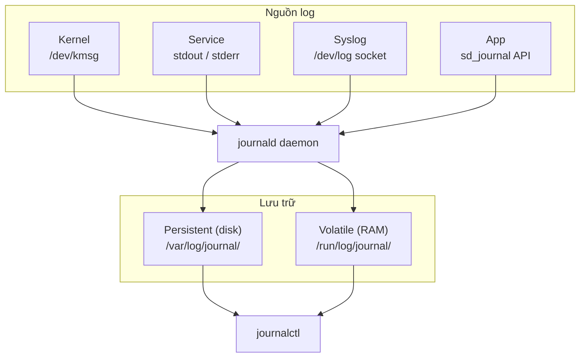

# Init system

## 1. Tổng quan

Init system là chương trình đầu tiên được kernel chạy sau khi kernel hoàn tất quá trình boot, luôn mang PID 1. Nó đóng vai trò là cha của mọi process trong hệ thống.

Init system không bị kill bởi các signal thông thường, và mọi process chết mà không có parent thì kernel sẽ chuyển về cho init system xử lý. Nếu init system chết, hệ thống sẽ kernel panic — tức là sập hoàn toàn.

Nói đơn giản, init system giống như một quản lý tòa nhà — nó mở cửa mọi thứ khi bắt đầu, đảm bảo mọi dịch vụ hoạt động, xử lý sự cố, và đóng cửa mọi thứ đúng trình tự khi kết thúc.

Một số init system phổ biến: SysInit, systemd,...

**Nhiệm vụ chính của init system:**

Khởi tạo userspace — tức là đưa hệ thống từ trạng thái kernel vừa load xong sang trạng thái sẵn sàng sử dụng. Cụ thể:
- Mount các file system quan trọng: `/proc`, `/sys`, `/dev`,...
- Thiết lập mạng
- Khởi động các service cần thiết như network, sshd, udevd,...
- Quản lý vòng đời process  — init system giám sát các service đang chạy, tự động restart nếu service bị crash.
- Xử lý shutdown/reboot — khi ta tắt máy, init system chịu trách nhiệm dừng các service theo đúng thứ tự, unmount filesystem, và tắt hệ thống an toàn.

:::tip Orphan process
Mọi process chết mà không có parent thì kernel sẽ chuyển về cho init system xử lý.
:::

:::tip Kernel tìm init system
Kernel sẽ tìm đường dẫn đến init system theo thứ tự: `/sbin/init`, `/etc/init`, `/bin/init`, `/bin/sh`.
:::

## 2. Daemon

Daemon là một background process được tách khỏi terminal, thường hoạt động liên tục trong hệ thống để cung cấp một dịch vụ nào đó.

**Đặc điểm của daemon:**

Daemon không có terminal điều khiển. Khi ta mở terminal chạy một lệnh thông thường, lệnh đó gắn với terminal — đóng terminal thì lệnh chết. Daemon thì khác, nó tách hoàn toàn khỏi terminal nên cứ chạy mãi cho đến khi bị dừng hoặc hệ thống tắt.

Daemon thường chạy từ lúc boot đến lúc shutdown. Ví dụ quen thuộc là `sshd` (lắng nghe kết nối SSH), `nginx` hay `httpd` (phục vụ web),...Ta sẽ thấy hầu hết daemon có tên kết thúc bằng chữ "d" — đó là quy ước đặt tên trong Unix/Linux để nhận biết daemon.

Một số init system như systemd sẽ chịu trách nhiệm quản lý vòng đời của daemon.

**Cách một process trở thành daemon (theo kiểu truyền thống):**

Trong cách làm cổ điển trước thời systemd, một daemon được tạo ra thông qua các bước được gọi là **daemonize** như sau:
- Đầu tiên nó `fork()` ra một process con, rồi exit process cha đi để shell nghĩ rằng lệnh đã kết thúc.
- Process con sau đó gọi `setsid()` để tạo session mới, tách khỏi terminal.
- Thực hiện `fork()` lần 2 để chắc chắn tách khỏi terminal (option).
- Chuyển thư mục làm việc về `/` để không tránh filesystem.
- Đóng tất cả stdin, stdout, stderr vì không còn terminal để giao tiếp.
- Cuối cùng ghi PID vào file (thường trong `/var/run/`) để các công cụ khác biết daemon đang chạy với PID nào.

## 3. Cơ bản về systemd

### 3.1. Unit là gì?

Unit là đơn vị quản lý cơ bản của systemd — mọi thứ systemd quản lý đều được trừu tượng hóa thành một unit.

Mỗi unit được mô tả bằng một unit file (file văn bản kiểu `INI`).

**Các loại unit phổ biến:**

| Loại | Đuôi file | Dùng để |
| --- | --- | --- |
| Service |	`.service`  | Quản lý daemon/process             |
| Target  |	`.target`   | Nhóm các unit lại, thay runlevel   |
| Timer   |	`.timer`    | Lên lịch chạy (thay cron)          |
| Socket  |	`.socket`   | Socket activation                  |
| Mount   |	`.mount`    | Mount filesystem                   |
| Path    |	`.path`     | Theo dõi file/folder thay đổi      |
| Slice   |	`.slice`    | Nhóm cgroup để giới hạn tài nguyên |
| Device  |	`.device`   | Thiết bị phần cứng                 |

**Vị trí của unit file**

Một unit file thường nằm ở:

```
/lib/systemd/system/  <- Distro cài vào (không sửa trực tiếp)
/etc/systemd/system/  <- Custom service
/run/systemd/system/  <- Runtime, tạm thời, mất sau reboot
```

:::warning Nguyên tắc quan trọng
Muốn custom service của distro -> tạo file override trong `/etc/systemd/system/` thay vì sửa trực tiếp `/lib/systemd/system/`
:::

Cách tạo override an toàn:

```bash
systemctl edit nginx.service
# -> tạo /etc/systemd/system/nginx.service.d/override.conf
```

### 3.2. Cấu trúc unit file

Cấu trúc một unit file gồm các section, mỗi section phục vụ một vai trò rõ ràng:

```ini
[Unit]
Description=My Web Application
Documentation=https://example.com/docs
After=network.target postgresql.service
Requires=postgresql.service

[Service]
Type=simple
User=webapp
WorkingDirectory=/opt/webapp
EnvironmentFile=/etc/webapp/env
ExecStart=/opt/webapp/bin/server --port 8080
ExecReload=/bin/kill -HUP $MAINPID
Restart=on-failure
RestartSec=5s

[Install]
WantedBy=multi-user.target
```

**Ý nghĩa từng section:**

`[Unit]` - Section này cho biết unit này tồn tại trong hệ thống với vai trò gì và phụ thuộc vào những unit nào.

| Cấu hình | Ý nghĩa |
| --- | --- |
| `Description` | Mô tả ngắn, hiển thị trong `systemctl status` |
| `Documentation` | Trỏ tới man page hoặc URL docs |
| `After`/`Before` | Quan hệ thứ tự, không bắt buộc service đó phải tồn tại.<br>- `After` : Khởi động sau unit nào<br>- `Before` : Khởi động trước unit nào |
| `Requires` | Quan hệ phụ thuộc (cứng) — nếu unit kia chết thì unit này cũng chết. |
| `Wants` | Quan hệ phụ thuộc (mềm) — nếu unit kia chết thì unit này vẫn chạy. |
| `BindsTo` | Chặt hơn `Requires` — unit kia stop là stop ngay lập tức. |

`[Service]` — Cấu hình riêng cho service (chỉ có ở unit `.service`)

| Cấu hình | Ý nghĩa |
| --- | --- |
| `Type` | Quyết định cách systemd theo dõi process (xem bên dưới) |
| `ExecStart` | Lệnh gọi chương trình khi start. |
| `ExecStop` | Lệnh gọi chương trình khi stop. |
| `ExecReload` | Lệnh gọi chương trình khi reload. |
| `Restart` | Khi nào tự restart. |

`[Install]` — Cấu hình khi enable/disable

| Cấu hình | Ý nghĩa |
| --- | --- |
| `WantedBy` | Unit này sẽ được kéo vào khi target nào được kích hoạt |
| `RequiredBy` | Tương tự nhưng là phụ thuộc cứng |

**Một số service type như sau:**

| Type | Ý nghĩa |
| --- | --- |
| `simple` | ExecStart là tiến trình chính, systemd theo dõi PID này (mặc định, dùng cho hầu hết các service hiện đại) |
| `forking` | Process sẽ fork rồi exit process cha (dành cho daemon kiểu cũ như Apache, Nginx) |
| `oneshot` | Process chạy một lần rồi thoát (dùng cho script khởi tạo) |
| `notify` | Process phải thông báo cho systemd khi đã sẵn sàng qua `sd_notify()` |
| `dbus` | Sẵn sàng khi đã đăng ký tên trên D-Bus |
| `idle` | Chờ tất cả job khác xong mới chạy |

### 3.3. Target unit

Target là unit dùng để nhóm các unit lại và đại diện cho một trạng thái hệ thống mà systemd dùng để kéo các unit liên quan vào.

Nhìn vào file `multi-user.target` thực tế:

```ini
# # /lib/systemd/system/multi-user.target
[Unit]
Description=Multi-User System
Documentation=man:systemd.special(7)
Requires=basic.target
Conflicts=rescue.service rescue.target
After=basic.target rescue.service rescue.target
AllowIsolate=yes
```

Ta thấy target unit không có `[Service]`, không có `ExecStart` — chỉ có metadata và dependency.

Khi kernel bàn giao quyền điều khiển cho systemd, systemd nhìn vào default target (thường là `graphical.target`) rồi đi ngược lại chuỗi dependency để biết cần khởi động những gì. Systemd kích hoạt cả một chuỗi như sau:

```
graphical.target
│
├── Requires ──► multi-user.target
│                   │
│                   ├── Requires ──► basic.target
│                   │                   │
│                   │                   ├── Requires ──► sysinit.target
│                   │                   │                   │
│                   │                   │                   ├── local-fs.target
│                   │                   │                   ├── swap.target
│                   │                   │                   └── systemd-journald.service
│                   │                   │
│                   │                   ├── sockets.target
│                   │                   └── timers.target
│                   │
│                   ├── Wants ──► nginx.service
│                   ├── Wants ──► postgresql.service
│                   └── Wants ──► sshd.service
│
└── Wants ──► display-manager.service (gdm, sddm...)
```

Mỗi tầng giải quyết một nhóm nhiệm vụ:

| Thứ tự | Target | Nhiệm vụ |
| --- | --- | --- |
| 1 | `sysinit.target` | Mount filesystem, khởi động journald để ghi log, udev để nhận diện phần cứng |
| 2 | `basic.target` | Khởi động socket, timer, chuẩn bị các thứ cơ bản nhất |
| 3 | `multi-user.target` | Tất cả service thông thường |
| 4 | `graphical.target` | Display manager để có giao diện đồ hoạ |

`nginx`, `postgresql`, `sshd`... không phụ thuộc nhau nên systemd khởi động tất cả cùng lúc sau khi `multi-user.target` được kích hoạt. Đây chính là lý do systemd boot nhanh hơn SysV — thay vì khởi động tuần tự từng cái, nó tận dụng song song hóa tối đa.

Ngoài ra, `display-manager` là nhánh riêng của `graphical.target` — chỉ được kéo vào ở tầng này, không phải `multi-user.target`. Nếu ta boot vào `multi-user.target` thì sẽ không có GUI, hoàn toàn hợp lệ với server.

### 3.4. Mount unit

Mount unit là cách systemd quản lý việc mount filesystem, thay thế và mở rộng vai trò của `/etc/fstab` truyền thống.

Mỗi mount point trên hệ thống đều có một mount unit tương ứng.

```
/etc/fstab  (cách cũ)          systemd mount unit (cách mới)
--------------------------     -----------------------------
/dev/sda1 /home ext4 ...   ->  home.mount
/dev/sda2 /data ext4 ...   ->  data.mount
tmpfs /tmp tmpfs ...       ->  tmp.mount
```

**Quy tắc đặt tên**

Tên file `.mount` phải khớp chính xác với mount point, thay `/` bằng `-` và bỏ `/` đầu tiên.

```
Mount point              ->  Tên unit file
---------------------------------------------------
/                        ->  -.mount
/home                    ->  home.mount
/var/log                 ->  var-log.mount
/mnt/data                ->  mnt-data.mount
/mnt/usb/backup          ->  mnt-usb-backup.mount
```

Nếu đặt tên sai -> systemd không nhận và mount sẽ không hoạt động.

Tạo tên chính xác bằng lệnh:

```bash
systemd-escape --path /mnt/usb/backup
# -> mnt-usb-backup

# Ngược lại, từ tên unit ra mount point
systemd-escape --unescape --path mnt-usb-backup
# -> /mnt/usb/backup
```

**Cấu trúc mount unit:**

```ini
[Unit]
Description=Data Storage Mount
Documentation=man:mount(8)
After=local-fs-pre.target network.target
Before=local-fs.target

[Mount]
What=/dev/sdb1          # thiết bị source cần mount
Where=/mnt/data         # mount point
Type=ext4               # loại filesystem
Options=defaults,noatime,nodiratime  # mount options
TimeoutSec=30           # timeout nếu mount không xong sau 30s

[Install]
WantedBy=local-fs.target
```

Ý nghĩa từng trường trong section mount:

| Trường | Ý nghĩa |
| `What=` | Thiết bị hoặc nguồn cần mount. Ví dụ: `/dev/sdb1`, `UUID=xxxx-xxxx`, `192.168.1.10:/share` |
| `Where=` | Mount point, phải khớp tên file unit |
| `Type=` | Loại filesystem. Ví dụ: `ext4`, `nfs`, `tmpfs`, `vfat`... |
| `Options=` | Tùy chọn mount, giống cột thứ 4 trong fstab. |

Với `Type=none` và `Options=bind` -> đây là bind mount.

**Tại sao dùng mount unit thay vì fstab**

fstab hoạt động tốt cho các mount đơn giản lúc boot. Nhưng mount unit cho phép ta kiểm soát thứ tự và dependency chính xác. Ví dụ ta có thể mount partition /data trước, rồi mới mount bind từ `/data/lib/NetworkManager` vào `/var/lib/NetworkManager` rồi mới start `NetworkManager` service. Với `fstab` ta không thể diễn đạt dependency kiểu này.

Mount unit cũng có thể được start và stop lúc runtime:

```bash
systemctl start var-lib-NetworkManager.mount
systemctl stop var-lib-NetworkManager.mount
```

Và systemd theo dõi trạng thái mount. Nếu mount fail, các service phụ thuộc vào nó sẽ không được start và ta thấy rõ lỗi trong log.

**Mối quan hệ giữa fstab và mount unit**

systemd tự động tạo mount unit từ `/etc/fstab` khi boot. Ta không cần tạo thủ công nếu đã có fstab.

Nghĩa là fstab vẫn hoạt động bình thường, systemd tự chuyển đổi mỗi dòng fstab thành mount unit khi boot.

```bash
# Xem mount unit được tạo từ fstab
systemctl list-units --type=mount
```

Ví dụ output:

```
-.mount            loaded active mounted Root Mount
home.mount         loaded active mounted /home
boot-efi.mount     loaded active mounted /boot/efi
mnt-data.mount     loaded active mounted /mnt/data
```

Dùng fstab khi:
- Mount đơn giản, không cần dependency phức tạp
- Quen thuộc, dễ đọ

Dùng `.mount` unit khi:
- Cần dependency phức tạp
- Cần điều kiện mount đặc biệt (network sẵn sàng, VPN kết nối...)
- Cần kiểm soát thứ tự mount chặt chẽ
- Dùng kết hợp với automount

**Mount unit kết hợp service unit**

Đây là phần thực sự mạnh, service phụ thuộc vào mount và mount có thể phục vụ riêng cho service đó.

Ví dụ: Service cần data directory

File `/etc/systemd/system/srv-webapp-data.mount`:

```ini
[Unit]
Description=Bind mount data for webapp

[Mount]
What=/home/shared/webapp-data
Where=/srv/webapp/data
Type=none
Options=bind

[Install]
WantedBy=multi-user.target
```

File `/etc/systemd/system/webapp.service`:

```ini
[Unit]
Description=My Web Application
Requires=srv-webapp-data.mount
After=srv-webapp-data.mount

[Service]
Type=simple
User=webapp
ExecStart=/opt/webapp/bin/server
WorkingDirectory=/srv/webapp

[Install]
WantedBy=multi-user.target
```

Khi start `webapp.service`:
1. systemd thấy `Requires=srv-webapp-data.mount`
2. Mount `/home/shared/webapp-data` -> `/srv/webapp/data`
3. Sau khi mount xong -> start webapp
  
Khi stop `webapp.service`: mount vẫn còn (Requires chỉ kéo vào, không tự stop)
  
Khi mount bị fail: `webapp.service` cũng fail (vì Requires)

### 3.5. Cơ chế dependency graph

Khi systemd khởi động, nó đọc tất cả unit file, xây dựng một đồ thị có hướng (DAG — Directed Acyclic Graph) mô tả mối quan hệ giữa các unit, rồi dựa vào đồ thị đó để quyết định thứ tự khởi động và mức độ song song.

```
         sysinit.target
           ↙       ↘
    basic.target   swap.target
       ↙    ↘
 network    syslog
   ↓          ↓
 nginx    postgresql
       ↘   ↙
      webapp
```

Mọi unit không nằm trên cùng đường đi thì sẽ được chạy song song.

Cơ chế song song của systemd chính là nó khởi động nhanh hơn SysV:

```
SysV:   A -> B -> C -> D -> E     (tuần tự, chờ từng cái)

systemd phân tích dependency:
        A ──┐
        B ──┼──► D ──► E
        C ──┘
        (A, B, C không phụ thuộc nhau -> chạy song song)
```

Dependency graph có hai chiều hoàn toàn độc lập:

**Chiều 1 — Ordering**

Dùng `After=` hoặc `Before=`:

```ini
# nginx.service
[Unit]
After=network.target
```

Ý nghĩa: nếu cả `nginx` và `network.target` đều cần khởi động thì network sẽ được khởi động trước. Nhưng nếu `network.target` không cần khởi động thì directive này không có ý nghĩa gì.

**Chiều 2 — Requirement**

Dùng `Wants=`, `Requires=`, `BindsTo=`:

```ini
# nginx.service
[Unit]
Requires=network.target
```

Ý nghĩa: khi `nginx` khởi động, systemd kéo `network.target` vào. Nhưng hai unit này không có thứ tự —> có thể chạy đồng thời!

Độ phụ thuộc của các loại requirement:

```
Yếu                                                     Mạnh
  <------------------------------------------------------->
    Wants=       Requisite=        Requires=      BindsTo=
```

**Kết hợp cả hai chiều**

Đây mới là pattern đúng trong thực tế:

```ini
[Unit]
Requires=network.target
After=network.target
```

Dòng 1: đảm bảo `network.target` phải được kéo vào

Dòng 2: đảm bảo `network.target` chạy xong trước

## 4. Systemctl

`systemctl` là giao diện dòng lệnh chính để tương tác với systemd. Mọi thao tác quản lý unit đều đi qua đây.

```
      systemctl
User ──────────► systemd ──────────► Units
                 (PID 1)     (service, target, timer...)
```

### 4.1. Nhóm lệnh quản lý Service

#### 4.1.1. Vòng đời cơ bản

```bash
# Khởi động service
systemctl start mosquitto.service

# Dừng service
systemctl stop mosquitto.service

# Khởi động lại hoàn toàn (stop -> start)
systemctl restart mosquitto.service

# Reload config mà không restart tiến trình
# (chỉ hoạt động nếu service hỗ trợ)
systemctl reload mosquitto.service

# Thử reload trước, nếu không hỗ trợ thì restart
systemctl reload-or-restart mosquitto.service

# Ghi chú: .service có thể bỏ qua, systemd tự hiểu
systemctl start mosquitto
```

#### 4.1.2.  Enable/Disable - Tự động start khi boot

```bash
# Bật tự động start khi boot
systemctl enable mosquitto.service

# Bật và start ngay lập tức
systemctl enable --now mosquitto.service

# Tắt tự động start khi boot
systemctl disable mosquitto.service

# Tắt và stop ngay lập tức
systemctl disable --now mosquitto.service
```

#### 4.1.3. Mask - Khoá hoàn toàn

```bash
# Mask: chặn hoàn toàn, không ai start được kể cả dependency
systemctl mask mosquitto.service

# Unmask: mở lại
systemctl unmask mosquitto.service
```

Sự khác biệt giữa `disable` và `mask`:
- `disable`: không tự start khi boot, nhưng vẫn start được thủ công
- `mask`   : chặn hoàn toàn, start thủ công cũng báo lỗi

Mask hoạt động bằng cách tạo symlink đến `/dev/null`:

```
/etc/systemd/system/mosquitto.service -> /dev/null
```

### 4.2. Kiểm tra trạng thái

```bash
systemctl status mosquitto.service
```

Output thực tế:

```
● mosquitto.service - Mosquitto MQTT Broker
     Loaded: loaded (/lib/systemd/system/mosquitto.service; enabled; vendor preset: enabled)
     Active: active (running) since Sun 2023-12-24 20:06:48 UTC; 4h 13min ago
       Docs: man:mosquitto.conf(5)
             man:mosquitto(8)
    Process: 222 ExecStartPre=/bin/mkdir -m 740 -p /var/log/mosquitto (code=exited, status=0/SUCCESS)
    Process: 223 ExecStartPre=/bin/chown mosquitto:mosquitto /var/log/mosquitto (code=exited, status=0/SUCCESS)
    Process: 224 ExecStartPre=/bin/mkdir -m 740 -p /run/mosquitto (code=exited, status=0/SUCCESS)
    Process: 225 ExecStartPre=/bin/chown mosquitto:mosquitto /run/mosquitto (code=exited, status=0/SUCCESS)
   Main PID: 226 (mosquitto)
      Tasks: 1 (limit: 1130)
     Memory: 3.7M
     CGroup: /system.slice/mosquitto.service
             `- 226 /usr/sbin/mosquitto -c /etc/mosquitto/mosquitto.conf

Dec 24 20:06:47 beaglebone-yocto-smartfarm systemd[1]: Starting Mosquitto MQTT Broker...
Dec 24 20:06:48 beaglebone-yocto-smartfarm mosquitto[226]: 1703448408: mosquitto version 2.0.22 starting
Dec 24 20:06:48 beaglebone-yocto-smartfarm mosquitto[226]: 1703448408: Config loaded from /etc/mosquitto/mosquitto.conf.
Dec 24 20:06:48 beaglebone-yocto-smartfarm mosquitto[226]: 1703448408: Opening ipv4 listen socket on port 1883.
Dec 24 20:06:48 beaglebone-yocto-smartfarm mosquitto[226]: 1703448408: Opening ipv6 listen socket on port 1883.
Dec 24 20:06:48 beaglebone-yocto-smartfarm mosquitto[226]: 1703448408: Opening websockets listen socket on port 9001.
Dec 24 20:06:48 beaglebone-yocto-smartfarm mosquitto[226]: 1703448408: mosquitto version 2.0.22 running
Dec 24 20:06:48 beaglebone-yocto-smartfarm systemd[1]: Started Mosquitto MQTT Broker.
Dec 24 20:06:49 beaglebone-yocto-smartfarm mosquitto[226]: 1703448409: New connection from 127.0.0.1:40352 on port 1883.
Dec 24 20:06:49 beaglebone-yocto-smartfarm mosquitto[226]: 1703448409: New client connected from 127.0.0.1:40352 as bbb-qt-client (p2, c1, k60).
```

Cách đọc output này:
- Loaded: file ở đâu ; enable/disable ; preset mặc định của distro
- Active: trạng thái hiện tại + thời gian
- Process: các `ExecStartPre` đã chạy
- Main PID: PID của process chính
- CGroup:  toàn bộ cây process thuộc service này
- Phần cuối là các log gần nhất.

Ta cũng có thể kiểm tra nhanh mà không cần thiết phải đọc full status:

```bash
# Đang chạy không?
systemctl is-active mosquitto.service      # -> active / inactive / failed

# Có được enable không?
systemctl is-enabled mosquitto.service     # -> enabled / disabled / masked

# Có bị lỗi không?
systemctl is-failed mosquitto.service      # -> failed / active

# Kiểm tra nhiều service cùng lúc
systemctl is-active mosquitto dbus
```

### 4.3. Liệt kê và tìm kiếm unit

#### 4.3.1. Xem unit đang chạy

```bash
# Tất cả unit đang active
systemctl list-units

# Lọc theo loại
systemctl list-units --type=service
systemctl list-units --type=timer

# Xem cả unit đang failed
systemctl list-units --state=failed

# Xem tất cả kể cả inactive
systemctl list-units --all
```

#### 4.3.2. Xem file unit đã cài

```bash
# Tất cả unit file trên hệ thống
systemctl list-unit-files

# Lọc chỉ service
systemctl list-unit-files --type=service

# Lọc theo trạng thái enable
systemctl list-unit-files --state=enabled
systemctl list-unit-files --state=disabled
```

Sự khác biệt giữa `list-units` và `list-unit-files`:
- `list-units`      : unit đang được load vào memory (đang chạy hoặc failed)
- `list-unit-files` : tất cả file unit trên đĩa (kể cả chưa load)

### 4.4. Xem và chỉnh sửa unit file

```bash
# Xem nội dung unit file (kể cả override)
systemctl cat mosquitto.service

# Xem toàn bộ config sau khi merge tất cả override
systemctl show mosquitto.service

# Xem một property cụ thể
systemctl show mosquitto.service --property=Restart
systemctl show mosquitto.service --property=MainPID

# Mở editor để tạo override
systemctl edit mosquitto.service
# -> tạo /etc/systemd/system/mosquitto.service.d/override.conf

# Sửa trực tiếp toàn bộ unit file (ghi đè hoàn toàn)
systemctl edit --full mosquitto.service
# -> tạo /etc/systemd/system/mosquitto.service
```

### 4.5. Khi nào dùng daemon-reload?

```bash
systemctl daemon-reload
```

Bắt buộc chạy sau khi:
- Tạo unit file mới
- Sửa unit file hiện có
- Tạo/sửa override file

Không cần chạy khi thay đổi không liên quan đến unit file.

### 4.6. Quản lý Target và System State

```bash
# Xem target đang active
systemctl list-units --type=target

# Chuyển sang target khác (tạm thời)
systemctl isolate multi-user.target    # chuyển sang CLI, tắt GUI
systemctl isolate graphical.target     # bật lại GUI

# Xem default target (target boot vào)
systemctl get-default

# Đổi default target
systemctl set-default multi-user.target   # boot vào CLI
systemctl set-default graphical.target    # boot vào GUI

# Các lệnh hệ thống
systemctl poweroff      # tắt máy
systemctl reboot        # khởi động lại
systemctl suspend       # ngủ (RAM)
systemctl hibernate     # ngủ đông (disk)
```

### 4.7. Xem Dependency thực tế

```bash
# Dependency của một unit (mosquitto phụ thuộc vào unit gì?)
systemctl list-dependencies mosquitto.service

# Dependency ngược (ai phụ thuộc vào mosquitto?)
systemctl list-dependencies --reverse mosquitto.service

# Xem đầy đủ toàn bộ cây (không rút gọn)
systemctl list-dependencies --all mosquitto.service
```

### 4.8 Workflow thực tế

#### 4.8.1. Tạo và chạy service mới

```bash
# 1. Tạo unit file
vim /etc/systemd/system/myapp.service

# 2. Reload systemd để nhận diện file mới
systemctl daemon-reload

# 3. Test chạy thử
systemctl start myapp.service

# 4. Kiểm tra có chạy đúng không
systemctl status myapp.service

# 5. Xem log nếu có lỗi
journalctl -u myapp.service -n 50

# 6. Nếu ổn thì enable để tự start khi boot
systemctl enable myapp.service
```

#### 4.8.2. Debug service bị lỗi

```bash
# 1. Xem trạng thái và log gần nhất
systemctl status myapp.service

# 2. Xem log đầy đủ hơn
journalctl -u myapp.service -n 100 --no-pager

# 3. Xem log từ lần boot này
journalctl -u myapp.service -b

# 4. Thử restart và theo dõi realtime
systemctl restart myapp.service
journalctl -u myapp.service -f

# 5. Kiểm tra unit file có lỗi cú pháp không
systemd-analyze verify /etc/systemd/system/myapp.service
```

## 5. Hệ thống log của systemd

### 5.1. journald là gì?

`systemd-journald` là một daemon thu thập và lưu trữ log — nó là một phần của systemd, chạy như một service (`systemd-journald.service`).

Trước khi có journald, logging truyền thống lưu source log ở các folder khác nhau:
- kernel      $\rightarrow$ /var/log/kern.log
- auth        $\rightarrow$ /var/log/auth.log
- app tự ghi  $\rightarrow$ /var/log/myapp/app.log
- syslog      $\rightarrow$ /var/log/syslog
- ...

Điều này gây ra một số vấn đề:
- Phân tán, không có chuẩn chung
- Chỉ là text thuần, khó query
- Không biết log từ process nào, PID nào
- Log có thể bị giả mạo hoặc xóa dễ dàng
- Không có metadata (service nào, user nào...)

Lúc này, journald giải quyết bằng cách đưa các source log khác nhau đó vào cùng một nơi để kiểm soát.

### 5.2. Kiến trúc journald



### 5.3. Cấu hình journald

File cấu hình `/etc/systemd/journald.conf`:

```bash
[Journal]
# Lưu ở đâu:
# auto       -> persistent nếu /var/log/journal/ tồn tại, không thì volatile
# persistent -> luôn lưu vào disk
# volatile   -> chỉ lưu trên RAM (/run/log/journal/)
# none       -> không lưu
Storage=auto

# Giới hạn dung lượng disk dùng cho journal
SystemMaxUse=500M        # tối đa 500MB
SystemKeepFree=1G        # luôn giữ 1GB disk trống
SystemMaxFileSize=100M   # mỗi file journal tối đa 100MB

# Giới hạn thời gian giữ log
MaxRetentionSec=1month   # xóa log cũ hơn 1 tháng

# Giới hạn tốc độ ghi log
RateLimitIntervalSec=30s
RateLimitBurst=10000     # tối đa 10000 message / 30 giây

# Nén log cũ
Compress=yes

# Forward sang syslog truyền thống
ForwardToSyslog=no
```

Kích hoạt persistent log (nếu chưa có):

```bash
mkdir -p /var/log/journal
systemd-tmpfiles --create --prefix /var/log/journal
systemctl restart systemd-journald
```

### 5.4. journaldctl - Công cụ đọc log

#### 5.4.1. Lọc theo nguồn cụ thể

```bash
# Đọc log của kernel
journalctl -k

# Đọc log của một unit cụ thể
journalctl -u myapp.service

# Viết tắt cũng được
journalctl -u myapp

# Nhiều service cùng lúc
journalctl -u myapp -u mosquitto

# Đọc log theo PID của process
journalctl _PID=$(pgrep myapp)

# Đọc log theo đường dẫn executable
journalctl _EXE=/usr/bin/python3
```

#### 5.4.2. Lọc theo thời gian

```bash
# Từ lần boot hiện tại
journalctl -b
journalctl -b 0      # boot hiện tại (giống -b)
journalctl -b -1     # boot trước đó
journalctl -b -2     # 2 boot trước

# Xem danh sách các lần boot
journalctl --list-boots

# Từ thời điểm cụ thể
journalctl --since "2024-01-15 08:00:00"
journalctl --until "2024-01-15 09:00:00"
journalctl --since "2024-01-15 08:00:00" --until "2024-01-15 09:00:00"

# Cú pháp tương đối
journalctl --since "1 hour ago"
journalctl --since "yesterday"
journalctl --since today
journalctl --since "2 days ago" --until "1 day ago"
```

#### 5.4.3. Lọc theo priority

`journald` dùng chuẩn syslog priority:

```
0  emerg   -> Hệ thống không dùng được
1  alert   -> Phải xử lý ngay
2  crit    -> Lỗi nghiêm trọng
3  err     -> Lỗi thông thường
4  warning -> Cảnh báo
5  notice  -> Bình thường nhưng đáng chú ý
6  info    -> Thông tin
7  debug   -> Debug
```

```bash
# Chỉ xem từ priority này trở lên (nghiêm trọng hơn hoặc bằng)
journalctl -p err           # err, crit, alert, emerg
journalctl -p warning       # warning trở lên
journalctl -p 3             # dùng số cũng được

# Khoảng priority
journalctl -p 3..6          # từ err đến info
journalctl -p err..info

# Thực tế hay dùng nhất khi debug
journalctl -p err -b        # tất cả lỗi từ lần boot này
```

#### 5.4.4. Theo dõi log trực tiếp

```bash
journalctl -f

# Follow một service cụ thể
journalctl -u myapp -f

# Follow + chỉ xem lỗi
journalctl -u myapp -f -p err
```

#### 5.4.6. Lọc theo số dòng

```bash
# N dòng cuối cùng
journalctl -n 50
journalctl -n 100 -u myapp

# Mặc định nếu không chỉ định -n là 10 dòng khi dùng với -f
```

#### 5.4.7. Các lệnh quản lý journald

```bash
# Xem journal đang dùng bao nhiêu disk
journalctl --disk-usage

# Xóa log cũ theo thời gian
journalctl --vacuum-time=7d      # giữ lại 7 ngày gần nhất
journalctl --vacuum-time=1month

# Xóa log cũ theo dung lượng
journalctl --vacuum-size=500M    # chỉ giữ 500MB gần nhất

# Xóa log cũ theo số file
journalctl --vacuum-files=5      # chỉ giữ 5 file journal gần nhất

# Verify tính toàn vẹn của journal
journalctl --verify
```