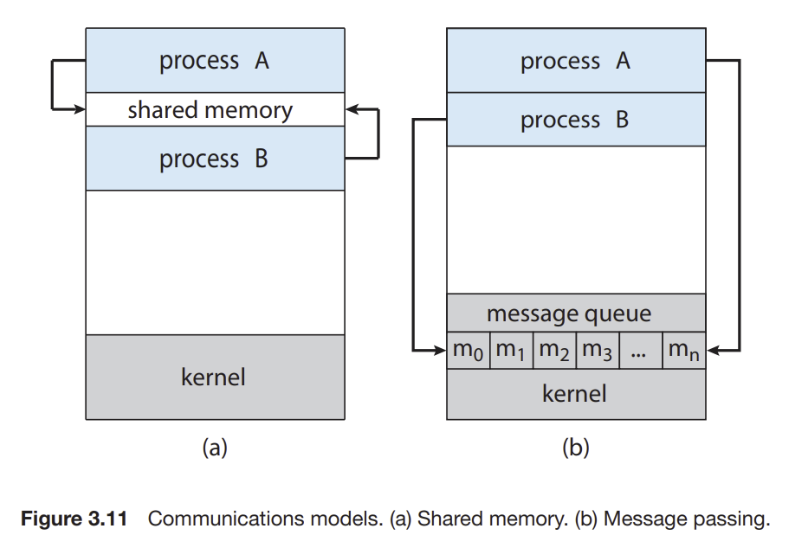

# Shared memory

## Inter process communication - IPC

Mỗi process trong hệ thống thường chạy trong không gian bộ nhớ riêng biệt, nghĩa là bộ nhớ của process này không thể truy cập trực tiếp bởi các process khác. Tuy nhiên, trong một sản phẩm embedded sẽ do nhiều process đảm nhiệm, các process này cần phải giao tiếp với nhau hoặc trong các ứng dụng phức tạp như hệ thống cơ sở dữ liệu hoặc ứng dụng mạng phân tán, nhiều process có thể cần truy cập và cập nhật các dữ liệu giống nhau.

Ví dụ: microservice là một kỹ thuật thay thế cho việc tất cả tính năng gộp vào một process, điều này có thể gây ra lỗi toàn bộ hệ thống khi một tính năng bị lỗi thì ta chia các tính năng ra làm nhiều process, lúc này khi một service bị lỗi thì chỉ process thực hiện service đó bị lỗi và không làm ảnh hưởng đến các service khác.

=> Cần có IPC, gồm những kỹ thuật cho phép hai hoặc nhiều process giao tiếp với nhau.

Trong đó, có hai mô hình cơ bản của IPC là shared memory và message passing:

- Trong mô hình shared memory, một vùng bộ nhớ được chia sẻ bởi các process được cấp phát. Các process sau đó có thể trao đổi thông tin bằng cách đọc và ghi dữ liệu vào shared region.

- Trong mô hình message passing, việc giao tiếp giữa các process được diễn ra thông qua các message. 

Hai mô hình này được minh họa như hình bên dưới:



Nhìn vào hình minh họa, ta có thể thấy shared memory được tạo ở tầng user, trong khi message queue được tạo ở tầng kernel. Do đó, Shared memory nhanh hơn message passing, các hệ thống message passing được triển khai bằng system call và cần sự can thiệp của kernel nên tốn nhiều thời gian hơn. Trong các hệ thống Shared memory, các system call chỉ được yêu cầu để thiết lập các vùng Shared memory. Khi Shared memory được thiết lập, tất cả các truy cập đều được xử lý khi truy cập bộ nhớ thông thường và không cần sự trợ giúp từ kernel.

Tuy nhiên, shared memory có nhược điểm liên quan đến đồng bộ khi nhiều tiến trình cùng truy cập vào, điều này được message passing khắc phục rất tốt.

> Lưu ý rằng, thông thường, hệ điều hành cố gắng ngăn chặn một process truy cập vào bộ nhớ. Shared memory yêu cầu hai hoặc nhiều process cùng đồng ý loại bỏ hạn chế này.

## Shared memory

Shared memory là một kỹ thuật chia sẻ bộ nhớ thông qua memory mapped file. Đây là một kỹ thuật mà các tiến trình có thể map một tệp vào không gian bộ nhớ của chúng, cho phép chúng thao tác trên dữ liệu của tệp giống như dữ liệu trong bộ nhớ. Điều này giúp chia sẻ dữ liệu giữa các tiến trình một cách hiệu quả.

Đầu tiên, tạo file fd để định danh cho vùng shared memory. File fd có thể tạo ra bằng cách tạo file bình thường, khi đó đọc ghi vào file sẽ ghi vào file.

```c
int fd = shm_open("/my_shm", O_CREAT | O_RDWR, 0666);
```

Nếu dùng fd để open `/dev/mem` thì file fd sẽ đại diện cho vùng nhớ vật lý, kỹ thuật này được dùng để tương tác với thanh ghi.

Sử dụng hàm `ftruncate` để set kích thước cho vùng nhớ được định danh bằng file fd. Nếu fd trỏ vào `/dev/mem` thì không cần set memory size.

```c
int ftruncate(int fd, off_t length);
```

Map shared memory vào process bằng hàm:

```c
void *mmap(void *addr, size_t length, int prot, int flags, int fd, off_t offset);
```

Unmap shared memory khỏi process bằng hàm:

```c
int munmap(void *addr, size_t length)
```

Hàm này chỉ unmap địa chỉ virtual của vùng nhớ khỏi address space của process, vùng nhớ physical không bị free.
