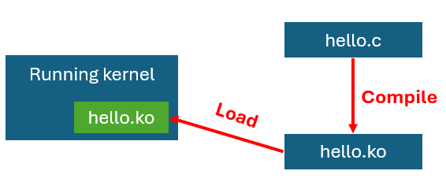
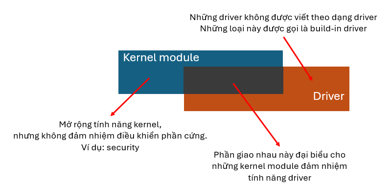

## Build linux kernel

Build linux kernel có hai cách:
- Build kernel trực tiếp trên board Pi => gọi là Native Compilation
- Build kernel từ một máy tính khác để tạo một file image và ghi vào SD card => gọi là Cross compiler.

Với phương pháp Native Compilation thì build sẽ chậm hơn và dễ bị quá nhiệt nếu build một kernel quá lớn.

Với phương pháp Cross Compilation thì build sẽ nhanh hơn, tuy nhiên cần thiết lập cross compiler.

## Driver

Driver có thể được tích hợp vào trong OS thông qua hai cách:
- Build-in Driver (Driver tích hợp sẵn trong Kernel - Built-in Driver)
- Loadable Kernel Module (Driver có thể tải vào sau - Loadable Driver)

Cả hai loại này đều phục vụ mục đích điều khiển phần cứng, nhưng cách thức biên dịch và nạp chúng vào Kernel khác nhau.

### Built-in driver

Đây là các driver được build chung cùng với OS trong quá trình build kernel để tạo ra image và nạp vào thẻ SD.

=> đơn giản là thêm driver vào kernel trong lúc build.

Đặc điểm của driver này là chúng luôn có mặt khi hệ thống khởi động, không thể gỡ bỏ trong lúc hệ thống đang chạy.

Các driver này được sử dụng cho các thiết bị cần thiết để khởi động hệ thống, như driver cho ổ cứng, hệ thống file, bộ nhớ. Khi build kernel, trong file cấu hình (`.config`), các driver được chọn là built-in khi có dấu `=y`.

```bash
CONFIG_EXT4_FS=y  # Driver cho hệ thống file ext4
CONFIG_USB_SUPPORT=y  # Driver hỗ trợ USB
```

### Loadable driver hay loadable kernel module

Các driver được build riêng lẻ và có thể được load hoặc gỡ bỏ trong quá trình kernel runtime mà không cần hệ thống phải restart. Chúng có thể được gọi là kernel module và có định dạng file là `.ko` hay Kernel Object. 



Nhờ cơ chế này mà kernel có thể mở rộng được các tính năng hoặc load driver khi thiết bị cắm vào mà không cần reboot hoặc recompile (hay plug and play).

Khi kernel module được load vào kernel thì nó sẽ được kế thừa các tính chất của kernel như:
- Quyền truy cập vào toàn bộ nhớ.
- Nếu kernel module gặp lỗi -> crash kernel.

**Tuy nhiên, không phải kernel module nào cũng là driver. Kernel module là một khái niệm rộng hơn.**



### Phân loại

Driver được chia làm hai loại:
- Điều khiển phần cứng thông qua việc đọc, ghi trực tiếp vào thanh ghi của Soc thì được gọi là Platform driver.
- Điều khiển phần cứng thông qua các API của platform driver thì được gọi là device driver.

Khi làm mạch, ta mua SoC về và tải BSP, trong BSP sẽ có platform driver.

**BSP - Board Support Package**

Bộ software cho nhà phát triển sản phẩm embedded trên SoC đó, nó gồm:
- Kernel source code: Platform driver
- Bootloader: Uboot
- Hệ thống thư viện đi kèm
- Build system: Yocto
- IDE

## Kernel Space vs User Space

Khi lập trình userspace, ta có một môi trường rất "thoải mái" mà thường không để ý:
- Gọi `malloc()` để xin bộ nhớ — kernel sẽ cấp phát và map page vào process
- Gọi `printf()` để in log — bên dưới là `write()` syscall gọi vào kernel
- Truy cập sai địa chỉ nhớ — kernel bắt lỗi, gửi `SIGSEGV`, process bị kill, hệ thống vẫn sống
- Stack thiếu chỗ — kernel detect stack overflow, kill process, hệ thống vẫn sống

Tất cả những cơ chế bảo vệ đó — chính là kernel đang bảo vệ cho ta.

Bây giờ ta đang viết code bên trong kernel. Không còn ai bảo vệ nữa.

### Những thứ không tồn tại trong kernel space

**Không có libc.** `printf()`, `malloc()`, `free()` từ libc — không dùng được. Kernel có API riêng:

| Userspace | Kernel space |
|---|---|
| `printf()` | `printk()` |
| `malloc()` / `free()` | `kmalloc()` / `kfree()` |
| `sleep()` | `msleep()` / `usleep_range()` |

**`kmalloc()` không giống `malloc()`.** Ta phải chỉ định GFP flags — cho kernel biết ta đang xin bộ nhớ trong ngữ cảnh nào:

```c
/* Có thể sleep để chờ bộ nhớ — dùng trong process context */
ptr = kmalloc(size, GFP_KERNEL);

/* Không được sleep — dùng trong interrupt handler */
ptr = kmalloc(size, GFP_ATOMIC);
```

Dùng sai flag — ví dụ dùng `GFP_KERNEL` trong interrupt handler — kernel sẽ phát hiện và panic ngay lập tức.

### Stack cố định và rất nhỏ

Ở userspace, khi stack của process sắp đầy, kernel tự động mở rộng stack bằng cách map thêm page mới — ta hầu như không bao giờ phải nghĩ đến giới hạn stack.

Trong kernel space, mỗi process/thread có một kernel stack cố định, không thể mở rộng — thường chỉ 4KB hoặc 8KB tùy kiến trúc. Không có cơ chế tự động mở rộng.

Hệ quả thực tế:
- Không khai báo array lớn trên stack trong kernel code
- Không gọi hàm đệ quy sâu
- Stack overflow trong kernel = kernel panic, không có cơ hội recover

```c
/* NGUY HIỂM trong kernel — 4KB array trên stack có thể overflow */
void my_kernel_func(void)
{
    char buffer[4096];  /* Đừng làm thế này */
    ...
}

/* ĐÚNG — xin bộ nhớ từ heap */
void my_kernel_func(void)
{
    char *buffer = kmalloc(4096, GFP_KERNEL);
    if (!buffer)
        return;
    ...
    kfree(buffer);
}
```

### Không có exception handler — crash là crash

Ở userspace, khi ta dereference NULL pointer, kernel bắt page fault, gửi `SIGSEGV` cho process, process bị kill. Hệ thống vẫn chạy bình thường.

Trong kernel space, khi code của anh dereference NULL pointer:

```c
struct device *dev = NULL;
dev->driver->probe(dev);  /* Kernel oops — hoặc panic */
```

Kernel sẽ in oops message với call stack ra `dmesg`, sau đó tùy cấu hình có thể tiếp tục chạy (bất ổn định) hoặc panic và reboot. Không có cơ chế nào bắt lỗi và recover một cách sạch sẽ như userspace.

:::tip Mindset cần có
Trong kernel space, mọi pointer đều phải được kiểm tra trước khi dereference. Không có ngoại lệ.
:::

## Lập trình phần cứng

Trên MCU, ta truy cập thanh ghi ngoại vi trực tiếp qua địa chỉ vật lý:

```c
/* Trên STM32 — hoàn toàn bình thường */
#define GPIOA_ODR  (*(volatile uint32_t*)0x40020014)
GPIOA_ODR |= (1 << 5);  /* Bật LED */
```

Trên Linux, điều này không thể làm được từ userspace vì MMU đã bật — mọi địa chỉ trong code đều là địa chỉ ảo. Truy cập thẳng địa chỉ vật lý sẽ bị kernel chặn ngay.

Nhưng ta đang viết kernel module — ta có quyền làm điều này, nhưng phải xin kernel map địa chỉ vật lý thành địa chỉ ảo trước khi dùng.

### ioremap — cầu nối giữa địa chỉ vật lý và ảo

```c
#include <linux/io.h>

void __iomem *base;

/* Xin map 4 byte tại địa chỉ vật lý 0x44E07000 */
base = ioremap(0x44E07000, 4);
if (!base) {
    printk(KERN_ERR "ioremap failed!\n");
    return -ENOMEM;
}

/* Đọc/ghi thông qua địa chỉ ảo vừa được cấp */
writel(0x1 << 20, base + 0x134);  /* Set output */

/* Giải phóng mapping khi không dùng nữa */
iounmap(base);
```

`__iomem` là chỉ dẫn cho compiler biết đây là con trỏ trỏ vào vùng I/O — không được dereference trực tiếp bằng `*ptr`, phải dùng `readl()`/`writel()`.

### Tại sao không dùng `*ptr` trực tiếp?

```c
/* SAI — undefined behavior trên nhiều kiến trúc */
*base = 0x100000;

/* ĐÚNG — đảm bảo memory barrier và byte order đúng */
writel(0x100000, base);
```

`writel()`/`readl()` không chỉ là wrapper đơn giản. Chúng đảm bảo:
- **Memory barrier** — đảm bảo thứ tự ghi đến hardware đúng như code
- **Byte order** — tự động xử lý endianness giữa CPU và peripheral