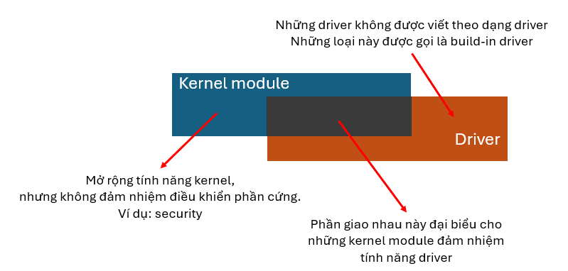
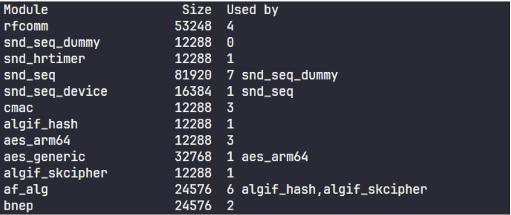
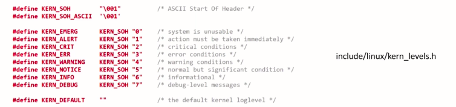

# Kernel module

## Build linux kernel

Build linux kernel có hai cách:
- Build kernel trực tiếp trên board Pi => gọi là Native Compilation
- Build kernel từ một máy tính khác để tạo một file image và ghi vào SD card => gọi là Cross compiler.

Với phương pháp Native Compilation thì build sẽ chậm hơn và dễ bị quá nhiệt nếu build một kernel quá lớn.

Với phương pháp Cross Compilation thì build sẽ nhanh hơn, tuy nhiên cần thiết lập cross compiler.

## Driver

Driver có thể được tích hợp vào trong OS thông qua hai cách:
- Build-in Driver (Driver tích hợp sẵn trong Kernel - Built-in Driver)
- Loadable Kernel Module (Driver có thể tải vào sau - Loadable Driver)

Cả hai loại này đều phục vụ mục đích điều khiển phần cứng, nhưng cách thức biên dịch và nạp chúng vào Kernel khác nhau.

### Built-in driver

Đây là các driver được build chung cùng với OS trong quá trình build kernel để tạo ra image và nạp vào thẻ SD.

=> đơn giản là thêm driver vào kernel trong lúc build.

Đặc điểm của driver này là chúng luôn có mặt khi hệ thống khởi động, không thể gỡ bỏ trong lúc hệ thống đang chạy.

Các driver này được sử dụng cho các thiết bị cần thiết để khởi động hệ thống, như driver cho ổ cứng, hệ thống file, bộ nhớ. Khi build kernel, trong file cấu hình (`.config`), các driver được chọn là built-in khi có dấu `=y`.

```bash
CONFIG_EXT4_FS=y  # Driver cho hệ thống file ext4
CONFIG_USB_SUPPORT=y  # Driver hỗ trợ USB
```

### Loadable driver hay loadable kernel module

Các driver được build riêng lẻ và có thể được load hoặc gỡ bỏ trong quá trình kernel runtime mà không cần hệ thống phải restart. Chúng có thể được gọi là kernel module và có định dạng file là `.ko` hay Kernel Object. 


Nhờ cơ chế này mà kernel có thể mở rộng được các tính năng hoặc load driver khi thiết bị cắm vào mà không cần reboot hoặc recompile (hay plug and play).

Khi kernel module được load vào kernel thì nó sẽ được kế thừa các tính chất của kernel như:
- Quyền truy cập vào toàn bộ nhớ.
- Nếu kernel module gặp lỗi -> crash kernel.

**Tuy nhiên, không phải kernel module nào cũng là driver. Kernel module là một khái niệm rộng hơn.**



### Phân loại

Driver được chia làm hai loại:
- Điều khiển phần cứng thông qua việc đọc, ghi trực tiếp vào thanh ghi của Soc thì được gọi là Platform driver.
- Điều khiển phần cứng thông qua các API của platform driver thì được gọi là device driver.

Khi làm mạch, ta mua SoC về và tải BSP, trong BSP sẽ có platform driver.

**BSP - Board Support Package**

Bộ software cho nhà phát triển sản phẩm embedded trên SoC đó, nó gồm:
- Kernel source code: Platform driver
- Bootloader: Uboot
- Hệ thống thư viện đi kèm
- Build system: Yocto
- IDE

## Kernel module

### Tổng quan

- Nạp kernel module vào kernel: `sudo insmod mydriver.ko`
- Gỡ kernel module khỏi kernel: `sudo rmmod mydriver`
- Liệt kê các kernel module đang chạy trong kernel: `lsmod`

Khi sử dụng `lsmode` để liệt kê các kernel module theo thứ tự được load gần nhất và nó sẽ hiển thị như hình minh hoạ sau:



Trong đó:
- `module` có ý nghĩa là tên của module.
- `size` là kích thước của file `.ko` chứ không phải kích thước của kernel module đang sử dụng.
- `Used by` có ý nghĩa là số thread hoặc driver đang sử dụng tài nguyên của kernel module.

Ta không thể remove một kernel module khi trường `Used by` khác 0 vì có kernel module hoặc thread đang dùng tài nguyên của kernel module.

**Mở rộng:** `/proc/kallsyms` là nơi lưu các biến định danh khi sử dụng macro `EXPORT_SYMBOL` để chia sẻ biến cho các driver khác.

### Cấu trúc kernel module

Cấu trúc source code của một kernel module sẽ như sau:

```c
#include <linux/module.h>

/* This is module initialization entry point */
static int __init my_kernel_module_init(void)
{
    /* kernel's printf */
    pr_info("Hello World!\n");
    return 0;
}

/* This is module clean-up entry point */
static void __exit my_kernel_module_exit(void)
{
    pr_info("Good bye World\n");
}

/* This is registration of above entry points with kernel */
module_init(my_kernel_module_init);
module_exit(my_kernel_module_exit);

/* This is descriptive information about the module */
MODULE_LICENSE("GPL");               /* This module adheres to GPL licensing */
MODULE_AUTHOR("www.fastbitlab.com");
MODULE_DESCRIPTION("A kernel module to print some messages");
```

Tại header section, ta cần include các kernel header phù hợp cho kernel module. Ta có thể tìm thấy tất cả các kernel header tại đường dẫn `/include/linux`.

Khi viết kernel module, ta cần quan tâm đến hai entry point:
- Init function: đây là hàm sẽ được invoke khi module được load vào kernel, hàm này thường đi kèm với macro `__init`, đây là macro chỉ thị cho compiler rằng phần code của hàm sẽ được đặt vào section `.init` của kernel image. Section này sẽ được kernel giải phóng khỏi bộ nhớ khi các hàm khởi tạo được thực thi.
- Clean function: đây là hàm sẽ được invoke khi module được remove khỏi kernel, hàm này thường đi kèm với macro `__exit`, đây là macro chỉ thị cho compiler rằng phần code của hàm sẽ được đặt vào section `.exit` của kernel image. Build system sẽ loại bỏ các hàm này khỏi kernel image cuối cùng.

Macro `__init` và `__exit` là các macro được định nghĩa trong `include/linux/init.h`. Các macro này là tùy chọn nhưng nó có thể giảm đáng kể bộ nhớ.

```c
#define __init          __section(.init.text)
#define __initdata      __section(.init.data)
#define __initconst     __section(.init.rodata)
#define __exit          __section(.exit.text)
```

Để hai entry point có thể chạy thì ta cần đăng ký nó với kernel thông qua hai macro:
- `module_init` cho init function
- `module_exit` cho clean function

Ngoài ra, một macro kernel đặc biệt là `MODULE_LICENSE` được dùng để báo cho kernel biết rằng là module này có free license, nếu không có dòng này thì kernel sẽ báo lỗi khi module được load.

Hàm `printk` được định nghĩa trong linux kernel và được cung cấp cho các module. Nó hoạt động như hàm `printf` trong thư viện C chuẩn. Log sẽ được in trong file `var/log/messages`.

### Kernel header

Kernel Header được hiểu là thư viện chứa tập hợp các file header chứa khai báo về các hàm, cấu trúc dữ liệu, macro, và hằng số cần thiết để biên dịch các kernel module hoặc phần mềm tương tác với Linux Kernel.

Mỗi hệ điều hành lại có kernel header khác nhau, ví dụ như raspberry, beaglebone black, udoo,...

Kernel Header nằm trong thư mục `/usr/src/linux-headers-$(uname -r)/` hoặc `/lib/modules/$(uname -r)/build/include/`.

### Build loadable kernel module

Để thực hiện build loadable kernel module, ta thực hiện lệnh `make -C` để thực hiện lệnh make từ build system của linux kernel hay `kbuild`.

Đây là ví dụ về file local make để có thể build loadable kernel module:

```bash
# Tên module (tạo ra file my_module.ko)
obj-m := my_module.o

# Đường dẫn tới thư mục chứa file source linux kernel
KDIR := /lib/modules/$(shell uname -r)/build

# Đường dẫn tới thư mục chứa file source của kernel module
PWD := $(shell pwd)

all:
	make -C $(KDIR) M=$(PWD) modules

clean:
	make -C $(KDIR) M=$(PWD) clean
```

Tại local make, các biến kbuild phải có dạng như sau:

```bash
obj-<X>:=<module_name>.o
```

Trong đó, X có thể là:
- X = n: không compile module này.
- X = y: compile module và link vào kernel image.
- X = m: compile loadable kernel module.

Cách trên là build một loadable kernel module trực tiếp trên một board, khi ta muốn build một loadable kernel module cho một board khác gọi là target thì ta cần cross compiler, lúc này lệnh `make` cần như sau:

```bash
ARCH := arm
obj-m := misc_driver.o
PWD := $(shell pwd)
KDIR := /home/nguyenbui/tutorial/bbb/bb-kernel/KERNEL
CROSS := /home/nguyenbui/tutorial/bbb/bb-kernel/dl/gcc-8.5.0-nolibc/arm-linux-gnueabi/bin/arm-linux-gnueabi-

all:
	make ARCH=$(ARCH) CROSS_COMPILE=$(CROSS) -C $(KDIR) M=$(PWD) modules

clean:
	make -C $(KDIR) M=$(PWD) clean
```

Lúc này, `$(KDIR)` cần trỏ đúng tới đường dẫn chứa source linux kernel tương ứng với board. 

**Tham khảo tại đây:**

[Building a linux kernel module](https://fastbitlab.com/building-a-linux-kernel-module/)
[Compilation and testing of an lkm](https://fastbitlab.com/compilation-and-testing-of-an-lkm/)
[Testing of an lkm on target](https://fastbitlab.com/testing-of-an-lkm-on-target/)
[How to create makefile](https://fastbitlab.com/how-to-create-makefile/)

## Debug

Để có thể debug kernel, ta sử dụng hàm `printk`. Khi dùng `printk`, thì log sẽ được lưu vào ring buffer của kernel, ta cần gọi 'kernel log' bằng cách dùng lệnh `dmesg`.

Giả sử, nếu muốn kiểm tra 5 log mới nhất, chỉ cần chạy:

```bash
dmesg | tail -5
```

Nếu muốn kiểm tra 20 log đầu tiên, chỉ cần chạy:

```bash
dmesg | head -20
```

Đối với `printk`, nó có thể được gán với log level. Có tám log level, log level càng thấp thì độ ưu tiên càng cao.

Các log level này tương ứng với các macro được định nghĩa trong file header `kern_levels.h`.



Để có thể sử dụng log level, ta làm như sau:

```c
printk(KERN_WARNING “Hello this is kernel code running \n”);
```

hoặc nếu không thêm log level như sau thì mặc định của nó là `CONFIG_MESSAGE_LOGLEVEL_DEFAULT` tương ứng với 4:

```c
printk(“Hello this is kernel code running \n”);
```
