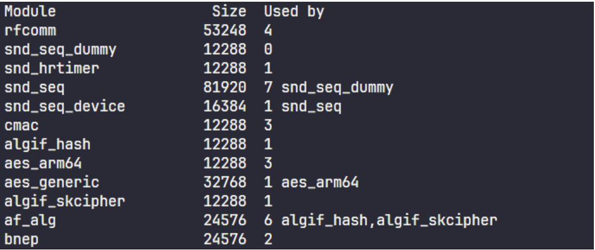
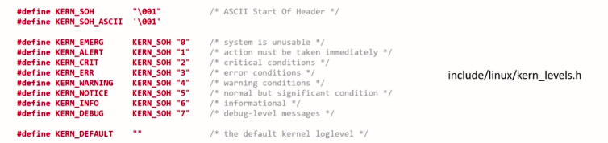

# Kernel module

## Tại sao lại có Kernel Module?

Với MCU, khi muốn thêm tính năng mới — ví dụ hỗ trợ thêm một loại cảm biến thì ta phải làm gì? Sửa code, biên dịch lại toàn bộ firmware, flash lại chip. Nếu sản phẩm đang chạy ngoài hiện trường, đây là một vấn đề thực sự.

Linux kernel ban đầu được thiết kế theo kiến trúc **monolithic** — toàn bộ kernel (scheduler, memory manager, driver, filesystem...) được biên dịch thành một binary duy nhất chạy trong kernel space. Về lý thuyết, điều này có nghĩa là mỗi khi muốn thêm driver mới, ta phải biên dịch lại toàn bộ kernel và reboot hệ thống.

Thực tế, đây là điều không thể chấp nhận được trong môi trường production — server không thể reboot mỗi khi cần thêm driver card mạng mới, hay thiết bị nhúng không thể reflash mỗi khi cần hỗ trợ thêm một peripheral.

$\rightarrow$ Giải pháp: Loadable Kernel Module

## Kernel module là gì?

### Định nghĩa

Kernel module là cơ chế cho phép biên dịch một tính năng kernel thành file binary riêng (`.ko`), và nạp vào kernel đang chạy mà không cần reboot.

Ví dụ:

```bash
# Nạp module vào kernel
sudo insmod my_driver.ko

# Gỡ module khỏi kernel
sudo rmmod my_driver
```

Đây không phải là một process mới được tạo ra. Module được ánh xạ trực tiếp vào kernel image đang chạy trong RAM — code của module chạy trong cùng không gian địa chỉ với kernel, với cùng mức quyền hạn.

:::warning Hệ quả
Một bug trong kernel module = một bug trong kernel.
:::

### Cách sử dụng

- Nạp kernel module vào kernel: `sudo insmod mydriver.ko`
- Gỡ kernel module khỏi kernel: `sudo rmmod mydriver`
- Liệt kê các kernel module đang chạy trong kernel: `lsmod`

Khi sử dụng `lsmode` để liệt kê các kernel module theo thứ tự được load gần nhất và nó sẽ hiển thị như hình minh hoạ sau:



Trong đó:
- `module` có ý nghĩa là tên của module.
- `size` là kích thước của file `.ko` chứ không phải kích thước của kernel module đang sử dụng.
- `Used by` có ý nghĩa là số thread hoặc driver đang sử dụng tài nguyên của kernel module.

Ta không thể remove một kernel module khi trường `Used by` khác 0 vì có kernel module hoặc thread đang dùng tài nguyên của kernel module.

### File `.ko` là gì?

Khi ta biên dịch một ứng dụng userspace, kết quả là một ELF binary có thể chạy độc lập. Kernel module cũng là ELF, nhưng có những section đặc biệt mà binary userspace không có:

- **`.modinfo`** — chứa metadata: tên module, license, author, và quan trọng nhất là **vermagic**
- **`.gnu.linkonce.this_module`** — struct mô tả module với kernel
- **`Module.symvers`** — bảng các symbol mà module export ra cho module khác dùng

Ta có thể kiểm tra bằng:

```bash
modinfo my_driver.ko
```

```
filename:       my_driver.ko
license:        GPL
author:         Peizzon
vermagic:       6.1.0 SMP mod_unload ARMv7
```

## Cơ chế bảo vệ version

Đây là điểm nhiều developer bị "bẫy" lần đầu. Khi `insmod` được gọi, kernel sẽ kiểm tra vermagic trong `.modinfo` của file `.ko` với vermagic của kernel đang chạy. Nếu không khớp, kernel từ chối load:

```
ERROR: could not insert module my_driver.ko: Invalid module format
```

vermagic bao gồm: **kernel version + cấu hình biên dịch** (SMP, preempt, ARMv7...). Đây là lý do tại sao file `.ko` biên dịch cho kernel 6.1.0 sẽ không load được trên kernel 6.1.1, dù chỉ khác nhau một con số nhỏ.

:::warning Hệ quả thực tế
Khi cross-compile kernel module cho board, ta phải dùng đúng kernel source tree tương ứng với kernel đang chạy trên board — không phải kernel source bất kỳ cùng version.
:::

## Symbol linking

Khi ta gọi `printk()` hay `request_irq()` trong module, compiler không biết địa chỉ thực của các hàm này tại thời điểm biên dịch. Địa chỉ chỉ được resolve lúc module được load vào kernel.

Kernel duy trì một bảng symbol toàn cục:

```bash
# Xem tất cả symbol đang có trong kernel
cat /proc/kallsyms | grep request_irq
```

```
c0521234 T request_irq
```

Chỉ những hàm được kernel export bằng macro `EXPORT_SYMBOL()` mới có thể được module gọi. Đây là API boundary giữa kernel core và module.

```c
/* Trong kernel source — hàm này module mới gọi được */
EXPORT_SYMBOL(request_irq);

/* Hàm internal — module không gọi được */
static void internal_irq_setup(void) { ... }
```

:::tip Mở rộng
Ta cũng có thể sử dụng macro `EXPORT_SYMBOL` để lưu các biến định danh và chia sẻ biến cho các driver khác.
:::

## Cấu trúc kernel module

Cấu trúc source code của một kernel module sẽ như sau:

```c
#include <linux/module.h>

/* This is module initialization entry point */
static int __init my_kernel_module_init(void)
{
    /* kernel's printf */
    pr_info("Hello World!\n");
    return 0;
}

/* This is module clean-up entry point */
static void __exit my_kernel_module_exit(void)
{
    pr_info("Good bye World\n");
}

/* This is registration of above entry points with kernel */
module_init(my_kernel_module_init);
module_exit(my_kernel_module_exit);

/* This is descriptive information about the module */
MODULE_LICENSE("GPL");               /* This module adheres to GPL licensing */
MODULE_AUTHOR("www.fastbitlab.com");
MODULE_DESCRIPTION("A kernel module to print some messages");
```

Tại header section, ta cần include các kernel header phù hợp cho kernel module. Ta có thể tìm thấy tất cả các kernel header tại đường dẫn `/include/linux`.

Khi viết kernel module, ta cần quan tâm đến hai entry point:
- Init function: đây là hàm sẽ được invoke khi module được load vào kernel, hàm này thường đi kèm với macro `__init`, đây là macro chỉ thị cho compiler rằng phần code của hàm sẽ được đặt vào section `.init` của kernel image. Section này sẽ được kernel giải phóng khỏi bộ nhớ khi các hàm khởi tạo được thực thi.
- Clean function: đây là hàm sẽ được invoke khi module được remove khỏi kernel, hàm này thường đi kèm với macro `__exit`, đây là macro chỉ thị cho compiler rằng phần code của hàm sẽ được đặt vào section `.exit` của kernel image. Build system sẽ loại bỏ các hàm này khỏi kernel image cuối cùng.

Macro `__init` và `__exit` là các macro được định nghĩa trong `include/linux/init.h`. Các macro này là tùy chọn nhưng nó có thể giảm đáng kể bộ nhớ.

```c
#define __init          __section(.init.text)
#define __initdata      __section(.init.data)
#define __initconst     __section(.init.rodata)
#define __exit          __section(.exit.text)
```

Để hai entry point có thể chạy thì ta cần đăng ký nó với kernel thông qua hai macro:
- `module_init` cho init function
- `module_exit` cho clean function

Ngoài ra, một macro kernel đặc biệt là `MODULE_LICENSE` được dùng để báo cho kernel biết rằng là module này có free license, nếu không có dòng này thì kernel sẽ báo lỗi khi module được load.

Hàm `printk` được định nghĩa trong linux kernel và được cung cấp cho các module. Nó hoạt động như hàm `printf` trong thư viện C chuẩn. Log sẽ được in trong file `var/log/messages`.

## Kernel header

Kernel Header được hiểu là thư viện chứa tập hợp các file header chứa khai báo về các hàm, cấu trúc dữ liệu, macro, và hằng số cần thiết để biên dịch các kernel module hoặc phần mềm tương tác với Linux Kernel.

Mỗi hệ điều hành lại có kernel header khác nhau, ví dụ như raspberry, beaglebone black, udoo,...

Kernel Header nằm trong thư mục `/usr/src/linux-headers-$(uname -r)/` hoặc `/lib/modules/$(uname -r)/build/include/`.

## Build loadable kernel module

Để thực hiện build loadable kernel module, ta thực hiện lệnh `make -C` để thực hiện lệnh make từ build system của linux kernel hay `kbuild`.

Đây là ví dụ về file local make để có thể build loadable kernel module:

```bash
# Tên module (tạo ra file my_module.ko)
obj-m := my_module.o

# Đường dẫn tới thư mục chứa file source linux kernel
KDIR := /lib/modules/$(shell uname -r)/build

# Đường dẫn tới thư mục chứa file source của kernel module
PWD := $(shell pwd)

all:
	make -C $(KDIR) M=$(PWD) modules

clean:
	make -C $(KDIR) M=$(PWD) clean
```

Tại local make, các biến kbuild phải có dạng như sau:

```bash
obj-<X>:=<module_name>.o
```

Trong đó, X có thể là:
- X = n: không compile module này.
- X = y: compile module và link vào kernel image.
- X = m: compile loadable kernel module.

Cách trên là build một loadable kernel module trực tiếp trên một board, khi ta muốn build một loadable kernel module cho một board khác gọi là target thì ta cần cross compiler, lúc này lệnh `make` cần như sau:

```bash
ARCH := arm
obj-m := misc_driver.o
PWD := $(shell pwd)
KDIR := /home/nguyenbui/tutorial/bbb/bb-kernel/KERNEL
CROSS := /home/nguyenbui/tutorial/bbb/bb-kernel/dl/gcc-8.5.0-nolibc/arm-linux-gnueabi/bin/arm-linux-gnueabi-

all:
	make ARCH=$(ARCH) CROSS_COMPILE=$(CROSS) -C $(KDIR) M=$(PWD) modules

clean:
	make -C $(KDIR) M=$(PWD) clean
```

Lúc này, `$(KDIR)` cần trỏ đúng tới đường dẫn chứa source linux kernel tương ứng với board. 

**Tham khảo tại đây:**

[Building a linux kernel module](https://fastbitlab.com/building-a-linux-kernel-module/)
[Compilation and testing of an lkm](https://fastbitlab.com/compilation-and-testing-of-an-lkm/)
[Testing of an lkm on target](https://fastbitlab.com/testing-of-an-lkm-on-target/)
[How to create makefile](https://fastbitlab.com/how-to-create-makefile/)

## Kernel timer

Trong userspace, ta dùng `sleep()` hoặc `setitimer()` để delay. Trong kernel, cách đúng là dùng kernel timer — một cơ chế cho phép đăng ký một callback sẽ được gọi sau một khoảng thời gian nhất định.

```c
#include <linux/timer.h>

struct timer_list my_timer;

/* Callback — chạy trong softirq context, ràng buộc tương tự interrupt handler */
static void timer_callback(struct timer_list *t)
{
    printk(KERN_INFO "Timer fired!\n");

    /* Tự schedule lại sau 1 giây — tạo periodic timer */
    mod_timer(&my_timer, jiffies + HZ);
}

static int __init timer_init(void)
{
    /* Khởi tạo timer và gán callback */
    timer_setup(&my_timer, timer_callback, 0);

    /* Kích hoạt lần đầu — HZ = số jiffies trong 1 giây */
    mod_timer(&my_timer, jiffies + HZ);

    printk(KERN_INFO "Timer started\n");
    return 0;
}

static void __exit timer_exit(void)
{
    /* Hủy timer trước khi unload — bắt buộc */
    del_timer_sync(&my_timer);
    printk(KERN_INFO "Timer stopped\n");
}
```

- **`jiffies`** là bộ đếm tick của kernel — tăng lên 1 mỗi timer interrupt.
- **`HZ`** là số tick trong 1 giây (thường 100, 250, hoặc 1000 tùy config).
- `jiffies + HZ` có nghĩa là "1 giây kể từ bây giờ".

Timer callback chạy trong softirq context — ràng buộc tương tự interrupt handler: không được sleep, không được dùng `GFP_KERNEL`.

## `container_of`

Đây là một trong những macro quan trọng nhất trong toàn bộ Linux kernel source. Hiểu `container_of` là hiểu một phần lớn tư duy thiết kế của kernel.

### Vấn đề: callback chỉ nhận được một pointer

Khi timer callback được gọi, signature cố định:

```c
static void timer_callback(struct timer_list *t);
```

Chỉ nhận được `struct timer_list *t`. Nhưng trong thực tế, ta cần truy cập vào toàn bộ context của driver — ví dụ GPIO base address, IRQ number, trạng thái LED. Làm thế nào?

### Giải pháp của kernel

```c
/* Định nghĩa struct chứa toàn bộ context của driver */
struct led_dev {
    void __iomem     *gpio_base;
    int               irq;
    int               led_state;
    struct timer_list timer;   /* Nhúng timer vào trong struct */
};

static struct led_dev my_dev;
```

Khi timer callback được gọi với `struct timer_list *t`, ta biết `t` chính là trường `timer` bên trong `struct led_dev`. `container_of` cho phép tính ngược địa chỉ của struct cha từ địa chỉ của member:

```c
static void timer_callback(struct timer_list *t)
{
    /* Từ pointer đến member timer, tìm ngược ra pointer đến struct led_dev */
    struct led_dev *dev = container_of(t, struct led_dev, timer);

    /* Giờ có thể truy cập toàn bộ context */
    uint32_t val = readl(dev->gpio_base + GPIO_DATAOUT);
    val ^= LED_PIN;
    writel(val, dev->gpio_base + GPIO_DATAOUT);

    mod_timer(&dev->timer, jiffies + HZ);
}
```

### Cơ chế hoạt động của `container_of`

```c
#define container_of(ptr, type, member) \
    ((type *)((char *)(ptr) - offsetof(type, member)))
```

`offsetof(type, member)` trả về khoảng cách byte từ đầu struct đến member. Trừ offset đó khỏi địa chỉ của member → thu được địa chỉ đầu struct.

Minh họa trong bộ nhớ:

```
Địa chỉ thấp
┌─────────────────────────┐  ← &my_dev  (container_of trả về đây)
│ gpio_base   (8 bytes)   │
├─────────────────────────┤
│ irq         (4 bytes)   │
├─────────────────────────┤
│ led_state   (4 bytes)   │
├─────────────────────────┤
│ timer       (N bytes)   │  ← t  (kernel truyền vào đây)
└─────────────────────────┘
Địa chỉ cao

container_of(t, struct led_dev, timer)
= t - offsetof(struct led_dev, timer)
= &my_dev
```

### `container_of` xuất hiện ở khắp nơi trong kernel

Pattern này không chỉ dùng cho timer. Bất cứ khi nào kernel callback chỉ truyền vào một pointer đến một member cụ thể, `container_of` là cách lấy lại context:

- `struct list_head` — linked list của kernel
- `struct work_struct` — workqueue
- `struct kobject` — device model
- `struct file_operations` — character device

## Debug

Ở userspace, workflow debug rất quen thuộc: attach GDB, đặt breakpoint, chạy từng dòng, inspect biến. Workflow này gần như không áp dụng được trong kernel vì một lý do căn bản:

**Khi GDB dừng execution tại breakpoint, toàn bộ kernel dừng theo** — scheduler không chạy, interrupt không được xử lý, watchdog timer không được reset. Sau vài giây, hệ thống treo hoặc reboot.

### Các lựa chọn debug kernel — từ mạnh đến yếu

**Trace32** — công cụ mạnh nhất, dùng trong môi trường professional. Kết nối qua JTAG, có hardware debug unit riêng nên có thể dừng CPU mà không làm treo hệ thống. Nhược điểm: cần mua cả hardware lẫn software license, chi phí cao.

**JTAG thông thường (OpenOCD + GDB)** — đi qua hardware debug module của SoC, ổn định hơn software GDB thuần túy. Thường dùng trong giai đoạn bringup board — debug bootloader, early kernel init. Vẫn có giới hạn khi kernel đang chạy đầy đủ.

**printk** — công cụ thực tế nhất cho driver development hàng ngày. Không cần hardware đặc biệt, luôn hoạt động, không làm thay đổi timing của hệ thống.

### Chiến lược dùng printk hiệu quả

Khi dung `printk` thì log sẽ được lưu vào ring buffer của kernel, đọc khi cần — không in liên tục ra terminal.

Đối với `printk`, nó được gán với log level. Có tám log level, log level càng thấp thì độ ưu tiên càng cao.

Các log level này tương ứng với các macro được định nghĩa trong file header `kern_levels.h`.



Để có thể sử dụng log level, ta làm như sau:

```c
/* In với log level phù hợp */
printk(KERN_ERR  "Lỗi nghiêm trọng: ioremap failed\n");   /* Luôn hiện */
printk(KERN_INFO "Module loaded successfully\n");         /* Thông tin */
printk(KERN_DEBUG "GPIO val = 0x%08x\n", val);            /* Chỉ khi debug */
```

hoặc nếu không thêm log level như sau thì mặc định của nó là `CONFIG_MESSAGE_LOGLEVEL_DEFAULT` tương ứng với 4:

```c
printk(“Hello this is kernel code running \n”);
```

Chỉ bật `KERN_DEBUG` khi cần — log nhiều quá làm chậm hệ thống và che lấp log quan trọng:

```bash
# Bật log level debug cho module cụ thể
echo "module my_driver +p" > /sys/kernel/debug/dynamic_debug/control

# Đọc 20 log mới nhất
dmesg | tail -20

# Đọc 20 log đầu tiên
dmesg | head -20

# Theo dõi log real-time
dmesg -w
```

### Heisenbug trong kernel — bug biến mất khi thêm log

Đây là hiện tượng ta sẽ gặp sớm hay muộn trong kernel development. Một bug race condition hoặc timing-sensitive chỉ xuất hiện khi không có log — vừa thêm `printk()` vào để debug, bug biến mất.

Lý do: `printk()` không phải là hàm nhanh. Nó acquire lock để ghi vào ring buffer, tạo ra memory barrier, và thay đổi timing của toàn bộ đoạn code xung quanh. Race condition vốn phụ thuộc vào timing chính xác — một `printk()` có thể làm thay đổi timing đủ để race không còn xảy ra nữa.

Khi gặp tình huống này:

```c
/* Thay vì printk trực tiếp, dùng trace_printk — nhanh hơn nhiều */
trace_printk("GPIO val = 0x%08x\n", val);
```

```bash
# Đọc trace buffer
cat /sys/kernel/debug/tracing/trace
```

`trace_printk()` ghi vào **ftrace buffer** thay vì ring buffer — nhanh hơn đáng kể, ít ảnh hưởng timing hơn.

### Đọc kernel panic message

Khi kernel module crash, đây là thông tin quan trọng nhất anh có. Ví dụ một panic thực tế:

```
BUG: unable to handle kernel NULL pointer dereference at 00000000
IP: [<bf000018>] button_handler+0x18/0x30 [my_driver]
Call Trace:
 [<c0521234>] handle_irq_event+0x44/0x60
 [<c0522abc>] generic_handle_irq+0x2c/0x40
 [<c0523def>] irq_exit+0x8c/0xa0
```

Cách đọc:
- **`NULL pointer dereference`** — dereference con trỏ NULL
- **`button_handler+0x18`** — crash xảy ra tại offset `0x18` trong hàm `button_handler`
- **Call Trace** — chuỗi hàm dẫn đến crash, đọc từ trên xuống

Tìm chính xác dòng code bị crash:

```bash
# Dùng addr2line với file .ko có debug symbol
arm-none-linux-gnueabihf-addr2line -e my_driver.ko 0x18
# Output: /home/user/my_driver.c:42
```