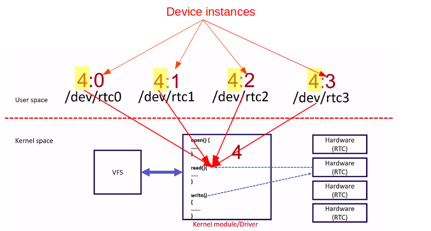
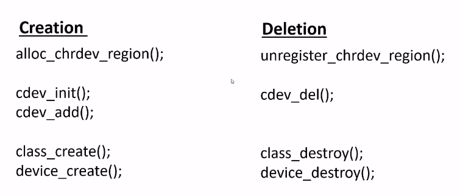
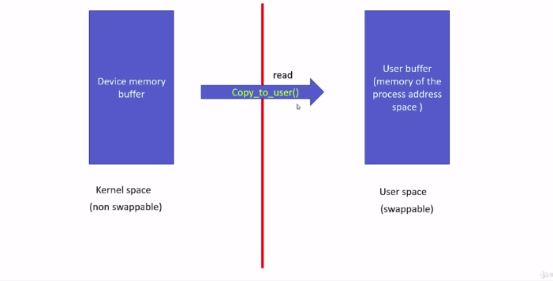
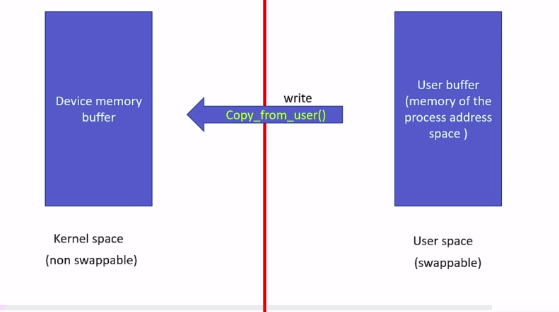

# Device driver

## Device driver

Trong Linux, tất cả thiết bị phần cứng đều được quản lý thông qua device driver, và các thiết bị này thường thuộc một trong ba loại chính:
- Character device
- Block device
- Network device

Mỗi loại device có cách truy cập dữ liệu khác nhau, ảnh hưởng đến cách hệ điều hành xử lý I/O.

### Device file

Device file hay device node là một file đặc biệt nằm trong folder `/dev` được kernel tạo ra nhằm mục đích cho phép tầng user giao tiếp với driver thông qua file.

Nó không phải là file thật chứa dữ liệu, mà chỉ là interface để chuyển system call từ user xuống driver.

Ví dụ:

```bash
echo 1 > /dev/led
```

Kernel sẽ thực hiện chuỗi sau:

```scss
user-space
   ↓
sys_write()
   ↓
vfs_write()
   ↓
file->f_op->write()   ← gọi tới hàm `write` trong driver của bạn
```

-> Tức là `/dev/led` chỉ là một entry để kernel biết lệnh `write` này thuộc driver nào.

Khi tạo ra device file thì OS cho phép driver được phép đăng ký các hàm đọc, ghi, mở, đóng,...cho device file đấy. Khi thực hiện các hàm này trên tầng user thì những hàm tương ứng ở driver sẽ được gọi => cơ chế này được gọi là device file operation.

Các nguyên mẫu hàm sẽ như sau:

```c
static int dev_open(struct inode *, struct file *);
static int dev_close(struct inode *, struct file *);
static ssize_t dev_read(struct file*filep, char __user *buf, size_t len, loff_t *offset);
static ssize_t dev_write(struct file*filep, const char __user *buf, size_t len, loff_t *offset);
```

### I/O Control

Thông thường, khi giao tiếp với device sẽ thông qua hai hàm sau:

```
read     → đọc dữ liệu từ thiết bị
write    → ghi dữ liệu ra thiết bị
```

Nhưng những hàm này chỉ phù hợp cho truyền nhận dữ liệu tuần tự, kiểu như:

- UART: `read` nhận byte, `write` gửi byte.
- ADC: `read` lấy mẫu giá trị.

Vậy nếu muốn thực hiện hành động đặc biệt mà không phải đọc/ghi dữ liệu, ví dụ:
- Bật/tắt LED
- Đặt tốc độ baudrate của UART
- Reset thiết bị
- Chọn chế độ hoạt động (MODE_1, MODE_2, MODE_3)

-> hàm `ioctl`: cho phép user gửi lệnh điều khiển xuống driver, cùng với một tham số tùy chọn, mà không phải đọc/ghi dữ liệu.

**Ví dụ** 

Giả sử có led driver:

| Lệnh            | Ý nghĩa                 |
|-----------------|-------------------------|
| `LED_ON`        | Bật LED                 |
| `LED_OFF`       | Tắt LED                 |
| `LED_TOGGLE`    |	Đảo trạng thái          |
| `LED_GET_STATE` |	Đọc trạng thái hiện tại |

Nếu dùng `write`, ta phải gửi chuỗi “on/off/toggle", điều này rất rườm rà, không chuẩn. Còn nếu dùng `ioctl`, ta chỉ việc:

```c
ioctl(fd, LED_ON);
```

và driver hiểu ngay “bật LED”.

**Ý nghĩa của macro `_IO`, `_IOR`, `_IOW`, `_IOWR`**

| Macro                       | Hướng dữ liệu     | Ý nghĩa |
|-----------------------------|-------------------|---------|
| `_IO(type, nr)`	            | Không có dữ liệu  | Gửi lệnh đơn giản |
| `_IOR(type, nr, data_type)`	| Read	            | Driver gửi dữ liệu về user |
| `_IOW(type, nr, data_type)` | Write             | User gửi dữ liệu xuống driver |
| `_IOWR(type, nr, data_type)`| Read/Write        | Hai chiều |

### Device number

Device file sẽ được đại diện bởi hai con số:
- Major number sẽ cho biết driver nào sẽ xử lý request.
- Minor number dùng để phân biệt giữa các device khác nhau do cùng một driver quản lý.



Ví dụ:

Giả sử ta có 2 LED do cùng một driver điều khiển:

| Device file | Major | Minor | Driver |
|-------------|-------|-------|--------|
| `/dev/led0` | 240   | 0     | `led_driver` |
| `/dev/led1` | 240   | 1     | `led_driver` |

Cả hai node này đều trỏ về cùng driver (major=240), nhưng khác minor (để phân biệt từng thiết bị vật lý).

OS sẽ quản lý việc driver sẽ điều khiển device nào thông qua bộ số này => driver tạo ra device file thì phải đăng ký bộ số device number.

**Khi mà OS nhận được lời gọi đọc ghi vào một device file bất kỳ thì nó sẽ lấy ra bộ số device number và compare với các driver nào đã đăng ký với VFS, từ đó xem các driver nào có bộ số device number trùng với nó thì nó sẽ chuyển lời gọi đọc ghi cho driver đấy.**

### Tạo device file

Kernel tạo device file bằng cách:
- Tạo bằng udev

- Tạo bằng command line mknod

  ```bash
  mknod /dev/led c 240 0
  ```

- Dễ nhất là dùng driver để tạo device file
  + khi driver gọi `device_register`
  + kernel gửi udev event lên user space
  + Tiến trình udevd nhận event đó, đọc thông tin: major, minor và name.
  + Tự động gọi `mknod` để tạo `/dev/xxx`

## Block device

Block device là các thiết bị đọc/ghi dữ liệu theo từng block (thường là 512KB hoặc 4KB) và có cơ chế caching/buffering để tối ưu hiệu suất.

Ví dụ:
- Ổ cứng (/dev/sda)
- Thẻ nhớ (/dev/mmcblk0)
- Ổ USB (/dev/sdb)

**Luồng xử lý của block device**

```
┌────────────────────────────────────────────┐
│                User Space                  │
│  e.g. dd if=/dev/sda of=file.img           │
└────────────────────────────────────────────┘
                    │
                    ▼
┌────────────────────────────────────────────┐
│              VFS Layer (Generic)           │
│  → gọi read/write/lseek thông qua fs layer │
└────────────────────────────────────────────┘
                    │
                    ▼
┌────────────────────────────────────────────┐
│           Page Cache / Buffer Cache        │
│  → Kernel lưu dữ liệu vào cache page       │
│  → Gom các yêu cầu nhỏ thành khối lớn      │
└────────────────────────────────────────────┘
                    │
                    ▼
┌────────────────────────────────────────────┐
│             Block Layer (I/O Scheduler)    │
│  → Quyết định thứ tự truy cập block        │
│  → Gom nhóm request theo sector            │
└────────────────────────────────────────────┘
                    │
                    ▼
┌────────────────────────────────────────────┐
│          Block Device Driver (e.g. NVMe)   │
│  struct block_device_operations { ... }    │
│  → Nhận request (bio, blk_mq), xử lý I/O   │
└────────────────────────────────────────────┘
                    │
                    ▼
┌────────────────────────────────────────────┐
│              Hardware Device               │
│     (HDD, SSD, eMMC, SD card, etc.)        │
│  → Thực hiện đọc/ghi theo sector/block     │
└────────────────────────────────────────────┘
```

## Network device

Network device là thiết bị giao tiếp với mạng, không sử dụng cơ chế đọc/ghi theo byte hoặc block như hai loại trên.

Ví dụ:
- Card mạng Ethernet (eth0, wlan0)
- Adapter Wi-Fi (wlan0)
- Interface loopback (lo)
- Virtual network interfaces (tun0, tap0)

Network devices không có file trong /dev/, thay vào đó, chúng xuất hiện trong danh sách giao diện mạng: `ip link show`

## Character device

Character device là loại thiết bị truy cập dữ liệu theo từng byte, không có cache hoặc buffer trung gian.

Ví dụ: Khi gõ phím, ký tự ngay lập tức được gửi đi mà không cần chờ bộ đệm đầy.

Một số character device tiêu biểu:
- Bàn phím (/dev/input/eventX)
- Chuột (/dev/input/mice)
- Serial ports (/dev/ttyS0)
- GPIO (/dev/gpiochipX)
- I2C, SPI

**Luồng xử lý của character device**

```
┌────────────────────────────────────────────┐
│                User Space                  │
│  e.g. cat /dev/ttyS0  or  write(fd, buf)   │
└────────────────────────────────────────────┘
                    │
                    ▼
┌────────────────────────────────────────────┐
│              VFS Layer (Generic)           │
│  → Gọi hàm file_operations->read()/write() │
└────────────────────────────────────────────┘
                    │
                    ▼
┌────────────────────────────────────────────┐
│           Character Device Driver          │
│  struct file_operations {                  │
│     .read = my_read, .write = my_write     │
│  }                                         │
│  → Driver thao tác trực tiếp với HW        │
└────────────────────────────────────────────┘
                    │
                    ▼
┌────────────────────────────────────────────┐
│              Hardware Device               │
│    (UART, GPIO, LED, I2C, SPI, etc.)       │
│  → Gửi/nhận byte, điều khiển chân I/O      │
└────────────────────────────────────────────┘
```

## Cách đăng ký một character device

**Bước 1: Cấp phát và đăng ký bộ số driver number.**

Để cấp pháp bộ số driver number, ta sử dụng API `alloc_chrdev_region`.

Nguyên mẫu hàm của nó như sau:

```c
int alloc_chrdev_region(dev_t *dev, unsigned int firstminor, unsigned int count, char *name);
```

Trong đó:
- `dev`: struct lưu bộ số major và minor được cấp phát
- `count`: số lượng minor được yêu cầu.
- `name`: Tên cho bộ số device number.

Major sẽ được chọn tự động và được trả về cùng với minor trong dev. Để tạo ra major, ta có thể sử dụng macro `MAJOR`:

```c
int dev_major = MAJOR(dev);
```

**Bước 2: Khởi tạo một character device**

Ta có thể khởi tạo một character device mới và đặt đăng ký struct `file_operations` thông qua hàm `cdev_init`.

Nguyên mẫu hàm của nó như sau:

```c
void cdev_init(struct cdev *cdev, const struct file_operations *fops);
```

Trong đó:
- struct `cdev` đại diện cho một character device và được cấp phát qua hàm này.

Sau đó, ta sẽ đăng ký device này vào trong system thông qua API `cdev_add`.

Nguyên mẫu hàm của nó như sau:

```c
int cdev_add(struct cdev *p, dev_t dev, unsigned count);
```

**Cuối cùng: Tạo device file**

Để tạo một device file và đăng ký nó với sysfs, ta sử dụng API `device_create`.

Nguyên mẫu hàm của nó như sau:

```c
struct device * device_create(struct class *class, struct device *parent, dev_t devt, const char *fmt, ...);
```

Trong đó:
- `class` được lấy từ giá trị trả về của hàm `class_create`:
  ```c
  struct class *class_create(struct module *owner, const char *name)
  ```

Nếu thành công sẽ có một device file với tên là tham số cuối cùng truyền vào hàm `device_create` và device file này sẽ nằm trong thư mục `/dev/`.

**Khi gỡ kernel module**

Khi gỡ kernel module khởi kernel, ta cần phải xoá tất cả các tài nguyên đã yêu cầu từ kernel.

Nhìn vào hình sau, tương ứng với việc tạo thì ta cần dùng API tương ứng để xoá.



**Read device file**

Khi process từ user space thực hiện lệnh đọc tới một device file thì driver sẽ đọc thông tin này từ phần cứng và sao chép dữ liệu này sang phía user.



Nguyên mẫu hàm của nó như sau:

```c
unsigned long copy_to_user(void __user *to, const void *from, unsigned long n);
```

**Write device file**

Khi process từ user space thực hiện lệnh ghi tới device file thì sẽ ngược lại, driver thực hiện sao chép dữ này cần ghi từ user vào kernel và ghi dữ liệu này tới phần cứng.



Nguyên mẫu hàm của nó như sau:

```c
unsigned long copy_from_user(void *to, const void __user *from, unsigned long n);
```

## Tham khảo

**Tham khảo**

[Dynamically allocating char device numbers](https://fastbitlab.com/dynamically-allocating-char-device-numbers/)

[Character device registration](https://fastbitlab.com/character-device-registration/)

[Character device registration contd](https://fastbitlab.com/linux-device-driver-programming-lecture-32-character-device-registration-contd/)

[Character driver file operation methods](https://fastbitlab.com/character-driver-file-operation-methods/)

[Creating device files](https://fastbitlab.com/creating-device-files/)

[Character driver cleanup function implementation](https://fastbitlab.com/character-driver-cleanup-function-implementation/)