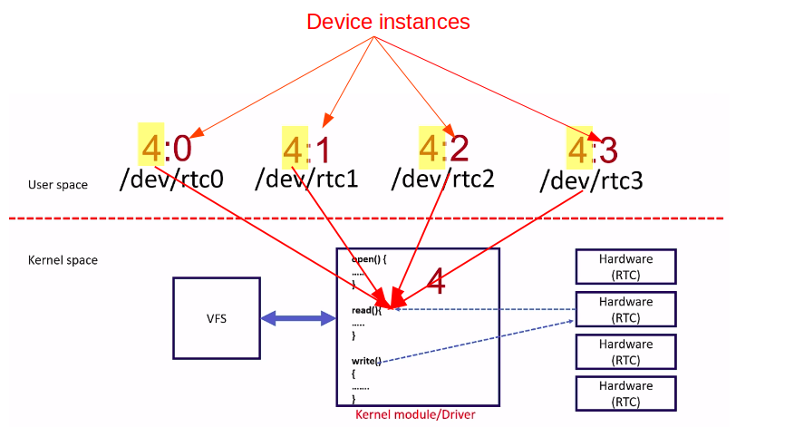
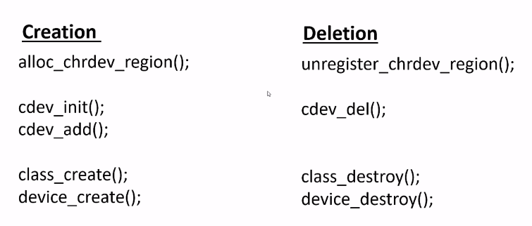
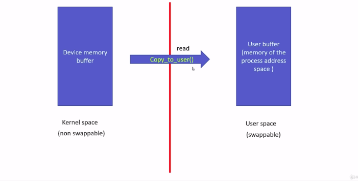
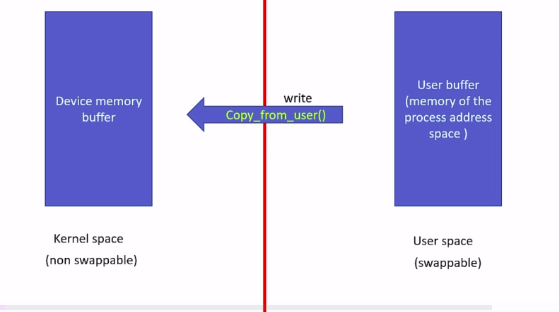

## 1. Vấn đề

Trên MCU, khi muốn điều khiển một ngoại vi, ví dụ như UART:

```c
// STM32 HAL
HAL_UART_Transmit(&huart1, data, len, HAL_MAX_DELAY);
```

Không có lớp trung gian. Code chạy trực tiếp trên phần cứng, không có process khác tranh chấp, không có memory protection. Đây là mô hình bare-metal: một chương trình, một CPU, toàn quyền.

Khi chuyển sang Linux, developer thường hỏi: *"Tại sao không làm vậy được?"*

Câu trả lời nằm ở hai điểm:

**Thứ nhất: Linux là hệ thống đa tiến trình.** Có thể có 5 process cùng muốn ghi UART một lúc. Nếu mỗi process tự gọi thẳng vào hardware register, dữ liệu sẽ xen lẫn nhau và không process nào nhận được output đúng.

**Thứ hai: Linux có memory protection.** User space process không được phép truy cập physical address của hardware register trực tiếp. Kernel chặn điều này thông qua MMU.

## 2. Các loại device trong linux

Trong Linux, tất cả thiết bị phần cứng đều được quản lý thông qua device driver, và các thiết bị này thường thuộc một trong ba loại chính:
| Loại | Đặc điểm | Ví dụ |
|---|---|---|
| **Character device** | Truy cập tuần tự, từng byte | UART, GPIO, sensor |
| **Block device** | Truy cập theo block, có buffer | eMMC, SD card |
| **Network device** | Không có file trong `/dev`, dùng socket | eth0, wlan0 |

Mỗi loại device có cách truy cập dữ liệu khác nhau, ảnh hưởng đến cách hệ điều hành xử lý I/O.

### 2.1. Block device

Block device là các thiết bị đọc/ghi dữ liệu theo từng block (thường là 512KB hoặc 4KB) và có cơ chế caching/buffering để tối ưu hiệu suất.

Ví dụ:
- Ổ cứng (/dev/sda)
- Thẻ nhớ (/dev/mmcblk0)
- Ổ USB (/dev/sdb)

**Luồng xử lý của block device**

```
┌────────────────────────────────────────────┐
│                User Space                  │
│  e.g. dd if=/dev/sda of=file.img           │
└────────────────────────────────────────────┘
                    │
                    ▼
┌────────────────────────────────────────────┐
│              VFS Layer (Generic)           │
│  → gọi read/write/lseek thông qua fs layer │
└────────────────────────────────────────────┘
                    │
                    ▼
┌────────────────────────────────────────────┐
│           Page Cache / Buffer Cache        │
│  → Kernel lưu dữ liệu vào cache page       │
│  → Gom các yêu cầu nhỏ thành khối lớn      │
└────────────────────────────────────────────┘
                    │
                    ▼
┌────────────────────────────────────────────┐
│             Block Layer (I/O Scheduler)    │
│  → Quyết định thứ tự truy cập block        │
│  → Gom nhóm request theo sector            │
└────────────────────────────────────────────┘
                    │
                    ▼
┌────────────────────────────────────────────┐
│          Block Device Driver (e.g. NVMe)   │
│  struct block_device_operations { ... }    │
│  → Nhận request (bio, blk_mq), xử lý I/O   │
└────────────────────────────────────────────┘
                    │
                    ▼
┌────────────────────────────────────────────┐
│              Hardware Device               │
│     (HDD, SSD, eMMC, SD card, etc.)        │
│  → Thực hiện đọc/ghi theo sector/block     │
└────────────────────────────────────────────┘
```

### 2.2. Network device

Network device là thiết bị giao tiếp với mạng, không sử dụng cơ chế đọc/ghi theo byte hoặc block như hai loại trên.

Ví dụ:
- Card mạng Ethernet (eth0, wlan0)
- Adapter Wi-Fi (wlan0)
- Interface loopback (lo)
- Virtual network interfaces (tun0, tap0)

Network devices không có file trong /dev/, thay vào đó, chúng xuất hiện trong danh sách giao diện mạng: `ip link show`

### 2.3. Character device

Character device là loại thiết bị truy cập dữ liệu theo từng byte, không có cache hoặc buffer trung gian.

Ví dụ: Khi gõ phím, ký tự ngay lập tức được gửi đi mà không cần chờ bộ đệm đầy.

Một số character device tiêu biểu:
- Bàn phím (/dev/input/eventX)
- Chuột (/dev/input/mice)
- Serial ports (/dev/ttyS0)
- GPIO (/dev/gpiochipX)
- I2C, SPI

**Luồng xử lý của character device**

```
┌────────────────────────────────────────────┐
│                User Space                  │
│  e.g. cat /dev/ttyS0  or  write(fd, buf)   │
└────────────────────────────────────────────┘
                    │
                    ▼
┌────────────────────────────────────────────┐
│              VFS Layer (Generic)           │
│  → Gọi hàm file_operations->read()/write() │
└────────────────────────────────────────────┘
                    │
                    ▼
┌────────────────────────────────────────────┐
│           Character Device Driver          │
│  struct file_operations {                  │
│     .read = my_read, .write = my_write     │
│  }                                         │
│  → Driver thao tác trực tiếp với HW        │
└────────────────────────────────────────────┘
                    │
                    ▼
┌────────────────────────────────────────────┐
│              Hardware Device               │
│    (UART, GPIO, LED, I2C, SPI, etc.)       │
│  → Gửi/nhận byte, điều khiển chân I/O      │
└────────────────────────────────────────────┘
```

Với embedded developer, character device là loại phổ biến nhất - hầu hết ngoại vi giao tiếp tuần tự (UART, I2C, SPI, GPIO) đều được implement dưới dạng character device.

## 3. Device file

Device file hay device node là một file đặc biệt nằm trong folder `/dev` được kernel tạo ra nhằm mục đích cho phép tầng user giao tiếp với driver thông qua file.

Nó không phải là file thật chứa dữ liệu, mà chỉ là interface để chuyển system call từ user xuống driver.

Ví dụ:

```bash
echo 1 > /dev/led
```

Kernel sẽ thực hiện chuỗi sau:

```scss
user-space
   ↓
sys_write()
   ↓
vfs_write()
   ↓
file->f_op->write()   ← gọi tới hàm `write` trong driver của bạn
```

$\rightarrow$ Tức là `/dev/led` chỉ là một entry để kernel biết lệnh `write` này thuộc driver nào.

Khi tạo ra device file thì OS cho phép driver được phép đăng ký các hàm đọc, ghi, mở, đóng,...cho device file đấy. Khi thực hiện các hàm này trên tầng user thì những hàm tương ứng ở driver sẽ được gọi $\rightarrow$ cơ chế này được gọi là device file operation.

Các nguyên mẫu hàm sẽ như sau:

```c
static int dev_open(struct inode *, struct file *);
static int dev_close(struct inode *, struct file *);
static ssize_t dev_read(struct file*filep, char __user *buf, size_t len, loff_t *offset);
static ssize_t dev_write(struct file*filep, const char __user *buf, size_t len, loff_t *offset);
```

## Device number

Device file sẽ được đại diện bởi hai con số:
- Major number sẽ cho biết driver nào sẽ xử lý request.
- Minor number dùng để phân biệt giữa các device khác nhau do cùng một driver quản lý.



Ví dụ:

Giả sử ta có 2 LED do cùng một driver điều khiển:

| Device file | Major | Minor | Driver |
|-------------|-------|-------|--------|
| `/dev/led0` | 240   | 0     | `led_driver` |
| `/dev/led1` | 240   | 1     | `led_driver` |

Cả hai node này đều trỏ về cùng driver (major=240), nhưng khác minor (để phân biệt từng thiết bị vật lý).

OS sẽ quản lý việc driver sẽ điều khiển device nào thông qua bộ số này => driver tạo ra device file thì phải đăng ký bộ số device number.

**Khi mà OS nhận được lời gọi đọc ghi vào một device file bất kỳ thì nó sẽ lấy ra bộ số device number và compare với các driver nào đã đăng ký với VFS, từ đó xem các driver nào có bộ số device number trùng với nó thì nó sẽ chuyển lời gọi đọc ghi cho driver đấy.**

## Tạo device file

Kernel tạo device file bằng cách:

**Tạo bằng udev**

- khi driver gọi `device_create`
- kernel gửi sự kiện udev lên user space
- Tiến trình `udevd` nhận event đó, đọc thông tin: major, minor và name.
- Tự động gọi `mknod` để tạo `/dev/xxx`

Đây là cách chuẩn trên desktop Linux và các embedded distro đầy đủ như Yocto.

**Tạo bằng command line mknod**

```bash
mknod /dev/led c 240 0
```

Dùng để test nhanh hoặc trong môi trường embedded tối giản không có udev. Nhược điểm: phải tạo tay mỗi lần, không tự động mất đi khi driver unload.

**Driver tự tạo**

Trong môi trường không có udev (busybox init, initramfs đơn giản), driver phải tự gọi `device_create()` và đảm bảo `/dev` đã được mount. Ít phổ biến hơn nhưng hay gặp trong firmware nhỏ.

## Đăng ký một character device

### Cấp phát và đăng ký bộ số driver number

Để cấp pháp bộ số driver number, ta sử dụng API `alloc_chrdev_region`.

Nguyên mẫu hàm của nó như sau:

```c
int alloc_chrdev_region(dev_t *dev, unsigned int firstminor, unsigned int count, char *name);
```

Trong đó:
- `dev`: struct lưu bộ số major và minor được cấp phát
- `count`: số lượng minor được yêu cầu.
- `name`: Tên cho bộ số device number.

Major sẽ được chọn tự động và được trả về cùng với minor trong dev. Để tạo ra major, ta có thể sử dụng macro `MAJOR`:

```c
int dev_major = MAJOR(dev);
```

### Khởi tạo một character device

Ta có thể khởi tạo một character device mới và đăng ký struct `file_operations` thông qua hàm `cdev_init`.

Nguyên mẫu hàm của nó như sau:

```c
void cdev_init(struct cdev *cdev, const struct file_operations *fops);
```

Trong đó:
- struct `cdev` đại diện cho một character device và được cấp phát qua hàm này.

Sau đó, ta sẽ đăng ký device này vào trong system thông qua API `cdev_add`.

Nguyên mẫu hàm của nó như sau:

```c
int cdev_add(struct cdev *p, dev_t dev, unsigned count);
```

### Tạo device file

Để tạo một device file và đăng ký nó với sysfs, ta sử dụng API `device_create`.

Nguyên mẫu hàm của nó như sau:

```c
struct device * device_create(struct class *class, struct device *parent, dev_t devt, const char *fmt, ...);
```

Trong đó:
- `class` được lấy từ giá trị trả về của hàm `class_create`:
  ```c
  struct class *class_create(struct module *owner, const char *name)
  ```

Nếu thành công sẽ có một device file với tên là tham số cuối cùng truyền vào hàm `device_create` và device file này sẽ nằm trong thư mục `/dev/`.

### Giải phóng một character device

Khi gỡ kernel module khởi kernel, ta cần phải xoá tất cả các tài nguyên đã yêu cầu từ kernel.

Nhìn vào hình sau, tương ứng với việc tạo thì ta cần dùng API tương ứng để xoá.



## Read/write device file

Trên MCU, khi muốn copy dữ liệu từ buffer này sang buffer khác, dùng `memcpy` là chuyện bình thường. Nhưng trong Linux kernel, copy giữa kernel space và user space không thể dùng `memcpy` vì ba lý do:

**Thứ nhất - con trỏ user space có thể không hợp lệ.** User space application có thể truyền vào một con trỏ NULL, một địa chỉ chưa được map, hoặc cố tình truyền địa chỉ của kernel space. Nếu kernel dereference thẳng con trỏ đó, kết quả là kernel panic.

**Thứ hai - page có thể chưa có trong RAM.** Linux dùng lazy allocation - page của user space có thể đang bị swap ra disk. `copy_from_user` xử lý page fault một cách an toàn; `memcpy` thì không.

**Thứ ba - kiến trúc có thể yêu cầu cơ chế đặc biệt.** Trên một số kiến trúc, user space và kernel space dùng segment register khác nhau - copy trực tiếp bằng `memcpy` sẽ copy sai vùng nhớ.

### Read device file

Khi process từ user space thực hiện lệnh đọc tới một device file thì driver sẽ đọc thông tin này từ phần cứng và sao chép dữ liệu này sang phía user.



Nguyên mẫu hàm của nó như sau:

```c
unsigned long copy_to_user(void __user *to, const void *from, unsigned long n);
```

### Write device file

Khi process từ user space thực hiện lệnh ghi tới device file thì sẽ ngược lại, driver thực hiện sao chép dữ này cần ghi từ user vào kernel và ghi dữ liệu này tới phần cứng.



Nguyên mẫu hàm của nó như sau:

```c
unsigned long copy_from_user(void *to, const void __user *from, unsigned long n);
```

## I/O Control

### Vấn đề

Thông thường, khi giao tiếp với device sẽ thông qua hai hàm sau:

```
read     → đọc dữ liệu từ thiết bị
write    → ghi dữ liệu ra thiết bị
```

Nhưng những hàm này chỉ phù hợp cho truyền nhận dữ liệu tuần tự, kiểu như:

- UART: `read` nhận byte, `write` gửi byte.
- ADC: `read` lấy mẫu giá trị.

Vậy nếu muốn thực hiện hành động đặc biệt mà không phải đọc/ghi dữ liệu, ví dụ:
- Bật/tắt LED
- Đặt tốc độ baudrate của UART
- Reset thiết bị
- Chọn chế độ hoạt động (MODE_1, MODE_2, MODE_3)

Dùng `write` để truyền lệnh điều khiển là có thể, nhưng phải tự định nghĩa protocol, tự parse - dễ lỗi và khó maintain. `ioctl` giải quyết bài toán này bằng cách cung cấp một kênh giao tiếp có cấu trúc giữa user space và driver.

**Ví dụ:**

Giả sử có led driver:

| Lệnh            | Ý nghĩa                 |
|-----------------|-------------------------|
| `LED_ON`        | Bật LED                 |
| `LED_OFF`       | Tắt LED                 |
| `LED_TOGGLE`    |	Đảo trạng thái          |
| `LED_GET_STATE` |	Đọc trạng thái hiện tại |

Nếu dùng `write`, ta phải gửi chuỗi “on/off/toggle", điều này rất rườm rà, không chuẩn. Còn nếu dùng `ioctl`, ta chỉ việc:

```c
ioctl(fd, LED_ON);
```

và driver hiểu ngay “bật LED”.

### IO control command

Mỗi ioctl command là một số nguyên 32-bit được encode theo quy ước của kernel:

```
 31      30-29    28-16      15-8     7-0
┌──────┬────────┬─────────┬────────┬────────┐
│ (1b) │  dir   │  size   │  type  │ number │
│unused│ (2 bit)│ (13 bit)│ (8 bit)│ (8 bit)│
└──────┴────────┴─────────┴────────┴────────┘
```

- **type**: một ký tự ASCII định danh cho driver, ví dụ `'E'` cho echo_demo
- **number**: số thứ tự của command trong driver đó
- **size**: kích thước data truyền kèm
- **dir**: hướng truyền dữ liệu

Kernel cung cấp 4 macro để tạo command:

| Macro                       | Hướng dữ liệu     | Ý nghĩa |
|-----------------------------|-------------------|---------|
| `_IO(type, nr)`	            | Không có dữ liệu  | Gửi lệnh đơn giản |
| `_IOR(type, nr, data_type)`	| Read	           | Driver gửi dữ liệu về user |
| `_IOW(type, nr, data_type)` | Write             | User gửi dữ liệu xuống driver |
| `_IOWR(type, nr, data_type)`| Read/Write        | Hai chiều |

## Sysfs

Sysfs là một virtual filesystem trong linux kernel, được dùng để user space có thể tương tác với các đối tượng trong kernel như device, driver, subsystem và bus.

Sysfs giúp user:
- Xem trạng thái của kernel, thiết bị, hoặc driver.
- Điều khiển cấu hình phần cứng khi runtime
- Debug

| Loại đối tượng   | Cấu trúc đại diện trong kernel  | Mô tả                                             |
| ---------------- | ------------------------------- | ------------------------------------------------- |
| **Device**       | `struct device`                 | Thiết bị vật lý hoặc logic                        |
| **Driver**       | `struct device_driver`          | Trình điều khiển cho thiết bị                     |
| **Bus**          | `struct bus_type`               | Kiểu bus kết nối (I2C, SPI, platform, PCI, …)     |
| **Class**        | `struct class`                  | Nhóm logic của các thiết bị (net, leds, input, …) |
| **Kobject/Kset** | `struct kobject`, `struct kset` | Hạ tầng quản lý sysfs                             |

Tất cả mọi đối tượng trong `/sys` đều bắt đầu từ `struct kobject`:
- Khi kernel tạo ra một `kobject`, sysfs sẽ tự động sinh ra một thư mục tương ứng trong `/sys`.
- Các file bên trong thư mục đó được gọi là attributes,
- và được ánh xạ với các callback hàm `show`() và `store`() trong kernel.

👉 Kết luận:
- kobject → tạo thư mục.
- attribute → tạo file.
- show()/store() → quy định cách đọc/ghi file đó.

### Cơ chế show/store hoạt động như thế nào

Khi user đọc file bằng `cat`, sysfs gọi:

```
show() → ghi dữ liệu vào buffer (buf)
```

Khi user ghi file bằng `echo`, sysfs gọi:

```
store() → nhận buffer (buf) chứa dữ liệu
```

Ngoài ra:
- Kích thước buffer mặc định ~ PAGE_SIZE (4KB).
- Giá trị trả về là số byte đã đọc/ghi.

### Quản lý nhóm attribute

Khi có nhiều file, thay vì gọi `sysfs_create_file` nhiều lần, ta dùng nhóm:

```c
static struct attribute *my_attrs[] = {
    &my_attribute1.attr,
    &my_attribute2.attr,
    NULL,
};

static const struct attribute_group my_attr_group = {
    .attrs = my_attrs,
};
```

Rồi đăng ký:

```c
sysfs_create_group(my_kobj, &my_attr_group);
```

→ Tạo đồng loạt nhiều file.

## Tham khảo

[Dynamically allocating char device numbers](https://fastbitlab.com/dynamically-allocating-char-device-numbers/)

[Character device registration](https://fastbitlab.com/character-device-registration/)

[Character device registration contd](https://fastbitlab.com/linux-device-driver-programming-lecture-32-character-device-registration-contd/)

[Character driver file operation methods](https://fastbitlab.com/character-driver-file-operation-methods/)

[Creating device files](https://fastbitlab.com/creating-device-files/)

[Character driver cleanup function implementation](https://fastbitlab.com/character-driver-cleanup-function-implementation/)