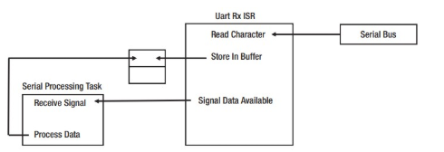

# Interrupt

## Mô hình thiết kế

Mô hình thiết kế để nhận và xử lý dữ liệu nối tiếp có thể được nhìn thấy trong hình bên dưới. Một interrupt được sử dụng để nhận một ký tự đơn lẻ từ UART. Ký tự được đọc vào một buffer và sau đó một tín hiệu được sử dụng để thông báo một task rằng có một ký tự sẵn sàng được xử lý. Mẫu thiết kế rất đơn giản, nhưng nó thực hiện được một số điều đối với developer, chẳng hạn như:
- Giảm thiểu software overhead liên quan đến kiến trúc polling
- Giảm thiểu quá trình xử lý trong ISR bằng cách chỉ đọc ký tự
- Xử lý yêu cầu hard real-time requirement (nhận một ký tự), và báo hiệu (signal) một task khác để - xử lý soft real-time requirement (xử lý dữ liệu).
- Cung cấp hành vi xác định cho hệ thống



## Luồng xử lý ngắt trong kiến trúc ARM

```
 ┌──────────────────────────────────────────────┐
 │ Thiết bị phần cứng                           |
 │ (GPIO/UART/Timer) tạo tín hiệu IRQ           │
 └──────────────────────────────────────────────┘
                     │
                     ▼
 ┌──────────────────────────────────────────────┐
 │ Generic Interrupt Controller                 │
 │  - Hardware gửi tín hiệu -> GIC ghi nhận IRQ │
 │  - Đánh số IRQ ID                            │
 │  - Xác định core nào cần xử lý               │
 │  - Gửi tín hiệu IRQ đến core đó              │
 │                                              │
 │  -> Quản lý, định tuyến IRQ tới core         │
 └──────────────────────────────────────────────┘
                     │
                     ▼
 ┌──────────────────────────────────────────────┐
 │ Core nhận IRQ, lưu context vào stack         │
 │  - Nhảy đến Vector Table                     │
 │  - Gọi irq_handler trong kernel              │
 └──────────────────────────────────────────────┘
                     │
                     ▼
 ┌──────────────────────────────────────────────┐
 │ Kernel Generic IRQ Subsystem                 │
 │  - do_IRQ() → handle_domain_irq() → handler  │
 │  - Gọi hàm ISR driver đăng ký                │
 └──────────────────────────────────────────────┘
                     │
                     ▼
 ┌──────────────────────────────────────────────┐
 │ Driver ISR (Top-half / Bottom-half)          │
 │  - Xử lý nhanh trong ISR                     │
 │  - Hoặc defer qua Tasklet/Workqueue          │
 └──────────────────────────────────────────────┘
```

## Process context và Interrupt context

### Process context

Mô tả:
- Kernel đang thực thi thay mặt cho một process cụ thể.
- Xảy ra khi user gọi system call (read(), write(), ioctl(), v.v.)
- Kernel mượn stack và PID của process user đó để thực hiện công việc.

Đặc điểm:
- Có thể block, sleep hoặc schedule: msleep, wait_event, semaphore, mutex,...
- Có thể truy cập user memory
- Bị scheduler điều phối hay preemp.
- Thời gian xử lý dài

### Interrupt context

Mô tả:
- kernel đang xử lý một ngắt phần cứng hoặc ngắt mềm
- Không thuộc về bất kỳ process nào.

Đặc điểm:
- Không thể block, sleep và scheduler
- Không bị scheduler điều phối hay non-preemp.
- Phải xử lý cực nhanh

## Độ ưu tiên

| Loại interrupt                      | Ưu tiên   | Vai trò |
|-------------------------------------|-----------|---------|
| NMI                                 | Cực cao   | Không thể bị chặn, dùng cho watchdog, panic,... |
| Hardware IRQ	                      | Cao	      | Xử lý phần cứng, thường là ISR driver |
| SoftIRQ / Tasklet                   | Trung bình|	Xử lý phần việc còn lại của ngắt (bottom half) |
| Scheduler / Kernel thread / Process |	Thấp hơn  | Thực thi công việc bình thường, có thể bị preempt bởi IRQ |

## Top half và Bottom half

Khi một IRQ xảy ra, kernel gọi ISR mà ta đăng ký qua `request_irq`. ISR này là top half — phải thực hiện thật nhanh.

```css
ISR (Top Half)
   ├─ Xử lý tối thiểu như đọc thanh ghi, lưu trạng thái
   ├─ Không được sleep
   └─ Lên lịch phần công việc nặng cho Bottom Half
```

Phần bottom half là nơi ta làm việc “nặng” hơn: xử lý dữ liệu, gọi hàm sleep, hoặc cập nhật hệ thống.
Linux cung cấp nhiều cơ chế để thực hiện phần này, trong đó:
- Tasklet: chạy trong Interrupt context
- Workqueue: chạy trong Process context

```
┌──────────────────────────────┐
│           IRQ xảy ra         │
└──────────────────────────────┘
               │
               ▼
┌────────────────────────────────────────────┐
│   ISR (Top Half)                           │
│ - Đọc thanh ghi                            │
│ - Ghi log nhanh                            │
│ - Gọi tasklet_schedule() / schedule_work() │
└────────────────────────────────────────────┘
               │
               ├──► Tasklet (SoftIRQ Context)
               │      - Nhanh, không sleep
               │      - Chạy ngay sau khi IRQ kết thúc
               │
               └──► Workqueue (Process Context)
                      - Có thể sleep, chậm hơn
                      - Chạy trong thread kworker
```

**Tasklet**

- Tasklet là một software interrupt được kernel gọi ở mức ưu tiên thấp hơn so với hardware interrupt.
- Có thể bị preempt bởi hard interrupt, nhưng không ngược lại.

```c
#include <linux/interrupt.h>

void my_tasklet_func(unsigned long data)
{
    pr_info("Tasklet running, data=%lu\n", data);
    // Không được gọi msleep(), mutex_lock(), v.v.
}

DECLARE_TASKLET(my_tasklet, my_tasklet_func, 123);

static irqreturn_t my_irq_handler(int irq, void *dev_id)
{
    // Xử lý nhẹ
    tasklet_schedule(&my_tasklet);
    return IRQ_HANDLED;
}
```

**Workqueue**

- Workqueue hoạt động bằng cáh đẩy công việc vào hàng đợi và được gọi là work item.
- Kernel tạo worker thread để xử lý các work item đó

```c
#include <linux/workqueue.h>

void my_work_func(struct work_struct *work)
{
    pr_info("Workqueue running\n");
    msleep(50); // OK: được phép sleep!
}

DECLARE_WORK(my_work, my_work_func);

static irqreturn_t my_irq_handler(int irq, void *dev_id)
{
    schedule_work(&my_work);
    return IRQ_HANDLED;
}
```

## Debug

Trong file `/proc/interrupts` sẽ chứa các các ngắt được đăng ký, ta có thể vào đây để kiểm tra.


Trong đó:
- cột 1 chứa interrupt line.
- các cột CPU cho biết số lượng ngắt đã xảy ra trên từng CPU.
- 2 cột tiếp theo lần lượt chỉ nguồn ngắt và loại ngắt.
- cột cuối chứa tên thiết bị hoặc driver đăng ký xử lý ngắt đó.