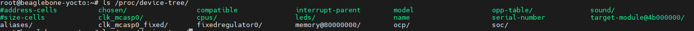
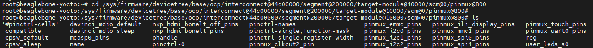

# Device tree

## Vấn đề

Trước khi có device tree, khi ta viết driver chúng ta cần phải định nghĩa địa chỉ thanh ghi, IRQ, GPIO,...

Điều này là không ổn vì mỗi board lại có phần cứng khác nhau -> Để board có thể chạy đc, ta cần phải build lại source kernel cho mỗi board chỉ để thay đổi chân GPIO, IRQ,...

-> Cần có một giải pháp nào đó để ta không cần phải build lại source code cho các thay đổi đó mà luồng logic của driver vẫn không thay đổi.

Ví dụ: Ta có một driver điều khiển led chân GPIO2. Làm thế nào để khi ta thiết kế sao cho trừu tượng hóa chân điều khiển led, tức là kernel nó chỉ có nhiệm vụ điều khiển led và chân led nào sẽ do một thằng khác đảm nhiệm. Lúc này, khi ta thay đổi chân GPIO từ GPIO2 sang GPIO5 thì vẫn chạy tốt mà không cần phải build lại kernel.

-> Người ta tạo ra device tree hoặc ACPI, tuy nhiên ACPI chỉ dùng cho các kiến trúc x86. Với hệ thống nhúng sử dụng linux, ta sử dụng device tree.

## Khái niệm cốt lõi

Device Tree là một cây dữ liệu mô tả phần cứng của hệ thống cho kernel, nơi phần cứng có thể thay đổi tùy theo board, SoC hoặc thiết kế tùy chỉnh.

DT được mô tả bằng các tệp nguồn có phần mở rộng `.dts` (Device Tree Source) và `.dtsi` (Device Tree Source Include).

Các file này sẽ được biên dịch thành file `.dtb` (Device Tree Blob), đây là một file nhị phân mà bootloader sẽ nạp cùng với kernel.

```bash
dtc -I dts -O dtb -o am335x-boneblack.dtb am335x-boneblack.dts
```

Ta cũng có thể dịch ngược file `.dtb` thành file source `.dts`:

```bash
dtc -I dtb -O dts -o bone_black.txt am335x-boneblack.dtb
```

## Driver liên kết với node như thế nào

Mỗi driver có một bảng `of_device_id` chứa danh sách các chuỗi compatible mà nó hỗ trợ:

```c
static const struct of_device_id my_uart_dt_ids[] = {
    { .compatible = "ti,omap3-uart", },
    {  }
};
```

Khi kernel đọc `.dtb`, nó tạo device tương ứng và match với driver có compatible phù hợp.

Giả sử ta có cảm biến nhiệt độ I2C:

```
&i2c2 {
    status = "okay";
    tmp102@48 {
        compatible = "ti,tmp102";
        reg = <0x48>;
    };
};
```

→ Kernel tạo thiết bị `/dev/i2c-2` và node tương ứng cho `tmp102`
→ Driver TMP102 tìm thấy `compatible = "ti,tmp102"` → khởi tạo thiết bị.

## Cú pháp device tree

Một file .dts có 3 phần chính:

```
/dts-v1/;

#include "soc.dtsi"          // (1) Phần include

/ {                          // (2) Root node
    model = "BeagleBone Black";
    compatible = "ti,am335x-bone-black", "ti,am33xx";

    memory@80000000 {        // (3) Node con
        device_type = "memory";
        reg = <0x80000000 0x10000000>;
    };
};
```

Giải thích:

| Thành phần    | Ý nghĩa   |
|---------------|-----------|
| `/dts-v1/;`   | Bắt buộc — khai báo phiên bản Device Tree Source |
| `#include`    | Dùng để kế thừa file .dtsi (thường chứa phần mô tả SoC chung). |
| `/ { ... }`   | Root node — mô tả toàn bộ hệ thống. |
| `memory@... { ... }` | Node con — mô tả một thiết bị (theo địa chỉ @addr). |

### Cấu trúc node

```
node-name@unit-address {
    property-name = value;
    subnode-name { ... };
};
```

| Thành phần                | Ý nghĩa |
|---------------------------|---------|
| `node-name`	            | Tên của thiết bị |
| `@unit-address`	        | Địa chỉ phần cứng |
| `property-name = value;`	| Khai báo thuộc tính cho node. |
| `subnode-name`	        | Node con (ví dụ một thiết bị nằm trên bus I2C, SPI,...). |

Ví dụ:

```
uart0: serial@44e09000 {
    compatible = "ti,omap3-uart";
    reg = <0x44e09000 0x2000>;
    interrupts = <72>;
    status = "okay";
};
```

### Kiểu giá trị hợp lệ

| Dạng          | Ví dụ	                        | Ý nghĩa |
|---------------|-------------------------------|---------|
| String	    | `status = "okay";`            | Giá trị dạng chuỗi |
| Integer (cell)| `reg = <0x40000000 0x1000>;`  | Số nguyên 32-bit trong dấu < > |
| List (array)  | `interrupts = <1 2 3>;`       | Danh sách nhiều giá trị |
| Phandle   	| `clocks = <&clk1>;`           | Tham chiếu tới node khác |
| Boolean	    | `bootph-all;`                 | Không có giá trị — chỉ cần tồn tại là “true” |

### Thuộc tính `reg`

`reg` mô tả:
- Địa chỉ bắt đầu (base address) của thiết bị trong không gian địa chỉ.
- Kích thước (size) vùng địa chỉ mà thiết bị chiếm dụng.

→ Kernel dựa vào đây để map vùng đó vào virtual address space và truy cập thanh ghi của thiết bị.

Để kernel hiểu cách đọc `reg`, nó cần biết:

| Thuộc tính cha    | Ý nghĩa                       |
|-------------------|-------------------------------|
| `#address-cells`	| Số ô 32-bit mô tả địa chỉ     |
| `#size-cells`	    | Số ô 32-bit mô tả kích thước  |

❓ Tại sao lại cần thêm thuộc tính `#address-cells` và `#size-cells`

Bởi vì trong SoC không chỉ có một không gian địa chỉ tuyến tính duy nhất mà nó có nhiều bus lồng nhau ví dụ như I2C, SPI, PCI, USB,...

-> Tức là một bus nó sẽ có một địa chỉ khác nhau, các node con trên một bus cần phải theo mô tả của node cha.

Ví dụ:

```
&i2c2 {
    #address-cells = <1>;
    #size-cells = <0>;  // vì I²C chỉ có địa chỉ, không có vùng nhớ
    tmp102@48 {
        reg = <0x48>;
    };
};
```

Ở đây, ta có node `i2c2` đại diện cho bus `i2c2` và nó có node con là `tmp102`. Ở đây ta cần phải cho kernel biết `tmp102` thuộc địa chỉ nào trong bus `i2c2`. Tuy nhiên, địa chỉ I2C nó chỉ cần một ô address và nó không cần ô size -> Nên node cha cần thêm 2 thuộc tính `#address-cells = <1>` và `#size-cells = <0>` để mô tả điều này.

### Mối liên hệ giữa `reg` và `ranges`

Nếu node con nằm trong bus, `reg` trong node con không phải địa chỉ vật lý tuyệt đối, mà là địa chỉ tương đối so với bus. Khi đó, bus node có thuộc tính ranges để ánh xạ lại sang địa chỉ vật lý.

```
soc {
    #address-cells = <1>;
    #size-cells = <1>;
    ranges = <0x0 0x48000000 0x01000000>; // base offset mapping

    uart0: serial@20000 {
        reg = <0x20000 0x1000>; // offset trong bus
    };
};
```

→ Kernel dùng `ranges` để quy đổi 0x20000 → 0x48020000 thực tế.

### Thuộc tính label

`label` là tên tượng trưng dùng để tham chiếu đến node. Nó không xuất hiện trong file nhị phân `.dtb`.

**Tham chiếu với `phandle`**

Được dùng để tham chiếu các node với nhau trong file `.dtb`

Ví dụ:

```
gpio1: gpio@4804c000 {
    compatible = "ti,omap4-gpio";
    reg = <0x4804c000 0x1000>;
    gpio-controller;
    #gpio-cells = <2>;
};

leds {
    compatible = "mycompany,myled";
    gpios = <&gpio1 28 GPIO_ACTIVE_HIGH>;
};
```

**node override hoặc node extension**

Dùng để mở lại một node đã được định nghĩa ở nơi khác, rồi bổ sung hoặc thay đổi nội dung bên trong node đó.

Ví dụ:

🔹 Trong file SoC `.dtsi`

```
i2c2: i2c@4802a000 {
    compatible = "ti,omap4-i2c";
    reg = <0x4802a000 0x1000>;
    status = "disabled";
};
```

🔹 Trong file board `.dts`

```
&i2c2 {
    status = "okay";

    eeprom@50 {
        compatible = "atmel,24c02";
        reg = <0x50>;
    };
};
```

## Device tree bindings

Một số thiết bị cần mô tả nhiều thông tin hơn so với device tree specification -> Device tree binding

-> Tức là nó mô tả cụ thể hơn cho một device.

Ví dụ như lcd, nó sẽ mô tả thêm thông tin như width, height,...

Binding là một document nằm trong thư mục của kernel:

```
Documentation/devicetree/bindings/
```

**Cấu trúc chung của một file binding**

```
<Title> Device Tree Bindings
=================================

Required properties:
- compatible: Must be "vendor,device"
- reg: Address and size of the register set
- interrupts: The interrupt line used by the device

Optional properties:
- clocks: Reference to the clock controlling this device
- power-gpios: GPIO line to enable power

Example:
    uart0: serial@44e09000 {
        compatible = "ti,omap3-uart";
        reg = <0x44e09000 0x2000>;
        interrupts = <72>;
        clocks = <&uart_clk>;
        status = "okay";
    };
```

**Ý nghĩa của từng phần**

| Phần                  | Mô tả                                                         |
|-----------------------|---------------------------------------------------------------|
| Title                 | Tên thiết bị hoặc subsystem                                   |
| Required properties   | Liệt kê các property bắt buộc phải có trong node Device Tree  |
| Optional properties   | Các property bổ sung tùy theo phần cứng                       |
| Child nodes (nếu có)  | Nếu thiết bị là bus hoặc có node con                          |
| Example               | Mẫu cụ thể trong .dts để người dùng tham khảo                 |

## Debug

### Xem device tree lúc runtime

Muốn xem device tree trong lúc runtime, ta sử dụng một trong hai câu lệnh sau:

```bash
ls /proc/device-tree
# hoặc
ls /sys/firmware/devicetree/base
```

Khi nhấn enter, nó sẽ hiển thị cây thư mục tương ứng file dtb:



**Tìm một node bất kỳ**

```bash
find /sys/firmware/devicetree/base -name "node@*"
```

Ví dụ:

```bash
find /sys/firmware/devicetree/base -name "i2c@*"
```

-> Output:

```bash
/sys/firmware/devicetree/base/ocp/interconnect@48000000/segment@100000/target-module@9c000/i2c@0
/sys/firmware/devicetree/base/ocp/interconnect@48000000/segment@0/target-module@2a000/i2c@0
/sys/firmware/devicetree/base/ocp/interconnect@44c00000/segment@200000/target-module@b000/i2c@0
```

**Kiểm tra một node bất kỳ**

Đầu tiên, ta cần tìm node đấy nằm ở đâu trong `sys/firmware/devicetree/base`.

Khi đã có đường dẫn đến node thì ta có thể thấy các thuộc tính:
- `compatible` – chuỗi compatible đúng driver?
- `status` – “okay” hay “disabled”?
- `reg` – địa chỉ base, size
- `gpios`, `interrupts`, `clocks`, v.v.

Đọc các thuộc tính này bằng lệnh:
- `cat`: đối với các file text thuần.
- `hexdump -C`: đối với các file binary.

Ví dụ 1:

```bash
cat /sys/firmware/devicetree/base/ocp/interconnect@48000000/segment@100000/target-module@a0000/spi@0/compatible
```

-> Output: ti,omap4-mcspi

Ví dụ 2:

```bash
hexdump -C /sys/firmware/devicetree/base/ocp/interconnect@48000000/segment@100000/target-module@a0000/spi@0/interrupts
```

-> Output:

```bash
00000000  00 00 00 7d                                       |...}|
00000004
```

### Debug pinmux

**Kiểm tra device tree runtime**

Muốn xem các pinmux hiện có trong device tree lúc runtime ta sử dụng:

``` bash
find /sys/firmware/devicetree/base -name "pinmux@*"
# Output: /sys/firmware/devicetree/base/ocp/interconnect@44c00000/segment@200000/target-module@10000/scm@0/pinmux@800

cd /sys/firmware/devicetree/base/ocp/interconnect@44c00000/segment@200000/target-module@10000/scm@0/pinmux@800
ls
```

Ví dụ output:



Từ đây, ta có thể kiểm tra pinmux mong muốn, ví dụ:

```bash
hexdump -C pinmux_spi0_pins/pinctrl-single,pins
```

**Xem mỗi chân hiện đang được mux thành chức năng gì**

Lệnh:

```bash
grep PINX /sys/kernel/debug/pinctrl/44e10800.pinmux-pinctrl-single/pinmux-pins
```

Ví dụ:

```bash
grep PIN0 /sys/kernel/debug/pinctrl/44e10800.pinmux-pinctrl-single/pinmux-pins
```

-> Output:

```bash
pin 0 (PIN0): 481d8000.mmc (GPIO UNCLAIMED) function pinmux_emmc_pins group pinmux_emmc_pins
```

-> Cách này giúp xác định xem chân ta muốn dùng đang bị peripheral nào claim hay chưa.

**Xem raw register của từng pin**

Lệnh:

```bash
grep PINX /sys/kernel/debug/pinctrl/44e10800.pinmux-pinctrl-single/pins
```

Ví dụ:

```bash
grep PIN0 /sys/kernel/debug/pinctrl/44e10800.pinmux-pinctrl-single/pins
```

-> Output:

```bash
pin 0 (PIN0) 0:gpio-0-31 44e10800 00000031 pinctrl-single
```

Với AM335x pin register layout như sau:

```
bit 5: Pull-disable
bit 4: Pull-up/down select (0=pulldown, 1=pullup)
bit 3: Receiver enable (input enabled)
bit 2: Slew fast/slow
bit 0-2: Mode (0-7)
```

-> Từ đây, có thể xác định chân pin có được config đúng như mình mong muốn hay không.

### So sánh device tree source và runtime

**Lấy lại file DTB đang chạy**

Nếu filesystem có sẵn file .dtb:

```bash
ls /boot/dtbs
```

Nếu không, bạn có thể dump lại từ /sys/firmware/fdt:

```bash
dd if=/sys/firmware/fdt of=/tmp/running.dtb
```

**Dùng dtc để decompile**

Copy file `.dtb` sang máy host, rồi sử dụng lệnh dtc.

```bash
dtc -I dtb -O dts -o running.dts running.dtb
```

**Diff với source**

Ví dụ đang sửa `am335x-boneblack.dts` trong kernel:

```bash
diff -u am335x-boneblack.dts running.dts | less
```