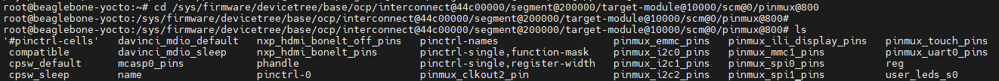

# Device tree

## Vấn đề

Trước khi có device tree, khi ta viết driver chúng ta cần phải định nghĩa địa chỉ thanh ghi, IRQ, GPIO,...

Điều này là không ổn vì mỗi board lại có phần cứng khác nhau -> Để board có thể chạy đc, ta cần phải build lại source kernel cho mỗi board chỉ để thay đổi chân GPIO, IRQ,...

-> Cần có một giải pháp nào đó để ta không cần phải build lại source code cho các thay đổi đó mà luồng logic của driver vẫn không thay đổi.

Ví dụ: Ta có một driver điều khiển led chân GPIO2. Làm thế nào để khi ta thiết kế sao cho trừu tượng hóa chân điều khiển led, tức là kernel nó chỉ có nhiệm vụ điều khiển led và chân led nào sẽ do một thằng khác đảm nhiệm. Lúc này, khi ta thay đổi chân GPIO từ GPIO2 sang GPIO5 thì vẫn chạy tốt mà không cần phải build lại kernel.

-> Người ta tạo ra device tree hoặc ACPI, tuy nhiên ACPI chỉ dùng cho các kiến trúc x86. Với hệ thống nhúng sử dụng linux, ta sử dụng device tree.

## Khái niệm cốt lõi

Device Tree giải quyết vấn đề bằng cách tách mô tả hardware ra khỏi kernel thành một file riêng — **Device Tree Source (.dts)** — compile thành binary **Device Tree Blob (.dtb)**. Bootloader (U-Boot) load DTB vào RAM và truyền pointer cho kernel khi boot. Kernel đọc DTB, tự cấu hình theo hardware hiện tại.

Flow tổng quát:

```
[board.dts]
    │
    ▼ dtc (compiler)
[board.dtb]
    │
    ▼ U-Boot load vào RAM
[Kernel] ← pointer đến DTB
    │
    ▼
Parse DTB → probe drivers
```

**Lợi ích 1 — Tránh hard-code, một kernel chạy nhiều board:**

Cùng một kernel binary, chỉ cần thay DTB là chạy được trên board khác. Không cần rebuild kernel.

**Lợi ích 2 — BSP modular, kế thừa theo dòng board:**

DTS hỗ trợ include và override — cho phép tổ chức BSP theo tầng. Đây chính xác là cấu trúc của BeagleBone trong tài liệu của khóa học này:

```
am33xx.dtsi
  └── am335x-bone-common.dtsi
        └── am335x-boneblack-common.dtsi
              └── am335x-boneblack.dts
```

Mỗi tầng chỉ mô tả những gì mới hoặc khác biệt so với tầng trên. Muốn support BeagleBone Blue hay BeagleBone WiFi? Chỉ cần viết thêm một file `.dts` mới, kế thừa từ `am335x-bone-common.dtsi`, override đúng những peripheral khác biệt. Không đụng đến kernel code.

**Lợi ích 3 — Ngôn ngữ khai báo, mô tả được topology phần cứng:**

DTS là ngôn ngữ **declarative** — mô tả *cái gì*, không mô tả *làm thế nào*. Điều này cho phép diễn đạt quan hệ giữa các thiết bị mà C rất khó biểu đạt mà không kèm logic điều kiện.

Ví dụ: mô tả UART1 kết nối vào interrupt controller nào. Trong C, driver phải tự biết số IRQ theo từng board — dẫn đến `if (board_type == BOARD_BBB)` rải rác khắp nơi. Trong DTS, chỉ cần khai báo quan hệ:

```dts
uart1: serial@48022000 {
    interrupt-parent = <&intc>;
    interrupts = <73 IRQ_TYPE_LEVEL_HIGH>;
};
```

## Driver liên kết với node như thế nào

Mỗi driver có một bảng `of_device_id` chứa danh sách các chuỗi compatible mà nó hỗ trợ:

```c
static const struct of_device_id my_uart_dt_ids[] = {
    { .compatible = "ti,omap3-uart", },
    {  }
};
```

Khi kernel đọc `.dtb`, nó tạo device tương ứng và match với driver có compatible phù hợp.

Giả sử ta có cảm biến nhiệt độ I2C:

```
&i2c2 {
    status = "okay";
    tmp102@48 {
        compatible = "ti,tmp102";
        reg = <0x48>;
    };
};
```

→ Kernel tạo thiết bị `/dev/i2c-2` và node tương ứng cho `tmp102`
→ Driver TMP102 tìm thấy `compatible = "ti,tmp102"` → khởi tạo thiết bị.

## Cú pháp device tree

### Cấu trúc tổng thể một file DTS

Một file `.dts` có 3 phần chính:

```
/dts-v1/;

#include "soc.dtsi"          // (1) Phần include

/ {                          // (2) Root node
    model = "BeagleBone Black";
    compatible = "ti,am335x-bone-black", "ti,am33xx";

    memory@80000000 {        // (3) Node con
        device_type = "memory";
        reg = <0x80000000 0x10000000>;
    };
};
```

Giải thích:

| Thành phần    | Ý nghĩa   |
|---------------|-----------|
| `/dts-v1/;`   | Bắt buộc — khai báo phiên bản Device Tree Source |
| `#include`    | Dùng để kế thừa file .dtsi (thường chứa phần mô tả SoC chung). |
| `/ { ... }`   | Root node — mô tả toàn bộ hệ thống. |
| `memory@... { ... }` | Node con — mô tả một thiết bị (theo địa chỉ @addr). |

### Cấu trúc node

Mỗi node đại diện cho một hardware component. Cú pháp:

```
node-name@unit-address {
    /* properties */
    /* child nodes */
};
```

| Thành phần                | Ý nghĩa |
|---------------------------|---------|
| `node-name`	            | Tên của thiết bị |
| `@unit-address`	        | Địa chỉ phần cứng |
| `property-name = value;`	| Khai báo thuộc tính cho node. |
| `subnode-name`	        | Node con (ví dụ một thiết bị nằm trên bus I2C, SPI,...). |

Ví dụ:

```
uart0: serial@44e09000 {
    compatible = "ti,omap3-uart";
    reg = <0x44e09000 0x2000>;
    interrupts = <72>;
    status = "okay";
};
```

### Property và các kiểu dữ liệu

Property là cặp name-value mô tả đặc tính của node. DTS hỗ trợ các kiểu dữ liệu sau:

| Dạng          | Ví dụ	                        | Ý nghĩa |
|---------------|-------------------------------|---------|
| String	    | `status = "okay";`            | Giá trị dạng chuỗi |
| Integer (cell)| `reg = <0x40000000 0x1000>;`  | Số nguyên 32-bit trong dấu < > |
| List (array)  | `interrupts = <1 2 3>;`       | Danh sách nhiều giá trị |
| Phandle   	| `clocks = <&clk1>;`           | Tham chiếu tới node khác |
| Boolean	    | `bootph-all;`                 | Không có giá trị — chỉ cần tồn tại là “true” |

### Thuộc tính `reg`

`reg` mô tả:
- Địa chỉ bắt đầu (base address) của thiết bị trong không gian địa chỉ.
- Kích thước (size) vùng địa chỉ mà thiết bị chiếm dụng.

→ Kernel dựa vào đây để map vùng đó vào virtual address space và truy cập thanh ghi của thiết bị.

Để kernel hiểu cách đọc `reg`, nó cần biết:

| Thuộc tính cha    | Ý nghĩa                       |
|-------------------|-------------------------------|
| `#address-cells`	| Số ô 32-bit mô tả địa chỉ     |
| `#size-cells`	    | Số ô 32-bit mô tả kích thước  |

❓ Tại sao lại cần thêm thuộc tính `#address-cells` và `#size-cells`

Bởi vì trong SoC không chỉ có một không gian địa chỉ tuyến tính duy nhất mà nó có nhiều bus lồng nhau ví dụ như I2C, SPI, PCI, USB,...

-> Tức là một bus nó sẽ có một địa chỉ khác nhau, các node con trên một bus cần phải theo mô tả của node cha.

Ví dụ:

```
&i2c2 {
    #address-cells = <1>;
    #size-cells = <0>;  // vì I²C chỉ có địa chỉ, không có vùng nhớ
    tmp102@48 {
        reg = <0x48>;
    };
};
```

Ở đây, ta có node `i2c2` đại diện cho bus `i2c2` và nó có node con là `tmp102`. Ở đây ta cần phải cho kernel biết `tmp102` thuộc địa chỉ nào trong bus `i2c2`. Tuy nhiên, địa chỉ I2C nó chỉ cần một ô address và nó không cần ô size -> Nên node cha cần thêm 2 thuộc tính `#address-cells = <1>` và `#size-cells = <0>` để mô tả điều này.

### Mối liên hệ giữa `reg` và `ranges`

Nếu node con nằm trong bus, `reg` trong node con không phải địa chỉ vật lý tuyệt đối, mà là địa chỉ tương đối so với bus. Khi đó, bus node có thuộc tính ranges để ánh xạ lại sang địa chỉ vật lý.

```
soc {
    #address-cells = <1>;
    #size-cells = <1>;
    ranges = <0x0 0x48000000 0x01000000>; // base offset mapping

    uart0: serial@20000 {
        reg = <0x20000 0x1000>; // offset trong bus
    };
};
```

→ Kernel dùng `ranges` để quy đổi 0x20000 → 0x48020000 thực tế.

### Thuộc tính label và phandle

`label` là tên tượng trưng dùng để tham chiếu đến node. Nó không xuất hiện trong file nhị phân `.dtb`.

**Tham chiếu với `phandle`**

Được dùng để tham chiếu các node với nhau trong file `.dtb`

Ví dụ:

```
gpio1: gpio@4804c000 {
    compatible = "ti,omap4-gpio";
    reg = <0x4804c000 0x1000>;
    gpio-controller;
    #gpio-cells = <2>;
};

leds {
    compatible = "mycompany,myled";
    gpios = <&gpio1 28 GPIO_ACTIVE_HIGH>;
};
```

**node override hoặc node extension**

Dùng để mở lại một node đã được định nghĩa ở nơi khác, rồi bổ sung hoặc thay đổi nội dung bên trong node đó.

Ví dụ:

🔹 Trong file SoC `.dtsi`

```
i2c2: i2c@4802a000 {
    compatible = "ti,omap4-i2c";
    reg = <0x4802a000 0x1000>;
    status = "disabled";
};
```

🔹 Trong file board `.dts`

```
&i2c2 {
    status = "okay";

    eeprom@50 {
        compatible = "atmel,24c02";
        reg = <0x50>;
    };
};
```

### .dts vs .dtsi

DT được mô tả bằng các tệp nguồn có phần mở rộng `.dts` (Device Tree Source) và `.dtsi` (Device Tree Source Include).
- `.dts` là file top-level, được compile trực tiếp thành `.dtb`. Mỗi board có đúng một file `.dts`.
- `.dtsi` là file include, không compile độc lập mà được include bởi `.dts` hoặc `.dtsi` khác. Dùng để chia sẻ mô tả chung giữa nhiều board.

Các file này sẽ được biên dịch thành file `.dtb` (Device Tree Blob), đây là một file nhị phân mà bootloader sẽ nạp cùng với kernel.

Cú pháp include:

```dts
/dts-v1/;
#include "am33xx.dtsi"
#include "am335x-bone-common.dtsi"
```

`#include` hoạt động giống C preprocessor — nội dung file được include sẽ được chèn trực tiếp vào vị trí đó trước khi `dtc` compile.

### Compile DTS thành DTB

Công cụ compile là `dtc` — Device Tree Compiler:

```bash
# Compile DTS → DTB
dtc -I dts -O dtb -o board.dtb board.dts

# Decompile DTB → DTS (dùng khi debug)
dtc -I dtb -O dts -o board.dts board.dtb
```

Trong kernel build system, DTB được build bằng:

```bash
make dtbs
```

File `.dtb` output nằm tại `arch/arm/boot/dts/`.

## Interrupt trong DTS

### Đặt vấn đề

Trên MCU, developer thường hard-code số IRQ từ datasheet trực tiếp vào firmware. Driver biết trực tiếp mình dùng IRQ nào. Cách này ổn với MCU vì firmware và hardware gắn chặt với nhau.

Trên Linux, driver phải hoạt động được trên nhiều board khác nhau — cùng một UART controller nhưng có thể được nối vào interrupt controller khác nhau, với số IRQ khác nhau tùy board. Driver không thể tự biết — thông tin này phải đến từ DTS.

### Interrupt controller trong DTS

Thiết bị nhận và xử lý interrupt được gọi là **interrupt controller**. Nó được khai báo trong DTS với hai property đặc trưng:

- `interrupt-controller;` — empty property, đánh dấu node này là interrupt controller
- `#interrupt-cells = <N>;` — khai báo số lượng cell cần dùng để mô tả một interrupt

Ví dụ từ `am33xx.dtsi`, INTC của AM335x:

```dts
intc: interrupt-controller@48200000 {
    compatible = "ti,am33xx-intc";
    interrupt-controller;
    #interrupt-cells = <1>;
    reg = <0x48200000 0x1000>;
};
```

`#interrupt-cells = <1>` nghĩa là mỗi interrupt chỉ cần 1 cell để mô tả — đó là số IRQ. Một số interrupt controller phức tạp hơn cần 2 hoặc 3 cell — ví dụ GIC của ARM dùng 3 cell (loại interrupt, số IRQ, trigger type).

### Thiết bị sinh interrupt

Thiết bị muốn khai báo interrupt cần hai property:

- `interrupt-parent = <&label>` — trỏ đến interrupt controller mà thiết bị này kết nối vào
- `interrupts = <...>` — mô tả interrupt, số lượng cell phải khớp với `#interrupt-cells` của controller

Ví dụ UART1 trên BBB:

```dts
uart1: serial@48022000 {
    compatible = "ti,am335x-uart";
    reg = <0x48022000 0x1000>;
    interrupt-parent = <&intc>;
    interrupts = <73>;
};
```

Vì `intc` có `#interrupt-cells = <1>`, nên `interrupts` chỉ cần 1 giá trị — số IRQ 73.

### Interrupt controller phân cấp

Thực tế hardware thường có nhiều tầng interrupt controller. Trên AM335x, GPIO controller vừa là **thiết bị sinh interrupt** (kết nối vào INTC), vừa là **interrupt controller** cho các GPIO pin bên dưới nó.

Từ `am33xx.dtsi`:

```dts
gpio0: gpio@44e07000 {
    compatible = "ti,omap4-gpio";
    reg = <0x44e07000 0x1000>;

    /* gpio0 là thiết bị, kết nối vào intc */
    interrupt-parent = <&intc>;
    interrupts = <96>;

    /* gpio0 đồng thời là interrupt controller cho các pin */
    interrupt-controller;
    #interrupt-cells = <2>;
};
```

Khi một button nối vào GPIO0_31 muốn dùng interrupt:

```dts
button {
    interrupt-parent = <&gpio0>;
    interrupts = <31 IRQ_TYPE_EDGE_FALLING>;
};
```

Ở đây `#interrupt-cells = <2>` — cell đầu là GPIO pin number, cell thứ hai là trigger type.

### `interrupt-parent` mặc định

Việc khai báo `interrupt-parent` trên từng node riêng lẻ sẽ rất lặp lại nếu hầu hết thiết bị đều kết nối vào cùng một controller. DTS cho phép khai báo `interrupt-parent` ở node cha — các node con sẽ kế thừa nếu không tự khai báo:

```dts
/ {
    interrupt-parent = <&intc>;  /* mặc định cho toàn bộ cây */

    serial@48022000 {
        interrupts = <73>;  /* kế thừa interrupt-parent = &intc */
    };

    i2c@44e0b000 {
        interrupts = <70>;  /* kế thừa interrupt-parent = &intc */
    };
};
```

## Device tree bindings

Một số thiết bị cần mô tả nhiều thông tin hơn so với device tree specification -> Device tree binding

-> Tức là nó mô tả cụ thể hơn cho một device.

Ví dụ như lcd, nó sẽ mô tả thêm thông tin như width, height,...

Binding là một document nằm trong thư mục của kernel:

```
Documentation/devicetree/bindings/
```

**Cấu trúc chung của một file binding**

```
<Title> Device Tree Bindings
=================================

Required properties:
- compatible: Must be "vendor,device"
- reg: Address and size of the register set
- interrupts: The interrupt line used by the device

Optional properties:
- clocks: Reference to the clock controlling this device
- power-gpios: GPIO line to enable power

Example:
    uart0: serial@44e09000 {
        compatible = "ti,omap3-uart";
        reg = <0x44e09000 0x2000>;
        interrupts = <72>;
        clocks = <&uart_clk>;
        status = "okay";
    };
```

**Ý nghĩa của từng phần**

| Phần                  | Mô tả                                                         |
|-----------------------|---------------------------------------------------------------|
| Title                 | Tên thiết bị hoặc subsystem                                   |
| Required properties   | Liệt kê các property bắt buộc phải có trong node Device Tree  |
| Optional properties   | Các property bổ sung tùy theo phần cứng                       |
| Child nodes (nếu có)  | Nếu thiết bị là bus hoặc có node con                          |
| Example               | Mẫu cụ thể trong .dts để người dùng tham khảo                 |

## Debug

### Kiểm tra warning khi compile với `dtc -W`

Trước khi flash DTB lên board, nên compile với flag kiểm tra warning để phát hiện lỗi sớm:

```bash
dtc -W no-unit_address_vs_reg \
    -I dts -O dtb \
    -o board.dtb board.dts
```

Các warning phổ biến mà `dtc` có thể phát hiện:

- `unit_address_vs_reg` — unit-address trong tên node không khớp với giá trị đầu tiên trong `reg`
- `node_name_chars` — tên node chứa ký tự không hợp lệ
- `property_name_chars` — tên property chứa ký tự không hợp lệ
- `interrupt_provider` — node có `interrupt-controller` nhưng thiếu `#interrupt-cells`

### Dịch ngược DTB để kiểm tra kết quả compile

Sau khi compile, cách nhanh nhất để kiểm tra DTB có đúng như mong muốn không là dịch ngược lại thành DTS:

```bash
dtc -I dtb -O dts -o result.dts board.dtb
```

File `result.dts` là kết quả sau khi `dtc` đã merge toàn bộ include, override, và node splitting — đây là thứ kernel thực sự nhìn thấy. Kiểm tra file này giúp phát hiện:

- Override không có tác dụng — property vẫn giữ giá trị cũ từ file cha
- Node splitting bị sai — property bị duplicate thay vì merge
- Include bị thiếu — node không xuất hiện trong output

### Inspect DTB binary với `fdtdump` và `fdtget`

`fdtdump` — dump toàn bộ nội dung DTB ra dạng text:

```bash
fdtdump board.dtb | grep -A 10 "vinalinux-leds"
```

`fdtget` — đọc một property cụ thể từ DTB:

```bash
# Đọc compatible string của node
fdtget board.dtb /vinalinux-leds@44e07000 compatible

# Đọc giá trị reg
fdtget -t u board.dtb /vinalinux-leds@44e07000 reg
```

Output ví dụ:

```
vinalinux,gpio-led-button
0x44e07000 0x1000
```

### Xem device tree tại runtime

Muốn xem device tree trong lúc runtime, ta sử dụng một trong hai câu lệnh sau:

```bash
ls /proc/device-tree
# hoặc
ls /sys/firmware/devicetree/base
```

Khi nhấn enter, nó sẽ hiển thị cây thư mục tương ứng file dtb:


**Tìm một node**

```bash
find /sys/firmware/devicetree/base -name "node@*"
```

Ví dụ:

```bash
find /sys/firmware/devicetree/base -name "i2c@*"
```

-> Output:

```bash
/sys/firmware/devicetree/base/ocp/interconnect@48000000/segment@100000/target-module@9c000/i2c@0
/sys/firmware/devicetree/base/ocp/interconnect@48000000/segment@0/target-module@2a000/i2c@0
/sys/firmware/devicetree/base/ocp/interconnect@44c00000/segment@200000/target-module@b000/i2c@0
```

**Kiểm tra một node**

Đầu tiên, ta cần tìm node đấy nằm ở đâu trong `sys/firmware/devicetree/base`.

Khi đã có đường dẫn đến node thì ta có thể thấy các thuộc tính:
- `compatible` – chuỗi compatible đúng driver?
- `status` – “okay” hay “disabled”?
- `reg` – địa chỉ base, size
- `gpios`, `interrupts`, `clocks`, v.v.

Đọc các thuộc tính này bằng lệnh:
- `cat`: đối với các file text thuần.
- `hexdump -C`: đối với các file binary.

Ví dụ 1:

```bash
cat /sys/firmware/devicetree/base/ocp/interconnect@48000000/segment@100000/target-module@a0000/spi@0/compatible
```

-> Output: ti,omap4-mcspi

Ví dụ 2:

```bash
hexdump -C /sys/firmware/devicetree/base/ocp/interconnect@48000000/segment@100000/target-module@a0000/spi@0/interrupts
```

-> Output:

```bash
00000000  00 00 00 7d                                       |...}|
00000004
```

### Debug pinmux

**Kiểm tra device tree runtime**

Muốn xem các pinmux hiện có trong device tree lúc runtime ta sử dụng:

``` bash
find /sys/firmware/devicetree/base -name "pinmux@*"
# Output: /sys/firmware/devicetree/base/ocp/interconnect@44c00000/segment@200000/target-module@10000/scm@0/pinmux@800

cd /sys/firmware/devicetree/base/ocp/interconnect@44c00000/segment@200000/target-module@10000/scm@0/pinmux@800
ls
```

Ví dụ output:



Từ đây, ta có thể kiểm tra pinmux mong muốn, ví dụ:

```bash
hexdump -C pinmux_spi0_pins/pinctrl-single,pins
```

**Xem mỗi chân hiện đang được mux thành chức năng gì**

```bash
grep PINX /sys/kernel/debug/pinctrl/44e10800.pinmux-pinctrl-single/pinmux-pins
```

Ví dụ:

```bash
grep PIN0 /sys/kernel/debug/pinctrl/44e10800.pinmux-pinctrl-single/pinmux-pins
```

-> Output:

```bash
pin 0 (PIN0): 481d8000.mmc (GPIO UNCLAIMED) function pinmux_emmc_pins group pinmux_emmc_pins
```

-> Cách này giúp xác định xem chân ta muốn dùng đang bị peripheral nào claim hay chưa.

**Xem raw register của từng pin**

Lệnh:

```bash
grep PINX /sys/kernel/debug/pinctrl/44e10800.pinmux-pinctrl-single/pins
```

Ví dụ:

```bash
grep PIN0 /sys/kernel/debug/pinctrl/44e10800.pinmux-pinctrl-single/pins
```

-> Output:

```bash
pin 0 (PIN0) 0:gpio-0-31 44e10800 00000031 pinctrl-single
```

Với AM335x pin register layout như sau:

```
bit 5: Pull-disable
bit 4: Pull-up/down select (0=pulldown, 1=pullup)
bit 3: Receiver enable (input enabled)
bit 2: Slew fast/slow
bit 0-2: Mode (0-7)
```

-> Từ đây, có thể xác định chân pin có được config đúng như mình mong muốn hay không.

### So sánh device tree source và runtime

**Lấy lại file DTB đang chạy**

Nếu filesystem có sẵn file .dtb:

```bash
ls /boot/dtbs
```

Nếu không, bạn có thể dump lại từ /sys/firmware/fdt:

```bash
dd if=/sys/firmware/fdt of=/tmp/running.dtb
```

**Dùng dtc để decompile**

Copy file `.dtb` sang máy host, rồi sử dụng lệnh dtc.

```bash
dtc -I dtb -O dts -o running.dts running.dtb
```

**Diff với source**

Ví dụ đang sửa `am335x-boneblack.dts` trong kernel:

```bash
diff -u am335x-boneblack.dts running.dts | less
```