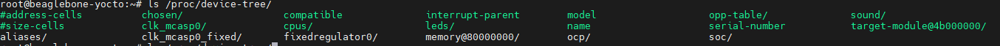

# Device tree

Trước khi có Device Tree, mỗi board cần một bộ mã nguồn riêng trong kernel để mô tả phần cứng: địa chỉ thanh ghi, số IRQ, chân GPIO, clock,...Hệ quả là mã nguồn kernel sẽ phình to lên với hàng trăm file chỉ khác nhau vài thông số phần cứng, và mỗi khi thay đổi một chân GPIO hay thêm một peripheral, lập trình viên phải rebuild toàn bộ kernel.
 
**Ví dụ:** Ta có driver điều khiển LED ở chân GPIO2. Nếu phần cứng đổi sang GPIO5, driver phải sửa source code rồi build lại kernel — dù logic điều khiển LED không hề thay đổi.

Vậy làm thế nào để khi ta thiết kế có thể trừu tượng hóa chân điều khiển led, tức là kernel sẽ chỉ có nhiệm vụ điều khiển led và chân led nào sẽ do một thằng khác đảm nhiệm. Lúc này, khi ta thay đổi chân GPIO từ GPIO2 sang GPIO5 thì vẫn chạy tốt mà không cần phải build lại kernel.

-> Người ta tạo ra device tree hoặc ACPI, tuy nhiên ACPI chỉ dùng cho các kiến trúc x86. Với hệ thống nhúng sử dụng linux, ta sử dụng device tree. Giúp tách mô tả phần cứng ra khỏi kernel thành một file dữ liệu riêng biệt.

## 1. Khái niệm cốt lõi

Device Tree là một cấu trúc dữ liệu dạng cây mô tả phần cứng của hệ thống — bao gồm CPU, bộ nhớ, bus, peripheral, interrupt, clock, GPIO… — bằng ngôn ngữ **khai báo** (declarative). Kernel không cần biết trước board nào đang chạy; nó đọc Device Tree rồi tự cấu hình.

### 1.1. Bản chất: tách "biết gì" ra khỏi "làm gì"

Để hiểu Device Tree, cần phân biệt hai mối quan tâm hoàn toàn khác nhau trong một hệ thống nhúng Linux:

**"Làm gì" (logic):** Cách giao tiếp với UART — ghi byte vào thanh ghi TX, đọc byte từ thanh ghi RX, xử lý interrupt khi có data… Phần này là driver, nằm trong kernel, viết bằng C, và giống nhau cho mọi board dùng cùng IP UART.

**"Biết gì" (dữ liệu):** UART nằm ở địa chỉ nào, dùng IRQ số mấy, clock bao nhiêu MHz, nối vào interrupt controller nào… Phần này khác nhau giữa các board, và chính xác là thứ Device Tree mô tả.

Khi hai phần này tách biệt, ta được một hệ quả quan trọng: **driver không biết và không cần biết mình đang chạy trên board nào**. Tất cả thông tin phần cứng được truyền vào driver tại runtime thông qua Device Tree. Driver chỉ cần hỏi: "địa chỉ thanh ghi của tôi ở đâu?", "interrupt của tôi là số mấy?" — và kernel trả lời dựa trên DTB.

Hệ quả thực tế:
- Cùng một `omap-serial.ko` chạy được trên cả BeagleBone Black, BeagleBone Blue, và bất kỳ board nào dùng SoC AM335x — chỉ cần DTB mô tả đúng.
- Khi thiết kế board mới, chỉ cần viết file `.dts` mới. Không sửa driver, không rebuild kernel.
- Khi driver có bug, sửa một lần, apply cho tất cả board dùng driver đó.

### 1.2. Device Tree không phải là gì

Để tránh hiểu nhầm, cần nắm rõ ranh giới:

- **Không phải ngôn ngữ lập trình:** DTS không có `if`, `for`, biến, hàm. Nó chỉ khai báo cấu trúc dữ liệu — tương tự JSON hay XML nhưng với cú pháp riêng.
- **Không phải driver:** Device Tree không chứa bất kỳ logic điều khiển nào. Nó không biết cách bật LED, gửi byte qua UART, hay đọc cảm biến. Nó chỉ nói: "có một LED ở GPIO pin 21, active-high".
- **Không phải configuration file:** Khác với `/etc/` trên Linux, DTS mô tả phần cứng vật lý (cái gì tồn tại trên board), không phải cách người dùng muốn cấu hình phần mềm.
- **Không phải runtime-modifiable (thông thường):** DTB được load một lần khi boot và kernel parse xong. Muốn thay đổi phải reboot với DTB khác (trừ khi dùng Device Tree Overlay).

### 1.3. File .dts vs .dtsi

DT được mô tả bằng các tệp nguồn có phần mở rộng `.dts` (Device Tree Source) và `.dtsi` (Device Tree Source Include).
- `.dts` là file top-level, được compile trực tiếp thành `.dtb`. Mỗi board có đúng một file `.dts`.
- `.dtsi` là file include, không compile độc lập mà được include bởi `.dts` hoặc `.dtsi` khác. Dùng để chia sẻ mô tả chung giữa nhiều board.

Các file này sẽ được biên dịch thành file `.dtb` (Device Tree Blob), đây là một file nhị phân mà bootloader sẽ nạp cùng với kernel.

Cú pháp include:

```dts
/dts-v1/;
#include "am33xx.dtsi"
#include "am335x-bone-common.dtsi"
```

`#include` hoạt động giống C preprocessor — nội dung file được include sẽ được chèn trực tiếp vào vị trí đó trước khi `dtc` compile.

### 1.4. Compile DTS thành DTB

Công cụ compile là `dtc` — Device Tree Compiler:

```bash
# Compile DTS → DTB
dtc -I dts -O dtb -o board.dtb board.dts

# Decompile DTB → DTS (dùng khi debug)
dtc -I dtb -O dts -o board.dts board.dtb
```

Trong kernel build system, DTB được build bằng:

```bash
make dtbs
```

File `.dtb` output nằm tại `arch/arm/boot/dts/`.

## 2. Kernel đọc DTB như thế nào?

### 2.1. Giai đoạn 1 — Bootloader truyền DTB cho kernel

Trước khi kernel chạy, bootloader (U-Boot) thực hiện:

1. Load file `board.dtb` từ storage (SD card, eMMC, NAND,...) vào một vùng RAM cố định.
2. (Tùy chọn) Apply các Device Tree Overlay (`.dtbo`) lên DTB gốc.
3. (Tùy chọn) Sửa một số property trong DTB — ví dụ U-Boot thường tự động cập nhật node `/chosen` với `bootargs`, hoặc ghi MAC address vào node ethernet.
4. Truyền địa chỉ DTB trong RAM cho kernel:
   - ARM 32-bit: đặt vào thanh ghi `r2`.
   - ARM 64-bit: đặt vào thanh ghi `x0`.
   - Lệnh boot ví dụ: `bootz ${loadaddr} - ${fdtaddr}` — dấu `-` nghĩa là không có initrd, `${fdtaddr}` là địa chỉ DTB.

### 2.2. Giai đoạn 2 — Early boot: validate và unflatten DTB

Ngay khi kernel bắt đầu chạy, trước khi bất kỳ driver nào được load:
1. **Validate header:** Kernel kiểm tra magic number `0xd00dfeed` ở đầu DTB để xác nhận đây là file FDT hợp lệ. Nếu sai $\rightarrow$ kernel panic.
2. **Scan `/chosen`:** Đọc `bootargs` để lấy kernel command line (console, root filesystem,...). Đây là lý do ta thấy kernel log ngay từ đầu — vì console được cấu hình từ DTB.
3. **Scan `/memory`:** Đọc vùng RAM khả dụng để thiết lập memory management.
4. **Unflatten:** Chuyển đổi DTB (flat binary — mảng byte liên tục) thành cấu trúc cây trong kernel memory — mỗi node trở thành `struct device_node`, mỗi property thành `struct property`. Sau bước này, kernel có một cây dữ liệu in-memory dễ duyệt.

```
DTB (flat binary)                    Kernel memory (unflattened tree)
┌──────────────┐                     struct device_node "/"
│ header       │                       ├── struct device_node "memory@80000000"
│ strings block│    unflatten_dt()     ├── struct device_node "chosen"
│ struct block │  ──────────────→      ├── struct device_node "soc"
│ (nodes+props)│                       │     ├── struct device_node "serial@44e09000"
│              │                       │     ├── struct device_node "i2c@4802a000"
└──────────────┘                       │     └── ...
                                       └── ...
```

Hàm chính: `unflatten_device_tree()` trong `drivers/of/fdt.c`.

### 2.3. Giai đoạn 3 — Platform identification

Kernel đọc `compatible` của root node `/` để xác định đang chạy trên machine nào:

```dts
/ {
    compatible = "ti,am335x-bone-black", "ti,am33xx";
};
```

Kernel duyệt danh sách `DT_MACHINE_START` đã đăng ký, tìm machine descriptor có `dt_compat` match với một trong các chuỗi trên. Match thành công $\rightarrow$ kernel biết cách khởi tạo cơ bản cho SoC này (clock tree, interrupt controller gốc,...).

### 2.4. Giai đoạn 4 — Tạo device từ Device Tree

Sau khi các subsystem cơ bản sẵn sàng (memory, interrupt, clock), kernel bắt đầu tạo device từ Device Tree. Tuy nhiên, không phải mọi node đều được tạo device cùng lúc — cách tạo phụ thuộc vào vị trí node trong cây:

**Các node gốc và node trên "simple-bus"** — được `of_platform_populate()` xử lý ngay trong quá trình boot:

```
of_platform_populate()
  │
  ├── / (root)
  │   ├── soc { compatible = "simple-bus"; }
  │   │     ├── serial@44e09000 → tạo platform_device "44e09000.serial"
  │   │     ├── i2c@4802a000    → tạo platform_device "4802a000.i2c"
  │   │     ├── spi@48030000    → tạo platform_device "48030000.spi"
  │   │     └── gpio@44e07000   → tạo platform_device "44e07000.gpio"
  │   │
  │   └── leds { compatible = "gpio-leds"; }
  │         → tạo platform_device "leds"
```

Với mỗi node con có property `compatible` sẽ tạo `struct platform_device` tương ứng chứa:
- Tên: `"<address>.<node-name>"` (ví dụ `"44e09000.serial"`).
- Resource IOMEM: parse từ property `reg`.
- Resource IRQ: parse từ property `interrupts`.
- Pointer đến `device_node` gốc trong cây DT — để driver đọc property khác sau này.

**Các node con trên bus I2C, SPI** — Không được tạo ở bước này. Chúng sẽ được tạo sau khi bus driver probe thành công:

```
(sau khi omap_i2c_probe() chạy xong cho node i2c@4802a000)
  │
  I2C adapter driver duyệt node con:
  ├── tmp102@48  → tạo i2c_client { addr=0x48, bus=i2c2 }
  ├── eeprom@50  → tạo i2c_client { addr=0x50, bus=i2c2 }
  └── ...
```

Đây là lý do khi I2C bus driver bị lỗi hoặc chưa load, tất cả thiết bị I2C con đều biến mất — vì chúng phụ thuộc vào bus driver để được tạo ra.

**Node có `status = "disabled"` hoặc `status = "fail"`** — bị bỏ qua hoàn toàn, không tạo device.

### 2.5. Giai đoạn 5 — Driver matching và probe

#### 2.5.1. Matching: Kernel tìm driver cho device

Khi device được đã được tạo, kernel tự động tìm driver phù hợp bằng cách so sánh từng chuỗi trong danh sách `compatible` của device (lấy từ DT node) với từng entry trong bảng `of_match_table` của driver:

```c
/* Driver khai báo bảng compatible */
static const struct of_device_id omap_serial_of_match[] = {
    { .compatible = "ti,am335x-uart", .data = &uart_am335x_data },
    { .compatible = "ti,omap3-uart",  .data = &uart_omap3_data  },
    { /* sentinel */ }
};
```

```dts
/* DT node có compatible */
serial@44e09000 {
    compatible = "ti,am335x-uart", "ti,omap3-uart";
};
```

:::warning Match ngay với entry khớp đầu tiên
Ở ví dụ trên: `"ti,am335x-uart"` match với entry đầu tiên trong bảng → kernel lấy luôn `.data = &uart_am335x_data` kèm theo (driver dùng data này để biết variant cụ thể).
:::

#### 2.5.2. Probe: driver khởi tạo thiết bị

Khi match thành công, kernel gọi hàm `probe()` của driver. Đây là nơi driver bắt đầu chạy và đọc thông tin từ DT, cấu hình phần cứng, đăng ký interface cho userspace.

```c
static int omap_serial_probe(struct platform_device *pdev)
{
    struct device_node *np = pdev->dev.of_node;   /* pointer đến DT node */
    struct resource *res;
    void __iomem *base;
    int irq;
    u32 clock_freq;
 
    /* 1. Đọc vùng thanh ghi từ property "reg" */
    res = platform_get_resource(pdev, IORESOURCE_MEM, 0);
    base = devm_ioremap_resource(&pdev->dev, res);
 
    /* 2. Đọc IRQ từ property "interrupts" */
    irq = platform_get_irq(pdev, 0);
 
    /* 3. Đọc property tùy chỉnh */
    of_property_read_u32(np, "clock-frequency", &clock_freq);
 
    /* 4. Lấy variant data từ of_match (nếu cần) */
    const struct of_device_id *match;
    match = of_match_device(omap_serial_of_match, &pdev->dev);
    struct uart_variant_data *variant = match->data;
 
    /* 5. Khởi tạo phần cứng, đăng ký interrupt, tạo /dev/ttyO0 ... */
    return 0;
}
```

**Probe có thể thất bại** vì nhiều lý do:
- `reg` hoặc `interrupts` không hợp lệ $\rightarrow$ `platform_get_resource()` trả `NULL`.
- Dependency chưa sẵn sàng (clock chưa enable, regulator chưa probe,...) $\rightarrow$ driver trả `-EPROBE_DEFER` $\rightarrow$ kernel sẽ thử lại sau khi dependency sẵn sàng.
- Lỗi phần cứng thực sự $\rightarrow$ driver trả error code $\rightarrow$ device không hoạt động.

#### 2.5.3. Xử lý dependency chưa sẵn sàng

Trong hệ thống phức tạp, thứ tự probe không đảm bảo. Ví dụ: UART cần clock, nhưng clock driver chưa probe xong. Khi đó:
 
```
1. omap_serial_probe() gọi devm_clk_get() → clock driver chưa sẵn sàng
2. devm_clk_get() trả -EPROBE_DEFER
3. omap_serial_probe() trả -EPROBE_DEFER cho kernel
4. Kernel đưa device vào "deferred probe list"
5. ... (clock driver probe thành công) ...
6. Kernel thử probe lại omap_serial → lần này devm_clk_get() thành công
7. UART hoạt động bình thường
```
 
Kiểm tra deferred probe:
 
```bash
cat /sys/kernel/debug/devices_deferred
# Output: platform 48022000.serial - 0 - -EPROBE_DEFER
```

#### 2.5.4. Ví dụ end-to-end: cảm biến I2C từ DTS đến userspace

**Device Tree:**

```dts
/* SoC dtsi — I2C controller */
i2c2: i2c@4819c000 {
    compatible = "ti,omap4-i2c";
    reg = <0x4819c000 0x1000>;
    interrupts = <30>;
    #address-cells = <1>;
    #size-cells = <0>;
    status = "disabled";
};
 
/* Board dts — bật I2C2 và thêm cảm biến */
&i2c2 {
    status = "okay";
    clock-frequency = <400000>;
 
    tmp102@48 {
        compatible = "ti,tmp102";
        reg = <0x48>;
    };
};
```

**Chuỗi sự kiện trong kernel:**

```
1. of_platform_populate()
   → gặp node i2c@4819c000, status = "okay"
   → tạo platform_device "4819c000.i2c"

2. Kernel match "4819c000.i2c" với omap_i2c_driver
   (vì compatible = "ti,omap4-i2c" khớp)
   → gọi omap_i2c_probe()

3. omap_i2c_probe():
   - ioremap reg 0x4819c000
   - request IRQ 30
   - đọc clock-frequency = 400000 → cấu hình I2C speed 400 kHz
   - đăng ký I2C adapter
   - duyệt DT node con → gặp tmp102@48
   → tạo i2c_client { adapter=i2c2, addr=0x48 }

4. Kernel match i2c_client với tmp102_driver
   (vì compatible = "ti,tmp102" khớp)
   → gọi tmp102_probe()

5. tmp102_probe():
   - đọc nhiệt độ thử qua I2C
   - đăng ký hwmon sensor
   → /sys/class/hwmon/hwmon0/temp1_input xuất hiện

6. Userspace đọc nhiệt độ:
   $ cat /sys/class/hwmon/hwmon0/temp1_input
   25500   (= 25.5°C)
```

## 3. Cú pháp device tree

### 3.1. Cấu trúc tổng thể một file DTS

Một file `.dts` có 3 phần chính:

```
/dts-v1/;

#include "soc.dtsi"          // (1) Phần include

/ {                          // (2) Root node
    model = "BeagleBone Black";
    compatible = "ti,am335x-bone-black", "ti,am33xx";

    memory@80000000 {        // (3) Node con
        device_type = "memory";
        reg = <0x80000000 0x10000000>;
    };
};
```

Giải thích:

| Thành phần    | Ý nghĩa   |
|---------------|-----------|
| `/dts-v1/;`   | Bắt buộc — khai báo phiên bản Device Tree Source |
| `#include`    | Dùng để kế thừa file .dtsi (thường chứa phần mô tả SoC chung). |
| `/ { ... }`   | Root node — mô tả toàn bộ hệ thống. |
| `memory@... { ... }` | Node con — mô tả một thiết bị (theo địa chỉ @addr). |

### 3.2. Cấu trúc node

Mỗi node đại diện cho một hardware component. Cú pháp:

```
node-name@unit-address {
    /* properties */
    /* child nodes */
};
```

| Thành phần                | Ý nghĩa |
|---------------------------|---------|
| `node-name`	            | Tên của thiết bị |
| `@unit-address`	        | Địa chỉ phần cứng |
| `property-name = value;`	| Khai báo thuộc tính cho node. |
| `subnode-name`	        | Node con (ví dụ một thiết bị nằm trên bus I2C, SPI,...). |

Ví dụ:

```
uart0: serial@44e09000 {
    compatible = "ti,omap3-uart";
    reg = <0x44e09000 0x2000>;
    interrupts = <72>;
    status = "okay";
};
```

### 3.3. Property và các kiểu dữ liệu

Property là cặp name-value mô tả đặc tính của node. DTS hỗ trợ các kiểu dữ liệu sau:

| Dạng          | Ví dụ	                        | Ý nghĩa |
|---------------|-------------------------------|---------|
| String	    | `status = "okay";`            | Giá trị dạng chuỗi |
| Integer (cell)| `reg = <0x40000000 0x1000>;`  | Số nguyên 32-bit trong dấu < > |
| List (array)  | `interrupts = <1 2 3>;`       | Danh sách nhiều giá trị |
| Phandle   	| `clocks = <&clk1>;`           | Tham chiếu tới node khác |
| Boolean	    | `bootph-all;`                 | Không có giá trị — chỉ cần tồn tại là “true” |

### 3.4. Thuộc tính status

Cho biết node có được kích hoạt hay không:

| Giá trị | Ý nghĩa |
|---|---|
| `"okay"` | Node hoạt động, kernel sẽ probe driver |
| `"disabled"` | Node bị vô hiệu hóa, kernel bỏ qua |
| `"reserved"` | Node đang được sử dụng bởi firmware khác (ví dụ: secure firmware) |
| `"fail"` | Node bị lỗi phần cứng, không nên sử dụng |
| `"fail-sss"` | Giống `"fail"` nhưng `sss` mô tả lý do lỗi cụ thể (hiếm dùng) |
| *(không có)* | Nếu node không có property `status`, kernel mặc định coi là `"okay"` |

Đây là thuộc tính quan trọng nhất và được dùng xuyên suốt trong kernel Device Tree. Trong file `.dtsi` (SoC level), tất cả peripheral được khai báo với `status = "disabled"`:

```dts
/* am33xx.dtsi — mô tả SoC AM335x, KHÔNG biết board cụ thể */
uart0: serial@44e09000 {
    compatible = "ti,am335x-uart";
    reg = <0x44e09000 0x2000>;
    interrupts = <72>;
    status = "disabled";      /* mặc định tắt — chưa biết board nào dùng */
};
 
uart1: serial@48022000 { ... status = "disabled"; };
uart2: serial@48024000 { ... status = "disabled"; };
i2c0:  i2c@44e0b000    { ... status = "disabled"; };
i2c1:  i2c@4802a000    { ... status = "disabled"; };
i2c2:  i2c@4819c000    { ... status = "disabled"; };
spi0:  spi@48030000    { ... status = "disabled"; };
/* ... hàng chục peripheral khác, tất cả disabled ... */
```

File `.dts` (board level) chỉ bật những peripheral thực sự có trên board đó:

```dts
/* am335x-boneblack.dts — board cụ thể */
&uart0 { status = "okay"; };   /* BBB dùng UART0 làm debug console */
&i2c0  { status = "okay"; };   /* BBB dùng I2C0 cho cape EEPROM */
&i2c2  { status = "okay"; };   /* BBB dùng I2C2 cho cape expansion */
/* uart1, uart2, spi0... vẫn disabled vì BBB không dùng */
```

**Tại sao phải làm vậy?**

- **An toàn:** Peripheral bị disabled sẽ không bị probe → không tiêu tốn tài nguyên, không gây conflict.
- **Rõ ràng:** Nhìn vào file `.dts` của board, ta biết ngay board đó dùng những peripheral nào.
- **Tiết kiệm thời gian boot:** Kernel không cần probe driver cho peripheral không dùng.

**Kernel xử lý status như thế nào?**

Trong giai đoạn device population (mục 2, giai đoạn 4), hàm `of_device_is_available()` kiểm tra property `status`. Nếu giá trị là `"disabled"`, `"fail"`, hoặc `"fail-*"`, node bị bỏ qua — kernel không tạo `platform_device` cho nó, và driver không bao giờ được gọi `probe()`.

```c
/* Trong kernel source — drivers/of/base.c */
bool of_device_is_available(const struct device_node *device)
{
    const char *status;
    if (!device)
        return false;
    status = of_get_property(device, "status", NULL);
    if (!status)
        return true;         /* không có status → coi là okay */
    if (!strcmp(status, "okay") || !strcmp(status, "ok"))
        return true;
    return false;
}
```

### 3.5. Thuộc tính reg

Thuộc tính `reg` mô tả:
- Địa chỉ bắt đầu (base address) của thiết bị trong không gian địa chỉ.
- Kích thước (size) vùng địa chỉ mà thiết bị chiếm dụng.

→ Kernel dựa vào đây để map vùng đó vào virtual address space và truy cập thanh ghi của thiết bị.

Để kernel hiểu cách đọc `reg`, nó cần biết:

| Thuộc tính cha    | Ý nghĩa                       |
|-------------------|-------------------------------|
| `#address-cells`	| Số ô 32-bit mô tả địa chỉ     |
| `#size-cells`	    | Số ô 32-bit mô tả kích thước  |

❓ Tại sao lại cần thêm thuộc tính `#address-cells` và `#size-cells`

Bởi vì trong SoC không chỉ có một không gian địa chỉ tuyến tính duy nhất mà nó có nhiều bus lồng nhau ví dụ như I2C, SPI, PCI, USB,...

-> Tức là một bus nó sẽ có một địa chỉ khác nhau, các node con trên một bus cần phải theo mô tả của node cha.

**Ví dụ 1 — Bus I2C:** Chỉ có địa chỉ 7-bit, không có vùng nhớ:
 
```dts
&i2c2 {
    #address-cells = <1>;
    #size-cells = <0>;       /* Vì I2C chỉ có địa chỉ, không có vùng nhớ */
 
    tmp102@48 {
        compatible = "ti,tmp102";
        reg = <0x48>;        /* chỉ 1 cell address, 0 cell size */
    };
};
```

Ở đây, ta có node `i2c2` đại diện cho bus `i2c2` và nó có node con là `tmp102`. Ở đây ta cần phải cho kernel biết `tmp102` thuộc địa chỉ nào trong bus `i2c2`. Tuy nhiên, địa chỉ I2C nó chỉ cần một ô address và nó không cần ô size -> Nên node cha cần thêm 2 thuộc tính `#address-cells = <1>` và `#size-cells = <0>` để mô tả điều này.

**Ví dụ 2 — Memory-mapped bus:** Cần cả address và size:
 
```dts
/ {
    #address-cells = <1>;
    #size-cells = <1>;
 
    serial@44e09000 {
        reg = <0x44e09000 0x2000>;  /* 1 cell address + 1 cell size */
    };
};
```
 
**Ví dụ 3 — 64-bit address:** Trên hệ thống 64-bit, mỗi thành phần cần 2 cell:
 
```dts
/ {
    #address-cells = <2>;
    #size-cells = <2>;
 
    memory@80000000 {
        reg = <0x0 0x80000000  0x0 0x40000000>;
        /*     addr_hi addr_lo  size_hi size_lo  → 2GB tại 0x80000000 */
    };
};
```

### 3.6. Mối liên hệ giữa reg và ranges

Nếu node con nằm trong bus, `reg` trong node con không phải địa chỉ vật lý tuyệt đối, mà là địa chỉ tương đối so với bus. Khi đó, bus node có thuộc tính ranges để ánh xạ lại sang địa chỉ vật lý.

```
soc {
    #address-cells = <1>;
    #size-cells = <1>;
    ranges = <0x0 0x48000000 0x01000000>; // base offset mapping

    uart0: serial@20000 {
        reg = <0x20000 0x1000>; // offset trong bus
    };
};
```

→ Kernel dùng `ranges` để quy đổi 0x20000 → 0x48020000 thực tế.

### 3.7. Thuộc tính label và phandle

`label` là tên tượng trưng đặt trước node, dùng để tham chiếu đến node. Nó không xuất hiện trong file nhị phân `.dtb`.

Ví dụ:

```dts
gpio1: gpio@4804c000 {
    compatible = "ti,omap4-gpio";
    gpio-controller;
    #gpio-cells = <2>;
};
 
leds {
    compatible = "mycompany,myled";
    gpios = <&gpio1 28 GPIO_ACTIVE_HIGH>;
    /*       ↑ phandle tham chiếu đến node gpio1 */
};
```
 
Khi compile, `dtc` tự động gán một số nguyên duy nhất (phandle) cho `gpio1`. Trong DTB, `&gpio1` được thay bằng số phandle đó. Kernel dùng phandle để tìm node tương ứng.

**node override hoặc node extension**

Dùng cú pháp `&label` để mở lại node đã được định nghĩa ở nơi khác, rồi bổ sung hoặc thay đổi nội dung bên trong node đó.

Ví dụ:

- Trong file SoC `.dtsi` — peripheral mặc định disabled

```dts
i2c2: i2c@4802a000 {
    compatible = "ti,omap4-i2c";
    reg = <0x4802a000 0x1000>;
    status = "disabled";
};
```
 
- Trong file board `.dts` — bật peripheral và thêm thiết bị con

```dts
&i2c2 {
    status = "okay";           /* override status */
 
    eeprom@50 {                /* thêm node con */
        compatible = "atmel,24c02";
        reg = <0x50>;
    };
};
```

### 3.8. Các node đặc biệt

#### 3.8.1. Node `/chosen`

Node `/chosen` không mô tả phần cứng — nó dùng để truyền tham số runtime từ firmware/bootloader cho kernel:

```dts
/ {
    chosen {
        bootargs = "console=ttyO0,115200n8 root=/dev/mmcblk0p2 rw";
        stdout-path = "serial0:115200n8";
    };
};
```

| Property | Ý nghĩa |
|---|---|
| `bootargs` | Tham số dòng lệnh kernel (có thể bị U-Boot ghi đè) |
| `stdout-path` | Console mặc định cho kernel log |
| `linux,initrd-start` / `linux,initrd-end` | Vị trí initrd trong RAM |

#### 3.8.2. Node `/aliases`

Node `/aliases` định nghĩa tên ngắn gọn cho các đường dẫn node dài, giúp kernel xác định thứ tự thiết bị:

```dts
/ {
    aliases {
        serial0 = &uart0;       /* /dev/ttyS0 */
        serial1 = &uart1;       /* /dev/ttyS1 */
        ethernet0 = &eth0;
        i2c0 = &i2c0;
        mmc0 = &mmc1;           /* có thể không theo thứ tự vật lý */
    };
};
```

Kernel dùng aliases để gán số thứ tự cho thiết bị. Ví dụ: `ethernet0` sẽ trở thành `eth0`, `serial0` sẽ là console UART đầu tiên.

#### 3.8.3. Node `/memory`

Bắt buộc phải có trong mọi Device Tree — mô tả bộ nhớ vật lý:

```dts
memory@80000000 {
    device_type = "memory";
    reg = <0x80000000 0x10000000>;  /* 256 MB tại 0x80000000 */
};
```

#### 3.8.4. Node `/reserved-memory`

Đánh dấu các vùng RAM mà kernel không được sử dụng tự do — dành cho firmware, DMA buffer, framebuffer,...:

```dts
reserved-memory {
    #address-cells = <1>;
    #size-cells = <1>;
    ranges;
 
    display_reserved: framebuffer@8e000000 {
        reg = <0x8e000000 0x800000>;   /* 8 MB cho framebuffer */
        no-map;                         /* kernel không được map vùng này */
    };
};

lcdc@4830e000 {
    memory-region = <&display_reserved>;  /* driver LCD tham chiếu vùng này */
};
```

## 4. Interrupt trong DTS

Trên MCU, developer thường hard-code số IRQ từ datasheet trực tiếp vào firmware. Driver biết trực tiếp mình dùng IRQ nào. Cách này ổn với MCU vì firmware và hardware gắn chặt với nhau.

Trên Linux, driver phải hoạt động được trên nhiều board khác nhau — cùng một UART controller nhưng có thể được nối vào interrupt controller khác nhau, với số IRQ khác nhau tùy board. Driver không thể tự biết — thông tin này phải đến từ DTS.

### 4.1. Interrupt controller trong DTS

Thiết bị nhận và xử lý interrupt được gọi là **interrupt controller**. Nó được khai báo trong DTS với hai property đặc trưng:

- `interrupt-controller;` — empty property, đánh dấu node này là interrupt controller
- `#interrupt-cells = <N>;` — khai báo số lượng cell cần dùng để mô tả một interrupt

Ví dụ từ `am33xx.dtsi`, INTC của AM335x:

```dts
intc: interrupt-controller@48200000 {
    compatible = "ti,am33xx-intc";
    interrupt-controller;
    #interrupt-cells = <1>;
    reg = <0x48200000 0x1000>;
};
```

`#interrupt-cells = <1>` nghĩa là mỗi interrupt chỉ cần 1 cell để mô tả — đó là số IRQ. Một số interrupt controller phức tạp hơn cần 2 hoặc 3 cell — ví dụ GIC của ARM dùng 3 cell (loại interrupt, số IRQ, trigger type).

### 4.2. Thiết bị sinh interrupt

Thiết bị muốn khai báo interrupt cần hai property:

- `interrupt-parent = <&label>` — trỏ đến interrupt controller mà thiết bị này kết nối vào
- `interrupts = <...>` — mô tả interrupt, số lượng cell phải khớp với `#interrupt-cells` của controller

Ví dụ UART1 trên BBB:

```dts
uart1: serial@48022000 {
    compatible = "ti,am335x-uart";
    reg = <0x48022000 0x1000>;
    interrupt-parent = <&intc>;
    interrupts = <73>;
};
```

Vì `intc` có `#interrupt-cells = <1>`, nên `interrupts` chỉ cần 1 giá trị — số IRQ 73.

### 4.3. Interrupt controller phân cấp

Thực tế hardware thường có nhiều tầng interrupt controller. Trên AM335x, GPIO controller vừa là **thiết bị sinh interrupt** (kết nối vào INTC), vừa là **interrupt controller** cho các GPIO pin bên dưới nó.

Từ `am33xx.dtsi`:

```dts
gpio0: gpio@44e07000 {
    compatible = "ti,omap4-gpio";
    reg = <0x44e07000 0x1000>;

    /* gpio0 là thiết bị, kết nối vào intc */
    interrupt-parent = <&intc>;
    interrupts = <96>;

    /* gpio0 đồng thời là interrupt controller cho các pin */
    interrupt-controller;
    #interrupt-cells = <2>;
};
```

Khi một button nối vào GPIO0_31 muốn dùng interrupt:

```dts
button {
    interrupt-parent = <&gpio0>;
    interrupts = <31 IRQ_TYPE_EDGE_FALLING>;
};
```

Ở đây `#interrupt-cells = <2>` — cell đầu là GPIO pin number, cell thứ hai là trigger type.

### 4.4. `interrupt-parent` mặc định

Việc khai báo `interrupt-parent` trên từng node riêng lẻ sẽ rất lặp lại nếu hầu hết thiết bị đều kết nối vào cùng một controller. DTS cho phép khai báo `interrupt-parent` ở node cha — các node con sẽ kế thừa nếu không tự khai báo:

```dts
/ {
    interrupt-parent = <&intc>;  /* mặc định cho toàn bộ cây */

    serial@48022000 {
        interrupts = <73>;  /* kế thừa interrupt-parent = &intc */
    };

    i2c@44e0b000 {
        interrupts = <70>;  /* kế thừa interrupt-parent = &intc */
    };
};
```

## 5. Device Tree Overlay

### 5.1. Vấn đề mà Overlay giải quyết
 
Với Device Tree thông thường, toàn bộ mô tả phần cứng được compile thành một file DTB duy nhất tại build time. Muốn thay đổi bất cứ điều gì — thêm một cảm biến, bật thêm một SPI peripheral, đổi cấu hình pin — phải sửa DTS và compile lại DTB.
 
Điều này gây khó khăn trong một số tình huống thực tế:
**Tình huống 1 — Board mở rộng:** BeagleBone có hàng chục cape khác nhau (LCD cape, motor cape, relay cape,...). Mỗi cape thêm thiết bị mới với cấu hình pin khác nhau. Nếu không có overlay, cần tạo một file DTB riêng cho mỗi tổ hợp cape — số lượng tổ hợp tăng theo cấp số nhân.
**Tình huống 2 — Prototyping nhanh:** Trong quá trình phát triển, developer muốn thử nghiệm thêm/bớt thiết bị mà không phải rebuild DTB mỗi lần.
**Tình huống 3 — Sản phẩm có nhiều biến thể:** Cùng một mainboard nhưng có nhiều cấu hình sản phẩm (có/không có màn hình, có/không có cảm biến,...). Mỗi biến thể chỉ cần thêm/bớt overlay thay vì duy trì nhiều DTB riêng biệt.

**Giải pháp:** Device Tree Overlay — một mảnh Device Tree nhỏ (fragment) có thể được apply lên DTB gốc tại thời điểm boot, thêm hoặc sửa đổi node mà không cần recompile DTB gốc.

### 5.2. Overlay hoạt động như thế nào

```
Build time:                              Boot time:
                                         (trong U-Boot)
┌──────────┐   dtc -@     ┌──────────┐
│ base.dts │ ──────────→  │ base.dtb │──┐
└──────────┘              └──────────┘  │    fdt apply
                                        ├──────────────→ DTB cuối cùng
┌──────────┐   dtc -@     ┌──────────┐  │                (truyền cho kernel)
│ cape.dtso│ ──────────→  │ cape.dtbo│──┘
└──────────┘              └──────────┘
```

Khi apply overlay, U-Boot thực hiện:
1. Load base DTB vào RAM.
2. Load overlay DTBO vào RAM (vùng khác).
3. Resolve các label trong overlay — tìm node tương ứng trong base DTB bằng bảng `__symbols__`.
4. Merge: thêm node mới, override property đã tồn tại.
5. Truyền DTB đã merge cho kernel — kernel không biết và không cần biết có overlay hay không.

Điểm quan trọng: kernel nhận DTB cuối cùng (đã merge) hoàn toàn giống như DTB thông thường. Overlay là cơ chế của bootloader, không phải kernel (trong trường hợp phổ biến nhất).

### 5.3. Cú pháp Overlay
 
File overlay có phần mở rộng `.dtso` (convention mới) hoặc `.dts` (cũ) và bắt buộc bắt đầu bằng `/dts-v1/;` và `/plugin/;`:

```dts
/dts-v1/;
/plugin/;              /* ← đánh dấu đây là overlay, không phải DTS thường */
```

**Cách 1 — Tham chiếu qua label (khuyến khích):**

Đây là cách phổ biến nhất. Overlay tham chiếu node trong base DT qua label (`&label`):

```dts
/dts-v1/;
/plugin/;
 
/* Thêm cảm biến BME280 vào bus I2C2 */
&i2c2 {
    #address-cells = <1>;
    #size-cells = <0>;
 
    bme280@76 {
        compatible = "bosch,bme280";
        reg = <0x76>;
    };
};
```

Yêu cầu: base DTB phải được compile với flag `-@` để giữ lại bảng symbol (`__symbols__`). Nếu không, overlay không thể resolve `&i2c2`.

**Cách 2 — Tham chiếu qua đường dẫn tuyệt đối:**

Dùng khi base DTB không có symbol, hoặc khi muốn chỉ định chính xác vị trí:
 
```dts
/dts-v1/;
/plugin/;
 
&{/ocp/i2c@4819c000} {
    bme280@76 {
        compatible = "bosch,bme280";
        reg = <0x76>;
    };
};
```

Cách này ít linh hoạt hơn vì path có thể khác nhau giữa các version DTB. Cách 1 (label) được khuyến khích.

### 5.4. Compile và apply overlay
 
**Bước 1 — Compile base DTB với flag `-@`:**
 
```bash
# Flag -@ giữ lại bảng __symbols__ trong DTB
# Nếu không có -@, overlay KHÔNG THỂ resolve label
dtc -@ -I dts -O dtb -o base.dtb base.dts
 
# Trong kernel build system:
# Thêm DTC_FLAGS += -@ vào Makefile, hoặc:
make DTC_FLAGS=-@ dtbs
```
 
Kiểm tra DTB có chứa symbols không:
 
```bash
fdtdump base.dtb | grep "__symbols__"
# Nếu thấy node __symbols__ → OK
# Nếu không thấy → compile lại với -@
```
 
**Bước 2 — Compile overlay:**
 
```bash
# Overlay cũng cần -@ nếu bạn muốn stack overlay lên overlay
dtc -@ -I dts -O dtb -o cape.dtbo cape.dtso
 
# Trong kernel build system, overlay có thể được build cùng:
make dtbs
# File .dtbo output nằm cùng thư mục với .dtb
```
 
**Bước 3 — Apply trong U-Boot:**
 
```bash
# Load base DTB
load mmc 0:1 ${fdtaddr} am335x-boneblack.dtb
 
# Đặt base DTB làm working fdt và resize để có chỗ merge overlay
fdt addr ${fdtaddr}
fdt resize 8192        # thêm 8KB cho overlay data
 
# Load và apply overlay
load mmc 0:1 ${fdtovaddr} BB-RELAY-CAPE.dtbo
fdt apply ${fdtovaddr}
 
# (Tùy chọn) Apply thêm overlay khác
load mmc 0:1 ${fdtovaddr} BB-I2C-SENSOR.dtbo
fdt apply ${fdtovaddr}
 
# Boot kernel với DTB đã merge
bootz ${loadaddr} - ${fdtaddr}
```

### 5.4. Tự động apply overlay trong U-Boot

Thay vì gõ lệnh thủ công mỗi lần boot, có thể cấu hình U-Boot tự động apply:

**Cách 1 — File `overlays.txt` (phổ biến trên Toradex, BeagleBone mới):**

```bash
# /boot/overlays.txt
fdt_overlays=BB-RELAY-CAPE.dtbo BB-I2C-SENSOR.dtbo
```

U-Boot script đọc file này và apply từng overlay tự động.

**Cách 2 — Cấu hình trong `uEnv.txt` (BeagleBone truyền thống):**

```bash
# /boot/uEnv.txt
dtb_overlay=/lib/firmware/BB-RELAY-CAPE-00A0.dtbo
```

**Cách 3 — Sửa U-Boot environment:**

```bash
# Trong U-Boot console
setenv fdtoverlays "relay-cape.dtbo sensor-cape.dtbo"
saveenv
```

### 5.5. Overlay tại runtime (Linux kernel)
 
Ngoài apply tại boot time (trong U-Boot), Linux kernel cũng hỗ trợ apply overlay sau khi đã boot:

```bash
# Yêu cầu kernel config: CONFIG_OF_OVERLAY=y
 
# Tạo thư mục overlay mới
mkdir /sys/kernel/config/device-tree/overlays/my-overlay
 
# Ghi DTBO vào
cat my-overlay.dtbo > /sys/kernel/config/device-tree/overlays/my-overlay/dtbo
 
# Overlay được apply ngay lập tức:
# - Node mới xuất hiện trong /proc/device-tree/
# - Kernel tạo device mới và probe driver tương ứng
# - Thiết bị hoạt động mà KHÔNG CẦN reboot
 
# Gỡ overlay:
rmdir /sys/kernel/config/device-tree/overlays/my-overlay
# - Device bị unregister, driver gọi remove()
```

:::warning Chú ý
Runtime overlay phức tạp hơn boot-time overlay vì kernel phải xử lý thêm/gỡ device dynamically. Không phải tất cả driver đều hỗ trợ tốt — một số driver có bug khi bị remove rồi probe lại. Trong production, boot-time overlay (U-Boot) ổn định hơn.
:::

## 6. Device tree bindings

### 6.1. Binding là gì?

Binding là tài liệu mô tả quy ước sử dụng property cho một loại thiết bị cụ thể. Nó quy định property nào bắt buộc, property nào tùy chọn, và giá trị hợp lệ của từng property.

Binding nằm trong kernel source tại:

```
Documentation/devicetree/bindings/
```

### 6.2. Cấu trúc một file binding
 
```
<Title> Device Tree Bindings
=================================

Required properties:
- compatible: Must be "vendor,device"
- reg: Address and size of the register set
- interrupts: The interrupt line used by the device

Optional properties:
- clocks: Reference to the clock controlling this device
- power-gpios: GPIO line to enable power

Example:
    uart0: serial@44e09000 {
        compatible = "ti,omap3-uart";
        reg = <0x44e09000 0x2000>;
        interrupts = <72>;
        clocks = <&uart_clk>;
        status = "okay";
    };
```

**Ý nghĩa của từng phần**

| Phần                  | Mô tả                                                         |
|-----------------------|---------------------------------------------------------------|
| Title                 | Tên thiết bị hoặc subsystem                                   |
| Required properties   | Liệt kê các property bắt buộc phải có trong node Device Tree  |
| Optional properties   | Các property bổ sung tùy theo phần cứng                       |
| Child nodes (nếu có)  | Nếu thiết bị là bus hoặc có node con                          |
| Example               | Mẫu cụ thể trong .dts để người dùng tham khảo                 |
 
### 6.3. Validate DTS với dt-schema

```bash
# Cài đặt
pip install dtschema

# Validate
dt-validate -s Documentation/devicetree/bindings/ board.dtb
```

Việc validate giúp phát hiện sớm lỗi thiếu property bắt buộc, sai kiểu dữ liệu, hoặc property không được định nghĩa trong binding.

## 7. Troubleshoot & Debug

### 7.1. Kiểm tra warning khi compile

Trước khi flash DTB lên board, nên compile với flag kiểm tra warning để phát hiện lỗi sớm:

```bash
dtc -W no-unit_address_vs_reg \
    -I dts -O dtb \
    -o board.dtb board.dts
```

Các warning phổ biến mà `dtc` phát hiện:
 
| Warning | Ý nghĩa |
|---|---|
| `unit_address_vs_reg` | Unit-address trong tên node không khớp với giá trị đầu trong `reg` |
| `node_name_chars` | Tên node chứa ký tự không hợp lệ |
| `property_name_chars` | Tên property chứa ký tự không hợp lệ |
| `interrupt_provider` | Node có `interrupt-controller` nhưng thiếu `#interrupt-cells` |

### 7.2. Decompile DTB để kiểm tra

Sau khi compile, cách nhanh nhất để kiểm tra DTB có đúng như mong muốn không là dịch ngược lại thành DTS:

```bash
dtc -I dtb -O dts -o result.dts board.dtb
```

File `result.dts` là kết quả sau khi `dtc` đã merge toàn bộ include, override, và node splitting — đây là thứ kernel thực sự nhìn thấy. Kiểm tra file này giúp phát hiện:
- Override không có tác dụng — property vẫn giữ giá trị cũ từ file cha
- Node splitting bị sai — property bị duplicate thay vì merge
- Include bị thiếu — node không xuất hiện trong output

### 7.3. Dump DTB tại runtime

```bash
# Nếu DTB nằm trên filesystem
ls /boot/dtbs/
 
# Dump từ firmware interface
dd if=/sys/firmware/fdt of=/tmp/running.dtb
 
# Decompile để đọc
dtc -I dtb -O dts -o /tmp/running.dts /tmp/running.dtb
```

### 7.4. Công cụ `fdtdump` và `fdtget`

`fdtdump` — dump toàn bộ nội dung DTB ra dạng text:

```bash
fdtdump board.dtb | grep -A 10 "vinalinux-leds"
```

`fdtget` — đọc một property cụ thể từ DTB:

```bash
# Đọc compatible string của node
fdtget board.dtb /ocp/serial@44e09000 compatible
# Output: ti,omap3-uart

# Đọc giá trị reg dạng unsigned
fdtget -t u board.dtb /ocp/serial@44e09000 reg
# Output: 1155989504 8192
```

### 7.5. Duyệt Device Tree tại runtime qua sysfs

Muốn xem device node trong lúc runtime, ta sử dụng một trong hai câu lệnh sau:

```bash
ls /proc/device-tree
# hoặc
ls /sys/firmware/devicetree/base
```

Khi nhấn enter, nó sẽ hiển thị cây thư mục tương ứng file dtb:



#### 7.5.1. Tìm một node

```bash
find /sys/firmware/devicetree/base -name "*node*"
```

Ví dụ có một node như sau:

```
&spi1 {
	pinctrl-names = "default";
	pinctrl-0 = <&spi1_pins>;
	status = "okay";

	ili9341@0 {
		compatible = "adafruit,yx240qv29", "ilitek,ili9341";
		reg = <0>;
		pinctrl-names = "default";
		pinctrl-0 = <&ili_display_pins>;
		spi-max-frequency = <24000000>;
		dc-gpios = <&gpio3 19 GPIO_ACTIVE_HIGH>;     // lcd dc    P9.27 gpio3[19]
		reset-gpios = <&gpio3 21 GPIO_ACTIVE_HIGH>;  // lcd reset P9.25 gpio3[21]
		rotation = <270>;
		status = "okay";
	};
};
```

Ta có thể tìm node `ili9341` trên userspace như sau:

```bash
find /sys/firmware/devicetree/base -name "*ili9341*"
```

Output mẫu:

```
/sys/firmware/devicetree/base/ocp/interconnect@48000000/segment@100000/target-module@a0000/spi@0/ili9341@0
```

#### 7.5.2. Đọc property

Đầu tiên, ta cần tìm node đấy nằm ở đâu trong `sys/firmware/devicetree/base`.

Khi đã có đường dẫn đến node thì ta có thể thấy các thuộc tính:
- `compatible` – chuỗi compatible đúng driver?
- `status` – “okay” hay “disabled”?
- `reg` – địa chỉ base, size
- `gpios`, `interrupts`, `clocks`, v.v.

Đọc các thuộc tính này bằng lệnh:
- `cat`: đối với các file text thuần.
- `hexdump -C`: đối với các file binary.

Ví dụ 1:

```bash
cat /sys/firmware/devicetree/base/ocp/interconnect@48000000/segment@100000/target-module@a0000/spi@0/ili9341@0/compatible
# Output: adafruit,yx240qv29ilitek,ili9341
```

Ví dụ 2:

```bash
hexdump -C /sys/firmware/devicetree/base/ocp/interconnect@48000000/segment@100000/target-module@a0000/spi@0/ili9341@0/spi-max-frequency
# Output:
# 00000000  01 6e 36 00                                       |.n6.|
# 00000004
# -> Tương ứng với clock là 24,000,000
```

:::warning Chú ý
`/sys/firmware/devicetree/base` phản ánh DTB gốc bootloader truyền vào được kernel expose ra userspace để ta có thể đọc được. Nó bao gồm cả các node `disabled`, cho nên thấy node trong `/sys/firmware/devicetree/base` không có nghĩa là driver đã chạy. Kernel chỉ thực sự chạy driver cho những node `okay`.
:::

### 7.6. Kiểm tra driver đã đăng ký chưa

Mọi driver sau khi đăng ký thành công đều xuất hiện ở đây, không phân biệt platform hay device drive:

```
/sys/bus/<bus_type>/drivers/<driver_name>/
```

Ví dụ:

```bash
ls /sys/bus/spi/drivers
```

Output:

```
ads7846  ili9341
```

:::warning Chú ý
Driver đăng ký thành công không có nghĩa là nó đã probe, đây là hai việc khác nhau.
:::

### 7.7. Kiểm tra driver đã probe chưa

```
Kiểm tra /sys/bus/platform/devices/<dev>/driver
            │
            ├── Có symlink ──────────────────→ PROBE THÀNH CÔNG ✓
            │
            └── Không có symlink
                        │
                        ├── dmesg có EPROBE_DEFER ──→ ĐANG CHỜ DEPENDENCY
                        │                             (clock, pinctrl, regulator...)
                        │
                        ├── dmesg có error khác ────→ PROBE THẤT BẠI thật sự
                        │                             (sai địa chỉ, thiếu clock...)
                        │
                        └── không có gì trong dmesg → DRIVER CHƯA ĐƯỢC BUILD
                                                      hoặc module chưa load
```

#### 7.7.1. dmesg

Kernel luôn log khi probe:

```bash
# I2C device
dmesg | grep "0-0024\|tps65217"
```

Probe thành công thường có log như sau:

```
[    3.706701] tps65217 0-0024: TPS65217 ID 0xe version 1.2
```

Probe thất bại:

```
[    3.706701] tps65217 0-0024: probe failed: -22
```

#### 7.7.2. Kiểm tra symlink driver trong sysfs

Đây là cách trực tiếp nhất:

```
ls -la /sys/bus/<bus_type>/devices/<device_name>/driver
```

Output khi probe thành công sẽ có xuất hiện symlink đến driver tương ứng.

**Ví dụ spi:**

Xem tất cả spi device

```bash
ls /sys/bus/spi/devices/
# Output: spi0.0  spi0.1  ...
# Format: spi<bus>.<chipselect>
```

Kiểm tra driver của device cụ thể

```bash
ls -la /sys/bus/spi/devices/spi1.0/driver
```

Output mẫu:

```
lrwxrwxrwx 1 root root 0 Mar 30 11:45 /sys/bus/spi/devices/spi1.0/driver -> ../../../../../../../../../../bus/spi/drivers/ili9341
```

:::warning Chú ý
Không thêm `/` vào `/sys/bus/spi/devices/spi1.0/driver` thành `/sys/bus/spi/devices/spi1.0/driver/` vì nó sẽ tự trỏ vào symlink và sẽ có output như sau:

```
total 0
drwxr-xr-x  2 root root    0 Dec 24  2023 .
drwxr-xr-x 11 root root    0 Dec 24  2023 ..
lrwxrwxrwx  1 root root    0 Mar 30 13:02 0-0024 -> ../../../../devices/platform/ocp/44c00000.interconnect/44c00000.interconnect:segment@200000/44e0b000.target-module/44e0b000.i2c/i2c-0/0-0024
--w-------  1 root root 4096 Mar 30 13:02 bind
--w-------  1 root root 4096 Dec 24  2023 uevent
--w-------  1 root root 4096 Mar 30 13:02 unbind
```
:::

**Ví dụ i2c:**

Xem tất cả i2c device

```bash
ls /sys/bus/i2c/devices/
# Output: 0-0068  1-0050  ...
# Format: <bus_number>-<address>
```

Kiểm tra driver của device cụ thể

```bash
ls -la /sys/bus/i2c/devices/0-0024/driver
```

Output mẫu:

```
lrwxrwxrwx 1 root root 0 Mar 30 13:01 /sys/bus/i2c/devices/0-0024/driver -> ../../../../../../../../../bus/i2c/drivers/tps65217
```

**Cách 1: Kiểm tra symlink driver trong device**

- Nếu có symlink $\rightarrow$ driver đã match và probe thành công
- Nếu KHÔNG có symlink driver $\rightarrow$ không có driver nào match

```bash
ls -l /sys/bus/platform/devices/44e09000.serial/driver
# Output: driver -> ../../../../bus/platform/drivers/omap_serial
```

**Cách 2: Xem chi tiết driver đang bind**

```bash
cat /sys/bus/platform/devices/44e09000.serial/driver/uevent
# Output: DRIVER=omap_serial
```

**Cách 3: Từ phía driver — xem driver đang quản lý những device nào**

```bash
ls /sys/bus/platform/drivers/omap_serial/
# Output:
# 44e09000.serial  48022000.serial  ...  bind  unbind  uevent
# Các entry "addr.name" là device đã match thành công
```