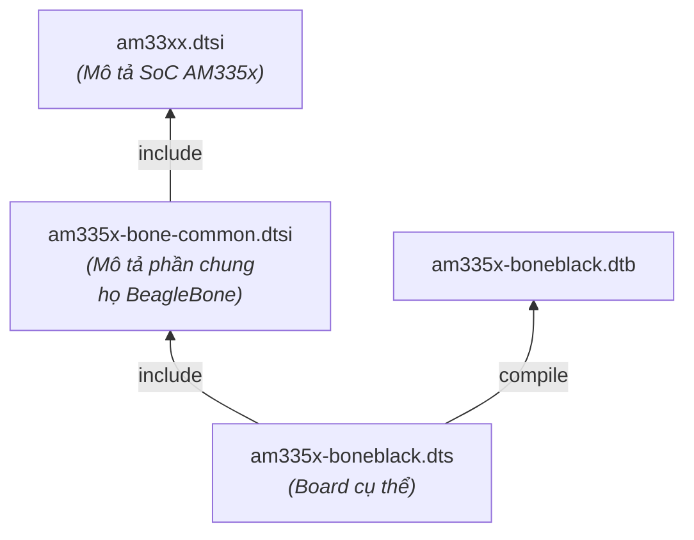
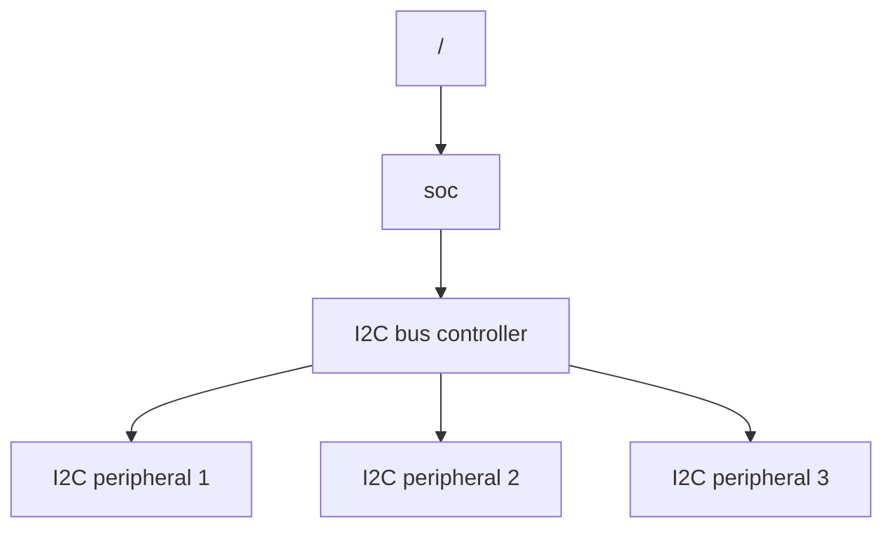
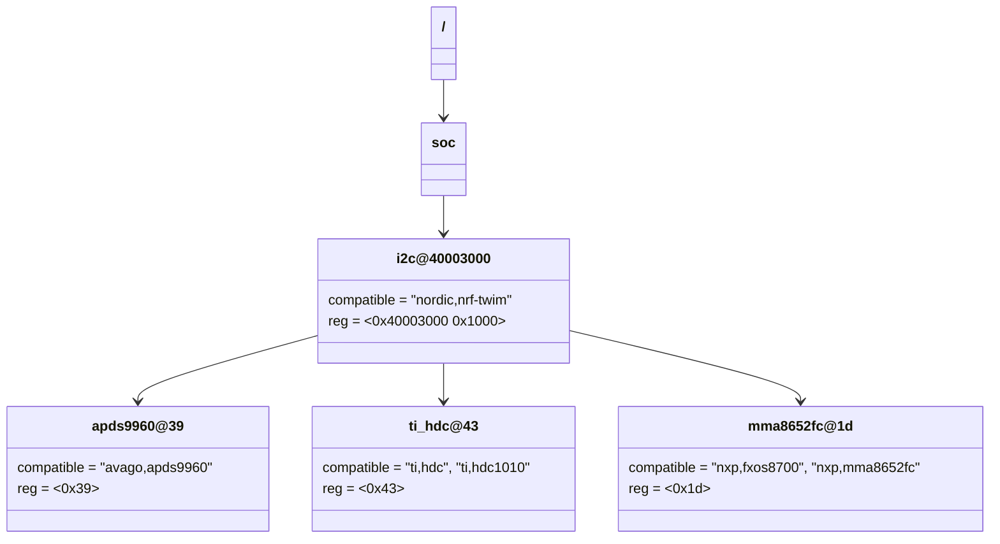

# Devicetree

## 1. Tại sao cần Device Tree?

Trong Linux nhúng, Device Tree được dùng để tách mô tả phần cứng ra khỏi driver. Trước khi có Devicetree, mỗi board cần một bộ mã nguồn riêng trong kernel để mô tả phần cứng: địa chỉ thanh ghi, số IRQ, chân GPIO, clock,... Hệ quả là mã nguồn kernel phình to với hàng trăm file chỉ khác nhau vài thông số phần cứng và mỗi khi thay đổi một chân GPIO hay thêm một peripheral, lập trình viên phải rebuild toàn bộ kernel.

**Ví dụ:** Ta có driver điều khiển LED ở chân GPIO2. Nếu phần cứng đổi sang GPIO5 thì driver buộc phải sửa source code và build lại kernel dù logic điều khiển LED không hề thay đổi.

Vậy làm thế nào để trừu tượng hóa chân điều khiển LED, tức là kernel chỉ có nhiệm vụ điều khiển LED, còn "chân nào" do một thành phần khác đảm nhiệm? Lúc đó khi đổi GPIO2 sang GPIO5 hệ thống vẫn chạy tốt mà không cần build lại kernel.

$\rightarrow$ Người ta tạo ra Device Tree hoặc ACPI. ACPI chủ yếu dùng cho x86 (và một phần ARM server); với hệ thống nhúng Linux ta dùng Device Tree — tách mô tả phần cứng ra khỏi kernel thành một file dữ liệu riêng biệt.

> **Lịch sử:** Device Tree không phải phát minh của Linux. Nó bắt nguồn từ Open Firmware (IEEE 1275) của Sun/Apple được PowerPC dùng từ lâu và được ARM Linux áp dụng rộng rãi từ khoảng kernel 3.x (2011) sau lời phê bình nổi tiếng của Linus Torvalds về "board file hell" trong `arch/arm/mach-*`.

## 2. Khái niệm

Devicetree là một cấu trúc dữ liệu dạng cây dùng để mô tả phần cứng: CPU, bộ nhớ, bus, peripheral, interrupt, clock, GPIO,...

### 2.1. Bản chất

Để hiểu Device Tree, cần phân biệt hai vấn đề:

**Về mặt logic:** Cách driver giao tiếp với phần cứng, ví dụ ghi/đọc thanh ghi UART, xử lý ngắt, điều khiển GPIO...Phần này được viết bằng code C và nằm trong kernel, giống nhau đối với mọi board sử dụng cùng SoC.
**Về mặt dữ liệu:** UART nằm ở địa chỉ nào, clock bao nhiêu, dùng IRQ số mấy... Phần này khác nhau giữa các board và đây chính là thứ Device Tree mô tả.

Khi hai phần này tách biệt, ta được một hệ quả quan trọng: **driver không biết và không cần biết mình đang chạy trên board nào**. Tất cả thông tin phần cứng được truyền vào driver tại runtime thông qua Device Tree. Driver chỉ cần hỏi: "địa chỉ thanh ghi của tôi ở đâu?", "interrupt của tôi là số mấy?",... và kernel trả lời dựa trên DTB.

Kết quả:

- Cùng một kernel module `omap-serial.ko` chạy được trên BeagleBone Black, BeagleBone Blue và bất kỳ board nào dùng SoC AM335x chỉ cần DTB mô tả đúng.
- Khi thiết kế board mới, chỉ cần viết file `.dts` mới. Không sửa driver, không rebuild kernel.
- Khi driver có bug, sửa một lần, apply cho tất cả board dùng driver đó.

### 2.2. Device Tree không phải là gì?

Để tránh hiểu nhầm, cần nắm rõ ranh giới:

- **Không phải ngôn ngữ lập trình:** DTS không có `if`, `for`, biến, hàm. Nó chỉ khai báo cấu trúc dữ liệu tương tự JSON hay XML nhưng với cú pháp riêng.
- **Không phải driver:** Device Tree không chứa bất kỳ logic điều khiển nào. Nó không biết cách bật LED, gửi byte qua UART hay đọc cảm biến. Nó chỉ nói: "có một LED ở GPIO pin 21, active-high".
- **Không phải configuration file:** Khác với `/etc/` trên Linux, DTS mô tả phần cứng vật lý (cái gì tồn tại trên board), không phải cách người dùng muốn cấu hình phần mềm. Nếu một thứ có thể thay đổi bằng phần mềm mà không đụng đến phần cứng, nó thường không thuộc về DTS.
- **Không phải runtime-modifiable:** DTB được load một lần khi boot. Muốn thay đổi phải reboot với DTB khác (trừ khi dùng Device Tree Overlay tại runtime).

### 2.3. File .dts vs .dtsi

DT được mô tả bằng các tệp nguồn có phần mở rộng `.dts` (Device Tree Source) và `.dtsi` (Device Tree Source Include).

- `.dts` là file top-level, được compile trực tiếp thành `.dtb`. Mỗi board sẽ có đúng một file `.dts`.
- `.dtsi` là file include dùng chung, không compile độc lập mà được include bởi `.dts` hoặc `.dtsi` khác. Dùng để chia sẻ mô tả dùng chung giữa nhiều board.

Các file này sẽ được biên dịch thành file `.dtb` (Device Tree Blob), đây là một file nhị phân mà bootloader sẽ nạp cùng với kernel.

Phân lớp điển hình trong kernel:


```mermaid
graph BT
    A["am33xx.dtsi<br/><i>(Mô tả SoC AM335x)</i>"]
    B["am335x-bone-common.dtsi<br/><i>(Mô tả phần chung<br>họ BeagleBone)</i>"]
    C["am335x-boneblack.dts<br/><i>(Board cụ thể)</i>"]
    D["am335x-boneblack.dtb"]

    C -- include --> B
    B -- include --> A
    C -- "compile" --> D
```

Công cụ compile là Device Tree Compiler (hay `dtc`):

```bash
# Compile DTS -> DTB
dtc -I dts -O dtb -o board.dtb board.dts

# Decompile DTB -> DTS (dùng khi debug)
dtc -I dtb -O dts -o board.dts board.dtb
```

:::warning `dtc` không chạy C preprocessor
Nếu file DTS có `#include` hoặc `#define`, phải chạy `cpp` trước:

```bash
cpp -nostdinc -I include -I arch/arm/boot/dts -undef -x assembler-with-cpp \
    board.dts board.dts.preprocessed
dtc -I dts -O dtb -o board.dtb board.dts.preprocessed
```

Kernel build system làm việc này tự động, nên trong thực tế ta chỉ cần `make dtbs`.
:::

Trong kernel build system:

```bash
make dtbs                          # build toàn bộ DTB của kiến trúc hiện tại
make am335x-boneblack.dtb          # build đúng một DTB
make dtbs_install                  # cài vào /boot/dtbs/$(KERNELRELEASE)/
```

File `.dtb` output nằm tại:

- Kernel < 6.5: `arch/arm/boot/dts/`
- Kernel ≥ 6.5: `arch/arm/boot/dts/<vendor>/` (ví dụ `arch/arm/boot/dts/ti/omap/`)
- ARM64: `arch/arm64/boot/dts/<vendor>/`

## 3. Cú pháp Device Tree

Định dạng văn bản dễ đọc đối với developer của cấu trúc cây này gọi là Devicetree Source (DTS), được định nghĩa trong [Devicetree Specification](https://www.devicetree.org/specifications).

### 3.1. Ví dụ một file DTS

```dts
/dts-v1/;               // (1) Khai báo version cú pháp DTS

#include "soc.dtsi"     // (2) Phần include

/ {                     // (3) Root node
    a-node {            // (4) Node con
        subnode_nodelabel: a-sub-node {   // (5) Node có label
            foo = <3>;                    // (6) Property
        };
    };
};
```

Dòng `/dts-v1/;` nghĩa là file dùng phiên bản 1 của cú pháp DTS, bắt buộc phải có ở đầu mọi file top-level.

`#include` hoạt động giống C preprocessor, tức là nội dung file include sẽ được chèn trực tiếp vào vị trí đó trước khi `dtc` compile.

Comment: DTS hỗ trợ cả `/* ... */` và `// ...`.

### 3.2. Node

Giống như bất kỳ cấu trúc dữ liệu dạng cây, Devicetree cũng có hệ thống phân cấp các *node*. Cây ở ví dụ trên có ba node:

1. Root node `/`
2. Node `a-node` - node con của root node
3. Node `a-sub-node` - node con của `a-node`

**Tên node** theo spec có dạng `node-name@unit-address`, trong đó:

- `node-name` dài tối đa 31 ký tự, chỉ chứa các ký từ `0-9 a-z A-Z , . _ + -`
- Tên node nên mô tả **loại thiết bị chung** (`serial`, `i2c`, `ethernet`, `flash`), không phải thiết bị cụ thể (`ns16550`, `at24c02`).
- Hai node anh em không được trùng tên đầy đủ (kể cả unit address).

**Đường dẫn:** Các node trong Devicetree có đường dẫn xác định vị trí của chúng trong cây giống như đường dẫn trong hệ thống file Unix. Đường dẫn Devicetree là các chuỗi được phân cách bằng dấu `/` và đường dẫn của root node là `/`. Ví dụ, đường dẫn đầy đủ đến `a-sub-node` là `/a-node/a-sub-node`.

**Label:** Các node có thể được gán *label*, là tên duy nhất dùng để tham chiếu từ nơi khác. Ở ví dụ trên thì node `a-sub-node` có label là `subnode_nodelabel`. Một node có thể có 0, 1 hoặc nhiều label. Label **không tồn tại trong DTB** trừ khi compile với `-@`.

Trên thực tế, node thường tương ứng với một phần cứng và node con phản ánh bố cục vật lý. Ví dụ board có ba thiết bị I2C nối vào I2C controller trên SoC:


```mermaid
graph TD
    root["/"] --> soc["soc"]
    soc --> i2c["I2C bus controller"]
    i2c --> p1["I2C peripheral 1"]
    i2c --> p2["I2C peripheral 2"]
    i2c --> p3["I2C peripheral 3"]
```

Định dạng DTS tương ứng:

```dts
/dts-v1/;

/ {
    soc {
        i2c-bus-controller {
            i2c-peripheral-1 {
            };
            i2c-peripheral-2 {
            };
            i2c-peripheral-3 {
            };
        };
    };
};
```

### 3.3. Property

Node có thể có thuộc tính (*property*) - là cặp name/value. Giá trị property có thể là bất kỳ chuỗi byte nào. Trong nhiều trường hợp, giá trị là một mảng các phần tử gọi là **cell** và mỗi cell là một số nguyên không dấu 32 bit, lưu theo thứ tự big endian trong DTB.

Ở ví dụ mục 3.1, node `a-sub-node` có property `foo` với giá trị là một cell bằng 3.

Property thường mô tả đặc tính phần cứng mà node đó đại diện. Ví dụ node của một thiết bị I2C có property `reg` chứa địa chỉ của nó trên bus I2C:


```mermaid
classDiagram
    root --> soc
    soc --> i2c
    i2c --> apds9960
    i2c --> ti_hdc
    i2c --> mma8652fc

    class root["/"]
    class soc["soc"]
    class i2c["i2c@40003000"] {
        compatible = "nordic,nrf-twim"
        reg = <0x40003000 0x1000>
    }
    class apds9960["apds9960@39"] {
        compatible = "avago,apds9960"
        reg = <0x39>
    }
    class ti_hdc["ti_hdc@43"] {
        compatible = "ti,hdc", "ti,hdc1010"
        reg = <0x43>
    }
    class mma8652fc["mma8652fc@1d"] {
        compatible = "nxp,fxos8700", "nxp,mma8652fc"
        reg = <0x1d>
    }
```

Định dạng DTS tương ứng:

```dts
/dts-v1/;

/ {
    soc {
        i2c@40003000 {
            compatible = "nordic,nrf-twim";
            reg = <0x40003000 0x1000>;
            #address-cells = <1>;
            #size-cells = <0>;

            apds9960@39 {
                compatible = "avago,apds9960";
                reg = <0x39>;
            };

            ti_hdc@43 {
                compatible = "ti,hdc", "ti,hdc1010";
                reg = <0x43>;
            };

            mma8652fc@1d {
                compatible = "nxp,fxos8700", "nxp,mma8652fc";
                reg = <0x1d>;
            };
        };
    };
};
```

**Các kiểu dữ liệu DTS:**

| Dạng | Ví dụ |
|---|---|
| boolean | `my-true-boolean;` |
| String | `status = "okay";` |
| String list | `compatible = "ti,hdc", "ti,hdc1010";` |
| Cell / u32 array | `reg = <0x40000000 0x1000>;` |
| Byte array | `mac-address = [00 11 22 33 44 55];` |
| Phandle | `clocks = <&clk1>;` |
| Phandle list | `some-phandles = <&n0 &n1 &n2>;` |
| Mixed | `example = <0x1>, [00 11], "str";` |

Ghi chú:

- Property kiểu boolean có giá trị `true` nếu nó xuất hiện trong DTS, `false` nếu không xuất hiện. Không viết `my-bool = <0>;` để tắt, như vậy vẫn được tính là `true`. Muốn tắt phải xóa hẳn property.
- Số nguyên 64 bit được viết thành hai cell 32 bit theo thứ tự big-endian: `0xaaaa0000bbbb1111` viết là `<0xaaaa0000 0xbbbb1111>`.
- Có thể chỉ định độ rộng cell: `/bits/ 8 <1 2 3>` (8-bit), `/bits/ 64 <0x100000000>` (64-bit).
- Trong `<...>` có thể dùng biểu thức số học: `<(1 << 4)>`, `<(48000000 / 2)>`. Biểu thức số học pahỉ được bọc trong ngoặc đơn.

### 3.4. Unit address

Unit address là phần của tên node sau dấu `@`, ví dụ `40003000` trong `i2c@40003000` hoặc `39` trong `apds9960@39`. Unit address là tùy chọn: node `soc` ở ví dụ trên không có.

Quy tắc: node có `reg` thì bắt buộc có unit address và unit address phải bằng giá trị địa chỉ đầu tiên trong `reg` (viết hex, không có tiền tố `0x`, không có số 0 thừa ở đầu). Node không có `reg` thì không được có unit address. `dtc` sẽ cảnh báo `unit_address_vs_reg` nếu vi phạm.

Unit address cho biết địa chỉ của node trong không gian địa chỉ của node cha. Một số ví dụ:

| Loại phần cứng | Ý nghĩa unit address | Ví dụ |
|---|---|---|
| Memory-mapped peripheral | Địa chỉ base trong register map | `i2c@40003000` $\rightarrow$ base `0x40003000` |
| Thiết bị I2C | Địa chỉ 7-bit trên bus I2C | `apds9960@39` $\rightarrow$ addr `0x39` |
| Thiết bị SPI | Số thứ tự chip-select (CS) | `ili9341@0` $\rightarrow$ CS0 |
| Memory | Địa chỉ vật lý bắt đầu của RAM | `memory@80000000` |
| Flash mapped | Địa chỉ vật lý bắt đầu của flash | `flash@8000000` |
| Phân vùng flash | Offset của phân vùng trong flash | `partition@20000` |
| CPU | Số hiệu CPU (MPIDR) | `cpu@0`, `cpu@1` |

Ví dụ bảng phân vùng flash:

```dts
flash@8000000 {
    /* ... */
    partitions {
        partition@0      { /* ... */ };
        partition@20000  { /* ... */ };
    };
};
```

Node `partition@0` có offset 0 so với đầu flash $\rightarrow$ địa chỉ vật lý `0x8000000`. Node `partition@20000` $\rightarrow$ địa chỉ vật lý `0x8020000`.

### 3.5. Label, phandle và node override

`label` là tên tượng trưng đặt trước node, dùng để tham chiếu đến node đó từ nơi khác:

```dts
gpio1: gpio@4804c000 {
    compatible = "ti,omap4-gpio";
    gpio-controller;
    #gpio-cells = <2>;
};

leds {
    compatible = "gpio-leds";
    led-0 {
        gpios = <&gpio1 28 GPIO_ACTIVE_HIGH>;
        /*       ↑ phandle tham chiếu đến node gpio1 */
    };
};
```

Khi compile, `dtc` tự động gán một số nguyên duy nhất được gọi là *phandle* cho `gpio1` và thêm property `phandle = <N>;` vào node đó. Trong DTB, `&gpio1` được thay bằng số N. Kernel dùng số này để tìm ngược lại node tương ứng.

Hai cách tham chiếu:

```dts
clocks = <&uart_clk>;            /* qua label — phổ biến nhất */
clocks = <&{/soc/clock@1000}>;   /* qua đường dẫn tuyệt đối */
```

**Node override / node extension**

Dùng cú pháp `&label { ... };` ở top-level để mở lại node đã định nghĩa ở nơi khác, rồi bổ sung hoặc ghi đè nội dung. Đây là cơ chế cốt lõi của mô hình `.dtsi` + `.dts`.

Trong file SoC `.dtsi` - peripheral mặc định disabled:

```dts
i2c2: i2c@4802a000 {
    compatible = "ti,omap4-i2c";
    reg = <0x4802a000 0x1000>;
    #address-cells = <1>;
    #size-cells = <0>;
    status = "disabled";
};
```

Trong file board `.dts` - bật peripheral và thêm thiết bị con:

```dts
&i2c2 {
    status = "okay";            /* override property đã có */
    clock-frequency = <400000>; /* thêm property mới */

    eeprom@50 {                 /* thêm node con */
        compatible = "atmel,24c02";
        reg = <0x50>;
    };
};
```

## 4. Các property cần biết

### 4.1. `compatible`

`compatible` là property quan trọng nhất trong Device Tree. Nó là chìa khoá giúp kernel có thể ghép cặp node với driver.

Giá trị của property `compatible` là một danh sách chuỗi, xếp theo thứ tự từ **cụ thể nhất $\rightarrow$ tổng quát nhất**:

```dts
serial@44e09000 {
    compatible = "ti,am335x-uart", "ti,omap3-uart";
    /*               cụ thể           tổng quát   */
};
```

Định dạng mỗi chuỗi: `"<vendor>,<model>"`, trong đó `<vendor>` là mã vendor viết thường theo danh sách chính thức tại `Documentation/devicetree/bindings/vendor-prefixes.yaml` (`ti`, `nxp`, `st`, `rohm`, `bosch`, `atmel`, `microchip`,...).

**Driver dùng compatible như thế nào?**

Driver khai báo bảng các chuỗi compatible mà nó hỗ trợ:

```c
static const struct of_device_id omap_serial_of_match[] = {
    { .compatible = "ti,am335x-uart", .data = &uart_am335x_data },
    { .compatible = "ti,omap3-uart",  .data = &uart_omap3_data  },
    { /* sentinel — bắt buộc, đánh dấu kết thúc bảng */ }
};
MODULE_DEVICE_TABLE(of, omap_serial_of_match);
```

Kernel sẽ duyệt từng chuỗi trong `compatible` của node theo thứ tự, với mỗi chuỗi thì duyệt bảng `of_match_table` của driver. Match đầu tiên tìm được sẽ được trigger và driver lấy được `.data` tương ứng để biết mình đang chạy trên variant nào.

Ý nghĩa của việc xếp từ cụ thể $\rightarrow$ tổng quát: nếu kernel có driver chuyên biệt cho AM335x thì dùng driver đó; nếu không thì vẫn còn driver `"ti,omap3-uart"` tổng quát hơn nhận. Đây là cơ chế tương thích ngược: DTS viết hôm nay vẫn chạy được với kernel cũ và kernel mới vẫn boot được DTB cũ.

**Một số compatible đặc biệt:**

| Chuỗi | Ý nghĩa |
|---|---|
| `"simple-bus"` | Node là bus memory-mapped đơn giản; kernel tự động tạo `platform_device` cho mọi node con |
| `"simple-mfd"` | Giống `simple-bus`, dùng cho multi-function device (thường kèm `syscon`) |
| `"syscon"` | Vùng thanh ghi hệ thống dùng chung, truy cập qua regmap |
| `"gpio-leds"` | Driver LED generic điều khiển qua GPIO |
| `"gpio-keys"` | Driver input generic cho nút bấm nối GPIO |
| `"fixed-regulator"` | Nguồn cố định (không điều chỉnh được) |
| `"fixed-clock"` | Clock có tần số cố định |

`compatible` cũng xuất hiện ở root node dùng để định danh board:

```dts
/ {
    model = "TI AM335x BeagleBone Black";
    compatible = "ti,am335x-bone-black", "ti,am335x-bone", "ti,am33xx";
};
```

### 4.2. `#address-cells` và `#size-cells`

Hai property này đặt trên node cha, quy định cách đọc property `reg` của các node con:

| Property | Ý nghĩa |
|---|---|
| `#address-cells` | Số cell 32-bit dùng để mô tả một địa chỉ |
| `#size-cells` | Số cell 32-bit dùng để mô tả một kích thước |

> **Tại sao cần?**
>
> Trong SoC không chỉ có một không gian địa chỉ tuyến tính duy nhất — có nhiều bus lồng nhau: memory-mapped bus, I2C, SPI, PCI, USB,... Mỗi loại bus đánh địa chỉ theo cách khác nhau. I2C chỉ cần 1 số (địa chỉ 7-bit) và không có khái niệm "kích thước". Memory-mapped bus 64-bit cần 2 cell cho địa chỉ và 2 cell cho kích thước. Node con không tự quyết định — nó phải theo mô tả của node cha.

Các tổ hợp thường gặp:

| `#address-cells` | `#size-cells` | Dùng cho |
|---|---|---|
| `1` | `1` | Memory-mapped bus 32-bit |
| `2` | `2` | Memory-mapped bus 64-bit (ARM64) |
| `1` | `0` | Bus I2C, SPI, MDIO (chỉ có địa chỉ, không có vùng nhớ) |
| `0` | `0` | Node không có con mang địa chỉ |

:::warning Giá trị áp dụng cho con, không phải cho chính node đó
`#address-cells` của node quy định cách đọc `reg` của các node con trực tiếp, chứ không phải `reg` của node đó. Đây là lỗi hiểu nhầm phổ biến nhất khi viết DTS.
:::

### 4.3. `reg`

Thuộc tính `reg` mô tả vị trí của thiết bị trong không gian địa chỉ của node cha:

- Địa chỉ base của thiết bị
- Kích thước vùng địa chỉ thiết bị chiếm dụng (nếu bus có khái niệm này)

$\rightarrow$ Kernel dựa vào đây để map vùng đó vào virtual address space và truy cập thanh ghi của thiết bị.

`reg` là một dãy các cặp `(address, length)`. Mỗi cặp gọi là một **register block**. Số cell của mỗi phần lấy từ `#address-cells` / `#size-cells` của node cha.

**Ví dụ 1: Bus I2C**

```dts
&i2c2 {
    #address-cells = <1>;
    #size-cells = <0>;       /* I2C chỉ có địa chỉ, không có vùng nhớ */

    tmp102@48 {
        compatible = "ti,tmp102";
        reg = <0x48>;        /* 1 cell address, 0 cell size */
    };
};
```

Ở đây, ta có node `i2c2` đại diện cho bus `i2c2` và nó có node con là `tmp102`. Ở đây ta cần phải cho kernel biết `tmp102` thuộc địa chỉ nào trong bus `i2c2`. Tuy nhiên, địa chỉ I2C nó chỉ cần một ô address và nó không cần ô size -> Nên node cha cần thêm 2 thuộc tính `#address-cells = <1>` và `#size-cells = <0>` để mô tả điều này.

**Ví dụ 2: Memory-mapped bus 32 bit**

```dts
/ {
    #address-cells = <1>;
    #size-cells = <1>;

    serial@44e09000 {
        reg = <0x44e09000 0x2000>;  /* 1 cell address + 1 cell size */
    };
};
```

**Ví dụ 3: Địa chỉ 64 bit**

```dts
/ {
    #address-cells = <2>;
    #size-cells = <2>;

    memory@80000000 {
        device_type = "memory";
        reg = <0x0 0x80000000  0x0 0x40000000>;
    };
};
```

**Ví dụ 4: Nhiều register block**

```dts
/ {
    #address-cells = <1>;
    #size-cells = <1>;

    ethernet@4a100000 {
        reg = <0x4a100000 0x800>,     /* block 0: CPSW registers */
              <0x4a101200 0x100>;     /* block 1: CPSW sliver    */
        reg-names = "cpsw", "sliver"; /* đặt tên để driver lấy theo tên */
    };
};
```

### 4.4. `ranges`

Nếu node con nằm trong một bus, `reg` của nó là địa chỉ trong không gian địa chỉ của bus, không phải địa chỉ vật lý CPU. Khi đó, bus node có thuộc tính `ranges` để ánh xạ lại sang địa chỉ vật lý.

Định dạng mỗi entry: `<child-address  parent-address  length>`, với số cell lần lượt lấy từ `#address-cells` của node bus, `#address-cells` của node cha bus và `#size-cells` của node bus.

```dts
/ {
    #address-cells = <1>;
    #size-cells = <1>;

    soc {
        #address-cells = <1>;
        #size-cells = <1>;
        ranges = <0x0 0x48000000 0x01000000>;
        /*       child parent      length
         * Địa chỉ 0x0..0x1000000 trong bus tương ứng với 0x48000000..0x49000000 của CPU */

        uart0: serial@20000 {
            reg = <0x20000 0x1000>;   /* offset trong bus */
        };
    };
};
```

$\rightarrow$ Kernel dùng `ranges` để quy đổi `0x20000` $\rightarrow$ địa chỉ vật lý `0x48020000`.

**`ranges;` rỗng (không có giá trị)** nghĩa là ánh xạ 1:1 — địa chỉ con bằng đúng địa chỉ cha. Đây là trường hợp phổ biến nhất trong DTS thực tế:

```dts
soc {
    compatible = "simple-bus";
    #address-cells = <1>;
    #size-cells = <1>;
    ranges;              /* identity mapping */
};
```

**Không có `ranges`** nghĩa là bus không ánh xạ được sang không gian địa chỉ cha - CPU không thể truy cập trực tiếp thanh ghi của node con (đúng với I2C, SPI).

Ngoài ra còn `dma-ranges` - cùng định dạng, nhưng mô tả ánh xạ địa chỉ nhìn từ phía **DMA master** thay vì từ CPU.

### 4.5. `status`

Một chuỗi ký tự cho biết node có được kích hoạt hay không.

| Giá trị | Ý nghĩa |
|---|---|
| `"okay"` | Node hoạt động, kernel sẽ tạo device và probe driver |
| `"disabled"` | Node bị vô hiệu hóa, kernel bỏ qua |
| `"reserved"` | Node đang được firmware khác sử dụng (ví dụ secure firmware / co-processor) |
| `"fail"` | Node bị lỗi phần cứng, không nên sử dụng |
| `"fail-sss"` | Giống `"fail"`, `sss` mô tả lý do cụ thể (hiếm dùng) |
| *(không có)* | Mặc định coi như `"okay"` |

Đây là property được dùng xuyên suốt trong mô hình `.dtsi` + `.dts`. Trong file `.dtsi` (SoC level), tất cả peripheral được khai báo với `status = "disabled"`:

```dts
/* am33xx.dtsi: mô tả SoC AM335x, không biết board cụ thể */
uart0: serial@44e09000 {
    compatible = "ti,am335x-uart";
    reg = <0x44e09000 0x2000>;
    interrupts = <72>;
    status = "disabled";
};

uart1: serial@48022000 { ... status = "disabled"; };
uart2: serial@48024000 { ... status = "disabled"; };
i2c0:  i2c@44e0b000    { ... status = "disabled"; };
i2c1:  i2c@4802a000    { ... status = "disabled"; };
spi0:  spi@48030000    { ... status = "disabled"; };
/* ... hàng chục peripheral khác, tất cả disabled ... */
```

File `.dts` (board level) chỉ bật những peripheral thực sự có trên board:

```dts
/* am335x-boneblack.dts: board cụ thể */
&uart0 { status = "okay"; };   /* BBB dùng UART0 làm debug console */
/* uart1, uart2, spi0... vẫn disabled vì BBB không nối ra ngoài */
```

**Tại sao phải làm vậy?**

- **An toàn:** Peripheral bị disabled sẽ không bị probe $\rightarrow$ không chiếm tài nguyên, không gây conflict pin.
- **Rõ ràng:** Nhìn file `.dts` của board là biết ngay board dùng peripheral nào.
- **Tiết kiệm thời gian boot:** Kernel không probe driver cho peripheral không dùng.

**Kernel xử lý `status` như thế nào?**

Trong giai đoạn device population, hàm `of_device_is_available()` kiểm tra property `status`. Nếu là `"disabled"`, `"fail"` hoặc `"fail-*"` thì node bị bỏ qua, kernel không tạo device và driver không bao giờ được gọi `probe()`.

```c
/* drivers/of/base.c */
static bool __of_device_is_available(const struct device_node *device)
{
    const char *status;
    int statlen;

    if (!device)
        return false;

    status = __of_get_property(device, "status", &statlen);
    if (status == NULL)
        return true;             /* không có status -> coi là okay */

    if (statlen > 0) {
        if (!strcmp(status, "okay") || !strcmp(status, "ok"))
            return true;
    }
    return false;
}
```

### 4.6. Các property phổ biến khác

| Property | Kiểu | Ý nghĩa |
|---|---|---|
| `model` | string | Tên đầy đủ của board/thiết bị, ví dụ `"TI AM335x BeagleBone Black"` |
| `device_type` | string | Di sản từ Open Firmware; hiện chỉ còn dùng hợp lệ cho `"memory"` và `"cpu"` |
| `reg-names` | string list | Đặt tên cho từng block trong `reg` |
| `interrupt-names` | string list | Đặt tên cho từng interrupt trong `interrupts` |
| `clock-names` | string list | Đặt tên cho từng clock trong `clocks` |
| `dma-names` | string list | Đặt tên cho từng DMA channel trong `dmas` |
| `label` | string | Nhãn hiển thị cho userspace (LED, partition,...) — khác hoàn toàn với *node label* trong DTS |
| `phandle` | u32 | Do `dtc` tự sinh, không viết tay |

:::warning Đừng nhầm hai chữ "label"
- **Node label** (`gpio1: gpio@... {`) là cú pháp DTS, không tồn tại trong DTB, dùng để tham chiếu khi viết source.
- **Property `label`** (`label = "user-led-0";`) là dữ liệu thật trong DTB, được driver đọc và thường hiển thị ra sysfs.
:::

## 5. Các node đặc biệt

### 5.1. Node `/chosen`

Node `/chosen` là node con trực tiếp của root, không mô tả phần cứng. Nó là kênh truyền tham số runtime từ firmware/bootloader sang kernel, đây là những thứ không cố định theo board mà thay đổi theo từng lần boot (command line, vị trí initrd, seed ngẫu nhiên,...).

Vì không mô tả phần cứng nên node này không có `reg`, không có `compatible` và không sinh ra device nào cả.

```dts
/ {
    chosen {
        bootargs = "console=ttyS0,115200n8 root=/dev/mmcblk0p2 rw rootwait";
        stdout-path = "serial0:115200n8";
    };
};
```

#### 5.1.1. Ai ghi vào `/chosen`?

1. **DTS viết sẵn:** giá trị tĩnh, compile vào DTB.
2. **Bootloader ghi đè lúc boot:** Uboot gọi `fdt_chosen()` trong `image-fdt.c` để tạo node `/chosen` nếu chưa có và ghi hoặc ghi đè `bootargs`, `linux,initrd-start`, `linux,initrd-end`, `kaslr-seed`,... trước khi nhảy vào kernel.

Nghĩa là dòng `bootargs` viết trong DTS thường bị uboot thay bằng giá trị của biến môi trường `bootargs`. Vì lý do này mà rất nhiều DTS mainline chỉ để node rỗng:

```dts
chosen {
    /* để trống — bootloader sẽ điền */
};
```

Muốn giữ command line trong DTS thì phải xóa biến `bootargs` trong uboot:

```bash
=> setenv bootargs
=> saveenv
```

hoặc dùng `CONFIG_CMDLINE_FORCE=y` phía kernel.

#### 5.1.2. `bootargs` và thứ tự ưu tiên command line

Kernel đọc `bootargs` rất sớm, trong `early_init_dt_scan_chosen()` (`drivers/of/fdt.c`), trước cả khi memory subsystem sẵn sàng. Giá trị được copy vào `boot_command_line[]` và sau đó trở thành nội dung của `/proc/cmdline`.

Cách kernel kết hợp `bootargs` với `CONFIG_CMDLINE` phụ thuộc vào kernel config:

| Kernel config | Kết quả |
|---|---|
| `CONFIG_CMDLINE` | Dùng `bootargs` từ DT, chỉ dùng `CONFIG_CMDLINE` khi DT không có `bootargs` |
| `CONFIG_CMDLINE_EXTEND=y` | `CONFIG_CMDLINE` được nối thêm vào sau `bootargs` |
| `CONFIG_CMDLINE_FORCE=y` | Luôn dùng `CONFIG_CMDLINE`, bỏ qua hoàn toàn `bootargs` từ DT |

:::tip Debug command line
```bash
cat /proc/cmdline                       # command line kernel thực sự dùng
cat /proc/device-tree/chosen/bootargs   # giá trị nằm trong DTB
```
Hai giá trị này khác nhau khi `CONFIG_CMDLINE_FORCE`/`EXTEND` được bật hoặc khi kernel tự thêm/sửa tham số.
:::

#### 5.1.3. `stdout-path`

`stdout-path` cho biết thiết bị nào là console mặc định. Cú pháp:

```dts
stdout-path = "serial0:115200n8";       /* qua alias + tham số UART */
stdout-path = "/soc/serial@44e09000";   /* qua đường dẫn tuyệt đối */
stdout-path = &uart0;                   /* dtc tự chuyển thành chuỗi path */
```

Phần sau dấu `:` là tham số cấu hình theo định dạng quen thuộc của `console=`: `<baud><parity><bits><flow>`, ví dụ `115200n8`.

Kernel xử lý ở hai chỗ:

- `of_alias_scan()` phân giải chuỗi này thành con trỏ node và lưu vào biến toàn cục `of_stdout`.
- Nếu command line không có tham số `console=` thì kernel sẽ dùng chính thiết bị `stdout-path` làm console. Nếu có tham số `console=` thì sử dụng thiết bị trên command line.
- Tham số `earlycon` (không kèm giá trị) trên command line sẽ khiến `of_setup_earlycon()` lấy thông tin từ `stdout-path` để bật console cực sớm, rất hữu ích khi debug kernel treo trước khi driver UART thật probe.

:::tip Kernel không in gì ra UART?
Kiểm tra theo thứ tự: `stdout-path` có trỏ đúng node UART không -> node UART có `status = "okay"` không -> alias `serialN` được dùng trong `stdout-path` có tồn tại trong `/aliases` không. Sau đó thử boot với `earlycon` để xem kernel chết ở đâu.
:::

#### 5.1.4. Bảng property của `/chosen`

| Property | Người ghi | Ý nghĩa |
|---|---|---|
| `bootargs` | Bootloader / DTS | Kernel command line |
| `stdout-path` | DTS | Console mặc định cho kernel log |
| `stdin-path` | DTS | Thiết bị nhập mặc định (ít dùng trên Linux) |
| `linux,initrd-start` | Bootloader | Địa chỉ vật lý đầu initrd/initramfs trong RAM |
| `linux,initrd-end` | Bootloader | Địa chỉ vật lý cuối initrd/initramfs |
| `kaslr-seed` | Bootloader | Seed 64-bit cho KASLR (ARM64); kernel **xóa trắng** sau khi dùng |
| `rng-seed` | Bootloader | Entropy nạp sớm cho random pool; cũng bị xóa sau khi dùng |
| `linux,uefi-system-table` | Firmware UEFI | Địa chỉ EFI system table |
| `linux,booted-from-kexec` | Kernel cũ | Đánh dấu kernel này được boot bằng kexec |

:::warning `/chosen` không phải nơi để cấu hình driver
Chỉ dùng các property đã được chuẩn hóa. Nhồi cấu hình riêng của board vào `/chosen` là sai, cấu hình thiết bị phải nằm trong chính node thiết bị đó.
:::

### 5.2. Node `/aliases`

Node `/aliases` gán tên ngắn cho những node quan trọng. Nó phục vụ hai mục đích khác nhau:

1. **Rút gọn tham chiếu:** cho phép `stdout-path` hoặc bootloader trỏ tới node bằng `"serial0"` thay vì đường dẫn đầy đủ.
2. **Cố định số thứ tự thiết bị:** đây mới là công dụng quan trọng nhất trên Linux.

```dts
/ {
    aliases {
        serial0 = &uart0;       /* /dev/ttyS0  */
        serial1 = &uart1;       /* /dev/ttyS1  */
        ethernet0 = &eth0;      /* eth0        */
        i2c0 = &i2c0;           /* /dev/i2c-0  */
        i2c1 = &i2c2;           /* /dev/i2c-1  */
        mmc0 = &mmc1;           /* mmcblk0 = eMMC */
        mmc1 = &mmc0;           /* mmcblk1 = SD */
        spi0 = &spi0;
    };
};
```

#### 5.2.1. Giá trị của alias là chuỗi path, không phải phandle

Trong DTS thì ta viết `&uart0` cho tiện nhưng `dtc` chuyển nó thành chuỗi đường dẫn tuyệt đối, không phải số phandle như các property tham chiếu khác:

```bash
$ dtc -I dtb -O dts am335x-boneblack.dtb | sed -n '/aliases/,/};/p'
aliases {
    serial0 = "/ocp/serial@44e09000";
    ethernet0 = "/ocp/ethernet@4a100000/slave@4a100200";
    ...
};
```

```bash
# Kiểm tra tại runtime, nội dung là chuỗi, đọc trực tiếp được
$ ls /proc/device-tree/aliases/
ethernet0  i2c0  mmc0  mmc1  serial0  spi0

$ cat /proc/device-tree/aliases/serial0
/ocp/serial@44e09000
```

Quy tắc đặt tên theo spec: tên alias chỉ được chứa `[0-9a-z-]`, dài tối đa 31 ký tự và phần đuôi số là ID mà kernel sẽ dùng.

#### 5.2.2. Kernel dùng alias để đánh số thiết bị

`of_alias_scan()` (`drivers/of/base.c`) chạy rất sớm trong quá trình boot, duyệt toàn bộ node `/aliases`, tách phần chữ (stem) và phần số (id), rồi lưu vào danh sách `aliases_lookup`. Driver sau đó truy vấn bằng:

```c
int id = of_alias_get_id(np, "serial");   /* trả về N của "serialN" hoặc -ENODEV */
```

Ví dụ thực tế trong driver UART OMAP (`drivers/tty/serial/omap-serial.c`):

```c
static int serial_omap_probe(struct platform_device *pdev)
{
    ...
    ret = of_alias_get_id(pdev->dev.of_node, "serial");
    if (ret < 0) {
        dev_err(&pdev->dev, "failed to get alias\n");
        return ret;
    }
    up->port.line = ret;      /* line = 0 → /dev/ttyO0 hoặc /dev/ttyS0 */
    ...
}
```

Cơ chế tương tự được dùng ở rất nhiều subsystem:

| Alias stem | Subsystem dùng | Ảnh hưởng đến |
|---|---|---|
| `serial` | tty / serial core | `/dev/ttyS<N>`, số `line` của port |
| `i2c` | `i2c_add_adapter()` qua `of_alias_get_id()` | `/dev/i2c-<N>`, tên device `<N>-00xx` |
| `spi` | SPI core | `spi<N>.<cs>` |
| `mmc` | mmc core | `mmcblk<N>` |
| `ethernet` | net core / of_net | Thứ tự interface, tra MAC từ NVMEM |
| `gpio` | gpiolib | Base number của gpiochip (legacy) |
| `rtc` | RTC core | `/dev/rtc<N>` — `rtc0` là RTC mặc định của hệ thống |

Ngoài ra còn `of_alias_get_highest_id("serial")` để driver biết ID lớn nhất đã bị chiếm, và `of_alias_get_alias_list()` để lấy bitmap các ID đã dùng.

#### 5.2.3. Tại sao điều này quan trọng

Nếu không có alias, kernel gán số theo thứ tự probe. Thứ tự probe lại phụ thuộc vào thứ tự node trong DTB, thời điểm clock/regulator sẵn sàng, deferred probe,... nên nó có thể bị thay đổi giữa các lần boot hoặc giữa các phiên bản kernel. Hậu quả:

- `root=/dev/mmcblk0p2` trong bootargs trỏ nhầm từ eMMC sang thẻ SD -> không boot được.
- Ứng dụng userspace mở `/dev/i2c-1` bỗng nói chuyện với bus khác.
- Script cấu hình `/dev/ttyS2` gửi dữ liệu ra sai chân.

Alias khóa cứng ánh xạ này ngay trong DTB, nên đánh số thiết bị trên Linux nhúng ổn định, khác với PC nơi thứ tự phụ thuộc thời điểm enumerate.

Ví dụ kinh điển trên BeagleBone Black: eMMC nằm ở controller `mmc1` còn khe thẻ SD ở `mmc0` nhưng board muốn eMMC là `mmcblk0` để boot ổn định. Alias đảo lại ánh xạ đó mà không cần đụng vào node phần cứng.

#### 5.2.4. Những điểm cần lưu ý

:::warning Alias không tạo ra thiết bị
Thêm `serial3 = &uart3;` không làm UART3 hoạt động. Node `uart3` vẫn phải có `status = "okay"`. Alias chỉ quyết định *số* của thiết bị nếu nó được probe.
:::

- **Không trùng ID**: hai alias cùng stem không được cùng số. `dtc` không bắt lỗi này nhưng kernel sẽ đánh số sai một cách im lặng.
- **Không cần liên tục**: có thể chỉ khai báo `i2c0` và `i2c2`, bỏ trống `i2c1`.
- **Chỉ có tác dụng nếu driver hỏi**: driver không gọi `of_alias_get_id()` thì alias vô nghĩa với nó.
- **Sửa được bằng overlay**: overlay có thể thêm alias mới cho thiết bị mà nó tạo ra.

```dts
/* Trong overlay */
&{/aliases} {
    spi1 = "/ocp/spi@481a0000";
};
```

:::tip Phân biệt `/aliases` với `__symbols__`
`/aliases` là node chuẩn của Devicetree spec, dùng lúc runtime để đánh số thiết bị. `__symbols__` là bảng do `dtc -@` sinh ra, ghi lại mọi node label trong DTS, chỉ phục vụ việc phân giải tham chiếu khi apply overlay. Hai thứ hoàn toàn khác nhau.
:::

### 5.3. Node `/memory`

Mô tả bộ nhớ vật lý khả dụng. Gần như bắt buộc trừ khi bootloader truyền thông tin RAM bằng cơ chế khác như UEFI memory map:

```dts
memory@80000000 {
    device_type = "memory";     /* bắt buộc — kernel nhận diện node qua đây */
    reg = <0x80000000 0x10000000>;  /* 256 MB tại 0x80000000 */
};
```

Có thể có nhiều node `/memory` nếu RAM không liên tục. U-Boot thường tự sửa `reg` ở đây theo dung lượng RAM thực tế phát hiện được.

### 5.4. Node `/reserved-memory`

Đánh dấu vùng RAM kernel không được tự do sử dụng - dành cho firmware, DMA buffer, framebuffer, co-processor:

```dts
reserved-memory {
    #address-cells = <1>;
    #size-cells = <1>;
    ranges;

    display_reserved: framebuffer@8e000000 {
        reg = <0x8e000000 0x800000>;   /* 8 MB cho framebuffer */
        no-map;                        /* kernel không tạo mapping cho vùng này */
    };

    dma_pool: dma-pool@8f000000 {
        compatible = "shared-dma-pool";
        reg = <0x8f000000 0x400000>;
        reusable;                      /* kernel được dùng tạm khi driver chưa cần */
    };
};

lcdc@4830e000 {
    memory-region = <&display_reserved>;  /* driver LCD tham chiếu vùng này */
};
```

| Property | Ý nghĩa |
|---|---|
| `no-map` | Kernel không tạo linear mapping — bắt buộc khi vùng nhớ do firmware/hardware sở hữu |
| `reusable` | Kernel được phép dùng vùng này cho mục đích khác cho đến khi driver claim |
| `alignment` / `size` | Dùng khi muốn kernel **tự chọn** vị trí thay vì cố định `reg` |
| `compatible = "shared-dma-pool"` | Vùng này là CMA pool dùng chung cho DMA |

### 5.5. Node `/cpus`

```dts
cpus {
    #address-cells = <1>;
    #size-cells = <0>;

    cpu@0 {
        device_type = "cpu";
        compatible = "arm,cortex-a8";
        reg = <0x0>;
        clock-frequency = <1000000000>;
        operating-points-v2 = <&cpu0_opp_table>;
    };
};
```

Trên hệ thống đa nhân, mỗi core là một node `cpu@N` với `reg` là ID của core (MPIDR trên ARM), kèm `enable-method` cho biết cách đánh thức core phụ (`"psci"`, `"spin-table"`,...).

### 5.6. Node `/firmware`

Chứa mô tả các interface firmware không phải phần cứng, phổ biến nhất là PSCI trên ARM64:

```dts
firmware {
    psci {
        compatible = "arm,psci-1.0";
        method = "smc";
    };
};
```

## 6. Interrupt trong DTS

Trên MCU, developer thường hard-code số IRQ từ datasheet trực tiếp vào firmware. Cách này ổn vì firmware và hardware gắn chặt với nhau.

Trên Linux, driver phải hoạt động được trên nhiều board khác nhau — cùng một UART controller nhưng có thể nối vào interrupt controller khác nhau, với số IRQ khác nhau tùy board. Driver không thể tự biết — thông tin này phải đến từ DTS.

### 6.1. Interrupt controller

Thiết bị nhận và định tuyến interrupt gọi là **interrupt controller**. Nó được khai báo trong DTS với hai property đặc trưng:

- `interrupt-controller;` - empty property, đánh dấu node này là interrupt controller
- `#interrupt-cells = <N>;` - số cell cần dùng để mô tả một interrupt

Ví dụ INTC của AM335x trong `am33xx.dtsi`:

```dts
intc: interrupt-controller@48200000 {
    compatible = "ti,am33xx-intc";
    interrupt-controller;
    #interrupt-cells = <1>;
    reg = <0x48200000 0x1000>;
};
```

`#interrupt-cells = <1>` nghĩa là mỗi interrupt chỉ cần 1 cell — số IRQ (hardware IRQ number, không phải Linux IRQ number).

Controller phức tạp hơn cần nhiều cell hơn. Ví dụ GIC của ARM dùng 3 cell:

```dts
gic: interrupt-controller@8000000 {
    compatible = "arm,gic-400";
    #interrupt-cells = <3>;
    interrupt-controller;
    reg = <0x8000000 0x10000>, <0x8010000 0x10000>;
};

/* Cách đọc: <type  number  flags> */
uart0: serial@9000000 {
    interrupts = <GIC_SPI 1 IRQ_TYPE_LEVEL_HIGH>;
    /*            ↑ SPI (shared peripheral interrupt), không phải bus SPI!
     *                   ↑ IRQ number (với SPI thì hwirq = number + 32)
     *                       ↑ trigger type */
};
```

### 6.2. Thiết bị sinh interrupt

Thiết bị muốn khai báo interrupt cần hai property:

- `interrupt-parent = <&label>` - trỏ đến interrupt controller mà thiết bị này kết nối
- `interrupts = <...>` - mô tả interrupt, số lượng cell phải khớp với `#interrupt-cells` của controller

Ví dụ UART1 trên BBB:

```dts
uart1: serial@48022000 {
    compatible = "ti,am335x-uart";
    reg = <0x48022000 0x1000>;
    interrupt-parent = <&intc>;
    interrupts = <73>;
};
```

Vì `intc` có `#interrupt-cells = <1>` nên `interrupts` chỉ cần 1 giá trị IRQ 73.

Nếu thiết bị có nhiều interrupt, nên đặt tên để driver lấy theo tên thay vì index:

```dts
dwc3@48390000 {
    interrupts = <18>, <19>;
    interrupt-names = "peripheral", "host";
};
```

```c
irq = platform_get_irq_byname(pdev, "host");
```

### 6.3. Interrupt controller phân cấp

Thực tế hardware thường có nhiều tầng interrupt controller. Trên AM335x, GPIO controller vừa là **thiết bị sinh interrupt** (nối vào INTC), vừa là **interrupt controller** cho các GPIO pin bên dưới:

```dts
gpio0: gpio@44e07000 {
    compatible = "ti,omap4-gpio";
    reg = <0x44e07000 0x1000>;

    /* gpio0 với vai trò thiết bị: nối vào intc */
    interrupt-parent = <&intc>;
    interrupts = <96>;

    /* gpio0 với vai trò interrupt controller cho các pin */
    interrupt-controller;
    #interrupt-cells = <2>;

    /* gpio0 đồng thời là gpio controller */
    gpio-controller;
    #gpio-cells = <2>;
};
```

Khi một button nối vào GPIO0_31 muốn dùng interrupt:

```dts
gpio-keys {
    compatible = "gpio-keys";

    button {
        label = "user-button";
        linux,code = <KEY_ENTER>;
        interrupt-parent = <&gpio0>;
        interrupts = <31 IRQ_TYPE_EDGE_FALLING>;
        /*            ↑ pin  ↑ trigger type — khớp #interrupt-cells = <2> */
    };
};
```

### 6.4. Kế thừa `interrupt-parent`

Khai báo `interrupt-parent` trên từng node rất lặp lại nếu hầu hết thiết bị nối vào cùng một controller. DTS cho phép khai báo ở node cha — node con kế thừa nếu không tự khai báo:

```dts
/ {
    interrupt-parent = <&intc>;  /* mặc định cho toàn bộ cây */

    serial@48022000 {
        interrupts = <73>;       /* kế thừa interrupt-parent = &intc */
    };

    i2c@44e0b000 {
        interrupts = <70>;       /* kế thừa interrupt-parent = &intc */
    };
};
```

### 6.5. `interrupts-extended`

Khi một thiết bị có nhiều interrupt đến từ **các controller khác nhau**, `interrupt-parent` + `interrupts` không đủ. Dùng `interrupts-extended` — mỗi entry mang theo phandle của controller riêng:

```dts
device@1000 {
    interrupts-extended = <&intc 73>,
                          <&gpio0 31 IRQ_TYPE_EDGE_FALLING>;
    interrupt-names = "main", "wakeup";
};
```

`interrupts-extended` và `interrupts` loại trừ nhau — nếu cả hai cùng có, kernel ưu tiên `interrupts-extended`.

### 6.6. Trigger type

Định nghĩa trong `include/dt-bindings/interrupt-controller/irq.h`:

| Macro | Giá trị | Ý nghĩa |
|---|---|---|
| `IRQ_TYPE_EDGE_RISING` | 1 | Cạnh lên |
| `IRQ_TYPE_EDGE_FALLING` | 2 | Cạnh xuống |
| `IRQ_TYPE_EDGE_BOTH` | 3 | Cả hai cạnh |
| `IRQ_TYPE_LEVEL_HIGH` | 4 | Mức cao |
| `IRQ_TYPE_LEVEL_LOW` | 8 | Mức thấp |

## 7. Cơ chế Provider - Consumer

### 7.1. Vấn đề

Mục 6 vừa mô tả cách một thiết bị khai báo interrupt của nó: node UART không tự biết số IRQ, nó trỏ tới interrupt controller kèm một dãy số. Đây không phải là trường hợp duy nhất, tương tự với nó còn có clock, GPIO, regulator, DMA, reset, PWM, pinctrl, PHY,...

Vì trên SoC hầu như không có thiết bị nào tự chủ hoàn toàn. Một cảm biến I2C điển hình cần:

- Bus I2C để giao tiếp với cảm biến
- Một chân GPIO làm đường interrupt
- Một regulator cấp nguồn 3.3 V
- Có thể thêm clock, reset line, pinmux

Tất cả những tài nguyên này do thiết bị khác trên SoC cung cấp. Device Tree mô tả quan hệ đó bằng một khuôn mẫu thống nhất gọi là **provider - consumer**:

- **Provider**: node *cung cấp* tài nguyên (GPIO controller, clock controller, regulator, interrupt controller,...)
- **Consumer**: node *sử dụng* tài nguyên đó, tham chiếu tới provider bằng phandle kèm tham số

Mỗi quan hệ tồn tại ở hai tầng: một liên kết tĩnh trong DTB và một liên kết runtime giữa hai driver, do framework tương ứng đứng giữa làm trung gian:

```
          DEVICE TREE                              KERNEL
  ┌────────────────────────┐             ┌────────────────────────┐
  │ CONSUMER  tmp102@48    │   probe     │ tmp102 driver          │
  │   alert-gpios =        │ ──────────> │   devm_gpiod_get()     │
  │       <&gpio1 28 LOW>; │             └───────────┬────────────┘
  └───────────┬────────────┘                         │ xin 1 GPIO
              │ phandle + specifier                  v
              v                          ┌────────────────────────┐
  ┌────────────────────────┐             │ gpiolib core           │
  │ PROVIDER  gpio1        │   probe     │   match of_node,       │
  │   gpio-controller;     │ ──────────> │   gọi .of_xlate()      │
  │   #gpio-cells = <2>;   │             └───────────▲────────────┘
  └────────────────────────┘                         │ đăng ký
                                         ┌───────────┴────────────┐
                                         │ gpio driver            │
                                         │   gpiochip_add_data()  │
                                         └────────────────────────┘
```

### 7.2. Quy ước chung

Toàn bộ các loại tài nguyên đều tuân theo cùng ba quy ước:

**Phía provider:** khai báo `#<type>-cells` cho biết cần bao nhiêu cell để mô tả một tài nguyên, kèm một empty property đánh dấu vai trò:

```dts
gpio1: gpio@4804c000 {
    compatible = "ti,omap4-gpio";
    reg = <0x4804c000 0x1000>;
    gpio-controller;            /* marker: node này cấp GPIO */
    #gpio-cells = <2>;          /* mỗi GPIO cần 2 cell: số chân + flags */
    interrupt-controller;       /* marker: node này cũng cấp interrupt */
    #interrupt-cells = <2>;
};
```

**Phía consumer:** dùng property tên `<type>s` chứa danh sách `<&provider arg0 arg1 ...>`, kèm `<type>-names` để đặt tên cho từng entry:

```dts
tmp102@48 {
    compatible = "ti,tmp102";
    reg = <0x48>;

    gpios = <&gpio1 28 GPIO_ACTIVE_LOW>,   /* GPIO thứ 0 */
            <&gpio2 5  GPIO_ACTIVE_HIGH>;  /* GPIO thứ 1 — provider khác */
    gpio-names = "alert", "reset";
};
```

**Specifier:** các cell đi sau phandle gọi là *specifier*. Số lượng cell do `#<type>-cells` của **provider được trỏ tới** quyết định, còn ý nghĩa từng cell do **binding của provider** quy định. Đây là lý do cùng property `gpios` nhưng mỗi SoC lại có ý nghĩa cell khác nhau.

:::warning Đếm cell theo provider, không theo consumer
Trong một danh sách có thể trỏ tới nhiều provider với `#<type>-cells` khác nhau. Kernel parse từng entry: đọc phandle -> tra `#<type>-cells` của node đó -> lấy đúng số cell tương ứng -> sang entry tiếp theo. Viết sai số cell làm lệch toàn bộ phần còn lại của danh sách và `dtc` sẽ không phát hiện được nếu không chạy validate schema.
:::

### 7.3. Các loại provider phổ biến

| Tài nguyên | Property phía provider | Property phía consumer | API consumer thường dùng |
|---|---|---|---|
| Interrupt | - `interrupt-controller;`<br/>- `#interrupt-cells` | - `interrupts`<br/>- `interrupts-extended`<br/>- `interrupt-names` | - `platform_get_irq()`<br/>- `of_irq_get()` |
| Clock | `#clock-cells` | - `clocks`<br/>- `clock-names` | `devm_clk_get()` |
| GPIO | - `gpio-controller;`<br/>- `#gpio-cells` | - `<name>-gpios`<br/>- `gpios` | `devm_gpiod_get()` |
| Reset | `#reset-cells` | - `resets`<br/>- `reset-names` | `devm_reset_control_get()` |
| PWM | `#pwm-cells` | - `pwms`<br/>- `pwm-names` | `devm_pwm_get()` |
| DMA | `#dma-cells` | - `dmas`<br/>- `dma-names` | `dma_request_chan()` |
| Regulator | (không có cells) | `<name>-supply` | `devm_regulator_get()` |
| Pinctrl | `#pinctrl-cells` (hiếm dùng) | - `pinctrl-0`<br/>- `pinctrl-names` | tự động, do driver core apply |
| PHY | `#phy-cells` | - `phys`<br/>- `phy-names` | `devm_phy_get()` |
| IOMMU | `#iommu-cells` | `iommus` | trong suốt với driver |
| Mailbox | `#mbox-cells` | - `mboxes`<br/>- `mbox-names` | `mbox_request_channel()` |
| NVMEM | (node con làm cell) | - `nvmem-cells`<br/>- `nvmem-cell-names` | `devm_nvmem_cell_get()` |
| Thermal sensor | `#thermal-sensor-cells` | `thermal-sensors` | do thermal core xử lý |

### 7.4. Ví dụ chi tiết: GPIO

**Provider** trong `am33xx.dtsi`:

```dts
gpio1: gpio@4804c000 {
    compatible = "ti,omap4-gpio";
    reg = <0x4804c000 0x1000>;
    gpio-controller;
    #gpio-cells = <2>;
    ti,gpio-always-on;
};
```

`#gpio-cells = <2>` - theo binding của `gpiolib` thì cell 0 là số chân trong bank và cell 1 là flags.

**Consumer**:

```dts
#include <dt-bindings/gpio/gpio.h>

leds {
    compatible = "gpio-leds";

    led-heartbeat {
        label = "beaglebone:green:usr0";
        gpios = <&gpio1 21 GPIO_ACTIVE_HIGH>;
        /*        │      │   └── cell 1: flags (active high/low, open-drain) */
        /*        │      └────── cell 0: chân 21 của bank gpio1              */
        /*        └───────────── phandle tới provider                        */
        linux,default-trigger = "heartbeat";
    };
};
```

**Đặt tên GPIO:** quy ước phổ biến hơn là dùng tiền tố thay vì `gpio-names`:

```dts
tmp102@48 {
    compatible = "ti,tmp102";
    reg = <0x48>;

    reset-gpios = <&gpio1 10 GPIO_ACTIVE_LOW>;
    alert-gpios = <&gpio1 28 GPIO_ACTIVE_HIGH>;
};
```

Driver lấy đúng chân bằng tên, không cần biết index:

```c
struct gpio_desc *reset, *alert;

/* Tìm property "reset-gpios", lấy entry index 0, đặt output = 0 */
reset = devm_gpiod_get(dev, "reset", GPIOD_OUT_LOW);
if (IS_ERR(reset))
    return PTR_ERR(reset);

alert = devm_gpiod_get_optional(dev, "alert", GPIOD_IN);

/* gpiolib tự đảo mức logic theo GPIO_ACTIVE_LOW trong DTS.
 * Driver chỉ nghĩ theo logic 0/1, không quan tâm mức điện áp thật. */
gpiod_set_value(reset, 1);   /* assert reset */
```

:::tip Vì sao nên dùng `gpiod_*` thay cho `gpio_*` cũ
API cũ (`of_get_named_gpio()`, `gpio_request()`) làm việc với số GPIO toàn cục, không hiểu flag `GPIO_ACTIVE_LOW` nên driver phải tự đảo mức. API descriptor (`gpiod_*`) đọc flags từ DTS và xử lý -> driver viết ra ngắn hơn và đúng với mọi board.
:::

### 7.5. Ví dụ chi tiết: Clock

Clock minh hoạ rõ ý nghĩa của `#<type>-cells = <0>`:

```dts
/* Provider cấp duy nhất một clock -> không cần tham số */
uart0_clk: clock@1000 {
    compatible = "fixed-clock";
    #clock-cells = <0>;
    clock-frequency = <48000000>;
};

/* Provider cấp nhiều clock -> cần 1 cell làm chỉ số */
cru: clock-controller@ff760000 {
    compatible = "rockchip,rk3399-cru";
    reg = <0xff760000 0x1000>;
    #clock-cells = <1>;
};
```

Consumer tham chiếu tương ứng:

```dts
i2c0: i2c@ff3c0000 {
    compatible = "rockchip,rk3399-i2c";
    reg = <0xff3c0000 0x1000>;

    clocks = <&cru SCLK_I2C0>,   /* 1 cell: ID clock trong cru */
             <&cru PCLK_I2C0>,
             <&uart0_clk>;       /* 0 cell: provider chỉ có 1 clock */
    clock-names = "i2c", "pclk", "debug";
};
```

Driver:

```c
struct clk *fclk = devm_clk_get(dev, "i2c");    /* lấy theo tên */
struct clk *pclk = devm_clk_get(dev, "pclk");

ret = clk_prepare_enable(fclk);
if (ret)
    return ret;

unsigned long rate = clk_get_rate(fclk);

/* Hoặc gộp cả cụm — kernel tự đếm và lấy hết */
struct clk_bulk_data *clks;
int num = devm_clk_bulk_get_all(dev, &clks);
clk_bulk_prepare_enable(num, clks);
```

Các macro như `SCLK_I2C0` đến từ `include/dt-bindings/clock/rk3399-cru.h` - file header dùng chung cho cả DTS và driver, đảm bảo hai bên hiểu cùng một con số.

### 7.6. Regulator

Regulator không dùng khuôn mẫu `#<type>-cells`. Mỗi regulator là một node riêng và consumer tham chiếu bằng property có hậu tố `-supply`, không có specifier:

```dts
/* Provider */
vmmc_reg: regulator@2 {
    compatible = "regulator-fixed";
    regulator-name = "vmmc_3v3";
    regulator-min-microvolt = <3300000>;
    regulator-max-microvolt = <3300000>;
    gpio = <&gpio1 6 GPIO_ACTIVE_HIGH>;   /* regulator này cũng là consumer của GPIO */
    enable-active-high;
};

/* Consumer */
tmp102@48 {
    compatible = "ti,tmp102";
    reg = <0x48>;
    vcc-supply = <&vmmc_reg>;   /* tên trước "-supply" chính là tên mà driver hỏi */
};
```

```c
struct regulator *vcc = devm_regulator_get(dev, "vcc");  /* → "vcc-supply" */
ret = regulator_enable(vcc);
```

:::tip `devm_regulator_get()` không bao giờ trả NULL
Nếu DTS không khai báo `vcc-supply`, regulator core trả về một dummy regulator hoạt động bình thường (mọi thao tác đều thành công) kèm cảnh báo trong dmesg. Đây là chủ ý, driver không cần `#ifdef` cho board không có regulator. Dùng `devm_regulator_get_optional()` nếu muốn biết chính xác nguồn có tồn tại hay không.
:::

### 7.7. Kernel phân giải tham chiếu như thế nào

Toàn bộ các framework trên đều dựa vào một hàm chung: `of_parse_phandle_with_args()`.

```c
struct of_phandle_args {
    struct device_node *np;      /* node provider */
    int args_count;              /* số cell đọc được */
    uint32_t args[MAX_PHANDLE_ARGS];  /* nội dung specifier */
};

/* Lấy entry thứ index của "gpios", biết số cell qua "#gpio-cells" */
struct of_phandle_args args;
int ret = of_parse_phandle_with_args(np, "gpios", "#gpio-cells", 0, &args);
if (ret)
    return ret;

/* args.np       = node gpio1
 * args.args_count = 2
 * args.args[0]  = 28
 * args.args[1]  = GPIO_ACTIVE_LOW  */
```

Các bước kernel thực hiện khi driver gọi `devm_gpiod_get(dev, "alert", GPIOD_IN)`:

1. **Tìm property**: ghép tên thành `alert-gpios` (fallback `alert-gpio`, rồi `gpios`).
2. **Đọc phandle** ở đầu entry, tra bảng phandle toàn cục để lấy `struct device_node *` của provider.
3. **Đọc `#gpio-cells`** trên node provider để biết cần lấy bao nhiêu cell → điền vào `of_phandle_args`.
4. **Tìm provider đã đăng ký**: gpiolib duyệt danh sách `gpio_chip` để tìm chip có `of_node` trùng với `args.np`.
   - Nếu **chưa có** -> trả `-EPROBE_DEFER`, driver consumer sẽ được probe lại sau.
5. **Gọi callback `.of_xlate()`** của provider để dịch specifier thành tài nguyên cụ thể (`of_gpio_simple_xlate()` mặc định: `args[0]` = offset chân, `args[1]` = flags).
6. **Trả về descriptor** (`struct gpio_desc *`) cho driver.

Phía provider, driver đăng ký chính mình bằng:

```c
/* GPIO */
struct gpio_chip *gc = ...;
gc->of_node = dev->of_node;
devm_gpiochip_add_data(dev, gc, priv);

/* Clock */
of_clk_add_hw_provider(dev->of_node, of_clk_hw_onecell_get, clk_data);

/* Interrupt */
irq_domain_add_linear(dev->of_node, nr_irqs, &my_irq_domain_ops, priv);

/* Reset */
devm_reset_controller_register(dev, &rcdev);
```

### 7.8. Thứ tự probe và deferred probe

Provider: consumer tạo ra một đồ thị phụ thuộc nhưng Device Tree không mô tả thứ tự khởi tạo và kernel probe device gần như theo thứ tự node trong DTB. Hệ quả là consumer thường được probe trước provider của nó.

Kernel giải quyết bằng `-EPROBE_DEFER` (chi tiết ở mục 8.5.3): consumer trả về mã lỗi này, kernel đưa nó vào danh sách chờ và thử lại sau mỗi lần có driver mới probe thành công.

```c
static int tmp102_probe(struct i2c_client *client)
{
    struct gpio_desc *alert;

    alert = devm_gpiod_get(&client->dev, "alert", GPIOD_IN);
    if (IS_ERR(alert))
        /* Có thể là -EPROBE_DEFER nếu gpio1 chưa probe.
         * KHÔNG in dev_err() cho trường hợp này — sẽ spam log. */
        return dev_err_probe(&client->dev, PTR_ERR(alert),
                             "failed to get alert gpio\n");
    ...
}
```

`dev_err_probe()` là helper chuẩn: im lặng khi lỗi là `-EPROBE_DEFER`, in lỗi bình thường trong các trường hợp còn lại, và luôn trả về đúng mã lỗi đã nhận.

Từ kernel 5.x, driver core còn tự dựng **device link** từ các tham chiếu phandle trong DT (`fw_devlink`). Nhờ đó consumer bị hoãn probe cho tới khi provider sẵn sàng, giảm hẳn số vòng deferred probe, và thứ tự suspend/resume/shutdown cũng được sắp đúng: provider tắt sau consumer, bật trước consumer.

```bash
# Xem quan hệ đã dựng
$ ls /sys/devices/platform/*/consumer:*
$ ls /sys/devices/platform/*/supplier:*
```

### 7.9. Debug quan hệ provider - consumer

```bash
# Device nào đang chờ provider
cat /sys/kernel/debug/devices_deferred
# platform 48022000.serial - 0 - -EPROBE_DEFER

# Cây clock: tên, số consumer đang enable, tần số
cat /sys/kernel/debug/clk/clk_summary

# Các gpiochip đã đăng ký và chân nào đang bị claim (bởi driver nào)
cat /sys/kernel/debug/gpio

# Regulator: nguồn nào, ai dùng, điện áp bao nhiêu
cat /sys/kernel/debug/regulator/regulator_summary

# Interrupt đã được map
cat /proc/interrupts
cat /sys/kernel/debug/irq/domains/default
```

:::warning Các lỗi hay gặp
- **Thiếu `#<type>-cells` ở provider** → kernel không parse được specifier, consumer nhận `-EINVAL`. `dtc -Wall` bắt được lỗi này với check `interrupt_provider`, nhưng không phải với mọi loại tài nguyên.
- **Số cell không khớp binding** → dữ liệu lệch, GPIO/clock sai hoàn toàn mà không có thông báo lỗi.
- **Provider bị `status = "disabled"`** → consumer kẹt `-EPROBE_DEFER` vĩnh viễn. Đây là nguyên nhân phổ biến nhất khi thiết bị "không lên" dù DTS trông đúng.
- **Quên bật driver của provider trong kernel config** → triệu chứng giống hệt trường hợp trên.
:::

## 8. Kernel đọc DTB như thế nào

### 8.1. Giai đoạn 1: Bootloader truyền DTB cho kernel

Trước khi kernel chạy, bootloader thực hiện:

1. Load file `board.dtb` từ storage (SD card, eMMC, NAND,...) vào một vùng RAM.
2. (Tùy chọn) Apply các Device Tree Overlay (`.dtbo`) lên DTB gốc.
3. (Tùy chọn) Sửa một số property trong DTB — U-Boot thường cập nhật node `/chosen` với `bootargs`, ghi MAC address vào node ethernet, sửa `reg` của node `/memory` theo dung lượng RAM thực tế.
4. Truyền địa chỉ DTB trong RAM cho kernel:
   - ARM 32-bit: đặt vào thanh ghi `r2`
   - ARM 64-bit: đặt vào thanh ghi `x0`
   - Lệnh boot: `bootz ${loadaddr} - ${fdtaddr}` — dấu `-` nghĩa là không có initrd, `${fdtaddr}` là địa chỉ DTB

### 8.2. Giai đoạn 2: Early boot

Ngay khi kernel bắt đầu chạy, trước khi bất kỳ driver nào được load:

1. **Validate header:** Kiểm tra magic number `0xd00dfeed` ở đầu DTB để xác nhận đây là FDT hợp lệ. Sai $\rightarrow$ kernel dừng ngay (thường không có log vì console chưa có).
2. **Scan `/chosen`:** Đọc `bootargs` để lấy kernel command line (console, root filesystem,...). Đây là lý do ta thấy kernel log ngay từ đầu — console được cấu hình từ DTB.
3. **Scan `/memory`:** Đọc vùng RAM khả dụng để thiết lập memory management (memblock).
4. **Scan `/reserved-memory`:** Loại các vùng nhớ đã đặt trước ra khỏi allocator.
5. **Unflatten:** Chuyển DTB (flat binary — mảng byte liên tục) thành cấu trúc cây trong kernel memory — mỗi node thành `struct device_node`, mỗi property thành `struct property`. Sau bước này kernel có cây in-memory dễ duyệt.

```
DTB (flat binary)                    Kernel memory (unflattened tree)
┌──────────────┐                     struct device_node "/"
│ header       │                       ├── struct device_node "memory@80000000"
│ mem rsvmap   │    unflatten_dt()     ├── struct device_node "chosen"
│ struct block │  ──────────────→      ├── struct device_node "soc"
│ (nodes+props)│                       │     ├── struct device_node "serial@44e09000"
│ strings block│                       │     ├── struct device_node "i2c@4802a000"
└──────────────┘                       │     └── ...
                                       └── ...
```

Hàm chính: `early_init_dt_scan()` và `unflatten_device_tree()` trong `drivers/of/fdt.c`.

**Cấu trúc file DTB:**

| Phần | Nội dung |
|---|---|
| Header | Magic `0xd00dfeed`, tổng kích thước, offset các block, version |
| Memory reservation block | Danh sách vùng RAM đặt trước (cơ chế cũ, nay chủ yếu dùng `/reserved-memory`) |
| Structure block | Cây node/property, mã hóa bằng token `FDT_BEGIN_NODE`, `FDT_PROP`, `FDT_END_NODE` |
| Strings block | Bảng tên property dùng chung để tiết kiệm dung lượng |

### 8.3. Giai đoạn 3: Platform identification

Kernel đọc `compatible` của root node `/` để xác định đang chạy trên machine nào:

```dts
/ {
    compatible = "ti,am335x-bone-black", "ti,am33xx";
};
```

Kernel duyệt danh sách machine descriptor đã đăng ký (macro `DT_MACHINE_START` trên ARM32), tìm descriptor có `dt_compat` khớp với một trong các chuỗi trên. Match thành công $\rightarrow$ kernel biết cách khởi tạo cơ bản cho SoC này (clock tree, interrupt controller gốc, timer,...).

Nếu **không** match được machine nào, ARM32 sẽ panic với thông báo kiểu:

```
Machine model: ...
Unrecognized/unsupported machine ID
```

(ARM64 không dùng cơ chế này — mọi thứ đều generic và điều khiển hoàn toàn bằng DT.)

### 8.4. Giai đoạn 4: Tạo device từ Device Tree

Sau khi các subsystem cơ bản sẵn sàng (memory, interrupt, clock), kernel bắt đầu tạo device. Không phải mọi node đều tạo device cùng lúc — cách tạo phụ thuộc vị trí node trong cây.

**Node gốc và node trên `simple-bus`** — được `of_platform_populate()` xử lý ngay trong quá trình boot:

```
of_platform_populate()
  │
  ├── / (root)
  │   ├── soc { compatible = "simple-bus"; }
  │   │     ├── serial@44e09000 → tạo platform_device "44e09000.serial"
  │   │     ├── i2c@4802a000    → tạo platform_device "4802a000.i2c"
  │   │     ├── spi@48030000    → tạo platform_device "48030000.spi"
  │   │     └── gpio@44e07000   → tạo platform_device "44e07000.gpio"
  │   │
  │   └── leds { compatible = "gpio-leds"; }
  │         → tạo platform_device "leds"
```

Mỗi node có property `compatible` sẽ tạo một `struct platform_device` chứa:

- Tên: `"<unit-address>.<node-name>"`, ví dụ `"44e09000.serial"`
- Resource IOMEM: parse từ property `reg`
- Resource IRQ: parse từ property `interrupts`
- Con trỏ `dev.of_node` đến `device_node` gốc trong cây DT — để driver đọc property khác sau này

:::warning `of_platform_populate()` chỉ đi xuống một tầng
Nó tạo device cho node con trực tiếp của node được truyền vào, và **chỉ đệ quy xuống** những node có `compatible` là `"simple-bus"`, `"simple-mfd"`, `"isa"`, `"arm,amba-bus"`. Node con của một I2C controller sẽ không bị tạo thành `platform_device` — đúng như mong muốn.
:::

**Node con trên bus I2C, SPI** — không được tạo ở bước này. Chúng được tạo sau khi bus driver probe thành công:

```
(sau khi omap_i2c_probe() chạy xong cho node i2c@4802a000)
  │
  I2C adapter driver duyệt node con:
  ├── tmp102@48  → tạo i2c_client { addr=0x48, adapter=i2c2 }
  ├── eeprom@50  → tạo i2c_client { addr=0x50, adapter=i2c2 }
  └── ...
```

Đây là lý do khi I2C bus driver lỗi hoặc chưa load, **tất cả** thiết bị I2C con đều biến mất — chúng phụ thuộc vào bus driver để được tạo ra.

**Node có `status = "disabled"` / `"fail"`** — bị bỏ qua hoàn toàn, không tạo device.

### 8.5. Giai đoạn 5: Driver matching và probe

#### 8.5.1. Matching

Khi device được tạo, kernel tìm driver phù hợp bằng cách so từng chuỗi trong `compatible` của device với từng entry trong `of_match_table` của driver:

```c
static const struct of_device_id omap_serial_of_match[] = {
    { .compatible = "ti,am335x-uart", .data = &uart_am335x_data },
    { .compatible = "ti,omap3-uart",  .data = &uart_omap3_data  },
    { /* sentinel */ }
};
MODULE_DEVICE_TABLE(of, omap_serial_of_match);

static struct platform_driver omap_serial_driver = {
    .probe  = omap_serial_probe,
    .remove = omap_serial_remove,
    .driver = {
        .name           = "omap_serial",
        .of_match_table = omap_serial_of_match,
    },
};
module_platform_driver(omap_serial_driver);
```

```dts
serial@44e09000 {
    compatible = "ti,am335x-uart", "ti,omap3-uart";
};
```

:::warning Match ngay với entry khớp đầu tiên
`"ti,am335x-uart"` match entry đầu tiên trong bảng → kernel lấy luôn `.data = &uart_am335x_data` kèm theo (driver dùng data này để biết variant cụ thể). `"ti,omap3-uart"` không được xét đến nữa.
:::

`MODULE_DEVICE_TABLE(of, ...)` là bắt buộc nếu driver được build thành module — nó sinh metadata để `udev`/`modprobe` tự động load module khi gặp device có compatible tương ứng.

#### 8.5.2. Probe

Khi match thành công, kernel gọi `probe()` của driver. Đây là nơi driver đọc thông tin từ DT, cấu hình phần cứng, đăng ký interface cho userspace:

```c
static int omap_serial_probe(struct platform_device *pdev)
{
    struct device *dev = &pdev->dev;
    struct device_node *np = dev->of_node;   /* con trỏ đến DT node */
    void __iomem *base;
    int irq;
    u32 clock_freq;

    /* 1. Map vùng thanh ghi từ property "reg" */
    base = devm_platform_ioremap_resource(pdev, 0);
    if (IS_ERR(base))
        return PTR_ERR(base);

    /* 2. Lấy IRQ từ property "interrupts" */
    irq = platform_get_irq(pdev, 0);
    if (irq < 0)
        return irq;

    /* 3. Đọc property tùy chỉnh */
    if (of_property_read_u32(np, "clock-frequency", &clock_freq))
        clock_freq = 48000000;               /* giá trị mặc định */

    /* 4. Lấy variant data đã gắn trong of_match_table */
    const struct uart_variant_data *variant = of_device_get_match_data(dev);

    /* 5. Khởi tạo phần cứng, đăng ký interrupt, tạo /dev/ttyS0 ... */
    return 0;
}
```

**Probe có thể thất bại** vì nhiều lý do:

- `reg` hoặc `interrupts` không hợp lệ $\rightarrow$ hàm lấy resource trả lỗi
- Dependency chưa sẵn sàng (clock, regulator, pinctrl chưa probe) $\rightarrow$ trả `-EPROBE_DEFER`, kernel sẽ thử lại sau
- Lỗi phần cứng thực sự $\rightarrow$ trả error code, device không hoạt động

#### 8.5.3. Deferred probe

Thứ tự probe không được đảm bảo. Ví dụ UART cần clock nhưng clock driver chưa probe xong:

```
1. omap_serial_probe() gọi devm_clk_get() → clock provider chưa sẵn sàng
2. devm_clk_get() trả -EPROBE_DEFER
3. omap_serial_probe() trả -EPROBE_DEFER cho kernel
4. Kernel đưa device vào "deferred probe list"
5. ... (clock driver probe thành công) ...
6. Kernel thử probe lại omap_serial → lần này devm_clk_get() thành công
7. UART hoạt động bình thường
```

Quy tắc quan trọng: khi nhận `-EPROBE_DEFER` từ một hàm, driver phải **trả nguyên giá trị đó ra ngoài** và không được log lỗi (dùng `dev_err_probe()` để xử lý đúng cả hai việc):

```c
clk = devm_clk_get(dev, "fck");
if (IS_ERR(clk))
    return dev_err_probe(dev, PTR_ERR(clk), "failed to get fck\n");
    /* Tự động: im lặng nếu là -EPROBE_DEFER, log lỗi nếu là lỗi khác */
```

Kiểm tra danh sách device đang chờ:

```bash
cat /sys/kernel/debug/devices_deferred
# platform 48022000.serial - 0 - -EPROBE_DEFER
```

### 8.6. Ví dụ end-to-end: cảm biến I2C từ DTS đến userspace

**Device Tree:**

```dts
/* SoC dtsi — I2C controller */
i2c2: i2c@4819c000 {
    compatible = "ti,omap4-i2c";
    reg = <0x4819c000 0x1000>;
    interrupts = <30>;
    #address-cells = <1>;
    #size-cells = <0>;
    status = "disabled";
};

/* Board dts — bật I2C2 và thêm cảm biến */
&i2c2 {
    status = "okay";
    clock-frequency = <400000>;

    tmp102@48 {
        compatible = "ti,tmp102";
        reg = <0x48>;
    };
};
```

**Chuỗi sự kiện trong kernel:**

```
1. of_platform_populate()
   → gặp node i2c@4819c000, status = "okay"
   → tạo platform_device "4819c000.i2c"

2. Kernel match "4819c000.i2c" với omap_i2c_driver
   (vì compatible = "ti,omap4-i2c" khớp of_match_table)
   → gọi omap_i2c_probe()

3. omap_i2c_probe():
   - ioremap reg 0x4819c000
   - request IRQ 30
   - đọc clock-frequency = 400000 → cấu hình I2C speed 400 kHz
   - đăng ký I2C adapter
   - I2C core duyệt DT node con → gặp tmp102@48
   → tạo i2c_client { adapter=i2c2, addr=0x48 }

4. Kernel match i2c_client với tmp102_driver
   (vì compatible = "ti,tmp102" khớp)
   → gọi tmp102_probe()

5. tmp102_probe():
   - đọc thanh ghi ID qua I2C để xác nhận thiết bị tồn tại
   - đăng ký hwmon sensor
   → /sys/class/hwmon/hwmon0/temp1_input xuất hiện

6. Userspace đọc nhiệt độ:
   $ cat /sys/class/hwmon/hwmon0/temp1_input
   25500   (= 25.5 °C)
```

## 9. OF API

Driver truy cập DT thông qua `struct device_node *np = dev->of_node;`.

Header: `#include <linux/of.h>`, `<linux/of_device.h>`, `<linux/property.h>`.

### 9.1. Đọc property

```c
/* Số nguyên */
u32 val;
int ret = of_property_read_u32(np, "clock-frequency", &val);
if (ret)  /* property không tồn tại hoặc sai kiểu */

u64 val64;
of_property_read_u64(np, "big-value", &val64);

/* Mảng số nguyên */
u32 arr[4];
of_property_read_u32_array(np, "my-values", arr, 4);

/* Số phần tử trong mảng */
int count = of_property_count_u32_elems(np, "my-values");

/* Chuỗi */
const char *s;
of_property_read_string(np, "label", &s);

/* Chuỗi trong string list, theo index */
of_property_read_string_index(np, "clock-names", 1, &s);

/* Tìm index của một chuỗi trong string list */
int idx = of_property_match_string(np, "reg-names", "sliver");

/* Boolean */
bool flag = of_property_read_bool(np, "my-feature-enabled");
```

:::warning Quy ước giá trị trả về
Hầu hết hàm `of_property_read_*()` trả `0` khi thành công và mã lỗi âm khi thất bại (`-EINVAL` nếu không có property, `-EOVERFLOW` nếu property ngắn hơn yêu cầu). **Không** kiểm tra kiểu `if (of_property_read_u32(...))` rồi coi là thành công.

Nếu property là tùy chọn, hãy gán giá trị mặc định trước khi gọi hoặc kiểm tra kết quả rồi mới gán.
:::

**API `fwnode`/`device_property_*`** cùng chức năng nhưng hoạt động với cả DT lẫn ACPI (khuyến khích cho driver mới):

```c
#include <linux/property.h>

device_property_read_u32(dev, "clock-frequency", &val);
device_property_read_string(dev, "label", &s);
device_property_present(dev, "my-feature");
```

### 9.2. Duyệt cây

```c
/* Tìm node theo path */
struct device_node *np = of_find_node_by_path("/soc/i2c@4802a000");

/* Tìm node theo compatible */
np = of_find_compatible_node(NULL, NULL, "ti,am33xx-intc");

/* Tìm node theo phandle trong property */
struct device_node *parent = of_parse_phandle(np, "memory-region", 0);

/* Duyệt node con */
struct device_node *child;
for_each_child_of_node(np, child) {
    /* xử lý child */
}

/* Chỉ duyệt node con có status = okay */
for_each_available_child_of_node(np, child) {
    ...
}

/* Kiểm tra */
bool ok = of_device_is_available(np);
bool is = of_device_is_compatible(np, "ti,tmp102");
```

:::warning Refcount
`of_find_*()`, `of_parse_phandle()` **tăng refcount** của node trả về. Phải gọi `of_node_put()` khi dùng xong, nếu không sẽ leak. Các macro `for_each_*_of_node()` tự xử lý refcount trong vòng lặp bình thường, nhưng nếu `break` giữa chừng thì phải tự `of_node_put(child)`.
:::

### 9.3. Lấy resource

```c
/* Memory */
struct resource *res = platform_get_resource(pdev, IORESOURCE_MEM, 0);
void __iomem *base = devm_ioremap_resource(&pdev->dev, res);
/* Hoặc gộp hai bước: */
base = devm_platform_ioremap_resource(pdev, 0);
base = devm_platform_ioremap_resource_byname(pdev, "sliver");

/* IRQ */
int irq = platform_get_irq(pdev, 0);
irq = platform_get_irq_byname(pdev, "host");

/* Trực tiếp từ node (không qua platform_device) */
void __iomem *b = of_iomap(np, 0);
int i = irq_of_parse_and_map(np, 0);

/* Đọc reg thủ công */
struct resource r;
of_address_to_resource(np, 0, &r);
```

### 9.4. Lấy match data

```c
/* Cách hiện đại — trả về .data của entry đã match */
const struct my_variant *v = of_device_get_match_data(dev);

/* Cách cũ */
const struct of_device_id *match = of_match_device(my_of_match, dev);
if (match)
    v = match->data;
```

## 10. Device Tree Overlay

### 10.1. Vấn đề mà Overlay giải quyết

Với Device Tree thông thường, toàn bộ mô tả phần cứng được compile thành một DTB duy nhất tại build time. Muốn thay đổi bất cứ điều gì — thêm cảm biến, bật thêm SPI peripheral, đổi cấu hình pin — phải sửa DTS và compile lại DTB.

Điều này gây khó khăn trong một số tình huống thực tế:

- **Board mở rộng:** BeagleBone có hàng chục cape khác nhau (LCD cape, motor cape, relay cape,...). Mỗi cape thêm thiết bị mới với cấu hình pin khác nhau. Nếu không có overlay, cần tạo một DTB riêng cho mỗi tổ hợp cape — số tổ hợp tăng theo cấp số nhân.
- **Prototyping nhanh:** Developer muốn thử thêm/bớt thiết bị mà không phải rebuild DTB mỗi lần.
- **Sản phẩm nhiều biến thể:** Cùng mainboard nhưng nhiều cấu hình (có/không màn hình, có/không cảm biến). Mỗi biến thể chỉ cần thêm/bớt overlay thay vì duy trì nhiều DTB riêng.

**Giải pháp:** Device Tree Overlay — một mảnh Device Tree nhỏ (fragment) được apply lên DTB gốc tại boot time hoặc runtime, thêm hoặc sửa node mà không cần recompile DTB gốc.

### 10.2. Overlay hoạt động như thế nào

```
Build time:                              Boot time:
                                         (trong U-Boot)
┌──────────┐   dtc -@     ┌──────────┐
│ base.dts │ ──────────→  │ base.dtb │──┐
└──────────┘              └──────────┘  │    fdt apply
                                        ├──────────────→ DTB cuối cùng
┌──────────┐   dtc -@     ┌──────────┐  │                (truyền cho kernel)
│ cape.dtso│ ──────────→  │ cape.dtbo│──┘
└──────────┘              └──────────┘
```

Khi apply overlay, U-Boot thực hiện:

1. Load base DTB vào RAM.
2. Load overlay DTBO vào RAM (vùng khác).
3. **Resolve** các label trong overlay — tra bảng `__symbols__` trong base DTB để đổi tên label thành số phandle thật.
4. **Merge:** thêm node mới, ghi đè property đã tồn tại.
5. Truyền DTB đã merge cho kernel.

Điểm quan trọng: kernel nhận DTB cuối cùng (đã merge) hoàn toàn giống như DTB thông thường. Overlay là cơ chế của bootloader (trong trường hợp phổ biến nhất), không phải của kernel.

**Bảng `__symbols__`** là thứ khiến overlay hoạt động được. Khi compile với `-@`, `dtc` thêm một node đặc biệt vào DTB:

```
__symbols__ {
    i2c2 = "/ocp/i2c@4819c000";
    spi1 = "/ocp/spi@481a0000";
    gpio0 = "/ocp/gpio@44e07000";
    ...
};
```

Không có bảng này, overlay không có cách nào biết `&i2c2` trỏ đến node nào.

### 10.3. Cú pháp Overlay

File overlay có đuôi `.dtso` (convention mới) hoặc `.dts` (cũ), bắt buộc bắt đầu bằng `/dts-v1/;` và `/plugin/;`:

```dts
/dts-v1/;
/plugin/;              /* ← đánh dấu đây là overlay, không phải DTS thường */
```

**Cách 1 — Tham chiếu qua label (khuyến khích):**

```dts
/dts-v1/;
/plugin/;

#include <dt-bindings/gpio/gpio.h>

/* Thêm cảm biến BME280 vào bus I2C2 */
&i2c2 {
    status = "okay";
    #address-cells = <1>;
    #size-cells = <0>;

    bme280@76 {
        compatible = "bosch,bme280";
        reg = <0x76>;
    };
};
```

Yêu cầu: base DTB phải được compile với `-@` để giữ `__symbols__`. Nếu không, overlay không resolve được `&i2c2`.

**Cách 2 — Tham chiếu qua đường dẫn tuyệt đối:**

Dùng khi base DTB không có symbol, hoặc muốn chỉ định chính xác vị trí:

```dts
/dts-v1/;
/plugin/;

&{/ocp/i2c@4819c000} {
    bme280@76 {
        compatible = "bosch,bme280";
        reg = <0x76>;
    };
};
```

Cách này kém linh hoạt vì path có thể khác nhau giữa các version DTB.

**Cú pháp `fragment` (dạng khai triển đầy đủ):**

Hai cú pháp trên là "syntactic sugar". `dtc` khai triển chúng thành dạng fragment sau — hiểu dạng này rất hữu ích khi decompile overlay để debug:

```dts
/dts-v1/;
/plugin/;

/ {
    fragment@0 {
        target = <&i2c2>;          /* hoặc target-path = "/ocp/i2c@4819c000"; */
        __overlay__ {
            status = "okay";
            bme280@76 {
                compatible = "bosch,bme280";
                reg = <0x76>;
            };
        };
    };
};
```

### 10.4. Compile và apply overlay

**Bước 1 — Compile base DTB với `-@`:**

```bash
# Flag -@ giữ lại bảng __symbols__ trong DTB
dtc -@ -I dts -O dtb -o base.dtb base.dts

# Trong kernel build system:
make DTC_FLAGS=-@ dtbs
# hoặc bật CONFIG_OF_OVERLAY / thêm DTC_FLAGS += -@ vào Makefile
```

Kiểm tra DTB có symbols không:

```bash
fdtget -l base.dtb / | grep __symbols__
# hoặc
fdtdump base.dtb | grep "__symbols__"
# Nếu không thấy → compile lại với -@
```

**Bước 2 — Compile overlay:**

```bash
dtc -@ -I dts -O dtb -o cape.dtbo cape.dtso

# Trong kernel build system, khai báo trong Makefile của arch/*/boot/dts:
#   dtb-$(CONFIG_ARCH_OMAP2PLUS) += my-cape.dtbo
make dtbs
```

**Bước 3 — Apply trong U-Boot:**

```bash
# Load base DTB
load mmc 0:1 ${fdtaddr} am335x-boneblack.dtb

# Đặt base DTB làm working fdt và resize để có chỗ merge overlay
fdt addr ${fdtaddr}
fdt resize 8192        # thêm 8 KB cho overlay data

# Load và apply overlay
load mmc 0:1 ${fdtovaddr} BB-RELAY-CAPE.dtbo
fdt apply ${fdtovaddr}

# (Tùy chọn) Apply thêm overlay khác
load mmc 0:1 ${fdtovaddr} BB-I2C-SENSOR.dtbo
fdt apply ${fdtovaddr}

# Boot kernel với DTB đã merge
bootz ${loadaddr} - ${fdtaddr}
```

:::warning `fdt resize` là bắt buộc
DTB được load vào RAM có kích thước vừa khít. Nếu không `fdt resize` để chừa chỗ, `fdt apply` sẽ thất bại với lỗi `FDT_ERR_NOSPACE`.
:::

### 10.5. Tự động apply overlay trong U-Boot

Thay vì gõ lệnh thủ công mỗi lần boot:

**Cách 1 — Biến `fdtoverlays` (U-Boot mainline, distro boot):**

```bash
setenv fdtoverlays "/overlays/relay-cape.dtbo /overlays/sensor-cape.dtbo"
saveenv
```

**Cách 2 — File `overlays.txt` (Toradex, BeagleBone mới):**

```bash
# /boot/overlays.txt
fdt_overlays=BB-RELAY-CAPE.dtbo BB-I2C-SENSOR.dtbo
```

**Cách 3 — `uEnv.txt` (BeagleBone truyền thống):**

```bash
# /boot/uEnv.txt
dtb_overlay=/lib/firmware/BB-RELAY-CAPE-00A0.dtbo
```

**Cách 4 — `config.txt` (Raspberry Pi, do firmware xử lý):**

```ini
dtoverlay=spi1-1cs
dtparam=i2c_arm=on
```

### 10.6. Overlay tại runtime (Linux kernel)

Kernel cũng hỗ trợ apply overlay sau khi đã boot, qua configfs:

```bash
# Yêu cầu kernel config: CONFIG_OF_OVERLAY=y và CONFIG_OF_CONFIGFS=y
mount -t configfs none /sys/kernel/config

# Tạo thư mục overlay mới
mkdir /sys/kernel/config/device-tree/overlays/my-overlay

# Ghi DTBO vào
cat my-overlay.dtbo > /sys/kernel/config/device-tree/overlays/my-overlay/dtbo

# Overlay được apply ngay lập tức:
# - Node mới xuất hiện trong /proc/device-tree/
# - Kernel tạo device mới và probe driver tương ứng
# - Thiết bị hoạt động mà KHÔNG CẦN reboot

# Gỡ overlay:
rmdir /sys/kernel/config/device-tree/overlays/my-overlay
# - Device bị unregister, driver được gọi remove()
```

:::warning Runtime overlay kém ổn định hơn
Runtime overlay phức tạp hơn boot-time overlay vì kernel phải xử lý thêm/gỡ device động. Không phải driver nào cũng hỗ trợ tốt — một số driver có bug khi bị remove rồi probe lại. `CONFIG_OF_CONFIGFS` cũng không có trong kernel mainline (là patch của một số distro nhúng). Trong production, boot-time overlay (U-Boot) ổn định hơn.
:::

## 11. Device Tree bindings

### 11.1. Binding là gì?

Binding là tài liệu mô tả quy ước sử dụng property cho một loại thiết bị cụ thể: property nào bắt buộc, property nào tùy chọn, giá trị hợp lệ của từng property, và số cell của mỗi tham chiếu.

Binding là **hợp đồng** giữa người viết DTS và người viết driver. Khi viết DTS cho một thiết bị, việc đầu tiên nên làm là tìm binding tương ứng.

Binding nằm trong kernel source tại:

```
Documentation/devicetree/bindings/
├── i2c/
├── spi/
├── gpio/
├── interrupt-controller/
├── net/
├── iio/
└── ...
```

Tìm binding cho một compatible:

```bash
grep -rn "ti,tmp102" Documentation/devicetree/bindings/
# Documentation/devicetree/bindings/hwmon/ti,tmp102.yaml
```

### 11.2. Định dạng cũ: file `.txt`

```
<Title> Device Tree Bindings
=================================

Required properties:
- compatible: Must be "vendor,device"
- reg: Address and size of the register set
- interrupts: The interrupt line used by the device

Optional properties:
- clocks: Reference to the clock controlling this device
- power-gpios: GPIO line to enable power

Example:
    uart0: serial@44e09000 {
        compatible = "ti,omap3-uart";
        reg = <0x44e09000 0x2000>;
        interrupts = <72>;
        clocks = <&uart_clk>;
        status = "okay";
    };
```

| Phần | Mô tả |
|---|---|
| Title | Tên thiết bị hoặc subsystem |
| Required properties | Property bắt buộc phải có |
| Optional properties | Property bổ sung tùy phần cứng |
| Child nodes | Nếu thiết bị là bus hoặc có node con |
| Example | Mẫu cụ thể trong `.dts` để tham khảo |

### 11.3. Định dạng mới: YAML schema

Từ kernel 5.x, binding mới bắt buộc viết bằng **YAML** theo chuẩn JSON-Schema — nhờ vậy DTS có thể được **validate tự động**:

```yaml
# Documentation/devicetree/bindings/hwmon/ti,tmp102.yaml
%YAML 1.2
---
$id: http://devicetree.org/schemas/hwmon/ti,tmp102.yaml#
$schema: http://devicetree.org/meta-schemas/core.yaml#

title: TMP102 temperature sensor

maintainers:
  - Guenter Roeck <linux@roeck-us.net>

properties:
  compatible:
    const: ti,tmp102

  reg:
    maxItems: 1

  interrupts:
    maxItems: 1

  "#thermal-sensor-cells":
    const: 0

required:
  - compatible
  - reg

additionalProperties: false

examples:
  - |
    i2c {
        #address-cells = <1>;
        #size-cells = <0>;

        temp-sensor@48 {
            compatible = "ti,tmp102";
            reg = <0x48>;
        };
    };
```

### 11.4. Validate DTS

```bash
# Cài đặt
pip install dtschema

# Validate toàn bộ DTS của kiến trúc (trong kernel tree)
make dt_binding_check    # kiểm tra chính các file binding
make dtbs_check          # kiểm tra DTS có tuân thủ binding không

# Validate một DTB riêng lẻ
dt-validate -s Documentation/devicetree/bindings/processed-schema.json board.dtb
```

Việc validate phát hiện sớm: thiếu property bắt buộc, sai kiểu dữ liệu, sai số lượng cell, property không được binding định nghĩa, unit-address không khớp `reg`.

### 11.5. Quy tắc viết DTS đúng chuẩn

- Luôn tìm và đọc binding trước khi viết node mới.
- Tên node dùng tên **generic** (`temp-sensor@48`, không phải `tmp102@48` — dù nhiều DTS cũ vẫn dùng tên model).
- Không tự đặt property mới ngoài binding; nếu thực sự cần, phải có prefix vendor (`ti,my-property`) và tốt nhất là gửi binding lên upstream.
- DT là **ABI ổn định**: DTB cũ phải boot được kernel mới. Vì vậy không đổi ý nghĩa property đã tồn tại, chỉ thêm mới.
- Không mô tả cấu hình phần mềm trong DT (ví dụ: "bật debug log") — chỉ mô tả phần cứng.

## 12. Troubleshoot & Debug

### 12.1. Kiểm tra warning khi compile

Trước khi flash DTB lên board, nên compile với kiểm tra warning:

```bash
# -W <check>    : bật một check
# -W no-<check> : tắt một check
dtc -Wno-unit_address_vs_reg -I dts -O dtb -o board.dtb board.dts

# Trong kernel build, bật full warning:
make W=1 dtbs
```

Các warning phổ biến:

| Warning | Ý nghĩa |
|---|---|
| `unit_address_vs_reg` | Unit-address trong tên node không khớp giá trị đầu của `reg`, hoặc có `reg` mà thiếu `@addr` |
| `node_name_chars` | Tên node chứa ký tự không hợp lệ |
| `property_name_chars` | Tên property chứa ký tự không hợp lệ |
| `interrupt_provider` | Node có `interrupt-controller` nhưng thiếu `#interrupt-cells` |
| `avoid_unnecessary_addr_size` | Node có `#address-cells`/`#size-cells` nhưng không có con nào dùng |
| `simple_bus_reg` | Node con của `simple-bus` thiếu `reg` |
| `gpios_property` | Dùng tên property GPIO sai convention |

### 12.2. Decompile DTB để kiểm tra

Cách nhanh nhất để kiểm tra DTB có đúng như mong muốn:

```bash
dtc -I dtb -O dts -o result.dts board.dtb
```

`result.dts` là kết quả sau khi `dtc` đã merge toàn bộ include, override và node splitting — **đây là thứ kernel thực sự nhìn thấy**. Kiểm tra file này giúp phát hiện:

- Override không có tác dụng — property vẫn giữ giá trị cũ từ file cha
- Thứ tự include sai — file bật peripheral bị include *trước* file định nghĩa nó
- Include bị thiếu — node không xuất hiện trong output
- Node bị `/delete-node/` ở đâu đó ngoài dự kiến

### 12.3. Dump DTB tại runtime

```bash
# Nếu DTB nằm trên filesystem
ls /boot/dtbs/

# Dump DTB đang chạy từ firmware interface
dd if=/sys/firmware/fdt of=/tmp/running.dtb

# Decompile để đọc
dtc -I dtb -O dts -o /tmp/running.dts /tmp/running.dtb
```

Đây là cách duy nhất để xem **DTB thật sự đang chạy**, đã bao gồm mọi sửa đổi của U-Boot và mọi overlay đã apply lúc boot.

### 12.4. Công cụ `fdtdump`, `fdtget`, `fdtput`

`fdtdump` — dump toàn bộ nội dung DTB ra text:

```bash
fdtdump board.dtb | less
fdtdump board.dtb | grep -A 10 "leds"
```

`fdtget` — đọc property cụ thể:

```bash
# Liệt kê node con
fdtget -l board.dtb /ocp

# Liệt kê property của một node
fdtget -p board.dtb /ocp/serial@44e09000

# Đọc compatible (chuỗi)
fdtget board.dtb /ocp/serial@44e09000 compatible
# ti,omap3-uart

# Đọc reg dạng unsigned
fdtget -t u board.dtb /ocp/serial@44e09000 reg
# 1155989504 8192      (= 0x44e09000, 0x2000)

# Đọc dạng hex
fdtget -t x board.dtb /ocp/serial@44e09000 reg
# 44e09000 2000
```

`fdtput` — sửa property trực tiếp trong DTB (không cần recompile):

```bash
fdtput -t s board.dtb /ocp/serial@48022000 status okay
```

### 12.5. Duyệt Device Tree tại runtime qua sysfs

```bash
ls /proc/device-tree
# hoặc (cùng nội dung, /proc/device-tree là symlink)
ls /sys/firmware/devicetree/base
```

Kernel expose DTB thành cây thư mục: mỗi node là một thư mục, mỗi property là một file.


#### 12.5.1. Tìm một node

Ví dụ có node sau trong DTS:

```dts
&spi1 {
    pinctrl-names = "default";
    pinctrl-0 = <&spi1_pins>;
    status = "okay";

    ili9341@0 {
        compatible = "adafruit,yx240qv29", "ilitek,ili9341";
        reg = <0>;
        pinctrl-names = "default";
        pinctrl-0 = <&ili_display_pins>;
        spi-max-frequency = <24000000>;
        dc-gpios = <&gpio3 19 GPIO_ACTIVE_HIGH>;     // lcd dc    P9.27 gpio3[19]
        reset-gpios = <&gpio3 21 GPIO_ACTIVE_HIGH>;  // lcd reset P9.25 gpio3[21]
        rotation = <270>;
        status = "okay";
    };
};
```

Tìm node đó từ userspace:

```bash
find /sys/firmware/devicetree/base -name "*ili9341*"
```

Output mẫu:

```
/sys/firmware/devicetree/base/ocp/interconnect@48000000/segment@100000/target-module@a0000/spi@0/ili9341@0
```

#### 12.5.2. Đọc property

Khi đã có đường dẫn đến node, các property đáng quan tâm:

- `compatible` — chuỗi có đúng như driver mong đợi không?
- `status` — `"okay"` hay `"disabled"`?
- `reg` — địa chỉ base và size
- `gpios`, `interrupts`, `clocks`,...

Đọc bằng:

- `cat` — với property kiểu chuỗi
- `hexdump -C` — với property kiểu số/binary
- `xxd -e -g4` — xem u32 nhưng nhớ DTB là big-endian

Ví dụ 1 — chuỗi:

```bash
cat /sys/firmware/devicetree/base/ocp/.../ili9341@0/compatible
# Output: adafruit,yx240qv29ilitek,ili9341
```

Hai chuỗi hiển thị dính nhau vì trong DTB chúng phân cách bằng byte NUL. Dùng `tr` để tách:

```bash
tr '\0' '\n' < .../compatible
# adafruit,yx240qv29
# ilitek,ili9341
```

Ví dụ 2 — số:

```bash
hexdump -C /sys/firmware/devicetree/base/ocp/.../ili9341@0/spi-max-frequency
# 00000000  01 6e 36 00                                       |.n6.|
# 00000004
# → 0x016e3600 = 24,000,000 (big-endian!)
```

:::warning `/sys/firmware/devicetree/base` không phản ánh việc driver đã chạy
Nó là bản DTB gốc bootloader truyền vào, được kernel expose ra userspace — bao gồm **cả node `disabled`**. Thấy node ở đây không có nghĩa driver đã chạy. Kernel chỉ tạo device và probe driver cho node `okay`.
:::

### 12.6. Kiểm tra driver đã đăng ký chưa

Mọi driver đăng ký thành công đều xuất hiện tại:

```
/sys/bus/<bus_type>/drivers/<driver_name>/
```

Ví dụ:

```bash
ls /sys/bus/spi/drivers
# ads7846  ili9341

ls /sys/bus/platform/drivers | head
```

:::warning Đăng ký ≠ probe
Driver đăng ký thành công chỉ nghĩa là module đã load và driver có mặt trong hệ thống. Việc nó có match và probe được device nào hay không là chuyện khác.
:::

### 12.7. Kiểm tra driver đã probe chưa

```
Kiểm tra /sys/bus/<bus>/devices/<dev>/driver
            │
            ├── Có symlink ──────────────────→ PROBE THÀNH CÔNG ✓
            │
            └── Không có symlink
                        │
                        ├── dmesg có EPROBE_DEFER ──→ ĐANG CHỜ DEPENDENCY
                        │                             (clock, pinctrl, regulator...)
                        │
                        ├── dmesg có error khác ────→ PROBE THẤT BẠI thật sự
                        │                             (sai địa chỉ, thiếu clock...)
                        │
                        └── không có gì trong dmesg → DEVICE KHÔNG ĐƯỢC TẠO
                                                      (status disabled? node sai chỗ?)
                                                      hoặc DRIVER CHƯA BUILD/LOAD
```

#### 12.7.1. dmesg

```bash
dmesg | grep -i "tps65217\|0-0024"
```

Probe thành công thường có log dạng:

```
[    3.706701] tps65217 0-0024: TPS65217 ID 0xe version 1.2
```

Probe thất bại:

```
[    3.706701] tps65217 0-0024: probe failed: -22
```

Bật thêm log của driver core:

```bash
# Trên kernel command line
initcall_debug loglevel=8

# Hoặc runtime, nếu có CONFIG_DYNAMIC_DEBUG
echo 'file drivers/base/dd.c +p' > /sys/kernel/debug/dynamic_debug/control
```

#### 12.7.2. Kiểm tra symlink driver trong sysfs

Cách trực tiếp nhất:

```bash
ls -la /sys/bus/<bus_type>/devices/<device_name>/driver
```

Có symlink → driver đã match và probe thành công.

**Ví dụ SPI:**

```bash
ls /sys/bus/spi/devices/
# spi0.0  spi0.1  spi1.0
# Format: spi<bus>.<chipselect>

ls -la /sys/bus/spi/devices/spi1.0/driver
# lrwxrwxrwx ... /sys/bus/spi/devices/spi1.0/driver -> ../../../../bus/spi/drivers/ili9341
```

:::warning Không thêm `/` ở cuối
`ls -la /sys/bus/spi/devices/spi1.0/driver/` (có dấu `/`) sẽ đi **vào trong** symlink và liệt kê nội dung thư mục driver thay vì hiển thị chính symlink:

```
total 0
drwxr-xr-x  2 root root    0 Dec 24  2023 .
drwxr-xr-x 11 root root    0 Dec 24  2023 ..
lrwxrwxrwx  1 root root    0 Mar 30 13:02 0-0024 -> ../../../../devices/platform/ocp/...
--w-------  1 root root 4096 Mar 30 13:02 bind
--w-------  1 root root 4096 Dec 24  2023 uevent
--w-------  1 root root 4096 Mar 30 13:02 unbind
```
:::

**Ví dụ I2C:**

```bash
ls /sys/bus/i2c/devices/
# 0-0024  0-0068  1-0050
# Format: <bus_number>-<address 4 chữ số hex>

ls -la /sys/bus/i2c/devices/0-0024/driver
# lrwxrwxrwx ... -> ../../../../bus/i2c/drivers/tps65217
```

**Ví dụ platform:**

```bash
# Xem driver đang bind với device
ls -l /sys/bus/platform/devices/44e09000.serial/driver
# driver -> ../../../../bus/platform/drivers/omap_serial

# Xem tên driver
cat /sys/bus/platform/devices/44e09000.serial/driver/uevent
# DRIVER=omap_serial

# Từ phía driver — xem driver quản lý những device nào
ls /sys/bus/platform/drivers/omap_serial/
# 44e09000.serial  48022000.serial  bind  unbind  uevent
# Các entry dạng "addr.name" là device đã match thành công
```

#### 12.7.3. Bind/unbind thủ công

Hữu ích khi debug — ép driver nhả hoặc nhận device mà không cần reboot:

```bash
# Gỡ driver khỏi device (gọi remove())
echo 44e09000.serial > /sys/bus/platform/drivers/omap_serial/unbind

# Gắn lại (gọi probe())
echo 44e09000.serial > /sys/bus/platform/drivers/omap_serial/bind
```

### 12.8. Các lỗi thường gặp

| Triệu chứng | Nguyên nhân thường gặp |
|---|---|
| Node có trong `/proc/device-tree` nhưng không có device trong `/sys/bus/*/devices` | `status = "disabled"`, hoặc node nằm dưới bus không được populate (node cha thiếu `compatible = "simple-bus"`) |
| Device có nhưng không có symlink `driver` | `compatible` không khớp `of_match_table`; driver chưa build (`CONFIG_*` chưa bật) hoặc module chưa load |
| `-EPROBE_DEFER` mãi không hết | Provider (clock/regulator/gpio) bị `disabled` hoặc không tồn tại trong DT |
| `dtc` báo `unit_address_vs_reg` | Tên node có `@addr` nhưng `reg` khác, hoặc có `reg` mà thiếu `@addr` |
| Override trong `.dts` không có tác dụng | File `.dts` override *trước* khi `.dtsi` được include; kiểm tra bằng cách decompile DTB |
| `fdt apply` báo `FDT_ERR_NOSPACE` | Quên `fdt resize` trước khi apply overlay |
| Overlay không resolve được label | Base DTB compile thiếu `-@` (không có `__symbols__`) |
| Kernel treo ngay sau `Starting kernel...` | DTB sai địa chỉ/hỏng, `bootargs` thiếu `console=`, hoặc `/memory` sai |
| Đọc `reg` từ sysfs ra số lạ | Quên DTB lưu big-endian |

## 13. Cheatsheet

**Compile & inspect**

```bash
dtc -I dts -O dtb -o board.dtb board.dts     # compile
dtc -@ -I dts -O dtb -o board.dtb board.dts  # compile + giữ __symbols__ (cho overlay)
dtc -I dtb -O dts -o out.dts board.dtb       # decompile
make dtbs                                    # build DTB trong kernel tree
make dtbs_check                              # validate với YAML schema
```

**Runtime**

```bash
ls /proc/device-tree/                                    # duyệt cây DT
dd if=/sys/firmware/fdt of=/tmp/run.dtb                  # dump DTB đang chạy
find /sys/firmware/devicetree/base -name "*tmp102*"      # tìm node
ls -l /sys/bus/platform/devices/*/driver                 # xem device nào đã probe
cat /sys/kernel/debug/devices_deferred                   # device đang chờ dependency
dmesg | grep -i probe
```

**Cấu trúc DTS tối thiểu cho một thiết bị**

```dts
&parent_bus {
    status = "okay";

    my-device@48 {
        compatible = "vendor,model";   /* → chọn driver     */
        reg = <0x48>;                  /* → địa chỉ         */
        interrupt-parent = <&gpio0>;   /* → controller       */
        interrupts = <31 IRQ_TYPE_EDGE_FALLING>;
        clocks = <&clk 5>;
        clock-names = "core";
        vcc-supply = <&vcc_3v3>;
        reset-gpios = <&gpio1 7 GPIO_ACTIVE_LOW>;
        pinctrl-names = "default";
        pinctrl-0 = <&my_device_pins>;
        status = "okay";
    };
};
```

**Bảng ánh xạ DTS <-> Driver**

| DTS | Driver API |
|---|---|
| `compatible` | `of_match_table`, `of_device_get_match_data()` |
| `reg` | `devm_platform_ioremap_resource()`, `platform_get_resource()` |
| `interrupts` | `platform_get_irq()`, `platform_get_irq_byname()` |
| `clocks` / `clock-names` | `devm_clk_get()` |
| `<x>-gpios` | `devm_gpiod_get()` |
| `<x>-supply` | `devm_regulator_get()` |
| `dmas` / `dma-names` | `dma_request_chan()` |
| `pinctrl-0` | tự động apply trước `probe()` |
| property tự định nghĩa | `of_property_read_u32()`, `of_property_read_string()`,... |

**Provider - Consumer**

| Tài nguyên | Provider khai báo | Consumer viết |
|---|---|---|
| interrupt | `interrupt-controller;` + `#interrupt-cells` | `interrupts` / `interrupts-extended` |
| clock | `#clock-cells` | `clocks` + `clock-names` |
| gpio | `gpio-controller;` + `#gpio-cells` | `<name>-gpios` |
| reset | `#reset-cells` | `resets` + `reset-names` |
| pwm | `#pwm-cells` | `pwms` + `pwm-names` |
| dma | `#dma-cells` | `dmas` + `dma-names` |
| regulator | *(không có cells)* | `<name>-supply` |

```bash
cat /sys/kernel/debug/devices_deferred          # ai đang chờ provider
cat /sys/kernel/debug/clk/clk_summary           # cây clock
cat /sys/kernel/debug/gpio                      # gpiochip + chân đang bị claim
cat /sys/kernel/debug/regulator/regulator_summary
ls /sys/devices/platform/*/{consumer,supplier}:*   # device link do fw_devlink dựng
```

## Tham khảo

- [Devicetree Specification](https://www.devicetree.org/specifications/) - spec chính thức
- `Documentation/devicetree/bindings/` trong kernel source - binding cho mọi thiết bị
- `Documentation/devicetree/usage-model.rst` - kernel dùng DT như thế nào
- [Device Tree for Dummies (Bootlin)](https://bootlin.com/pub/conferences/2014/elc/petazzoni-device-tree-dummies/) - slide giới thiệu kinh điển
- `scripts/dtc/` - source của `dtc` trong kernel tree
