# Uboot

Do hệ điều hành có thể nằm trên các vùng nhớ khác nhau như flash, mmc, sdcard, thậm chí có thể nằm trên internet. Do vậy khi máy tính khởi động, nó cần chạy 1 chương trình đặc biệt dùng để load hệ điều hành. Chương trình đó gọi là bootloader. Nếu như hệ điều hành có thể lưu trữ tại bất cứ đâu, có thể là bộ nhớ nằm trong máy tính hoặc nằm ngoài máy tính (lưu trữ trên internet) thì bootloader thông thường chỉ lưu trữ trên ROM. Khi power on, CPU sẽ tự load bootloader và thực hiện câu lệnh đầu tiên của nó. Bootloader sau đó sẽ khởi tạo các tài nguyên khác của hệ thống như CPU, ram, ethernet, sau đó nó sẽ tiến hành load hệ điều hành.

Boot loader là tên chung định danh cho loại chương trình được chạy trước hệ điều hành và có nhiệm vụ là load hệ điều hành. Trong thực tế boot loader có rất nhiều loại như Grub dùng cho PC, Uboot dùng cho các thiết bị embedded Linux.

Các công ty khi làm product chạy hệ điều hành Linux hoặc Android thường sẽ phát sinh nhu cầu chỉnh sửa code của uboot do mạch đã được làm lại khác với sample board. Ví dụ như thay đổi port serial mặc định, thay đổi nơi lưu trữ OS từ MMC sang sdcard...

Về bản chất thì Uboot là 1 chương trình vi điều khiển. Nó sử dụng trực tiếp địa chỉ vật lý chứ không thông qua virtual memory như Linux. Quá trình chạy của boot loader được chia làm 3 giai đoạn như sau:
- Boot rom hay first stage bootloader
- Second stage bootloader hay SPL/MLO
- Third stage boot loader

## Boot rom

- Boot rom là firmware được nạp sẵn trong chip và không thể sửa đổi. Ví dụ: beagle bone black có boot rom được lưu trong vùng nhớ rom của SoC, nằm tại địa chỉ 0x20000.
- Quá trình CPU nhảy tới thực hiện câu lệnh tại địa chỉ cố định trong ROM được thực thi tự động bởi hardware trong chip và cố định đối với từng loại kiến trúc như Arm, intel...
- Boot rom thường được viết bởi hãng cung cấp chip.
- Ngoài ra, tài nguyên mà boot rom có thể sử dụng rất hạn chế như ram chưa được khởi tạo -> không thể sử dụng mảng, stack,...
- Là firmware đầu tiên được thực thi ngay khi reset hoặc power on. Nhiệm vụ của nó là:
  - Khởi tạo tài nguyên tối thiểu: một số clock, ram, pin muxing,...
  - Đọc giá trị của strapping pin để biết được nên load firmware khác lên ram từ đâu, ví dụ: sdcard, mmc,...

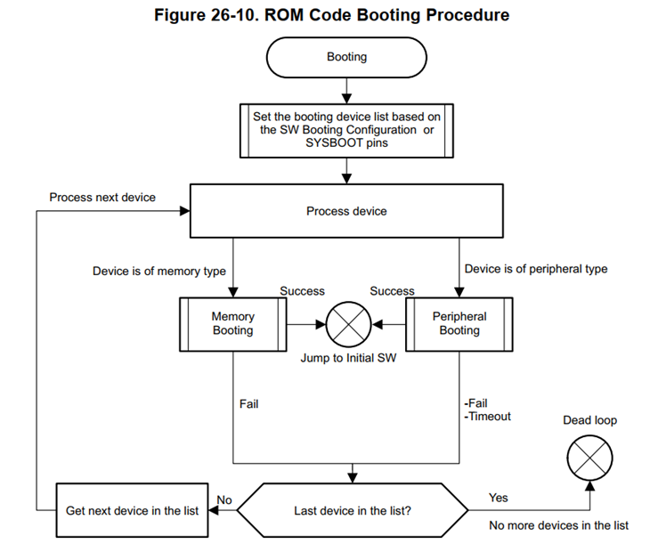

Do đặc thù kích thước nhỏ và không thể ghi đè lại. Nên chương trình boot ROM thường sẽ làm rất đơn giản. Tuy nhiên ngày nay, do nhu cầu về những cách thức boot phức tạp hơn. Ví dụ như cho phép boot OS từ ethernet, serial, hiển thị logo,...Do đó cần phải có 1 chương trình boot loader phức tạp hơn. Chương trình sẽ được lưu ở bộ nhớ ngoài với kích thước lớn hơn -> Uboot ra đời.

## Secure boot

Secure Boot là cơ chế bảo mật nhằm đảm bảo chỉ những firmware đã được xác thực (trusted) mới được phép chạy thực thi. Điều này giúp bảo vệ firmware khỏi bị thay thế hoặc sửa đổi trái phép.

Ví dụ như firmware cho camera, nếu không có secure boot thì rất dễ bị một người nào đó có ý đồ xấu thực hiện thay đổi firmware để thực hiện hành vi vi phạm riêng tư.

**Cơ chế hoạt động**

Khi ta build image nó sẽ thực hiện theo sequence sau:

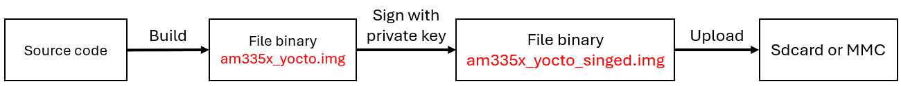

Trong đó, image `am335x_yocto_singed.img` chứa:
- Payload (`am335x_yocto.img`)
- Metadata bảo mật:
  - Hash
  - Digital signature(RSA/ECDSA)
  - Header

Và đây là quá trình khi boot:

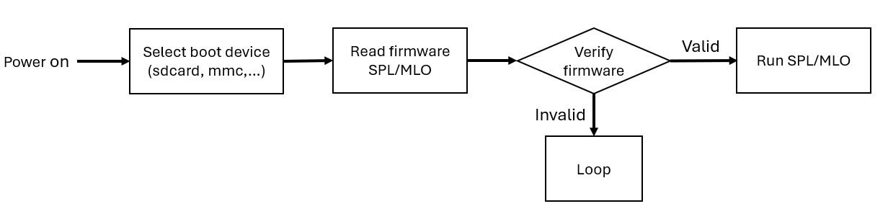

Ở đây, boot rom sẽ thực hiện verify firmware như sau:
- Dùng public key được lưu trong bộ nhớ OTP để thực hiện giải mã digital signarute trong metadata được mã hash gọi là digest 1.
- Sau đó, thực hiện hash firmware cần verify được mã hash gọi là digest 2.
- Thực hiện so sánh hai digest, nếu khớp thì hợp lệ, ngược lại thì có nghĩa là mã không toàn vẹn.

## Second stage bootloader

Sau khi boot rom thực thi xong, nó sẽ load chương trình thứ 2 là second stage bootloader được lưu trên sdcard của beaglebone black.

Khi build uboot cho beaglebone, chúng ta sẽ có 2 file `MLO` và `uboot.img` như hình dưới đây:

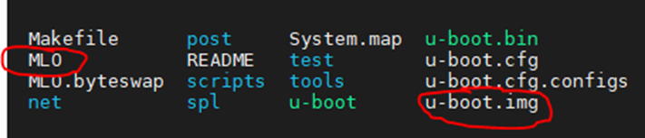

Ta sử dụng 2 câu lệnh liên tiếp sau để ghi uboot vào thẻ nhớ trên board beaglebone:

```bash
sudo dd if=./u-boot/MLO of=${DISK} count=1 seek=1 bs=128k
sudo dd if=./u-boot/u-boot.img of=${DISK} count=2 seek=1 bs=384k
```

File chương trình second stage (MLO) được ghi vào block đầu tiên của thẻ sdcard và third stage (`u-boot.img`) được ghi vào block thứ 2 có địa bắt đầu là 128k. Như vậy sau khi boot rom chạy xong nó sẽ nhảy đến câu lệnh đầu tiên được lưu trữ trên thẻ nhớ và đó chính là câu lệnh đầu tiên của MLO (second stage). Chúng ta sẽ cùng tìm hiểu chi tiết các công việc mà second state thực hiện.

Những câu lệnh đầu tiên mà second stage thực hiện sẽ nằm trong file `arch/arm/cpu/armv7/start.S`. Trong source code u-boot có rất nhiều file `start.S`, mỗi một loại chip sẽ sử dụng 1 file `start.S` khác nhau. File này do nhà sản xuất chip như arm hoặc intel viết riêng cho chip của họ. Đối với Beagle bone sử dụng armv7 thì file `start.S` của nó sẽ có đường dẫn như trên. Dưới đây là 1 đoạn code nhỏ của `start.S`:

```asm
/* the mask ROM code should have PLL and others stable */
#ifndef CONFIG_SKIP_LOWLEVEL_INIT
#ifdef CONFIG_CPU_V7A
    bl      cpu_init_cp15
#endif
#ifndef CONFIG_SKIP_LOWLEVEL_INIT_ONLY
    bl      cpu_init_crit
#endif
#endif

    bl      _main
```

Vì chưa khởi tạo tài nguyên như memory nên `start.S` thực thi với rất nhiều giới hạn. Nó không truy cập vào bộ nhớ, không sử dụng đươc biến. Thay vào đó nó chỉ có thể thao tác với các thanh ghi. `start.S` làm các công việc rất cơ bản như khởi tạo cpu ở mức cơ bản. Nhiệm vụ của nó là chuẩn bị tài nguyên để thực thi hàm `_main`.

Hàm `_main` nằm trong file `arch/arm/lib/crt0_64.S`. Code của nó như sau:

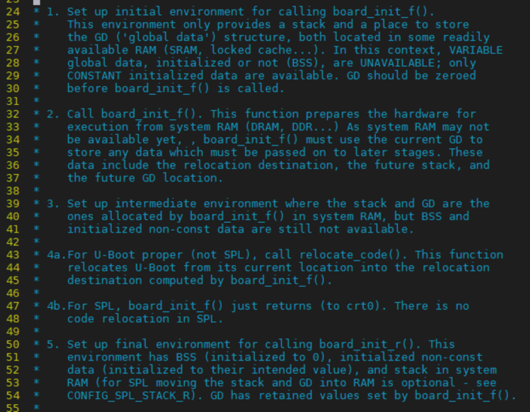

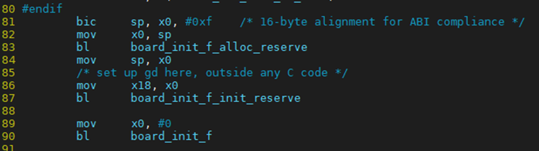

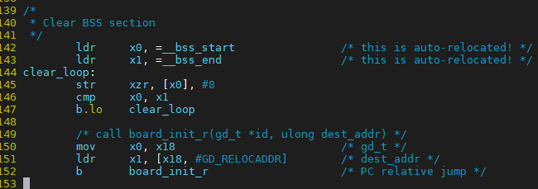

Nhiệm vụ của hàm `_main` là khởi tạo các tài nguyên cần thiết như memory rồi gọi hàm `board_init_f`. Sau đó nó sẽ gọi hàm `board_init_r`.

Hàm `board_init_f` của second stage có source code nằm ở file `arch/arm/mach-omap2/hwinit-common.c`. Source code của file `start.S` do các hãng chip viết, còn source code của `board_init_f` do các hãng làm SoC viết. Do cả 2 được build cùng vào 1 chương trình là MLO nên chúng có thể gọi được nhau. Sau đây là source code của hàm `board_init_f` trong first stage:

```c
#ifdef CONFIG_SPL_BUILD
void board_init_f(ulong dummy)
{
    early_system_init();
#ifdef CONFIG_BOARD_EARLY_INIT_F
    board_early_init_f();
#endif
    /* For regular u-boot sdram_init() is called from dram_init() */
    sdram_init();
    gd->ram_size = omap_sdram_size();
}
#endif
```

`board_init_f` sẽ khởi tạo sdram chính là bộ nhớ cached L2 của chip. Ngoài ra nó có thể khởi tạo 1 số tài nguyên quan trọng khác. Sau khi `board_init_f` thực hiện xong, `_main` sẽ gọi tiếp hàm `board_init_r`. `board_init_r` của second stage có source code nằm ở file: `common/spl/spl.c`.

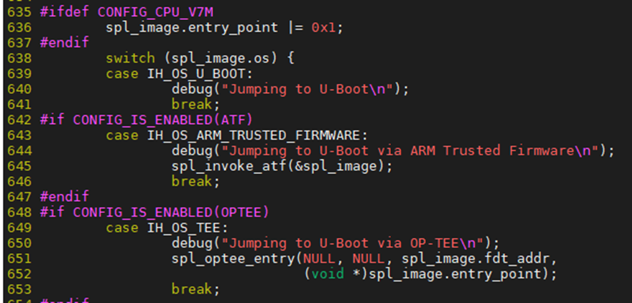

`board_init_r` sẽ khởi tạo thêm 1 số thứ nữa, cuối cùng nó sẽ load image của chương trình third stage bootloader (chính là file `u-boot.img`) vào sdram. Tham số `spl_image` trong hình chính là struct chứa thông tin của file MLO như `start_address`, `end_address` trên sdcard. Như mình đã nói ở trên thì `u-boot.img` sẽ có địa chỉ trên sdcard ngay sau `end_address` của MLO. 

## Third stage bootloader

Sau khi `u-boot.img` được load vào sdram, nó sẽ chiếm toàn quyền sử dụng hệ thống. Trong hệ thống không còn sự tồn tại của chương trình second state MLO nữa. So với second stage thì chương trình third stage sẽ làm được nhiều việc hơn do hệ thống đã khởi tạo được nhiều thứ hơn như đã có dram, có thể sử dụng hàm malloc,...

`u-boot.img` sẽ gọi hàm `board_init_f` và `board_init_r` trong source code của nó. Mỗi hàm này đều có 1 cặp, trong đó 1 cái sẽ nằm trong MLO và cái còn lại sẽ nằm trong `u-boot.img`. Hàm nằm trong `u-boot.img` sẽ làm được nhiều việc hơn so với MLO. Các hàm được build cùng với chương trình first stage sẽ có chỉ thị tiền xử lý `CONFIG_SPL_BUILD` ở đầu:

```c
#ifdef CONFIG_SPL_BUILD
void board_init_f(ulong dummy)
{
    early_system_init();
#ifdef CONFIG_BOARD_EARLY_INIT_F
    board_early_init_f();
#endif
    /* For regular u-boot sdram_init() is called from dram_init() */
    sdram_init();
    gd->ram_size = omap_sdram_size();
}
#endif
```

Hàm `board_init_f` của third stage có source code nằm ở file `common/board_f.c`:

```c
static const init_fnc_t init_sequence_f[] = {
    setup_mon_len,
#ifdef CONFIG_OF_CONTROL
    fdtdec_setup,
#endif
#ifdef CONFIG_TRACE
    trace_early_init,
#endif
    initf_malloc,
    log_init,
    initf_bootstage,        /* uses its own timer */
#ifdef CONFIG_BLOBLIST
    bloblist_init,
#endif
    setup_spl_handoff,
    initf_console_record,
#if defined(CONFIG_HAVE_FSP)
    arch_fsp_init,
#endif
    arch_cpu_init,          /* basic arch cpu ... */
    mach_cpu_init,          /* SoC/machine dependent */
    initf_dm,
    arch_cpu_init_dm,
#if defined(CONFIG_BOARD_EARLY_INIT_F)
    board_early_init_f,
#endif
    ...
};

void board_init_f(ulong boot_flags)
{
    debug("PhuLA board_init_f\n");
    gd->flags = boot_flags;
    gd->have_console = 0;

    if (initcall_run_list(init_sequence_f))
        hang();

#if !defined(CONFIG_ARM) && !defined(CONFIG_SANDBOX) && \
    !defined(CONFIG_EFI_APP) && !CONFIG_IS_ENABLED(X86_64) && \
    !defined(CONFIG_ARC)
    /* NOTREACHED - jump_to_copy() does not return */
    hang();
#endif
}
```

Nhiệm vụ của `board_init_f` là khởi tạo các tài nguyên dựa trên tài nguyên bộ nhớ ít ỏi là sdram. Luồng gọi sẽ như sau: `board_init_f` -> `init_sequence_f` -> khởi tạo từng module. Thông thường các hàm khởi tạo hardware sẽ gọi xuống driver của từng hãng khác nhau. Ví dụ như đối với beagle bone: `init_sequence_f` -> `serial_init` -> probe (`drivers/serial/serial_omap.c`).

Sau khi `board_init_f` chạy xong, lúc này hệ thống đã khởi tạo được nhiều tài nguyên hơn. Ví dụ như đã sử dụng được DRAM, dùng được malloc, device tree,...

Lúc này `_main` tiếp tục gọi `board_init_r` để khởi tạo nốt những module hardware còn lại. Tương tự như trên thì `board_init_r` cũng gọi xuống các file driver của board beaglebone theo luồng như sau `board_init_r` -> `init_sequence_r` -> khởi tạo từng module:

```c
static init_fnc_t init_sequence_r[] = {
    initr_trace,
    initr_reloc,
    /* TODO: could x86/PPC have this also perhaps? */
#ifdef CONFIG_ARM
    initr_caches,
    /* Note: For Freescale LS2 SoCs, new MMU table is created in DDR.
     * A temporary mapping of IFC high region is since removed,
     * so environmental variables in NOR flash is not available
     * until board_init() is called below to remap IFC to high region.
     */
#endif
    initr_reloc_global_data,
#if defined(CONFIG_SYS_INIT_RAM_LOCK) && defined(CONFIG_E500)
    initr_unlock_ram_in_cache,
#endif
    initr_barrier,
    initr_malloc,
    log_init,
    initr_bootstage,        /* Needs malloc() but has its own timer */
    initr_console_record,
#ifdef CONFIG_SYS_NONCACHED_MEMORY
    initr_noncached,
#endif
    bootstage_relocate,
#ifdef CONFIG_OF_LIVE
    initr_of_live,
#endif
#ifdef CONFIG_DM
    initr_dm,
#endif
    ...
};

void board_init_r(gd_t *new_gd, ulong dest_addr)
{
    /*
     * Set up the new global data pointer. So far only x86 does this
     * here.
     * TODO(sjg@chromium.org): Consider doing this for all archs, or
     * dropping the new_gd parameter.
     */
#if CONFIG_IS_ENABLED(X86_64)
    arch_setup_gd(new_gd);
#endif

#ifdef CONFIG_NEEDS_MANUAL_RELOC
    int i;
#endif

#if !defined(CONFIG_X86) && !defined(CONFIG_ARM) && !defined(CONFIG_ARM64)
    gd = new_gd;
#endif
    gd->flags &= ~GD_FLG_LOG_READY;

#ifdef CONFIG_NEEDS_MANUAL_RELOC
    for (i = 0; i < ARRAY_SIZE(init_sequence_r); i++)
        init_sequence_r[i] += gd->reloc_off;
#endif

    if (initcall_run_list(init_sequence_r))
        hang();

    /* NOTREACHED - run_main_loop() does not return */
    hang();
}
```

Sau khi khởi tạo xong hết hardware, `board_init_r` sẽ gọi ra hàm `run_main_loop`. Hàm này sẽ khởi tạo hệ thống command line của u-boot. Vậy command line trên uboot dùng để làm gì? Chúng ta sẽ cùng tìm hiểu ở phần tiếp theo.

:::warning Lưu ý
u-boot khởi tạo dram thông qua luồng `init_sequence_f` -> `dram_init`. Trong `dram_init` sẽ get ra size của bộ nhớ ram trong hệ thống rồi truyền giá trị đó cho linux thông qua kernel parameter. Nếu sau khi các cần tích hợp thêm ram vào board mà hệ thống nhận không đủ ram thì có thể kiểm tra trong hàm này.
:::

## Hệ thống command line của uboot

Nếu như linux được phân chia làm 3 tầng bao gồm application, kernel, driver thì u-boot cũng tương tự như vậy.

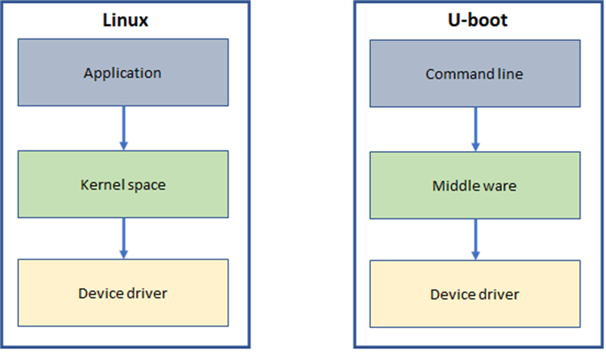

Sau khi khởi tạo hardware và middleware thông qua 2 hàm `board_init_f` và `board_init_r` thì u-uboot sẽ đi vào 1 vòng lặp. Lúc này người dùng có thể thao tác gõ command line để điều khiển hệ thống. Muốn vào được giao diện này thì chúng ta phải connect PC vào board thông qua cổng serial và ngắt quá trình auto boot của uboot bằng phím space. Giao diện thao tác command line sẽ giống như hình sau:

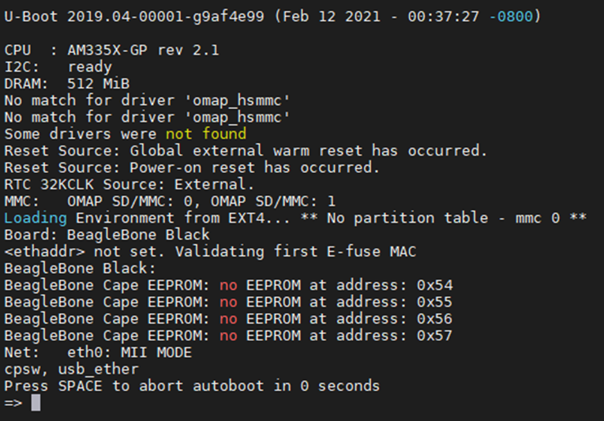

:::warning Chú ý
Sau khi ghi u-boot mới build được vào thẻ nhớ, ta cần lưu ý ấn phím s2 trên board để chương trình boot rom jump sang uboot ở sdcard. Nếu không board sẽ vẫn sử dụng u-boot cũ trên eMMC. 
:::

Uboot support hàng trăm command line khác nhau như hình dưới đây:

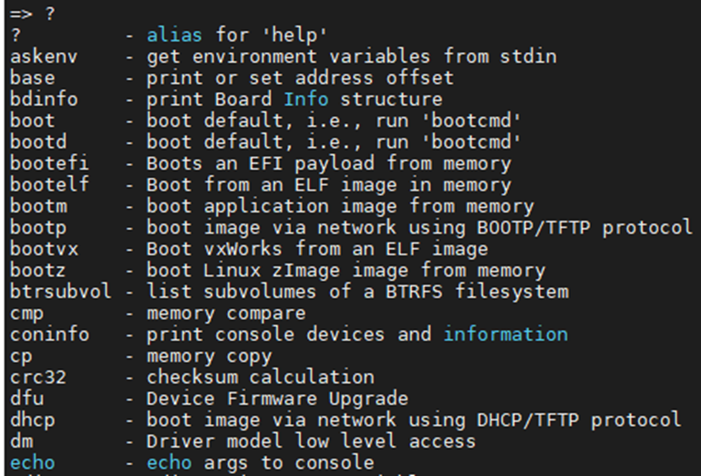

Ngoài ra u-boot cũng có hệ thống biến môi trường giống như linux. Để show ra giá trị các biến môi trường, các bạn có thể dùng câu lệnh `printenv` giống linux.

Trên linux thì các command line bản chất là các file binary được đặt trong thư mục `/bin` hoặc `/sbin` của hệ thống. Tuy nhiên do u-boot là một chương trình vi điều khiển, do vậy các command line của nó là các function trong source code. Mỗi 1 function khi muốn đăng ký thành command line sẽ sử dụng macro `U_BOOT_CMD` như sau:

```c
U_BOOT_CMD_COMPLETE(
    printenv, CONFIG_SYS_MAXARGS, 1, do_env_print,
    "print environment variables",
    "[ -a ]\n    print [all] values of all environment variables\n"
#if defined(CONFIG_CMD_NVEDIT_EFI)
    "printenv -e [name ...]\n"
    "    - print UEFI variable 'name' or all the variables\n"
#endif
    "printenv name ...\n"
    "    - print value of environment variable 'name'",
    var_complete
);
```

Command line của u-boot cũng hỗ trợ help và truyền option khi sử dụng giống như linux. Hàm `do_main_loop` sẽ liên tục get input của user thông qua serial, từ đó detect được command line mà user gõ. Ví dụ như user gõ `printenv` thì hàm `do_env_print` sẽ được gọi ra để xử lý. Tất cả các command line còn lại đều tương tự như vậy. Một số command line như đọc data trên mmc, i2c thì sẽ gọi xuống middleware rồi từ middleware sẽ call driver của board để thực hiện.

Nếu như quá trình boot không bị ngắt bởi input từ user thì hàm `do_main_loop` sẽ thực thi 1 loạt command line để execute linux kernel. Quá trình này giống như chạy shell script. Chúng ta sẽ cùng tìm hiểu kỹ hơn ở phần tiếp theo.

## Quá trình load Linux kernel

Để load được image của linux kernel lên ram thì cần thực thi 1 chuỗi các command line. Mỗi 1 board lại khác nhau đôi chút về các command line cần phải thực thi. Ví dụ như đối với beaglebone black thì cần load file `uEnv.txt` trên sdcard trước để lấy config hệ thống. Do vậy mỗi 1 hãng làm board sẽ tạo 1 script riêng và u-boot sẽ thực thi script đấy để load kernel image mà không cần quan tâm bên trong là gì.

Script đấy được define bằng macro `CONFIG_EXTRA_ENV_SETTINGS` nằm trong folder `/include/configs`. Ví dụ như beaglebone sẽ có file `include/configs/omap3_beagle.h` của riêng nó. Giải thích một chút về script boot kernel image của beagle bone như sau:

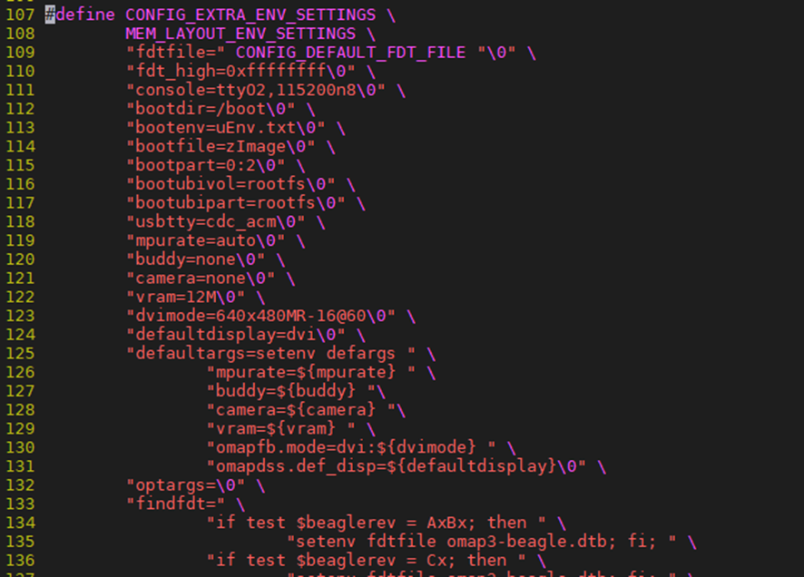

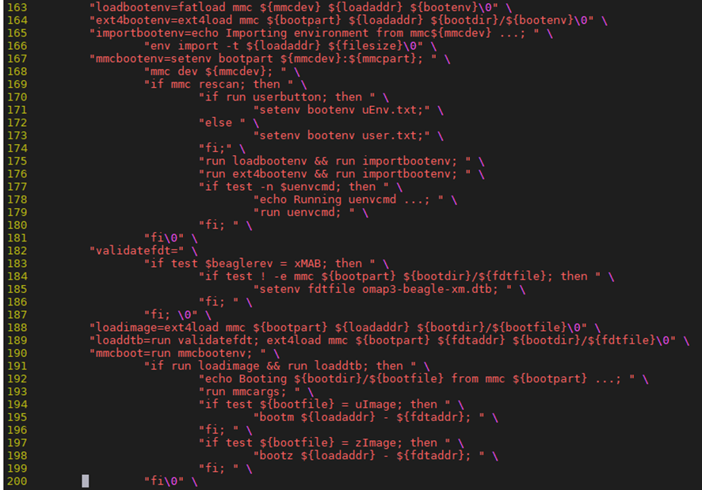

Đầu tiên u-boot sẽ đọc file `/boot/uEnv.txt` để lấy config. Sau đó sẽ lựa chọn load kernel image và dtb file từ mmc hoặc sdcard. Sau khi đọc kernel image và dtb file từ sdcard lên ram uboot sẽ dựa vào định dạng của kernel image và uImage hoặc zImage để tiến hành giải nén. Cuối cùng uboot sẽ gọi command `bootm` và truyền vào đó địa chỉ của kernel image và dtb file trên ram. `bootm` sẽ jump vào câu lệnh đầu tiên của kernel và chuyển toàn bộ quyền điều khiển hệ thống cho nó. Đến đây là u-boot đã hoàn thành nhiệm vụ của mình.

## Tổ chức source code của uboot

Về cơ bản thì u-boot có tổ chức source code tương tự kernel. Bao gồm những folder chính sau:
- cmd: Chứa source code của tất cả các command line. Thông thường mỗi command line sẽ là 1 file source C.
- configs: Chứa file config để generate ra file .config khi build u-boot.
- Documentation: Chứa hệ thống tài liệu của u-boot.
- env: Chứa source code để xây dựng ra hệ thống biến môi trương của u-boot.
- lib: Source code phần middler ware của u-boot.
- net: Source code liên quan đến tính năng network. U-boot cũng có thể sử dụng được network như ping, sftp,...
- arch: Source code specific cho từng platform. Device tree cũng được lưu trữ trong folder này.
- common: Source code phần middler ware của u-boot.
- drivers: Chứa source code driver của từng board.
- spl: Chứa 1 phần code để build ra second stage boot loader.
- tools: Chứa các loại tool dùng trong quá trình build u-boot.
- fs: Chứa source code của các loại file system dùng trong u-boot. U-boot cũng có tính năng đọc file theo file name như Linux.

## Tham khảo

uboot flow - Lưu An Phú