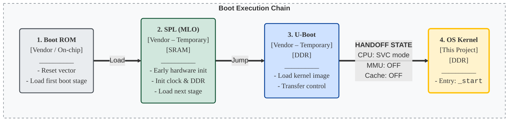
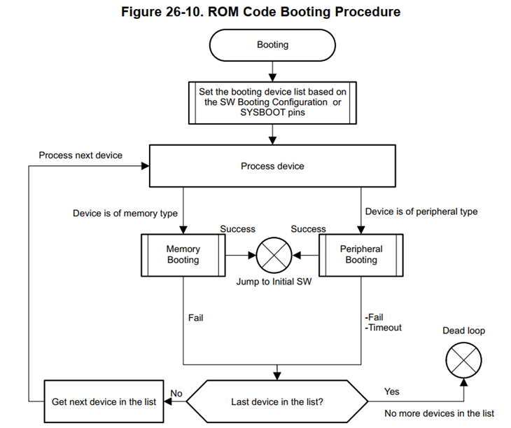
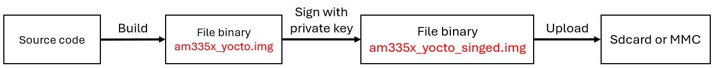
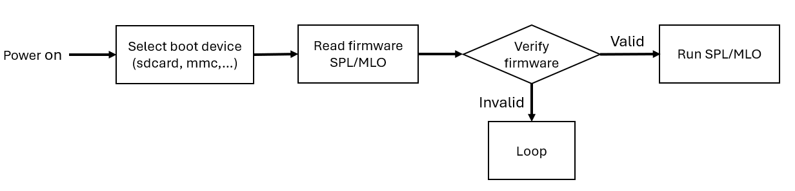
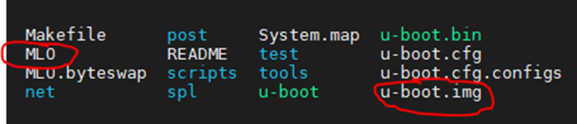
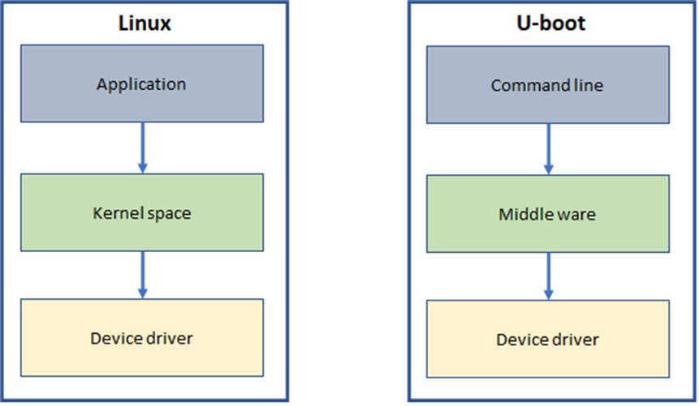
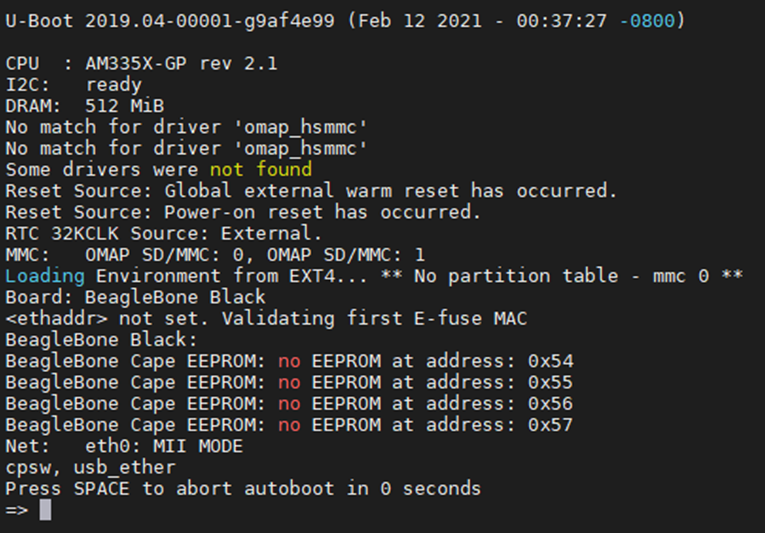
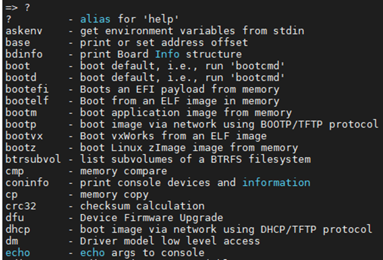

# Uboot

Do hệ điều hành có thể nằm trên các vùng nhớ khác nhau như flash, mmc, sdcard,... thậm chí có thể nằm trên internet. Do vậy khi máy tính khởi động, nó cần chạy 1 chương trình đặc biệt dùng để load hệ điều hành. Chương trình đó gọi là bootloader. Nếu như hệ điều hành có thể lưu trữ tại bất cứ đâu, có thể là bộ nhớ nằm trong máy tính hoặc nằm ngoài máy tính (lưu trữ trên internet) thì bootloader thông thường chỉ lưu trữ trên ROM. Khi power on, CPU sẽ tự load bootloader và thực hiện câu lệnh đầu tiên của nó. Bootloader sau đó sẽ khởi tạo các tài nguyên khác của hệ thống như CPU, ram, ethernet, sau đó nó sẽ tiến hành load hệ điều hành.

Bootloader là tên chung định danh cho loại chương trình được chạy trước hệ điều hành và có nhiệm vụ là load hệ điều hành. Trong thực tế bootloader có rất nhiều loại như Grub dùng cho PC, Uboot dùng cho các thiết bị embedded Linux.

Các công ty khi làm product chạy hệ điều hành Linux hoặc Android thường sẽ phát sinh nhu cầu chỉnh sửa code của uboot do mạch đã được làm lại khác với sample board. Ví dụ như thay đổi port serial mặc định, thay đổi nơi lưu trữ OS từ MMC sang sdcard...

Về bản chất thì Uboot là 1 chương trình vi điều khiển. Nó sử dụng trực tiếp địa chỉ vật lý chứ không thông qua virtual memory như Linux. Quá trình chạy của boot loader được chia làm các giai đoạn như sau:


```mermaid
flowchart LR
    %% ============================================================
    %% AM335x Boot Sequence (Execution Context View)
    %% ------------------------------------------------------------
    %% Notes:
    %% - SPL / U-Boot are vendor-provided and used temporarily
    %% - Shown to provide execution context only
    %% - OS design starts at kernel entry (_start)
    %% ============================================================

    %% --- STYLING ---
    classDef default font-family:Consolas,Monaco,monospace;
    classDef container fill:#f8f9fa,stroke:#6c757d,stroke-dasharray: 5 5;
    classDef rom fill:#e9ecef,stroke:#495057,stroke-width:2px;
    classDef sram fill:#d1e7dd,stroke:#0f5132,stroke-width:2px;
    classDef ddr fill:#cfe2ff,stroke:#084298,stroke-width:2px;
    classDef kernel fill:#fff3cd,stroke:#ffc107,stroke-width:3px;   

    %% --- FLOW ---
    subgraph CHAIN [" <b>Boot Execution Chain</b> "]
        direction LR

        %% 1. ROM
        ROM("<b>1. Boot ROM</b><br/>[Vendor / On-chip]<br/>__________<br/>- Reset vector<br/>- Load first boot stage")

        %% 2. SPL / MLO
        SPL("<b>2. SPL (MLO)</b><br/>[Vendor – Temporary]<br/>[SRAM]<br/>__________<br/>- Early hardware init<br/>- Init clock & DDR<br/>- Load next stage")

        %% 3. U-Boot
        UBOOT("<b>3. U-Boot</b><br/>[Vendor – Temporary]<br/>[DDR]<br/>__________<br/>- Load kernel image<br/>- Transfer control")

        %% 4. Kernel
        KERNEL("<b>4. OS Kernel</b><br/>[This Project]<br/>[DDR]<br/>__________<br/>- Entry: <code>_start</code>")
    end

    %% --- CONNECTIONS ---
    ROM ==>|Load| SPL
    SPL ==>|Jump| UBOOT

    %% --- Handoff boundary ---
    UBOOT == "<b>HANDOFF STATE</b><br/>CPU: SVC mode<br/>MMU: OFF<br/>Cache: OFF" ==> KERNEL

    %% --- APPLY CLASSES ---
    class CHAIN container;
    class ROM rom;
    class SPL sram;
    class UBOOT ddr;
    class KERNEL kernel;
```

## Boot rom

Boot rom là firmware được hãng cung cấp SoC nạp sẵn vào internal ROM - một vùng nhớ ROM on-chip, không thể ghi, có kích thước nhỏ .

Internal ROM có thể nằm ở bất kỳ physical address nào trong address space của SoC — điều này phụ thuộc vào quyết định thiết kế của hãng. Ví dụ với AM335x, internal ROM thực tế nằm ở vùng 0x40000000–0x4001FFFF (128KB). Nhưng tại thời điểm reset hoặc power on, SoC có hardware logic (thường gọi là address remapping hoặc address aliasing) để map địa chỉ 0x00000000 tới vùng ROM đó. Nên khi CPU thực hiện lệnh đầu tiên tại địa chỉ 0x00000000, nó thực chất đang đọc từ ROM ở 0x40000000.

**Tại sao lại làm vậy?** Điều này được thực thi tự động bởi hardware trong chip và được cố định với từng loại kiến trúc như ARM, Intel,... $\rightarrow$ hãng không thay đổi được. Nhưng hãng muốn linh hoạt trong việc đặt ROM, RAM, peripheral ở đâu trong 4GB address space, nên giải pháp là dùng address remapping: lúc boot thì alias 0x0 tới ROM, sau khi boot xong software có thể reconfigure memory map — ví dụ remap 0x0 tới RAM để vector table nằm trong RAM.

Ngoài ra, tài nguyên mà boot rom có thể sử dụng rất hạn chế:
- CPU chạy ở clock rất thấp do PLL clock chưa được khởi tạo.
- MMU và Cache tắt $\rightarrow$ CPU thực hiện lệnh và đọc data trực tiếp từ bus, không có caching, không có virtual memory. Mỗi lần truy cập bộ nhớ đều chạy ở bus speed thực tế.
- DDR chưa khởi tạo $\rightarrow$ Chỉ có thể sử dụng internal SRAM - một vùng nhớ RAM on-chip, có kích thước nhỏ (trên AM335x khoảng 64KB).
- Hầu hết ngoại vi không hoạt động $\rightarrow$ Boot ROM phải thực hiện bật clock cho ngoại vi mà nó cần dùng.

Nhiệm vụ của Boot ROM:
1. Khởi tạo tài nguyên tối thiểu:
   - Bật một số clock gate cần thiết cho ngoại vi mà nó dùng
   - Khởi tạo ngoại vi cơ bản. Ví dụ như các strapping pin
2. Đọc giá trị của strapping pin `SYSBOOT` để xác định boot device list.
3. Load Secondary Program Loader (SPL) từ boot device. Với mỗi boot device trong list, nó thực hiện vòng lặp: Khởi tạo ngoại vi tương ứng, thử đọc dữ liệu từ device đó, validate dữ liệu đọc được, và nếu thành công thì jump đến code vừa load, nếu thất bại thì thử device tiếp theo trong list.



Do đặc thù kích thước nhỏ và không thể ghi đè lại. Nên chương trình boot ROM thường sẽ làm rất đơn giản. Tuy nhiên ngày nay, do nhu cầu về những cách thức boot phức tạp hơn. Ví dụ như cho phép boot OS từ ethernet, serial, hiển thị logo,...Do đó cần phải có 1 chương trình bootloader phức tạp hơn. Chương trình sẽ được lưu ở bộ nhớ ngoài với kích thước lớn hơn -> Uboot ra đời.

## Secure boot

Secure Boot là cơ chế bảo mật nhằm đảm bảo chỉ những firmware đã được xác thực (trusted) mới được phép chạy thực thi. Điều này giúp bảo vệ firmware khỏi bị thay thế hoặc sửa đổi trái phép.

Ví dụ như firmware cho camera, nếu không có secure boot thì rất dễ bị một người nào đó có ý đồ xấu thực hiện thay đổi firmware để thực hiện hành vi vi phạm riêng tư.

**Cơ chế hoạt động**

Khi ta build image nó sẽ thực hiện theo sequence sau:



Trong đó, image `am335x_yocto_singed.img` chứa:
- Payload (`am335x_yocto.img`)
- Metadata bảo mật:
  - Hash
  - Digital signature(RSA/ECDSA)
  - Header

Và đây là quá trình khi boot:



Ở đây, boot rom sẽ thực hiện verify firmware như sau:
- Dùng public key được lưu trong bộ nhớ OTP để thực hiện giải mã digital signarute trong metadata được mã hash gọi là digest 1.
- Sau đó, thực hiện hash firmware cần verify được mã hash gọi là digest 2.
- Thực hiện so sánh hai digest, nếu khớp thì hợp lệ, ngược lại thì có nghĩa là mã không toàn vẹn.

## DDR là gì?

DDR (Double Data Rate) là ram ngoài, nằm trên PCB, kết nối với SoC qua hàng chục đường tín hiệu song song: data lines (DQ), address lines (A), control lines (RAS, CAS, WE, CS), clock (CK/CK#), và data strobe (DQS). Không giống Internal SRAM — cứ ghi địa chỉ là đọc/ghi được ngay — DDR hoạt động theo protocol phức tạp hơn nhiều vì nó cần tốc độ cao và dung lượng lớn.

**Cách DDR hoạt động**

Hãy tưởng tượng DDR như một bảng tính Excel khổng lồ với hàng triệu ô. Data được tổ chức thành rows và columns. Khi CPU muốn đọc một ô, quá trình diễn ra qua nhiều bước tuần tự:
- Bước 1 là Row Activate — mở một hàng lên. DDR chip phải load toàn bộ nội dung một row vào row buffer nội bộ. Giống như ta phải mở một ngăn kéo tủ hồ sơ trước khi lấy tài liệu.
- Bước 2 là Column Read/Write — chọn cột trong row đã mở, đọc hoặc ghi data. Giống như tìm đúng tài liệu trong ngăn kéo đang mở.
- Bước 3 là Precharge — đóng row hiện tại trước khi mở row khác. Giống như phải đóng ngăn kéo hiện tại trước khi mở ngăn kéo khác.

Mỗi bước này tốn một khoảng thời gian nhất định, và DDR chip không cho phép ta chạy bước tiếp theo trước khi bước trước hoàn thành. Đây chính là các **timing parameters**.

**Timing parameters**

- `tRCD` là thời gian chờ giữa mở row và đọc/ghi column — gửi lệnh Activate xong, phải đợi `tRCD` nanosecond mới được gửi lệnh Read/Write. Nếu gửi sớm hơn, data đọc ra sẽ sai.
- `tRP` là thời gian chờ để đóng row (Precharge) — phải đợi `tRP` nanosecond sau khi Precharge mới được mở row mới.
- `CAS Latency (CL)` là số clock cycle từ lúc gửi lệnh Read đến khi data thực sự xuất hiện trên data bus.
- `tRAS` là thời gian tối thiểu một row phải giữ mở trước khi được phép đóng.

Mỗi DDR chip có giá trị timing riêng, ghi trong datasheet. Ví dụ một chip DDR3 có thể có `CL=11`, `tRCD=13.75ns`, `tRP=13.75ns`. SPL phải program đúng những giá trị này vào DDR controller — controller sẽ tự động chèn đúng khoảng chờ khi giao tiếp với chip DDR.

Nếu set timing quá ngắn (nhanh hơn chip cho phép) thì data có thể bị corrupt, hệ thống crash hoặc tệ hơn là data sai ngầm mà không biết. Nếu set timing quá dài (chậm hơn cần thiết) thì hệ thống chạy chậm nhưng vẫn đúng — an toàn hơn nhưng lãng phí performance.

**DDR PHY — Tín hiệu vật lý**

Ở trên là logic level — controller biết khi nào gửi lệnh gì. Nhưng còn physical level: tín hiệu chạy trên PCB ở tốc độ hàng trăm MHz đến hàng GHz, nên chất lượng tín hiệu rất quan trọng.

DDR PHY (Physical Interface) là phần hardware nằm giữa controller logic và pin SoC. SPL cần cấu hình PHY với drive strength — dòng điện đẩy tín hiệu lên đường trace mạnh bao nhiêu. Quá yếu thì tín hiệu không đủ biên độ, quá mạnh thì gây nhiễu. Ngoài ra, ODT (On-Die Termination) — điện trở kết thúc đường truyền nằm ngay trong chip DDR, giúp giảm phản xạ tín hiệu. Giống như ta đặt miếng mút ở cuối ống nước để sóng không dội ngược lại. Và slew rate — tốc độ chuyển đổi 0 $\rightarrow$ 1 và 1 $\rightarrow$ 0. Quá nhanh gây nhiễu EMI, quá chậm thì tín hiệu không kịp ổn định trước clock edge tiếp theo.

Giá trị tối ưu cho các tham số này phụ thuộc vào PCB layout cụ thể — trace dài bao nhiêu, có bao nhiêu chip DDR trên board, topology đi dây như thế nào. Cùng SoC, cùng DDR chip, nhưng hai board khác nhau có thể cần PHY config khác nhau.

**DDR Training**

Ở tốc độ cao, ngay cả khi ta set timing đúng theo datasheet, có thể vẫn lỗi vì: PCB trace giữa SoC và DDR chip không dài bằng nhau cho mọi signal, nhiệt độ ảnh hưởng đến delay,...

DDR Training là quá trình hardware tự động thử nhiều giá trị timing, gửi pattern test, đọc lại kiểm tra, tìm ra khoảng timing hoạt động đúng, rồi chọn điểm giữa khoảng đó (điểm an toàn nhất).

Hình dung như thế này: ta có một cửa sổ thời gian rất hẹp để "bắt" đúng data trên bus. Training giúp tìm chính xác cửa sổ đó ở đâu và rộng bao nhiêu, rồi đặt điểm sampling vào giữa cửa sổ — nơi có margin lớn nhất.

**Tại sao BOOT ROM không làm việc này?**

Bây giờ ta có thể hiểu tại sao ROM Bootloader không thể khởi tạo DDR — nó cần biết board cụ thể dùng DDR chip gì (timing parameters), PCB layout ra sao (PHY config), và power supply cấp DDR ở voltage nào. Mỗi board là một bộ giá trị khác nhau. ROM là code chung cho mọi board dùng AM335x, nên không thể hardcode thông tin này. SPL mới là nơi chứa cấu hình DDR, được developer cấu hình khi port U-Boot cho board mới.

## Second stage bootloader hay SPL/MLO

SPL là chương trình đầu tiên mà developer có thể build, sửa, debug. Nó được Boot ROM load vào Internal SRAM và chạy từ đó. Nhiệm vụ cốt lõi của SPL chỉ có một: khởi tạo đủ hardware để load được bootloader chính (U-Boot) vào DDR.

Tại thời điểm ROM jump vào SPL, tài nguyên hệ thống vẫn rất nhiều giới hạn: CPU vẫn chạy ở clock rất thấp, chỉ có internal SRAM, DDR chưa hoạt động, cache và MMU vẫn tắt, và đa số peripheral chưa init.

Nhiệm vụ của SPL:
1. Cấu hình power management và PLL clock: Trước khi tăng clock lên cao, có thể phải tăng voltage cho CPU core. Trên BBB, SPL giao tiếp với TPS65217 PMIC qua I2C để set đúng voltage trước khi set PLL lên full speed. Thứ tự này rất quan trọng — nếu tăng clock trước khi tăng voltage, CPU có thể không ổn định. Ngược lại cũng vậy — tăng voltage quá cao khi clock thấp thì lãng phí điện và có thể gây nhiệt.
2. Khởi tạo DDR: Đây là lý do tồn tại chính của SPL và cũng là phần khó nhất. Khởi tạo DDR không đơn giản chỉ là bật controller lên  mà nó là một quy trình nhiều bước rất chi tiết (đã nói chi tiết ở phần [DDR](#ddr-là-gì)).
3. Khởi tạo boot device: SPL cần đọc U-Boot image từ boot device, nên nó phải khởi tạo ngoại vi tương ứng. Ở đây có một điểm cần chú ý là SPL có thể boot từ device khác với device mà ROM dùng để load SPL. Ví dụ ROM load SPL từ SD card, nhưng SPL có thể load U-Boot từ eMMC hoặc SPI NOR hoặc network. Tuy nhiên, trên thực tế, SPL thường dùng cùng boot device với ROM để tránh việc phải setup phức tạp.
4. Load Uboot vào DDR: SPL đọc U-Boot image từ boot device vào DDR. Vì bây giờ đã có DDR, image size không còn bị giới hạn bởi SRAM nữa.
5. Jump tới Uboot: SPL set PC về entry point của U-Boot. Tại thời điểm này, tài nguyên hệ thống có thể sử dụng đã khác hẳn so với khi Boot ROM chạy: CPU ở full speed, DDR khả dụng với hàng trăm MB, clock tree đã cấu hình đầy đủ.

:::warning Tại sao lại cần SPL?
U-Boot quá lớn để lưu ở SRAM nên nó cần bộ nhớ RAM lớn hơn là DDR, nhưng để có DDR thì phải có code khởi tạo DDR, mà code đó phải chạy từ SRAM. SPL giải quyết bài toán này bằng cách làm trung gian — đủ nhỏ lưu ở SRAM, đủ chức năng để khởi tạo DDR.

Ngoài ra, Boot ROM cũng không thể làm việc này vì cấu hình DDR mỗi board là khác nhau. Boot ROM là ROm chung cho mọi board dùng SoC đó, nên nó không thể biết board cụ thể dùng DDR chip gì, tốc độ bao nhiêu,... SPL mới là nơi chứa thông tin cấu hình DDR cho từng board cụ thể.
:::

Thông thường, SPL thực chất là U-Boot build ở chế độ SPL. Trong U-Boot source code, có config option dạng `CONFIG_SPL` — khi bật, U-Boot compiler sẽ build ra hai binary: SPL (nhỏ, chỉ chứa code cần thiết cho early init) và U-Boot proper (full bootloader).

Nghĩa là SPL và U-Boot dùng chung codebase, chung driver, chung build system. SPL chỉ đơn giản là U-Boot với hầu hết features bị loại bỏ. Kbi build U-Boot cho AM335x, file output là `MLO` (SPL) và `u-boot.img` (U-Boot proper) như hình dưới đây:



Ta sử dụng 2 câu lệnh liên tiếp sau để ghi uboot vào thẻ nhớ trên board beaglebone:

```bash
sudo dd if=./u-boot/MLO of=${DISK} count=1 seek=1 bs=128k
sudo dd if=./u-boot/u-boot.img of=${DISK} count=2 seek=1 bs=384k
```

File chương trình second stage (MLO) được ghi vào block đầu tiên của thẻ sdcard và third stage (`u-boot.img`) được ghi vào block thứ 2 có địa bắt đầu là 128k. Như vậy sau khi boot rom chạy xong nó sẽ nhảy đến câu lệnh đầu tiên được lưu trữ trên thẻ nhớ và đó chính là câu lệnh đầu tiên của MLO (second stage).

## Third stage bootloader hay U-Boot

Sau khi U-Boot được load vào DDR, nó sẽ chiếm toàn quyền sử dụng hệ thống. Trong hệ thống không còn sự tồn tại của chương trình second stage MLO nữa. So với second stage thì chương trình third stage sẽ làm được nhiều việc hơn do hệ thống đã khởi tạo được nhiều thứ hơn như đã có DDR, PLL clock đã được cấu hình,...Tuy nhiên, lúc này cache và MMU vẫn tắt và một số ngoại vi vẫn chưa được khởi tạo.

U-Boot chia quá trình khởi tạo thành hai phase rõ ràng, ngăn cách bởi bước **relocation**:
- `board_init_f` — Ở thời điểm này U-Boot đang chạy tại load address mà SPL đặt nó vào. Phase này khởi tạo những thứ cơ bản nhất: serial console (để có UART output sớm nhất có thể), timer (để delay, timeout hoạt động),... Quan trọng nhất, pha này tính toán relocation address — U-Boot sẽ tự copy chính nó lên vùng cao nhất của DDR.
- `board_init_r` — Đây mới là phase khởi tạo chính. U-Boot khởi tạo toàn bộ subsystem: full serial driver, I2C/SPI bus, MMC/SD controller, network (Ethernet PHY, MAC), USB host controller, display/framebuffer (nếu có), filesystem driver (FAT, ext4, UBI/UBIFS), và environment variable system. Sau pha này, U-Boot là một "mini OS" khá mạnh.

:::warning Tại sao cần chia hai phase?
SPL load U-Boot vào vùng thấp của DDR. Nhưng vùng thấp cần dành cho linux kernel . Nếu U-Boot ở đó thì load kernel sẽ ghi đè lên U-Boot. Do đó, U-Boot phải tự relocate lên vùng cao gần top-of-RAM. Trước khi relocate, nó cần biết DDR lớn bao nhiêu $\rightarrow$ cần init tối thiểu trước.
:::

### Environment variable

Environment variable là tập hợp các biến môi trường có định dạng là cặp **key=value**, lưu trong non-volatile storage (MMC, SPI flash, NAND, EEPROM — tùy board config). Một số biến môi trường quan trọng:
- `bootcmd` là lệnh U-Boot tự động chạy khi boot. Ví dụ: `load mmc 0:1 0x82000000 zImage`; `load mmc 0:1 0x88000000 am335x-boneblack.dtb`; `bootz 0x82000000 - 0x88000000`. Lệnh này nghĩa là load kernel từ SD card partition 1 vào DDR address 0x82000000, load Device Tree vào 0x88000000, rồi boot.
- `bootargs` là kernel command line — chuỗi text truyền cho Linux kernel. Ví dụ: `console=ttyO0,115200n8 root=/dev/mmcblk0p2 rootfstype=ext4`. Cho kernel biết serial console ở đâu, root filesystem ở đâu.
- `bootdelay` là số giây U-Boot đợi trước khi tự động chạy `bootcmd`. Trong thời gian này, nếu user nhấn phím cách trên serial console, U-Boot sẽ dừng lại và vào command line.

Environment cho phép ta thay đổi toàn bộ boot behavior mà không cần rebuild U-Boot. Muốn boot từ network thay vì SD? Sửa `bootcmd`. Muốn đổi kernel command line? Sửa `bootargs`. Muốn skip boot delay cho production? Set `bootdelay`=0.

Các lệnh thao tác với environment variable:
 
| Lệnh | Mô tả |
|------|--------|
| `printenv` | In toàn bộ hoặc một biến (`printenv bootcmd`) |
| `setenv <key> <value>` | Tạo/sửa biến trong RAM |
| `setenv <key>` | Xóa biến |
| `saveenv` | Ghi toàn bộ env từ RAM xuống storage |
| `env default -a` | Reset về default |
| `env import` / `env export` | Import/export env dạng text |

### Quá trình load linux kernel

Để load được image của linux kernel lên DDR thì cần thực thi một chuỗi các command line. Mỗi board lại khác nhau đôi chút về các command line cần phải thực thi. Ví dụ như đối với beaglebone black thì cần load file `uEnv.txt` trên sdcard trước để lấy config hệ thống. Do vậy mỗi hãng làm board sẽ tạo một file riêng chứa các biến môi trường và U-Boot sẽ thực thi file đấy để load kernel image mà không cần quan tâm bên trong là gì.

Đầu tiên U-Boot sẽ đọc file `/boot/uEnv.txt` để lấy config. Sau đó sẽ lựa chọn load kernel image và `.dtb` file từ mmc hoặc sdcard. Sau khi đọc kernel image và `.dtb` file từ sdcard lên ram, U-Boot sẽ dựa vào định dạng của kernel image và sử dụng `uImage` hoặc `zImage` để tiến hành giải nén. Cuối cùng uboot sẽ gọi command `bootm` và truyền vào đó địa chỉ của kernel image và dtb file trên ram. `bootm` sẽ jump vào câu lệnh đầu tiên của kernel và chuyển toàn bộ quyền điều khiển hệ thống cho nó. Đến đây là U-Boot đã hoàn thành nhiệm vụ của mình.

:::warning Chú ý
- `bootm`: Dành cho uImage format (có chứa 64-byte U-Boot header)
- Nếu dùng nhầm `bootm` cho raw binary  $\rightarrow$  U-Boot sẽ parse 64 byte đầu tiên làm header  $\rightarrow$  entry point sai  $\rightarrow$  crash
:::

## Hệ thống command line của uboot

Nếu như linux được phân chia làm 3 tầng bao gồm application, kernel, driver thì U-Boot cũng tương tự như vậy.



Sau khi khởi tạo hardware và middleware thông qua 2 hàm `board_init_f` và `board_init_r` thì u-uboot sẽ đi vào 1 vòng lặp. Lúc này người dùng có thể thao tác gõ command line để điều khiển hệ thống. Muốn vào được giao diện này thì chúng ta phải connect PC vào board thông qua cổng serial và ngắt quá trình auto boot của uboot bằng phím space. Giao diện thao tác command line sẽ giống như hình sau:



:::warning Chú ý
Sau khi ghi U-Boot mới build được vào thẻ nhớ, ta cần lưu ý ấn phím s2 trên board để chương trình boot rom jump sang uboot ở sdcard. Nếu không board sẽ vẫn sử dụng U-Boot cũ trên eMMC. 
:::

Uboot support hàng trăm command line khác nhau như hình dưới đây:



Ngoài ra U-Boot cũng có hệ thống biến môi trường giống như linux. Để show ra giá trị các biến môi trường, các bạn có thể dùng câu lệnh `printenv` giống linux.

Trên linux thì các command line bản chất là các file binary được đặt trong thư mục `/bin` hoặc `/sbin` của hệ thống. Tuy nhiên do U-Boot là một chương trình vi điều khiển, do vậy các command line của nó là các function trong source code. Mỗi 1 function khi muốn đăng ký thành command line sẽ sử dụng macro `U_BOOT_CMD` như sau:

```c
U_BOOT_CMD_COMPLETE(
    printenv, CONFIG_SYS_MAXARGS, 1, do_env_print,
    "print environment variables",
    "[ -a ]\n    print [all] values of all environment variables\n"
#if defined(CONFIG_CMD_NVEDIT_EFI)
    "printenv -e [name ...]\n"
    "    - print UEFI variable 'name' or all the variables\n"
#endif
    "printenv name ...\n"
    "    - print value of environment variable 'name'",
    var_complete
);
```

Command line của U-Boot cũng hỗ trợ help và truyền option khi sử dụng giống như linux. Hàm `do_main_loop` sẽ liên tục get input của user thông qua serial, từ đó detect được command line mà user gõ. Ví dụ như user gõ `printenv` thì hàm `do_env_print` sẽ được gọi ra để xử lý. Tất cả các command line còn lại đều tương tự như vậy. Một số command line như đọc data trên mmc, i2c thì sẽ gọi xuống middleware rồi từ middleware sẽ call driver của board để thực hiện.

Nếu như quá trình boot không bị ngắt bởi input từ user thì hàm `do_main_loop` sẽ thực thi 1 loạt command line để execute linux kernel. Quá trình này giống như chạy shell script. Chúng ta sẽ cùng tìm hiểu kỹ hơn ở phần tiếp theo.

## Tổ chức source code của uboot

Về cơ bản thì U-Boot có tổ chức source code tương tự kernel. Bao gồm những folder chính sau:
- cmd: Chứa source code của tất cả các command line. Thông thường mỗi command line sẽ là 1 file source C.
- configs: Chứa file config để generate ra file .config khi build U-Boot.
- Documentation: Chứa hệ thống tài liệu của U-Boot.
- env: Chứa source code để xây dựng ra hệ thống biến môi trương của U-Boot.
- lib: Source code phần middler ware của U-Boot.
- net: Source code liên quan đến tính năng network. U-Boot cũng có thể sử dụng được network như ping, sftp,...
- arch: Source code specific cho từng platform. Device tree cũng được lưu trữ trong folder này.
- common: Source code phần middler ware của U-Boot.
- drivers: Chứa source code driver của từng board.
- spl: Chứa 1 phần code để build ra second stage boot loader.
- tools: Chứa các loại tool dùng trong quá trình build U-Boot.
- fs: Chứa source code của các loại file system dùng trong U-Boot. U-Boot cũng có tính năng đọc file theo file name như Linux.

## Tham khảo

uboot flow - Lưu An Phú