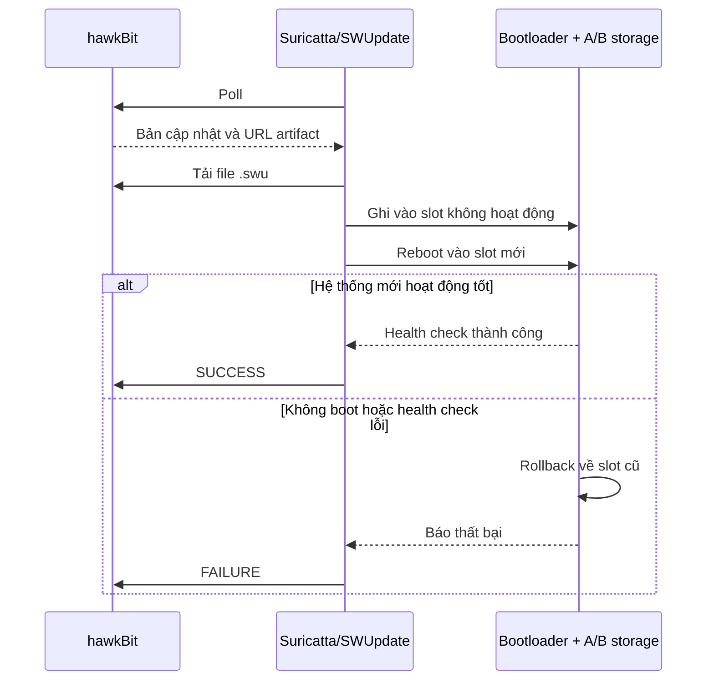
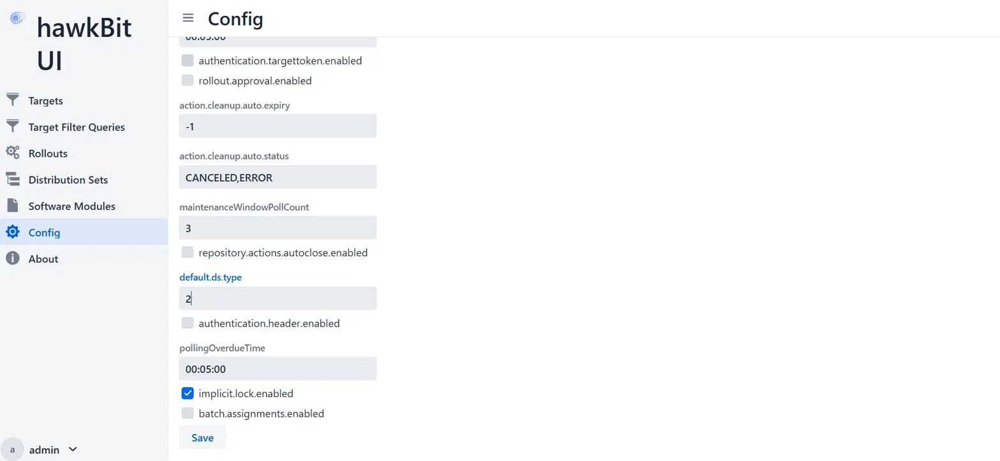

## 1. Tổng quan cơ chế A/B Update

**Vấn đề**
 
Khi flash firmware mới đè lên firmware đang chạy, có hai rủi ro nghiêm trọng:
- **Mất điện giữa chừng** $\rightarrow$ board không boot được
- **Firmware mới bị lỗi** $\rightarrow$ không có cách quay lại bản cũ

**Giải pháp: A/B Update**

Tư tưởng của cơ chế là không bao giờ ghi đè lên slot đang chạy. Thay vào đó, luôn flash vào slot dự phòng (inactive). Nếu có sự cố, hệ thống tự động rollback về slot cũ.

```
Không có A/B:                        Có A/B:
──────────────────────────           ──────────────────────────────
Flash đè lên firmware cũ             Flash vào slot dự phòng
  │                                    │
  ├── Mất điện -> brick                ├── Mất điện -> slot cũ vẫn nguyên ✅
  └── Firmware lỗi -> không rollback   └── Firmware lỗi -> tự rollback ✅
```

**Ba thành phần tham gia**

Cơ chế này phụ thuộc chủ yếu vào 3 thành phần:

| Thành phần | Vai trò |
|---|---|
| **SWUpdate** | Nhận file `.swu`, flash vào slot inactive, set U-Boot env |
| **U-Boot** | Đọc biến môi trường, quyết định boot vào slot nào, thực hiện rollback |
| **U-Boot environment** | Lưu trạng thái A/B, đếm boot attempts |

**Các biến U-Boot environment**

| Biến | Giá trị | Ý nghĩa |
|---|---|---|
| `active_slot` | `A` hoặc `B` | Slot hiện tại đang chạy. SWUpdate đọc để biết slot inactive |
| `ustate` | `0` hoặc `1` | `1` = vừa flash xong, chờ confirm. `0` = hệ thống ổn định |
| `boot_attempts` | `0..n` | Số lần đã thử boot slot mới. Tăng mỗi lần boot khi `ustate=1` |
| `boot_limit` | `n` | Ngưỡng rollback. Khi `boot_attempts >= boot_limit` $\rightarrow$ rollback |

**Workflow toàn bộ**

Toàn bộ cơ chế được diễn giải như sau:


**Bảng trạng thái env qua các giai đoạn**

| Giai đoạn | `active_slot` | `ustate` | `boot_attempts` |
|---|---|---|---|
| Bình thường (slot A) | A | 0 | 0 |
| Sau khi flash xong | B | 1 | 0 |
| U-Boot boot lần 1 | B | 1 | 1 |
| U-Boot boot lần 2 | B | 1 | 2 |
| U-Boot boot lần 3 | B | 1 | 3 → rollback |
| Sau confirm thành công | B | 0 | 0 |
| Sau rollback | A | 0 | 0 |

## 2. Lý thuyết SWUpdate
 
### 2.1. SWUpdate là gì?
 
SWUpdate là một framework OTA mã nguồn mở được thiết kế đặc biệt cho embedded Linux. Nó đóng vai trò là "người thực thi" - nhận gói update, kiểm tra tính hợp lệ, và áp dụng update theo đúng chỉ dẫn.

Điều quan trọng cần hiểu ngay từ đầu: SWUpdate không tự quyết định phải làm gì. Mọi quyết định đều đến từ file `sw-description` bên trong gói update. SWUpdate chỉ đọc và thực thi chỉ dẫn đó.

### 2.2. Cơ chế hoạt động

SWUpdate engine hoạt động theo mô hình pipeline - dữ liệu đi qua được xử lý tuần tự:

```
File .swu đến BBB
      │
      ▼
[1] SWUpdate mở cpio archive
      │ đọc sw-description
      ▼
[2] Parse & Validate
      │ kiểm tra hardware-compatibility
      │ kiểm tra version
      │ nếu không hợp lệ -> abort ngay
      ▼
[3] Verify checksum
      │ tính sha256 từng artifact
      │ so sánh với giá trị trong sw-description
      │ không khớp -> abort
      │ (Nếu có signing thì verify chữ ký ở bước này)
      ▼
[4] Chạy pre-install script (nếu có)
      ▼
[5] Flash từng artifact theo chỉ dẫn
      │ gọi đúng handler cho từng loại
      ▼
[6] Chạy switch-slot script
      ▼
[7] Reboot
```
 
### 2.3. File .swu

File `.swu` thực chất là cpio archive, đây là một định dạng lưu trữ nhiều file vào một file duy nhất, tương tự zip nhưng đơn giản hơn và phù hợp với streaming:

```
update.swu  (cpio archive)
        │
        ├── sw-description      <- manifest (đặc biệt, luôn đọc trước)
        │
        ├── sw-description.sig  <- signature (optional)
        │
        └── các file còn lại    <- gọi chung là artifact
                │
                ├── images      (kernel, rootfs, firmware binary...)
                ├── files       (config file, text file thông thường...)
                └── scripts     (shell script, lua script...)
```

**Artifact là gì?**

Artifact nghĩa là bất kỳ file nào trong `.swu` trừ `sw-description`, tức là các thứ cần được xử lý và cài đặt lên thiết bị.

Từ này xuất phát từ quy trình build. các file như `zImage`, `.dtb`, `rootfs.ext4` là sản phẩm đầu ra (artifact) của quá trình build hệ thống. Yocto cũng dùng thuật ngữ này:

```
bitbake core-image-minimal
        │
        ▼
tmp/deploy/images/beaglebone/
    ├── zImage                    <- build artifact
    ├── am335x-boneblack.dtb      <- build artifact
    ├── core-image-minimal.ext4   <- build artifact
    └── MLO, u-boot.img...        <- build artifact
```

**Các lệnh cpio**

Ta có thể dùng lệnh sau để biết tất cả các file có trong `.swu` mà không phải giải nén:

```bash
cpio -t < your-image.swu
```

Ta cũng có thể chỉ cần xem file `sw-description` bên trong:

```bash
cpio -i --to-stdout sw-description < your-image.swu
```

Hoặc cũng có thể giải nén toàn bộ để kiểm tra:

```bash
mkdir swu-contents && cd swu-contents
cpio -idv < ../your-image.swu
```

Sau khi extract, ta sẽ thấy các file điển hình như `sw-description`, các image, script,...

### 2.4. File sw-description
 
`sw-description` là file manifest, nó mô tả toàn bộ ý định của gói update. Không có nó, `.swu` chỉ là một đống byte vô nghĩa.

File này dùng cú pháp **libconfig**, đây là một cú pháp dạng block có cấu trúc rõ ràng:

```
software = {
    version  = "1.0.1";                 <- version của gói
    name     = "bbb-gateway-ota";       <- tên gói
    hardware-compatibility = ["1.0"];   <- kiểm tra hw trước khi flash
 
    images: (          <- danh sách artifact cần flash
        { ... },
        { ... }
    );
 
    scripts: (         <- script chạy trước/sau khi flash
        { ... }
    );
}
```

Các khái niệm cần nắm trong sw-description:
- hardware-compatibility: danh sách phần cứng tương thích, SWUpdate sẽ từ chối nếu board không khớp.
- version: so sánh version, tránh cài lại bản cũ hơn hoặc bản đang chạy.
- images section: khai báo các image cần ghi như rootfs, kernel, dtb...Mỗi image được mô tả kèm `type` cho biết handler nào sẽ xử lý, `device` cho biết flash vào đâu, `path` cho biết đường dẫn đích và `sha256` dùng để verify image.
- files section: khai báo các file đơn lẻ cần copy vào hệ thống.
- scripts section: các script chạy trước hoặc sau khi cài.
- embedded-script: Lua script nhúng trực tiếp trong sw-description để xử lý logic phức tạp (ví dụ: chọn partition động).

### 2.5. Handler
 
SWUpdate đọc từng entry trong `sw-description` và gọi handler tương ứng để xử lý. Handler là các module bên trong SWUpdate, mỗi loại biết cách ghi một kiểu dữ liệu.

Các handler phổ biến:

| `type` | Cách hoạt động | Dùng khi nào |
|---|---|---|
| `rawfile` | Ghi file vào path trên filesystem | Ghi kernel/DTB vào FAT partition |
| `raw` | Ghi raw byte trực tiếp vào block device | Flash toàn bộ rootfs image |
| `shellscript` | Chạy shell script | switch-slot, pre-install |
| `lua` | Chạy Lua script | Logic phức tạp, xử lý điều kiện |
| `archive` | Giải nén tar archive vào filesystem | Update nhiều file cùng lúc |
| `ubivol` | Ghi vào UBI volume | NAND flash (không dùng trên BBB) |

SWUpdate không giải nén toàn bộ `.swu` ra disk rồi mới xử lý. Thay vào đó, nó đọc CPIO archive tuần tự, gặp file nào thì gọi handler tương ứng. Vì vậy thiết bị chỉ có vài MB RAM vẫn update được image hàng trăm MB.

```
.swu
    │
    ├── sw-description ──► parse, verify
    │
    ├── rootfs.ext4.gz ──► raw handler ──► decompress ──► write /dev/mmcblk0p3
    │
    ├── app-config.tar ──► archive handler ──► extract vào /mnt/data/
    │
    └── post_update.sh ──► shellscript handler ──► execute
```

### 2.6. Nơi lưu log của SWUpdate

`/var/lib/swupdate` là nơi SWUpdate lưu trạng thái runtime - những thông tin cần tồn tại giữa các lần chạy và qua các lần reboot.

```
/var/lib/swupdate/
├── .lock                <- ngăn chạy nhiều instance cùng lúc
├── sockinstall          <- Unix socket giao tiếp nội bộ
└── progress             <- Unix socket theo dõi tiến trình
```

Cần đảm bảo `/var/lib/swupdate` nằm trên partition không bị xóa khi OTA. Nếu rootfs bị flash lại (Layout 2), toàn bộ `/var/lib` sẽ mất - không ảnh hưởng đến hoạt động vì SWUpdate tự tạo lại khi khởi động, nhưng nếu ta muốn lưu log của SWUpdate qua các lần OTA để debug, nên redirect log ra `/data`:

```
# swupdate.cfg
logging :
{
    logfile  = "/data/log/swupdate.log";  <- nằm trên data partition
    max-size  = 5;
    max-files = 3;
};
```

**`.lock` - đảm bảo chỉ một instance chạy**

Kịch bản không có `.lock`:
- Terminal 1: swupdate đang flash kernel vào slot B
- Terminal 2: swupdate nhận thêm một gói update khác

Ta thấy rằng, hai process cùng ghi vào `/dev/mmcblk0p3`, điều này có thể gây corrupt storage -> board không boot được.

Do đó, khi SWUpdate khởi động, nó tạo và lock file `.lock`:

```bash
# SWUpdate thực hiện ngầm
flock /var/lib/swupdate/.lock

# Process thứ hai thử chạy
flock /var/lib/swupdate/.lock  ← bị block ngay lập tức
# báo lỗi: "Another instance of swupdate is running"
```

**`sockinstall` - Unix socket điều khiển**

Đây là kênh giao tiếp chính giữa các thành phần của SWUpdate:

```
                    /var/lib/swupdate/sockinstall
                              │
           ┌──────────────────┼──────────────────┐
           │                  │                  │
         Web UI          swupdate-client      hawkBit
       (gửi .swu)         (monitoring)        (remote)
           │                  │                  │
           └──────────────────┼──────────────────┘
                              │
                        SWUpdate daemon
                        (nhận lệnh, xử lý)
```

Thực tế khi ta dùng curl upload `.swu`:

```
curl -X POST http://<BBB_IP>:8080/upload -F "file=@update.swu"
      │
      │  SWUpdate nhận file
      ▼
/var/lib/swupdate/sockinstall
      │
      │  gửi file .swu qua socket
      ▼
SWUpdate daemon xử lý update
```

**`progress` - Unix socket theo dõi tiến trình**

Cho phép client bên ngoài theo dõi tiến trình update theo thời gian thực:

```bash
# SWUpdate cung cấp tool đọc progress socket
swupdate-progress -s /var/lib/swupdate/progress

# Output realtime:
# [=====     ] 50% - Flashing zImage...
# [========  ] 80% - Running switch-slot script...
# [==========] 100% - Done. Rebooting...
```

### 2.7. SWUpdate IPC socket

SWUpdate sử dụng UNIX Domain Socket làm cơ chế giao tiếp IPC. Đây không phải network socket (TCP/UDP) mà là socket nội bộ trên cùng một máy, giao tiếp qua file system, tốc độ rất nhanh và không cần network stack.

SWUpdate khi chạy tạo hai socket, mỗi cái phục vụ mục đích khác nhau:
- `/tmp/sockinstctrl` - control socket: Dùng để gửi lệnh điều khiển tới SWUpdate: bảo nó install file `.swu`, hủy update hoặc gửi file data.
- `/tmp/swupdateprog` - progress socket. Dùng để nhận thông tin progress: phần trăm, trạng thái, error message. Đây là socket read-only, chỉ để theo dõi.

Trong phần này ta sẽ tập trung vào progress socket. Bất kỳ chương trình nào cũng có thể kết nối vào socket này để nhận realtime message.

```
SWUpdate daemon
    │
    │ ghi progress vào socket
    ▼
UNIX domain socket /tmp/swupdateprog
    │
    ├──► progress client (CLI tool)
    ├──► custom application (C/Lua/Python)
    └──► web UI
```

SWUpdate đi kèm tool `swupdate-progress` để đọc progress từ socket, cái này chính là progress client có sẵn.

Mỗi message từ socket chứa struct `progress_msg`. Đây là struct C mà SWUpdate gửi qua socket mỗi khi có cập nhật tiến trình. Được định nghĩa trong header `include/progress_ipc.h` của source SWUpdate:

```c
/*
 * Định nghĩa trong SWUpdate source code
 * File: include/progress_ipc.h
 */

typedef enum {
    IDLE,           /* 0 - Không có update nào đang chạy */
    START,          /* 1 - Bắt đầu update */
    RUN,            /* 2 - Đang cài đặt */
    SUCCESS,        /* 3 - Cài đặt thành công */
    FAILURE,        /* 4 - Cài đặt thất bại */
    DOWNLOAD,       /* 5 - Đang download từ server */
    DONE,           /* 6 - Toàn bộ quy trình kết thúc */
    SUBPROCESS,     /* 7 - Đang chạy sub-process */
    PROGRESS,       /* 8 - Cập nhật % tiến trình */
} RECOVERY_STATUS;

typedef enum {
    SOURCE_UNKNOWN,
    SOURCE_WEBSERVER,     /* Upload qua web UI */
    SOURCE_SURICATTA,     /* Từ hawkBit server */
    SOURCE_DOWNLOADER,    /* Download từ URL */
    SOURCE_LOCAL,         /* Từ file local (USB, CLI) */
    SOURCE_CHUNKS_DOWNLOADER,
} sourcetype;

struct progress_msg {
    unsigned int magic;          /* 4 bytes - Magic number 0x14052001 */
    unsigned int status;         /* 4 bytes - RECOVERY_STATUS enum */
    unsigned int dwl_percent;    /* 4 bytes - % download (0-100) */
    unsigned int nsteps;         /* 4 bytes - Tổng số bước install */
    unsigned int cur_step;       /* 4 bytes - Bước hiện tại (1-based) */
    unsigned int cur_percent;    /* 4 bytes - % hoàn thành bước hiện tại */
    char         cur_image[256]; /* 256 bytes - Tên file đang xử lý */
    char         hnd_name[64];   /* 64 bytes - Tên handler đang dùng */
    sourcetype   source;         /* 4 bytes - Nguồn update */
    unsigned int infolen;        /* 4 bytes - Độ dài info string phía sau */
    /* Nếu infolen > 0, theo sau struct là info string dài infolen bytes */
};
```

Ý nghĩa từng trường:

| Trường | Ý nghĩa |
| --- | --- |
| `magic` | Dùng để xác nhận đây đúng là message từ SWUpdate.<br>Client nên kiểm tra magic trước khi xử lý. |
| `status` | Trạng thái hiện tại của quá trình update.<br>Đây là trường quan trọng nhất để biết update đang ở phase nào. |
| `dwl_percent` | Phần trăm download.<br>Chỉ có ý nghĩa khi `status == DOWNLOAD`.<br>Khi install từ local file, giá trị này không dùng. |
| `nsteps` | Tổng số step trong quá trình install.<br>Mỗi image/script trong `sw-description` là một step.<br>Ví dụ: Ví dụ: `sw-description` có 1 rootfs + 1 script -> nsteps = 2 |
| `cur_step` | Step đang thực hiện. Chạy từ 1 đến nsteps |
| `cur_percent` | Phần trăm hoàn thành của bước hiện tại.<br>Ví dụ: đang ghi rootfs 500MB, đã ghi 250MB → cur_percent = 50 |
| `cur_image` | Tên file đang được xử lý.<br>Ví dụ: `rootfs.ext4.gz`, `post_update.sh` |
| `hnd_name` | Tên handler đang xử lý file này.<br>Ví dụ: `raw`, `rawfile`, `shellscript` |
| `source` | Cho biết `.swu` đến từ đâu (web UI, hawkBit, local...) |
| `infolen` | Nếu > 0, theo sau struct sẽ có thêm một chuỗi info dài `infolen` byte.<br>Thường chứa thông tin bổ sung như error message. |

Vòng đời trạng thái `status` của message sẽ chia thành các phase như sau:

Luồng 1: Update local

```
IDLE → START → RUN → SUCCESS → DONE
                 │
                 └──► FAILURE → DONE
```

Luồng 2: OTA update

```
IDLE ──► START ──► DOWNLOAD ──► RUN ──► SUCCESS ──► DONE
                                 │
                                 └────► FAILURE ──► DONE
```

Mỗi phase ta nên đọc trường nào:

```
IDLE       -> không cần đọc gì
START      -> đọc nsteps                            -> biết tổng bao nhiêu step
DOWNLOAD   -> đọc dwl_percent                       -> download được bao nhiêu %
RUN        -> đọc cur_step, cur_percent, cur_image  -> đang ghi file gì, bao nhiêu %
SUCCESS    -> không cần đọc gì
FAILURE    -> đọc infolen để lấy error message      -> lỗi gì
DONE       -> không cần đọc gì
```

Giả sử ta có board tên imx6-myboard, đang chạy firmware v1.0.0, muốn update lên v2.0.0. File `.swu` chứa:

```
my-update-v2.0.0.swu
│
├── sw-description        (1 KB)    - mô tả bản update
├── sw-description.sig    (256 B)   - chữ ký RSA
├── rootfs.ext4.gz        (150 MB)  - rootfs mới, đã nén
├── zImage                (5 MB)    - kernel mới
└── update_config.sh      (2 KB)    - script cập nhật config
```

Thì chuỗi message sẽ như sau:

```
Msg 1:  IDLE                                            -> Đang chờ, chưa có update

Msg 2:  START                                           -> server báo có bản mới v2.0.0
                                                           Parse sw-description OK
                                                           Signature OK, HW compatible OK

Msg 3:  DOWNLOAD, dwl_percent=0%                        -> Bắt đầu tải .swu (155MB)
Msg 4:  DOWNLOAD, dwl_percent=15%                       -> Đã tải 23MB / 155MB
Msg 5:  DOWNLOAD, dwl_percent=42%                       -> Đã tải 65MB / 155MB
Msg 6:  DOWNLOAD, dwl_percent=78%                       -> Đã tải 121MB / 155MB
Msg 7:  DOWNLOAD, dwl_percent=100%                      -> Tải xong, bắt đầu cài

Msg 8:  RUN, step 1/3,   0%, "rootfs.ext4.gz" (raw)     -> Bắt đầu ghi rootfs vào /dev/mmcblk0p3
Msg 9:  RUN, step 1/3,  25%, "rootfs.ext4.gz" (raw)     -> Đã ghi 37MB / 150MB
Msg 10: RUN, step 1/3,  50%, "rootfs.ext4.gz" (raw)     -> Đã ghi 75MB / 150MB
Msg 11: RUN, step 1/3,  75%, "rootfs.ext4.gz" (raw)     -> Đã ghi 112MB / 150MB
Msg 12: RUN, step 1/3, 100%, "rootfs.ext4.gz" (raw)     -> Ghi rootfs xong!

Msg 13: RUN, step 2/3,   0%, "zImage" (rawfile)         -> Bắt đầu copy kernel vào /boot/zImage
Msg 14: RUN, step 2/3, 100%, "zImage" (rawfile)         -> Copy kernel xong (5MB, nhanh)

Msg 15: RUN, step 3/3,   0%, "update_config.sh" (shell) -> Bắt đầu chạy script cập nhật config
Msg 16: RUN, step 3/3, 100%, "update_config.sh" (shell) -> Script chạy xong, exit code 0

Msg 17: SUCCESS                                         -> Tất cả 3 bước OK, đã cập nhật U-Boot env
                                                           boot_partition=B, upgrade_available=1

Msg 18: DONE                                            -> Kết thúc. Chờ reboot để kích hoạt v2.0.0
                                                           Suricatta báo hawkBit: SUCCESS
```

Từ đây, ta có thể tự viết một custom application như sau:

```c
#include <stdio.h>
#include <stdlib.h>
#include <stdbool.h>
#include <unistd.h>
#include <progress_ipc.h>

int main(int argc, char *argv[])
{
    /*
     * true = chờ cho đến khi SWUpdate daemon sẵn sàng
     * Nếu daemon chưa chạy, hàm này sẽ block ở đây
     */
    int fd = progress_ipc_connect(true);
    if (fd < 0) {
        fprintf(stderr, "Không thể kết nối tới SWUpdate\n");
        return EXIT_FAILURE;
    }

    printf("Đã kết nối. Đang chờ update...\n\n");

    // Nhận từng message
    struct progress_msg msg;
    while (1) {
        int ret = progress_ipc_receive(&fd, &msg);

        /*
         * Nếu receive thất bại (daemon bị kill, socket đóng),
         * thử kết nối lại
         */
        if (ret != sizeof(msg)) {
            printf("\nMất kết nối, đang thử lại...\n");
            close(fd);
            sleep(1);
            fd = progress_ipc_connect(true);
            continue;
        }

        switch (msg.status) {
            case IDLE:
                /* Do something */ 
                break;
            
            case START:
                /* Do something */ 
                break;

            case RUN:
                /* Do something */ 
                break;
            
            case SUCCESS:
                /* Do something */ 
                break;
            
            case FAILURE:
                /* Do something */ 
                break;
            
            case DONE:
                /* Do something */ 
                break;
            
            default:
                break;
        }
    }
}
```

## 3. Các bước xây dựng OTA layer với SWUpdate cho BBB

Tổng quan cấu trúc của layer như sau:

```bash
meta-bbb-ota/
├── conf/
│   └── layer.conf
├── recipes-bsp/
│   ├── libubootenv/
│   │   ├── libubootenv_%.bbappend
│   │   └── files/
│   │       └── fw_env.config
│   └── u-boot/
│       ├── u-boot_%.bbappend          <- thêm boot script A/B
│       └── files/
│           ├── boot.cmd
│           └── uEnv.txt
├── recipes-core/
│   ├── images/
│   │   └── bbb-base-image.bb          <- image recipe chính
│   └── systemd/
│       ├── ota-confirm-boot.bb        <- confirm boot service
│       └── files
│           ├── ota-confirm-boot.sh
│           └── ota-confirm-boot.service
├── recipes-extended/
│   └── images/
│       ├── update-image.bb            <- recipe tạo file .swu
│       └── beaglebone/
│           ├── sw-description
│           └── switch-slot.sh
├── recipes-support/
│   └── swupdate/
│       ├── swupdate_%.bbappend        <- override config SWUpdate
│       └── files/
│           ├── 09-swupdate-args
│           ├── defconfig
│           └── swupdate.cfg
└── wic/                               <- phân vùng partition
    └── bbb-ota.wks 
```

### 3.1. Thêm meta-swupdate vào workspace

Trước tiên, clone các layer cần thiết vào Yocto workspace:

```bash
git clone https://github.com/sbabic/meta-swupdate.git --branch kirkstone
```

Thêm layer vào `bblayer.conf`

```bash
BBLAYERS ?= " \
  /path/to/yocto-workspace/poky/meta \
  /path/to/yocto-workspace/poky/meta-poky \
  /path/to/yocto-workspace/poky/meta-yocto-bsp \
  /path/to/yocto-workspace/meta-openembedded/meta-oe \
  /path/to/yocto-workspace/meta-openembedded/meta-python \
  /path/to/yocto-workspace/meta-openembedded/meta-networking \
  /path/to/yocto-workspace/meta-swupdate \
"
```

Kiểm tra layer đã nhận chưa:

```bash
source poky/oe-init-build-env build/
bitbake-layers show-layers
```

:::warning Lưu ý
`meta-swupdate` phụ thuộc `meta-oe` và `meta-python` - nếu ta đã có sẵn hai layer này thì không cần làm gì thêm.
:::

### 3.2. Cấu hình SWUpdate

Ba file cấu hình cho SWUpdate tương ứng với ba tầng khác nhau, mỗi tầng kiểm soát một khía cạnh riêng:
 
```
defconfig        <- compile-time: những tính năng nào được build vào binary
swupdate.cfg     <- runtime: daemon hoạt động như thế nào
09-swupdate-args <- startup: tham số nào truyền vào khi khởi động
```

**Viết file `defconfig`**

Source SWUpdate dùng Kconfig giống với hệ thống cấu hình của Linux kernel để quản lý các tính năng được bật/tắt lúc compile. File `defconfig` chính là file output của quá trình cấu hình đó.

Ta không cần thiết phải viết file này, mà có thể generate file thông qua các bước sau:

1. Vào môi trường build SWUpdate:

    ```
    bitbake -c menuconfig swupdate
    ```

    Lúc này, màn hình Kconfig sẽ hiện ra, tương tự với cấu hình cho linux kernel.

2. Chọn các feature cần thiết và save.

3. Sau khi save nó sẽ generate cho ta một file cấu hình, ta có thể vào thư mục sau để lấy

   ```bash
   cd tmp/work/cortexa8hf-neon-poky-linux-gnueabi/swupdate/*/
   ```

4. Copy vào layer

   ```bash
   cp defconfig /path/to/meta-bbb-ota/recipes-support/swupdate/files/defconfig
   ```

Ví dụ một file `defconfig` sẽ có dạng như sau:

```conf

#
# SWUpdate build configuration for BBB SmartFarm.
# Automatically generated file; DO NOT EDIT.
#

#
# Swupdate Configuration
#
CONFIG_HAVE_DOT_CONFIG=y

#
# General Configuration
#
CONFIG_CURL=y
# CONFIG_CURL_SSL is not set
CONFIG_SYSTEMD=y
CONFIG_SCRIPTS=y
CONFIG_HW_COMPATIBILITY=y
CONFIG_HW_COMPATIBILITY_FILE="/etc/hwrevision"
CONFIG_SW_VERSIONS_FILE="/etc/sw-versions"

#
# Debugging Options
#
CONFIG_UBOOT=y                 # bật đọc/ghi U-Boot environment
CONFIG_UBOOT_FWENV="/etc/fw_env.config"
CONFIG_UBOOT_NEWAPI=y
CONFIG_UBOOT_DEFAULTENV="/etc/u-boot-initial-env"
CONFIG_SSL_IMPL_OPENSSL=y
CONFIG_DOWNLOAD=y              # bật chế độ pull từ HTTP server
CONFIG_CHANNEL_CURL=y
CONFIG_HASH_VERIFY=y
#
# Server
#
CONFIG_WEBSERVER=y             # bật built-in web server (mongoose)
CONFIG_MONGOOSE=y
CONFIG_MONGOOSESSL=y
CONFIG_GUNZIP=y
```

**Viết file `swupdate.cfg`**

Nếu `defconfig` quyết định SWUpdate có thể làm gì (compile-time), thì `swupdate.cfg` quyết định SWUpdate sẽ làm gì (runtime). File này dùng cú pháp libconfig, được đọc khi SWUpdate daemon khởi động:

```
# recipes-support/swupdate/files/swupdate.cfg

globals :
{
    verbose    = true;      /* In log chi tiết ra stdout */ 
    loglevel   = 5;         /* Mức độ log: 0=disable, 3=warning, 5=debug, 6=trace */
    syslog     = false;     /* Gửi log vào syslog thay vì stdout */ 
    no-reboot  = false;     /* tự reboot sau khi update xong */
    postupdate = "/usr/bin/mypost.sh";  /* Script chạy sau khi update thành công, trước khi reboot */ 
};

webserver :
{
    document_root = "/var/www/swupdate";
    port          = 8080;   /* Port lắng nghe HTTP */
    bind          = "0.0.0.0";
};

download :
{
    retries        = 3;     /* Số lần thử lại nếu download thất bại */ 
    timeout        = 1800;  /* Timeout toàn bộ quá trình download (tính bằng giây) */ 
    low-speed-time = 300;   /* Abort nếu tốc độ < threshold trong khoảng thời gian này (tính bằng giây) */
    low-speed-limit  = 1024;/* Ngưỡng tốc độ thấp, mặc định 1024 bytes/s */
};

update :
{
    recovery-no-downgrade = true;  /* true = từ chối nếu version mới < version hiện tại */
    recovery-no-samebool = true;   /* true = từ chối nếu version mới = version hiện tại */
    max-sersion = "99.99.99";      /* Chặn các bản update có version cao hơn giá trị này */ 
};
```

**Viết file `09-swupdate-args`**

Khi SWUpdate daemon khởi động, nó cần nhận các tham số dòng lệnh. Thay vì hard-code vào init script, SWUpdate dùng convention: đọc tất cả file trong `/etc/swupdate/conf.d/` theo thứ tự số và ghép argument lại:

```
/etc/swupdate/conf.d/
├── 09-swupdate-args     ← argument cơ bản (từ meta-swupdate-boards)
├── 10-swupdate-args     ← override nếu bạn muốn thêm
└── 15-swupdate-args     ← override tiếp theo nếu cần
         │
         ▼
SWUpdate ghép tất cả lại thành một lệnh:
swupdate [args từ 09] [args từ 10] [args từ 15] ...
```

File `09-swupdate-args` là file argument chính:

```bash
rootfs=$(swupdate -g)		# lấy partition đang chạy

if [ "$rootfs" = '/dev/mmcblk0p2' ];then	# nếu đang chạy p2
	selection="-e stable,copy2"
else
	selection="-e stable,copy1"
fi

SWUPDATE_ARGS="-H bbb-gateway:1.0 ${selection} -f /etc/swupdate.cfg"
```

Tham số quan trọng nhất ở đây là `-H bbb-gateway:1.0` - khai báo hardware name và version. SWUpdate dùng giá trị này để đối chiếu với `hardware-compatibility` trong `sw-description`:

```
09-swupdate-args:          sw-description:
-H bbb-gateway:1.0   <->   hardware-compatibility = ["1.0"]
                     ↑↑↑
                phải khớp nhau
```

Tham số `-e` nhận hai giá trị: `<software_set>,<mode>`

```
-e stable,main
      ↑      ↑
      │      └── mode: "main" (bản chính)
      │                "secondary" (bản dự phòng)
      └── software set: "stable" (production)
                        "testing" (thử nghiệm)
                        tên bất kỳ ta định nghĩa
```

Tính năng này cho phép một file `.swu` phục vụ nhiều loại thiết bị hoặc nhiều trạng thái. Ví dụ trong `sw-description`:

```
software =
{
    version     = "1.0.1";

    @BOARD_NAME@ = {
        hardware-compatibility: ["1.0"];

        stable: {
            main: {
                images: ( 
                    {
                        filename           = "rootfs.ext4.gz";
                        device             = "/dev/mmcblk0p2";
                        type               = "raw";
                        compressed         = "zlib";
                    }
                );
                scripts: (
                    {
                        filename = "switch-slot.sh";
                        type     = "shellscript";
                    }
                );
            };

            secondary: {
                images: (
                    {
                        filename           = "rootfs.ext4.gz;
                        device             = "/dev/mmcblk0p3";
                        type               = "raw";
                        compressed         = "zlib";
                    }
                );
                scripts: (
                    {
                        filename = "switch-slot.sh";
                        type     = "shellscript";
                    }
                );
            };
        };
    };
}
```

**Viết file recipe**

```bash
# recipes-support/swupdate/swupdate_%.bbappend
FILESEXTRAPATHS:prepend := "${THISDIR}/files:"

SRC_URI:append = " \
    file://defconfig \
    file://swupdate.cfg.in \
    file://09-swupdate-args \
"

DEPENDS:append = " systemd"

do_install:append() {
    install -d ${D}${libdir}/swupdate/conf.d
    install -m 0644 ${WORKDIR}/09-swupdate-args ${D}${libdir}/swupdate/conf.d/09-swupdate-args
    
    install -d ${D}${sysconfdir}
    install -m 0644 ${WORKDIR}/swupdate.cfg ${D}${sysconfdir}/swupdate.cfg
}
```

:::warning Chú ý
`CONFIG_SYSTEMD=y` trong `defconfig` yêu cầu `sd-daemon.h` từ `libsystemd`. Trong Yocto, header này nằm trong package `systemd`, nhưng swupdate recipe từ `meta-swupdate` không tự động thêm dependency này khi `CONFIG_SYSTEMD=y`. Cần khai báo thủ công để Yocto đưa header vào sysroot lúc cross-compile.
:::

### 3.3. Cấu hình libubootenv

Khi SWUpdate flash kernel mới xong, ta cần U-Boot boot vào slot B. Để làm được điều này thì ta cần ghi vào biến môi trường của uboot để khi U-boot chạy, nó sẽ đọc biến môi trường này và thực hiện boot vào slot B.

Để làm được điều này thì kernel cần truy cập được vào block chứa biến môi trường của uboot, tuy nhiên block đó được lưu trực tiếp vào raw storage, nó chỉ là một vùng byte tại một địa chỉ cố định trên SD card và không phải file system như FAT hay EXT4 nên kernel không thể truy cập. Vậy thì giải pháp ở đây là gì?

Đó là sử dụng công cụ `fw_setenv`/`fw_printenv`, nhưng một vấn đề nữa nảy sinh là công cụ này cần biết địa chỉ cố định của biến môi trường để có thể đọc/ghi chính xấc. Đó chính là lý do mà file `fw_env.conf` tồn tại, nó chính là bản đồ chỉ đường cho các công cụ đó.

Ví dụ với trường hợp BBB boot từ SD Card, file cấu hình sẽ như sau:

```bash
# recipes-bsp/libubootenv/files/fw_env.config
#
# device        offset      env_size
/dev/mmcblk0    0x260000    0x20000
    │              │           │
    │              │           └── env_size: kích thước vùng env
    │              │               phải == CONFIG_ENV_SIZE trong U-Boot
    │              │
    │              └── offset: vị trí bắt đầu tính từ byte 0 của device
    │                  phải == CONFIG_ENV_OFFSET trong U-Boot
    │
    └── device: block device chứa U-Boot env
```

Ba giá trị này phải khớp với U-Boot config, nếu:
- Sai `offset` -> đọc vùng dữ liệu khác → CRC fail → dùng default env
- Sai `env_size` -> đọc thiếu/thừa bytes  -> CRC fail -> mất biến
- Sai `device`   -> ghi nhầm partition    -> có thể corrupt filesystem

Công cụ `fw_setenv`/`fw_printenv` sẽ đọc file `fw_env.conf` tại thư muc `/etc` nên ta cần viết một recipe để đưa file cấu hình của ta vào đúng thư mục đó. 

```bash
# recipes-bsp/libubootenv/libubootenv_%.bbappend
FILESEXTRAPATHS:prepend := "${THISDIR}/files:"

SRC_URI:append = " file://fw_env.config"

do_install:append() {
    install -d ${D}${sysconfdir}
    install -m 0644 ${WORKDIR}/fw_env.config ${D}${sysconfdir}/fw_env.config
}
```

Khi boot lần đầu, ta có thể gặp lỗi như sau:

```
Warning: Bad CRC, using default environment
```

Điều này, là do ta không cấu hình vùng raw offset trong file `wks` nên wic image sinh ra không có env, khi đọc thì toàn là 0xFF hoặc 0x00, dẫn đến uboot không tìm thấy env hợp lệ (sai CRC) và báo lỗi:

```bash
# Đọc 512 byte từ offset 0x260000 và xem nội dung
dd if=/dev/mmcblk0 bs=1 skip=$((0x260000)) count=512 | hexdump -C | head -20
```

Đây không phải lỗi nghiêm trọng, U-Boot sẽ vẫn boot được bằng default env được compiled-in. Nhưng nó có nghĩa là mọi biến env mà ta thêm vào sẽ không có.

Khi gặp lỗi nay, ta có hai cách xử lý:

**Cách 1: chấp nhận default env lần đầu**

Lần boot đầu tiên sẽ dùng default env, khi boot script được load thì nó sẽ thực hiện `saveenv`. Lúc này, U-Boot sẽ ghi env hợp lệ vào `0x260000`, và từ lần sau sẽ không còn lỗi CRC nữa.

Nếu chọn cách này, cần đảm bảo default env có đầy đủ logic A/B boot và load script.

**Cách 2: Bổ sung env vào wic image**

Tạo một env binary và ghi đúng vào offset trong image. Ta có thể làm điều này bằng cách thêm vào `.wks`:

```
# Ghi pre-built env vào offset 0x260000 = 2432 KB
part --source rawcopy --sourceparams="file=u-boot-env.raw" --ondisk mmcblk0 --no-table --align 1792
```

Để tạo file `u-boot-env.raw`, dùng tool `mkenvimage` (có sẵn trong U-Boot source):

```bash
mkenvimage -s 0x20000 -o u-boot-env.raw u-boot-initial-env
```

Sau đó deploy file `u-boot-env.raw` vào `DEPLOY_DIR_IMAGE` để wic tìm thấy.

Một điểm lưu ý về cơ chế hoạt động `fw_setenv`/`fw_getenv`. Khi chay, chúng sẽ thực hiện các bước theo thứ tự sau:
1. Đọc `/etc/fw_env.config` để biết device, offset, size
2. Đọc raw env từ offset trên disk
3. Kiểm tra CRC

Nếu CRC hợp lệ -> sửa hoặc đọc biến. Ngược lại, nếu CRC fail -> tìm file `/etc/u-boot-initial-env` để làm default -> nếu file này mà không có thì sẽ fail hoàn toàn.

Đây chính là nguyên nhân của hiện tượng khi mà raw offset rỗng và ta thực hiện `fw_setenv` thì bị fail như bên dưới, đó là do nó fail CRC và không tìm thấy file `etc/u-boot-initial-env`.

```bash
root@beaglebone-yocto-smartfarm:~# fw_printenv ustate
Cannot read environment, using default
Cannot read default environment from file
```

Đối với trường hợp raw offset rỗng này thì ta có workaround là sử dụng `saveenv` trong uboot -> ghi env hiện tại trong RAM và kèm với CRC. Cách này khả thi do uboot có default env được compile sẵn trong binary. Khi boot, nó đọc raw env từ offset trên MMC. Nếu CRC hợp lệ thì dùng env từ disk, nếu CRC fail thì fallback về default env compiled-in - không bao giờ fail hoàn toàn.

### 3.4. Viết recipe tạo file boot script

Trong phần này, ta cần viết file `boot.cmd`, đâu là file chứa các lệnh UBoot. Sau đó, file nãy sẽ được compile sang dạng binary là `boot.scr` để UBoot tự động load và thực thi khi khởi động.

```
   Ta viết        Tool compile          U-Boot đọc
┌──────────┐      ┌──────────┐         ┌──────────┐
│ boot.cmd │ ───► │ mkimage  │ ──────► │ boot.scr │
│  (text)  │      └──────────┘         │ (binary) │
└──────────┘                           └──────────┘
     ↑                                      │
     │                                      │
 Ta chỉnh sửa                               ▼
 logic ở đây                         U-Boot thực thi
                                     từng lệnh
```

Nếu không có `boot.scr`, U-Boot sẽ chạy `bootcmd` mặc định được hard-code lúc compile - thường không phù hợp với boot logic mà ta mong muốn.

Dưới đây là nội dung của file `boot.cmd`:

```bash
# recipes-bsp/u-boot/files/boot.cmd

setenv mmc_dev 0
setenv need_save 0

# ── Giá trị mặc định nếu env chưa có ────────────────────
if test -z "${boot_limit}";  then setenv boot_limit 3;  setenv need_save 1; fi
if test -z "${active_slot}"; then setenv active_slot A; setenv need_save 1; fi
if test -z "${boot_count}";  then setenv boot_count 0;  setenv need_save 1; fi
if test -z "${ustate}";      then setenv ustate 0;      setenv need_save 1; fi

# ── In trạng thái hiện tại để debug ─────────────────────
echo "======= SmartFarm boot ======="
echo "boot_count    : ${boot_count}"
echo "boot_limit    : ${boot_limit}"
echo "active_slot   : ${active_slot}"
echo "ustate        : ${ustate}"
echo "=============================="

# ── Xử lý rollback nếu đang trong trạng thái upgrade ─────────────
# ustate = 1 nghĩa là SWUpdate vừa flash xong, chờ xác nhận
# ustate = 0 nghĩa là hệ thống đang stable, không cần đếm
if test "${ustate}" = "1"; then
    if test "${boot_count}" -ge "${boot_limit}"; then
        # Đã thử quá số lần cho phép -> rollback
        echo "!!! Boot failed ${boot_limit} times -> rolling back"

        if test "${active_slot}" = "A"; then
            setenv active_slot B
        else
            setenv active_slot A
        fi

        setenv ustate       0
        setenv boot_count   0
        setenv need_save 1
    else
        # Tăng bộ đếm, chưa rollback
        setexpr boot_count ${boot_count} + 1
        setenv need_save 1
        echo ">>> Upgrade boot attempt ${boot_count}/${boot_limit}"
    fi
fi

# ── Chỉ lưu env khi thật sự có thay đổi ─────────────────
if test "${need_save}" = "1"; then
    saveenv
fi

# ── Chọn partition theo active_slot ──────────────────────────
if test "${active_slot}" = "A"; then
    setenv mmc_part    2
else
    setenv mmc_part    3 
fi

# Thêm panic=10 để tự động reboot khi gặp panic
setenv bootargs " root=/dev/mmcblk${mmc_dev}p${mmc_part} rw rootwait console=ttyO0,115200n8 panic=10"

# ── Load kernel và DTB từ slot đang active ────────────────────────────────────────────────────
echo ">>> Loading kernel from slot ${active_slot}"

if load mmc ${mmcdev}:${bootpart} ${kernel_addr_r} ${kernel_image}; then
    if load mmc ${mmcdev}:${bootpart} ${fdt_addr_r} ${fdtfile}; then
        bootz ${kernel_addr_r} - ${fdt_addr_r}
    else
        echo "!!! Failed to load DTB: ${fdtfile}"
    fi
else
    echo "!!! Failed to load kernel: ${kernel_image}"
fi

echo "!!! Boot failed"
```

Sau đó, ta cần viết một recipe để build file này thành dạng `boot.scr`:

```bash
# recipes-bsp/u-boot/u-boot_%.bbappend
FILESEXTRAPATHS:prepend := "${THISDIR}/files:"

SRC_URI:append = " file://boot.cmd"

DEPENDS:append = " u-boot-tools-native"

do_compile:append() {
    ${UBOOT_MKIMAGE} -C none -A arm -T script -d ${WORKDIR}/boot.cmd ${WORKDIR}/boot.scr
}

do_deploy:append() {
    install -m 0644 ${WORKDIR}/boot.scr ${DEPLOYDIR}/
}
```

Tuy nhiên, có một lưu ý như sau là default thì boot script sẽ không được chạy ngay lập tức mà thay vào là một chuỗi `bootcmd` và `extlinux` là nơi được thực hiện đầu tiên -> Để boot script có thể chạy trước thì ta cần thêm một bản vá và chỉnh sửa `CONFIG_EXTRA_ENV_SETTINGS` trong file `u-boot/include/configs/am335x_evm.h` như sau:

```
#define CONFIG_EXTRA_ENV_SETTINGS \
    ...
    ...
    ...
    "loadbootscript=" \
        "load mmc ${mmcdev}:${mmcpart} ${loadaddr} boot.scr\0" \
    "bootscript=source ${loadaddr}\0" \
    "envboot=" \
        "mmc dev ${mmcdev}; " \
        "if mmc rescan; then " \
            "if run loadbootscript; then " \
                "echo Found boot.scr; " \
                "run bootscript; " \
            "else " \
                "echo No boot.scr found; " \
            "fi; " \
        "fi;\0" \
	NANDARGS \
	NETARGS \
	DFUARGS \
	BOOTENV
#endif
```

Và thêm những thông tin sau trong file `defconfig`:

```conf
# Lưu ENV vào MMC
CONFIG_ENV_IS_IN_MMC=y

# Device MMC nào
CONFIG_SYS_MMC_ENV_DEV=0

# Partition nào (0 = raw, không phải partition)
CONFIG_SYS_MMC_ENV_PART=0

# Offset tính từ đầu MMC (bytes)
CONFIG_ENV_OFFSET=0x260000

# Kích thước vùng ENV
CONFIG_ENV_SIZE=0x20000

CONFIG_BOOTCOMMAND="run findfdt; run init_console; run finduuid; run envboot; run distro_bootcmd"
```

### 3.5. Viết recipe tạo file .swu

Đây là bước cốt lõi - đóng gói kernel + DTB thành file `.swu` để gửi đến thiết bị.
 
**Đầu tiên, ta cần viết file `sw-description`:**

```conf
# recipes-extended/images/beaglebone/sw-description

software =
{
    version = "1.0.1";
    name    = "bbb-ota-kernel";

    hardware-compatibility = ["1.0"];

    /* ---- Slot A: ghi vào đây nếu đang active là B ---- */
    images: (
        /* --- Rootfs slot B --- */
        {
            filename           = "rootfs.ext4.gz";
            type               = "raw";
            device             = "/dev/mmcblk0p3";
            compressed         = true;
            installed-directly = true;
            sha256             = "@rootfs.ext4.gz";
        },

        /* --- Kernel slot B --- */
        {
            filename = "zImage";
            type     = "rawfile";
            device   = "/dev/mmcblk0p1";
            path     = "/boot/zImageA";
            sha256   = "@zImage";
        },

        /* --- DTB slot B --- */
        {
            filename = "am335x-boneblack.dtb";
            type     = "rawfile";
            device   = "/dev/mmcblk0p1";
            path     = "/boot/am335x-boneblack-A.dtb";
            sha256   = "@am335x-boneblack.dtb";
        }
    );

    /* ---- Script chạy sau khi flash xong ---- */
    scripts: (
        {
            filename = "switch-slot.sh";
            type     = "shellscript";
        }
    );
}
```

Ta nhận thấy một vấn đề của ví dụ trên:

```
images: (
    {
        filename = "rootfs.ext4.gz";
        type     = "raw";
        device   = "/dev/mmcblk0p3";  ← LUÔN ghi vào p3 (slot B)
    }
);
```

Vấn đề xảy ra ở đây:

```
Lần update 1:
  Thiết bị đang chạy slot A (p2)
  → SWUpdate ghi vào p3 (slot B)  ✅ đúng

Lần update 2:
  Thiết bị đang chạy slot B (p3)
  → SWUpdate vẫn ghi vào p3 (slot B)  ❌ ghi đè lên chính nó!
  → Hệ thống đang chạy bị corrupt ngay lập tức
```

Giải pháp là dùng `sw-description` động với `09-swupdate-args` để detect slot tại runtime.

**Viết file `switch-slot.sh`** để detect slot inactive, rename file nếu cần, set U-Boot env:

```bash
# recipes-extended/images/beaglebone/switch-slot.sh

#!/bin/sh
set -eu

FW_SETENV="/usr/bin/fw_setenv"
FW_PRINTENV="/usr/bin/fw_printenv"

case "${1:-}" in
    preinst)
        echo "Pre-install: nothing to do"
        exit 0
        ;;
    postinst)
        # Đọc slot hiện tại
        CURRENT_SLOT=$("${FW_PRINTENV}" -n active_slot 2>/dev/null || echo "A")

        # Xác định slot inactive
        if [ "${CURRENT_SLOT}" = "A" ]; then
            NEW_SLOT="B"
        else
            NEW_SLOT="A"
        fi

        echo "Current slot: ${CURRENT_SLOT}, switching to: ${NEW_SLOT}"

        # Set U-Boot env để boot vào slot mới
        "${FW_SETENV}" active_slot  "${NEW_SLOT}"
        "${FW_SETENV}" ustate       "1"
        "${FW_SETENV}" boot_count   "0"
        ;;
    *)
        echo "Unknown argument: ${1:-}"
        exit 1
        ;;
esac

exit 0
```

**Cuối cùng, ta cần viết file bitbake để tạo file `.swu`:**

```bash
# recipes-extended/images/update-image.bb
DESCRIPTION = "SWUpdate package cho BBB gateway"
LICENSE     = "MIT"
LIC_FILES_CHKSUM = "file://${COMMON_LICENSE_DIR}/MIT;md5=0835ade698e0bcf8506ecda2f7b4f302"

# Kế thừa class swupdate - cung cấp do_swuimage task
inherit swupdate

# Phụ thuộc kernel phải build xong trước
do_swuimage[depends] += " \
    virtual/kernel:do_deploy \
    core-image-minimal:do_image_complete \
"

# File sw-description và script
SRC_URI = " file://sw-description file://switch-slot.sh "

# Các image cần đóng gói vào .swu
SWUPDATE_IMAGES = " zImage am335x-boneblack.dtb core-image-minimal"

# Định nghĩa fstype cho từng image
SWUPDATE_IMAGES_FSTYPES[core-image-minimal] = ".ext4.gz"
SWUPDATE_IMAGES_FSTYPES[zImage]             = ""
SWUPDATE_IMAGES_FSTYPES[am335x-boneblack.dtb] = ""
```

### 3.6. Confirm boot thành công

Sau khi boot vào slot mới thành công, systemd chạy service này để xác nhận boot - reset `ustate=0` để tránh U-Boot rollback nhầm.

:::warning Tại sao quan trọng
Nếu không confirm, `ustate` mãi bằng `1`. Sau 3 lần reboot bình thường, U-Boot sẽ rollback về slot cũ dù hệ thống đang hoạt động tốt.
:::

```bash
# recipes-core/systemd/files/ota-confirm-boot.sh
#!/bin/sh

set -eu

FW_SETENV="/usr/bin/fw_setenv"
FW_PRINTENV="/usr/bin/fw_printenv"

usate=$("${FW_PRINTENV}" -n ustate 2>/dev/null || echo "0")

if [ "${usate}" = "1" ]; then
    echo "OTA: Boot confirmed successfully, committing slot"
    "${FW_SETENV}" boot_count "0"
    "${FW_SETENV}" ustate     "0"
fi
```

```ini
# ota-confirm-boot.service
[Unit]
Description=OTA Boot Confirmation
After=network.target
Before=swupdate.service

[Service]
Type=oneshot
ExecStart=/usr/bin/ota-confirm-boot.sh
RemainAfterExit=yes

[Install]
WantedBy=multi-user.target
```

```bash
# ota-confirm-boot.bb

DESCRIPTION = "OTA boot confirmation service"
LICENSE     = "MIT"
LIC_FILES_CHKSUM = \
    "file://${COMMON_LICENSE_DIR}/MIT;md5=0835ade698e0bcf8506ecda2f7b4f302"

SRC_URI = " \
    file://ota-confirm-boot.sh       \
    file://ota-confirm-boot.service  \
"

FILESEXTRAPATHS:prepend := "${THISDIR}/files:"

inherit systemd

SYSTEMD_SERVICE:${PN} = "ota-confirm-boot.service"
SYSTEMD_AUTO_ENABLE   = "enable"

do_install() {
    install -d ${D}${bindir}
    install -m 0755 ${WORKDIR}/ota-confirm-boot.sh \
                    ${D}${bindir}/ota-confirm-boot.sh

    install -d ${D}${systemd_system_unitdir}
    install -m 0644 ${WORKDIR}/ota-confirm-boot.service \
                    ${D}${systemd_system_unitdir}/ota-confirm-boot.service
}
```

### 3.8. Thiết kế partition layout

Trước khi đi vào thiết kế cụ thể, cần hiểu 3 nguyên tắc cốt lõi:
1. Raw area: U-Boot, SPL, env không nằm trong partition nào mà nằm ở raw offset trước partition table
2. A/B area: mọi thứ cần update phải có 2 bản sao, để khi update sẽ không ghi đè lên bản đang chạy.
3. Persistent: dữ liệu không liên quan đến firmware phải tách riêng và không bị xoá khi OTA.

Tổng quan các vùng trên SD Card:

```
SD Card (>1GB)
│
├── Raw area
│     Offset 0x000000: MBR
│     Offset 0x000200: U-Boot SPL (MLO)
│     Offset 0x040000: U-Boot image
│     Offset 0x260000: U-Boot environment    <- fw_env.config trỏ vào đây
│
└── [Partition table - bắt đầu từ 0x400000 trở đi]
      p1: boot   (FAT32)   - kernel, DTB, boot script
      p2: rootfsA (ext4)   - rootfs slot A
      p3: rootfsB (ext4)   - rootfs slot B
      p4: data    (ext4)   - persistent data
```

Để định nghĩa các partition trong yocto, ta sử dụng file `.wks` - Wic Kickstart file. Yocto dùng tool `wic` để đọc file này và tạo ra disk image hoàn chỉnh có thể flash thằng vào SD card.

Ví dụ về file `.wks` cho layout update kernel + dtb + rootfs:

```bash
# wic/bbb-ota.wks
#
# -----------------------------------------------------------
# Vùng Raw (nằm ngoài partition table)
# Khai báo bằng bootloader-config, không phải lệnh part
# -----------------------------------------------------------
bootloader --ptable msdos

# --no-table nghĩa là không tạo entry trong partition table, chỉ ghi raw data vào offset.
part --source rawcopy --ondisk mmcblk0 --no-table --align 128  --sourceparams="file=MLO"       
part --source rawcopy --ondisk mmcblk0 --no-table --align 384  --sourceparams="file=u-boot.img"
part --source rawcopy --ondisk mmcblk0 --no-table --align 2432 --sourceparams="file=u-boot-env.raw"

# -----------------------------------------------------------
# p1 - boot partition (FAT32)
# Chứa: boot.scr
# U-Boot load boot.scr từ đây để thực thi A/B logic
# -----------------------------------------------------------
part /boot --source bootimg-partition --ondisk mmcblk0 --fstype=vfat --label boot   --active --align 4096 --size 64    --sourceparams="loader=u-boot"

# -----------------------------------------------------------
# p2 - rootfs slot A (ext4)
# Chứa: kernel + DTB + toàn bộ rootfs
# Là slot active mặc định khi xuất xưởng
# -----------------------------------------------------------
part /     --source rootfs            --ondisk mmcblk0 --fstype=ext4 --label root_a --align 4096 --fixed-size 1024 --use-uuid

# -----------------------------------------------------------
# p3 - rootfs slot B (ext4)
# Chứa: bản sao dự phòng, SWUpdate ghi vào đây khi OTA
# Ban đầu giống hệt slot A (bản sao lúc build)
# -----------------------------------------------------------
part       --source empty             --ondisk mmcblk0 --fstype=ext4 --label root_b --align 4096 --fixed-size 1024

# -----------------------------------------------------------
# p4 - data partition (ext4)
# Chứa: config, database, logs
# KHÔNG bao giờ bị xóa hay ghi đè khi OTA
# -----------------------------------------------------------
part /data --source empty             --ondisk mmcblk0 --fstype=ext4 --label data   --align 4096 --size 256

```

Trong đó:
- `--ptable msdos` : dùng MBR partition table thay vì GPT
- `part /boot` : tạo partition và mount tại `/boot` trong rootfs.
- `--source bootimg-partition` : yocto sẽ dùng plugin `bootimg-partition` của wic để tự động copy các file như `zImage`, `.dtb`, boot script,...từ deploy dir `DEPLOY_DIR_IMAGE` vào partition dựa vào biến `IMAGE_BOOT_FILES`.
- `--ondisk mmcblk0` : chỉ định disk đích
- `--fstype=vfat` hoặc `--fstype=ext4` : format FAT32 hoặc ext4
- `--label boot` : đặt tên volume label
- `--active` : đánh dấu bootable flag trong MBR
- `--align 4096` : căn chỉnh theo 4096KB
- `--fixed-size 32` : kích thước cố định 32MB
- `--use-uuid` : dùng UUID thay vì device path

:::warning Chú ý
Nếu không có `rawcopy` cho `MLO`/`u-boot.img`, thì wic sẽ chỉ tạo partition table và vùng raw trước partition đầu tiên sẽ chỉ toàn là zero.

Với `--ptable msdos`, nó chỉ hỗ trợ tối đa 4 phân vùng chính. Nếu vượt quá 4 phân vùng thì nên đổi sang GPT.
:::

:::tip Thông tin hữu ích
ROM bootloader của AM335x có khả năng tìm MLO ở hai nơi: raw offset `0x20000` hoặc trong FAT partition đầu tiên được đánh dấu active. Do đó, nêu ta không có `rawcopy` thì rom bootloader vẫn có thể tìm thấy MLO nằm trong FAT và boot được. Tương tự SPL sẽ tìm `u-boot.img` trong FAT.
:::

### 3.9. Image recipe chính

Image recipe kéo tất cả các thành phần đã viết ở trên lại thành một image hoàn chỉnh:

```bash
# recipes-core/images/bbb-base-image.bb
 
require recipes-core/images/core-image-minimal.bb
 
IMAGE_INSTALL:append = " \
    swupdate             \
    swupdate-www         \
    libubootenv          \
    ota-confirm-boot     \
"
 
# /etc/hwrevision - sw-description dùng để check hardware compatibility
# /etc/sw-version - SWUpdate dùng để so sánh version khi có rule no-downgrade
do_rootfs:append() {
    echo "bbb-gateway 1.0" > ${IMAGE_ROOTFS}${sysconfdir}/hwrevision
    echo "1.0.0"           > ${IMAGE_ROOTFS}${sysconfdir}/sw-version
}
 
WKS_FILE     = "bbb-ota.wks"
IMAGE_FSTYPES = "wic wic.bmap"

# Các file được copy vào FAT boot partition thông qua bootimg-partition source.
IMAGE_BOOT_FILES = " \
    MLO              \
    u-boot.img       \
    zImage           \
    am335x-boneblack.dtb \
    boot.scr         \
    uEnv.txt         \
"
```

`IMAGE_FSTYPES` là biến Yocto quyết định Yocto sẽ tạo ra những định dạng file image nào sau khi build xong rootfs.

```
IMAGE_FSTYPES = "wic wic.bmap ext4 tar.gz"
#                 ↑     ↑      ↑     ↑
#                 │     │      │     └── tarball của rootfs
#                 │     │      └── raw ext4 filesystem image
#                 │     └── bitmap file đi kèm wic
#                 └── disk image hoàn chỉnh (có partition table)
```

Mỗi giá trị trong list tương ứng với một image creator plugin trong Yocto - plugin đó biết cách đóng gói rootfs thành đúng định dạng đó.

Với định dạng `.wic` ta có thể flash image như sau:

```bash
sudo bmaptool copy bbb-base-image-beaglebone.wic /dev/sdX
#                          ↑
#                  cần IMAGE_FSTYPES có "wic"
```

`wic.bmap` đi kèm với `wic` để flash nhanh hơn:

```bash
# bmaptool dùng .bmap để biết sector nào có data
# chỉ ghi sector đó, bỏ qua sector trống
# -> nhanh hơn dd từ 3-10 lần

#   bmaptool tự tìm .bmap cùng thư mục <- cần wic.bmap
sudo bmaptool copy bbb-base-image-beaglebone.wic /dev/sdX
```

## 4. Verìfy hệ thống

### 4.1. Giai đoạn 1: verify môi trường cơ bản

**Kiểm tra partition layout đúng chưa:**

```bash
lsblk
fdisk -l /dev/mmcblk0
```

**Kiểm tra boot partition mount**

```bash
ls /boot/
# Phải thấy zImage, dtb, boot.scr
```

### 4.2. Giai đoạn 2: Test libubootenv

```bash
# Kiểm tra fw_env.config trỏ đúng offset chưa
cat /etc/fw_env.config

# Đọc toàn bộ U-Boot env
fw_printenv

# Phải thấy các biến:
# active_slot=A
# ustate=0
# boot_attempts=0
# boot_limit=3
```

Nếu `fw_printenv` báo lỗi CRC hoặc không đọc được -> `fw_env.config` sai offset, phải fix trước khi làm gì tiếp.

Tiếp theo, cần test ghi env:

```bash
fw_setenv ustate 1
fw_printenv ustate   # verify ghi được
fw_setenv ustate 0   # reset lại
```

### 4.3. Giai đoạn 3: Upload file swu

Trước khi thực hiện test, ta cần xem service SWUpdate đã active hay chưa:

```bash
systemctl status swupdate
```

Truy cập `http://<IP_BBB>:8080/` qua browser: kéo thả file `.swu` vào giao diện web.

Hoặc qua `curl`:

```bash
curl -X POST http://<BBB_IP>:8080/upload \
     -F "file=@update-image-beaglebone.swu" \
     --progress-bar
```

Trong quá trình update, ta có thể theo dõi log:

```bash
tail -f /var/log/swupdate.log
```

Khi upload xong, cần kiểm tra các biến env:

```bash
fw_printenv active_slot   # phải đổi sang B
fw_printenv ustate        # phải là 1
fw_printenv boot_count    # phải là 0
```

Nếu các biến env đã chính xác thì ta thực hiện `reboot`.

Sau khi boot lại:

```bash
lsblk -o NAME,LABEL,FSTYPE,MOUNTPOINT   # rootB phải được mount tại /
fw_printenv ustate                      # nếu confirm service chạy đúng -> phải là 0
```

Nếu `ota-confirm-boot` service hoạt động đúng -> sau boot thành công nó sẽ set `ustate=0`.

Nếu không có confirm service chạy -> `boot_count` sẽ tăng mỗi lần boot cho đến khi đạt `boot_limit=3` thì U-Boot rollback về slot A.

### 4.4. Giai đoạn 4: test rollback

Giả lập boot fail để trigger rollback, các bước như sau:

**Bước 1: Corrupt rootB có chủ ý**


```bash
# Ghi dữ liệu rác vào đầu partition rootB
dd if=/dev/urandom of=/dev/mmcblk0p3 bs=1M count=10
```

**Bước 2: Set env để boot sang rootB**

```bash
fw_setenv active_slot B
fw_setenv ustate 1
fw_setenv boot_count 3
reboot
```

**Bước 3: Reboot và quan sát U-Boot console**

Kết nối serial console (115200 baud) để xem uboot log, ta sẽ thấy:

```
>>> Upgrade boot attempt 1/3
...
>>> Upgrade boot attempt 2/3
...
>>> Upgrade boot attempt 3/3
!!! Boot failed 3 times -> rolling back
```

**Bước 4: Verify rollback**

Sau khi boot lại, verify U-Boot đã rollback về slot A:

```bash
fw_printenv active_slot   # phải là A
fw_printenv ustate        # phải là 0
fw_printenv boot_count    # phải là 0

# Đang mount rootA chưa?
lsblk -o NAME,LABEL,FSTYPE,MOUNTPOINT
```

## 5. OTA management server

Ta đã biết, khi muốn update thì ta cần mở web UI của SWUpdate trên chính BBB rồi upload file `.swu` lên. Tuy nhiên, cách này cần phải biết IP từng board và thao tác thủ công trên từng thiết bị. Do đó, ở phần này, ta sẽ đi tìm hiểu một cách khác để thực hiện update hiểu qua hơn.

Thay vì ta chủ động mở web UI để update thì ta sẽ cho BBB định kỳ kiểm tra version trên server xem có version mới không, nếu có thì nó sẽ thực hiện tải file `.swu` trên server về rồi đưa cho SWUpdate xử lý.

Để làm được điều này thì ta cần:

**Phía server:**
- Cung cấp file `version.json` để device biết version mới nhất là gì
- Và file `.swu` để device tải về khi cần update

**Phía client:**
- Một systemd timer chạy mỗi 5 phút, trigger một shell script
- Shell script này sẽ thực hiện:
  + Đọc version hiện tại từ file `/etc/sw-version` trên device.
  + `curl` lấy `version.json` từ server và parse ra version mới nhất
  + So sánh hai version string: Nếu giống nhau thì dừng, không làm gì
  + Nếu server version mới hơn thì script có thể thực hiện gọi `swupdate` bằng một trong hai cách sau:
    + Cách 1: Đưa URL trực tiếp cho `swupdate`
    + Cách 2: Tải `.swu` về rồi mới gọi `swupdate` để install.
  + SWUpdate flash vào slot inactive, set U-Boot env để boot sang slot mới

## 6. Signature verification

### 6.1. Tổng quan

Signature verification là cơ chế bảo mật quan trọng của SWUpdate, đảm bảo rằng chỉ những bản update do ta tạo ra mới được cài đặt lên thiết bị.

**Tại sao cần signature verification?**

Không có signature, bất kỳ ai cũng có thể tạo file `.swu` rồi cài lên thiết bị qua USB, qua web UI hoặc thậm chí MITM khi OTA. Hậu quả có thể là cài malware, đánh cắp dữ liệu hoặc biến thiết bị thành botnet. Signing giải quyết hai vấn đề cốt lõi: authentication (bản update đúng là do bta tạo) và integrity (nội dung không bị sửa đổi trên đường truyền).

### 6.2. Cơ chế hoạt động

```
Build server                                    THIẾT BỊ
*************************************           ***************************

1. Tạo file .swu         

2. Tính hash của sw-description            

3. Ký hash bằng private key               
   → tạo ra file sw-description.sig       

4. Đóng gói tất cả vào .swu:              
   sw-description                         
   sw-description.sig                     
   rootfs.ext4.gz                         
   ...                                    

5. Gửi .swu tới thiết bị ---------------------> 6. SWUpdate nhận .swu

                                                7. Extract sw-description
                                                   và sw-description.sig

                                                8. Dùng public key đã có
                                                   sẵn trên thiết bị để
                                                   verify chữ ký

                                                9. Nếu pass -> tiếp tục cài đặt
                                                   Nếu fail -> từ chối, hủy update
```

:::warning Chú ý
Private key không bao giờ nằm trên thiết bị. Thiết bị chỉ có public key để verify. Kẻ tấn công dù có thiết bị trong tay cũng không thể tạo bản update giả.
:::

### 6.3. Các phương pháp signing

SWUpdate hỗ trợ hai phương pháp, mỗi cái có đặc điểm riêng.

**Phương pháp 1: RSA Raw Signature**

Cách đơn giản, ký trực tiếp bằng RSA key pair.

Tạo key pair:

```bash
# Tạo private key
openssl genrsa -aes256 -out swupdate-priv.pem 2048

# Trích xuất public key đưa vào thiết bị
openssl rsa -in swupdate-priv.pem -out swupdate-pub.pem -outform PEM -pubout
```

Ký bản update:

```bash
# Ký file sw-description
openssl dgst -sha256 -sign swupdate-priv.pem -out sw-description.sig sw-description
```

Cấu trúc file `.swu` khi có signature:

```
.swu (CPIO archive)
├── sw-description          <- file mô tả
├── sw-description.sig      <- chữ ký
├── rootfs.ext4.gz
├── post_update.sh
└── ...
```

Thứ tự rất quan trọng: `sw-description` phải là entry đầu tiên, `sw-description.sig` phải là entry thứ hai trong CPIO archive.

Cấu hình SWUpdate trong `swupdate.cfg`:

```
globals: {
    public-key-file = "/etc/swupdate-pub.pem";
};
```

Hoặc truyền qua command line:

```bash
swupdate -k /etc/swupdate-pub.pem
```

**Phương pháp 2: CMS (PKCS#7) Signature**

Phương pháp chuẩn công nghiệp, dùng certificate chain (X.509). Mạnh hơn RSA raw vì hỗ trợ certificate expiry, revocation và chain of trust.

Tạo certificate:

```bash
# 1. Tạo CA (Certificate Authority)
openssl req -x509 -newkey rsa:2048 -keyout ca-priv.pem \
    -out ca-cert.pem -days 3650 -nodes \
    -subj "/O=MyCompany/CN=MyCompany OTA CA"

# 2. Tạo signing key + CSR
openssl req -newkey rsa:2048 -keyout signing-priv.pem \
    -out signing.csr -nodes \
    -subj "/O=MyCompany/CN=MyCompany OTA Signing"

# 3. CA ký certificate cho signing key
openssl x509 -req -in signing.csr -CA ca-cert.pem \
    -CAkey ca-priv.pem -CAcreateserial \
    -out signing-cert.pem -days 365
```

Ký bản update bằng CMS:

```bash
openssl cms -sign -in sw-description \
    -out sw-description.sig -signer signing-cert.pem \
    -inkey signing-priv.pem -outform DER \
    -nosmimecap -binary
```

Cấu hình SWUpdate cho CMS:

```
globals: {
    ca-cert-file = "/etc/swupdate-ca-cert.pem";
};
```

### 6.4. Tích hợp vào Yocto Build

**Bật signing trong SWUpdate defconfig**

SWUpdate dùng hệ thống cấu hình giống kernel (Kconfig). Ta cần bật option tương ứng:

```bash
# Cho RSA raw signature
CONFIG_SIGNED_IMAGES=y
CONFIG_SIGALG_RAWRSA=y

# HOẶC cho CMS signature
CONFIG_SIGNED_IMAGES=y
CONFIG_SIGALG_CMS=y
```

**Đưa public key/CA cert vào image**

Tạo recipe hoặc bbappend để cài public key vào rootfs:

```bash
# swupdate_%.bbappend hoặc recipe riêng
FILESEXTRAPATHS:prepend := "${THISDIR}/files:"

SRC_URI += "file://swupdate-ca-cert.pem"

do_install:append() {
    install -d ${D}/etc
    install -m 0644 ${WORKDIR}/swupdate-ca-cert.pem ${D}/etc/
}
```

Script tạo `.swu` có signing

```bash
#!/bin/bash
# create-swu.sh

PRIVATE_KEY="path/to/signing-priv.pem"
SIGNER_CERT="path/to/signing-cert.pem"
FILES="sw-description rootfs.ext4.gz post_update.sh"

# 1. Ký sw-description
openssl cms -sign -in sw-description \
    -out sw-description.sig \
    -signer ${SIGNER_CERT} \
    -inkey ${PRIVATE_KEY} \
    -outform DER -nosmimecap -binary

# 2. Đóng gói
echo "sw-description sw-description.sig ${FILES}" \
    | tr ' ' '\n' \
    | cpio -o -H crc > my-update.swu
```

### 6.5. Luồng verify trên thiết bị

Khi SWUpdate nhận được file `.swu`, quá trình verify diễn ra như sau:
1. Extract `sw-description`
2. Extract `sw-description.sig`
3. Đọc public key / CA cert từ `/etc/`
4. Verify signature
5. Parse `sw-description` -> lấy danh sách files + sha256 checksums
6. Với mỗi file trong `.swu`:
   - Tính sha256
   - So sánh với hash trong `sw-description`
   - Nếu mismatch -> hủy
   - Nếu match -> ghi vào target

Điểm hay là `sw-description` chứa hash của mọi file bên trong và bản thân sw-description được ký. Nên chỉ cần verify signature của `sw-description` là đủ đảm bảo toàn bộ nội dung `.swu` chưa bị thay đổi.

Ví dụ `sw-description`:

```
software = {
    version = "2.0.0";
    hardware-compatibility = ["rev1.0"];

    images: (
        {
            filename = "rootfs.ext4.gz";
            type = "raw";
            device = "/dev/mmcblk0p3";
            compressed = "zlib";
            sha256 = "a1b2c3d4e5f6...";  <- hash của file
        }
    );
};
```

### 6.6. Quản lý key trong thực tế

Private key là tài sản quan trọng nhất. Nếu bị lộ, kẻ tấn công có thể tạo update giả cho toàn bộ thiết bị.
- Lưu trong HSM hoặc ít nhất là máy build server offline
- Dùng passphrase bảo vệ private key
- Giới hạn người có quyền truy cập
- Tách riêng signing khỏi build pipeline (build xong -> chuyển sang máy signing riêng)

## 7. Hawkbit server

### 7.1. Tổng quan

[Eclipse hawkBit](https://hawkbit.eclipse.dev/) là một backend server open source dùng để quản lý việc update firmware OTA cho các thiết bị IoT, nhúng, gateway và edge controller.

hawkBit không trực tiếp ghi firmware vào flash của thiết bị. Nó chịu trách nhiệm ở phía server:
- Quản lý danh sách thiết bị.
- Lưu metadata và artifact của các software version.
- Chỉ định thiết bị nào được nhận phiên bản nào.
- Điều phối việc cập nhật theo từng nhóm.
- Theo dõi tiến trình, kết quả và lịch sử cập nhật.
- Cung cấp API để thiết bị hoặc hệ thống quản trị tích hợp.

Phía thiết bị vẫn cần một update agent như SWUpdate/Suricatta, RAUC client hoặc agent tự phát triển để tải artifact, kiểm tra, cài đặt, reboot, rollback và gửi kết quả về hawkBit.

### 7.1. Kiến trúc hawkBit

```
+---------------------------------------------------------+
|                    hawkBit Server                       |
|                                                         |
|  +-------------+  +--------------+  +---------------+   |
|  |  Management |  |  Software    |  |   Rollout     |   |
|  |  UI (Web)   |  |  Repository  |  |   Engine      |   |
|  +-------------+  +--------------+  +---------------+   |
|         |                |                   |          |
|  +---------------------------------------------------+  |
|  |              hawkBit Core                         |  |
|  |  - Target Management (quản lý thiết bị)           |  |
|  |  - Distribution Set Management (quản lý firmware) |  |
|  |  - Action Management (quản lý lệnh update)        |  |
|  +---------------------------------------------------+  |
|                     |                                   |
|  +--------------------------------------------------+   |
|  |              APIs                                |   |
|  |  DDI API: cho thiết bị (SWUpdate/Suricatta)      |   |
|  |  Management API: cho admin (UI hoặc CI/CD)       |   |
|  +--------------------------------------------------+   |
|                     |                                   |
|  +-------------------------------------+                |
|  |  Database (MySQL/PostgreSQL/H2)     |                |
|  +-------------------------------------+                |
+---------------------------------------------------------+
         | DDI API                    | Management API
         |                            |
+-----------------+          +-----------------+
|   Device 1      |          |   Admin / CI/CD |
|   (SWUpdate +   |          |   Dashboard     |
|    Suricatta)   |          +-----------------+
+-----------------+
|   Device 2      |
+-----------------+
|   Device N      |
+-----------------+
```

### 7.2. Các thành phần cốt lõi trong hawkBit

#### 7.2.1. Target

Target đại diện cho một thiết bị vật lý trong hệ thống hawkBit. Mỗi khi một thiết bị embedded kết nối tới hawkBit lần đầu, nó được đăng ký hoặc tự đăng ký thành một target.

Mỗi target có một controller ID duy nhất, thường là serial number, MAC address hoặc UUID.

hawkBit sẽ theo dõi trạng thái của từng target: đang chạy firmware phiên bản nào, update thành công hay thất bại, online hay offline.

#### 7.2.2. Software Module

Software module là đơn vị phần mềm nhỏ nhất trong hawkBit. Mỗi module là một thành phần phần mềm có version riêng, metadata và một hoặc nhiều file artifact.

Các loại software module chính:
- OS Module: chứ OS hoặc rootfs image.
- Application Module: chứa ứng dụng chạy trên OS.
- Firmware Module: chứa firmware cho các chip phụ trên board như MCU, WiFi module, BLE chip...

Cấu trúc của Software Module:

```
Software Module
├── Metadata
│   ├── Name: "rootfs-image"
│   ├── Version: "2.1.0"
│   ├── Type: OS / Application / Firmware
│   ├── Vendor: "My Company"
│   └── Description: "Main rootfs for gateway product"
│
└── Artifacts
    ├── gateway-rootfs-v2.1.0.swu    (142 MB)
    ├── checksum: SHA256 = a1b2c3...
    └── checksum: MD5 = x4y5z6...
```

Software Module là metadata phía server, trong đó **artifact** mới là file nhị phân thực tế được thiết bị tải xuống. Khi ta upload file `.swu` lên hawkBit, nó sẽ trở thành artifact. hawkBit tự tính và lưu checksum cho mỗi artifact, để thiết bị verify sau khi download.

#### 7.2.3. Distribution Set

Distribution Set là một bộ phần mềm hoàn chỉnh gồm một hoặc nhiều software module. Ví dụ một distribution set có thể gồm:
- OS module (rootfs v2.1)
- Application module (app v3.0)

Đây là đơn vị mà ta sẽ assign cho thiết bị để update.

**Tại sao cần Distribution Set?**

Vì một thiết bị thường có nhiều software module cần update cùng lúc. Thay vì assign từng module riêng lẻ, ta gộp chúng thành một DS.

```
Distribution Set: Gateway Release v2.1
Version: v2.1
Type: gateway-release
├── OS Module:          gateway-os v2.1.0
├── Application Module: data-collector v3.5.2
└── Firmware Module:    wifi-fw v1.2.0
```

**Distribution Set Type**

Trước khi tạo DS, ta cần định nghĩa DS Type, template quy định DS chứa loại module nào. Đây là lớp ràng buộc quan trọng.

```
DS Type: gateway-full-update
├── Mandatory: OS      (bắt buộc phải có 1 module loại OS)
├── Mandatory: Application (bắt buộc phải có 1 module loại App)
└── Optional:  Firmware    (có thể có hoặc không)

DS Type: "app-only-update"  
└── Mandatory: Application (chỉ cần module Application)
```

Khi tạo DS theo type `gateway-full-update`, hawkBit sẽ yêu cầu ta phải thêm ít nhất 1 OS module và 1 Application module. Nếu thiếu, DS không hợp lệ và không thể assign cho target.

**Mối quan hệ giữa Target - Distribution Set - Software Module**

```
              assign
Target ◄──────────────── Distribution Set
  │                          │
  │                          ├── Software Module (OS)
  │                          │     └── Artifact (.swu)
  │                          │
  │                          ├── Software Module (App)
  │                          │     └── Artifact (.swu)
  │                          │
  │                          └── Software Module (FW)
  │                                └── Artifact (.swu)
  │
  │  Khi được assign, target sẽ:
  │  1. Nhận thông báo có update
  │  2. Download tất cả artifacts trong DS
  │  3. Cài đặt từng artifact
  │  4. Báo kết quả về hawkBit
```

**Ví dụ thực tế**

Giả sử ta đang phát triển sản phẩm IoT gateway. Qua thời gian, ta release nhiều phiên bản:

```
DS: "Gateway Release v1.0" (phiên bản đầu tiên)
├── gateway-os v1.0.0
├── data-collector v1.0.0
└── wifi-fw v1.0.0

DS: "Gateway Release v1.1" (chỉ fix bug app)
├── gateway-os v1.0.0          <- giữ nguyên
├── data-collector v1.1.0      <- update
└── wifi-fw v1.0.0             <- giữ nguyên

DS: "Gateway Release v2.0" (update lớn)
├── gateway-os v2.0.0          <- update
├── data-collector v2.0.0      <- update
└── wifi-fw v1.2.0             <- update
```

Thiết bị đang chạy v1.0 $\rightarrow$ assign DS v2.0 $\rightarrow$ thiết bị tải và cài tất cả module trong DS v2.0

#### 7.2.4. Rollout

Là một chiến dịch triển khai update cho một nhóm thiết bị. Rollout cho phép ta kiểm soát:
- Target filter: chọn nhóm thiết bị nào được update (theo tag, type, hoặc query)
- Group phasing: chia thành nhiều đợt, ví dụ 10% đầu tiên, rồi 30%, rồi 60% còn lại
- Error threshold: nếu tỷ lệ thất bại vượt ngưỡng, tự động dừng rollout
- Schedule: lên lịch thời điểm bắt đầu rollout

Rollout là một chiến dịch phân phối một Distribution Set tới nhiều thiết bị một cách có kiểm soát. Thay vì assign DS cho từng target, rollout tự động hóa quá trình này.

**Tại sao cần Rollout?**

Giả sử ta có 10000 thiết bị ngoài thị trường, ta không muốn update tất cả cùng lúc vì:
- Nếu firmware lỗi, tất cả 10.000 thiết bị đều bị ảnh hưởng
- Server có thể quá tải khi 10.000 thiết bị đồng loạt download
- Ta muốn quan sát kết quả đợt đầu trước khi tiếp tục update

**Cấu trúc rollout**

```
Rollout: "Deploy Gateway v2.0 to Factory-A"
│
├── Distribution Set: "Gateway Release v2.0"
│
├── Target Filter: tag == factory-A and tag == production
│   (match 5000 thiết bị)
│
├── Rollout Groups (chia thành nhiều đợt):
│   │
│   ├── Group 1: "Canary" 
│   │   ├── 5% thiết bị (250 device)
│   │   ├── Error threshold: 2% (nếu >5 thiết bị fail -> dừng)
│   │   └── Trigger: bắt đầu ngay khi rollout start
│   │
│   ├── Group 2: "Early Adopters"
│   │   ├── 20% thiết bị (1000 device)
│   │   ├── Error threshold: 5%
│   │   └── Trigger: bắt đầu sau khi Group 1 hoàn thành thành công
│   │
│   └── Group 3: "Remaining"
│       ├── 75% thiết bị (3750 device)
│       ├── Error threshold: 5%
│       └── Trigger: bắt đầu sau khi Group 2 hoàn thành thành công
│
└── Schedule: Start ngày 2025-01-15 lúc 02:00 AM (giờ ít traffic)
```

**Rollout Group Phasing**

Mỗi rollout group có các thuộc tính:
- Percentage: phần trăm thiết bị trong group này.
- Success condition: điều kiện để group được coi là thành công. Ví dụ: 95% thiết bị trong group báo success.
- Success action: hành động khi group thành công. Thường là chuyển sang group tiếp theo.
- Error condition: điều kiện lỗi. Ví dụ: hơn 5% thiết bị báo failure.
- Error action: hành động khi vượt ngưỡng lỗi. Thường là tạm dừng rollout để admin kiểm tra.

```
Luồng hoạt động của Rollout:

  START
    │
    ▼
  Group 1 (Canary 5%)
    │
    ├── Thiết bị poll -> nhận update -> install -> báo kết quả
    │
    ├── 248/250 success, 2/250 fail -> fail rate 0.8% < 2% threshold
    │   -> Success condition
    │   -> Trigger Group 2
    │
    ▼
  Group 2 (Early Adopters 20%)
    │
    ├── 950/1000 success, 50/1000 fail -> fail rate 5% = 5% threshold
    │   -> Error condition!
    │   -> PAUSE rollout
    │   -> Admin nhận notification
    │   -> Admin kiểm tra: lỗi do firmware hay do mạng?
    │
    ├── [Nếu admin quyết định tiếp tục] -> Resume -> Group 3
    └── [Nếu admin quyết định hủy] -> Cancel rollout
```

#### 7.2.5. Action

Khi một distribution set được assign cho một target, hawkBit tạo ra một action. Đây là đơn vị theo dõi nhỏ nhất của quá trình cập nhật.

Vòng đời của action:

```
          hawkBit tạo action
                 |
                 |
            +---------+
            | WAITING |  (chờ thiết bị poll)
            +---------+
                 |
                 |  thiết bị poll, nhận được action
                 |
            +---------+
            | RUNNING |  (thiết bị đang download + install)
            +----┬----+
                 |
      +----------+----------+
      |          |          |
+----------+ +-------+ +----------+
| FINISHED | | ERROR | | CANCELED |
+----------+ +-------+ +----------+
```

Các action type phổ biến:

| Action type | Ý nghĩa |
| --- | --- |
| Forced | thiết bị phải cài ngay khi nhận được. Không cho phép trì hoãn. |
| Soft | thiết bị nhận thông báo có update, nhưng có thể trì hoãn. Thiết bị quyết định khi nào cài. |
| Download Only | thiết bị chỉ download, chưa cài. Khi admin sẵn sàng, gửi thêm lệnh cài đặt. Hữu ích khi muốn pre-download để giảm downtime. |
| Time Forced | soft trước một thời điểm nhất định, sau thời điểm đó chuyển thành forced. Ví dụ: cho phép trì hoãn đến 23:00, sau 23:00 bắt buộc cài. |

### 7.3. Các API

hawkBit có ba nhóm API chính: DDI, Management và DMF. Phạm vi tài liệu này tập trung vào DDI và Management.

| API | Client | Giao thức | Mục đích |
|---|---|---|---|
| DDI | Update agent trên thiết bị | HTTP/JSON, polling | Nhận deployment, tải artifact, gửi feedback/attributes |
| Management | UI, admin tool, CI/CD | REST/JSON | CRUD Target, module, DS, rollout và theo dõi Action |
| DMF | Device management platform | AMQP/RabbitMQ | Tích hợp gián tiếp, bất đồng bộ |

#### 7.3.1. DDI API (Device Device Integration)

Đây là API sử dụng giao thức RESTful mà thiết bị gọi tới hawkBit.

Luồng giao tiếp cơ bản:

```
Device                              hawkBit
  |                                    |
  |---- GET /controller/v1/{id} ------>|  (poll: có update không?)
  |<--- Response: deploymentBase ------|  (có update mới!)
  |                                    |
  |---- GET /deploymentBase/{id} ----->|  (lấy chi tiết update)
  |<--- Response: artifacts list ------|
  |                                    |
  |---- GET /softwaremodules/.../      |
  |     artifacts/{filename} --------->|  (download .swu file)
  |<--- Binary stream -----------------|
  |                                    |
  |---- POST /deploymentBase/{id}/     |
  |     feedback --------------------->|  (báo kết quả: success/fail)
  |                                    |
```

**Polling vs Push:**
- Polling: thiết bị gọi API định kỳ (mặc định mỗi 5 phút) để hỏi có update mới không
- Push: dùng AMQP message broker để push thông báo tới thiết bị. Real-time hơn nhưng phức tạp hơn về hạ tầng.

#### 7.3.2. Management API

API REST cho admin hoặc hệ thống CI/CD, dùng để:
- Tạo/quản lý target, software module, distribution set
- Tạo và giám sát rollout
- Query trạng thái thiết bị
- Upload artifact

Có thể tích hợp vào pipeline CI/CD: sau khi Yocto build xong file `.swu`, script tự động upload lên hawkBit và tạo rollout.

### 7.4. Deploy hawkBit

**Clone repo chính thức**

```bash
git clone https://github.com/eclipse-hawkbit/hawkbit.git
cd hawkbit/docker
```

Xem cấu trúc thư mục docker, bạn sẽ thấy nhiều file compose có sẵn:

```
docker/
├── mysql
│   ├── docker-compose-deps-mysql.yml
│   ├── docker-compose-micro-services-dbinit-mysql.yml
│   ├── docker-compose-micro-services-dbinit-with-ui-mysql.yml
│   ├── docker-compose-micro-services-mysql.yml
│   ├── docker-compose-micro-services-with-ui-mysql.yml
│   ├── docker-compose-monolith-dbinit-mysql.yml
│   ├── docker-compose-monolith-mysql.yml
│   ├── docker-compose-monolith-with-ui-dbinit-mysql.yml
│   └── docker-compose-monolith-with-ui-mysql.yml
├── postgres
│   ├── docker-compose-deps-postgres.yml
│   ├── docker-compose-micro-services-dbinit-postgres.yml
│   ├── docker-compose-micro-services-dbinit-with-ui-postgres.yml
│   ├── docker-compose-micro-services-postgres.yml
│   ├── docker-compose-micro-services-with-ui-postgres.yml
│   ├── docker-compose-monolith-dbinit-postgres.yml
│   ├── docker-compose-monolith-dbinit-with-ui-postgres.yml
│   ├── docker-compose-monolith-postgres.yml
│   └── docker-compose-monolith-with-ui-postgres.yml
└── README.md
```

**Chọn file compose phù hợp**

Ta cần đưa ra 3 lựa chọn:
- Database: MySQL hay PostgreSQL?
- Architecture: Monolith hay microservice?
- UI: Có Simple UI hay không?

```bash
# Monolith + MySQL + Simple UI (khuyến nghị cho dev/test)
docker compose -f mysql/docker-compose-monolith-with-ui-mysql.yml up -d

# Hoặc nếu thích PostgreSQL:
docker compose -f postgres/docker-compose-monolith-with-ui-postgres.yml up -d
```

Kiểm tra service:

```bash
# Xem trạng thái containers
docker compose -f mysql/docker-compose-monolith-with-ui-mysql.yml ps

# Xem logs hawkBit
docker compose -f mysql/docker-compose-monolith-with-ui-mysql.yml logs -f
```

Dừng stack:

```bash
docker compose -f mysql/docker-compose-monolith-with-ui-mysql.yml down
```

Chỉ thêm `-v` vào `down` khi chắc chắn muốn xóa cả volume database:

```bash
docker compose -f mysql/docker-compose-monolith-with-ui-mysql.yml down -v
```

**Chạy nhanh một container**

Một cách khác để chạy hawkbit server bằng docker nhanh hơn:

```bash
docker pull hawkbit/hawkbit-update-server:latest

docker run -d \
  --name hawkbit \
  -p 8080:8080 \
  hawkbit/hawkbit-update-server:latest
```

Kiểm tra:

```bash
docker ps
docker logs -f hawkbit
```

Truy cập:

```text
Server/Swagger: http://localhost:8080/swagger-ui/index.html
Tài khoản mặc định: admin / admin
```

Dừng và xóa container:

```bash
docker stop hawkbit
docker rm hawkbit
```

## 8. Suricatta

### 8.1. Suricatta là gì?

Suricatta là một module nằm bên trong [SWUpdate](https://sbabic.github.io/swupdate/suricatta.html), đóng vai trò client giao tiếp với update server. Nó không phải phần mềm riêng biệt mà được compile chung với SWUpdate binary.

```
+-------------------------------------------------+
|                SWUpdate Process                 |
|                                                 |
|  +--------------------+  +--------------------+ |
|  |   Core Engine      |  |    Suricatta       | |
|  |                    |  |                    | |
|  |  - Parse .swu      |  |  - Poll hawkBit    | |
|  |  - Verify signature|  |  - Download .swu   | |
|  |  - Gọi handlers    |  |  - Báo feedback    | |
|  |  - Ghi vào storage |  |  - Nhận config     | |
|  |                    |  |                    | |
|  +--------------------+  +--------------------+ |
|           |                       |             |
|           |    internal IPC       |             |
|           <=======================>             |
+-------------------------------------------------+
```

Khi SWUpdate được khởi động ở suricatta mode, Suricatta chạy như một daemon, nó định kỳ liên lạc với hawkBit server. Khi phát hiện có yêu cầu update, nó tải file `.swu` về và chuyển cho Core Engine cài đặt và gửi feedback về server.

### 8.2. Tại sao cần Suricatta?

Nếu không có Suricatta, ta vẫn dùng SWUpdate được nhưng chỉ ở chế độ thủ công, ta cần phải tự đưa file `.swu` vào thiết bị qua USB, SD card hoặc upload qua web UI. Suricatta giải quyết bài toán tự động hóa OTA cho hàng loạt thiết bị.

```
Không có Suricatta (thủ công):
  Admin -> copy .swu vào USB -> cắm vào thiết bị -> SWUpdate cài

Có Suricatta (tự động OTA):
  Admin -> upload .swu lên hawkBit -> tạo rollout
  -> Suricatta trên thiết bị tự poll -> tự download -> tự cài
  -> Báo kết quả về hawkBit -> Admin xem dashboard
```

Không cần Suricatta nếu thiết bị dùng RAUC client, Zephyr hawkBit client hoặc agent DDI tự phát triển. Chỉ cần một client triển khai đúng DDI và cơ chế update an toàn.

### 8.3. Cách Suricatta hoạt động



### 8.4. Cấu hình hawkBit trên Simple UI

**Bước 1: Cấu hình Config**

Vào Config (menu trái), ta sẽ thấy giao diện như sau:



Giải thích từng setting:

```
authentication.targettoken.enabled
  -> Cho phép thiết bị xác thực bằng target token riêng
  -> Bật lên để thiết bị có thể kết nối

rollout.approval.enabled
  -> Yêu cầu admin approve trước khi rollout bắt đầu
  -> Tắt khi test, bật khi production

action.cleanup.auto.expiry: -1
  -> Tự động xóa action cũ sau N ngày (-1 = không tự xóa)
  -> Giữ -1 khi test

action.cleanup.auto.status: CANCELED,ERROR
  -> Chỉ tự xóa action có status này
  -> Giữ mặc định

maintenanceWindowPollCount: 3
  -> Số lần poll trong maintenance window
  -> Giữ mặc định

repository.actions.autoclose.enabled
  -> Tự đóng action cũ khi assign DS mới
  -> Tùy nhu cầu

default.ds.type: 2
  -> ID của Distribution Set Type mặc định
  -> Sẽ thay đổi sau khi bạn tạo DS Type

authentication.header.enabled
  -> Cho phép xác thực qua HTTP header (gateway token)
  -> BẬT lên nếu dùng gateway token cho Suricatta

pollingOverdueTime: 00:05:00
  -> Sau bao lâu không poll thì coi thiết bị là offline
  -> Đặt 00:01:00 khi test cho nhanh

implicit.lock.enabled: ✓
  -> Tự lock Distribution Set khi assign cho target
  -> Giữ bật

batch.assignments.enabled
  -> Cho phép assign hàng loạt
  -> Bật nếu cần
```

Cấu hình tối thiểu cho test: bật `authentication.targettoken.enabled` hoặc `authentication.header.enabled` hoặc cả hai, rồi nhấn Save.

**Bước 2.2: Tạo Software Module**

Vào Software Modules:
1. Click "+" hoặc nút tạo mới
2. Điền thông tin:
   - Type: chọn type có sẵn (OS, Application, hoặc Firmware)
   - Name: my-gateway-os
   - Version: 1.0.0
   - Vendor: (tùy chọn)
3. Save
4. Chọn module vừa tạo -> Upload artifact:
   - Click vào module -> tìm phần upload artifact
   - Chọn file .swu của bạn
   - Đợi upload hoàn tất

**Bước 3:Tạo Distribution Set**

Vào Distribution Sets:
1. Click "+" tạo mới
2. Điền:
   - Type: chọn DS Type phù hợp (ví dụ: "OS with app")
   - Name: Gateway Release
   - Version: 1.0.0
3. Save
4. Gán Software Module vào Distribution Set:
   - Chọn DS vừa tạo
   - Thêm software module "my-gateway-os v1.0.0" vào

**Bước 4: Tạo Target**

Vào Targets:
1. Click "+" tạo mới
2. Điền:
   - Controller ID: device-001 (phải match với ID cấu hình trên thiết bị)
   - Name: My Test Device
   - Description: (tùy chọn)
3. Save
4. Lấy Security Token của target:
   - Click vào target "device-001"
   - Xem chi tiết → tìm Security Token
   - Copy token này (sẽ dùng khi cấu hình Suricatta)

Hoặc nếu ta không tạo thủ công, thiết bị sẽ tự đăng ký khi kết nối lần đầu (nếu server cho phép, cần cấu hình trong `application.properties`).

**Bước 5: Assign Update cho Target**

1. Vào Targets → chọn "device-001"
2. Assign Distribution Set "Gateway Release v1.0.0"
3. Chọn Action Type:
   - Forced: cài ngay
   - Soft: thiết bị tự quyết khi nào cài
   - Download only: chỉ tải, chưa cài
4. Confirm

Hoặc dùng Rollouts nếu muốn triển khai cho nhiều thiết bị:
1. Vào Rollouts → "+" tạo mới
2. Chọn Distribution Set
3. Chọn Target Filter (hoặc tạo filter mới trong Target Filter Queries)
4. Cấu hình số group, error threshold
5. Start rollout

### 8.5. Cấu hình Suricatta trên thiết bị

Tạo file defconfig `recipes-support/swupdate/swupdate/defconfig`:

```
CONFIG_HW_COMPATIBILITY=y
CONFIG_SW_VERSIONS_FILE="/etc/sw-versions"

# Suricatta + hawkBit
CONFIG_SURICATTA=y
CONFIG_SURICATTA_HAWKBIT=y

# Network
CONFIG_CURL=y
CONFIG_CURLSSL=y
CONFIG_SSL_IMPL_OPENSSL=y

# Handlers
CONFIG_RAW=y
CONFIG_SHELLSCRIPTHANDLER=y

# Web UI tích hợp (tùy chọn, để update thủ công qua browser)
CONFIG_WEBSERVER=y
CONFIG_MONGOOSE=y
```

File cấu hình `recipes-support/swupdate/swupdate/swupdate.cfg`

```
globals: {
    verbose = true;
    loglevel = 5;
    syslog = true;
};

suricatta: {
    # === Thông tin kết nối ===
    tenant = "default";              # tenant trên hawkBit
    id = "device-001";               # controller ID, phải unique
    url = "https://hawkbit.mycompany.com";

    # === Authentication (chọn 1 trong 3) ===

    # Cách 1: Target token (mỗi thiết bị 1 token riêng)
    targettoken = "bH7XXAprK2D5EU...";

    # Cách 2: Gateway token (dùng chung cho nhiều thiết bị)
    # gatewaytoken = "dGVzdA==...";

    # Cách 3: mTLS certificate (an toàn nhất)
    # cafile = "/etc/ssl/certs/hawkbit-ca.crt";
    # sslcert = "/etc/ssl/certs/device-001.crt";
    # sslkey = "/etc/ssl/private/device-001.key";

    # === Polling ===
    polldelay = 300;                 # poll mỗi 300 giây (5 phút)
                                     # hawkBit có thể override giá trị này

    # === Retry khi mất kết nối ===
    retry = 5;                       # thử lại tối đa 5 lần
    retrywait = 120;                 # đợi 120 giây giữa các lần retry

    # === Logging ===
    loglevel = 5;                    # 0=off, 5=trace

    # === Nâng cao ===
    # initial_report_delay = 5;      # delay trước khi gửi report đầu tiên (giây)
    # connection_timeout = 300;      # timeout kết nối (giây)
    # max_artifacts_download = 0;    # 0 = không giới hạn download đồng thời
};
```

Tạo bbappend `recipes-support/swupdate/swupdate_%.bbappend`:

```bash
FILESEXTRAPATHS:prepend := "${THISDIR}/${PN}:"

SRC_URI += " \
    file://defconfig \
    file://swupdate.cfg \
    file://swupdate.service \
"

do_install:append() {
    install -d ${D}/etc/swupdate
    install -m 0644 ${WORKDIR}/swupdate.cfg ${D}/etc/swupdate/swupdate.cfg
    
    install -d ${D}${systemd_system_unitdir}
    install -m 0644 ${WORKDIR}/swupdate.service \
        ${D}${systemd_system_unitdir}/swupdate.service
}

inherit systemd
SYSTEMD_SERVICE:${PN} = "swupdate.service"
SYSTEMD_AUTO_ENABLE = "enable"
```

Systemd service `recipes-support/swupdate/swupdate/swupdate.service`:

```ini
[Unit]
Description=SWUpdate Suricatta daemon
After=network-online.target
Wants=network-online.target

[Service]
Type=simple
ExecStart=/usr/bin/swupdate -v \
    -f /etc/swupdate/swupdate.cfg \
    -e stable,main
Restart=on-failure
RestartSec=10

[Install]
WantedBy=multi-user.target
```
