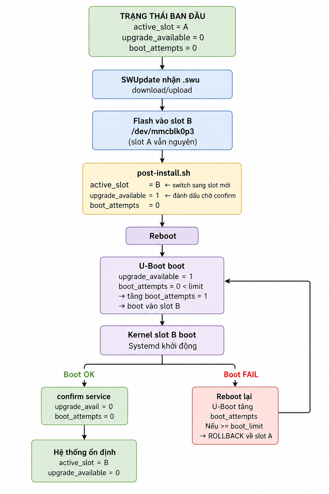

## 1. Tổng quan cơ chế A/B Update

**Vấn đề**
 
Khi flash firmware mới đè lên firmware đang chạy, có hai rủi ro nghiêm trọng:
- **Mất điện giữa chừng** $\rightarrow$ board không boot được
- **Firmware mới bị lỗi** $\rightarrow$ không có cách quay lại bản cũ

**Giải pháp: A/B Update**

Tư tưởng của cơ chế là **không bao giờ ghi đè lên slot đang chạy**. Thay vào đó, luôn flash vào slot dự phòng (inactive). Nếu có sự cố, hệ thống tự động rollback về slot cũ.

```
Không có A/B:                        Có A/B:
──────────────────────────           ──────────────────────────────
Flash đè lên firmware cũ             Flash vào slot dự phòng
  │                                    │
  ├── Mất điện -> brick                ├── Mất điện -> slot cũ vẫn nguyên ✅
  └── Firmware lỗi -> không rollback   └── Firmware lỗi -> tự rollback ✅
```

**Ba thành phần tham gia**

Cơ chế này phụ thuộc chủ yếu vào 3 thành phần:

| Thành phần | Vai trò |
|---|---|
| **SWUpdate** | Nhận file `.swu`, flash vào slot inactive, set U-Boot env |
| **U-Boot** | Đọc biến môi trường, quyết định boot vào slot nào, thực hiện rollback |
| **U-Boot environment** | Lưu trạng thái A/B, đếm boot attempts |

**Các biến U-Boot environment**

| Biến | Giá trị | Ý nghĩa |
|---|---|---|
| `active_slot` | `A` hoặc `B` | Slot hiện tại đang chạy. SWUpdate đọc để biết slot inactive |
| `upgrade_available` | `0` hoặc `1` | `1` = vừa flash xong, chờ confirm. `0` = hệ thống ổn định |
| `boot_attempts` | `0..n` | Số lần đã thử boot slot mới. Tăng mỗi lần boot khi `upgrade_available=1` |
| `boot_limit` | `n` | Ngưỡng rollback. Khi `boot_attempts >= boot_limit` $\rightarrow$ rollback |

**Workflow toàn bộ**

Toàn bộ cơ chế được diễn giải như sau:



### Bảng trạng thái env qua các giai đoạn
 
| Giai đoạn | `active_slot` | `upgrade_available` | `boot_attempts` |
|---|---|---|---|
| Bình thường (slot A) | A | 0 | 0 |
| Sau khi flash xong | B | 1 | 0 |
| U-Boot boot lần 1 | B | 1 | 1 |
| U-Boot boot lần 2 | B | 1 | 2 |
| U-Boot boot lần 3 | B | 1 | 3 → rollback |
| Sau confirm thành công | B | 0 | 0 |
| Sau rollback | A | 0 | 0 |

## 2. Lý thuyết SWUpdate
 
### 2.1. SWUpdate là gì?
 
SWUpdate là một framework OTA mã nguồn mở được thiết kế đặc biệt cho embedded Linux. Nó đóng vai trò là "người thực thi" — nhận gói update, kiểm tra tính hợp lệ, và áp dụng update theo đúng chỉ dẫn.

Điều quan trọng cần hiểu ngay từ đầu: SWUpdate **không tự quyết định** phải làm gì. Mọi quyết định đều đến từ file `sw-description` bên trong gói update. SWUpdate chỉ đọc và thực thi chỉ dẫn đó.

## 2.2. Kiến trúc

SWUpdate hoạt động theo mô hình pipeline — dữ liệu đi qua được xử lý tuần tự:

```
File .swu đến BBB
      │
      ▼
[1] SWUpdate mở cpio archive
      │ đọc sw-description (file đầu tiên)
      ▼
[2] Parse & Validate
      │ kiểm tra hardware-compatibility
      │ kiểm tra version
      │ nếu không hợp lệ -> abort ngay
      ▼
[3] Verify checksum
      │ tính sha256 từng artifact
      │ so sánh với giá trị trong sw-description
      │ không khớp -> abort
      ▼
[4] Chạy pre-install script (nếu có)
      ▼
[5] Flash từng artifact theo chỉ dẫn
      │ gọi đúng handler cho từng loại
      ▼
[6] Chạy post-install script
      ▼
[7] Reboot
```
 
### 2.3. File `.swu` — cpio archive
 
File `.swu` thực chất là cpio archive, đây là một định dạng lưu trữ nhiều file vào một file duy nhất, tương tự zip nhưng đơn giản hơn và phù hợp với streaming:

```
update.swu  (cpio archive)
├── sw-description     ← bắt buộc, phải là file đầu tiên
├── sw-description.sig ← chữ ký (bỏ qua vì lab)
├── zImage             ← kernel
├── am335x-boneblack.dtb
└── post-install.sh
```

Mỗi file `.swu` bắt buộc phải có `sw-description` — không có file này SWUpdate từ chối xử lý gói. File này sẽ mô tả cho SWUpdate biết phải làm gì với những file có trong gói update này.

Khi SWUpdate đọc file `.swu`, nó phân loại các file bên trong thành hai nhóm:

```
Các file trong `.swu`
        │
        ├── sw-description  ->  manifest (đặc biệt, luôn đọc trước)
        │
        └── các file còn lại  ->  gọi chung là "artifact"
                │
                ├── images      (kernel, rootfs, firmware binary...)
                ├── files       (config file, text file thông thường...)
                └── scripts     (shell script, lua script...)
```

$\rightarrow$ Nói đơn giản: artifact nghĩa là bất kỳ file nào trong `.swu` trừ `sw-description`, tức là các thứ cần được xử lý và cài đặt lên thiết bị.

Từ này xuất phát từ quy trình build — các file như `zImage`, `.dtb`, `rootfs.ext4` là sản phẩm đầu ra (artifact) của quá trình build hệ thống. Yocto cũng dùng thuật ngữ này:

```
bitbake core-image-minimal
        │
        ▼
tmp/deploy/images/beaglebone/
    ├── zImage                    <- build artifact
    ├── am335x-boneblack.dtb      <- build artifact
    ├── core-image-minimal.ext4   <- build artifact
    └── MLO, u-boot.img...        <- build artifact
```

### 2.4. `sw-description` — trái tim của gói update
 
`sw-description` là file manifest — nó mô tả toàn bộ ý định của gói update. Không có nó, `.swu` chỉ là một đống byte vô nghĩa.

File này dùng cú pháp **libconfig** — cú pháp dạng block có cấu trúc rõ ràng:

```
software = {
    version  = "1.0.1";                 <- version của gói
    name     = "bbb-gateway-ota";       <- tên gói
    hardware-compatibility = ["1.0"];   <- kiểm tra hw trước khi flash
 
    images: (          <- danh sách artifact cần flash
        { ... },
        { ... }
    );
 
    scripts: (         <- script chạy trước/sau khi flash
        { ... }
    );
}
```

`sw-description` đóng ba vai trò cốt lõi:

**Vai trò 1 — Kiểm soát điều kiện:** Trước khi làm bất cứ điều gì, SWUpdate đọc `hardware-compatibility` và so sánh với hardware hiện tại (lấy từ `/etc/hwrevision`). Đây là lớp bảo vệ tránh flash nhầm firmware lên sai thiết bị.

**Vai trò 2 — Mô tả nội dung:** Mỗi artifact được mô tả kèm `type` (handler nào xử lý), `device` (flash vào đâu), `path` (đường dẫn đích), và `sha256` (để verify).

**Vai trò 3 — Định nghĩa thứ tự:** `pre-install` script chạy trước khi flash, `post-install` script chạy sau — thứ tự này không thể đảo ngược.

### 2.5. Handler — người thực thi
 
Mỗi artifact trong `sw-description` có một trường `type` — trường này quyết định handler nào được gọi để xử lý artifact đó. Handler là các module C được compile vào SWUpdate binary (kiểm soát qua `defconfig`).

Các handler phổ biến với BBB:

| `type` | Cách hoạt động | Dùng khi nào |
|---|---|---|
| `rawfile` | Ghi file vào path trên filesystem | Ghi kernel/DTB vào FAT partition |
| `raw` | Ghi raw bytes thẳng vào block device | Flash toàn bộ rootfs image |
| `shellscript` | Chạy shell script | post-install, pre-install |
| `ubivol` | Ghi vào UBI volume | NAND flash (không dùng trên BBB) |

Ví dụ minh họa sự khác biệt giữa `rawfile` và `raw`:

```
rawfile handler:
  mount /dev/mmcblk0p1        <- mount FAT partition
  open("/boot/zImageB", "w")  <- mở file đích
  stream data -> file         <- ghi vào file
  umount                      <- unmount
 
raw handler:
  open("/dev/mmcblk0p3", "w") <- mở thẳng block device
  stream data -> device       <- ghi byte-by-byte như dd
  (không cần mount)
```

### 2.6. Nơi lưu log của SWUpdate

`/var/lib/swupdate` là nơi SWUpdate lưu trạng thái runtime — những thông tin cần tồn tại giữa các lần chạy và qua các lần reboot.

```
/var/lib/swupdate/
├── .lock                <- ngăn chạy nhiều instance cùng lúc
├── sockinstall          <- Unix socket giao tiếp nội bộ
└── progress             <- Unix socket theo dõi tiến trình
```

Cần đảm bảo `/var/lib/swupdate` nằm trên partition không bị xóa khi OTA. Nếu rootfs bị flash lại (Layout 2), toàn bộ `/var/lib` sẽ mất — không ảnh hưởng đến hoạt động vì SWUpdate tự tạo lại khi khởi động, nhưng nếu ta muốn lưu log của SWUpdate qua các lần OTA để debug, nên redirect log ra `/data`:

```
# swupdate.cfg
logging :
{
    logfile  = "/data/log/swupdate.log";  <- nằm trên data partition
    max-size  = 5;
    max-files = 3;
};
```

**`.lock` — đảm bảo chỉ một instance chạy**

Kịch bản không có `.lock`:
- Terminal 1: swupdate đang flash kernel vào slot B
- Terminal 2: swupdate nhận thêm một gói update khác

Ta thấy rằng, hai process cùng ghi vào `/dev/mmcblk0p3`, điều này có thể gây corrupt storage -> board không boot được.

Do đó, khi SWUpdate khởi động, nó tạo và lock file `.lock`:

```bash
# SWUpdate thực hiện ngầm
flock /var/lib/swupdate/.lock

# Process thứ hai thử chạy
flock /var/lib/swupdate/.lock  ← bị block ngay lập tức
# báo lỗi: "Another instance of swupdate is running"
```

**`sockinstall` — Unix socket điều khiển**

Đây là kênh giao tiếp chính giữa các thành phần của SWUpdate:

```
                    /var/lib/swupdate/sockinstall
                              │
           ┌──────────────────┼──────────────────┐
           │                  │                  │
         Web UI          swupdate-client      hawkBit
       (gửi .swu)         (monitoring)        (remote)
           │                  │                  │
           └──────────────────┼──────────────────┘
                              │
                        SWUpdate daemon
                        (nhận lệnh, xử lý)
```

Thực tế khi ta dùng curl upload `.swu`:

```
curl -X POST http://<BBB_IP>:8080/upload -F "file=@update.swu"
      │
      │  Web server nhận file
      ▼
/var/lib/swupdate/sockinstall
      │
      │  gửi path file .swu qua socket
      ▼
SWUpdate daemon xử lý update
```

**`progress` — Unix socket theo dõi tiến trình**

Cho phép client bên ngoài theo dõi tiến trình update theo thời gian thực:

```bash
# SWUpdate cung cấp tool đọc progress socket
swupdate-progress -s /var/lib/swupdate/progress

# Output realtime:
# [=====     ] 50% - Flashing zImage...
# [========  ] 80% - Running post-install script...
# [==========] 100% - Done. Rebooting...
```

## 3. Các bước xây dựng OTA layer với SWUpdate cho BBB

Tổng quan cấu trúc của layer như sau:

```bash
meta-bbb-ota/
├── conf/
│   └── layer.conf
├── recipes-bsp/
│   ├── libubootenv/
│   │   ├── libubootenv_%.bbappend
│   │   └── files/
│   │       └── fw_env.config
│   └── u-boot/
│       ├── u-boot_%.bbappend          <- thêm boot script A/B
│       └── files/
│           ├── boot.cmd
│           └── uEnv.txt
├── recipes-core/
│   ├── images/
│   │   └── bbb-base-image.bb          <- image recipe chính
│   └── systemd/
│       ├── ota-confirm-boot.bb        <- confirm boot service
│       └── files
│           ├── ota-confirm-boot.sh
│           └── ota-confirm-boot.service
├── recipes-extended/
│   └── images/
│       ├── update-image.bb            <- recipe tạo file .swu
│       └── beaglebone/
│           ├── sw-description
│           └── post-install.sh
├── recipes-support/
│   └── swupdate/
│       ├── swupdate_%.bbappend        <- override config SWUpdate
│       └── files/
│           ├── 09-swupdate-args
│           ├── defconfig
│           └── swupdate.cfg
└── wic/                               <- phân vùng partition
    └── bbb-ota.wks 
```

### 3.1. Thêm meta-swupdate vào workspace

Trước tiên, clone các layer cần thiết vào Yocto workspace:

```bash
git clone https://github.com/sbabic/meta-swupdate.git --branch kirkstone
```

Thêm layer vào `bblayer.conf`

```bash
BBLAYERS ?= " \
  /path/to/yocto-workspace/poky/meta \
  /path/to/yocto-workspace/poky/meta-poky \
  /path/to/yocto-workspace/poky/meta-yocto-bsp \
  /path/to/yocto-workspace/meta-openembedded/meta-oe \
  /path/to/yocto-workspace/meta-openembedded/meta-python \
  /path/to/yocto-workspace/meta-openembedded/meta-networking \
  /path/to/yocto-workspace/meta-swupdate \
"
```

Kiểm tra layer đã nhận chưa:

```bash
source poky/oe-init-build-env build/
bitbake-layers show-layers
```

:::warning Lưu ý
`meta-swupdate` phụ thuộc `meta-oe` và `meta-python` — nếu ta đã có sẵn hai layer này thì không cần làm gì thêm.
:::

### 3.2. Cấu hình SWUpdate

Ba file cấu hình cho SWUpdate tương ứng với ba tầng khác nhau, mỗi tầng kiểm soát một khía cạnh riêng:
 
```
defconfig        <- compile-time: những tính năng nào được build vào binary
swupdate.cfg     <- runtime: daemon hoạt động như thế nào
09-swupdate-args <- startup: tham số nào truyền vào khi khởi động
```

**Viết file `defconfig`**

Source SWUpdate dùng Kconfig giống với hệ thống cấu hình của Linux kernel để quản lý các tính năng được bật/tắt lúc compile. File `defconfig` chính là file output của quá trình cấu hình đó.

Ta không cần thiết phải viết file này, mà có thể generate file thông qua các bước sau:

1. Vào môi trường build SWUpdate:

    ```
    bitbake -c menuconfig swupdate
    ```

    Lúc này, màn hình Kconfig sẽ hiện ra, tương tự với cấu hình cho linux kernel.

2. Chọn các feature cần thiết và save.

3. Sau khi save nó sẽ generate cho ta một file cấu hình, ta có thể vào thư mục sau để lấy

   ```bash
   cd tmp/work/cortexa8hf-neon-poky-linux-gnueabi/swupdate/*/
   ```

4. Copy vào layer

   ```bash
   cp defconfig /path/to/meta-bbb-ota/recipes-support/swupdate/files/defconfig
   ```

Ví dụ một file `defconfig` sẽ có dạng như sau:

```conf
# Automatically generated file; DO NOT EDIT.
# SWUpdate Configuration
#
CONFIG_WEBSERVER=y             # bật built-in web server (mongoose)
CONFIG_UBOOT=y                 # bật đọc/ghi U-Boot environment
CONFIG_DOWNLOAD=y              # bật chế độ pull từ HTTP server
# CONFIG_LUA is not set        # tắt Lua
# CONFIG_MTD is not set        # tắt MTD handler (BBB dùng SD Card, không dùng NAND)
```

**Viết file `swupdate.cfg`**

Nếu `defconfig` quyết định SWUpdate có thể làm gì (compile-time), thì `swupdate.cfg` quyết định SWUpdate sẽ làm gì (runtime). File này dùng cú pháp libconfig, được đọc khi SWUpdate daemon khởi động:

```
# recipes-support/swupdate/files/swupdate.cfg

globals :
{
    verbose    = true;      /* In log chi tiết ra stdout */ 
    loglevel   = 5;         /* Mức độ log: 0=disable, 3=warning, 5=debug, 6=trace */
    syslog     = false;     /* Gửi log vào syslog thay vì stdout */ 
    no-reboot  = false;     /* tự reboot sau khi update xong */
    postupdate = "/usr/bin/mypost.sh";  /* Script chạy sau khi update thành công, trước khi reboot */ 
};

webserver :
{
    document_root = "/var/www/swupdate";
    port          = 8080;   /* Port lắng nghe HTTP */
    bind          = "0.0.0.0";
};

download :
{
    retries        = 3;     /* Số lần thử lại nếu download thất bại */ 
    timeout        = 1800;  /* Timeout toàn bộ quá trình download (tính bằng giây) */ 
    low-speed-time = 300;   /* Abort nếu tốc độ < threshold trong khoảng thời gian này (tính bằng giây) */
    low-speed-limit  = 1024;/* Ngưỡng tốc độ thấp, mặc định 1024 bytes/s */
};

update :
{
    recovery-no-downgrade = true;  /* true = từ chối nếu version mới < version hiện tại */
    recovery-no-samebool = true;   /* true = từ chối nếu version mới = version hiện tại */
    max-sersion = "99.99.99";      /* Chặn các bản update có version cao hơn giá trị này */ 
};
```

**Viết file `09-swupdate-args`**

Khi SWUpdate daemon khởi động, nó cần nhận các tham số dòng lệnh. Thay vì hard-code vào init script, SWUpdate dùng convention: đọc tất cả file trong `/etc/swupdate/conf.d/` theo thứ tự số và ghép argument lại:

```
/etc/swupdate/conf.d/
├── 09-swupdate-args     ← argument cơ bản (từ meta-swupdate-boards)
├── 10-swupdate-args     ← override nếu bạn muốn thêm
└── 15-swupdate-args     ← override tiếp theo nếu cần
         │
         ▼
SWUpdate ghép tất cả lại thành một lệnh:
swupdate [args từ 09] [args từ 10] [args từ 15] ...
```

File `09-swupdate-args` là file argument chính:

```bash
rootfs=$(swupdate -g)		# lấy partition đang chạy

if [ "$rootfs" = '/dev/mmcblk0p2' ];then	# nếu đang chạy p2
	selection="-e stable,copy2"
else
	selection="-e stable,copy1"
fi

SWUPDATE_ARGS="-H bbb-gateway:1.0 ${selection} -f /etc/swupdate.cfg"
```

Tham số quan trọng nhất ở đây là `-H bbb-gateway:1.0` — khai báo hardware name và version. SWUpdate dùng giá trị này để đối chiếu với `hardware-compatibility` trong `sw-description`:

```
09-swupdate-args:          sw-description:
-H bbb-gateway:1.0   <->   hardware-compatibility = ["1.0"]
                     ↑↑↑
                phải khớp nhau
```

Tham số `-e` nhận hai giá trị: `<software_set>,<mode>`

```
-e stable,main
      ↑      ↑
      │      └── mode: "main" (bản chính)
      │                "secondary" (bản dự phòng)
      └── software set: "stable" (production)
                        "testing" (thử nghiệm)
                        tên bất kỳ ta định nghĩa
```

Tính năng này cho phép một file `.swu` phục vụ nhiều loại thiết bị hoặc nhiều trạng thái. Ví dụ trong `sw-description`:

```
software =
{
    version     = "1.0.1";

    @BOARD_NAME@ = {
        hardware-compatibility: ["1.0"];

        stable: {
            main: {
                images: ( 
                    {
                        filename           = "rootfs.ext4.gz";
                        device             = "/dev/mmcblk0p2";
                        type               = "raw";
                        compressed         = "zlib";
                    }
                );
                scripts: (
                    {
                        filename = "post-install.sh";
                        type     = "shellscript";
                    }
                );
            };

            secondary: {
                images: (
                    {
                        filename           = "rootfs.ext4.gz;
                        device             = "/dev/mmcblk0p3";
                        type               = "raw";
                        compressed         = "zlib";
                    }
                );
                scripts: (
                    {
                        filename = "post-install.sh";
                        type     = "shellscript";
                    }
                );
            };
        };
    };
}
```

**Viết file recipe**

```bash
# recipes-support/swupdate/swupdate_%.bbappend
FILESEXTRAPATHS:prepend := "${THISDIR}/files:"

SRC_URI:append = " \
    file://defconfig \
    file://swupdate.cfg.in \
    file://09-swupdate-args \
"

do_install:append() {
    install -d ${D}${libdir}/swupdate/conf.d
    install -m 0644 ${WORKDIR}/09-swupdate-args ${D}${libdir}/swupdate/conf.d/09-swupdate-args
    
    install -d ${D}${sysconfdir}
    install -m 0644 ${WORKDIR}/swupdate.cfg ${D}${sysconfdir}/swupdate.cfg
}
```

### 3.3. Cấu hình `libubootenv`

Khi SWUpdate flash kernel mới xong, ta cần U-Boot boot vào slot B. Để làm được điều này thì ta cần ghi vào biến môi trường của uboot để khi U-boot chạy, nó sẽ đọc biến môi trường này và thực hiện boot vào slot B.

Để làm được điều này thì kernel cần truy cập được vào block chứa biến môi trường của uboot, tuy nhiên block đó được lưu trực tiếp vào raw storage, nó chỉ là một vùng byte tại một địa chỉ cố định trên SD card và không phải file system như FAT hay EXT4 nên kernel không thể truy cập. Vậy thì giải pháp ở đây là gì?

Đó là sử dụng công cụ `fw_setenv`/`fw_printenv`, nhưng một vấn đề nữa nảy sinh là công cụ này cần biết địa chỉ cố định của biến môi trường để có thể đọc/ghi chính xấc. Đó chính là lý do mà file `fw_env.conf` tồn tại, nó chính là bản đồ chỉ đường cho các công cụ đó.

Ví dụ với trường hợp BBB boot từ SD Card, file cấu hình sẽ như sau:

```bash
# recipes-bsp/libubootenv/files/fw_env.config
#
# device        offset      env_size
/dev/mmcblk0    0x260000    0x20000
    │              │           │
    │              │           └── env_size: kích thước vùng env
    │              │               phải == CONFIG_ENV_SIZE trong U-Boot
    │              │
    │              └── offset: vị trí bắt đầu tính từ byte 0 của device
    │                  phải == CONFIG_ENV_OFFSET trong U-Boot
    │
    └── device: block device chứa U-Boot env
```

Ba giá trị này phải khớp với U-Boot config, nếu:
- Sai `offset` -> đọc vùng dữ liệu khác → CRC fail → dùng default env
- Sai `env_size` -> đọc thiếu/thừa bytes  -> CRC fail -> mất biến
- Sai `device`   -> ghi nhầm partition    -> có thể corrupt filesystem

Công cụ `fw_setenv`/`fw_printenv` sẽ đọc file `fw_env.conf` tại thư muc `/etc` nên ta cần viết một recipe để đưa file cấu hình của ta vào đúng thư mục đó. 

```bash
# recipes-bsp/libubootenv/libubootenv_%.bbappend
FILESEXTRAPATHS:prepend := "${THISDIR}/files:"

SRC_URI:append = " file://fw_env.config"

do_install:append() {
    install -d ${D}${sysconfdir}
    install -m 0644 ${WORKDIR}/fw_env.config ${D}${sysconfdir}/fw_env.config
}
```

### 3.4. Viết recipe tạo file boot script

Trong phần này, ta cần viết file `boot.cmd`, đâu là file chứa các lệnh UBoot. Sau đó, file nãy sẽ được compile sang dạng binary là `boot.scr` để UBoot tự động load và thực thi khi khởi động.

```
   Ta viết        Tool compile          U-Boot đọc
┌──────────┐      ┌──────────┐         ┌──────────┐
│ boot.cmd │ ───► │ mkimage  │ ──────► │ boot.scr │
│  (text)  │      └──────────┘         │ (binary) │
└──────────┘                           └──────────┘
     ↑                                      │
     │                                      │
 Ta chỉnh sửa                               ▼
 logic ở đây                         U-Boot thực thi
                                     từng lệnh
```

Nếu không có `boot.scr`, U-Boot sẽ chạy `bootcmd` mặc định được hard-code lúc compile — thường không phù hợp với boot logic mà ta mong muốn.

Dưới đây là nội dung của file `boot.cmd`:

```bash
# recipes-bsp/u-boot/files/boot.cmd

setenv mmc_dev 0

# ── Giá trị mặc định nếu env chưa có ────────────────────
if test -z "${boot_limit}";     then setenv boot_limit  3; fi
if test -z "${active_slot}";    then setenv active_slot A; fi
if test -z "${boot_count}";     then setenv boot_count  0; fi
if test -z "${ustate}";         then setenv ustate      0; fi

# ── In trạng thái hiện tại để debug ─────────────────────
echo "======= SmartFarm boot ======="
echo "boot_count    : ${boot_count}"
echo "boot_limit    : ${boot_limit}"
echo "active_slot   : ${active_slot}"
echo "ustate        : ${ustate}"
echo "=============================="

# ── Xử lý rollback nếu đang trong trạng thái upgrade ─────────────
# ustate = 1 nghĩa là SWUpdate vừa flash xong, chờ xác nhận
# ustate = 0 nghĩa là hệ thống đang stable, không cần đếm
if test ${ustate} = 1; then
    if test ${boot_count} >= ${boot_limit}; then
        # Đã thử quá số lần cho phép -> rollback
        echo "!!! Boot failed ${boot_limit} times -> rolling back"

        if test ${active_slot} = A; then
            setenv active_slot B
        else
            setenv active_slot A
        fi

        setenv ustate       0
        setenv boot_count   0
        saveenv

    else
        # Tăng bộ đếm, chưa rollback
        setenv boot_count $((boot_count + 1))
        saveenv
        echo ">>> Upgrade boot attempt ${boot_count}/${boot_limit}"
    fi
fi

# ── Chọn partition và kernel path theo active_slot ──────────────────────────
if test "${active_slot}" = "A"; then
    setenv mmc_part    2
else
    setenv mmc_part    3 
fi

setenv bootargs " root=/dev/mmcblk${mmc_dev}p${mmc_part} rw rootwait console=ttyO0,115200n8"

# ── Load kernel và DTB từ slot đang active ────────────────────────────────────────────────────
echo ">>> Booting slot ${active_slot} partition p${mmc_part} bootcount=${boot_count}/${boot_limit}"

load mmc ${mmc_dev}:${mmc_part} ${kernel_addr_r} /boot/zImage
load mmc ${mmc_dev}:${mmc_part} ${fdt_addr_r}    /boot/am335x-boneblack.dtb

# ── Boot ────────────────────────────────────────────────────────────────────────────────────
bootz ${kernel_addr_r} - ${fdt_addr_r}
```

Sau đó, ta cần viết một recipe để build file này thành dạng `boot.scr`:

```bash
# recipes-bsp/u-boot/u-boot_%.bbappend
FILESEXTRAPATHS:prepend := "${THISDIR}/files:"

SRC_URI:append = " file://boot.cmd"

DEPENDS:append = " u-boot-tools-native"

do_compile:append() {
    ${UBOOT_MKIMAGE} -C none -A arm -T script -d ${WORKDIR}/boot.cmd ${WORKDIR}/boot.scr
}

do_deploy:append() {
    install -m 0644 ${WORKDIR}/boot.scr ${DEPLOYDIR}/
}
```

### 3.5. Viết recipe tạo file `.swu`

Đây là bước cốt lõi — đóng gói kernel + DTB thành file `.swu` để gửi đến thiết bị.
 
**Đầu tiên, ta cần viết file `sw-description`:**

```conf
# recipes-extended/images/beaglebone/sw-description

software =
{
    version = "1.0.1";
    name    = "bbb-ota-kernel";

    hardware-compatibility = ["1.0"];

    /* ---- Slot A: ghi vào đây nếu đang active là B ---- */
    images: (
        /* --- Rootfs slot B --- */
        {
            filename           = "rootfs.ext4.gz";
            type               = "raw";
            device             = "/dev/mmcblk0p3";
            compressed         = true;
            installed-directly = true;
            sha256             = "@rootfs.ext4.gz";
        },

        /* --- Kernel slot B --- */
        {
            filename = "zImage";
            type     = "rawfile";
            device   = "/dev/mmcblk0p1";
            path     = "/boot/zImageA";
            sha256   = "@zImage";
        },

        /* --- DTB slot B --- */
        {
            filename = "am335x-boneblack.dtb";
            type     = "rawfile";
            device   = "/dev/mmcblk0p1";
            path     = "/boot/am335x-boneblack-A.dtb";
            sha256   = "@am335x-boneblack.dtb";
        }
    );

    /* ---- Script chạy sau khi flash xong ---- */
    scripts: (
        {
            filename = "post-install.sh";
            type     = "shellscript";
        }
    );
}
```

Ta nhận thấy một vấn đề của ví dụ trên:

```
images: (
    {
        filename = "rootfs.ext4.gz";
        type     = "raw";
        device   = "/dev/mmcblk0p3";  ← LUÔN ghi vào p3 (slot B)
    }
);
```

Vấn đề xảy ra ở đây:

```
Lần update 1:
  Thiết bị đang chạy slot A (p2)
  → SWUpdate ghi vào p3 (slot B)  ✅ đúng

Lần update 2:
  Thiết bị đang chạy slot B (p3)
  → SWUpdate vẫn ghi vào p3 (slot B)  ❌ ghi đè lên chính nó!
  → Hệ thống đang chạy bị corrupt ngay lập tức
```

Giải pháp là dùng `sw-description` động với `09-swupdate-args` để detect slot tại runtime.

**Viết file `post-install.sh`** để detect slot inactive, rename file nếu cần, set U-Boot env:

```bash
# recipes-extended/images/beaglebone/post-install.sh

set -eu

FW_SETENV="/usr/sbin/fw_setenv"    # công cụ từ u-boot-fw-utils

# Đọc slot hiện tại
CURRENT_SLOT=$(${FW_SETENV} -n active_slot 2>/dev/null || echo "A")

# Xác định slot inactive
if [ "${CURRENT_SLOT}" = "A" ]; then
    NEW_SLOT="B"
else
    NEW_SLOT="A"
fi

echo "Current slot: ${CURRENT_SLOT}, switching to: ${NEW_SLOT}"

# Set U-Boot env để boot vào slot mới
${FW_SETENV} active_slot  "${NEW_SLOT}"
${FW_SETENV} ustate       "1"
${FW_SETENV} boot_count   "0"

exit 0
```

**Cuối cùng, ta cần viết file bitbake để tạo file `.swu`:**

```bash
# recipes-extended/images/update-image.bb
DESCRIPTION = "SWUpdate package cho BBB gateway"
LICENSE     = "MIT"
LIC_FILES_CHKSUM = "file://${COMMON_LICENSE_DIR}/MIT;md5=0835ade698e0bcf8506ecda2f7b4f302"

# Kế thừa class swupdate — cung cấp do_swuimage task
inherit swupdate

# Phụ thuộc kernel phải build xong trước
do_swuimage[depends] += " \
    virtual/kernel:do_deploy \
    core-image-minimal:do_image_complete \
"

# File sw-description và script
SRC_URI = " file://sw-description file://post-install.sh "

# Các image cần đóng gói vào .swu
SWUPDATE_IMAGES = " zImage am335x-boneblack.dtb core-image-minimal"

# Định nghĩa fstype cho từng image
SWUPDATE_IMAGES_FSTYPES[core-image-minimal] = ".ext4.gz"
SWUPDATE_IMAGES_FSTYPES[zImage]             = ""
SWUPDATE_IMAGES_FSTYPES[am335x-boneblack.dtb] = ""
```

### 3.6. Systemd service — confirm boot thành công

Sau khi boot vào slot mới thành công, systemd chạy service này để xác nhận boot — reset `upgrade_available=0` để tránh U-Boot rollback nhầm.

:::warning **Tại sao quan trọng:**
Nếu không confirm, `upgrade_available` mãi bằng `1`. Sau 3 lần reboot bình thường, U-Boot sẽ rollback về slot cũ dù hệ thống đang hoạt động tốt.
:::

```bash
# recipes-core/systemd/files/ota-confirm-boot.sh
#!/bin/sh

set -eu

FW_SETENV="/usr/sbin/fw_setenv"

usate=$(${FW_SETENV} -n ustate 2>/dev/null || echo "0")

if [ "${usate}" = "1" ]; then
    echo "OTA: Boot confirmed successful, committing slot"
    ${FW_SETENV} boot_count "0"
    ${FW_SETENV} ustate     "0"
fi
```

```ini
# ota-confirm-boot.service
[Unit]
Description=OTA Boot Confirmation
After=network.target
Before=swupdate.service

[Service]
Type=oneshot
ExecStart=/usr/bin/ota-confirm-boot.sh
RemainAfterExit=yes

[Install]
WantedBy=multi-user.target
```

```bash
# ota-confirm-boot.bb

DESCRIPTION = "OTA boot confirmation service"
LICENSE     = "MIT"
LIC_FILES_CHKSUM = \
    "file://${COMMON_LICENSE_DIR}/MIT;md5=0835ade698e0bcf8506ecda2f7b4f302"

SRC_URI = " \
    file://ota-confirm-boot.sh       \
    file://ota-confirm-boot.service  \
"

FILESEXTRAPATHS:prepend := "${THISDIR}/files:"

inherit systemd

SYSTEMD_SERVICE:${PN} = "ota-confirm-boot.service"
SYSTEMD_AUTO_ENABLE   = "enable"

do_install() {
    install -d ${D}${bindir}
    install -m 0755 ${WORKDIR}/ota-confirm-boot.sh \
                    ${D}${bindir}/ota-confirm-boot.sh

    install -d ${D}${systemd_system_unitdir}
    install -m 0644 ${WORKDIR}/ota-confirm-boot.service \
                    ${D}${systemd_system_unitdir}/ota-confirm-boot.service
}
```

### 3.8. Thiết kế partition layout

Trước khi đi vào thiết kế cụ thể, cần hiểu 3 nguyên tắc cốt lõi:
1. Raw area: U-Boot, SPL, env không nằm trong partition nào mà nằm ở raw offset trước partition table
2. A/B area: mọi thứ cần update phải có 2 bản sao, để khi update sẽ không ghi đè lên bản đang chạy.
3. Persistent: dữ liệu không liên quan đến firmware phải tách riêng và không bị xoá khi OTA.

Tổng quan các vùng trên SD Card:

```
SD Card (>1GB)
│
├── Raw area
│     Offset 0x000000: MBR
│     Offset 0x000200: U-Boot SPL (MLO)
│     Offset 0x040000: U-Boot image
│     Offset 0x260000: U-Boot environment    <- fw_env.config trỏ vào đây
│
└── [Partition table — bắt đầu từ 0x400000 trở đi]
      p1: boot   (FAT32)   — kernel, DTB, boot script
      p2: rootfsA (ext4)   — rootfs slot A
      p3: rootfsB (ext4)   — rootfs slot B
      p4: data    (ext4)   — persistent data
```

Để định nghĩa các partition trong yocto, ta sử dụng file `.wks` - Wic Kickstart file. Yocto dùng tool `wic` để đọc file này và tạo ra disk image hoàn chỉnh có thể flash thằng vào SD card.

Ví dụ về file `.wks` cho layout update kernel + dtb + rootfs:

```bash
# wic/bbb-ota.wks
#
# -----------------------------------------------------------
# Vùng Raw (nằm ngoài partition table)
# Khai báo bằng bootloader-config, không phải lệnh part
# -----------------------------------------------------------
bootloader --ptable msdos

# -----------------------------------------------------------
# p1 — boot partition (FAT32)
# Chứa: boot.scr
# U-Boot load boot.scr từ đây để thực thi A/B logic
# -----------------------------------------------------------
part /boot --source bootimg-partition --ondisk mmcblk0 --fstype=vfat --label boot   --active --align 4096 --size 64    --sourceparams="loader=u-boot"

# -----------------------------------------------------------
# p2 — rootfs slot A (ext4)
# Chứa: kernel + DTB + toàn bộ rootfs
# Là slot active mặc định khi xuất xưởng
# -----------------------------------------------------------
part /     --source rootfs            --ondisk mmcblk0 --fstype=ext4 --label root_a --align 4096 --fixed-size 1024 --use-uuid

# -----------------------------------------------------------
# p3 — rootfs slot B (ext4)
# Chứa: bản sao dự phòng, SWUpdate ghi vào đây khi OTA
# Ban đầu giống hệt slot A (bản sao lúc build)
# -----------------------------------------------------------
part       --source empty             --ondisk mmcblk0 --fstype=ext4 --label root_b --align 4096 --fixed-size 1024

# -----------------------------------------------------------
# p4 — data partition (ext4)
# Chứa: config, database, logs
# KHÔNG bao giờ bị xóa hay ghi đè khi OTA
# -----------------------------------------------------------
part /data --source empty             --ondisk mmcblk0 --fstype=ext4 --label data   --align 4096 --size 256

```

Trong đó:
- `--ptable msdos` : dùng MBR partition table thay vì GPT
- `part /boot` : tạo partition và mount tại `/boot` trong rootfs.
- `--source bootimg-partition` : dùng plugin bootimg-partition của wic:
  
  ```
  Plugin này tự động:
  1. Copy kernel image (zImage/uImage)
  2. Copy Device Tree blob (.dtb)
  3. Copy bootloader files (MLO, u-boot.img)
  4. Copy boot script (boot.scr/uEnv.txt)

  Tất cả lấy từ DEPLOY_DIR_IMAGE
  ```
- `--ondisk mmcblk0` : chỉ định disk đích
- `--fstype=vfat` hoặc `--fstype=ext4` : format FAT32 hoặc ext4
- `--label boot` : đặt tên volume label
- `--active` : đánh dấu bootable flag trong MBR

  ```
  MBR partition table có 1 bit "bootable"
  BIOS/ROM bootloader tìm partition có flag này
  -> Chỉ đặt cho boot partition
  -> Các partition khác không cần
  ```
- `--align 409`6 : căn chỉnh theo 4096 bytes
- `--fixed-size 32` : kích thước cố định 32MB
- `--use-uuid` : dùng UUID thay vì device path

### 3.9. Image recipe chính
 
Image recipe kéo tất cả các thành phần đã viết ở trên lại thành một image hoàn chỉnh:

```bash
# recipes-core/images/bbb-base-image.bb
 
require recipes-core/images/core-image-minimal.bb
 
IMAGE_INSTALL:append = " \
    swupdate             \
    swupdate-www         \
    libubootenv          \
    ota-confirm-boot     \
"
 
# /etc/hwrevision — sw-description dùng để check hardware compatibility
# /etc/sw-version — SWUpdate dùng để so sánh version khi có rule no-downgrade
do_rootfs:append() {
    echo "bbb-gateway 1.0" > ${IMAGE_ROOTFS}${sysconfdir}/hwrevision
    echo "1.0.0"           > ${IMAGE_ROOTFS}${sysconfdir}/sw-version
}
 
WKS_FILE     = "bbb-ota.wks"
IMAGE_FSTYPES = "wic wic.bmap"

# Các file được copy vào FAT boot partition thông qua bootimg-partition source.
IMAGE_BOOT_FILES = " \
    MLO              \
    u-boot.img       \
    zImage           \
    am335x-boneblack.dtb \
    boot.scr         \
    uEnv.txt         \
"
```

`IMAGE_FSTYPES` là biến Yocto quyết định Yocto sẽ tạo ra những định dạng file image nào sau khi build xong rootfs.

```
IMAGE_FSTYPES = "wic wic.bmap ext4 tar.gz"
#                 ↑     ↑      ↑     ↑
#                 │     │      │     └── tarball của rootfs
#                 │     │      └── raw ext4 filesystem image
#                 │     └── bitmap file đi kèm wic
#                 └── disk image hoàn chỉnh (có partition table)
```

Mỗi giá trị trong list tương ứng với một image creator plugin trong Yocto — plugin đó biết cách đóng gói rootfs thành đúng định dạng đó.

Với định dạng `.wic` ta có thể flash image như sau:

```bash
sudo bmaptool copy bbb-base-image-beaglebone.wic /dev/sdX
#                          ↑
#                  cần IMAGE_FSTYPES có "wic"
```

`wic.bmap` đi kèm với `wic` để flash nhanh hơn:

```bash
# bmaptool dùng .bmap để biết sector nào có data
# chỉ ghi sector đó, bỏ qua sector trống
# -> nhanh hơn dd từ 3-10 lần

#   bmaptool tự tìm .bmap cùng thư mục <- cần wic.bmap
sudo bmaptool copy bbb-base-image-beaglebone.wic /dev/sdX
```

## 4. Quy trình update hàng ngày
 
Sau khi hệ thống đã setup xong, workflow mỗi khi có feature mới hoặc bug fix rất đơn giản:
 
### 4.1. Bump version

```bash
# recipes-extended/images/update-image.bb
PV = "1.0.1"  →  PV = "1.0.2"
```

### 4.2. Build `.swu`

```bash
bitbake update-image

# Kiểm tra nội dung .swu trước khi gửi
cpio -itv < tmp/deploy/images/beaglebone/update-image-beaglebone.swu
# Mong đợi:
# sw-description
# post-install.sh
# zImage
# am335x-boneblack.dtb
```

### 4.3. Upload lên thiết bị

```bash
# Qua web UI: mở browser → http://<BBB_IP>:8080 → upload file
 
# Hoặc qua curl
curl -X POST http://<BBB_IP>:8080/upload \
     -F "file=@update-image-beaglebone.swu" \
     --progress-bar
```

### 4.4. Theo dõi và kiểm tra
 
```bash
# Theo dõi log trên BBB
ssh root@<BBB_IP> "tail -f /var/log/swupdate.log"
 
# Sau khi reboot, kiểm tra slot mới đang chạy
ssh root@<BBB_IP> "fw_printenv active_slot"          # → B
ssh root@<BBB_IP> "fw_printenv upgrade_available"    # → 0 (đã confirm)
ssh root@<BBB_IP> "uname -r"                         # kernel version mới
```