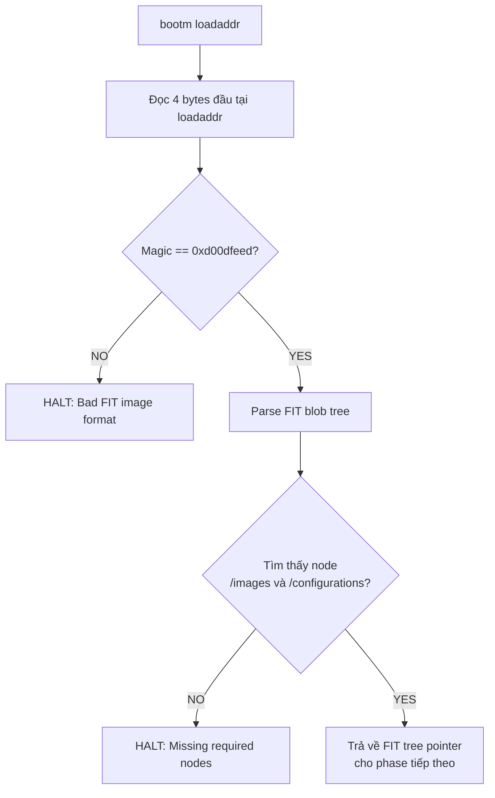
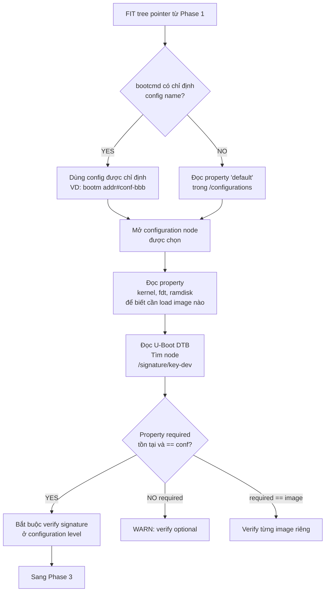
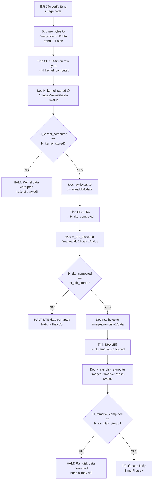
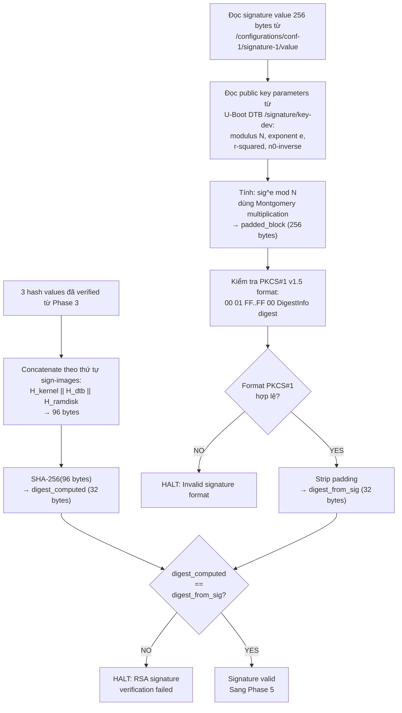
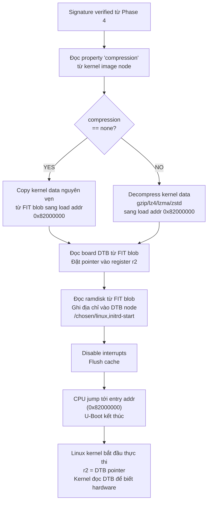

# Secure Boot Chain

Secure boot chain trên AM335x (SoC của BBB) hoạt động theo chuỗi stage: ROM -> MLO (SPL) -> U-Boot -> Kernel -> Rootfs, trong đó mỗi stage verify stage tiếp theo trước khi chuyển quyền thực thi.

Tuy nhiên, có một điểm quan trọng cần lưu ý: AM335x trên BeagleBone Black thương mại sử dụng General Purpose (GP) device, nghĩa là ROM bootloader không hỗ trợ secure boot hoàn chỉnh như dòng High Security (High Security).

Ta cần kiểm tra SoC trên board của mình:

```bash
# Chạy trên BBB
cat /sys/bus/soc/devices/soc0/type
```

Kết quả sẽ cho biết device type: GP hay HS. Topic này sẽ trình bày cả hai hướng để ta hiểu rõ secure boot chain của từng loại.

## U-Boot Verified Boot

### FIT image format

FIT (Flattened Image Tree) được mô tả bằng file `.its` (Image Tree Source). File này có cú pháp dựa trên device tree syntax. và nó không chứa binary data trực tiếp. Nó chỉ tham chiếu tới các file binary và mô tả cách đóng gói chúng.

Uboot sẽ sử dụng FIT để đóng gói nhiều component như kernel, DTB, initramfs vào thành một blob duy nhất được gọi là FIT image. Mỗi component có SHA-256 hash riêng, và toàn bộ hash được sign bằng RSA private key.

```
/dts-v1/;

/ {
    description = "Example signed FIT image";
    #address-cells = <1>;

    images {
        kernel {
            description = "Linux kernel";
            data = /incbin/("zImage");         <- Chỉ là tham chiếu, chưa có data
            type = "kernel";
            arch = "arm";
            os = "linux";
            compression = "none";
            load = <0x82000000>;
            entry = <0x82000000>;

            hash-1 {
                algo = "sha256";
            };
        };

        fdt-1 {
            description = "Device tree";
            data = /incbin/("am335x-boneblack.dtb");
            type = "flat_dt";
            arch = "arm";
            compression = "none";

            hash-1 {
                algo = "sha256";
            };
        };

        ramdisk-1 {
            description = "initramfs";
            data = /incbin/("initramfs.cpio.gz");
            type = "ramdisk";
            arch = "arm";
            os = "linux";
            compression = "gzip";

            hash-1 {
                algo = "sha256";
            };
        };
    };

    configurations {
        default = "conf-1";

        conf-1 {
            description = "Boot configuration";
            kernel = "kernel";
            fdt = "fdt-1";
            ramdisk = "ramdisk-1";

            signature-1 {
                algo = "sha256,rsa2048";
                key-name-hint = "dev";
                sign-images = "kernel", "fdt", "ramdisk";
            };
        };
    };
};
```

#### Cấu trúc tổng thể của file .its

Cây ITS có 3 tầng chính:

```
/ (root node)
├── images/           <- chứa tất cả binary component
│   ├── kernel        <- Linux kernel
│   │   └── hash-1    <- SHA-256 hash của kernel
│   ├── fdt-1         <- device tree blob
│   │   └── hash-1
│   └── ramdisk-1     <- initramfs
│       └── hash-1
└── configurations/   <- chứa các boot profile
    └── conf-1        <- một profile cụ thể
        └── signature-1  <- signature của profile
```

### Quy trình sign tại boot time

Quá trình ký diễn ra trên build server, sử dụng `mkimage` — tool của U-Boot. Đây là flow chi tiết:

```bash
# Bước 1: Tạo RSA key pair (chỉ làm 1 lần)
openssl genrsa -F4 -out keys/dev.key 2048
openssl req -batch -new -x509 -key keys/dev.key -out keys/dev.crt

# Bước 2: Compile ITS thành ITB (unsigned)
mkimage -f fitImage.its fitImage

# Bước 3: Ký FIT image + nhúng public key vào U-Boot DTB
mkimage -F fitImage \
    -k keys/ \                  # thư mục chứa .key và .crt
    -K u-boot.dtb \             # U-Boot DTB — public key sẽ được ghi vào đây
    -r \                        # required: đánh dấu signature là bắt buộc
    -c "Example sign FIT image" # comment
```

Sau bước 3, `mkimage` sẽ thực hiện đồng thời hai thao tác:

**Thao tác trên fitImage:**

Tính SHA-256 cho mỗi image node, ghi digest vào property value của hash sub-node tương ứng trong FIT blob.

```
+---------------------+
| zImage (kernel bin) | ---- SHA-256 ----> H_kernel  (32 byte)
+---------------------+

+---------------------+
| am335x-bbb.dtb      | ---- SHA-256 ----> H_dtb     (32 byte)
+---------------------+

+---------------------+
| initramfs.cpio.gz   | ---- SHA-256 ----> H_ramdisk (32 byte)
+---------------------+
```

Sau đó nối tất cả hash lại theo thứ tự trong `sign-images`. Thứ tự này quan trọng, nếu uboot nối theo thứ tự khác sẽ ra digest khác và verify fail. Sau đó SHA-256 lần nữa trên blob 96 byte để ra digest cuối cùng 32 byte.

```
H_kernel  (32 byte) --+
                      |
H_dtb     (32 byte) --+-- concatenate --> H_all (96 byte)
                      |                     |
H_ramdisk (32 byte) --+                     | SHA-256
                                            |
                                            ▼
                                          digest (32 byte)
```

Ký digest thu được bằng RSA private key:

```
                        +------------------+
digest (32 byte) -----> |   PKCS#1 v1.5    | ----->  padded_block (256 byte cho RSA-2048)
                        |   padding        |
                        +------------------+
                                |
                                |  <----- RSA private key
                                |
                                ▼
                        signature (256 byte)
```

Đầu tiên digest cần được wrap trong PKCS#1 v1.5 padding block. Block này có format cố định:

```
Tổng cộng 256 byte (= kích thước RSA-2048 key):

Byte:  00  01  FF FF FF FF ... FF FF  00  [DigestInfo]  [Digest]
       ↑   ↑   ↑                      ↑   ↑             ↑
       |   |   |                      |   |             +--- 32 byte SHA-256 hash
       |   |   |                      |   |
       |   |   |                      |   +--- ASN.1 header chỉ định
       |   |   |                      |      thuật toán hash nào được dùng
       |   |   |                      |      Với SHA-256, DigestInfo luôn là 19 bytes cố định
       |   |   |                      |
       |   |   |                      +--- separator, đánh dấu hết padding
       |   |   |
       |   |   +--- padding byte, toàn bộ là 0xFF
       |   |      lấp đầy khoảng trống cho đủ 256 byte
       |   |
       |   +--- block type (01 = signature; type 02 = encryption)
       |
       +--- luôn là 00, đánh dấu đầu block
```

Sau đó, toàn bộ padded block mới được sign bằng private key thu được 256 byte signature, giá trị này sẽ được ghi vào signature value của signature sub-node tương ứng trong FIT blob kèm với timestamp.

:::tip PKCS#1 v1.5 là gì?
PKCS là viết tắt của Public Key Cryptography Standards. Đây là bộ tiêu chuẩn do RSA Laboratories (công ty phát minh RSA) định nghĩa. PKCS#1 là tiêu chuẩn dành riêng cho RSA, mô tả cách dùng RSA đúng và an toàn.
:::

:::warning Tại sao cần PKCS#1?
SHA-256 digest chỉ có 32 byte, trong khi RSA-2048 cần làm việc với block 256 bytes -> PKCS#1 giải quyết bằng cách thêm padding để lấp đầy message thành đúng 256 bytes theo format cố định trước khi sign.
:::

**Thao tác trên `u-boot.dtb`:**

Ghi toàn bộ thông tin public key dưới dạng pre-computed RSA parameters vào U-Boot DTB tại node `/signature/key-{name}`. Flag `-r` đặt property `required = "conf"` vào node này.

Sau khi `mkimage` chạy xong, U-Boot DTB chứa node sau:

```dts
/ {
    signature {
        key-dev {                          /* tên trùng key-name-hint trong ITS */
            required = "conf";
            algo = "sha256,rsa2048";
            rsa,r-squared = <0x...>;
            rsa,modulus = <0x...>;
            rsa,exponent = <0x00010001>;
            rsa,n0-inverse = <0x...>;
            rsa,num-bits = <0x800>;
        };
    };
};
```

### Quy trình verify tại boot time

#### Phase 1: Parse FIT blob



#### Phase 2: Select configuration và check required



#### Phase 3: Hash verify từng component



#### Phase 4: RSA signature verify



#### Phase 5: Boot kernel

