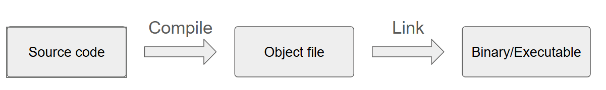
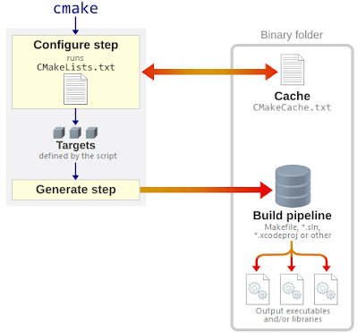
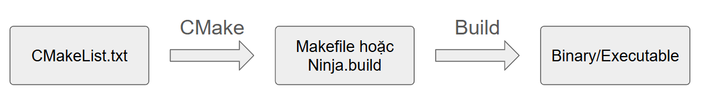

# CMake

## Build system

Build system là hệ thống tự động hóa toàn bộ quá trình biên dịch source code thành chương trình có thể chạy.

Cụ thể nó xử lý chuỗi công việc:



Nếu ta làm bằng tay thì phải gõ từng bước như sau:

```bash
arm-none-eabi-gcc -c main.c -o main.o
arm-none-eabi-gcc -c sensor.c -o sensor.o
arm-none-eabi-ld main.o sensor.o -T linker_script.ld -o firmware.elf
arm-none-eabi-objcopy -O binary firmware.elf firmware.bin
```

Giả sử, một project mà số file cần phải build lên tới 50 đến 200 file và chúng được chia thành nhiều folder khác nhau thì việc build và quản lý trở nên khó khăn → Build system giúp tự động hóa tất cả.

Một build system điển hình sẽ gồm:
- Build rules: Quy định lấy file gì → chạy command gì → tạo ra file gì.
- Dependency: Một file cần phụ thuộc vào file nào.
- Chỉ build những file thay đổi → tiết kiệm thời gian.
- Chọn compiler, flags, architecture, options.

Build system sẽ được chia làm 2 loại:
- Low-level build system: Make, bash, ninja
- Meta-build system: CMake, Meson, Bazel

Meta-build system giúp mô tả project ở mức cao hơn low-level build system.

## CMake

CMake không phải là build system trực tiếp mà nó tạo ra các file generator dựa trên file mô tả là `CMakeLists.txt`. Generator là build system như make hoặc ninja.

Cấu trúc của cmake:



Có thể tóm tắt quy trình trên như sau:



**CMakeLists.txt**

Cấu trúc cơ bản của một file `CMakeLists.txt`:

```bash
# Minimum version of CMake
cmake_minimum_required(VERSION 3.10)

# Define project name and languages
project(MyFirstProject LANGUAGES CXX)

# Create list of Source Files
set(SOURCES main.cpp utils.cpp)

# Create executable file
add_executable(myapp ${SOURCES})

# Include folder
target_include_directories(myapp PRIVATE include)
```

Trong một project có thể có nhiều file `CMakeLists.txt`. Các file `CMakeLists.txt` này kết nối với nhau bằng lệnh `add_subdirectory()`.

Giả sử:

```
project/
 ├── CMakeLists.txt        (root)
 ├── app/
 │      └── CMakeLists.txt
 ├── drivers/
 │      └── CMakeLists.txt
 └── utils/
        └── CMakeLists.txt
```

Trong root `CMakeLists.txt`:

```
add_subdirectory(app)
add_subdirectory(drivers)
add_subdirectory(utils)
```

CMake sẽ đi vào từng thư mục và chạy `CMakeLists.txt` ở trong đó.

**Configure Step**

Khi chạy: `cmake -B build`

CMake sẽ đọc tất cả file `CMakeLists.txt` và tạo folder `build`. Trong folder này sẽ chứa:

```
build/
 ├── Makefile (nếu dùng generator Makefile)
 ├── rules.ninja (nếu dùng Ninja)
 ├── CMakeCache.txt
 ├── CMakeFiles/
 └── compile_commands.json
```

Trong đó, file `CMakeCache.txt` sẽ lưu:
- compiler path
- build options (Debug, Release)

-> khi đổi compiler phải xoá build folder.

## Target

Trong CMake, target là một thực thể build, tức là đơn vị mà CMake sẽ build, quản lý và gán các thuộc tính.

Các loại target trong CMake:

| Target                  | Mô tả                                         |
| ------------------------| --------------------------------------------- |
| `add_executable`        | Tạo file thực thi (program hoặc firmware ELF) |
| `add_library STATIC`    | Tạo static library                            |
| `add_library SHARED`    | Tạo dynamic library                           |
| `add_library INTERFACE` | không có code, chỉ chứa properties            |
| `add_library OBJECT`    | Tạo các object file                           |
| `add_custom_target`     | Target này không compile, không link ra execute mà nó dùng cho script |

CMake quản lý mọi thứ thông qua target:

| Thuộc tính           | Hàm CMake                      | Ý nghĩa                                                                                                             |
| -------------------- | ------------------------------ | ------------------------------------------------------------------------------------------------------------------- |
| **Include dirs**     | `target_include_directories()` | Gán include path cho **một target**, và tùy theo scope mà đường dẫn này có được kế thừa sang target khác hay không. |
| **Compile flags**    | `target_compile_options()`     | Thêm các compiler flags cho target. Flags này áp dụng riêng cho target và kế thừa tuỳ thuộc vào scope.              |
| **Linker flags**     | `target_link_options()`        | Thêm các linker flags cho target. Flags này áp dụng riêng cho target và kế thừa tuỳ thuộc vào scope.                |
| **Macro / defines**  | `target_compile_definitions()` | Tạo macro cho target, được dùng để cấu hình build hoặc bật/tắt tính năng.                                           |
| **Link library**     | `target_link_libraries()`      | Khai báo target phải link với thư viện nào.                                                                         |
| **Compile features** | `target_compile_features()`    | Chỉ định standard feature cần dùng (như c_std_11, cxx_std_17). CMake tự thêm flags phù hợp với compiler.            |
| **Source code**      | `target_sources()`             | Thêm danh sách source cho target. Có thể thêm source theo scope khác nhau.                                          |

## Dependency

### Scope

CMake quản lý các dependency thông qua các scope:

| Scope         | Áp dụng cho target hiện tại | Truyền sang target khác link với nó |
| ------------- | --------------------------- | ----------------------------------- |
| **PRIVATE**   | ✔                           | ✘                                   |
| **PUBLIC**    | ✔                           | ✔                                   |
| **INTERFACE** | ✘                           | ✔                                   |

## Dependency discovery

CMake cung cấp hệ thống tìm kiếm dependence mạnh mẽ.

Cmake tìm kiếm thông qua ba phương thức:
- Biến môi trường PATH trong OS:
- PATH mà user cùng cấp: HINTS, PATHS.
- Thông qua biến `CMAKE_PREFIX_PATH`.

**Nếu user cung cấp HINTS**

```cmake
find_program(PY python3 HINTS ~/custom/bin)
```

-> cmake sẽ tìm ở `~/custom/bin`.

**Nếu user cung cấp PATHS**

```cmake
find_program(GCC arm-none-eabi-gcc PATHS /opt/gcc-arm/bin)
```

→ CMake tìm ở `/opt/gcc-arm/bin`.

**Sử dụng CMAKE_PREFIX_PATH**

Nếu user cung cấp:

```cmake
cmake -DCMAKE_PREFIX_PATH=/opt/toolchain
```

CMake tự sinh danh sách:

```cmake
/opt/toolchain/bin
/opt/toolchain/usr/bin
```

Rồi bắt đầu tìm trong đó.

🔹 `find_program()`

Tìm chương trình thực thi trong hệ thống, ví dụ như:
- Tìm toolchain GCC ARM
- Tìm objcopy, objdump, size
- Tìm tool để flash firmware (openocd, st-flash)

Cú pháp:

```cmake
find_program(<VAR> name1 [name2 ...] [PATHS ...] [HINTS ...])
```

Ví dụ đơn giản:

```cmake
find_program(PYTHON_EXECUTABLE python3)
```

Nếu tìm thấy:

```cmake
PYTHON_EXECUTABLE = /usr/bin/python3
```

Nếu không tìm thấy:

```cmake
PYTHON_EXECUTABLE = PYTHON_EXECUTABLE-NOTFOUND
```

🔹 `find_library()`

Dùng để tìm thư viện trong hệ thống hoặc thư viện có sẵn. Ví dụ như: `.a`, `.so`, `.dll`

Cú pháp:

```cmake
find_library(<VAR> name [PATHS ...] [HINTS ...])
```

Ví dụ:

```cmake
find_library(SSL_LIB ssl)
find_library(CRYPTO_LIB crypto)
```

Sau đó link:

```cmake
target_link_libraries(app PRIVATE ${SSL_LIB} ${CRYPTO_LIB})
```

🔹 `find_package()`

Tìm và load một package cmake hoàn chỉnh, chứa: include directories, libraries, imported targets,...

Nó giúp dùng thư viện mà không phải tự viết:
- include paths
- library paths
- compile options
- link flags

CMake tìm các package có định dạng file:

```cmake
<PackageName>Config.cmake
```

hoặc

```cmake
Find<PackageName>.cmake
```

Cú pháp:

```cmake
find_package(<PackageName> [VERSION] [REQUIRED] [COMPONENTS ...])
```

---

Ví dụ:

```cmake
find_package(OpenSSL REQUIRED)
```

Nó sẽ tìm:

```
OpenSSLConfig.cmake
hoặc FindOpenSSL.cmake
```

Và cung cấp target imported:

```cmake
target_link_libraries(app PRIVATE OpenSSL::SSL OpenSSL::Crypto)
```

## Property

Trong CMake, property là thuộc tính gắn với một đối tượng bất kỳ như:
- Target
- Directory
- Source file
- Global

Property ≠ Variable.
- Biến là giá trị thuần tuý
- Property là thuộc tính của một đối tượng cụ thể.

CMake cung cấp hai nhóm hàm:

1. Nhóm hàm tổng quát (áp dụng cho mọi đối tượng)

| Hàm                | Ý nghĩa                                             |
| ------------------ | --------------------------------------------------- |
| **set_property()** | Gán thuộc tính cho directory, global, file, target… |
| **get_property()** | Lấy thuộc tính của directory, global, file, target… |

2. Nhóm hàm chuyên cho TARGET

| Hàm                         | Ý nghĩa                                          |
| --------------------------- | ------------------------------------------------ |
| **set_target_properties()** | Thiết lập property cho target theo cách ngắn gọn |
| **get_target_property()**   | Lấy property của target theo cách ngắn gọn       |


## Variable

Trong CMake, variable là giá trị lưu trữ trong quá trình configure.

### Built-in variables

**Nhóm directory**

| Biến                         | Ý nghĩa                                        |
| ---------------------------- | ---------------------------------------------- |
| `CMAKE_SOURCE_DIR`           | Root directory chứa CMakeLists.txt chính       |
| `CMAKE_CURRENT_SOURCE_DIR`   | Directory chứa CMakeLists đang được xử lý      |
| `CMAKE_BINARY_DIR`           | Thư mục build gốc (build/)                     |
| `CMAKE_CURRENT_BINARY_DIR`   | Thư mục build tương ứng với CURRENT_SOURCE_DIR |
| `CMAKE_INSTALL_PREFIX`       | Thư mục nơi `make install` sẽ install file     |

**Nhóm project**

| Biến                   | Ý nghĩa                          |
| ---------------------- | -------------------------------- |
| `PROJECT_NAME`         | Tên project từ lệnh `project()`  |
| `PROJECT_SOURCE_DIR`   | Thư mục nguồn của project        |
| `PROJECT_VERSION`      | Version khai báo trong project() |

**Nhóm compiler flags**

| Biến                       | Ý nghĩa                      |
| -------------------------- | ---------------------------- |
| `CMAKE_C_COMPILER`         | Compiler C đang dùng         |
| `CMAKE_CXX_COMPILER`       | Compiler C++                 |
| `CMAKE_ASM_COMPILER`       | Compiler cho ASM             |
| `CMAKE_C_FLAGS`            | Flags chung cho C            |
| `CMAKE_C_FLAGS_DEBUG`      | Flags khi build Debug        |
| `CMAKE_C_FLAGS_RELEASE`    | Flags khi build Release      |
| `CMAKE_EXE_LINKER_FLAGS`   | Flags cho linker             |
| `CMAKE_C_STANDARD`         | C standard (c89, c99, c11…)  |
| `CMAKE_CXX_STANDARD`       | C++ standard (c++11, c++17…) |

## Construct 

Trong CMake, construct hiểu là các khối cú pháp cơ bản mà CMake cung cấp để diễn tả:
- cấu trúc dự án
- xử lý biến
- logic điều kiện
- vòng lặp
- macro/function
- khai báo target
- thiết lập thuộc tính

Những hàm như:
- `macro(...)`
- `function(...)`
- `set(...)`
- `if(...)`
- `foreach(...)`
- `cmake_parse_arguments(...)`
- `set_target_properties`
- `get_property`
- `find_program`, `find_package`, ...

-> Tất cả đều là construct.

### Construct function

function() trong CMake được dùng để định nghĩa một khối logic tái sử dụng, nó:
- có thể nhận tham số.
- có scope riêng cho biến:
  + Biến tạo trong function không ảnh hưởng đến biến bên ngoài
  + Biến bên ngoài có thể đọc, nhưng không ghi đè trừ khi dùng PARENT_SCOPE
- Không có return như ngôn ngữ lập trình.

Cú pháp:

```cmake
function(<name> [arg1 arg2 ...])
    # nội dung function
endfunction()
```

Các biến tự động:

| Biến         | Nghĩa                      |
| ------------ | -------------------------- |
| `${ARGC}`    | Tổng số lượng tham số      |
| `${ARGV<n>}` | Lấy tham số theo index     |
| `${ARGV}`    | Tất cả tham số dạng list   |
| `${ARGN}`    | Tất cả tham số từ vị trí sau tham số được khai báo cuối cùng |

Ngoài ra, ta có thể truyền vào function theo dạng key-value giống như sau:


```cmake
my_api(
    NAME MyApp
    TYPE STATIC
    SRCS main.cpp util.cpp
)
```

Để parse giá trị, ta cần dùng `cmake_parse_arguments`, với cú pháp:

```cmake
cmake_parse_arguments(
    PREFIX              # dùng để đặt tên các biến output.
    OPTIONS             # option boolean (không có giá trị)
    SINGLE_VALUE_KEYS   # tham số nhận 1 giá trị
    MULTI_VALUE_KEYS    # tham số nhận 0-n giá trị
    ARGN                # input argument của function
)
```

Ví dụ:

```cmake
function(add_component)
    cmake_parse_arguments(
        ARG             
        ""              # No option boolean
        "NAME;TYPE"     # Single-value keys
        "SRCS"          # Multi-value key
        ${ARGN}
    )

    message("Name = ${ARG_NAME}")
    message("Type = ${ARG_TYPE}")
    message("Sources = ${ARG_SRCS}")
endfunction()

add_component(NAME MyApp TYPE STATIC SRCS main.cpp util.cpp)
```

## String

CMake gom tất cả thao tác trên chuỗi vào lệnh:

```cmake
string(SUBCOMMAND args...)
```

Các subcommand quan trọng nhất:

| Subcommand                  | Ý nghĩa                      | Ví dụ                                           | Output              |
| --------------------------- | ---------------------------- | ----------------------------------------------- | ------------------- |
| **LENGTH**                  | Lấy độ dài chuỗi             | `string(LENGTH "Hello" out)`                    | `out = 5`           |
| **SUBSTRING**               | Cắt chuỗi theo vị trí        | `string(SUBSTRING "Hello" 0 2 out)`             | `out = He`          |
| **FIND**                    | Tìm vị trí substring         | `string(FIND "Hello" "lo" pos)`                 | `pos = 3`           |
| **REPLACE**                 | Thay thế                     | `string(REPLACE "a" "b" out "a1a2")`            | `out = b1b2`        |
| **COMPARE**                 | So sánh chuỗi                | `string(COMPARE EQUAL "a" "a" out)`             | `out = TRUE`        |
| **CONFIGURE**               | Thay biến trong template     | `set(X 5); string(CONFIGURE "v=@X@" out @ONLY)` | `out = v=5`         |
| **TOUPPER**                 | Chuyển thành chữ hoa         | `string(TOUPPER "abc" out)`                     | `out = ABC`         |
| **TOLOWER**                 | Chuyển thành chữ thường      | `string(TOLOWER "ABC" out)`                     | `out = abc`         |
| **STRIP**                   | Xóa khoảng trắng đầu/cuối    | `string(STRIP "  hi  " out)`                    | `out = hi`          |
| **JOIN**                    | Ghép list thành chuỗi        | `string(JOIN "," out a b c)`                    | `out = a,b,c`       |
| **APPEND**                  | Nối thêm chuỗi               | `set(s "a"); string(APPEND s "b")`              | `s = ab`            |
| **PREPEND**                 | Thêm vào đầu chuỗi           | `set(s "b"); string(PREPEND s "a")`             | `s = ab`            |
| **CONCAT**                  | Ghép chuỗi                   | `string(CONCAT out "a" "b")`                    | `out = ab`          |
| **TIMESTAMP**               | Lấy thời gian hệ thống       | `string(TIMESTAMP now "%Y")`                    | `now = 2025`        |
| **MAKE_C_IDENTIFIER**       | Chuỗi → tên hợp lệ trong C   | `string(MAKE_C_IDENTIFIER "hello world" out)`   | `out = hello_world` |
| **ASCII**                   | Chuyển số ASCII → ký tự      | `string(ASCII 72 73 out)`                       | `out = HI`          |
| **REPEAT**                  | Lặp chuỗi N lần              | `string(REPEAT "A" 3 out)`                      | `out = AAA`         |
| **ASCII_SET**               | Tạo chuỗi từ mã ASCII        | `string(ASCII_SET out 65 66)`                   | `out = AB`          |
| **HEX**                     | Chuỗi → hex hoặc hex → chuỗi | `string(HEX "AB" out)`                          | `out = 4142`        |
| **REGEX MATCH**             | Tìm match đầu tiên           | `string(REGEX MATCH "[0-9]+" out "x123y")`      | `out = 123`         |
| **REGEX MATCHALL**          | Tìm tất cả match             | `string(REGEX MATCHALL "[0-9]" out "a1b2")`     | `out = 1;2`         |
| **REGEX REPLACE**           | Thay bằng regex              | `string(REGEX REPLACE "[ ]+" "_" out "a  b")`   | `out = a_b`         |
