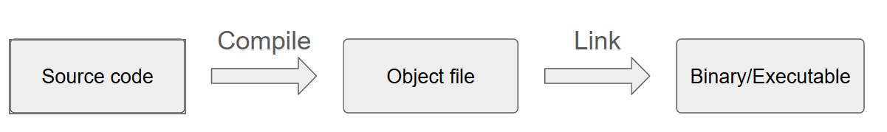
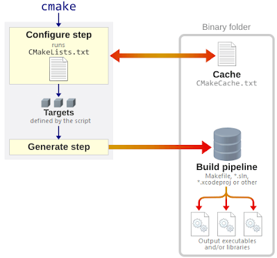
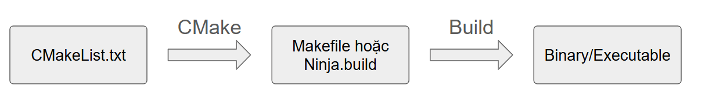

# CMake

## 1. Build system

Build system là hệ thống tự động hóa toàn bộ quá trình biên dịch source code thành chương trình có thể chạy.

Cụ thể nó xử lý chuỗi công việc:



Nếu ta làm bằng tay thì phải gõ từng bước như sau:

```bash
arm-none-eabi-gcc -c main.c -o main.o
arm-none-eabi-gcc -c sensor.c -o sensor.o
arm-none-eabi-ld main.o sensor.o -T linker_script.ld -o firmware.elf
arm-none-eabi-objcopy -O binary firmware.elf firmware.bin
```

Giả sử, một project mà số file cần phải build lên tới 50 đến 200 file và chúng được chia thành nhiều folder khác nhau thì việc build và quản lý trở nên khó khăn → Build system giúp tự động hóa tất cả.

Một build system điển hình sẽ gồm:
- Build rules: Quy định lấy file gì → chạy command gì → tạo ra file gì.
- Dependency: Một file cần phụ thuộc vào file nào.
- Chỉ build những file thay đổi → tiết kiệm thời gian.
- Chọn compiler, flags, architecture, options.

Build system sẽ được chia làm 2 loại:
- Low-level build system: Make, bash, ninja
- Meta-build system: CMake, Meson, Bazel

Meta-build system giúp mô tả project ở mức cao hơn low-level build system.

## 2. CMake là gì?

CMake không phải là build system trực tiếp mà nó là đứa tạo ra các file generator dựa trên file mô tả là `CMakeLists.txt`. Generator là build system như `make` hoặc `ninja`.

Cấu trúc của CMake:



Có thể tóm tắt quy trình trên như sau:



### 2.1. Cấu trúc của một file `CMakeLists.txt`

Cấu trúc cơ bản như sau:

```bash
# Khai báo version CMake tối thiểu
cmake_minimum_required(VERSION 3.10)

# Khai báo project
project(MyFirstProject LANGUAGES CXX)

# Tạo list các source file
set(SOURCES main.cpp utils.cpp)

# Tạo file execute
add_executable(myapp ${SOURCES})

# Include folder
target_include_directories(myapp PRIVATE include)
```

### 2.2. Configure Step

Khi chạy: `cmake -B build`

CMake sẽ đọc tất cả file `CMakeLists.txt` và tạo folder `build`. Trong folder này sẽ chứa:

```
build/
 ├── Makefile (nếu dùng generator Makefile)
 ├── rules.ninja (nếu dùng Ninja)
 ├── CMakeCache.txt
 ├── CMakeFiles/
 └── compile_commands.json
```

Trong đó, file `CMakeCache.txt` sẽ lưu:
- compiler path
- build options (Debug, Release)

-> khi đổi compiler phải xoá build folder.

### 2.3. Subdirectory

Trong một project có thể có nhiều file `CMakeLists.txt`. Các file `CMakeLists.txt` này kết nối với nhau bằng lệnh `add_subdirectory()`.

Giả sử:

```
project/
 ├── CMakeLists.txt        (root)
 ├── app/
 │      └── CMakeLists.txt
 ├── drivers/
 │      └── CMakeLists.txt
 └── utils/
        └── CMakeLists.txt
```

Trong root `CMakeLists.txt`:

```cmake
add_subdirectory(app)
add_subdirectory(drivers)
add_subdirectory(utils)
```

CMake sẽ đi vào từng thư mục và chạy `CMakeLists.txt` ở trong đó.

### 2.4. Target

Trong CMake, target là một đơn vị build - đại diện cho một "thứ cần được build" hoặc một "tập hợp thông tin build".

Các loại target trong CMake:

| Target                  | Mô tả                                         |
| ------------------------| --------------------------------------------- |
| `add_executable`        | Tạo thành file thực thi (program hoặc firmware ELF) |
| `add_library STATIC`    | Tạo thành static library - file `.a` (Linux) hoặc `.lib` (Windows) |
| `add_library SHARED`    | Tạo thành dynamic library - file `.so` (Linux) hoặc `.dll` (Windows) |
| `add_library INTERFACE` | không có source code, chỉ chứa properties |
| `add_custom_target`     | Target này không compile, không link ra execute mà nó dùng cho script |

## 3. Properties của target

Hãy nghĩ target như một object trong lập trình hướng đối tượng — nó có các properties mô tả mọi thứ về cách nó được build.

Hãy hình dung đơn giản như sau:

```
Target "mylib"
├── SOURCES              → foo.cpp, bar.cpp
├── INCLUDE_DIRECTORIES  → include/
├── COMPILE_OPTIONS      → -Wall, -O2
├── COMPILE_DEFINITIONS  → VERSION="1.0"
├── LINK_LIBRARIES       → pthread, fmt::fmt
└── ...
```

CMake dùng chính các properties này để sinh ra lệnh build thực tế. Ví dụ:

```bash
# CMake đọc properties của target rồi sinh ra lệnh kiểu này:
g++ -Wall -O2 -DVERSION="1.0" -Iinclude/ foo.cpp bar.cpp -lpthread -lfmt
```

### 3.1. Cách set properties

**Cách 1 — Dùng lệnh chuyên dụng (khuyến khích)**

```cmake
target_include_directories(mylib PUBLIC include/)
target_compile_options(mylib PRIVATE -Wall -O2)
target_compile_definitions(mylib PRIVATE VERSION="1.0")
target_link_libraries(mylib PRIVATE pthread)
```

Mỗi lệnh này thực chất là đang ghi vào property của target.

**Cách 2 — Dùng set_target_properties trực tiếp**

```cmake
set_target_properties(mylib PROPERTIES
    CXX_STANDARD          17
    CXX_STANDARD_REQUIRED ON
    OUTPUT_NAME           "my_library"
)
```

**Cách 3 — Đọc property bằng get_target_property**

```cmake
get_target_property(my_sources mylib SOURCES)
message("Sources: ${my_sources}")
# In ra: Sources: foo.cpp;bar.cpp
```

### 3.2. Hai loại properties

**Build properties — ảnh hưởng đến cách compile/link**

| Property | Lệnh tương ứng | Ý nghĩa |
| --- | --- | --- |
| `INCLUDE_DIRECTORIES` | `target_include_directories()` | Đường dẫn tìm file header. |
| `COMPILE_OPTIONS` | `target_compile_options()` | Thêm các compiler flags cho target. |
| `LINK_OPTIONS` | `target_link_options()` | Thêm các linker flags cho target. |
| `LINK_LIBRARIES` | `target_link_libraries()` | Khai báo target phải link với thư viện nào. |
| `SOURCES`      | `target_sources()` | Thêm danh sách source cho target. |

**Metadata properties — thông tin về target**

| Property | Ý nghĩa |
| --- | --- |
| `CXX_STANDARD` | Chuẩn C++ dùng (11, 14, 17, 20...) |
| `OUTPUT_NAME` | Tên file output (mặc định = tên target) |
| `VERSION` | Version của library |

### 3.3. Properties lan truyền giữa các target

Khi ta viết:

```cmake
target_include_directories(engine
    PRIVATE   src/internal/
    PUBLIC    include/
    INTERFACE api/
)
```

Bên trong target `engine`, CMake lưu vào hai property riêng biệt của target:

```
engine
├── INCLUDE_DIRECTORIES           → src/internal/, include/
└── INTERFACE_INCLUDE_DIRECTORIES → include/, api/
```

Trong đó:
- `INCLUDE_DIRECTORIES` — dùng khi build chính target đó
- `INTERFACE_INCLUDE_DIRECTORIES` — dùng khi target khác link vào

Ví dụ:

```cmake
# --- Định nghĩa thư viện ---
add_library(mathlib STATIC vector.cpp matrix.cpp)

target_include_directories(mathlib
    PRIVATE  src/         # chỉ vector.cpp, matrix.cpp cần
    PUBLIC   include/     # ai dùng mathlib cũng cần
)

target_compile_options(mathlib
    PRIVATE -O3           # chỉ khi build mathlib
)

set_target_properties(mathlib PROPERTIES
    CXX_STANDARD 17
    OUTPUT_NAME  "math"   # output file sẽ là libmath.a
)

# --- Định nghĩa executable ---
add_executable(myapp main.cpp)
target_link_libraries(myapp PRIVATE mathlib)

# myapp tự động nhận được:
# ✓ include/  (từ PUBLIC của mathlib)
# ✗ src/      (PRIVATE, không lan truyền)
# ✗ -O3       (PRIVATE, không lan truyền)
```

**Bảng tổng kết:**

| Scope | Build target hiện tại | Truyền sang target khác |
| --- | --- | ---- |
| **PRIVATE**   | ✔ | ✘ |
| **PUBLIC**    | ✔ | ✔ |
| **INTERFACE** | ✘ | ✔ |

## 4. Finding dependency

CMake cung cấp hệ thống tìm kiếm dependence mạnh mẽ.

CMake không tìm ngẫu nhiên — nó đi qua 6 bước cố định theo thứ tự, mỗi bước tìm trong một tập đường dẫn khác nhau. Tìm thấy ở bước nào thì dừng lại luôn:

**Bước 1 — Kiểm tra Cache trước tiên**

```cmake
find_library(SSL_LIB ssl)
```

Trước khi tìm bất cứ đâu, CMake kiểm tra `CMakeCache.txt`:

```
# CMakeCache.txt
SSL_LIB:FILEPATH=/usr/lib/libssl.so   ← đã có → dừng, dùng luôn
```

Nếu biến đã có trong cache → bỏ qua toàn bộ 5 bước còn lại.

Đây là lý do tại sao khi cài thư viện mới, ta phải xóa cache:

```bash
rm -rf build/CMakeCache.txt
# hoặc override thủ công
cmake -DSSL_LIB=/new/path/libssl.so ..
```

**Bước 2 — Tìm trong HINTS**

`HINTS` là đường dẫn ta tự cung cấp, được tìm trước đường dẫn hệ thống. Thường dùng để trỏ đến SDK hoặc thư viện tự cài:

```cmake
find_program(PY_LIB python3 HINTS ~/custom/bin)
```

-> CMake sẽ tìm ở `~/custom/bin`.

**Bước 3 — Tìm trong biến CMAKE_PREFIX_PATH**

Biến này chứa danh sách các "prefix" — CMake sẽ tự thêm các suffix phù hợp:

```cmake
set(CMAKE_PREFIX_PATH "/opt/mylibs" "/usr/local")
find_library(SSL_LIB ssl)
```

CMake tự mở rộng thành:

```
# Với find_library, CMake thêm suffix lib, lib64...
/opt/mylibs/lib/
/opt/mylibs/lib64/
/usr/local/lib/
/usr/local/lib64/
```

```
# Với find_path (tìm header), CMake thêm suffix include...
/opt/mylibs/include/
/usr/local/include/
```

```
# Với find_program (tìm executable), CMake thêm suffix bin...
/opt/mylibs/bin/
/usr/local/bin/
```

Đây là lý do `CMAKE_PREFIX_PATH` mạnh — một đường dẫn duy nhất nhưng phục vụ cả find_library, find_path, find_program.

**Bước 4 — Tìm trong biến môi trường hệ thống**

CMake đọc các biến môi trường từ shell:

```bash
# Trong shell trước khi chạy cmake
export CMAKE_PREFIX_PATH=/opt/mylibs
export PKG_CONFIG_PATH=/opt/mylibs/lib/pkgconfig
```

```cmake
# CMake tự đọc các biến môi trường này
find_library(SSL_LIB ssl)
# Tìm trong $ENV{CMAKE_PREFIX_PATH}/lib/
```

**Bước 5 — Đường dẫn mặc định của hệ thống**

Đây là danh sách đường dẫn CMake hardcode sẵn theo từng hệ điều hành:

Linux:

```
find_library tìm trong:
/lib /lib64
/usr/lib /usr/lib64
/usr/local/lib /usr/local/lib64
/usr/lib/x86_64-linux-gnu    ← Debian/Ubuntu
...

find_path tìm trong:
/usr/include
/usr/local/include
...

find_program tìm trong:
/bin /sbin
/usr/bin /usr/sbin
/usr/local/bin
...
```

Windows:

```
find_library tìm trong Registry và:
C:/Program Files/
C:/Program Files (x86)/
...
```

**Bước 6 — PATHS**

`PATHS` là đường dẫn bổ sung, tìm sau hệ thống — thường dùng như fallback:

```cmake
find_library(SSL_LIB ssl
    PATHS /opt/fallback/lib
          /home/user/custom_libs
)
```

### 4.1. find_program — tìm executable

Tìm chương trình thực thi trong hệ thống, ví dụ như:
- Tìm toolchain GCC ARM
- Tìm objcopy, objdump, size
- Tìm tool để flash firmware (openocd, st-flash)

Ví dụ:

```cmake
find_program(PYTHON_EXECUTABLE
    NAMES python3 python
    HINTS /usr/bin /usr/local/bin
)

# Nếu không tìm thấy:
if(NOT PYTHON_EXECUTABLE)
    message(FATAL_ERROR "Python không tìm thấy")
endif()

# Dùng Python để generate code trước khi build
add_custom_command(
    OUTPUT  ${CMAKE_BINARY_DIR}/generated.cpp
    COMMAND ${PYTHON_EXECUTABLE} codegen.py -o generated.cpp
    DEPENDS codegen.py
)
```

### 4.2. find_library — tìm file thư viện

Dùng để tìm thư viện trong hệ thống hoặc thư viện có sẵn. Ví dụ như: `.a`, `.so`, `.dll`

Cú pháp:

```cmake
find_library(<VAR>
    NAMES     <tên1> <tên2> ...   # tên không có tiền tố lib hay đuôi .so
    HINTS     <đường dẫn ưu tiên>
    PATHS     <đường dẫn thêm>
    PATH_SUFFIXES <thư mục con>
)
```

Ví dụ:

```cmake
find_library(SSL_LIB ssl)
find_library(CRYPTO_LIB crypto)

# Sau đó link:
target_link_libraries(app PRIVATE ${SSL_LIB} ${CRYPTO_LIB})
```

## 5. find_package

`find_package` tìm và load một package cmake hoàn chỉnh, chứa: include directories, libraries, imported targets,...

`find_package` thực ra là lệnh cấp cao — bên trong nó thường gọi các lệnh cấp thấp hơn:

```
find_package(OpenSSL)
        │
        └── FindOpenSSL.cmake chạy và gọi nội bộ:
                ├── find_path()      → tìm thư mục chứa header
                ├── find_library()   → tìm file .so / .a / .lib
                └── find_program()   → tìm executable (nếu cần)
```

Nó giúp tìm thư viện trên hệ thống mà không phải tự viết, thư viện này chứa: include directories, libraries, imported targets,...

CMake có hai chế độ tìm kiếm package hoàn toàn khác nhau:

```
find_package(Foo)
      │
      ├─── Module Mode: tìm file FindFoo.cmake
      │
      └─── Config Mode: tìm file FooConfig.cmake hoặc foo-config.cmake
```

CMake thử Module Mode trước, nếu không tìm thấy thì thử Config Mode.

**Module Mode — tìm FindFoo.cmake**

CMake chạy một script có sẵn để tìm thư viện. Script này biết cách tìm từng thư viện cụ thể trên từng hệ điều hành.

Nơi CMake tìm `FindFoo.cmake`:

```
1. CMAKE_MODULE_PATH         (ta tự thêm)
2. <CMake install dir>/share/cmake-X.Y/Modules/   (built-in)
```

Ví dụ:

```cmake
find_package(OpenGL REQUIRED)

# CMake chạy FindOpenGL.cmake có sẵn
# Script này tự biết tìm opengl32.lib trên Windows
# hay libGL.so trên Linux
```

**Config Mode — tìm FooConfig.cmake**

Đây là cách hiện đại hơn. Thư viện tự đi kèm file config mô tả chính nó — không cần CMake phải đoán cách tìm.

Thứ tự tìm kiếm trên Linux/macOS:

```
1. <package>_DIR
2. CMAKE_PREFIX_PATH
3. /usr/lib/cmake/Foo/
4. /usr/local/lib/cmake/Foo/
5. /usr/share/Foo/
6. ~/.local/lib/cmake/Foo/
```

Thứ tự tìm kiếm trên Windows:

```
1. <package>_DIR
2. CMAKE_PREFIX_PATH
3. Registry entries
4. Program Files/Foo/
```

Ví dụ:

```cmake
find_package(fmt REQUIRED)
# CMake tìm fmt/fmt-config.cmake hoặc fmt/FmtConfig.cmake
```

## 6. Variable

Trong CMake, variable là giá trị lưu trữ trong quá trình configure.

**Nhóm directory**

| Biến                         | Ý nghĩa                                        |
| ---------------------------- | ---------------------------------------------- |
| `CMAKE_SOURCE_DIR`           | Root directory chứa CMakeLists.txt chính       |
| `CMAKE_CURRENT_SOURCE_DIR`   | Directory chứa CMakeLists đang được xử lý      |
| `CMAKE_BINARY_DIR`           | Thư mục build gốc (build/)                     |
| `CMAKE_CURRENT_BINARY_DIR`   | Thư mục build tương ứng với CURRENT_SOURCE_DIR |
| `CMAKE_INSTALL_PREFIX`       | Thư mục nơi `make install` sẽ install file     |

**Nhóm project**

| Biến                   | Ý nghĩa                          |
| ---------------------- | -------------------------------- |
| `PROJECT_NAME`         | Tên project từ lệnh `project()`  |
| `PROJECT_SOURCE_DIR`   | Thư mục nguồn của project        |
| `PROJECT_VERSION`      | Version khai báo trong project() |

**Nhóm compiler flags**

| Biến                       | Ý nghĩa                      |
| -------------------------- | ---------------------------- |
| `CMAKE_C_COMPILER`         | Compiler C đang dùng         |
| `CMAKE_CXX_COMPILER`       | Compiler C++                 |
| `CMAKE_ASM_COMPILER`       | Compiler cho ASM             |
| `CMAKE_C_FLAGS`            | Flags chung cho C            |
| `CMAKE_C_FLAGS_DEBUG`      | Flags khi build Debug        |
| `CMAKE_C_FLAGS_RELEASE`    | Flags khi build Release      |
| `CMAKE_EXE_LINKER_FLAGS`   | Flags cho linker             |
| `CMAKE_C_STANDARD`         | C standard (c89, c99, c11…)  |
| `CMAKE_CXX_STANDARD`       | C++ standard (c++11, c++17…) |

## 7. Construct 

### 7.1. Khái niệm

Trong CMake, construct hiểu là các khối cú pháp cơ bản mà CMake cung cấp để diễn tả:
- cấu trúc dự án
- xử lý biến
- logic điều kiện
- vòng lặp
- macro/function
- khai báo target
- thiết lập thuộc tính

Những hàm như:
- `macro(...)`
- `function(...)`
- `set(...)`
- `if(...)`
- `foreach(...)`
- `cmake_parse_arguments(...)`
- `set_target_properties`
- `get_property`
- `find_program`, `find_package`, ...

-> Tất cả đều là construct.

### 7.2. Construct function

`function()` trong CMake được dùng để định nghĩa một khối logic tái sử dụng, nó:
- có thể nhận tham số.
- có scope riêng cho biến:
  + Biến tạo trong function không ảnh hưởng đến biến bên ngoài
  + Biến bên ngoài có thể đọc, nhưng không ghi đè trừ khi dùng PARENT_SCOPE
- Không có return như ngôn ngữ lập trình.

Cú pháp:

```cmake
function(<name> [arg1 arg2 ...])
    # nội dung function
endfunction()
```

Các biến tự động:

| Biến         | Nghĩa                      |
| ------------ | -------------------------- |
| `${ARGC}`    | Tổng số lượng tham số      |
| `${ARGV<n>}` | Lấy tham số theo index     |
| `${ARGV}`    | Tất cả tham số dạng list   |
| `${ARGN}`    | Tất cả tham số từ vị trí sau tham số được khai báo cuối cùng |

Ngoài ra, ta có thể truyền vào function theo dạng key-value giống như sau:


```cmake
my_api(
    NAME MyApp
    TYPE STATIC
    SRCS main.cpp util.cpp
)
```

Để parse giá trị, ta cần dùng `cmake_parse_arguments`, với cú pháp:

```cmake
cmake_parse_arguments(
    PREFIX              # dùng để đặt tên các biến output.
    OPTIONS             # option boolean (không có giá trị)
    SINGLE_VALUE_KEYS   # tham số nhận 1 giá trị
    MULTI_VALUE_KEYS    # tham số nhận 0-n giá trị
    ARGN                # input argument của function
)
```

Ví dụ:

```cmake
function(add_component)
    cmake_parse_arguments(
        ARG             
        ""              # No option boolean
        "NAME;TYPE"     # Single-value keys
        "SRCS"          # Multi-value key
        ${ARGN}
    )

    message("Name = ${ARG_NAME}")
    message("Type = ${ARG_TYPE}")
    message("Sources = ${ARG_SRCS}")
endfunction()

add_component(NAME MyApp TYPE STATIC SRCS main.cpp util.cpp)
```

## 8. String

CMake gom tất cả thao tác trên chuỗi vào lệnh:

```cmake
string(SUBCOMMAND args...)
```

Các subcommand quan trọng nhất:

| Subcommand                  | Ý nghĩa                      | Ví dụ                                           | Output              |
| --------------------------- | ---------------------------- | ----------------------------------------------- | ------------------- |
| **LENGTH**                  | Lấy độ dài chuỗi             | `string(LENGTH "Hello" out)`                    | `out = 5`           |
| **SUBSTRING**               | Cắt chuỗi theo vị trí        | `string(SUBSTRING "Hello" 0 2 out)`             | `out = He`          |
| **FIND**                    | Tìm vị trí substring         | `string(FIND "Hello" "lo" pos)`                 | `pos = 3`           |
| **REPLACE**                 | Thay thế                     | `string(REPLACE "a" "b" out "a1a2")`            | `out = b1b2`        |
| **COMPARE**                 | So sánh chuỗi                | `string(COMPARE EQUAL "a" "a" out)`             | `out = TRUE`        |
| **CONFIGURE**               | Thay biến trong template     | `set(X 5); string(CONFIGURE "v=@X@" out @ONLY)` | `out = v=5`         |
| **TOUPPER**                 | Chuyển thành chữ hoa         | `string(TOUPPER "abc" out)`                     | `out = ABC`         |
| **TOLOWER**                 | Chuyển thành chữ thường      | `string(TOLOWER "ABC" out)`                     | `out = abc`         |
| **STRIP**                   | Xóa khoảng trắng đầu/cuối    | `string(STRIP "  hi  " out)`                    | `out = hi`          |
| **JOIN**                    | Ghép list thành chuỗi        | `string(JOIN "," out a b c)`                    | `out = a,b,c`       |
| **APPEND**                  | Nối thêm chuỗi               | `set(s "a"); string(APPEND s "b")`              | `s = ab`            |
| **PREPEND**                 | Thêm vào đầu chuỗi           | `set(s "b"); string(PREPEND s "a")`             | `s = ab`            |
| **CONCAT**                  | Ghép chuỗi                   | `string(CONCAT out "a" "b")`                    | `out = ab`          |
| **TIMESTAMP**               | Lấy thời gian hệ thống       | `string(TIMESTAMP now "%Y")`                    | `now = 2025`        |
| **MAKE_C_IDENTIFIER**       | Chuỗi → tên hợp lệ trong C   | `string(MAKE_C_IDENTIFIER "hello world" out)`   | `out = hello_world` |
| **ASCII**                   | Chuyển số ASCII → ký tự      | `string(ASCII 72 73 out)`                       | `out = HI`          |
| **REPEAT**                  | Lặp chuỗi N lần              | `string(REPEAT "A" 3 out)`                      | `out = AAA`         |
| **ASCII_SET**               | Tạo chuỗi từ mã ASCII        | `string(ASCII_SET out 65 66)`                   | `out = AB`          |
| **HEX**                     | Chuỗi → hex hoặc hex → chuỗi | `string(HEX "AB" out)`                          | `out = 4142`        |
| **REGEX MATCH**             | Tìm match đầu tiên           | `string(REGEX MATCH "[0-9]+" out "x123y")`      | `out = 123`         |
| **REGEX MATCHALL**          | Tìm tất cả match             | `string(REGEX MATCHALL "[0-9]" out "a1b2")`     | `out = 1;2`         |
| **REGEX REPLACE**           | Thay bằng regex              | `string(REGEX REPLACE "[ ]+" "_" out "a  b")`   | `out = a_b`         |
