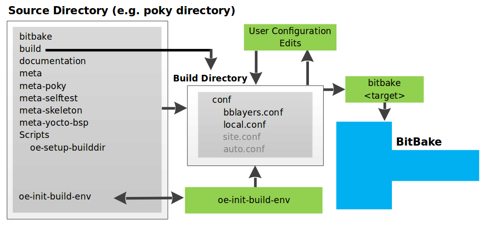

# Yocto

## 1. Giới thiệu Yocto project

Trước khi có Yocto Project (hoặc Buildroot), việc tạo một bản Linux cho hệ thống nhúng hoàn toàn thủ công như sau: tự tải kernel, rootfs và toolchain rồi build từng phần. Cách này rất dễ lỗi và khó bảo trì.

Yocto Project là một framework giúp xây dựng hệ điều hành Linux tùy biến cho hệ thống nhúng - hay nói ngắn gọn: Embedded Linux Distro Builder.

:::warning Yocto không phải là một Linux distro
Nó là bộ công cụ giúp tạo ra một bộ image hoàn chỉnh gồm: U-Boot, kernel, rootfs và SDK cross-compiler cho thiết bị target.
:::

## 2. Metadata - Các loại file cấu hình trong Yocto

Metadata là tập hợp tất cả các file mà BitBake đọc để biết cần build cái gì và build như thế nào. Dưới đây là tổng hợp các loại file metadata:

| Loại file                   | Phần mở rộng                      | Vai trò                                                          |
| --------------------------- | --------------------------------- | ---------------------------------------------------------------- |
| **Recipe**                  | `.bb`                             | Định nghĩa cách build một package                                |
| **Append**                  | `.bbappend`                       | Ghi đè hoặc mở rộng recipe đã có từ layer khác                   |
| **Class**                   | `.bbclass`                        | Gom logic build chung cho nhiều recipe                           |
| **Configuration**           | `.conf`                           | Thiết lập biến cấu hình: version, distro, machine, layer path    |
| **Layer configuration**     | `layer.conf`                      | Khai báo phạm vi và ưu tiên của layer                            |
| **Distro & Machine config** | `distro/*.conf`, `machine/*.conf` | Định nghĩa đặc trưng của bản phân phối và phần cứng mục tiêu     |

## 3. Setup môi trường build

### 3.1. Yêu cầu về host

| Resource   | Minimum | Recommended |
| --- | --- | --- |
| Disk space | 50GB    | 100 GB+     |
| RAM        | 8GB     | 16 GB+      | 
| CPU cores  | 4       | 8+          |
| OS         | Ubuntu 22.04 LTS   | Ubuntu 22.04 LTS   |
| First build time  | 2 đến 4 giờ (4 cores)   | 1 đến 2 giờ (hơn 8 core) |

### 3.2. Cài các package

```bash
sudo apt update
sudo apt install gawk wget git diffstat unzip texinfo gcc build-essential \
    chrpath socat cpio python3 python3-pip python3-pexpect xz-utils \
    debianutils iputils-ping python3-git python3-jinja2 python3-subunit \
    zstd liblz4-tool file locales libacl1
sudo locale-gen en_US.UTF-8
```

### 3.3. Clone poky

Clone repo poky với nhánh Scarthgap (5.0 LTS):

```bash
mkdir -p ~/yocto && cd ~/yocto
git clone -b scarthgap git://git.yoctoproject.org/poky.git
cd poky
```

### 3.4. Khởi tạo môi trường build

Trước khi sử dụng bất kỳ lệnh BitBake nào, ta bắt buộc phải khởi tạo môi trường build:

```bash
source oe-init-build-env [build-directory]
```

Trong đó:

- `source` là lệnh nội bộ của shell, nó khởi tạo các biến môi trường ngay trong shell hiện tại, tức là mọi biến môi trường sẽ chỉ có tác dụng trong chính shell đó và không có giá trị đối với các shell khác.
- `[build-directory]` là tùy chọn. Nếu không truyền, Yocto mặc định dùng thư mục `build/` nằm cùng cấp với `poky`.

Khi chạy, script này sẽ:
1. Set `$OEROOT`: Xác định thư mục gốc của yocto
2. Set $BUILDDIR : Chọn thư mục output (default sẽ là build, nhưng nếu chạy cho nhiều board thì nên chia riêng)
3. Thiết lập các biến môi trường: `BBPATH`, `TOPDIR`, `PATH`, `PYTHONPATH`.
4. Tạo cấu trúc thư mục `$BUILDDIR` nếu chưa tồn tại.
5. Trỏ terminal vào thư mục `$BUILDDIR`.



## 4. Cấu trúc thư mục build

Sau khi khởi tạo môi trường và chạy build, thư mục `build/` sẽ có cấu trúc như sau:

```
build/
├── cache/                          <- Cache metadata đã parse
├── conf/                           <- Cấu hình người dùng
│   ├── bblayers.conf
│   └── local.conf
├── downloads/                      <- Source code tải về
├── sstate-cache/                   <- Cache kết quả build
├── tmp/                            <- Toàn bộ output
│   ├── deploy/
│   │   ├── images/                 <- Image cuối cùng
│   │   ├── sdk/                    <- SDK (nếu build)
│   │   └── licenses/               <- License của package
│   ├── work/                       <- Thư mục làm việc của từng recipe
│   ├── sysroots/
│   ├── log/
│   └── pkgdata/
└── bitbake-cookerdaemon.log
```

### 4.1. `conf/` - Cấu hình người dùng

Đây là nơi BitBake đọc đầu tiên khi bắt đầu build.

| File            | Vai trò                                                                                                              |
| --------------- | -------------------------------------------------------------------------------------------------------------------- |
| `local.conf`    | Cấu hình build cụ thể: chọn `MACHINE`, `DISTRO`, đường dẫn `DL_DIR`, `SSTATE_DIR`, số luồng build, image feature,... |
| `bblayers.conf` | Liệt kê các layer mà BitBake sẽ load (meta, meta-poky, meta-ti, meta-custom,...).                                    |

### 4.2. `cache/` - Cache metadata

BitBake cache kết quả parse của các file `.bb`, `.bbclass`, `.conf` tại đây. Ở lần build sau, BitBake không cần parse lại - giúp tăng tốc build đáng kể.

Nếu thay đổi recipe hoặc class, BitBake sẽ tự động invalidate cache và parse lại phần bị thay đổi. Không cần xóa cache thủ công.

### 4.3. `downloads/` - Source code tải về

Chứa toàn bộ source code từ git clone, patch,... mà các recipe yêu cầu.

Mặc định đường dẫn được set trong `local.conf`:

```bash
DL_DIR ?= "${TOPDIR}/downloads"
```

:::tip
Có thể chia sẻ thư mục này giữa nhiều build để tiết kiệm thời gian và băng thông tải source. Chỉ cần trỏ `DL_DIR` về cùng một đường dẫn.
:::

### 4.4. `tmp/` - Toàn bộ kết quả build

Mọi thứ Yocto sinh ra đều nằm trong `/tmp/`.

**`tmp/deploy/` - Sản phẩm cuối cùng:**

| Thư mục con         | Vai trò                                                                                             |
| ------------------- | --------------------------------------------------------------------------------------------------- |
| `images/<machine>/` | Chứa các file image đã build: kernel, rootfs, u-boot, SD card image (`.wic`, `.ext4`, `.dtb`,...)   |
| `licenses/`         | Lưu license của từng package (theo quy định GPL).                                                   |
| `sdk/`              | Chứa SDK nếu chạy `bitbake -c populate_sdk`.                                                        |

**`tmp/work/` - Thư mục làm việc của từng recipe:**

Cấu trúc tổng quát:

```
tmp/work/
 └── <something>/                       ← Thư mục kiến trúc
      └── <package>/                    ← Thư mục package hoặc recipe
          └── <version>-r<revision>/
               ├── temp/                ← log từng task (do_compile, do_install...)
               │   └── log.do_<task>    ← log.do_fetch, log.do_unpack, log.do_patch,...
               ├── build/               ← Nơi biên dịch source
               └── image/               ← File sẽ cài vào rootfs
```

Từ cấu trúc trên, ta có một số thông tin như sau:
- Khi `do_compile`, BitBake thực hiện biên dịch tại folder `build/`.
- khi `do_install`, tất cả file mà recipe muốn cài vào root filesystem sẽ nằm ở folder `image/`.
- Log chi tiết của từng task nằm trong `temp/log.do_<task>` - rất hữu ích khi debug.

### 4.5. `sstate-cache/` - Shared State Cache

Đây là thư mục quan trọng nhất giúp tăng tốc build trong Yocto. Để hiểu rõ tại sao, ta cần biết cách Yocto build: mỗi recipe phải đi qua nhiều task. Mỗi task tốn thời gian, và nếu rebuild lại toàn bộ mỗi lần thì rất lãng phí.

**Cơ chế hoạt động:**

Khi một task build thành công, BitBake thực hiện:
1. Đóng gói toàn bộ output của task đó (binary, file cấu hình, metadata,...) vào một file `.tgz`.
2. Tính hash signature dựa trên toàn bộ input của task: source code, cấu hình biến, toolchain, dependency,...Mọi yếu tố ảnh hưởng đến kết quả build đều tham gia vào hash.
3. Lưu file `.tgz` vào `sstate-cache/` với tên file chứa hash.

Ở lần build tiếp theo, trước khi chạy bất kỳ task nào, BitBake sẽ:
1. Tính lại hash signature cho task đó.
2. Tìm trong `sstate-cache/` xem có file `.tgz` nào có hash khớp không.
3. Nếu hash khớp $\rightarrow$ giải nén output từ cache, bỏ qua hoàn toàn bước build $\rightarrow$ tiết kiệm rất nhiều thời gian.
4. Nếu hash không khớp (do source thay đổi, biến config thay đổi, dependency thay đổi,...) $\rightarrow$ build lại task đó từ đầu, rồi tạo file sstate mới thay thế.

**Cấu trúc bên trong `sstate-cache/`:**

```
sstate-cache/
├── aa/
│   └── sstate:busybox:cortexa8hf-neon-poky-linux-gnueabi:1.35.0:r0:do_compile:abcdef1234.tgz
├── bb/
│   └── sstate:glibc:cortexa8hf-neon-poky-linux-gnueabi:2.35:r0:do_install:567890abcd.tgz
└── ...
```

Mỗi file `.tgz` được đặt tên theo pattern: `sstate:<recipe>:<arch>:<version>:<revision>:<task>:<hash>.tgz`. Các thư mục con (`aa/`, `bb/`,...) là 2 ký tự đầu của hash, dùng để phân tán file tránh một thư mục chứa quá nhiều file.

**Ví dụ minh họa:**

Giả sử lần đầu build `busybox`, task `do_compile` mất 2 phút. BitBake lưu kết quả vào sstate. Lần build sau, nếu không thay đổi gì liên quan đến busybox (source, config, dependency), BitBake chỉ cần giải nén file `.tgz` trong vài giây thay vì compile lại 2 phút.

Nhưng nếu ta thay đổi `CFLAGS` trong `local.conf`, hash sẽ khác $\rightarrow$ BitBake compile lại busybox từ đầu.

:::tip Tăng tốc độ build cho cả team
Có thể chia sẻ `sstate-cache/` giữa nhiều máy build để tăng tốc build cho cả team. Chỉ cần đảm bảo các máy có cùng cấu hình build (toolchain version, distro features, `MACHINE`,...), nếu không hash sẽ khác và cache sẽ không được reuse.

```bash
# Trỏ sstate-cache về thư mục chung trên NFS hoặc server
SSTATE_DIR = "/shared/yocto/sstate-cache"
```
:::

:::warning Chú ý
Thư mục `sstate-cache/` sẽ phình to theo thời gian vì mỗi lần thay đổi config sẽ tạo file sstate mới (file cũ không tự xóa). Để dọn dẹp, dùng script:

```bash
# Xóa sstate cũ hơn 30 ngày
find sstate-cache/ -name "sstate-*" -mtime +30 -delete
```
:::

## 5. Một số cấu hình quan trọng

### 5.1. Machine

Machine xác định phần cứng target ta đang build. Giá trị này quyết định:
- Kiến trúc CPU (ARM, x86, MIPS, ...)
- Kernel và bootloader sẽ sử dụng là gì?
- Device tree nào được compile

Một số giá trị phổ biến:

```bash
MACHINE ?= "qemux86-64"        # QEMU giả lập x86
MACHINE ?= "qemuarm64"         # QEMU giả lập ARM64
MACHINE ?= "raspberrypi4-64"   # Raspberry Pi 4 (cần meta-raspberrypi)
MACHINE ?= "beaglebone"        # BeagleBone Black
```

:::tip Khi nào cần sửa machine?
Khi custom board mới: đổi kernel/device tree, thêm hoặc tắt feature liên quan đến phần cứng.
:::

### 5.2. Distribution policy

Distro là các policy quy định cách OS hoạt động:
- Init system: systemd, SysVinit,...
- C library: glibc, musl, uclibc,...
- Package manager: `rpm`, `deb`, `ipk`,...
- Các feature mặc định của hệ thống

```bash
DISTRO = "poky"           # distro mặc định của Yocto, dùng SysVinit
DISTRO = ""               # không dùng distro, tự cấu hình hoàn toàn
```

Để xem distro đang hỗ trợ những feature nào, ta dùng lệnh:

```bash
bitbake -e | grep "^DISTRO_FEATURES="
```

`DISTRO_FEATURES` định nghĩa các feature mà cả distro hỗ trợ. Nó là một khai báo mang tính chính sách - nói cho toàn bộ các recipe biết rằng distro này có hỗ trợ feature X hay không.

Trong `local.conf` hoặc distro config:

```bash
# Bỏ những feature không cần cho hệ thống embedded
DISTRO_FEATURES:remove = "x11 wayland bluetooth wifi pulseaudio"
```

Chỉ một dòng này có thể khiến hàng chục package liên quan không được build hoặc được build mà không có phần hỗ trợ tương ứng, giảm đáng kể kích thước image.

**Cách thêm/bớt feature đúng cách:**

```bash
# Thêm vào cuối (chú ý dấu cách đầu)
DISTRO_FEATURES:append = " systemd pam seccomp"

# Bỏ feature không cần
DISTRO_FEATURES:remove = "x11 wayland bluetooth pcmcia"

# Override hoàn toàn (không khuyến khích trong local.conf)
DISTRO_FEATURES = "ipv4 ipv6 wifi alsa systemd"
```

:::warning Chú ý
`DISTRO_FEATURES` ảnh hưởng đến compile-time - tức là feature bị remove sẽ không được compile vào binary, không chỉ đơn giản là ẩn đi.
:::

### 5.3. Định dạng package

Xác định format package được tạo ra khi build:

```bash
# Chọn 1 trong 3 loại
PACKAGE_CLASSES = "package_rpm"    # RPM - phổ biến nhất
PACKAGE_CLASSES = "package_deb"    # Debian package
PACKAGE_CLASSES = "package_ipk"    # nhẹ hơn, dùng cho embedded
```

Ảnh hưởng đến package manager nào được dùng trên image nếu bật `package-management`.

### 5.4. Tối ưu tốc độ build

```bash
BB_NUMBER_THREADS ?= "8"    # Số task BitBake chạy song song
PARALLEL_MAKE ?= "-j 8"     # Số job của make (truyền vào make -j)
```

Thông thường set bằng số CPU core:

```bash
BB_NUMBER_THREADS ?= "${@oe.utils.cpu_count()}"
PARALLEL_MAKE ?= "-j ${@oe.utils.cpu_count()}"
```

### 5.5. Cache để tăng tốc

```bash
# Nơi lưu source đã download
DL_DIR = "/opt/yocto/downloads"

# Shared State Cache - cache kết quả build
SSTATE_DIR = "${TOPDIR}/../sstate-cache"
```

Nếu ta có `sstate-cache` từ build trước, build lần sau nhanh hơn rất nhiều vì BitBake chỉ build những gì thay đổi.

Nên đặt `DL_DIR` và `SSTATE_DIR` ra ngoài thư mục build để dùng chung giữa nhiều build:

```bash
DL_DIR ?= "/opt/yocto/downloads"
SSTATE_DIR ?= "/opt/yocto/sstate-cache"
```

### 5.6. Thêm package vào image

Ta có thể thêm package vào image mà không cần sửa recipe image như sau:

```bash
IMAGE_INSTALL:append = " vim curl python3 myapp"
```

Tuy nhiên, thay vì liệt kê từng package, ta có thể tạo một packagegroup như sau:

```bash
# packagegroup-myapp.bb
inherit packagegroup

RDEPENDS:${PN} = " \
    vim \
    curl \
    python3 \
    myapp \
"
```

Rồi ta chỉ cần:

```bash
IMAGE_INSTALL = "packagegroup-myapp"
```

Đây là cách các image lớn như `core-image-full-cmdline` tổ chức packages.

:::warning Chú ý
Ta phải thêm dấu cách trước tên package vì `IMAGE_INSTALL` đã được định nghĩa sẵn trong image recipe (ví dụ `core-image-minimal`), cho nên `IMAGE_INSTALL` trong file `local.conf` chỉ là mở rộng của nó.

```bash
IMAGE_INSTALL:append = " openssh"   # ✓ đúng
IMAGE_INSTALL:append = "openssh"    # ✗ sai
```
:::

### 5.7. Thêm package vào target sysroot

`TOOLCHAIN_TARGET_TASK` là biến quyết định những package được cài vào phần target sysroot của SDK.

Khi ta chạy:

```bash
bitbake <image> -c populate_sdk
```

SDK được tạo ra gồm 2 phần:

```
SDK/
├── sysroots/
│   ├── x86_64-pokysdk-linux/        ← HOST sysroot   (cross-compiler, tools)
│   └── aarch64-poky-linux/          ← TARGET sysroot (libraries, headers của board)
```

**Tình huống thực tế:**

Ta build image cho board BBB, image có `mosquitto`. Nhưng khi developer dùng SDK để compile app cần link với `mosquitto`, họ bị lỗi:

```
error: mosquitto.h: No such file or directory
```

Nguyên nhân: `mosquitto-dev` (chứa headers) chưa có trong target sysroot của SDK.

Giải pháp lúc này là:

```bash
# Thêm vào local.conf hoặc distro config
TOOLCHAIN_TARGET_TASK:append = " mosquitto-dev"
```

### 5.8. Bật/tắt feature của một recipe cụ thể

`PACKAGECONFIG` là một cơ chế trong Yocto cho phép ta bật/tắt các feature tùy chọn của một recipe mà không cần sửa trực tiếp recipe đó. Nó hoạt động bằng cách ánh xạ mỗi feature thành các tham số build tương ứng (configure flags, dependency, ...).

Nguyên tắc cốt lõi về `PACKAGECONFIG`:
- Định nghĩa feature -> khai báo arg bật/tắt
- Bật feature bằng cách đưa tên vào `PACKAGECONFIG`
- BitBake tự gom arg -> gán vào `EXTRA_OECMAKE` (cmake) hoặc `EXTRA_OECONF` (autotools)

Ngoài việc truyền arg vào build system, `PACKAGECONFIG` còn tự động điều chỉnh `DEPENDS` và `RDEPENDS`:

```bash
PACKAGECONFIG[compress] = "-DENABLE_COMPRESS=ON, -DENABLE_COMPRESS=OFF, zlib, zlib"
```

Nghĩa là khi ta bật feature `compress`:

```
Bật compress
    ├── cmake nhận -DENABLE_COMPRESS=ON      <- ảnh hưởng compile
    ├── DEPENDS += "zlib"                    <- zlib phải có trước khi build
    └── RDEPENDS:${PN} += "zlib"             <- zlib được kéo vào image
```

**Mỗi feature được định nghĩa theo dạng:**

```bash
PACKAGECONFIG[feature] = " \
    <arg nếu bật>, \    # truyền vào configure option khi bật feature
    <arg nếu tắt>, \    # truyền vào configure option khi tắt feature 
    <build deps>, \     # DEPENDS thêm vào khi bật feature
    <runtime deps>, \   # RDEPENDS thêm vào khi tắt feature
    <build deps khi tắt>, \   # hiếm dùng
    <runtime deps khi tắt>"   # hiếm dùng
```

**Ví dụ thực tế:**

Giả sử recipe `curl` có định nghĩa:

```bash
PACKAGECONFIG[ssl] = "--with-ssl, --without-ssl, openssl"
PACKAGECONFIG[zlib] = "--with-zlib, --without-zlib, zlib"
PACKAGECONFIG[ipv6] = "--enable-ipv6, --disable-ipv6"
```

Mặc định recipe có thể bật sẵn:

```bash
PACKAGECONFIG ?= "ssl zlib"
```

Nghĩa là `ssl` và `zlib` được bật, `ipv6` bị tắt. Khi build, Yocto sẽ tự động thêm `--with-ssl`, `--with-zlib`, `--disable-ipv6` vào lệnh configure, đồng thời kéo `openssl` và `zlib` trước khi build.

Trong file `.bbappend` hoặc `local.conf`, ta có thể thực hiện tùy chỉnh:

```bash
# Ghi đè hoàn toàn - chỉ bật ssl, tắt hết còn lại
PACKAGECONFIG:pn-curl = "ssl"

# Thêm feature vào danh sách hiện có
PACKAGECONFIG:append:pn-curl = " ipv6"

# Bỏ feature khỏi danh sách hiện có
PACKAGECONFIG:remove:pn-curl = "zlib"
```

**Hiểu về `PACKAGECONFIG` có thể giúp ta tối ưu dung lượng**

Khi ta tắt một feature qua `PACKAGECONFIG`, hai điều xảy ra:
- Phần code liên quan không được biên dịch vào binary -> binary nhỏ hơn
- Dependency của feature đó không bị kéo vào image. Ví dụ tắt `ssl` thì `openssl` không cần cài nữa -> tiết kiệm vài MB

Nói ngắn gọn, `PACKAGECONFIG` là cách yocto cho cho phép ta chỉ bật đúng những gì cần, bỏ phần thừa, từ đó giảm kích thước binary lẫn số lượng dependency trong image.

**Cách xem recipe hỗ trợ những feature nào**

```bash
# Xem giá trị PACKAGECONFIG hiện tại của một recipe
bitbake -e <recipe> | grep ^PACKAGECONFIG=
```

**Điểm khác biệt với `DISTRO_FEATURES`**

`DISTRO_FEATURES` mang tính toàn cục, ảnh hưởng đến nhiều recipe cùng lúc. Khi ta thêm hay bỏ một giá trị trong `DISTRO_FEATURES`, hàng chục recipe có thể thay đổi hành vi theo. Ngược lại, `PACKAGECONFIG` chỉ tác động lên đúng một recipe.

Ví dụ cụ thể: khi ta bỏ bluetooth khỏi `DISTRO_FEATURES`, tất cả recipe kiểm tra feature này (như systemd, bluez5...) đều tự động tắt phần hỗ trợ bluetooth của chúng. Ta không cần sửa từng recipe một.

**Cơ chế liên kết giữa `DISTRO_FEATURES` và `PACKAGECONFIG`**

Các recipe thường dùng `DISTRO_FEATURES` để tự điều chỉnh `PACKAGECONFIG`. Trong recipe, ta sẽ thấy dạng như:

```bash
PACKAGECONFIG = "${@bb.utils.filter('DISTRO_FEATURES', 'bluetooth wifi', d)}"
```

Dòng này nghĩa là: Nếu `DISTRO_FEATURES` chứa bluetooth thì bật `PACKAGECONFIG[bluetooth]`, nếu chứa wifi thì bật `PACKAGECONFIG[wifi]`. Vậy `DISTRO_FEATURES` đóng vai trò đầu vào, còn `PACKAGECONFIG` là nơi thực thi cụ thể ở từng recipe.

### 5.9. Cấu hình `FILESEXTRAPATHS`

Khi BitBake xử lý một file, nó cần phải biết tìm file đó ở đâu. Nó sẽ tìm theo một danh sách thư mục được định nghĩa sẵn gọi là `FILESPATH`.

Mặc định `FILESPATH` trông như sau:

```
<recipe-dir>/files/
<recipe-dir>/<PN>/
<recipe-dir>/<PN>-<PV>/
<recipe-dir>/           <- thư mục chứa file .bb
```

$\rightarrow$ `FILESEXTRAPATHS` cho phép ta thêm thư mục tìm kiếm vào danh sách này.

**Tại sao cần `FILESEXTRAPATHS`**

Một tình huống thực tế, ta có recipe gốc:

```
meta-example/
└── recipes-example/
    └── netlogger/
        ├── netlogger_1.0.bb
        └── files/
            └── netlogger.c
```

Khi ta muốn thêm một file config từ layer của mình qua `.bbappend` mà không đụng vào layer gốc:

```
meta-myproduct/
└── recipes-example/
    └── netlogger/
        ├── netlogger_%.bbappend
        └── myfiles/              <- thư mục riêng của bạn
            └── netlogger.conf
```

Vấn đề ở đây là BitBake mặc định sẽ không biết cách tìm trong `myfiles/` của ta, cho nên ta cần phải khai báo qua `FILESEXTRAPATHS.`

Cú pháp

```bash
# Thêm thư mục vào đầu danh sách tìm kiếm
FILESEXTRAPATHS:prepend := "${THISDIR}/myfiles:"
```

Hai điểm quan trọng:
1. Dùng `:=` thay vì `=`

    ```bash
    FILESEXTRAPATHS:prepend := "${THISDIR}/myfiles:"   # đúng
    FILESEXTRAPATHS:prepend  = "${THISDIR}/myfiles:"   # sai
    ```

2. Phải có dấu `:` ở cuối

    ```bash
    FILESEXTRAPATHS:prepend := "${THISDIR}/myfiles:"   # đúng - có dấu :
    FILESEXTRAPATHS:prepend := "${THISDIR}/myfiles"    # sai - thiếu dấu :
    ```

    Dấu `:` là ký tự phân cách giữa các path trong danh sách.

**prepend và append**

Có hai operator cho `FILESEXTRAPATHS` là prepend và append, mỗi cái sẽ báo cho bitbake phải tìm file như thế nào khác nhau.

```bash
# Danh sách tìm kiếm mặc định (FILESPATH):
# [files/] [<PN>/] [<PN>-<PV>/] [<recipe-dir>/]
#  ←──────────────────────────────── tìm từ trái qua phải

FILESEXTRAPATHS:prepend := "${THISDIR}/myfiles:"
# Kết quả: [myfiles/] [files/] [<PN>/] [<PN>-<PV>/] [<recipe-dir>/]
# Nghĩa là file được thêm vào đầu -> được tìm đầu tiên

FILESEXTRAPATHS:append := ":${THISDIR}/myfiles"
# Kết quả: [files/] [<PN>/] [<PN>-<PV>/] [<recipe-dir>/] [myfiles/]
# Nghĩa là file được thêm vào CUỐI -> tìm cuối cùng
```

Giả sử cả `files/` và `myfiles/` đều có file netlogger.conf:

```
files/netlogger.conf      <- file gốc từ recipe
myfiles/netlogger.conf    <- file ta muốn override
```

```bash
# Dùng :prepend -> myfiles/ được tìm trước -> dùng file của ta
FILESEXTRAPATHS:prepend := "${THISDIR}/myfiles:"

# Dùng :append -> files/ được tìm trước -> vẫn dùng file gốc
FILESEXTRAPATHS:append := ":${THISDIR}/myfiles"
```

:::warrning Kết luận
Trong `.bbappend` luôn dùng operator `prepend` thay vì `append` để nó override file gốc.
:::

### 5.10. Placeholder trong file template

Đầu tiên, ta cần hiểu rằng placeholder là ký hiệu giữ chỗ được thay thế bằng giá trị thực tế tại thời điểm build. Trong Yocto có nhiều loại placeholder khác nhau tùy ngữ cảnh. Tuy nhiên, trong phần này ta chỉ nói về placeholder trong file template/script.

**Tại sao cần file template?**

Giả sử ta có file config `/etc/netlogger.conf` cần được cài lên board, nhưng nội dung của nó phụ thuộc vào môi trường build:

```ini
# Vấn đề: các giá trị này khác nhau tùy MACHINE, DISTRO, version,...
[netlogger]
binary  = /usr/bin/netlogger     # bindir có thể là /bin trên poky-tiny
version = 1.0                    # thay đổi theo PV
logdir  = /var/log/netlogger     # localstatedir có thể khác
```

Ta không thể hardcode vì:
- `bindir` có thể là `/usr/bin` hoặc `/bin` tùy distro
- `PV` thay đổi mỗi khi nâng version
- `sysconfdir` có thể khác nhau tùy cấu hình

Giải pháp ở đây là dùng file template với placeholder, để build system điền. Một file template sẽ có đuôi là `.in`.

Để có thể thay thế placeholder trong file template thì cách đơn giản nhất là sử dụng `sed` trong task `do_install`.

```bash
sed 's|pattern|replacement|flags'
# hoặc
sed 's#pattern#replacement#flags'
```

**Ví dụ**

File template `netlogger.conf.in`:

```ini
[netlogger]
binary      = @BINDIR@/netlogger
version     = @VERSION@
logdir      = @LOCALSTATEDIR@/log/netlogger
sysconfdir  = @SYSCONFDIR@/netlogger
num_threads = @NUM_THREADS@
```

Trong recipe:

```bash
SRC_URI = " \
    file://netlogger.c \
    file://netlogger.conf.in \
"

do_install() {
    # Bước 1 - thay thế placeholder
    sed -e 's|@BINDIR@|${bindir}|g' \
        -e 's|@VERSION@|${PV}|g' \
        -e 's|@LOCALSTATEDIR@|${localstatedir}|g' \
        -e 's|@SYSCONFDIR@|${sysconfdir}|g' \
        -e 's|@NUM_THREADS@|4|g' \
        ${WORKDIR}/netlogger.conf.in > ${WORKDIR}/netlogger.conf

    # Bước 2 - install file đã được điền vào
    install -d ${D}${sysconfdir}/netlogger
    install -m 0644 ${WORKDIR}/netlogger.conf ${D}${sysconfdir}/netlogger/netlogger.conf
}
```

Kết quả file trên board:

```ini
[netlogger]
binary      = /usr/bin/netlogger
version     = 1.0
logdir      = /var/log/netlogger
sysconfdir  = /etc/netlogger
num_threads = 4
```

Tuy nhiên, không phải lúc nào việc thay thế placeholder cũng đơn giản như vậy, một số trường hợp cần logic phực tạp hơn thì ta sẽ sử dung python inline.

Ví dụ file template `netlogger.conf.in`:

```ini
[netlogger]
binary   = @BINDIR@/netlogger
loglevel = @LOGLEVEL@
features = @FEATURES@
```

Trong recipe - dùng Python để build chuỗi features:

```bash
# Hàm Python tính toán giá trị trước khi thay thế
def get_features(d):
    features = []
    packageconfig = d.getVar('PACKAGECONFIG') or ''

    if 'json' in packageconfig:
        features.append('json')
    if 'syslog' in packageconfig:
        features.append('syslog')
    if 'compress' in packageconfig:
        features.append('compress')

    # Trả về dạng "json,syslog" hoặc "none"
    return ','.join(features) if features else 'none'

do_install() {
    FEATURES="${@get_features(d)}"
    LOGLEVEL="${@'debug' if d.getVar('DEBUG_BUILD') == '1' else 'info'}"

    sed -e "s|@BINDIR@|${bindir}|g" \
        -e "s|@LOGLEVEL@|${LOGLEVEL}|g" \
        -e "s|@FEATURES@|${FEATURES}|g" \
        ${WORKDIR}/netlogger.conf.in \
        > ${WORKDIR}/netlogger.conf

    install -d ${D}${sysconfdir}/netlogger
    install -m 0644 ${WORKDIR}/netlogger.conf ${D}${sysconfdir}/netlogger/
}
```

Kết quả nếu bật `json` và `syslog`:

```ini
[netlogger]
binary   = /usr/bin/netlogger
loglevel = info
features = json,syslog
```

:::tip Bổ sung
Ta cũng có thể sử dụng CMake hoặc autotools để thực hiện thay placeholder trong file template.
:::

## 6. BitBake

### 6.1. BitBake là gì?

BitBake là một build engine cốt lõi của Yocto. Nếu ví Yocto như một nhà máy sản xuất Linux thì BitBake chính là người quản đốc - nó không tự viết code hay compile, nhưng nó điều phối mọi thứ: đọc công thức (recipe), kiểm tra nguyên vật liệu (dependency), sắp xếp thứ tự sản xuất (task graph), và phân công công nhân (parallel build).

**So sánh với `make`:** Cả hai đều là build system, nhưng `make` chỉ xử lý được một project đơn lẻ (compile file C $\rightarrow$ binary). BitBake được thiết kế để quản lý hàng nghìn package cùng lúc, với dependency chằng chịt giữa chúng, và mỗi package có thể lấy source từ nguồn khác nhau (git, tarball, file local,...).

**Quy trình làm việc của BitBake:**
 
Khi ta gõ `bitbake core-image-minimal`, BitBake sẽ thực hiện theo trình tự:
1. Parse cấu hình: Đọc `local.conf` và `bblayers.conf` để biết `MACHINE`, `DISTRO`, danh sách layer.
2. Parse metadata: Quét tất cả layer, đọc toàn bộ file `.bb`, `.bbappend`, `.bbclass`, `.conf` để xây dựng "bức tranh toàn cảnh" về mọi recipe có sẵn.
3. Phân giải target: Từ target `core-image-minimal`, BitBake tìm recipe tương ứng, rồi đệ quy tìm toàn bộ dependency (DEPENDS, RDEPENDS) để biết cần build những gì.
4. Xây dựng Task Graph: Sắp xếp tất cả task của tất cả recipe thành một DAG (Directed Acyclic Graph) - đồ thị có hướng không chu trình. Task nào phụ thuộc task nào sẽ chạy trước.
5. Kiểm tra sstate-cache: Với mỗi task, BitBake kiểm tra xem kết quả đã có trong cache chưa. Nếu có → bỏ qua. Nếu không → đưa vào hàng đợi để thực thi.
6. Thực thi song song: BitBake chạy các task song song (theo `BB_NUMBER_THREADS`) nếu chúng không phụ thuộc nhau. Ví dụ: `do_compile` của `busybox` và `do_compile` của `nano` có thể chạy cùng lúc.
7. Đóng gói image: Sau khi tất cả recipe đã build xong, BitBake chạy các task tạo rootfs, đóng gói thành file image cuối cùng.

### 6.2. Cú pháp lệnh

```
bitbake [options] <target>
bitbake <target> [options]
```

Trong đó:
- `<target>` là recipe hoặc image cần build, ví dụ: `core-image-minimal`, `meta-toolchain`.
- `[options]` là các tham số điều khiển hành vi của Bitbake.

### 6.3. Bảng tổng hợp các lệnh BitBake

| Lệnh                                | Mô tả                                                | Khi nào dùng?                              |
| ----------------------------------- | ---------------------------------------------------- | ------------------------------------------ |
| `bitbake <target>`                  | Build recipe hoặc image                              | Build bình thường                           |
| `bitbake -c <task> <target>`        | Chạy một task cụ thể: compile, install, cleanall,... | Debug từng bước, chạy lại 1 task            |
| `bitbake -c clean <target>`         | Xóa kết quả build recipe (trong `tmp/work`)          | Muốn build lại sạch                         |
| `bitbake -c listtasks <target>`     | Liệt kê toàn bộ task mà recipe hỗ trợ                | Xem recipe có những task nào                |
| `bitbake -c cleansstate <target>`   | Xóa cả shared-state cache lẫn kết quả build          | Khi `clean` chưa đủ, cần xóa triệt để      |
| `bitbake -e <target>`               | In toàn bộ biến môi trường sau khi parse recipe      | Debug giá trị biến, tìm WORKDIR, S, D,...    |
| `bitbake -p <target>`               | Chỉ parse metadata, không build                      | Kiểm tra cú pháp recipe có lỗi không        |
| `bitbake -f <target>`               | Force rebuild, bỏ qua check sstate                   | Khi sửa source trực tiếp trong tmp/work     |
| `bitbake -c devshell <target>`      | Mở một shell trong môi trường build của recipe       | Debug compile, chạy thử lệnh trong env build |

:::tip Phân biệt `clean` vs `cleansstate`
- `bitbake -c clean <recipe>` chỉ xóa thư mục `tmp/work/<...>/<recipe>/` - kết quả build cục bộ.
- `bitbake -c cleansstate <recipe>` xóa thêm cả file `.tgz` trong `sstate-cache/` - buộc BitBake phải build lại từ đầu, kể cả khi có cache.
 
Dùng `cleansstate` khi nghi ngờ cache bị stale hoặc corrupt.
:::

## 7. Recipe

### 7.1. Recipe là gì?

Mỗi recipe (file `.bb`) là một công thức build mô tả toàn bộ cách build một gói phần mềm cụ thể. Nếu BitBake là quản đốc nhà máy thì recipe chính là bản vẽ kỹ thuật cho từng sản phẩm.

Recipe nói cho BitBake biết:
- Lấy source ở đâu - URL git, tarball, file local.
- Compile như thế nào - dùng gcc, cmake, autotools, hay script tùy chỉnh.
- Cài vào rootfs ra sao - file nào copy vào `/usr/bin`, file nào vào `/etc`.
- Phụ thuộc vào package nào - cần library gì, tool gì phải build trước.
- Thông tin đi kèm - license, version, mô tả, tác giả.

**Nói cách khác:**
- Recipe = công thức build cho 1 package
- Image = tập hợp của nhiều recipe ghép lại thành 1 hệ thống Linux hoàn chỉnh.

**Cấu trúc tên file recipe:**

```
<tên-package>_<version>.bb

ví dụ:
hello-world_1.0.bb
myapp_2.3.1.bb
```

### 7.2. Cấu trúc của một recipe

Cấu trúc cơ bản của một recipe sẽ gồm các thành phần sau:

| Thành phần                             | Vai trò                                                 |
| -------------------------------------- | ------------------------------------------------------  |
| **Biến (`VARIABLES`)**                 | Thông tin cấu hình: `SRC_URI`, `DEPENDS`, `LICENSE`,... |
| **Task (`do_*`)**                      | Hành động: fetch, compile, install, package,...         |
| **Inheritance (`inherit ...`)**        | Kế thừa logic từ `.bbclass`                             |
| **Dependency (`DEPENDS`, `RDEPENDS`)** | Xác định packet cần build trước hoặc cài cùng.          |
| **Output Packages (`PACKAGES`)**       | Xác định các gói nhỏ sinh ra từ recipe.                 |

Ví dụ recipe đơn giản:

```bash
DESCRIPTION = "Simple Hello World Application"
LICENSE = "MIT"
LIC_FILES_CHKSUM = "file://LICENSE;md5=1e9e7..."

SRC_URI = "file://main.c"

S = "${WORKDIR}"

do_compile() {
    ${CC} ${CFLAGS} main.c -o hello
}

do_install() {
    install -d ${D}${bindir}
    install -m 0755 hello ${D}${bindir}/hello
}
```

### 7.3. Vòng đời của một recipe (Task Graph)

Mỗi recipe đi qua một chuỗi task chuẩn theo thứ tự:

```
fetch → unpack → patch → configure → compile → install → package
```

#### 7.3.1. do_fetch: Tải source code

Task đầu tiên trong vòng đời recipe, chịu trách nhiệm tải source code hoặc patch cần thiết từ các vị trí được định nghĩa trong biến `SRC_URI`.

Cú pháp của biến `SRC_URI`:

```bash
SRC_URI = "<protocol>://<location>;<params>"
```

Với mỗi loại URI sẽ được xử lý theo cách thức khác nhau.
- `file://` - File cục bộ.
- `git://` - Git repository.
- `https://` - Tải qua HTTPS.

Khi `do_fetch` hoàn thành, BitBake tạo file `.done_fetch` trong `${WORKDIR}` để đánh dấu task đã xong. Nhờ đó, lần build sau sẽ bỏ qua bước fetch nếu source không thay đổi.

#### 7.3.2. do_unpack: Giải nén source
 
Giải nén source code từ `${DL_DIR}` vào `${WORKDIR}`. Nếu source là git repo, BitBake checkout đúng commit được chỉ định bởi `SRCREV`. Nếu là tarball, giải nén vào thư mục con trong `${WORKDIR}`.

#### 7.3.3. do_patch: Apply patch vào source

Trong yocto, kernel source không nằm cố định ở một nơi, mà nó được tải động thông qua recipe có thể là `linux-yocto.bb`, `linux-ti-staging.bb` hoặc các recipe tương tự khác. Do đó, sau mỗi lần build image thì yocto sẽ unpack lại source mới -> Bởi vì nguyên nhân này mà khi thay đổi source code thì ta cần force compile để không bị mất code:

```bash
bitbake -f -c compile <recipe>
```

Tuy nhiên, điều này chỉ có thể làm trên máy local, ta không thể đẩy code lên server hay repo để dev khác sử dụng được -> Ta cần sử dụng task `do_patch`.

Task này sẽ apply các file `.patch` được liệt kê trong `SRC_URI` vào source code. Đây là cơ chế quan trọng để custom source code hoặc fix bug trước khi compile. Thứ tự apply patch đúng theo thứ tự liệt kê trong `SRC_URI`.
 
#### 7.3.4. do_configure: Cấu hình trước khi compile

Chạy bước cấu hình cho project, ví dụ:
- Với CMake project $\rightarrow$ chạy `cmake` để generate Makefile.
- Với Autotools project $\rightarrow$ chạy `./configure`.
- Với Meson project $\rightarrow$ chạy `meson setup`.

Task này thường được cung cấp dưới dạng class kế thừa (`inherit cmake`, `inherit autotools`,...). Nếu recipe không inherit class nào, ta có thể tự viết `do_configure()`.

#### 7.3.5. do_compile: Biên dịch source code

Chạy lệnh compile. Mặc định chạy `oe_runmake` (tương đương `make`), nhưng ta có thể override hoàn toàn:

```bash
do_compile() {
    ${CC} ${CFLAGS} ${LDFLAGS} -o myapp src/main.c src/utils.c
}
```

Quá trình compile diễn ra trong thư mục `${B}` (Build directory).
 
#### 7.3.6. do_install: Cài đặt vào staging directory

Copy các file cần thiết (binary, library, config, header,...) vào staging directory `${D}`. Đây không phải rootfs thật - chỉ là thư mục tạm để BitBake biết recipe muốn cài gì.

```bash
do_install() {
    install -d ${D}${bindir}
    install -m 0755 ${WORKDIR}/myapp ${D}${bindir}/myapp
 
    install -d ${D}${sysconfdir}
    install -m 0644 ${WORKDIR}/myapp.conf ${D}${sysconfdir}/myapp.conf
}
```

Trong đó:
- `${WORKDIR}` : thư mục làm việc tạm thời trong quá trình build chứa source files, patches, và files từ SRC_URI. Ví dụ: `tmp/work/cortexa8hf-.../swupdate/2021.11/`
- `${D}` : destination directory, thư mục giả lập root filesystem, mọi thứ install vào đây sẽ được đóng gói vào image. Ví dụ: `tmp/work/cortexa8hf-.../swupdate/2021.11/image/`

Lệnh `install` là lệnh Unix copy file nhưng có thêm khả năng set permission ngay lúc copy hoặc tạo thư mục đích nếu cần.
- `-d`: tạo thư mục, không copy file (lệnh này tạo đệ quy, tương đương `mkdir -p` nên không báo lỗi nếu thư mục đã tồn tại)
- `-m 0644`: Set permission cho file được install

Để dễ hiểu hơn, ta xem luồng hoạt động của ví dụ trên:

```
WORKDIR                     D (destination)
──────────                  ─────────────────────
myapp         ──install──►  /bindir/myapp
myapp.conf    ──install──►  /sysconfdir/myapp.cfg
                                    ↓
                            đóng gói vào rootfs image
                                    ↓
                            thiết bị thấy tại /bin/ và /etc/
```

:::warning Chú ý
Mọi file muốn xuất hiện trong rootfs đều phải được copy vào `${D}` trong `do_install()`. Nếu quên copy, file sẽ không có trong image cuối cùng dù đã compile thành công.
:::

#### 7.3.7. do_package: Chia output thành các package con

Sau khi `do_install` chạy xong, `${D}` chứa tất cả mọi thứ của một recipe:

```
${D}/
├── usr/bin/myapp
├── usr/lib/libmyapp.so
├── usr/lib/libmyapp.so.1
├── usr/include/myapp.h
└── usr/share/doc/myapp/README
```

Vấn đề là không phải lúc nào ta cũng muốn đưa tất cả vào image. Ví dụ:
- Board production $\rightarrow$ chỉ cần binary, không cần header hay doc
- Board development $\rightarrow$ cần thêm header để compile

Vì vậy `do_package` lấy toàn bộ file trong `${D}` và chia thành các package con:

BitBake có sẵn quy tắc mặc định theo `${PN}`:

```bitbake
FILES:${PN}        = "${bindir}/*"                  # myapp       ← binary
FILES:${PN}-lib    = "${libdir}/lib*.so.*"          # myapp-lib   ← shared lib
FILES:${PN}-dev    = "${libdir}/*.so ${includedir}" # myapp-dev   ← header file, .so symlink
FILES:${PN}-doc    = "${docdir}/*"                  # myapp-doc   ← documentation
FILES:${PN}-dbg    = "${bindir}/.debug/*"           # myapp-dbg   ← debug symbols
```

Kết quả sau `do_package`:

```
myapp        → usr/bin/myapp
myapp-lib    → usr/lib/libmyapp.so.1
myapp-dev    → usr/lib/libmyapp.so usr/include/myapp.h
myapp-doc    → usr/share/doc/myapp/README
```

Trong đó:
- `${PN}` - Package chính chứa binary và file runtime.
- `${PN}-dev` - Header files và `.so` symlink (dùng khi compile package khác).
- `${PN}-dbg` - Debug symbols.
- `${PN}-doc` - Man pages, documentation.
- `${PN}-staticdev` - Static libraries (`.a`).

Ngoài ra, ta cũng có thể tự định nghĩa lại package thay vì dùng mặc định dựa trên biến `PACKAGES`:

```bash
# Tạo package con hoàn toàn mới
PACKAGES =+ "myapp-plugins"
FILES:myapp-plugins = "${libdir}/myapp/plugins/*"
```

Tức là ta có thể đặt tên package tùy ý, không bắt buộc phải theo pattern `${PN}-dev`, `${PN}-lib`,...

#### 7.3.8. do_rootfs: Đưa package vào root filesystem

Khi ta build image với config:

```bitbake
# core-image-minimal.bb
IMAGE_INSTALL += "myapp"
```

BitBake chạy `do_rootfs`, lấy package `myapp` và các dependency của nó, giải nén/merge tất cả vào một thư mục rootfs duy nhất:

```
build/tmp/work/.../core-image-minimal/rootfs/
├── usr/
│   └── bin/
│       └── myapp        ← từ package myapp
│       └── bash         ← từ package bash
├── etc/
│   └── myapp.conf       ← từ package myapp
│   └── passwd           ← từ package base-files
└── lib/
    └── ...
```

#### 7.3.9. do_image: Đóng gói thành image file

Rootfs đó được đóng gói thành file image tùy format:

```
core-image-minimal.ext4    ← ext4 filesystem
core-image-minimal.wic     ← disk image có partition table
core-image-minimal.tar.gz  ← tarball
```

Rồi flash lên board, khi board boot lên thì rootfs đó chính là `/` của hệ thống.

### 7.4. Từ khóa inherit

`inherit` dùng để import một class (`.bbclass`) vào trong recipe `.bb`.

Ví dụ:

```bitbake
inherit cmake_qt5
```

Khi gặp dòng này, BitBake sẽ:
1. Tìm file `cmake_qt5.bbclass` trong thư mục `classes/` nằm bên trong mỗi layer được khai báo (`bblayers.conf`).
2. Đọc toàn bộ nội dung file class đó.
3. Gộp nội dung vào recipe hiện tại.
4. Tích hợp vào pipeline build - các task `do_configure`, `do_compile`,... sẽ kế thừa logic từ class.

Ví dụ, class `cmake_qt5` cung cấp task `do_configure` sẽ tự gọi:

```bash
cmake \
   -DCMAKE_BUILD_TYPE=Release \
   -DCMAKE_TOOLCHAIN_FILE=...
```

Ngoài ra, ta có thể override task sau khi inherit:

```bitbake
inherit cmake

# Override do_install của cmake, viết lại theo ý mình
do_install() {
    install -d ${D}${bindir}
    install -m 0755 myapp ${D}${bindir}/
}
```

:::warning Chú ý
Nếu 2 layer cùng có một file `.bbclass` trùng tên thì sẽ lấy file `.bbclass` của layer có priority cao hơn.
:::

### 7.5. Các biến quan trọng

#### 7.5.1. Nhóm thông tin cơ bản

| Biến                 | Vai trò                                                                                      | Ví dụ                                                  |
| -------------------- | -------------------------------------------------------------------------------------------- | ------------------------------------------------------ |
| `SUMMARY`            | Mô tả ngắn gọn (1 dòng) về recipe                                                            | `"MQTT broker and client"`                             |
| `DESCRIPTION`        | Mô tả chi tiết hơn                                                                           | `"Mosquitto is an open source MQTT broker"`            |
| `HOMEPAGE`           | URL trang chủ của project                                                                    | `"https://mosquitto.org/"`                             |
| `LICENSE`            | Loại license của source code                                                                 | `"MIT"`, `"GPLv2"`, `"Apache-2.0"`                     |
| `LIC_FILES_CHKSUM`   | Đường dẫn đến file license kèm checksum MD5 - BitBake dùng để **xác minh** license không bị thay đổi | `"file://LICENSE;md5=abc123..."`               |

#### 7.5.2. Nhóm source code

| Biến        | Vai trò                                                                 | Ví dụ                                                            |
| ----------- | -----------------------------------------------------------------       | ---------------------------------------------------------------- |
| `SRC_URI`   | Danh sách URL nơi lấy source code, patch, file config,...                 | `"git://github.com/user/app.git;branch=main;protocol=https"`     |
| `SRCREV`    | Commit hash cụ thể khi dùng git                                         | `"abcdef1234567890abcdef1234567890abcdef12"`                     |
| `SRC_URI[sha256sum]` | Checksum của tarball để xác minh tính toàn vẹn file tải về     | `"a1b2c3d4e5f6..."`                                              |

#### 7.5.3. Nhóm WORKDIR - Các thư mục build

Đây là nhóm biến mà BitBake tự tính toán dựa trên tên recipe, version và kiến trúc target. Ta thường dùng chúng trong `do_compile()` và `do_install()`.

| Biến      | Ý nghĩa                                         | Ví dụ giá trị                         |
| --------- | ----------------------------------------------- | ------------------------------------- |
| `WORKDIR` | Thư mục làm việc chính của recipe               | `tmp/work/.../myapp/1.0-r0/`          |
| `S`       | Source directory - nơi chứa source sau unpack   | `${WORKDIR}/git` hoặc `${WORKDIR}`    |
| `B`       | Build directory - nơi compiler chạy             | `${WORKDIR}/build`                    |
| `D`       | Destination directory - staging install         | `${WORKDIR}/image`                    |
| `T`       | Temp/log directory                              | `${WORKDIR}/temp`                     |
| `PN`      | Package name (tên recipe)                       | `myapp`                               |
| `PV`      | Package version                                 | `1.0`                                 |
| `PR`      | Package revision                                | `r0`                                  |
| `PF`      | Full name = PN + PV + PR                        | `myapp-1.0-r0`                        |

:::tip Khi nào cần set biến `S`?
- Nếu `SRC_URI` dùng `git://` $\rightarrow$ BitBake giải nén vào `${WORKDIR}/git`, nên cần: `S = "${WORKDIR}/git"`
- Nếu `SRC_URI` dùng tarball (`.tar.gz`) $\rightarrow$ BitBake giải nén vào `${WORKDIR}/<tên-thư-mục-trong-tarball>`, thường là `${WORKDIR}/${BPN}-${PV}` (mặc định, không cần set).
- Nếu `SRC_URI` chỉ có `file://main.c` (file đơn lẻ) $\rightarrow$ file nằm ngay `${WORKDIR}`, nên cần: `S = "${WORKDIR}"`
:::

#### 7.5.4. Nhóm Dependency

| Biến       | Vai trò                                                                                   | Ví dụ                                   |
| ---------- | ----------------------------------------------------------------------------------------- | --------------------------------------- |
| `DEPENDS`  | Build-time dependency - các package cần có khi compile. BitBake sẽ build chúng trước.     | `"qtbase qtmqtt mosquitto"`             |
| `RDEPENDS` | Runtime dependency - các package cần có khi chạy trên target. Sẽ được cài cùng vào image. | `RDEPENDS:${PN} = "mosquitto libcurl"`  |

`DEPENDS` hoạt động ở cấp recipe, còn `RDEPENDS` hoạt động ở cấp package. Một recipe có thể sinh ra nhiều package, nên `RDEPENDS` luôn cần chỉ rõ package nào đang được nói đến, vì vậy ta hay thấy cú pháp `RDEPENDS:${PN}` thay vì chỉ `RDEPENDS`.

Ví dụ recipe `curl` có thể sinh ra các package: `curl` (binary), `libcurl` (shared library), `curl-dev` (header). Mỗi package có thể có `RDEPENDS` riêng:

```bash
RDEPENDS:${PN} = "libcurl"                      # binary curl cần libcurl để chạy
RDEPENDS:libcurl = "openssl ca-certificates"    # libcurl cần openssl lúc runtime
```

Ngoài ra, `DEPENDS` không trực tiếp ảnh hưởng đến kích thước image vì nó chỉ tồn tại trên máy build. Nhưng `RDEPENDS` ảnh hưởng rất lớn, bởi vì mọi package trong `RDEPENDS` sẽ tự động bị kéo vào image. Và mỗi package đó lại có `RDEPENDS` của riêng nó, tạo thành một chuỗi phụ thuộc dây chuyền.

Ví dụ thực tế: ta thêm một ứng dụng nhỏ 200KB vào image, nhưng nó `RDEPENDS` lên `python3`, mà `python3` lại `RDEPENDS` lên hàng loạt module khác. Kết quả image phình thêm 30-40MB chỉ vì một ứng dụng nhỏ.
 
#### 7.5.5. Nhóm output và packaging
 
| Biến        | Vai trò                                                                                                 | Ví dụ                                                |
| ----------- | ------------------------------------------------------------------------------------------------------- | ---------------------------------------------------- |
| `PACKAGES`  | Danh sách các sub-package mà recipe tạo ra. Mặc định: `${PN}-dbg ${PN}-dev ${PN}-doc ${PN} ${PN}-staticdev` | `"${PN} ${PN}-dev ${PN}-clients"`                    |
| `FILES:${PN}` | Danh sách file/thư mục thuộc về package chính                                                         | `FILES:${PN} = "${bindir}/myapp ${sysconfdir}/myapp.conf"` |
| `PROVIDES`  | Khai báo virtual name mà recipe này cung cấp - cho phép recipe khác dùng tên ảo để reference            | `PROVIDES = "virtual/kernel"`                        |

#### 7.5.6. Nhóm Filesystem - Dùng trong `do_install()`

Đây là các biến chuẩn trỏ đến đường dẫn trong Linux filesystem. Dùng chúng thay vì hardcode path để đảm bảo recipe hoạt động đúng trên mọi kiến trúc.

| Biến              | Giá trị chuẩn    | Mục đích                         |
| ----------------- | ----------------- | ------------------------------- |
| `bindir`          | `/usr/bin`        | Binary cho người dùng           |
| `sbindir`         | `/usr/sbin`       | System binary                   |
| `base_bindir`     | `/bin`            | Binary cơ bản                   |
| `base_sbindir`    | `/sbin`           | System binary cơ bản            |
| `libdir`          | `/usr/lib`        | Thư viện (`.so`)                |
| `includedir`      | `/usr/include`    | Header files                    |
| `sysconfdir`      | `/etc`            | File config                     |
| `datadir`         | `/usr/share`      | Data (icons, fonts, qml,...)      |
| `localstatedir`   | `/var`            | Data runtime                    |
 
:::tip
Trong `do_install()`, luôn dùng `${D}` làm prefix. `${D}` trỏ đến thư mục staging (`image/`), không phải rootfs thật. Ví dụ:

```bash
do_install() {
    install -d ${D}${bindir}            # Tạo /usr/bin trong staging
    install -m 0755 myapp ${D}${bindir} # Copy binary vào đó
    install -d ${D}${sysconfdir}        # Tạo /etc trong staging
    install -m 0644 myapp.conf ${D}${sysconfdir}
}
```

Sau đó BitBake sẽ lấy nội dung từ `${D}` để đóng gói thành package.
:::

## 8. Layer

### 8.1. Layer là gì?
 
Layer là nơi gom nhóm các metadata(recipe, class, config, patch, device tree) nhằm mở rộng hoặc tùy biến Linux distro.

Nói cách khác: **Layer = Một module chứa metadata để build Linux theo cách ta mong muốn.**

**Tại sao cần layer?** Hãy tưởng tượng Yocto không có cơ chế layer: toàn bộ recipe, config, patch nằm chung một chỗ. Khi ta muốn custom - ví dụ thay kernel, thêm app, đổi init system - ta phải sửa trực tiếp vào file gốc. Hậu quả:
- Không maintain được: Update Yocto version mới $\righarrow$ toàn bộ thay đổi bị ghi đè.
- Không tái sử dụng: Muốn dùng custom cho board khác $\righarrow$ copy-paste rồi sửa lại.
- Không làm việc nhóm được: Nhiều người sửa cùng file $\righarrow$ conflict liên tục.
 
Nhờ layer, Yocto giải quyết hết bằng cách tách metadata thành các module độc lập:
- Mỗi layer có thể thêm recipe mới, override recipe cũ, hoặc append thêm nội dung vào recipe cũ.
- Các layer chồng lên nhau theo priority - layer nào priority cao hơn sẽ "thắng" khi xung đột.
- Update Yocto core? Chỉ cần update layer `meta` - layer custom của bạn không bị ảnh hưởng.

### 8.2. Cấu trúc bên trong một layer
 
```
meta-custom/
├── conf/
│   ├── layer.conf              <-- Bắt buộc: khai báo layer cho BitBake
│   ├── machine/
│   │   └── my-board.conf       <-- (Tùy chọn) Định nghĩa machine mới
│   └── distro/
│       └── my-distro.conf      <-- (Tùy chọn) Định nghĩa distro mới
├── recipes-core/
│   ├── images/
│   │   └── my-image.bb         <-- (Tùy chọn) Image recipe
│   └── busybox/
│       └── busybox_%.bbappend  <-- (Tùy chọn) Mở rộng recipe busybox
├── recipes-myapp/
│   └── myapp/
│       ├── myapp_1.0.bb        <-- Recipe cho ứng dụng riêng
│       └── myapp/
│           └── main.c          <-- Source code đi kèm
├── classes/
│   └── my-build.bbclass        <-- (Tùy chọn) Class tùy chỉnh
└── README
```
 
**File `conf/layer.conf`** là file quan trọng nhất - nó khai báo layer với BitBake:
 
```bash
# Thêm đường dẫn layer vào danh sách tìm kiếm
BBPATH .= ":${LAYERDIR}"
 
# Nói cho BitBake biết tìm recipe ở đâu
BBFILES += "${LAYERDIR}/recipes-*/*/*.bb ${LAYERDIR}/recipes-*/*/*.bbappend"
 
# Tên layer
BBFILE_COLLECTIONS += "meta-custom"
 
# Pattern file thuộc layer này
BBFILE_PATTERN_meta-custom = "^${LAYERDIR}/"
 
# Độ ưu tiên - số càng cao, override power càng lớn
BBFILE_PRIORITY_meta-custom = "7"
 
# Phiên bản Yocto tương thích
LAYERSERIES_COMPAT_meta-custom = "kirkstone scarthgap"
```

### 8.3. Các loại layer

| Loại Layer                         | Vai trò                                                       |
| ---------------------------------- | ------------------------------------------------------------- |
| **BSP Layer**                      | Chứa bootloader, kernel, device tree, drivers, machine config |
| **Distro Layer**                   | Định nghĩa cách build hệ điều hành                            |
| **Middleware Layer**               | Qt, Python, GStreamer, ROS, OpenCV                            |
| **Application Layer**              | Ứng dụng người dùng, startup script                           |
| **Override / Customization Layer** | Dùng để modify recipe qua `.bbappend`                         |

File quan trọng nhất trong mỗi layer là `conf/layer.conf`:
- Định nghĩa tên của layer
- Thiết lập priority
- Chỉ ra nơi bitbake phải tìm recipes

### 8.4. Layer Priority

Khi hai layer có cùng recipe hoặc cùng file `.bbappend`: **Layer có priority cao hơn sẽ override layer thấp hơn.**

Ví dụ:

| Layer          | Priority | Ghi đè              |
| -------------- | -------- | ------------------- |
| meta           | 5        | Mặc định, bị ghi đè |
| meta-yocto     | 6        | Ghi đè được `meta`  |
| meta-yourboard | 9        | Ghi đè tất cả       |

### 8.5. Mở rộng recipe bằng .bbappend

Một layer có thể mở rộng recipe của layer khác mà không cần phải sửa file gốc.

Điều này được thực hiện chủ yếu nhờ:
- `.bbappend` file
- Layer priority

Quy tắc: Một `.bbappend` chỉ có tác dụng nếu tên nó trùng pattern với recipe `.bb` gốc.

Ví dụ:

```bash
busybox_1.32.0.bbappend     → match busybox_1.32.0.bb  
busybox_%.bbappend          → match mọi version busybox
myapp_git.bbappend          → match myapp_git.bb
```

**Ví dụ: Thêm patch vào Busybox mà không sửa file gốc**

Tạo file `meta-custom/recipes-core/busybox/busybox_%.bbappend`:

```bash
FILESEXTRAPATHS:prepend := "${THISDIR}/${PN}:"
SRC_URI += "file://fix_bug.patch"
```

Giải thích:
- `FILESEXTRAPATHS`: Thêm đường dẫn chứa file patch vào danh sách tìm kiếm.
- `SRC_URI +=`: Thêm patch vào recipe gốc.

### 8.6. Các bước tạo layer mới

**Bước 1: Khởi tạo môi trường build**

```bash
cd <path_to_build_directory>
source oe-init-build-env
```

**Bước 2: Tạo layer**

```bash
bitbake-layers create-layer ../meta-customlayer
```

Kết quả: thư mục `meta-customlayer/` được tạo với cấu trúc cơ bản:

```
meta-mycustomlayer/
    ├── conf/
    │    └── layer.conf
    ├── recipes-example/
    │    └── example/
    │         └── example_0.1.bb
    ├── COPYING.MIT
    └── README
```

**Bước 3: Kiểm tra và chỉnh sửa `conf/layer.conf`**

Mở `meta-customlayer/conf/layer.conf`, xác nhận hoặc điều chỉnh các thông số như:
- `BBFILE_PRIORITY_meta-customlayer` $\rightarrow$ độ ưu tiên layer
- `LAYERSERIES_COMPAT_meta-customlayer` $\rightarrow$ phiên bản tương thích của Yocto

**Bước 4: Thêm layer vào cấu hình build**

Thêm layer vào `conf/bblayers.conf` hoặc dùng `bitbake-layers` để thêm tự động.

```bash
bitbake-layers add-layer ../meta-custom
```

Sau đó, ta có thể kiểm tra với:

```bash
bitbake-layers show-layers
```

**Bước 5: Tạo recipe trong layer**

Ví dụ tạo ứng dụng “HelloWorld”:

```bash
mkdir -p meta-customlayer/recipes-myapp/helloworld/helloworld
```

Tạo file `helloworld_1.0.bb` với nội dung:

```bash
SUMMARY = "Hello World"
LICENSE = "MIT"
LIC_FILES_CHKSUM = "file://${COREBASE}/meta/files/common-licenses/MIT;md5=<checksum>"

SRC_URI = "file://helloworld.c"
S = "${WORKDIR}"

do_compile() {
    ${CC} ${LDFLAGS} helloworld.c -o helloworld
}

do_install() {
    install -d ${D}${bindir}                 # Tạo directory nếu thư mục chưa tồn tại
    install -m 0755 helloworld ${D}${bindir} # Copy file
}
```

Build thử:

```bash
bitbake helloworld
```

**Bước 6 (Tùy chọn): Thêm recipe vào image**

Ví dụ trong `conf/local.conf` hoặc image recipe:

```bash
IMAGE_INSTALL:append = " helloworld"
```

Build image:

```bash
bitbake <image-name>
```

### 8.7. Chuyển cấu hình từ local.conf sang Layer để tự động hóa build

Khi bắt đầu dùng Yocto, mọi thứ thường được cấu hình trong `local.conf` vì đơn giản và nhanh. Nhưng khi dự án phát triển, `local.conf` sẽ phình to với đủ loại cấu hình lẫn lộn: machine, distro policy, image package, biến môi trường,...Điều này gây ra nhiều vấn đề:
- Không tái sử dụng: File `local.conf` gắn với máy build cụ thể. Developer A có `local.conf` khác developer B. Khi clone repo, mỗi người phải tự tạo lại.
- Không version control: `local.conf` thường nằm trong `.gitignore` vì chứa path đặc thù của từng máy. Vậy các cấu hình quan trọng như "dùng systemd" hay "cài nano vào image" sẽ không được track trong git.
- Khó maintain: Khi team có 5 developer, mỗi người phải tự nhớ thêm đúng dòng cấu hình vào `local.conf`. Ai quên thì build ra image khác.
- Không tự động hóa CI/CD: Server CI cần biết chính xác cấu hình để build. Nếu cấu hình nằm trong `local.conf` thì phải copy file thủ công.

**Giải pháp:** Phân loại cấu hình theo bản chất của chúng, rồi chuyển vào đúng nơi trong layer. Chỉ giữ lại trong `local.conf` những gì đặc thù theo máy build.

Dưới đây là hướng dẫn phân loại và chuyển cấu hình vào đúng nơi:

#### 8.7.1. Cấu hình môi trường build

Đây là các cấu hình đặc thù theo máy build - mỗi developer hoặc mỗi server CI sẽ có giá trị khác nhau:

```conf
# Đường dẫn lưu source tải về - phụ thuộc cấu trúc thư mục trên máy
DL_DIR = "/opt/yocto/downloads"
 
# Đường dẫn shared state cache
SSTATE_DIR = "/opt/yocto/sstate-cache"
 
# Thư mục build tạm
TMPDIR = "${TOPDIR}/tmp"
 
# Số luồng build - phụ thuộc CPU máy build
BB_NUMBER_THREADS = "8"
PARALLEL_MAKE = "-j8"
 
# Proxy nội bộ (nếu có)
# HTTP_PROXY = "http://proxy.company.com:3128"
```

**Tại sao giữ trong `local.conf`?** Vì đây là thông tin cá nhân/máy: developer A có ổ cứng mount ở `/opt/yocto`, developer B mount ở `/home/b/yocto`. Server CI có 32 core nên dùng `-j32`, laptop developer chỉ có 4 core nên dùng `-j4`. Không nên commit những giá trị này vào git.

#### 8.7.2. Cấu hình distro/policy

Đây là các cấu hình quy định cách OS hoạt động - không phụ thuộc vào board hay máy build nào:

**Trước (trong `local.conf`):**
 
```conf
DISTRO_FEATURES:append = " systemd"
VIRTUAL-RUNTIME_init_manager = "systemd"
DISTRO_FEATURES_BACKFILL_CONSIDERED += "sysvinit"
VIRTUAL_RUNTIME_initscripts = "systemd-compat-units"
```

**Sau (tạo file `meta-custom/conf/distro/my-distro.conf`):**

```conf
# Kế thừa từ Poky (distro mặc định)
require conf/distro/poky.conf

# Tên distro
DISTRO = "my-distro"
DISTRO_NAME = "My Custom Distro"
DISTRO_VERSION = "1.0"

# Policy: dùng systemd thay sysvinit
DISTRO_FEATURES:append = " systemd"
VIRTUAL-RUNTIME_init_manager = "systemd"
DISTRO_FEATURES_BACKFILL_CONSIDERED += "sysvinit"
VIRTUAL_RUNTIME_initscripts = "systemd-compat-units"
```

Rồi trong `local.conf` chỉ cần một dòng:

```conf
DISTRO = "my-distro"
```

**Tại sao chuyển?** Vì quyết định dùng systemd là chính sách chung cho cả dự án, không phụ thuộc ai build hay build trên máy nào. Mọi developer và CI đều phải dùng cùng chính sách. Đặt vào layer $\rightarrow$ commit vào git $\rightarrow$ ai clone repo cũng có.

#### 8.7.3. Cấu hình image

Đây là các cấu hình quy định image chứa gì - package nào được cài vào rootfs:

**Trước (trong `local.conf`):**

```conf
IMAGE_INSTALL:append = " nano htop i2c-tools mosquitto myapp"
IMAGE_FEATURES:append = " ssh-server-openssh"
```

**Sau (tạo file `meta-custom/recipes-core/images/my-image.bb`):**

```bash
SUMMARY = "My custom Linux image"

# Kế thừa từ core-image-minimal để có base system
inherit core-image

# Các package cần cài vào image
IMAGE_INSTALL:append = " \
    nano \
    htop \
    i2c-tools \
    mosquitto \
    myapp \
"

# Feature: bật SSH server
IMAGE_FEATURES:append = " ssh-server-openssh"
```

Rồi build bằng:

```bash
bitbake my-image
```

`local.conf` không cần dòng `IMAGE_INSTALL` nào nữa.

**Tại sao chuyển?** Vì danh sách package trong image là đặc tả sản phẩm - nó định nghĩa image chứa gì. Đây là thông tin cần track trong git. Nếu để trong `local.conf`, developer A có thể quên thêm `mosquitto`, build ra image thiếu component.

#### 8.7.4. Cấu hình machine

Đây là các cấu hình liên quan đến cấu hình hardware cụ thể:

**Trước (trong `local.conf`):**

```conf
require conf/machine/beaglebone-yocto.conf
APPEND:append = " fbcon=map:off"
```

**Sau (tạo file `meta-custom/conf/machine/my-board.conf`):**

```conf
# Kế thừa cấu hình từ BeagleBone
require conf/machine/beaglebone-yocto.conf

# Tùy chỉnh cho board của mình
APPEND:append = " fbcon=map:off"

# Có thể thêm device tree, kernel config,...
# KERNEL_DEVICETREE = "am335x-myboard.dtb"
```

Rồi trong `local.conf` chỉ cần:
 
```conf
MACHINE = "my-board"
```

**Tại sao chuyển?** Vì cấu hình hardware là **đặc tả board** - nó không thay đổi giữa các developer hay các lần build. Board nào thì device tree đó, kernel param đó.

#### 8.7.5. Tổng kết

Sau khi chuyển hết cấu hình vào đúng nơi, `local.conf` sẽ rất gọn - chỉ còn lại những gì đặc thù theo máy build:

```conf
# ===== Chỉ định machine, distro =====
MACHINE = "my-board"
DISTRO  = "my-distro"

# ===== Cấu hình đặc thù máy build =====
DL_DIR     = "/opt/yocto/downloads"
SSTATE_DIR = "/opt/yocto/sstate-cache"

BB_NUMBER_THREADS = "8"
PARALLEL_MAKE     = "-j8"

# ===== Tuỳ chọn debug (bật/tắt tùy lúc) =====
# EXTRA_IMAGE_FEATURES += "debug-tweaks"
```

Mỗi developer clone repo $\rightarrow$ chỉ cần tạo `local.conf` với 6–7 dòng trên (sửa path và số thread cho phù hợp máy mình) $\rightarrow$ build $\rightarrow$ ra image giống nhau. Mọi cấu hình quan trọng đều nằm trong layer, được track trong git.

## 9. Thao tác với source kernel

### 9.1. Virtual Provider

Trong Yocto, `virtual/kernel` là một **virtual recipe** - alias trỏ tới recipe kernel cụ thể. Cơ chế này cho phép nhiều layer cung cấp kernel khác nhau, và Yocto sẽ tự chọn đúng recipe phù hợp cho `MACHINE`-> Đây là cơ chế Virtual Provider.

| Recipe                | Layer               | Vai trò                         |
| --------------------- | ------------------- | ------------------------------- |
| `linux-yocto.bb`      | meta                | Kernel mặc định của Poky        |
| `linux-ti-staging.bb` | meta-ti             | Kernel cho SoC TI (BBB, AM335x) |
| `linux-intel.bb`      | meta-intel          | Kernel cho Intel SoC            |
| `linux-custom.bb`     | layer riêng của bạn | Kernel tự sửa                   |

**Xác định kernel provider hiện tại:**

```bash
bitbake -e virtual/kernel | grep ^PREFERRED_PROVIDER_virtual/kernel
```

Kết quả:

```bash
PREFERRED_PROVIDER_virtual/kernel="linux-ti"
```

hoặc:

```bash
PREFERRED_PROVIDER_virtual/kernel="linux-yocto"
```

hoặc một provider khác (vd: linux-stable, linux-bb.org, linux-custom,... tuỳ distro/BSP).

### 9.2. Các thao tác phổ biến với kernel

**Mở kernel menuconfig:**

```bash
bitbake -c menuconfig -f virtual/kernel
```

Hoặc thông qua devshell:

```bash
bitbake -c devshell virtual/kernel
make menuconfig
exit  # Thoát devshell
```

**Rebuild kernel:**

```bash
bitbake -f -c compile linux-yocto
bitbake -c deploy linux-yocto
bitbake core-image-full-cmdline
```

**Đọc đường dẫn kernel source:**

```bash
bitbake -e virtual/kernel | grep ^S=
```

**Đọc tên kernel recipe:**

```bash
bitbake -e virtual/kernel | grep ^PN=
```

### 9.3. Custom machine sử dụng kernel mới
 
Khi tạo machine mới, cần nói cho Yocto biết kernel sẽ dùng BSP nào. Nếu không, sẽ gặp lỗi:

```
Nothing PROVIDES 'virtual/kernel'
linux-yocto ... skipped: incompatible with machine beaglebone-yocto-smartfarm
(not in COMPATIBLE_MACHINE)
```

Để fix, thêm các config sau vào `recipes-kernel/linux/linux-yocto_%.bbappend`:

```conf
# Cho phép linux-yocto build cho machine mới
COMPATIBLE_MACHINE:append = "|name-machine"

# Map KMACHINE của machine mới về BSP beaglebone
KMACHINE:beaglebone-yocto-smartfarm = "beaglebone"

# Đảm bảo chọn đúng provider
PREFERRED_PROVIDER_virtual/kernel ?= "linux-yocto"
```

## 10. Troubleshoot & Debug

### 10.1. Vấn đề về tài nguyên

Điều kiện bộ nhớ tối thiểu mà một máy build có thể dùng yocto là:
- RAM 8GB
- DISK 120GB

Nếu không sẽ dẫn đến lỗi thiếu bộ nhớ, ví dụ như sau:

```bash
WARNING: The free space of /home/nguyenbui/tutorial/yocto/build/tmp (/dev/sda5) is running low (0.998GB left)
ERROR: No new tasks can be executed since the disk space monitor action is "STOPTASKS"!
```

Lúc gặp lỗi này thì ta sẽ cần tăng kích thước disk trong máy ảo và dùng tool `GParted` để tăng kích thước ổ đĩa.

```bash
sudo apt install gparted
sudo gparted
```

`GParted` là một ứng dụng GUI nên ta không thể sử dụng ssh để cài đặt mà cần màn hình đồ họa.

### 10.2. Vấn đề về luồng thực thi

Khi build, yocto có xu hướng dùng hết các luồng mà SoC hỗ trợ → Điều này sẽ dẫn đến làm máy build bị lag → Do đó ta cần giảm số luồng mà yocto có thể sử dụng. Để làm được điều này, ta sẽ cần thêm hai cấu hình vào file `build/conf/local.conf`. Ví dụ như sau:

```conf
BB_NUMBER_THREADS = "8"
PARALLEL_MAKE = "-j8"
```

→ Yocto chỉ sử dụng tối đa 8 luồng để build.

### 10.3. Vấn đề về recipe

Khi build yocto mà gặp lỗi kiểu như sau:

```bash
Parsing of 883 .bb files complete (0 cached, 883 parsed). 1644 targets, 45 skipped, 0 masked, 0 errors.
ERROR: Nothing PROVIDES 'binutils-cross'. Close matches:
binutils
binutils-cross-testsuite
binutils-cross-arm
```

Thì là do `binutils-cross` không phải là recipe để gọi trực tiếp. Trong Yocto, recipe cross binutils sẽ đổi tên theo kiến trúc target: `binutils-cross-${TARGET_ARCH}`. Ví dụ: `binutils-cross-arm`, `binutils-cross-aarch6`4,...

Lúc này ta sẽ build riêng recipe `binutils-cross` tùy thuộc vào kiến trúc target. Ví dụ như kiến trúc arm thì ta làm như sau:

```bash
bitbake binutils-cross-arm
```

### 10.4. Giảm dung lượng bộ nhớ sau build

Khi build Yocto xong, ta có thể xóa một số thư mục lớn mà vẫn giữ được cache giúp rebuild nhanh:
- Thư mục `tmp/work/` chiếm phần lớn dung lượng. Ta có thể xóa nó vì khi rebuild, Yocto sẽ dùng sstate-cache để khôi phục nhanh mà không cần compile lại từ đầu. Folder này thường chiếm dung lượng hàng chục đến hàng trăm GB.
-Thư mục `tmp/deploy/` (trừ tmp/deploy/images/ nếu ta cần giữ image cuối cùng) cũng có thể xóa - đặc biệt `tmp/deploy/rpm/`, `tmp/deploy/deb/`, hoặc `tmp/deploy/ipk/` chứa các package đã build.
- Thư mục `tmp/buildstats/` chứa thống kê build, xóa không ảnh hưởng gì.
- Thư mục `tmp/log/` chứa log cũ, cũng xóa được.

```bash
# Xóa work directory (tiết kiệm nhiều nhất)
rm -rf tmp/work/*

# Xóa package output
rm -rf tmp/deploy/rpm tmp/deploy/deb tmp/deploy/ipk

# Xóa log và buildstats
rm -rf tmp/log tmp/buildstats

# Không xóa:
# sstate-cache/
# downloads/
# tmp/stamps/
```

Khi ta sửa một recipe rồi build lại, Yocto tính hash mới cho các task bị ảnh hưởng (do input thay đổi). Các file sstate cũ (với hash cũ) vẫn nằm đó, và file sstate mới (với hash mới) được tạo thêm. Yocto không tự động xóa bản cũ, nên thư mục sstate-cache cứ phình ra dần.

Yocto cung cấp script `sstate-cache-management.sh` nằm trong `poky/scripts/` giúp dọn sstate-cache mà không ảnh hưởng build:

```bash
# Xóa các sstate entry không còn hợp lệ với config hiện tại
./scripts/sstate-cache-management.sh \
    --cache-dir=$(pwd)/build/sstate-cache \
    --remove-duplicated \
    -d
```

Tùy chọn `--remove-duplicated` giữ lại bản mới nhất của mỗi task và xóa các bản cũ trùng lặp. Cờ `-d` là chạy thử (dry-run) để xem trước sẽ xóa gì.

Nếu ta chỉ sửa nhỏ trong một recipe (ví dụ thêm config), thì chỉ vài task của recipe đó và các recipe phụ thuộc tạo hash mới - tăng không nhiều. Nhưng nếu ta sửa recipe ở tầng thấp như glibc, gcc, hoặc base-files, gần như toàn bộ task phía trên bị tính hash lại, khiến sstate-cache gần như nhân đôi.

### 10.5. Thêm print debug vào recipe

```bash
# In giá trị biến khi parse
python () {
    bb.warn("SRC_URI = %s" % d.getVar('SRC_URI'))
    bb.warn("WORKDIR = %s" % d.getVar('WORKDIR'))
}

# Hoặc trong task shell
do_compile() {
    bbwarn "Đang compile với CC=${CC}"
    bbdebug 1 "CFLAGS = ${CFLAGS}"
    ${CC} hello.c -o hello
}
```

Các hàm log theo mức độ:

```
bb.fatal()   → dừng build, in lỗi
bb.error()   → in lỗi, tiếp tục
bb.warn()    → in warning
bb.note()    → in thông tin
bb.debug()   → chỉ hiện khi dùng -D flag
```

### 10.6. Cách lấy log task của một recipe bất kỳ

Giả sử, ta muốn xem log task `do_configure` của recipe `qtbase` thì trước tiên, ta cần xác định `WORKDIR` của recipe: 

```bash
bitbake -e qtbase | grep ^WORKDIR=
```

Output sẽ là đường dẫn tới thư mục `WORKDIR`.

```bash
WORKDIR="/home/nguyenbui/tutorial/yocto/build/tmp/work/x86_64-linux/qtbase-native/5.15.7+gitAUTOINC+abcd1234-r0"
```

Sau đó, ta sẽ vào thư mục `WORKDIR\temp\log.do_<task>` và xem task log mong muốn.

### 10.7. Xem package thực sự có trong image

Đọc file manifest sau khi build, file này liệt kê tất cả package trong image. Đây là danh sách package đã được package manager đưa vào root filesystem.

```bash
# File manifest liệt kê tất cả package trong image
cat tmp/deploy/images/${MACHINE}/core-image-minimal-*.manifest
```

Mỗi dòng thường gồm:

```
<package-name> <architecture> <version>
```

Lúc này, ta có thể sử dụng công cụ `oe-pkgdata-util` để xem package thuộc recipe nào, package chứa những file gì,...

### 10.8. Công cụ oe-pkgdata-util

Đây là tool của Yocto dùng để tra cứu metadata của các package sau khi đã được build.

Khi ta build một recipe, Yocto tạo ra nhiều package con. Mỗi package đó sẽ được ghi metadata vào thư mục `tmp/work/<...>/package/`

$\rightarrow$ `oe-pkgdata-util` cho phép truy vấn lại dữ liệu đó, thay vì phải mò vào trong thư mục.

| Lệnh | Ý nghĩa |
| --- | --- |
| `oe-pkgdata-util list-pkgs`                          | Liệt kê toàn bộ package đã build ra |
| `oe-pkgdata-util find-path /usr/include/mosquitto.h` | Tìm xem file này thuộc package nào |
| `oe-pkgdata-util list-pkg-files mosquitto-dev`       | Liệt kê toàn bộ file có trong package `mosquitto-dev` |
| `oe-pkgdata-util lookup-recipe mosquitto-dev`        | Xác định package được tạo bởi recipe nào |
| `oe-pkgdata-util list-pkg-provides mosquitto`        | Xem package này `PROVIDES` gì |
| `oe-pkgdata-util list-pkg-rdepends mosquitto`        | Xem package này `RDEPENDS` vào đâu |
| `oe-pkgdata-util list-pkg-builddeps mosquitto`       | Xem dependency build-time của recipe này |

**Ví dụ thực tế:**

- Tìm tất cả package liên quan đến mosquitto:

```bash
oe-pkgdata-util list-pkgs | grep mosquitto
```

```
libmosquitto1
libmosquittopp1
mosquitto
mosquitto-dev
mosquitto-clients
mosquitto-staticdev
```

- Tìm header thuộc package nào:

```bash
oe-pkgdata-util find-path /usr/include/mosquitto.h
# -> mosquitto-dev
# -> nghĩa là header nằm trong gói này.
```

- Xem nội dung package `mosquitto-dev`:

```bash
oe-pkgdata-util list-pkg-files mosquitto-dev
```

```
/usr/include/mosquitto.h
/usr/lib/libmosquitto.so
/usr/lib/pkgconfig/libmosquitto.pc
```

### 10.9. Phân tích dependency graph

Chạy:

```bash
bitbake -g core-image-minimal
```

Lệnh này không build lại toàn bộ image mà phân tích dependency graph và tạo các file trong thư mục build, thường gồm:

```bash
pn-buildlist
task-depends.dot
```

Trong đó:
- `pn-buildlist` chứa danh sách `PN`, tức tên recipe mà bitbake cần build để tạo image.
- `task-depends.dot` mô tả dependency giữa các task như `do_compile`, `do_install`, `do_package` và `do_rootfs`.

Ví dụ khi đọc file `pn-buildlist` ta sẽ thấy:

```
busybox
base-files
base-passwd
linux-licheepi
u-boot-licheepi
musl
core-image-minimal
```

:::warning Chú ý
Đây là recipe build-time, không phải danh sách package trong rootfs. Nó có thể gồm:
- Native recipe như cmake-native, pkgconfig-native
- Cross compiler và toolchain
- Kernel và uboot
- Recipe tạo package nhưng package không được cài vào image
:::

Ngoài ra, ta có thể sử dụng `oe-depends-dot` với file `task-depends.dot`. Đây là một script có sẵn trong poky giúp ta tìm các recipe dependency. Ví dụ:

```bash
oe-depends-dot -k libpython3 -w task-depends.dot
```

Output:

```
Because: bluez5 btrfs-tools core-image-smartfarm coreutils glib-2 gobject-introspection libxml2 nfs-utils opkg-utils python3-dbus python3-packaging python3-pycairo python3-pygobject python3-pyparsing
core-image-smartfarm -> bluez5 -> python3-dbus -> glib-2 -> python3
core-image-smartfarm -> bluez5 -> python3-dbus -> glib-2 -> coreutils -> opkg-utils -> python3
core-image-smartfarm -> bluez5 -> python3-pygobject -> gobject-introspection -> glib-2 -> coreutils -> opkg-utils -> python3
core-image-smartfarm -> btrfs-tools -> python3
core-image-smartfarm -> libxml2 -> python3
core-image-smartfarm -> nfs-utils -> python3
core-image-smartfarm -> python3-packaging -> python3-pyparsing -> python3
core-image-smartfarm -> python3-pygobject -> python3-pycairo -> python3
```

## Tham khảo

https://docs.yoctoproject.org/ref-manual/#