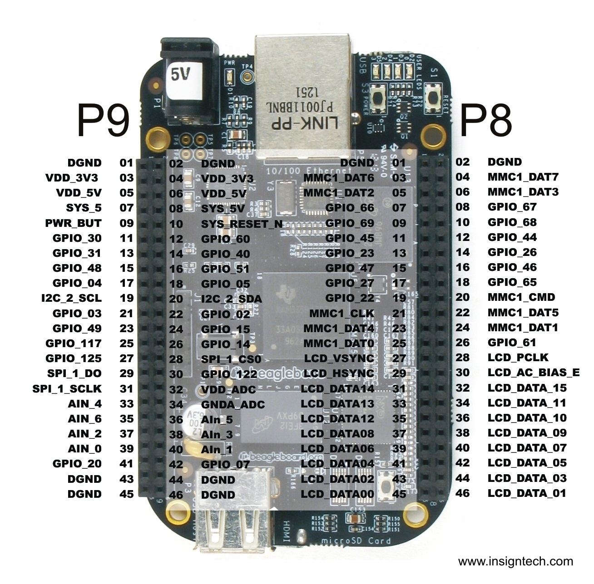
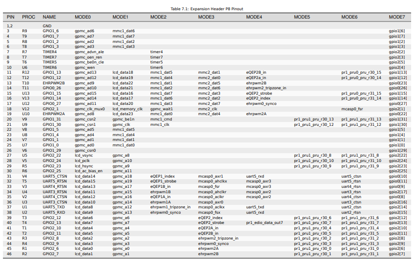
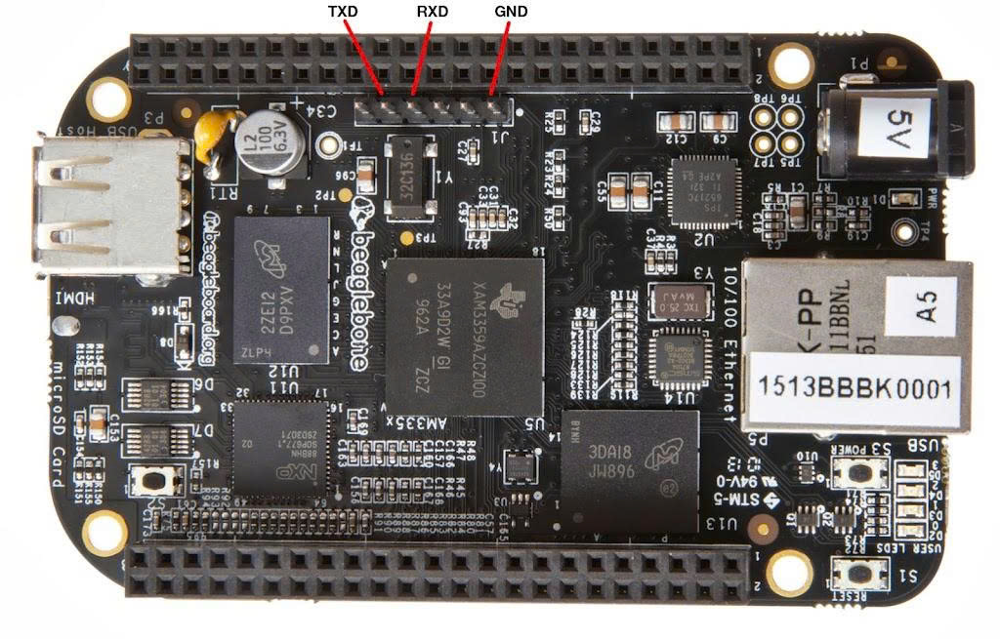

# Beaglebone black

## Pin out

**P8**

**P9**

## Debug port

## Test board

| #   | Tên test case | Các bước thực hiện | Kiểm tra đầu ra |
| --- | --- | --- | --- |
| 1 | Kiểm tra khả năng boot qua MMC | 1. Mạch không cắm thẻ nhớ. 2. Cắm dây usb2serial vào mạch theo thứ tự tx - rx, rx - tx, gnd - gnd. Cổng usb của usb2serial cắm vào PC. 3. Mở tab com4 trên MobaXterm. (thông số của tab Com4: như Hình). 4. Cắm nguồn 5v, 2A vào board BBB qua cổng usb của board. 5. Đăng nhập vào board trên màn hình console với user name: root - password: root | 1. Log boot xuất hiện trên console của MobaXterm. 2. Đăng nhập thành công trên console. |
| 2 | Kiểm tra khả năng boot qua sdcard. | 1. Dí nút power 5s cho đến khi đèn báo hoạt động trên board tắt. 2. Rút nguồn usb trên board. 3. Cắm thẻ sdcard đã ghi Linux image lên. 4. 1 tay giữ phím S2 trên board, 1 tay cắm nguồn. 5. Usb2serial vẫn được kết nối giữa board và PC. 6. Mở tab com4 trên MobaXterm. (thông số của tab Com4: như Hình). 7. Đăng nhập vào board trên màn hình console với user name: root - password: root | 1. Log boot xuất hiện trên console của MobaXterm. 2. Dòng log đầu tiên phải là năm 2023. 3. Đăng nhập thành công trên console. |
| 3 | Kiểm tra chức năng Ethernet | 1. Sử dụng tính năng boot từ sdcard để test chức năng Ethernet. 2. Cắm cổng Ethernet từ board vào laptop. 3. Trên màn hình console thực hiện lệnh ping như sau: ping 192.168.7.1 | 1. Báo kết quả ping thành công trên màn hình console như hình. |
| 4 | Kiểm tra khả năng tắt board bằng câu lệnh | 1. Nhấn nút power đúng 1 lần và đợi board tắt. | 1. Đèn báo hoạt động của board tắt. 2. Trên màn hình console có log power off. |

## Tài liệu cần thiết
- [BBB schematic](https://old.beagleboard.org/static/beaglebone/BEAGLEBONE_SCHEM_A3.pdf)
- [BBB system reference manual](https://docs.beagleboard.org/boards/beaglebone/black/ch01.html)
- [AM335x processer datasheet](https://www.ti.com/lit/ds/symlink/am3358.pdf)
- [AM335x processer technical reference manual](https://www.ti.com/lit/ug/spruh73q/spruh73q.pdf)

## Practical Labs

[Embedded Linux BBB Labs](https://bootlin.com/doc/training/embedded-linux-bbb/embedded-linux-bbb-labs.pdf)
