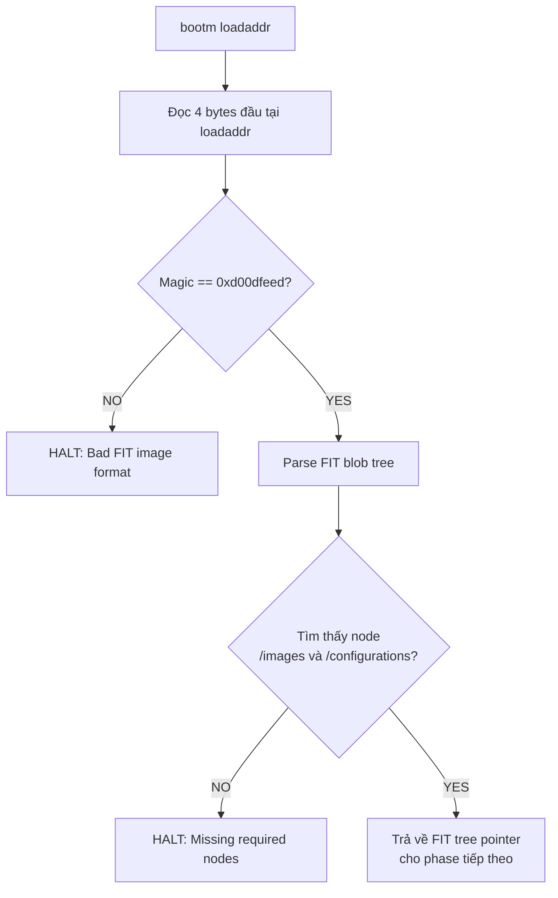
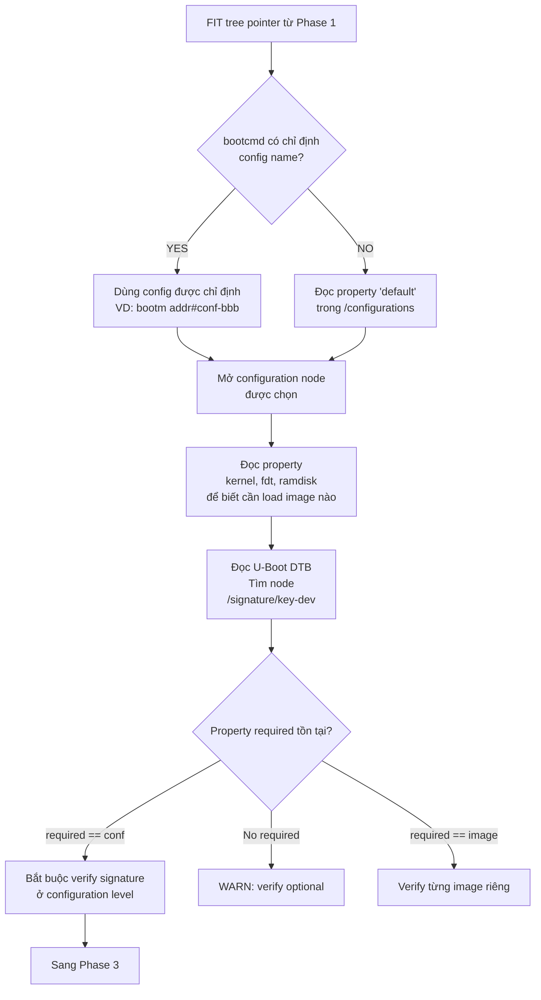
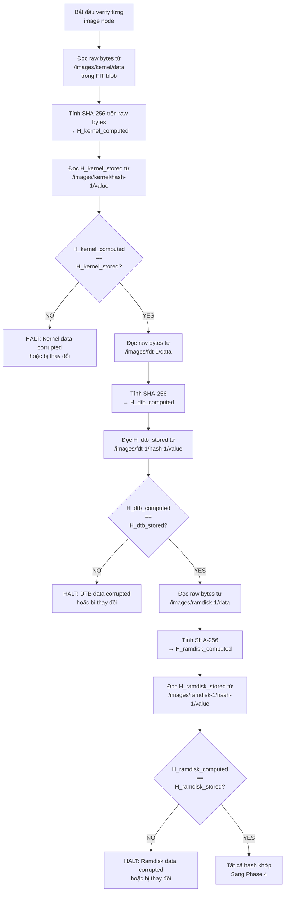
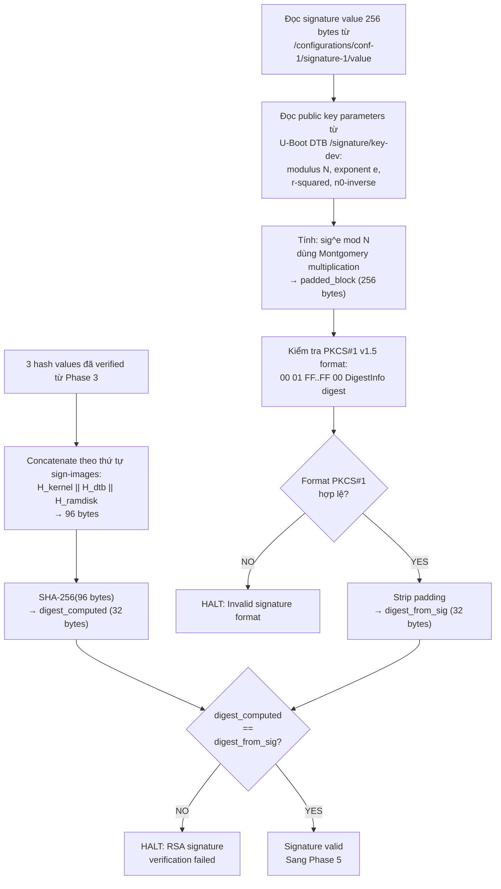
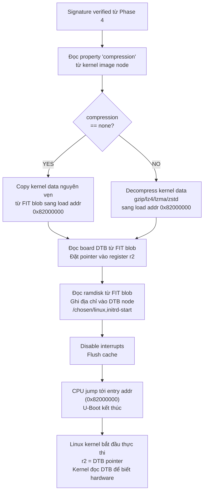

# U-Boot verified

## 1. FIT image format

### 1.1. Tổng quan

FIT không thiết kế format riêng mà tái sử dụng device tree vì uboot đã có sẵn parser cho format này (`libfdt`). Device tree bản chất là một cây phân cấp gồm các node, mỗi node chứa các property dưới dạng key-value. FIT lợi dụng cấu trúc này để mô tả một cây image với mỗi node là một component (kernel, DTB, ramdisk) và mỗi property mô tả metadata của component đó.

File `.its` (Image Tree Source) là dạng text đọc được, tương đương với file `.dts` của device tree. Khi compile bằng `mkimage`, nó sẽ đóng gói các component và tạo thành file `.itb` (Image Tree Blob) - dạng binary, tương đương `.dtb`. File `.itb` này chính là cái mà mọi người gọi là FIT image.

Ví dụ nội dung của một file `.its`:

```
/dts-v1/;

/ {
    description = "Example signed FIT image";
    #address-cells = <1>;

    images {
        kernel {
            description = "Linux kernel";
            data = /incbin/("zImage");         <- Chỉ là tham chiếu, chưa có data
            type = "kernel";
            arch = "arm";
            os = "linux";
            compression = "none";
            load = <0x82000000>;
            entry = <0x82000000>;

            hash-1 {
                algo = "sha256";
            };
        };

        fdt-1 {
            description = "Device tree";
            data = /incbin/("am335x-boneblack.dtb");
            type = "flat_dt";
            arch = "arm";
            compression = "none";

            hash-1 {
                algo = "sha256";
            };
        };

        ramdisk-1 {
            description = "initramfs";
            data = /incbin/("initramfs.cpio.gz");
            type = "ramdisk";
            arch = "arm";
            os = "linux";
            compression = "gzip";

            hash-1 {
                algo = "sha256";
            };
        };
    };

    configurations {
        default = "conf-1";

        conf-1 {
            description = "Boot configuration";
            kernel = "kernel";
            fdt = "fdt-1";
            ramdisk = "ramdisk-1";

            signature-1 {
                algo = "sha256,rsa2048";
                key-name-hint = "dev";
                sign-images = "kernel", "fdt", "ramdisk";
            };
        };
    };
};
```

### 1.2. Cấu trúc tổng thể của file .its

Cây ITS có 3 tầng chính:

```
/ (root node)
├── images/           <- chứa tất cả binary component
│   ├── kernel        <- Linux kernel
│   │   └── hash-1    <- SHA-256 hash của kernel
│   ├── fdt-1         <- device tree blob
│   │   └── hash-1
│   └── ramdisk-1     <- initramfs
│       └── hash-1
└── configurations/   <- chứa các boot profile
    └── conf-1        <- một profile cụ thể
        └── signature-1  <- signature của profile
```

#### 1.2.1. Tầng root - chuỗi metadata

```dts
/dts-v1/;

/ {
    description = "Signed fitImage for BBB gateway";
    #address-cells = <1>;
```

Trong đó:
- `/dts-v1/`: Khai báo phiên bản device tree syntax. Bắt buộc phải có, không liên quan đến security.
- `description`: Chuỗi mô tả tùy ý. U-Boot không dùng property này trong quá trình verify.
- `#address-cells = <1>`: Chỉ định rằng các địa chỉ trong cây này dùng 1 cell = 32-bit. Trên ARM 32-bit như AM335x, luôn là `<1>`. Trên ARM 64-bit sẽ là `<2>`.

#### 1.2.2. Tầng `/images` - chứa binary component

Node `/images` là container, bản thân nó không có property đặc biệt. Các child node bên trong mới là thực thể quan trọng. Mỗi child node đại diện cho một binary component.

**Image node - kernel image**

```dts
kernel {
    description = "Linux kernel";
    data = /incbin/("zImage");
    type = "kernel";
    arch = "arm";
    os = "linux";
    compression = "none";
    load = <0x82000000>;
    entry = <0x82000000>;

    hash-1 {
        algo = "sha256";
    };
};
```

Ý nghĩa của từng property:
- `data = /incbin/("zImage")`: Đây là directive đặc biệt của device tree compiler. `/incbin/` nói với compiler rằng hãy đọc toàn bộ nội dung binary của file `zImage` và nhúng vào property `data` trong blob output. Khi ta mở file `.itb` bằng hex editor, ta sẽ thấy toàn bộ kernel binary nằm ngay trong đó. Đường dẫn file là tương đối so với vị trí file `.its`.
- `type`: cho U-Boot biết cách xử lý binary này. Các giá trị hợp lệ:
  + `kernel`: Linux kernel image.
  + `flat_dt`: device tree blob.
  + `ramdisk`: initramfs hoặc initrd.
  + `firmware`: bare-metal firmware.
  + `standalone`: chương trình standalone, U-Boot chạy bằng lệnh `go`.
  + `script`: U-Boot script.
  + `kernel_noload`: kernel không cần copy vào load address, boot tại chỗ.
- `arch`: Kiến trúc CPU.
- `os`: Target OS. U-Boot dùng thông tin này để biết cách truyền parameters cho kernel.
- `compression`: thuật toán nén đã áp dụng lên image. U-Boot cần giải nén trước khi copy vào load address. Quan trọng: hash được tính trên data nén, không phải dữ liệu sau giải nén. Giá trị hợp lệ: "none", `gzip`, `bzip2`, `lzma`, `lzo`, `lz4`, `zstd`.
- `load`: Địa chỉ DRAM nơi U-Boot sẽ copy binary vào trước khi thực thi. Giá trị này phụ thuộc vào memory map của từng board.
- `entry`: Địa chỉ mà CPU sẽ jump tới để bắt đầu thực thi kernel. Thường bằng load address, nhưng có thể khác nếu binary có header cần skip.

**Hash sub-node**

```dts
hash-1 {
    algo = "sha256";
};
```

Trong file `.its` (source), hash node chỉ khai báo thuật toán. Khi `mkimage` compile, nó thực hiện:
1. Đọc toàn bộ bytes từ property data của image node cha.
2. Tính SHA-256 digest (32 bytes).
3. Ghi kết quả vào property value trong hash node.

Sau khi compile, hash node trong `.itb` (binary) trông như thế này:

```dts
hash-1 {
    algo = "sha256";
    value = <0xa3f2...>;
};
```

Ta có thể có nhiều hash node: `hash-1` dùng SHA-256, `hash-2` dùng SHA-512. U-Boot sẽ verify tất cả - chỉ cần 1 hash fail là reject.

Tên node không quan trọng về mặt logic, chỉ cần bắt đầu bằng hash. U-Boot tìm child node bằng cách scan tất cả node có prefix là hash bên trong image node.

**Image node - device tree**

```dts
fdt-1 {
    description = "Device tree";
    data = /incbin/("am335x-boneblack.dtb");
    type = "flat_dt";
    arch = "arm";
    compression = "none";
    /* không có load và entry - U-Boot tự chọn địa chỉ */

    hash-1 {
        algo = "sha256";
    };
};
```

DTB node không cần load và entry vì U-Boot tự quyết định đặt DTB ở đâu trong DRAM, thường ngay sau kernel.

:::warning Lưu ý
DTB này là device tree của board (mô tả hardware cho kernel), khác hoàn toàn với U-Boot control DTB (chứa public key cho verified boot). Hai file DTB này phục vụ mục đích khác nhau và nằm ở vị trí khác nhau.
:::

**Image node - ramdisk**

```dts
ramdisk-1 {
    description = "initramfs";
    data = /incbin/("initramfs.cpio.gz");
    type = "ramdisk";
    arch = "arm";
    os = "linux";
    compression = "gzip";

    hash-1 {
        algo = "sha256";
    };
};
```

Ramdisk chứa initramfs , đây là một filesystem tạm thời mà kernel mount trước khi mount rootfs thật. Đối với secure boot, initramfs đặc biệt quan trọng vì nó giúp chạy script `dm-verity` trước khi mount rootfs chính. Vì initramfs nằm trong FIT image đã được sign nên attacker không thể sửa đổi script `dm-verity`.

Property compression `gzip` ở đây có ý nghĩa hơi khác với kernel. Với ramdisk, U-Boot thường không tự giải nén - nó truyền blob nén cho kernel và kernel tự giải nén. Nhưng hash vẫn tính trên dạng nén, dữ liệu thô trong FIT.

#### 1.2.3. Configuration node

Configuration node là lớp trừu tượng giữa các component có sẵn và cách đóng gói các component -> Nó cho phép một FIT image phục vụ nhiều hardware variant khác nhau mà không lặp data.

Configuration node bản thân không chứa bất kỳ data nào. Nó chỉ chứa các tham chiếu tới image node bằng tên. kernel = "kernel" có nghĩa "dùng image node có tên kernel trong /images". Tương tự cho fdt và ramdisk.

Ta có thể có nhiều configuration cho cùng một FIT image, ví dụ:

```dts
configurations {
    default = "conf-bbb";

    conf-bbb {
        kernel = "kernel";
        fdt = "fdt-bbb";        /* DTB cho BeagleBone Black */
        ramdisk = "ramdisk-1";
        signature-1 { ... };
    };

    conf-bbb-wireless {
        kernel = "kernel";
        fdt = "fdt-bbb-wifi";   /* DTB cho BeagleBone Black Wireless */
        ramdisk = "ramdisk-1";
        signature-1 { ... };
    };
};
```

Property kernel có nghĩa là khi boot theo configuration này, lấy image node tại `/images/kernel`. Tương tự với fdt trỏ tới `/images/fdt-reva`. Đây là tham chiếu bằng tên, không phải con trỏ binary - U-Boot dùng `libfdt` để tìm node tương ứng trong cây.

Cùng kernel, cùng ramdisk, nhưng DTB khác nhau cho ra kiến trúc hardware khác nhau. Mỗi configuration phải có signature riêng và sign lần lượt bằng cùng key.

**Signature sub-node**

```dts
signature-1 {
    algo = "sha256,rsa2048";
    key-name-hint = "dev";
    sign-images = "kernel", "fdt", "ramdisk";
};
```

Ý nghĩa của các property:
- `algo = "sha256,rsa2048"`: Chứa hai thuật toán được cách nhau bằng dấu phẩy. Phần trước (sha256) là thuật toán hash dùng để tạo digest. Phần sau (rsa2048) là thuật toán signature dùng để sign digest đó. U-Boot hỗ trợ các tổ hợp: `sha1,rsa2048` / `sha256,rsa2048` / `sha256,rsa4096`. Nên dùng `sha256,rsa2048` tối thiểu và `sha256,rsa4096` nếu muốn an toàn hơn nhưng verify chậm hơn.
- `key-name-hint = "dev"`: Đây chỉ là gợi ý, không phải ràng buộc. Khi `mkimage` sign, nó tìm file `dev.key` và `dev.crt` trong thư mục key. Khi U-Boot verify, nó tìm node `/signature/key-dev` trong DTB của nó. Chữ dev ở cả hai phía phải khớp nhau. Nếu ta đặt key-name-hint = "production", `mkimage` tìm `production.key` và U-Boot tìm `/signature/key-production`.
- `sign-images = "kernel", "fdt", "ramdisk"`: Danh sách các image node cần sign. `mkimage` sẽ lấy hash value từ hash sub-node của từng image được liệt kê, nối chúng theo thứ tự, rồi ký toàn bộ blob hash đó. Nếu ta bỏ ramdisk khỏi danh sách, ramdisk vẫn có hash check nhưng không nằm trong signature -> attacker có thể thay ramdisk khác mà vẫn giữ kernel và DTB nguyên vẹn.

Sau khi `mkimage` sign, signature node trong `.itb` có thêm:

```dts
signature-1 {
    algo = "sha256,rsa2048";
    key-name-hint = "dev";
    sign-images = "kernel", "fdt", "ramdisk";
    value = <0x1a2b3c...>;
    timestamp = <0x6478a3f0>;
    signer-name = "mkimage";
    signer-version = "2022.01";
};
```

`value` chính là RSA signature - 256 bytes cho RSA-2048, 512 bytes cho RSA-4096. `timestamp` cho phép ta biết image được ký lúc nào, hữu ích cho rollback protection.

## 2. Quy trình sign tại boot time

Quá trình sign diễn ra trên build server, sử dụng `mkimage` - tool của U-Boot. Đây là flow chi tiết:

```bash
# Bước 1: Tạo RSA key pair (chỉ làm 1 lần)
openssl genrsa -F4 -out keys/dev.key 2048
openssl req -batch -new -x509 -key keys/dev.key -out keys/dev.crt

# Bước 2: Compile ITS thành ITB (unsigned)
mkimage -f fitImage.its fitImage

# Bước 3: Ký FIT image + nhúng public key vào U-Boot DTB
mkimage -F fitImage \
    -k keys/ \                  # thư mục chứa .key và .crt
    -K u-boot.dtb \             # U-Boot DTB - public key sẽ được ghi vào đây
    -r \                        # required: đánh dấu signature là bắt buộc
    -c "Example sign FIT image" # comment
```

Sau bước 3, `mkimage` sẽ thực hiện đồng thời hai thao tác:

**Thao tác trên fitImage:**

Tính SHA-256 cho mỗi image node, ghi digest vào property value của hash sub-node tương ứng trong FIT blob.

```
+---------------------+
| zImage (kernel bin) | ---- SHA-256 ----> H_kernel  (32 byte)
+---------------------+

+---------------------+
| am335x-bbb.dtb      | ---- SHA-256 ----> H_dtb     (32 byte)
+---------------------+

+---------------------+
| initramfs.cpio.gz   | ---- SHA-256 ----> H_ramdisk (32 byte)
+---------------------+
```

Sau đó nối tất cả hash lại theo thứ tự trong `sign-images`. Thứ tự này quan trọng, nếu uboot nối theo thứ tự khác sẽ ra digest khác và verify fail. Sau đó SHA-256 lần nữa trên blob 96 byte để ra digest cuối cùng 32 byte.

```
H_kernel  (32 byte) --+
                      |
H_dtb     (32 byte) --+-- concatenate --> H_all (96 byte)
                      |                     |
H_ramdisk (32 byte) --+                     | SHA-256
                                            |
                                            v
                                          digest (32 byte)
```

Ký digest thu được bằng RSA private key:

```
                        +------------------+
digest (32 byte) -----> |   PKCS#1 v1.5    | ----->  padded_block (256 byte cho RSA-2048)
                        |   padding        |
                        +------------------+
                                |
                                |  <----- RSA private key
                                |
                                v
                        signature (256 byte)
```

Đầu tiên digest cần được wrap trong PKCS#1 v1.5 padding block. Block này có format cố định:

```
Tổng cộng 256 byte (= kích thước RSA-2048 key):

Byte:  00  01  FF FF FF FF ... FF FF  00  [DigestInfo]  [Digest]
       ^   ^   ^                      ^   ^             ^
       |   |   |                      |   |             +--- 32 byte SHA-256 hash
       |   |   |                      |   |
       |   |   |                      |   +--- ASN.1 header chỉ định
       |   |   |                      |      thuật toán hash nào được dùng
       |   |   |                      |      Với SHA-256, DigestInfo luôn là 19 bytes cố định
       |   |   |                      |
       |   |   |                      +--- separator, đánh dấu hết padding
       |   |   |
       |   |   +--- padding byte, toàn bộ là 0xFF
       |   |      lấp đầy khoảng trống cho đủ 256 byte
       |   |
       |   +--- block type (01 = signature; type 02 = encryption)
       |
       +--- luôn là 00, đánh dấu đầu block
```

Sau đó, toàn bộ padded block mới được sign bằng private key thu được 256 byte signature, giá trị này sẽ được ghi vào signature value của signature sub-node tương ứng trong FIT blob kèm với timestamp.

:::tip PKCS#1 v1.5 là gì?
PKCS là viết tắt của Public Key Cryptography Standards. Đây là bộ tiêu chuẩn do RSA Laboratories (công ty phát minh RSA) định nghĩa. PKCS#1 là tiêu chuẩn dành riêng cho RSA, mô tả cách dùng RSA đúng và an toàn.
:::

:::warning Tại sao cần PKCS#1?
SHA-256 digest chỉ có 32 byte, trong khi RSA-2048 cần làm việc với block 256 bytes -> PKCS#1 giải quyết bằng cách thêm padding để lấp đầy message thành đúng 256 bytes theo format cố định trước khi sign.
:::

**Thao tác trên `u-boot.dtb`:**

Ghi toàn bộ thông tin public key dưới dạng pre-computed RSA parameters vào U-Boot DTB tại node `/signature/key-{name}`. Flag `-r` đặt property `required = "conf"` vào node này.

Sau khi `mkimage` chạy xong, U-Boot DTB chứa node sau:
l
```dts
/ {
    signature {
        key-dev {                          /* tên trùng key-name-hint trong ITS */
            required = "conf";
            algo = "sha256,rsa2048";
            rsa,r-squared = <0x...>;
            rsa,modulus = <0x...>;
            rsa,exponent = <0x00010001>;
            rsa,n0-inverse = <0x...>;
            rsa,num-bits = <0x800>;
        };
    };
};
```

## 3. Quy trình verify tại boot time

### 3.1. Parse FIT blob



### 3.2. Select configuration và check required



Property required là một cấu hình quan trọng mà ta cần lưu ý, để hiểu lý do tại sao, ta xét 3 kịch bản tấn công:
- Không có required: Attacker tạo FIT image mới hoàn toàn, không có signature node. Uboot thấy không có signature -> không verify -> boot bình thường. Toàn bộ verified boot vô nghĩa.
- `required = "image"`: Mỗi image node được sign riêng lẻ. Attacker không thể thay kernel, nhưng có thể tạo configuration mới trỏ kernel hợp lệ sang DTB giả mạo. Qua DTB giả, attacker có thể thay đổi kernel command line, disable dm-verity, mount rootfs khác.
- `required = "conf"`: Sign toàn bộ component được tham chiếu trong configuration node -> Attacker không thể swap bất kỳ component nào, không thể tạo configuration mới, không thể xóa signature.

### 3.3. Hash verify từng component



### 3.4. RSA signature verify



### 3.5. Boot kernel



## 4. Thực hiện uboot verified với yocto

### 4.1. Tạo signing keys

Đây là bước duy nhất ta phải làm thủ công và chỉ làm một lần:

```bash
mkdir -p ~/signing-keys

# Tạo RSA-2048 private key
openssl genrsa -out ~/signing-keys/dev.key 2048

# Tạo X.509 certificate chứa public key
openssl req -batch -new -x509 \
    -key ~/signing-keys/dev.key \
    -out ~/signing-keys/dev.crt \
    -days 3650 \
```

Tên file `dev.key` và `dev.crt` phải trùng với giá trị ta khai báo trong `UBOOT_SIGN_KEYNAME`. Nếu `UBOOT_SIGN_KEYNAME = "production"` thì file phải là `production.key` và `production.crt`.

Hai file này phải được bảo vệ nghiêm ngặt. Ai có `dev.key` thì có thể ký firmware giả mạo mà device sẽ chấp nhận. Trong production, private key nên nằm trong HSM hoặc ít nhất là encrypted storage trên build server, không bao giờ commit vào git.

### 4.2. Cấu hình uboot verified (FIT image signing)

Trong `local.conf` hoặc machine config của Yocto:

```bash
# Bật FIT image support
KERNEL_IMAGETYPE = "fitImage"
KERNEL_CLASSES += "kernel-fitimage"

# Cấu hình FIT signing
UBOOT_SIGN_ENABLE = "1"
UBOOT_SIGN_KEYDIR = "${TOPDIR}/keys"
UBOOT_SIGN_KEYNAME = "dev"

# Thuật toán sign
FIT_SIGN_ALG = "rsa2048"
FIT_HASH_ALG = "sha256"

# Uboot DTB
UBOOT_DTB_BINARY = "u-boot.dtb"
UBOOT_MKIMAGE_DTCOPTS = "-I dts -O dtb -p 2000"
```

Giải thích từng biến:
- `KERNEL_IMAGETYPE = "fitImage"`: Nói với yocto rằng output kernel không phải `zImage` mà là `fitImage`.
- `KERNEL_CLASSES += "kernel-fitimage"`: Load class `kernel-fitimage.bbclass`, class này chứa toàn bộ logic tạo file `.its`, gọi `mkimage`, sign và nhúng public key.
- `UBOOT_SIGN_ENABLE = "1"`: Bật signing. Nếu "0" hoặc không khai báo, Yocto vẫn tạo `fitImage` nhưng sẽ không sign -> không có signature node trong Uboot DTB.
- `UBOOT_SIGN_KEYDIR`: Đường dẫn tuyệt đối tới thư mục chứa `dev.key` và `dev.crt`.
- `UBOOT_SIGN_KEYNAME = "dev"`: Tên key. `mkimage` sẽ tìm file `${UBOOT_SIGN_KEYDIR}/dev.key` và `${UBOOT_SIGN_KEYDIR}/dev.crt`. Giá trị này cũng trở thành key-name-hint trong file `.its` và tên node `/signature/key-dev` trong U-Boot DTB.
- `FIT_HASH_ALG = "sha256"`: Thuật toán hash cho image node.
- `FIT_SIGN_ALG = "rsa2048"`: Thuật toán sign.
- `FIT_SIGN_INDIVIDUAL = "0"`: khi bằng 0, chỉ sign ở configuration level, tương đương với `required = "conf"`. Khi bằng 1, ký cả từng image riêng lẻ lẫn configuration. Thường để 0 vì configuration-level signing đã đủ và ký image riêng lẻ là thừa.
- `UBOOT_MKIMAGE_DTCOPTS = "-I dts -O dtb -p 2000"`: Flag truyền cho `dtc` khi compile U-Boot DTB. `-p 2000` nghĩa là nó sẽ thêm 2000 byte padding vào DTB. Padding cần thiết vì `mkimage` sẽ ghi thêm public key vào DTB sau khi compile. Nếu không có padding, DTB không còn chỗ trống và `mkimage` fail với lỗi `FDT_ERR_NOSPACE`.

Ngoài ra, cần bật các cấu hình sau trong uboot defconfig:

```conf
/* FIT support */
CONFIG_FIT=y                # Bật FIT image format support
CONFIG_FIT_SIGNATURE=y      # bật signature verification
CONFIG_FIT_VERBOSE=y        # log chi tiết khi verify - tắt ở production

/* Crypto */
CONFIG_RSA=y                # RSA verify support
CONFIG_RSA_VERIFY=y

/* Device tree */
CONFIG_OF_CONTROL=y         # Bảo uboot đọc device tree để lấy cấu hình runtime
CONFIG_OF_SEPARATE=y
```

Tuy nhiên có một điểm cần chú ý là uboot environment variables. Mặc định, uboot lưu environment trên MMC/eMMC và cho phép user sửa qua serial console. Điều này giúp attacker có thể:

```bash
# Trên serial console uboot
=> setenv bootcmd 'load mmc 0:1 ${loadaddr} malicious.bin; go ${loadaddr}'
=> saveenv
=> reset
```

Để ngăn chặn, ta cần lock down uboot environment:

Uboot không lưu environment ra persistent storage. Mỗi lần boot đều dùng default environment được compile sẵn trong binary. Attacker không thể `setenv bootcmd load mmc 0:1 0x80000000 malicious; go 0x80000000` rồi `saveenv` vì không có chỗ save. Tuy nhiên cũng có nghĩa là ta không thể thay đổi environment sau khi build, mọi thay đổi phải rebuild uboot.

```conf
CONFIG_ENV_IS_NOWHERE=y        # không lưu env, dùng default compiled-in
```

Nếu cần persistent env thì ta cần cấu hình để không cho phép overwrite environment:

```conf
CONFIG_ENV_IS_IN_MMC=y
CONFIG_SYS_MMC_ENV_DEV=0
CONFIG_ENV_OVERWRITE=n         # không cho phép overwrite critical env
```

Kết hợp với disable serial console trong production build:

```conf
CONFIG_AUTOBOOT=y
CONFIG_AUTOBOOT_KEYED=y
CONFIG_AUTOBOOT_STOP_STR="<password-hash>"  # cần password để vào prompt
CONFIG_AUTOBOOT_DELAY_STR=""
CONFIG_BOOTDELAY=0                          # không delay, boot ngay
```

Hoặc có thể triệt để hơn, build uboot không có CLI:

```conf
CONFIG_CMDLINE=n              # loại bỏ hoàn toàn CLI
CONFIG_AUTOBOOT=y
```

### 4.3. Bên trong `kernel-fitimage.bbclass`

Khi ta cấu hình `UBOOT_SIGN_ENABLE = "1"` và `KERNEL_IMAGETYPE = "fitImage"` thì class `kernel-fitimage.bbclass` của yocto tự động thực hiện các bước sau:

**Bước 1: Tạo file `.its` từ template**

Class có hàm `fitimage_emit_section_*` tạo từng node của file `.its`. Nó không dùng file `.its` có sẵn mà generate hoàn toàn từ các biến mà ta khai báo. 

Quá trình diễn ra theo thứ tự:
- Gọi `fitimage_emit_section_maint` để mở root node, ghi `/dts-v1/; / { description = "..."; #address-cells = <1>;`.
- Gọi `fitimage_emit_section_kernel` để tạo kernel image node với `data = /incbin/("zImage")`, `type = "kernel"`, `load`, `entry`, `compression`, và hash sub-node.
- Gọi `fitimage_emit_section_dtb` cho mỗi DTB file.
- Gọi `fitimage_emit_section_ramdisk` nếu có initramfs.
- Gọi `fitimage_emit_section_config` để tạo configuration node với tham chiếu tới kernel, DTB, ramdisk, và signature sub-node nếu `UBOOT_SIGN_ENABLE = "1"`.

Output là file `fit-image.its` trong thư mục build. Nội dung giống hệt file `.its` mà ta đã phân tích trước đó, chỉ khác là do yocto generate tự động thay vì ta phải viết tay.

**Bước 2: Gọi `mkimage` đóng gói**

```bash
uboot-mkimage -f fit-image.its fitImage
```

Class gọi `uboot-mkimage` (bản `mkimage` do recipe `u-boot-tools` build trong Yocto, chạy trên build host). Lệnh này đọc file `.its`, nhúng binary data, tính hash ra output file `fitImage` chưa sign.

**Bước 3: Gọi `mkimage` sign**

```bash
uboot-mkimage -F fitImage \
    -k /home/builder/signing-keys \
    -K u-boot.dtb \
    -r \
```

Đây là bước signing thật sự. `mkimage` mở fitImage từ bước 2, đọc private key từ `UBOOT_SIGN_KEYDIR`, thực hiện toàn bộ quy trình: concat hash -> SHA-256 -> PKCS#1 pad -> RSA sign -> ghi signature vào FIT blob. Đồng thời ghi public key vào `u-boot.dtb`.

Flag `-r` được thêm vào khi `FIT_SIGN_INDIVIDUAL = "0"`.

**Bước 4: Reassemble U-Boot binary với DTB mới**

Sau khi `mkimage` ghi public key vào `u-boot.dtb`, DTB này cần được inject vào uboot binary. Tùy theo cấu hình `CONFIG_OF_SEPARATE` hay `CONFIG_OF_EMBED` của uboot:

- `CONFIG_OF_SEPARATE`: Yocto compile ra hai file riêng biệt là uboot binary (`u-boot-nodtb.bin`) và DTB (`u-boot.dtb`). Hai file này được concatenate thành binary cuối cùng. Mode này phù hợp cho signing vì DTB là file riêng, `mkimage` có thể mở `u-boot.dtb`, ghi thêm node `/signature/key-dev` chứa public key. Sau đó chỉ cần concatenate lại với `u-boot-nodtb.bin` mà không cần phải compile lại uboot. Quá trình concatenate đơn giản:

    ```bash
    cat u-boot-nodtb.bin u-boot.dtb > u-boot.bin
    ```

- `CONFIG_OF_EMBED`: Mode này nhúng DTB vào giữa U-Boot binary tại compile time. DTB nằm trong section `.dtb` của ELF binary, được linker đặt vào vị trí cố định. Mode này không phù hợp với signing vì khi cần ghi public key vào DTB nó cần phải compile lại uboot.

**Bước 5: Deploy**

Yocto copy các file cuối cùng vào `tmp/deploy/images/<machine>/`:

```
tmp/deploy/images/beaglebone-yocto/
├── fitImage                    <- FIT blob đã ký (chứa kernel + DTB + ramdisk + signature)
├── u-boot.bin                  <- U-Boot binary (chứa public key trong DTB)
├── u-boot.img                  <- U-Boot image format (u-boot.bin + header)
├── MLO                         <- SPL cho AM335x
└── core-image-minimal-....ext4 <- rootfs
```

### 4.4. Vấn đề dependency giữa kernel và u-boot recipe

Kernel recipe cần uboot DTB để `mkimage` ghi public key vào. Uboot recipe build ra DTB đó. Nhưng sau khi kernel recipe ghi public key vào DTB, uboot cần reassemble binary với DTB mới.

Yocto giải quyết bằng cách chia uboot build thành nhiều task:
`u-boot:do_compile` -> build uboot, output `u-boot.dtb` (chưa có public key).
`kernel:do_assemble_fitimage` -> tạo fitImage, gọi `mkimage` sign, ghi public key vào `u-boot.dtb`.
`u-boot:do_deploy` -> lấy `u-boot.dtb` đã có public key tạo thành `u-boot.bin` cuối cùng.

Để dependency này hoạt động, ta cần khai báo trong uboot recipe hoặc bbappend:

```bash
# trong u-boot_%.bbappend
DEPENDS += "virtual/kernel"
do_deploy[depends] += "virtual/kernel:do_assemble_fitimage"
```

Nếu thiếu dependency này, uboot sẽ deploy với DTB không có public key -> required property không tồn tại -> verified boot thực tế bị vô hiệu hóa mà không có lỗi nào.

### 4.5. Cách verify rằng signing hoạt động đúng

Sau khi build xong, bạn nên kiểm tra trên build host trước khi flash lên device:

```bash
# Kiểm tra fitImage có signature không
fit_check_sign -f tmp/deploy/images/<machine>/fitImage \
    -k tmp/deploy/images/<machine>/u-boot.dtb

# Hoặc dùng mkimage để xem nội dung FIT
mkimage -l tmp/deploy/images/beaglebone-yocto/fitImage
```

Lệnh `mkimage -l` sẽ in ra cấu trúc FIT: danh sách image node, hash value, signature status. Nếu thấy sign value và timestamp trong output, signing đã hoạt động.

Kiểm tra uboot DTB có public key:

```bash
fdtdump tmp/deploy/images/beaglebone-yocto/u-boot.dtb | grep -A 20 "signature"
```

Ta phải thấy node `/signature/key-dev` với các property `rsa,modulus`, `rsa,exponent`, `rsa,r-squared`, `rsa,n0-inverse`, và `required = "conf"`. Nếu thiếu bất kỳ property nào, signing chưa đúng.

### 4.6. Kiểm tra trên device thật

Boot device qua serial console, vào uboot và chạy:

```bash
=> load mmc 0:1 0x82000000 /boot/fitImage
=> bootm 0x82000000
```

Nếu `CONFIG_FIT_VERBOSE=y`, uboot sẽ in chi tiết:

```
## Loading kernel from FIT Image at 82000000 ...
   Using 'conf-1' configuration
   Verifying Hash Integrity ... sha256,rsa2048:dev+ OK
   Trying 'kernel' kernel subimage
     Description:  Linux kernel
     Type:         Kernel Image
     Compression:  uncompressed
     Data Start:   0x820000e8
     Data Size:    4372480 Bytes
     Hash algo:    sha256
     Hash value:   a3f2e8...
     Verifying Hash Integrity ... sha256+ OK
```

Dòng `sha256,rsa2048:dev+ OK` nghĩa là RSA signature verify pass. Dòng `sha256+ OK` sau mỗi image nghĩa là hash verify pass. Nếu ta thấy `sha256,rsa2048:dev- Failed` hoặc `sha256- Failed` thì nghĩa là có vấn đề với key hoặc image bị corrupt.

Để test, ta có thể sửa 1 byte trong fitImage rồi thử boot lại:

```bash
# Trên build host, corrupt 1 byte
printf '\x00' | dd of=fitImage bs=1 seek=1000 count=1 conv=notrunc
```

Copy fitImage đã corrupt lên SD card và boot lại
$\rightarrow$ U-Boot phải in: `Hash Integrity ... sha256- Failed`
$\rightarrow$ Từ chối boot