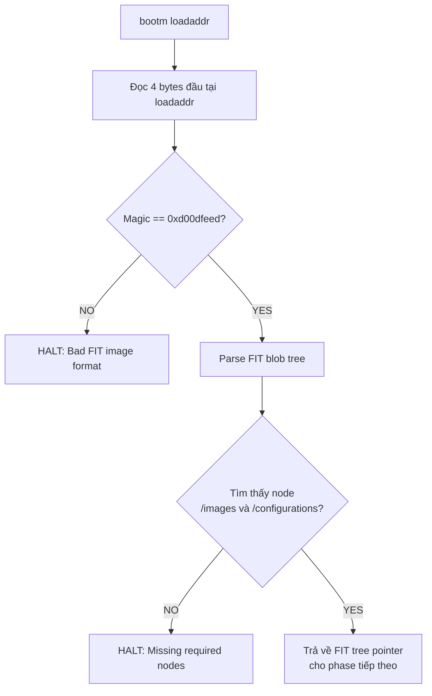
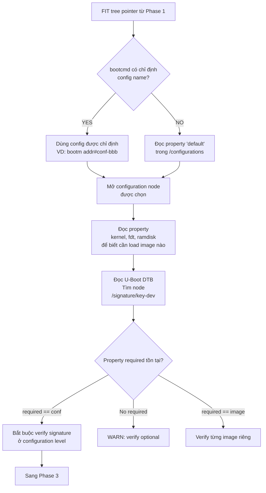
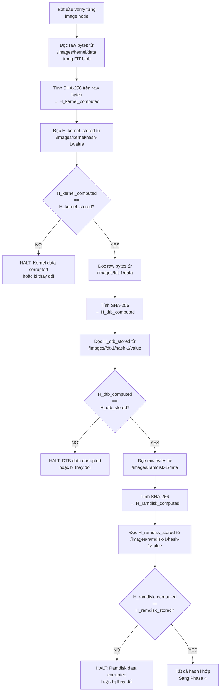
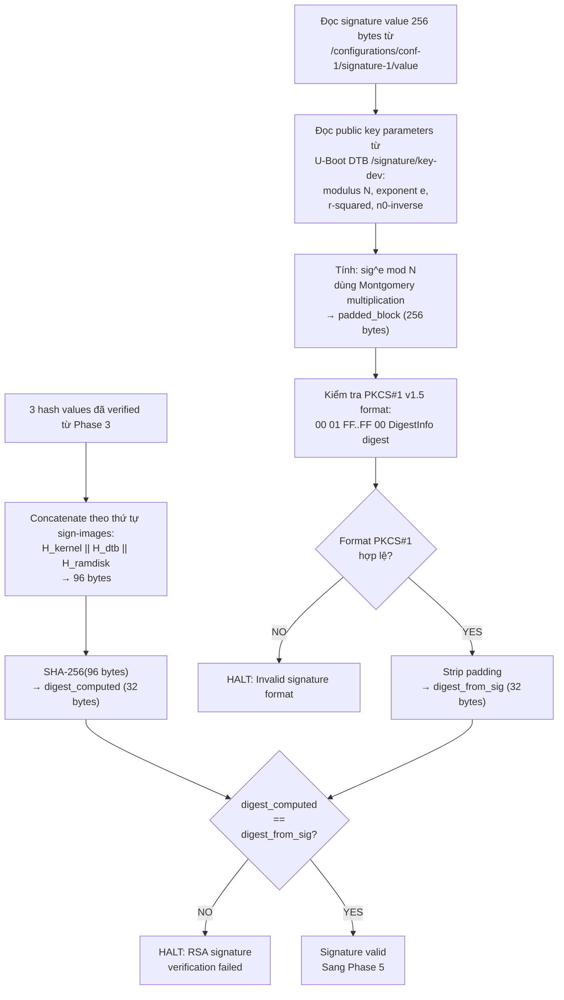
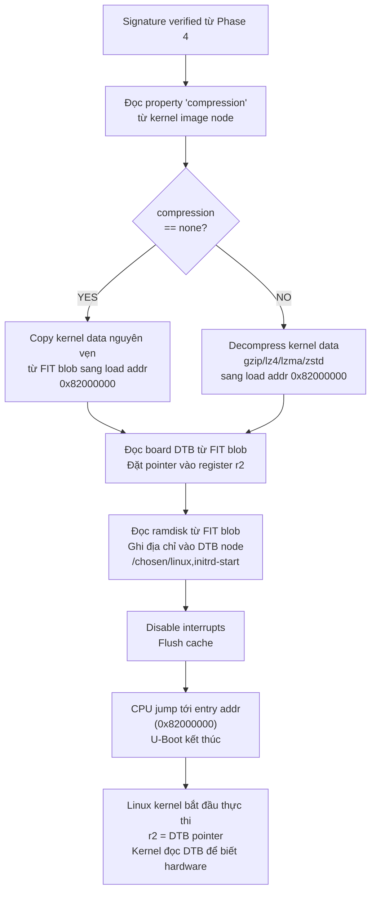

# U-Boot verified

## 1. FIT image format

### 1.1. Tổng quan

FIT không thiết kế format riêng mà tái sử dụng device tree vì uboot đã có sẵn parser cho format này (`libfdt`). Device tree bản chất là một cây phân cấp gồm các node, mỗi node chứa các property dưới dạng key-value. FIT lợi dụng cấu trúc này để mô tả một cây image với mỗi node là một component (kernel, DTB, ramdisk) và mỗi property mô tả metadata của component đó.

File `.its` (Image Tree Source) là dạng text đọc được, tương đương với file `.dts` của device tree. Khi compile bằng `mkimage`, nó sẽ đóng gói các component và tạo thành file `.itb` (Image Tree Blob) - dạng binary, tương đương `.dtb`. File `.itb` này chính là cái mà mọi người gọi là FIT image.

Ví dụ nội dung của một file `.its`:

```
/dts-v1/;

/ {
    description = "Example signed FIT image";
    #address-cells = <1>;

    images {
        kernel {
            description = "Linux kernel";
            data = /incbin/("zImage");         <- Chỉ là tham chiếu, chưa có data
            type = "kernel";
            arch = "arm";
            os = "linux";
            compression = "none";
            load = <0x82000000>;
            entry = <0x82000000>;

            hash-1 {
                algo = "sha256";
            };
        };

        fdt-1 {
            description = "Device tree";
            data = /incbin/("am335x-boneblack.dtb");
            type = "flat_dt";
            arch = "arm";
            compression = "none";

            hash-1 {
                algo = "sha256";
            };
        };

        ramdisk-1 {
            description = "initramfs";
            data = /incbin/("initramfs.cpio.gz");
            type = "ramdisk";
            arch = "arm";
            os = "linux";
            compression = "gzip";

            hash-1 {
                algo = "sha256";
            };
        };
    };

    configurations {
        default = "conf-1";

        conf-1 {
            description = "Boot configuration";
            kernel = "kernel";
            fdt = "fdt-1";
            ramdisk = "ramdisk-1";

            signature-1 {
                algo = "sha256,rsa2048";
                key-name-hint = "dev";
                sign-images = "kernel", "fdt", "ramdisk";
            };
        };
    };
};
```

### 1.2. Cấu trúc tổng thể của file .its

Cây ITS có 3 tầng chính:

```
/ (root node)
├── images/           <- chứa tất cả binary component
│   ├── kernel        <- Linux kernel
│   │   └── hash-1    <- SHA-256 hash của kernel
│   ├── fdt-1         <- device tree blob
│   │   └── hash-1
│   └── ramdisk-1     <- initramfs
│       └── hash-1
└── configurations/   <- chứa các boot profile
    └── conf-1        <- một profile cụ thể
        └── signature-1  <- signature của profile
```

#### 1.2.1. Tầng root - chuỗi metadata

```dts
/dts-v1/;

/ {
    description = "Signed fitImage for BBB gateway";
    #address-cells = <1>;
```

Trong đó:
- `/dts-v1/`: Khai báo phiên bản device tree syntax. Bắt buộc phải có, không liên quan đến security.
- `description`: Chuỗi mô tả tùy ý. U-Boot không dùng property này trong quá trình verify.
- `#address-cells = <1>`: Chỉ định rằng các địa chỉ trong cây này dùng 1 cell = 32-bit. Trên ARM 32-bit như AM335x, luôn là `<1>`. Trên ARM 64-bit sẽ là `<2>`.

#### 1.2.2. Tầng `/images` - chứa binary component

Node `/images` là container, bản thân nó không có property đặc biệt. Các child node bên trong mới là thực thể quan trọng. Mỗi child node đại diện cho một binary component.

**Image node - kernel image**

```dts
kernel {
    description = "Linux kernel";
    data = /incbin/("zImage");
    type = "kernel";
    arch = "arm";
    os = "linux";
    compression = "none";
    load = <0x82000000>;
    entry = <0x82000000>;

    hash-1 {
        algo = "sha256";
    };
};
```

Ý nghĩa của từng property:
- `data = /incbin/("zImage")`: Đây là directive đặc biệt của device tree compiler. `/incbin/` nói với compiler rằng hãy đọc toàn bộ nội dung binary của file `zImage` và nhúng vào property `data` trong blob output. Khi ta mở file `.itb` bằng hex editor, ta sẽ thấy toàn bộ kernel binary nằm ngay trong đó. Đường dẫn file là tương đối so với vị trí file `.its`.
- `type`: cho U-Boot biết cách xử lý binary này. Các giá trị hợp lệ:
    | Type | Ý nghĩa |
    | ---- | ------- |
    | `kernel` | Linux kernel image. |
    | `flat_dt` | device tree blob. |
    | `ramdisk` | initramfs hoặc initrd. |
    | `firmware` | bare-metal firmware. |
    | `standalone` | chương trình standalone, U-Boot chạy bằng lệnh `go`. |
    | `script` | U-Boot script. |
    | `kernel_noload` | kernel không cần copy vào load address, boot tại chỗ. |
- `arch`: Kiến trúc CPU.
- `os`: Target OS. U-Boot dùng thông tin này để biết cách truyền parameters cho kernel.
- `compression`: thuật toán nén đã áp dụng lên image. U-Boot cần giải nén trước khi copy image vào load address. Quan trọng: hash được tính trên data nén, không phải dữ liệu sau giải nén. Giá trị hợp lệ: "none", `gzip`, `bzip2`, `lzma`, `lzo`, `lz4`, `zstd`.
- `load`: Địa chỉ DRAM nơi U-Boot sẽ copy binary vào trước khi thực thi. Giá trị này phụ thuộc vào memory map của từng board.
- `entry`: Địa chỉ mà CPU sẽ jump tới để bắt đầu thực thi kernel. Thường bằng load address, nhưng có thể khác nếu binary có header cần skip.

**Hash sub-node**

```dts
hash-1 {
    algo = "sha256";
};
```

Trong file `.its` (source), hash node chỉ khai báo thuật toán. Khi `mkimage` compile, nó thực hiện:
1. Đọc toàn bộ bytes từ property data của image node cha.
2. Tính SHA-256 digest (32 bytes).
3. Ghi kết quả vào property value trong hash node.

Sau khi compile, hash node trong `.itb` (binary) trông như thế này:

```dts
hash-1 {
    algo = "sha256";
    value = <0xa3f2...>;
};
```

Ta có thể có nhiều hash node: `hash-1` dùng SHA-256, `hash-2` dùng SHA-512. U-Boot sẽ verify tất cả - chỉ cần 1 hash fail là reject.

Tên node không quan trọng về mặt logic, chỉ cần bắt đầu bằng hash. U-Boot tìm child node bằng cách scan tất cả node có prefix là hash bên trong image node.

**Image node - device tree**

```dts
fdt-1 {
    description = "Device tree";
    data = /incbin/("am335x-boneblack.dtb");
    type = "flat_dt";
    arch = "arm";
    compression = "none";
    /* không có load và entry - U-Boot tự chọn địa chỉ */

    hash-1 {
        algo = "sha256";
    };
};
```

DTB node không cần load và entry vì U-Boot tự quyết định đặt DTB ở đâu trong DRAM, thường ngay sau kernel.

:::warning Lưu ý
DTB này là device tree của board (mô tả hardware cho kernel), khác hoàn toàn với U-Boot control DTB (chứa public key cho verified boot). Hai file DTB này phục vụ mục đích khác nhau và nằm ở vị trí khác nhau.
:::

**Image node - ramdisk**

```dts
ramdisk-1 {
    description = "initramfs";
    data = /incbin/("initramfs.cpio.gz");
    type = "ramdisk";
    arch = "arm";
    os = "linux";
    compression = "gzip";

    hash-1 {
        algo = "sha256";
    };
};
```

Ramdisk chứa initramfs , đây là một filesystem tạm thời mà kernel mount trước khi mount rootfs thật. Đối với secure boot, initramfs đặc biệt quan trọng vì nó giúp chạy script `dm-verity` trước khi mount rootfs chính. Vì initramfs nằm trong FIT image đã được sign nên attacker không thể sửa đổi script `dm-verity`.

Property compression `gzip` ở đây có ý nghĩa hơi khác với kernel. Với ramdisk, U-Boot thường không tự giải nén - nó truyền blob nén cho kernel và kernel tự giải nén. Nhưng hash vẫn tính trên dạng nén, dữ liệu thô trong FIT.

#### 1.2.3. Configuration node

Configuration node là lớp trừu tượng giữa các component có sẵn và cách đóng gói các component $\rightarrow$ Nó cho phép một FIT image phục vụ nhiều hardware variant khác nhau mà không lặp data.

Configuration node bản thân không chứa bất kỳ data nào. Nó chỉ chứa các tham chiếu tới image node bằng tên. `kernel = "kernel"` có nghĩa dùng image node có tên kernel trong `/images`. Tương tự cho fdt và ramdisk.

Ta có thể có nhiều configuration cho cùng một FIT image, ví dụ:

```dts
configurations {
    default = "conf-bbb";

    conf-bbb {
        kernel = "kernel";
        fdt = "fdt-bbb";        /* DTB cho BeagleBone Black */
        ramdisk = "ramdisk-1";
        signature-1 { ... };
    };

    conf-bbb-wireless {
        kernel = "kernel";
        fdt = "fdt-bbb-wifi";   /* DTB cho BeagleBone Black Wireless */
        ramdisk = "ramdisk-1";
        signature-1 { ... };
    };
};
```

Property kernel có nghĩa là khi boot theo configuration này, lấy image node tại `/images/kernel`. Tương tự với fdt trỏ tới `/images/fdt-reva`. Đây là tham chiếu bằng tên, không phải con trỏ binary - U-Boot dùng `libfdt` để tìm node tương ứng trong cây.

Cùng kernel, cùng ramdisk, nhưng DTB khác nhau cho ra kiến trúc hardware khác nhau. Mỗi configuration phải có signature riêng và sign lần lượt bằng cùng key.

**Signature sub-node**

```dts
signature-1 {
    algo = "sha256,rsa2048";
    key-name-hint = "dev";
    sign-images = "kernel", "fdt", "ramdisk";
};
```

Ý nghĩa của các property:
- `algo = "sha256,rsa2048"`: Chứa hai thuật toán được cách nhau bằng dấu phẩy. Phần trước (sha256) là thuật toán hash dùng để tạo digest. Phần sau (rsa2048) là thuật toán signature dùng để sign digest đó. U-Boot hỗ trợ các tổ hợp: `sha1,rsa2048` / `sha256,rsa2048` / `sha256,rsa4096`. Nên dùng `sha256,rsa2048` tối thiểu và `sha256,rsa4096` nếu muốn an toàn hơn nhưng verify chậm hơn.
- `key-name-hint = "dev"`: Đây chỉ là gợi ý, không phải ràng buộc. Khi `mkimage` sign, nó tìm file `dev.key` và `dev.crt` trong thư mục key. Khi U-Boot verify, nó tìm node `/signature/key-dev` trong DTB của nó. Chữ dev ở cả hai phía phải match nhau. Nếu ta đặt `key-name-hint = "production"`, `mkimage` tìm `production.key` và U-Boot tìm `/signature/key-production`.
- `sign-images = "kernel", "fdt", "ramdisk"`: Danh sách các image node cần sign. `mkimage` sẽ lấy hash value từ hash sub-node của từng image được liệt kê, nối chúng theo thứ tự, rồi ký toàn bộ blob hash đó. Nếu ta bỏ ramdisk khỏi danh sách, ramdisk vẫn có hash check nhưng không nằm trong signature -> attacker có thể thay ramdisk khác mà vẫn giữ kernel và DTB nguyên vẹn.

Sau khi `mkimage` sign, signature node trong `.itb` có thêm:

```dts
signature-1 {
    algo = "sha256,rsa2048";
    key-name-hint = "dev";
    sign-images = "kernel", "fdt", "ramdisk";
    value = <0x1a2b3c...>;
    timestamp = <0x6478a3f0>;
    signer-name = "mkimage";
    signer-version = "2022.01";
};
```

`value` chính là RSA signature - 256 bytes cho RSA-2048, 512 bytes cho RSA-4096. `timestamp` cho phép ta biết image được ký lúc nào, hữu ích cho rollback protection.

## 2. Quy trình sign tại boot time

Quá trình sign diễn ra như sau:

```bash
# Bước 1: Tạo RSA key pair (chỉ làm 1 lần)
openssl genrsa -F4 -out keys/dev.key 2048
openssl req -batch -new -x509 -key keys/dev.key -out keys/dev.crt

# Bước 2: Compile ITS thành ITB (unsigned)
mkimage -f fitImage.its fitImage

# Bước 3: Ký FIT image + nhúng public key vào U-Boot DTB
mkimage -F fitImage \
    -k keys/ \                  # thư mục chứa .key và .crt
    -K u-boot.dtb \             # U-Boot DTB - public key sẽ được ghi vào đây
    -r \                        # required: đánh dấu signature là bắt buộc
    -c "Example sign FIT image" # comment
```

Sau bước 3, `mkimage` sẽ thực hiện đồng thời hai thao tác:

**Thao tác trên fitImage:**

Tính SHA-256 cho mỗi image node, ghi digest vào property value của hash sub-node tương ứng trong FIT blob.

```
+---------------------+
| zImage (kernel bin) | ---- SHA-256 ----> H_kernel  (32 byte)
+---------------------+

+---------------------+
| am335x-bbb.dtb      | ---- SHA-256 ----> H_dtb     (32 byte)
+---------------------+

+---------------------+
| initramfs.cpio.gz   | ---- SHA-256 ----> H_ramdisk (32 byte)
+---------------------+
```

Sau đó nối tất cả hash lại theo thứ tự trong `sign-images`. Thứ tự này quan trọng, nếu uboot nối theo thứ tự khác sẽ ra digest khác và verify fail. Sau đó SHA-256 lần nữa trên blob 96 byte để ra digest cuối cùng 32 byte.

```
H_kernel  (32 byte) --+
                      |
H_dtb     (32 byte) --+-- concatenate --> H_all (96 byte)
                      |                     |
H_ramdisk (32 byte) --+                     | SHA-256
                                            |
                                            v
                                          digest (32 byte)
```

Ký digest thu được bằng RSA private key:

```
                        +------------------+
digest (32 byte) -----> |   PKCS#1 v1.5    | ----->  padded_block (256 byte cho RSA-2048)
                        |   padding        |
                        +------------------+
                                |
                                |  <----- RSA private key
                                |
                                v
                        signature (256 byte)
```

Đầu tiên digest cần được wrap trong PKCS#1 v1.5 padding block. Block này có format cố định:

```
Tổng cộng 256 byte (= kích thước RSA-2048 key):

Byte:  00  01  FF FF FF FF ... FF FF  00  [DigestInfo]  [Digest]
       ^   ^   ^                      ^   ^             ^
       |   |   |                      |   |             +--- 32 byte SHA-256 hash
       |   |   |                      |   |
       |   |   |                      |   +--- ASN.1 header chỉ định
       |   |   |                      |      thuật toán hash nào được dùng
       |   |   |                      |      Với SHA-256, DigestInfo luôn là 19 bytes cố định
       |   |   |                      |
       |   |   |                      +--- separator, đánh dấu hết padding
       |   |   |
       |   |   +--- padding byte, toàn bộ là 0xFF
       |   |      lấp đầy khoảng trống cho đủ 256 byte
       |   |
       |   +--- block type (01 = signature; type 02 = encryption)
       |
       +--- luôn là 00, đánh dấu đầu block
```

Sau đó, toàn bộ padded block mới được sign bằng private key thu được 256 byte signature, giá trị này sẽ được ghi vào signature value của signature sub-node tương ứng trong FIT blob kèm với timestamp.

:::tip PKCS#1 v1.5 là gì?
PKCS là viết tắt của Public Key Cryptography Standards. Đây là bộ tiêu chuẩn do RSA Laboratories (công ty phát minh RSA) định nghĩa. PKCS#1 là tiêu chuẩn dành riêng cho RSA, mô tả cách dùng RSA đúng và an toàn.
:::

:::warning Tại sao cần PKCS#1?
SHA-256 digest chỉ có 32 byte, trong khi RSA-2048 cần làm việc với block 256 bytes -> PKCS#1 giải quyết bằng cách thêm padding để lấp đầy message thành đúng 256 bytes theo format cố định trước khi sign.
:::

**Thao tác trên `u-boot.dtb`:**

Ghi toàn bộ thông tin public key dưới dạng pre-computed RSA parameters vào U-Boot DTB tại node `/signature/key-{name}`. Flag `-r` đặt property `required = "conf"` vào node này.

Sau khi `mkimage` chạy xong, U-Boot DTB chứa node sau:

```dts
/ {
    signature {
        key-dev {                          /* tên trùng key-name-hint trong ITS */
            required = "conf";
            algo = "sha256,rsa2048";
            rsa,r-squared = <0x...>;
            rsa,modulus = <0x...>;
            rsa,exponent = <0x00010001>;
            rsa,n0-inverse = <0x...>;
            rsa,num-bits = <0x800>;
        };
    };
};
```

## 3. Quy trình verify tại boot time

### 3.1. Parse FIT blob



### 3.2. Select configuration và check required



Property required là một cấu hình quan trọng mà ta cần lưu ý, để hiểu lý do tại sao, ta xét 3 kịch bản tấn công:
- Không có required: Attacker tạo FIT image mới hoàn toàn, không có signature node. Uboot thấy không có signature -> không verify -> boot bình thường. Toàn bộ verified boot vô nghĩa.
- `required = "image"`: Mỗi image node được sign riêng lẻ. Attacker không thể thay kernel, nhưng có thể tạo configuration mới trỏ kernel hợp lệ sang DTB giả mạo. Qua DTB giả, attacker có thể thay đổi kernel command line, disable dm-verity, mount rootfs khác.
- `required = "conf"`: Sign toàn bộ component được tham chiếu trong configuration node -> Attacker không thể swap bất kỳ component nào, không thể tạo configuration mới, không thể xóa signature.

### 3.3. Hash verify từng component



### 3.4. RSA signature verify



### 3.5. Boot kernel



## 4. Thực hiện uboot verified với yocto

### 4.1. Tạo signing keys

Đây là bước duy nhất ta phải làm thủ công và chỉ làm một lần:

```bash
mkdir -p ~/signing-keys

# Tạo RSA-2048 private key
openssl genrsa -out ~/signing-keys/dev.key 2048

# Tạo X.509 certificate chứa public key
openssl req -batch -new -x509 \
    -key ~/signing-keys/dev.key \
    -out ~/signing-keys/dev.crt \
    -days 3650 \
```

Tên file `dev.key` và `dev.crt` phải trùng với giá trị ta khai báo trong `UBOOT_SIGN_KEYNAME`. Nếu `UBOOT_SIGN_KEYNAME = "production"` thì file phải là `production.key` và `production.crt`.

Hai file này phải được bảo vệ nghiêm ngặt. Ai có `dev.key` thì có thể ký firmware giả mạo mà device sẽ chấp nhận. Trong production, private key nên nằm trong HSM hoặc ít nhất là encrypted storage trên build server, không bao giờ commit vào git.

### 4.2. Cấu hình uboot verified (FIT image signing)

Trong `local.conf` hoặc machine config của Yocto:

```bash
# Bật FIT image support
KERNEL_IMAGETYPE = "fitImage"
KERNEL_CLASSES += "kernel-fitimage"

# Cấu hình FIT signing
UBOOT_SIGN_ENABLE = "1"
UBOOT_SIGN_KEYDIR = "${TOPDIR}/keys"
UBOOT_SIGN_KEYNAME = "dev"

# Thuật toán sign
FIT_SIGN_ALG = "rsa2048"
FIT_HASH_ALG = "sha256"

# Uboot DTB
UBOOT_DTB_BINARY = "u-boot.dtb"
UBOOT_MKIMAGE_DTCOPTS = "-I dts -O dtb -p 2000"
```

Giải thích từng biến:
- `KERNEL_IMAGETYPE = "fitImage"`: Nói với yocto rằng output kernel không phải `zImage` mà là `fitImage`.
- `KERNEL_CLASSES += "kernel-fitimage"`: Load class `kernel-fitimage.bbclass`, class này chứa toàn bộ logic tạo file `.its`, gọi `mkimage`, sign và nhúng public key.
- `UBOOT_SIGN_ENABLE = "1"`: Bật signing. Nếu "0" hoặc không khai báo, Yocto vẫn tạo `fitImage` nhưng sẽ không sign -> không có signature node trong Uboot DTB.
- `UBOOT_SIGN_KEYDIR`: Đường dẫn tuyệt đối tới thư mục chứa `dev.key` và `dev.crt`.
- `UBOOT_SIGN_KEYNAME = "dev"`: Tên key. `mkimage` sẽ tìm file `${UBOOT_SIGN_KEYDIR}/dev.key` và `${UBOOT_SIGN_KEYDIR}/dev.crt`. Giá trị này cũng trở thành key-name-hint trong file `.its` và tên node `/signature/key-dev` trong U-Boot DTB.
- `FIT_HASH_ALG = "sha256"`: Thuật toán hash cho image node.
- `FIT_SIGN_ALG = "rsa2048"`: Thuật toán sign.
- `FIT_SIGN_INDIVIDUAL = "0"`: khi bằng 0, chỉ sign ở configuration level, tương đương với `required = "conf"`. Khi bằng 1, ký cả từng image riêng lẻ lẫn configuration. Thường để 0 vì configuration-level signing đã đủ và ký image riêng lẻ là thừa.
- `UBOOT_MKIMAGE_DTCOPTS = "-I dts -O dtb -p 2000"`: Flag truyền cho `dtc` khi compile U-Boot DTB. `-p 2000` nghĩa là nó sẽ thêm 2000 byte padding vào DTB. Padding cần thiết vì `mkimage` sẽ ghi thêm public key vào DTB sau khi compile. Nếu không có padding, DTB không còn chỗ trống và `mkimage` fail với lỗi `FDT_ERR_NOSPACE`.

Ngoài ra, cần bật các cấu hình sau trong uboot defconfig:

```conf
/* FIT support */
CONFIG_FIT=y                # Bật FIT image format support
CONFIG_FIT_SIGNATURE=y      # bật signature verification
CONFIG_FIT_VERBOSE=y        # log chi tiết khi verify - tắt ở production

/* Crypto */
CONFIG_RSA=y                # RSA verify support
CONFIG_RSA_VERIFY=y

/* Device tree */
CONFIG_OF_CONTROL=y         # Bảo uboot đọc device tree để lấy cấu hình runtime
CONFIG_OF_SEPARATE=y
```

Tuy nhiên có một điểm cần chú ý là uboot environment variables. Mặc định, uboot lưu environment trên MMC/eMMC và cho phép user sửa qua serial console. Điều này giúp attacker có thể:

```bash
# Trên serial console uboot
=> setenv bootcmd 'load mmc 0:1 ${loadaddr} malicious.bin; go ${loadaddr}'
=> saveenv
=> reset
```

**Để ngăn chặn, ta cần lock down uboot environment:**

Uboot không lưu environment ra persistent storage. Mỗi lần boot đều dùng default environment được compile sẵn trong binary. Attacker không thể `setenv bootcmd load mmc 0:1 0x80000000 malicious; go 0x80000000` rồi `saveenv` vì không có chỗ save. Tuy nhiên cũng có nghĩa là ta không thể thay đổi environment sau khi build, mọi thay đổi phải rebuild uboot.

```conf
CONFIG_ENV_IS_NOWHERE=y        # không lưu env, dùng default compiled-in
```

Nếu cần persistent env thì ta cần cấu hình để không cho phép overwrite environment:

```conf
CONFIG_ENV_IS_IN_MMC=y
CONFIG_SYS_MMC_ENV_DEV=0
CONFIG_ENV_OVERWRITE=n         # không cho phép overwrite critical env
```

Kết hợp với disable serial console trong production build:

```conf
CONFIG_AUTOBOOT=y
CONFIG_AUTOBOOT_KEYED=y
CONFIG_AUTOBOOT_STOP_STR="<password-hash>"  # cần password để vào prompt
CONFIG_AUTOBOOT_DELAY_STR=""
CONFIG_BOOTDELAY=0                          # không delay, boot ngay
```

Hoặc có thể triệt để hơn, build uboot không có CLI:

```conf
CONFIG_CMDLINE=n              # loại bỏ hoàn toàn CLI
CONFIG_AUTOBOOT=y
```

### 4.3. Bên trong `kernel-fitimage.bbclass`

Khi ta cấu hình `UBOOT_SIGN_ENABLE = "1"` và `KERNEL_IMAGETYPE = "fitImage"` thì class `kernel-fitimage.bbclass` của yocto tự động thực hiện các bước sau:

**Bước 1: Tạo file `.its` từ template**

Class có hàm `fitimage_emit_section_*` tạo từng node của file `.its`. Nó không dùng file `.its` có sẵn mà generate hoàn toàn từ các biến mà ta khai báo. 

Quá trình diễn ra theo thứ tự:
- Gọi `fitimage_emit_section_maint` để mở root node, ghi `/dts-v1/; / { description = "..."; #address-cells = <1>;`.
- Gọi `fitimage_emit_section_kernel` để tạo kernel image node với `data = /incbin/("zImage")`, `type = "kernel"`, `load`, `entry`, `compression`, và hash sub-node.
- Gọi `fitimage_emit_section_dtb` cho mỗi DTB file.
- Gọi `fitimage_emit_section_ramdisk` nếu có initramfs.
- Gọi `fitimage_emit_section_config` để tạo configuration node với tham chiếu tới kernel, DTB, ramdisk, và signature sub-node nếu `UBOOT_SIGN_ENABLE = "1"`.

Output là file `fit-image.its` trong thư mục build. Nội dung giống hệt file `.its` mà ta đã phân tích trước đó, chỉ khác là do yocto generate tự động thay vì ta phải viết tay.

**Bước 2: Gọi `mkimage` đóng gói**

```bash
uboot-mkimage -f fit-image.its fitImage
```

Class gọi `uboot-mkimage` (bản `mkimage` do recipe `u-boot-tools` build trong Yocto, chạy trên build host). Lệnh này đọc file `.its`, nhúng binary data, tính hash ra output file `fitImage` chưa sign.

**Bước 3: Gọi `mkimage` sign**

```bash
uboot-mkimage -F fitImage \
    -k /home/builder/signing-keys \
    -K u-boot.dtb \
    -r \
```

Lệnh này thực hiện theo flow sau:
- `mkimage` mở fitImage từ bước 2
- Đọc private key từ `UBOOT_SIGN_KEYDIR`
- Thực hiện toàn bộ quy trình: concat hash $\rightarrow$ SHA-256 $\rightarrow$ PKCS#1 pad $\rightarrow$ RSA sign $\rightarrow$ ghi signature vào FIT blob. Đồng thời ghi public key vào `u-boot.dtb`.
- Flag `-r` được thêm vào khi `FIT_SIGN_INDIVIDUAL = "0"`.

**Bước 4: Reassemble U-Boot binary với DTB mới**

Sau khi `mkimage` ghi public key vào `u-boot.dtb`, DTB này cần được inject vào uboot binary. Tùy theo cấu hình `CONFIG_OF_SEPARATE` hay `CONFIG_OF_EMBED` của uboot:

- `CONFIG_OF_SEPARATE`: Yocto compile ra hai file riêng biệt là uboot binary (`u-boot-nodtb.bin`) và DTB (`u-boot.dtb`). Hai file này được merge thành binary cuối cùng. Mode này phù hợp cho signing vì DTB là file riêng, `mkimage` có thể mở `u-boot.dtb`, ghi thêm node `/signature/key-dev` chứa public key. Sau đó chỉ cần merge lại với `u-boot-nodtb.bin` mà không cần phải compile lại uboot. Quá trình merge đơn giản:

    ```bash
    cat u-boot-nodtb.bin u-boot.dtb > u-boot.bin
    ```

- `CONFIG_OF_EMBED`: Mode này nhúng DTB vào giữa U-Boot binary tại compile time. DTB nằm trong section `.dtb` của ELF binary, được linker đặt vào vị trí cố định. Mode này không phù hợp với signing vì khi cần ghi public key vào DTB nó cần phải compile lại uboot.

**Bước 5: Deploy**

Yocto copy các file cuối cùng vào `tmp/deploy/images/<machine>/`:

```
tmp/deploy/images/beaglebone-yocto/
├── fitImage                    <- FIT blob đã ký (chứa kernel + DTB + ramdisk + signature)
├── u-boot.bin                  <- U-Boot binary (chứa public key trong DTB)
├── u-boot.img                  <- U-Boot image format (u-boot.bin + header)
├── MLO                         <- SPL cho AM335x
└── core-image-minimal-....ext4 <- rootfs
```

### 4.4. Vấn đề dependency giữa kernel và u-boot recipe

Kernel recipe cần uboot DTB để `mkimage` ghi public key vào. Uboot recipe build ra DTB đó. Nhưng sau khi kernel recipe ghi public key vào DTB, uboot cần reassemble binary với DTB mới.

Yocto giải quyết bằng cách chia uboot build thành nhiều task:
`u-boot:do_compile` -> build uboot, output `u-boot.dtb` (chưa có public key).
`kernel:do_assemble_fitimage` -> tạo fitImage, gọi `mkimage` sign, ghi public key vào `u-boot.dtb`.
`u-boot:do_deploy` -> lấy `u-boot.dtb` đã có public key tạo thành `u-boot.bin` cuối cùng.

Để dependency này hoạt động, ta cần khai báo trong uboot recipe hoặc bbappend:

```bash
# trong u-boot_%.bbappend
DEPENDS += "virtual/kernel"
do_deploy[depends] += "virtual/kernel:do_assemble_fitimage"
```

Nếu thiếu dependency này, uboot sẽ deploy với DTB không có public key -> required property không tồn tại -> verified boot thực tế bị vô hiệu hóa mà không có lỗi nào.

## 5. Tool kiểm chứng

### 5.1. Nguồn gốc các tool

Toàn bộ các tool dùng trong mục 6 đến từ hai package:

```bash
sudo apt install u-boot-tools device-tree-compiler
```

- `u-boot-tools` cung cấp `mkimage`, `dumpimage`, `mkenvimage`.
- `device-tree-compiler` cung cấp `dtc`, `fdtget`, `fdtput`, `fdtdump`, `fdtoverlay`.

`fit_check_sign` không có trong package, phải build từ uboot source (sẽ được nói ở mục 5.7).

Trong Yocto, các tool này tồn tại dưới dạng native recipe và có thể gọi trực tiếp mà không cần cài lên host:

```bash
bitbake u-boot-tools-native dtc-native
# binary nằm trong tmp/work/x86_64-linux/<recipe>/*/recipe-sysroot-native/usr/bin/
```

:::warning Phiên bản `mkimage` phải match
`mkimage` trên host và uboot trên device phải hiểu cùng một format. Một `mkimage` quá mới có thể sinh ra FIT dùng property mà uboot cũ không parse được, dẫn tới verify fail mà thông báo lỗi rất khó hiểu. Khi debug, luôn kiểm tra `mkimage -V` và so với version uboot đang chạy, và ưu tiên dùng `uboot-mkimage` do chính Yocto build thay vì bản của distro.
:::

### 5.2. `mkimage` - tool đóng gói, sign và xem FIT

```bash
mkimage -V                          # xem version
mkimage -l fitImage                 # in cấu trúc FIT (không verify)
mkimage -f fitImage.its fitImage    # đóng gói fit từ .its
```

Các option liên quan đến signing:

| Option | Ý nghĩa |
| --- | --- |
| `-f <file.its>` | Đóng gói FIT từ image tree source |
| `-F <file>` | Thao tác trên FIT đã tồn tại thay vì tạo mới, dùng khi sign |
| `-k <dir>` | Thư mục chứa `<key-name-hint>.key` và `.crt` |
| `-K <dtb>` | DTB đích để ghi public key vào |
| `-r` | Đặt `required` cho key, làm cho việc verify trở thành bắt buộc |
| `-c <text>` | Ghi comment vào signature node |
| `-l <file>` | Liệt kê nội dung image |
| `-E` | Để data nằm ngoài FIT structure (external data) |

Khi dùng `-E` thì các image node không còn property `data` mà thay bằng `data-offset` và `data-size`. `mkimage -l` và `dumpimage` vẫn hoạt động bình thường, nhưng script nào đọc trực tiếp property `data` bằng `fdtget` sẽ hỏng. Kiểm tra bằng:

```bash
fdtget -p fitImage /images/kernel-1 | grep -E '^data'
# FIT thường:   data
# FIT dùng -E:  data-size
#               data-offset
```

### 5.3. `dumpimage` - tool extract sub-image

```bash
dumpimage -l fitImage                              # liệt kê, tương tự mkimage -l
dumpimage -T flat_dt -p 0 -o kernel.bin fitImage   # extract image index 0
```

| Option | Ý nghĩa |
| --- | --- |
| `-l` | Liệt kê nội dung |
| `-T <type>` | Kiểu image nguồn, với FIT luôn là `flat_dt` |
| `-p <n>` | Index của sub-image, đếm từ 0 theo thứ tự node trong `/images` |
| `-o <file>` | File output |

Index `-p` đếm theo thứ tự xuất hiện của node chứ không theo tên nên luôn lấy thứ tự từ `mkimage -l` thay vì đoán. Data được extract là data thô, chưa giải nén: nếu image có `compression = "gzip"` thì file nhận được vẫn là file `.gz`.

Đây là công cụ duy nhất trong bộ này đọc được phần data của FIT một cách đáng tin cậy, kể cả khi FIT dùng external data.

### 5.4. `fdtget` - tool đọc property từ DTB hoặc FIT

FIT image bản chất là một DTB nên mọi công cụ device tree đều dùng được trên fitImage.

```bash
fdtget -l <file> <node>              # liệt kê sub-node
fdtget -p <file> <node>              # liệt kê property
fdtget -t <type> <file> <node> <prop> [<node> <prop> ...]
```

Tham số `-t` quyết định cách in giá trị:

| | Ý nghĩa | Ví dụ output |
| --- | --- | --- |
| `s` | Chuỗi, stringlist nối bằng dấu cách | `sha256,rsa2048` |
| `u` | Số nguyên không dấu 32-bit | `1789922070` |
| `x` | Word 32 bit dạng hex | `b0f0e0af 7eb8c11e ...` |
| `bx` | Từng byte dạng hex | `b0 f0 e0 af 7e ...` |
| `i` | Số nguyên có dấu | `-1` |

:::warning Tham số phải đi theo cặp node property
Không thể viết `fdtget -t s file /node prop1 prop2`, phải lặp lại tên node:

```bash
fdtget -t s $DTB /signature/key-dev required /signature/key-dev algo
```

Viết sai sẽ nhận được lỗi `must have an even number of arguments` kèm nguyên trang help.
:::

### 5.5. `fdtput` - tool sửa DTB để test

`fdtput` ghi ngược vào DTB. Trong ngữ cảnh verified boot, nó hữu ích nhất khi ta muốn chứng minh rằng các biện pháp bảo vệ thực sự có tác dụng.

```bash
# Xóa property required để mô phỏng build bị lỗi
cp u-boot.dtb noreq.dtb
fdtput -d noreq.dtb /signature/key-dev required

# Sửa 1 byte trong modulus để mô phỏng key sai
fdtput -t x wrong.dtb /signature/key-dev rsa,exponent 0x00 0x10003
```

Ghép DTB đã sửa vào uboot rồi boot thử sẽ cho thấy chính xác device phản ứng thế nào khi key hỏng hoặc khi `required` biến mất. Đây là cách duy nhất để chắc chắn rằng device thật sự từ chối image sai, thay vì chỉ tin rằng nó sẽ từ chối.

:::warning
Chỉ làm những thử nghiệm này trên bản copy và trên thiết bị phát triển. Một DTB bị sửa hỏng sẽ làm uboot không boot được và nếu thiết bị không có cách recovery bằng USB hoặc UART thì sẽ thành gạch.
:::

### 5.6. `fdtdump` và `dtc` - tool xem toàn bộ cây

Hai công cụ này cùng đọc DTB nhưng phục vụ hai mục đích khác nhau.

`fdtdump` in ra header của blob, dùng để kiểm tra nhanh xem một file có phải DTB hợp lệ không và nó lớn bao nhiêu:

```bash
fdtdump u-boot.dtb | head -12
```

```
/dts-v1/;
// magic:		0xd00dfeed
// totalsize:		0xc90 (3216)
// off_dt_struct:	0x38
// off_dt_strings:	0x344
// off_mem_rsvmap:	0x28
// version:		17
// last_comp_version:	16
// boot_cpuid_phys:	0x0
// size_dt_strings:	0x8b
// size_dt_struct:	0x30c
```

`totalsize` ở đây là thông tin quan trọng khi debug lỗi `FDT_ERR_NOSPACE`: so sánh `totalsize` với kích thước file thật sẽ biết DTB còn bao nhiêu chỗ trống cho `mkimage` ghi thêm key vào.

```bash
ls -l u-boot.dtb        # 3216 byte
fdtdump u-boot.dtb | grep totalsize
```

`fdtdump` cũng chạy được trên fitImage vì fitImage là DTB nhưng output sẽ rất lớn do nó in cả vùng data nhị phân của kernel. Dùng kèm `head` hoặc chỉ đọc header.

`dtc` decompile toàn bộ cây về dạng `.dts` đọc được, đây mới là công cụ để xem nội dung:

```bash
dtc -I dtb -O dts -o - u-boot.dtb            # decompile ra stdout
dtc -I dts -O dtb -p 2000 -o out.dtb in.dts  # compile kèm 2000 byte padding
```

| Option | Ý nghĩa |
| --- | --- |
| `-I <fmt>` | Format đầu vào: `dts`, `dtb` |
| `-O <fmt>` | Format đầu ra: `dts`, `dtb` |
| `-p <n>` | Chừa thêm `n` byte trống trong DTB output |
| `-o <file>` | File output, `-` là stdout |

Option `-p` chính là thứ `UBOOT_MKIMAGE_DTCOPTS = "-I dts -O dtb -p 2000"` đang dùng. Chỗ trống đó dành cho `mkimage` ghi node public key vào sau.

:::tip Padding còn cần thiết không
Với `mkimage` 2022.01 trở lên, khi `-K` trỏ tới một file `.dtb` độc lập thì `mkimage` tự nới file ra nếu thiếu chỗ. Nhưng padding vẫn nên giữ, vì trong một số layout, DTB nằm trong vùng có kích thước cố định của binary hoặc partition, lúc đó không thể nới được và lỗi `FDT_ERR_NOSPACE` sẽ quay lại.
:::

### 5.7. `openssl` - tool làm việc với key và certificate

```bash
# Xem toàn bộ thông tin certificate
openssl x509 -in keys/dev.crt -noout -text

# Chỉ lấy modulus, dùng để so với DTB
openssl x509 -in keys/dev.crt -noout -modulus

# Lấy modulus từ private key
openssl rsa -in keys/dev.key -noout -modulus

# Kiểm tra private key và certificate có thuộc cùng một cặp không
diff <(openssl rsa  -in keys/dev.key -noout -modulus) \
     <(openssl x509 -in keys/dev.crt -noout -modulus)

# Kiểm tra độ dài key
openssl rsa -in keys/dev.key -noout -text | head -1
# -> Private-Key: (2048 bit, 2 primes)

# Xem hạn của certificate
openssl x509 -in keys/dev.crt -noout -dates
```

Phép `diff` hai modulus ở trên đáng chạy mỗi khi thay key. `mkimage` đọc private key từ file `.key` để sign nhưng đọc public key từ file `.crt` để nhúng vào DTB. Nếu hai file này không thuộc cùng một cặp, `mkimage` vẫn chạy thành công, image vẫn được sign, key vẫn được nhúng nhưng device sẽ từ chối boot vì key trong DTB không verify được chữ ký đó.

### 5.8. Bảng tra cứu nhanh

| | Lệnh |
| --- | --- |
| FIT có được ký chưa | `mkimage -l fitImage \| grep -A2 'Sign algo'` |
| Tên key đã ký FIT | `fdtget -t s fitImage /configurations/conf-1/signature-1 key-name-hint` |
| Độ dài chữ ký | `fdtget -t bx fitImage /configurations/conf-1/signature-1 value \| wc -w` |
| Chữ ký bao phủ node nào | `fdtget -t s fitImage /configurations/conf-1/signature-1 hashed-nodes` |
| Danh sách image trong FIT | `fdtget -l fitImage /images` |
| Trích kernel ra khỏi FIT | `dumpimage -T flat_dt -p 0 -o kernel.bin fitImage` |
| DTB có key nào | `fdtget -l u-boot.dtb /signature` |
| Verify có bắt buộc không | `fdtget -t s u-boot.dtb /signature/key-dev required` |
| Xem toàn bộ node key | `dtc -I dtb -O dts -o - u-boot.dtb \| sed -n '/signature/,/^\t};/p'` |
| Modulus trong certificate | `openssl x509 -in dev.crt -noout -modulus` |
| DTB có hợp lệ không | `fdtdump u-boot.dtb \| head -3` |
| Verify chữ ký thật sự | `fit_check_sign -f fitImage -k u-boot.dtb` |

## 6. Kiểm chứng trên build host

Build thành công không có nghĩa là verified boot đang hoạt động. Ba tình huống sau đều build pass, không warning và device vẫn boot lên bình thường:

- `UBOOT_SIGN_ENABLE = "1"` được set nhưng `mkimage` không ghi được public key vào DTB.
- fitImage được tạo nhưng không ký (thiếu key, sai tên key).
- uboot deploy ra lại dùng DTB cũ chưa có public key (lỗi dependency ở mục 4.4).

Điểm chung của cả ba là chúng im lặng. Kernel vẫn load, userspace vẫn chạy, chỉ khác là signature không bao giờ được verify. Vì vậy cần phải kiểm chứng thủ công trên build host trước khi flash.

Sáu câu hỏi cần trả lời, theo đúng thứ tự:

```
+---+--------------------------------------------------------+--------------------------+
| # | Câu hỏi                                                | Kiểm tra trên file       |
+---+--------------------------------------------------------+--------------------------+
| 1 | fitImage có signature node và có property value chưa?  | fitImage                 |
| 2 | Signature đó bao phủ những image nào?                  | fitImage                 |
| 3 | Hash lưu trong FIT có match với data thật không?       | fitImage                 |
| 4 | U-Boot DTB có node /signature/key-<name> chưa?         | u-boot.dtb               |
| 5 | Public key trong DTB có đúng là key của ta không?      | u-boot.dtb + dev.crt     |
| 6 | Binary deploy có chứa DTB đã có key không?             | u-boot.bin / u-boot.img  |
+---+--------------------------------------------------------+--------------------------+
```

Câu 4 và câu 6 là hai lỗi hay gặp nhất và cũng nguy hiểm nhất, vì không có bất kỳ dấu hiệu nào khi boot.

### 6.1. fitImage đã được sign chưa?

Cách nhanh nhất là `mkimage -l`, nó in ra toàn bộ cấu trúc FIT:

```bash
mkimage -l tmp/deploy/images/<machine>/fitImage
```

Phần cuối của output là thông tin configuration, đây chính là chỗ chứa câu trả lời:

```
 Default Configuration: 'conf-1'
 Configuration 0 (conf-1)
  Description:  Boot Linux
  Kernel:       kernel-1
  Init Ramdisk: ramdisk-1
  FDT:          fdt-1
  Sign algo:    sha256,rsa2048:dev
  Sign value:   098d30e122c9dc7805ee115f88a1546df88de4c7f414e3fa06...
  Timestamp:    Sun Sep 20 23:34:30 2026
```

Ba dòng cuối là dấu hiệu cần tìm:

- `Sign algo: sha256,rsa2048:dev` - thuật toán và tên key. Phần sau dấu `:` chính là `key-name-hint`, phải trùng với `UBOOT_SIGN_KEYNAME`.
- `Sign value` - chữ ký RSA. Nếu in ra `unavailable` nghĩa là FIT chỉ mới được đóng gói mà chưa qua bước ký.
- `Timestamp` - thời điểm ký. Cũng in ra `unavailable` nếu chưa ký.

So sánh với output của một FIT chưa ký, node signature vẫn tồn tại (vì nó được khai báo trong file `.its`) nhưng không có giá trị:

```
  Sign algo:    sha256,rsa2048:dev
  Sign value:   unavailable
  Timestamp:    unavailable
```

:::warning `mkimage -l` không phải là lệnh verify
`mkimage -l` chỉ đọc và in lại các giá trị đang lưu trong blob. Nó không tính lại hash, không kiểm tra chữ ký. Nếu ta sửa một byte trong vùng data của fitImage rồi chạy lại `mkimage -l`, nó vẫn in ra hash cũ và vẫn báo `Sign value` đầy đủ như bình thường. Lệnh này trả lời câu hỏi đã ký hay chưa, không trả lời câu hỏi chữ ký có đúng không.
:::

Nếu cần kiểm tra trong script, dùng `fdtget` để đọc thẳng property thay vì parse text output:

```bash
FIT=tmp/deploy/images/<machine>/fitImage

# Liệt kê các sub-node của configuration
fdtget -l $FIT /configurations/conf-1
# -> signature-1

# Đọc metadata của signature node
fdtget -t s $FIT /configurations/conf-1/signature-1 algo /configurations/conf-1/signature-1 key-name-hint
# -> sha256,rsa2048
# -> dev

# Đếm độ dài chữ ký, RSA-2048 phải ra đúng 256
fdtget -t bx $FIT /configurations/conf-1/signature-1 value | wc -w
# -> 256
```

Nếu property `value` không tồn tại, `fdtget` trả về `FDT_ERR_NOTFOUND` và exit code 1. Đây là cách phát hiện chưa sign đáng tin cậy nhất cho script.

Ngoài ra `mkimage` còn ghi thêm vài property metadata hữu ích cho việc truy vết:

```bash
fdtget -t s $FIT /configurations/conf-1/signature-1 signer-name /configurations/conf-1/signature-1 signer-version
# -> mkimage
# -> 2022.01+dfsg-2ubuntu2.7

# timestamp lưu dạng số giây Unix, cần convert
TS=$(fdtget -t u $FIT /configurations/conf-1/signature-1 timestamp)
date -u -d @$TS
```

`signer-version` cho biết chính xác phiên bản `mkimage` đã ký. Khi một image ký được trên máy này nhưng verify fail trên uboot, so sánh version giữa `mkimage` và uboot là bước debug đầu tiên.

### 6.2. Chữ ký bao phủ những gì?

Một chữ ký hợp lệ vẫn có thể vô dụng nếu nó không bao phủ hết các component. Ví dụ nếu signature chỉ ký kernel mà không ký DTB, attacker có thể thay DTB để đổi `bootargs` và trỏ `root=` sang một partition khác, trong khi chữ ký vẫn pass.

`mkimage` ghi lại chính xác danh sách node đã được hash vào property `hashed-nodes`:

```bash
fdtget -t s $FIT /configurations/conf-1/signature-1 hashed-nodes
```

Output:

```
/ /configurations/conf-1 /images/kernel-1 /images/kernel-1/hash-1 /images/fdt-1
/images/fdt-1/hash-1 /images/ramdisk-1 /images/ramdisk-1/hash-1
```

Đọc danh sách này để đối chiếu với danh sách image thực có:

```bash
fdtget -l $FIT /images
# -> kernel-1
# -> fdt-1
# -> ramdisk-1
```

Mọi image node xuất hiện trong `/images` mà không xuất hiện trong `hashed-nodes` đều là image không được ký.

Lưu ý rằng `hashed-nodes` bao gồm cả node `/` và node configuration, nghĩa là các property ở root và các property `kernel`, `fdt`, `ramdisk` của configuration cũng nằm trong vùng được ký. Attacker không thể sửa configuration để trỏ sang một image node khác.

### 6.3. Hash trong FIT có match với data không?

Hai câu hỏi trên mới chỉ kiểm tra metadata. Để kiểm tra data thật, ta dùng `dumpimage` extract từng sub-image ra rồi tự tính hash và so sánh.

```bash
# Extract sub-image theo index, index đếm từ 0 theo thứ tự node trong /images
dumpimage -T flat_dt -p 0 -o out-kernel.bin  $FIT
dumpimage -T flat_dt -p 1 -o out-fdt.dtb     $FIT
dumpimage -T flat_dt -p 2 -o out-ramdisk.gz  $FIT

# Tự tính hash
sha256sum out-kernel.bin
# -> 8086b810a0a054a1b350a3a1c185dc1b3ae95e7749367df2aa956c447b4d286b
```

So sánh với hash mà FIT đang lưu:

```bash
fdtget -t bx $FIT /images/kernel-1/hash-1 value
```

File extract ra phải giống hệt file gốc trước khi đóng gói, kể cả DTB:

```bash
sha256sum zImage out-kernel.bin board.dtb out-fdt.dtb
# 8086b810...286b  zImage
# 8086b810...286b  out-kernel.bin
# 7ff42077...db4d  board.dtb
# 7ff42077...db4d  out-fdt.dtb
```

Đây cũng là cách kiểm tra nội dung DTB thật sự được đóng gói vào fitImage, vì file extract ra là một DTB hợp lệ và decompile được:

```bash
dtc -I dtb -O dts -o - out-fdt.dtb | head -20
```

:::tip Vì sao phải so hash thủ công
`bootm` trên device sẽ làm đúng việc này nhưng nó chỉ báo lỗi lúc boot, khi image đã nằm trên thiết bị. Làm trên build host cho phép phát hiện file hỏng trước khi flash và quan trọng hơn là phân biệt được hai loại lỗi khác nhau: hash sai nghĩa là file bị hỏng hoặc bị sửa sau khi đóng gói, còn chữ ký sai nghĩa là sai key.
:::

### 6.4. Public key đã nằm trong U-Boot DTB chưa?

Đây là câu hỏi quan trọng nhất vì nếu thiếu public key thì uboot không có gì để verify và sẽ boot mọi image mà không kiểm tra.

Cách trực quan nhất là decompile DTB ngược về dạng text:

```bash
dtc -I dtb -O dts -o - tmp/deploy/images/<machine>/u-boot.dtb | sed -n '/signature/,/^\t};/p'
```

```dts
	signature {

		key-dev {
			required = "conf";
			algo = "sha256,rsa2048";
			rsa,r-squared = <0x1523632a 0x4760194a ... 0xdcc95499>;
			rsa,modulus = <0xb0f0e0af 0x7eb8c11e ... 0xf71ac487>;
			rsa,exponent = <0x00 0x10001>;
			rsa,n0-inverse = <0x38453ec9>;
			rsa,num-bits = <0x800>;
			key-name-hint = "dev";
		};
	};
```

Để kiểm tra trong script, `fdtget` gọn hơn nhiều:

```bash
DTB=tmp/deploy/images/<machine>/u-boot.dtb

# Có node /signature không và có những key nào
fdtget -l $DTB /signature
# -> key-dev

# Liệt kê property của key
fdtget -p $DTB /signature/key-dev
# -> required
# -> algo
# -> rsa,r-squared
# -> rsa,modulus
# -> rsa,exponent
# -> rsa,n0-inverse
# -> rsa,num-bits
# -> key-name-hint

# Đọc các giá trị dạng chuỗi
fdtget -t s $DTB /signature/key-dev required /signature/key-dev algo /signature/key-dev key-name-hint
# -> conf
# -> sha256,rsa2048
# -> dev
```

Hai trường hợp fail cần phân biệt rõ:

```bash
# 1. Không có node /signature -> mkimage chưa từng ghi key vào DTB này
fdtget -l $DTB /signature
# -> Error at '/signature': FDT_ERR_NOTFOUND

# 2. Có key nhưng thiếu required -> ký thiếu flag -r
fdtget -t s $DTB /signature/key-dev required
# -> Error at '/signature/key-dev': FDT_ERR_NOTFOUND
```

Trường hợp 2 nguy hiểm hơn trường hợp 1 vì nhìn qua thì mọi thứ đều đủ: key có, modulus có, thuật toán có. Nhưng thiếu `required` thì uboot coi việc verify là tùy chọn, một image hoàn toàn không ký vẫn boot được bình thường. Khi signing trực tiếp bằng `mkimage`, flag `-r` chính là thứ tạo ra property này:

```bash
# Ký không có -r
mkimage -F fitImage -k keys -K u-boot.dtb

dtc -I dtb -O dts -o - u-boot.dtb | sed -n '/key-dev/,/algo/p'
# 		key-dev {
# 			algo = "sha256,rsa2048";      <- không có required
```

### 6.5. Public key đó có đúng là key của ta không?

Node `/signature/key-dev` tồn tại không có nghĩa là nó chứa đúng key ta muốn. Trong một build server dùng nhiều key hoặc sau khi rotate key, rất dễ gặp tình huống DTB mang key cũ trong khi fitImage được ký bằng key mới.

Cách kiểm tra chắc chắn là so trực tiếp modulus trong DTB với modulus trong certificate:

```bash
# Modulus lấy từ DTB: nối các word 32-bit lại thành chuỗi hex
DTB_MOD=$(fdtget -t x $DTB /signature/key-dev rsa,modulus \
          | tr ' ' '\n' | sed 's/^0x//' | awk '{printf "%08s",$0}' | tr ' ' '0' \
          | tr 'a-f' 'A-F')

# Modulus lấy từ certificate
CRT_MOD=$(openssl x509 -in keys/dev.crt -noout -modulus | sed 's/^Modulus=//')

[ "$DTB_MOD" = "$CRT_MOD" ] && echo "match" || echo "mismatch"
```

```
B0F0E0AF7EB8C11E498D4E6D57E54461D1FD743B9F3CD04AEA288E1E2D23A791F526370AA7F8FEAD...
B0F0E0AF7EB8C11E498D4E6D57E54461D1FD743B9F3CD04AEA288E1E2D23A791F526370AA7F8FEAD...
match
```

Phép so sánh này hoạt động được vì `mkimage` ghi modulus vào DTB theo đúng thứ tự big-endian, word đầu tiên là phần có trọng số lớn nhất. Chuỗi hex thu được dài đúng 512 ký tự tương ứng 256 byte của RSA-2048, trùng khít với output `-modulus` của openssl.

Nếu chỉ có private key mà không có certificate, lấy modulus từ private key:

```bash
openssl rsa -in keys/dev.key -noout -modulus | sed 's/^Modulus=//'
```

:::warning `fdtget -t bx` làm mất số 0 đứng đầu
`fdtget` in mỗi byte bằng `%x` chứ không phải `%02x`, nên byte `0x07` in ra thành `7` và `0x01` in ra thành `1`. Nối trực tiếp output của `fdtget -t bx ... | tr -d ' '` sẽ ra một chuỗi hex sai độ dài và so sánh luôn fail:

```
Đúng: ... 36 bb 07 b4 37 07 68 14 01 6e ...  ->  ...36bb07b437076814016e...
Sai : ... 36 bb 7 b4 37 7 68 14 1 6e ...     ->  ...36bb7b437768141 6e...
```

Luôn pad lại từng phần tử trước khi nối, dùng `awk '{printf "%02s",$0}' | tr ' ' '0'` cho `-t bx` và `%08s` cho `-t x`. Cùng lý do đó, output `dtc -I dtb -O dts` cũng in `0x80a89e9` thay vì `0x080a89e9`, không dùng để so sánh chuỗi được.
:::

### 6.6. Binary deploy có thật sự chứa DTB đã có key không?

Tất cả các bước trên đều kiểm tra file `u-boot.dtb` rời. Nhưng cái được flash lên device là `u-boot.bin` hoặc `u-boot.img`, được ghép từ `u-boot-nodtb.bin` và `u-boot.dtb`. Nếu dependency ở mục 4.4 bị thiếu, uboot sẽ ghép với bản DTB cũ chưa có key, trong khi file `u-boot.dtb` trong thư mục deploy lại là bản mới đã có key. Kiểm tra file rời sẽ pass, còn device thì không có key.

Cách duy nhất chắc chắn là mọi DTB ra từ chính binary sẽ được flash. Với `CONFIG_OF_SEPARATE`, DTB nằm ở cuối binary và bắt đầu bằng magic `0xd00dfeed`:

```bash
python3 - <<'EOF'
import struct
data = open('u-boot.bin','rb').read()
off = data.find(b'\xd0\x0d\xfe\xed')
if off < 0:
    raise SystemExit('Không tìm thấy DTB trong binary')
size = struct.unpack('>I', data[off+4:off+8])[0]
print(f'DTB tại offset {off}, kích thước {size} byte')
open('extracted.dtb','wb').write(data[off:off+size])
EOF

fdtget -t s extracted.dtb /signature/key-dev required /signature/key-dev algo
# -> conf
# -> sha256,rsa2048
```

Bốn byte ngay sau magic chính là `totalsize` trong FDT header, nên ta cắt được đúng kích thước DTB mà không cần đoán.

:::warning Đừng dùng grep để tìm magic
`grep -abo $'\xd0\x0d\xfe\xed'` thường không ra kết quả vì byte `0x0d` là carriage return và grep xử lý dữ liệu theo dòng. Dùng Python như trên, hoặc `binwalk u-boot.bin` nếu đã cài, kết quả tin cậy hơn nhiều.
:::

Với `u-boot.img` thì binary có thêm 64 byte uImage header ở đầu, đoạn script trên vẫn chạy đúng vì nó tìm magic chứ không giả định offset. Nếu tìm thấy nhiều hơn một vị trí magic, lấy vị trí cuối cùng, vì đó mới là control DTB của uboot.

### 6.7. Verify chữ ký thật sự bằng `fit_check_sign`

Các bước trên kiểm tra đầy đủ sự hiện diện và tính nhất quán, nhưng chưa thực sự chạy phép toán RSA để verify chữ ký. Công cụ làm việc đó là `fit_check_sign`, nó dùng đúng code verify của uboot nhưng chạy trên host:

```bash
fit_check_sign -f tmp/deploy/images/<machine>/fitImage \
               -k tmp/deploy/images/<machine>/u-boot.dtb
```

```
## Checking hash-1 in configuration conf-1 ...
   Verifying Hash Integrity ... sha256,rsa2048:dev+ OK
Signature check OK
```

Hai điểm cần chú ý về tham số:

- `-f` là FIT image cần kiểm tra.
- `-k` là **U-Boot DTB** chứa public key, không phải file `.crt` hay `.key`. Đây là chỗ hay nhầm nhất.

Vì nó nhận DTB, `fit_check_sign` kiểm tra đúng cặp mà device sẽ dùng: FIT sẽ boot và key sẽ verify. Chạy pass ở đây gần như đảm bảo device cũng sẽ boot được.

Trên Debian/Ubuntu, package `u-boot-tools` không đóng gói `fit_check_sign`, chỉ có `mkimage`, `dumpimage`, `mkenvimage`. Phải build từ source:

```bash
git clone --depth 1 https://source.denx.de/u-boot/u-boot.git
cd u-boot
make tools-only_defconfig
make tools-only -j$(nproc)
ls tools/fit_check_sign
```

Trong Yocto, sau khi `bitbake u-boot-tools-native` thì binary nằm trong thư mục build của recipe:

```bash
find tmp/work/*/u-boot-tools-native -name 'fit_check_sign' -type f
```

:::tip Một cách verify offline khác khi không có `fit_check_sign`
Chữ ký RSA PKCS#1 v1.5 là deterministic, cùng input và cùng key luôn ra cùng một chữ ký. Nên ta có thể ký lại rồi so sánh byte-by-byte. Chỉ cần cố định timestamp, vì timestamp nằm trong vùng dữ liệu được hash:

```bash
export SOURCE_DATE_EPOCH=1700000000
mkimage -f fitImage.its a.itb && mkimage -F a.itb -k keys -K a.dtb -r
mkimage -f fitImage.its b.itb && mkimage -F b.itb -k keys -K b.dtb -r
# signature trong a.itb và b.itb giống hệt nhau
```

Cách này dùng để kiểm tra tính tái lập của build, không thay thế được `fit_check_sign` vì nó cần private key.
:::

## 7. Kiểm chứng trên device thật

Kiểm tra trên build host chứng minh được file đúng. Chỉ có boot thật mới chứng minh được uboot trên device thật sự kiểm tra chữ ký đó.

### 7.1. Output khi verify pass

Boot device qua serial console, vào uboot và chạy:

```bash
=> load mmc 0:1 0x82000000 /boot/fitImage
=> bootm 0x82000000
```

Nếu `CONFIG_FIT_VERBOSE=y`, uboot sẽ in chi tiết:

```
## Loading kernel from FIT Image at 82000000 ...
   Using 'conf-1' configuration
   Verifying Hash Integrity ... sha256,rsa2048:dev+ OK
   Trying 'kernel' kernel subimage
     Description:  Linux kernel
     Type:         Kernel Image
     Compression:  uncompressed
     Data Start:   0x820000e8
     Data Size:    4372480 Bytes
     Hash algo:    sha256
     Hash value:   a3f2e8...
     Verifying Hash Integrity ... sha256+ OK
```

Dòng `sha256,rsa2048:dev+ OK` nghĩa là RSA signature verify pass và phần `dev` cho biết uboot đã dùng đúng key `key-dev`. Dòng `sha256+ OK` sau mỗi image nghĩa là hash verify pass. Dấu `+` là pass, dấu `-` là fail.

:::warning Không có dòng verify nào cũng là một kết quả
Nếu output chỉ có `Loading kernel from FIT Image` rồi nhảy thẳng sang `Starting kernel` mà không hề có dòng `Verifying Hash Integrity ... sha256,rsa2048`, nghĩa là uboot không hề verify chữ ký. Nguyên nhân thường là `CONFIG_FIT_SIGNATURE` chưa bật hoặc DTB trong binary không có `/signature` và `required` như đã kiểm tra ở mục 5.4 và 5.6.
:::

### 7.2. Các phép thử phá hoại

Boot thành công một image hợp lệ mới chỉ chứng minh được một nửa. Nửa còn lại là device phải từ chối image không hợp lệ. Ba testcase dưới đây nên chạy ít nhất một lần cho mỗi sản phẩm trước khi chốt cấu hình production.

**Thử 1: sửa một byte trong data**

```bash
cp fitImage fitImage.bad
printf '\x00' | dd of=fitImage.bad bs=1 seek=100000 count=1 conv=notrunc
```

Kiểm tra trước trên host để biết chắc mình đã sửa trúng vùng data:

```bash
dumpimage -T flat_dt -p 0 -o bad-kernel.bin fitImage.bad
sha256sum bad-kernel.bin
fdtget -t bx fitImage.bad /images/kernel-1/hash-1 value | tr -d ' '
# hai giá trị này phải khác nhau
```

Copy `fitImage.bad` lên device và boot. Uboot phải dừng ở bước verify với dấu `-` thay vì `+`, kèm thông báo báo hỏng hash, và không được nhảy vào kernel.

**Thử 2: ký bằng key khác**

```bash
openssl genrsa -out keys/attacker.key 2048
openssl req -batch -new -x509 -key keys/attacker.key -out keys/attacker.crt -subj "/CN=attacker"

# Ký lại FIT bằng key lạ, key-name-hint giữ nguyên là dev
cp keys/attacker.key keys/dev.key && cp keys/attacker.crt keys/dev.crt
mkimage -f fitImage.its evil.itb
mkimage -F evil.itb -k keys -r
```

Phép thử này mô phỏng đúng kịch bản tấn công thật: attacker có toàn quyền sửa fitImage và ký nó bằng key của họ, nhưng không có private key gốc. Uboot phải từ chối vì modulus trong DTB không verify được chữ ký này. Lưu ý là ở đây ta cố tình không truyền `-K u-boot.dtb` vì nếu truyền thì key của attacker sẽ được ghi đè vào DTB trên host, đó không còn là mô phỏng tấn công nữa.

**Thử 3: bỏ hoàn toàn chữ ký**

```bash
mkimage -f fitImage.its unsigned.itb   # chỉ đóng gói, không ký
```

Đây là phép thử quan trọng nhất, vì nó kiểm tra property `required`. Nếu `required` tồn tại, uboot phải từ chối image không có chữ ký. Nếu thiếu `required`, uboot sẽ vui vẻ boot image này và ta sẽ thấy nó khởi động bình thường, đó chính là dấu hiệu verified boot đang bị vô hiệu hóa.

Kết quả mong đợi của ba phép thử:

| Phép thử | Kết quả bắt buộc |
| --- | --- |
| fitImage sửa 1 byte | Verify fail, không boot |
| fitImage ký bằng key lạ | Verify fail, không boot |
| fitImage không ký | Từ chối boot vì thiếu chữ ký bắt buộc |
| fitImage hợp lệ | `sha256,rsa2048:dev+ OK`, boot bình thường |

Chỉ khi cả bốn dòng trên đều đúng thì verified boot mới thực sự hoạt động. Nếu phép thử 3 lại boot được, quay lại mục 5.4 kiểm tra property `required`, và mục 5.6 kiểm tra xem binary deploy có đúng là DTB đã nhúng key hay không.

:::tip Thông điệp lỗi thay đổi theo phiên bản
Chuỗi thông báo lỗi cụ thể khác nhau giữa các bản uboot, nên đừng viết test tự động dựa trên việc so khớp nguyên văn thông báo. Dấu hiệu ổn định để bám vào là ký tự `+` với `-` ngay sau tên thuật toán, và quan trọng hơn cả là kết quả cuối cùng: device có vào được kernel hay không.
:::
