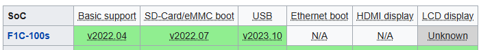

## 1. Ba level khi bring up một board

Khi bring up một board mới, ta không làm việc với cả cái board như một khối duy nhất. Phần cứng được phân thành 3 tầng và cả U-Boot lẫn Linux kernel cũng tổ chức source code theo đúng 3 tầng này:

```
Board (Lichee Pi Nano)
   └── SoC (Allwinner F1C100s)
          └── Architecture (ARM926EJ-S / ARMv5TE)
```

Khi phân tích thì ta đi từ trên xuống: cầm board lên, xác định SoC, rồi từ SoC xác định CPU core/architecture. Nhưng khi xét mức độ hỗ trợ của phần mềm thì phải đi từ dưới lên: architecture phải được hỗ trợ trước, rồi mới đến SoC, cuối cùng mới là board. Một board chưa có trong mainline không phải vấn đề lớn nếu SoC đã được hỗ trợ, ngược lại, nếu SoC chưa được hỗ trợ thì khối lượng công việc lớn hơn rất nhiều.

### 1.1. Architecture level

Đây là tầng thấp nhất: kiến trúc tập lệnh và CPU core. Với Lichee Pi Nano, đó là core ARM926EJ-S thuộc kiến trúc ARMv5TE. Tầng này quyết định:

- Toolchain để cross-compile: ARMv5 không có FPU nên ta dùng soft-float (`arm-linux-gnueabi-`), khác với các SoC ARMv7 thường dùng `arm-linux-gnueabihf-`.
- Cách CPU khởi động, exception vector, chế độ hoạt động (ARM/Thumb).
- MMU, cache, TLB

Trong source code, tầng này nằm ở:

- Linux: `arch/arm/`, phần riêng cho core đời cũ như ARM926 nằm ở `arch/arm/mm/proc-arm926.S`.
- U-Boot: `arch/arm/cpu/arm926ejs/`.

Tầng architecture gần như không bao giờ phải viết mới, ARM926EJ-S đã được hỗ trợ trong kernel từ hàng chục năm. Việc của ta chỉ là chọn đúng config và đúng toolchain.

### 1.2. SoC level

SoC là con chip cụ thể tích hợp CPU core cùng các controller ngoại vi: clock, pinctrl, UART, MMC, DRAM controller, timer, interrupt controller... Với board này, SoC là Allwinner F1C100s, thuộc họ mà cộng đồng sunxi gọi là suniv. Tầng này quyết định:

- Memory map: UART0 ở địa chỉ nào, MMC ở đâu, DRAM bắt đầu từ `0x80000000`...
- Boot ROM: khi cấp nguồn, Boot ROM trong SoC tìm SPL ở offset 8 KB trên SD card. Đây là lý do bước nạp U-Boot bên dưới dùng `seek=8`.
- Driver cho từng controller: clock, pinctrl, MMC, UART... phải có driver riêng cho SoC này.

Trong source code, tầng này nằm ở:

- Linux: driver rải rác trong `drivers/` (ví dụ `drivers/clk/sunxi-ng/ccu-suniv-f1c100s.c`) và device tree mô tả toàn bộ SoC ở `arch/arm/boot/dts/allwinner/suniv-f1c100s.dtsi`.
- U-Boot: `arch/arm/mach-sunxi/`, trong đó phần khởi tạo DRAM cho SPL là quan trọng nhất.

Tầng SoC là tầng quyết định độ khó của bring-up. Đây là lý do việc đầu tiên phải làm là check bảng support matrix của sunxi (như phần dưới): nếu SoC đã có trong mainline thì ta gần như chỉ còn việc ở tầng board.

### 1.3. Board level

Board là sản phẩm cụ thể: SoC được hàn lên PCB cùng cách đi dây nguồn, thạch anh, nút bấm, LED, khe SD, SPI flash... Cùng một SoC F1C100s có thể xuất hiện trên nhiều board khác nhau và mỗi board đấu nối khác nhau. Tầng này quyết định:

- Ngoại vi nào thực sự được sử dụng: Lichee Pi Nano đưa UART0 ra chân E0/E1, boot từ microSD hoặc SPI flash.
- Cấu hình cụ thể: dung lượng RAM (32 MiB DDR tích hợp), regulator, LED gắn vào GPIO nào.

Trong source code, tầng này chỉ là một lớp mỏng mô tả board này dùng những gì của SoC:

- Linux: device tree của board `arch/arm/boot/dts/allwinner/suniv-f1c100s-licheepi-nano.dts`. File này `#include` file `.dtsi` của SoC rồi bật (`status = "okay"`) và cấu hình các ngoại vi mà board dùng.
- U-Boot: `configs/licheepi_nano_defconfig` và device tree tương ứng.

Đây là tầng ta sẽ trực tiếp làm việc nhiều nhất khi viết BSP: schematic của board là tài liệu gốc, còn output là device tree + defconfig.

Tóm lại, với Lichee Pi Nano ba tầng ánh xạ như sau:

| Level | Cụ thể | Trong Linux | Việc phải làm |
| --- | --- | --- | --- |
| Architecture | ARM926EJ-S / ARMv5TE | `arch/arm/`, `proc-arm926.S` | Chọn đúng toolchain, defconfig |
| SoC | Allwinner F1C100s (suniv) | `drivers/*/sunxi*`, `suniv-f1c100s.dtsi` | Check mức support mainline |
| Board | Lichee Pi Nano | `suniv-f1c100s-licheepi-nano.dts` | Viết/sửa DTS, defconfig theo schematic |

## 2. Thu thập thông tin ban đầu

### 2.1. Thông tin phần cứng

Khi viết BSP cho một board, trước tiên ta cần thu thập các thông tin sau:

- Schematic của board.
- Datasheet/reference manual của SoC.
- Loại và dung lượng RAM.
- Sơ đồ nguồn, clock, reset.
- Boot media: SD, SPI flash hay eMMC.
- UART debug: UART nào, chân TX/RX nào, baudrate bao nhiêu.

Với Lichee Pi Nano, bảng thông tin ban đầu như sau:

| Thành phần | Thông số |
| --- | --- |
| SoC | Allwinner F1C100s |
| CPU | ARM926EJ-S / ARMv5TE |
| Clock | 533 MHz |
| Cache | 16 KB Data, 32 KB Instruction |
| RAM | 32 MiB DDR1, tích hợp trong SoC |
| Boot media | microSD hoặc SPI flash |
| UART debug | UART0, baudrate 115200 |

Chân serial của UART0:

| Licheepi Nano | Serial |
| --- | --- |
| E0 | RX |
| E1 | TX |

### 2.2. Tài liệu tham khảo

- Datasheet: [F1C100s Datasheet V1.0](https://linux-sunxi.org/images/b/ba/F1C100s_Datasheet_V1.0.pdf)
- Reference manual: F1C100s không có manual riêng, nhưng dùng chung được với [F1C600 User Manual V1.0](https://linux-sunxi.org/images/8/85/Allwinner_F1C600_User_Manual_V1.0.pdf) vì hai SoC gần như giống hệt nhau
- Wiki cộng đồng: [linux-sunxi.org](https://linux-sunxi.org/F1C100s)

### 2.3. Mục tiêu bring-up đầu tiên

Mục tiêu đầu tiên luôn là thấy được log qua UART, đây là dấu hiệu sớm nhất chứng tỏ chuỗi boot hoạt động:

```
Cấp nguồn
   -> Boot ROM trong SoC chạy, tìm SPL trên boot media
   -> SPL khởi tạo DRAM, load U-Boot
   -> U-Boot in log qua UART
```

Chỉ khi đạt được mục tiêu này ta mới đi tiếp đến kernel và rootfs. Nếu chưa có log UART thì mọi bước sau đều vô nghĩa, vì ta không có cách nào quan sát hệ thống.

## 3. Kiểm tra mức hỗ trợ mainline

Nguyên tắc chung: **luôn ưu tiên mainline**. Chỉ khi mainline chưa hỗ trợ hoặc thiếu driver ta cần thì mới tìm đến repository của hãng và các bản fork từ cộng đồng.

### 3.1. U-Boot

Theo [status matrix của cộng đồng sunxi](https://linux-sunxi.org/U-Boot#Status_Matrix) cho board Lichee Pi Nano:



Board được U-Boot mainline hỗ trợ từ version `v2022.04`. Tuy nhiên ở version này SPL mới chỉ hỗ trợ MMC, còn device tree của U-Boot chưa khai báo MMC controller nên U-Boot chưa load được kernel từ SD card. Do đó, để load được kernel ta cần dùng version `v2022.07` trở lên.

### 3.2. Linux kernel

Cũng theo cộng đồng sunxi, board được Linux mainline hỗ trợ với các mức khác nhau tuỳ version:

| Mức hỗ trợ | Linux | Commit |
| --- | --- | --- |
| Kernel chạy và in log qua UART | v5.0 | [324f4071a080](https://github.com/torvalds/linux/commit/324f4071a08046676a637521f211a34848f0cc0d) |
| Boot hoàn chỉnh từ microSD, mount rootfs | v5.19 | [30b6259f8bb8](https://github.com/torvalds/linux/commit/30b6259f8bb8f17377d13c61e47b66d71ec3abfe) |
| SPI NOR được mô tả trong board DTS | v5.19 | [37384b81bc25](https://github.com/torvalds/linux/commit/37384b81bc255bca3412536c50598fa50d05c751) |
| USB OTG/gadget | v6.4 | [bedc7c5490fc](https://github.com/torvalds/linux/commit/bedc7c5490fce4e57b55e025b4adfbd31f25623d) |

Một số driver chưa được mainline hỗ trợ như Display Engine, TCON/LCD RGB controller, Camera/DVP... Nếu cần các tính năng này thì phải dùng các bản fork:

- Lichee-Pi U-Boot fork: [Lichee-Pi/u-boot](https://github.com/Lichee-Pi/u-boot)
- Lichee-Pi Linux fork: [Lichee-Pi/linux](https://github.com/Lichee-Pi/linux)
- Buildroot dùng mainline: [goediy/licheepi-nano-mainline](https://github.com/goediy/licheepi-nano-mainline/tree/main)

Định hướng của ta là build image cho board bằng Yocto (release Scarthgap), mà Scarthgap dùng kernel 6.6 LTS, nên ta chọn luôn version 6.6 để bring-up thủ công - sau này chuyển sang Yocto sẽ không phải đổi kernel.

## 4. Chuẩn bị toolchain

Toolchain là bộ cross-compiler chạy trên máy host (x86_64) nhưng sinh ra binary cho target (ARM). Tên toolchain tuân theo cấu trúc **target triplet** `<arch>-<os>-<abi>` và chính phần ABI quyết định toolchain nào dùng được cho board nào:

| Triplet | ABI | Dùng cho |
| --- | --- | --- |
| `arm-linux-gnueabi-` | EABI, **soft-float** | ARM không có FPU hoặc không dùng FPU: ARMv4/v5 như F1C100s |
| `arm-linux-gnueabihf-` | EABI, **hard-float** | ARM có FPU (VFP), thường từ ARMv7 trở lên: i.MX6, AM335x, Raspberry Pi... |

Như đã phân tích ở mục 1.1, ARM926EJ-S không có FPU nên toolchain đúng cho board này là `arm-linux-gnueabi-`. Nếu dùng nhầm `gnueabihf-`, compiler sẽ sinh lệnh VFP mà CPU không có, chương trình userspace sẽ crash với illegal instruction. Riêng U-Boot và kernel luôn tự build ở chế độ soft-float nên build được bằng cả hai, nhưng ta thống nhất một toolchain cho toàn bộ tài liệu.

Có vài cách lấy toolchain, cho giai đoạn bring-up ta dùng cách đơn giản nhất, cài từ package của distro:

```bash
sudo apt install gcc-arm-linux-gnueabi
```

Kiểm tra:

```bash
arm-linux-gnueabi-gcc --version
```

Các lựa chọn khác khi cần version cụ thể hoặc kiểm soát chặt hơn:

- [Arm GNU Toolchain](https://developer.arm.com/downloads/-/arm-gnu-toolchain-downloads) - bản chính thức từ Arm, prebuilt.
- [Bootlin toolchains](https://toolchains.bootlin.com/) - prebuilt cho từng cặp architecture/libc, có sẵn `armv5-eabi`.
- Yocto SDK - về sau khi đã có meta layer, Yocto tự build toolchain khớp tuyệt đối với rootfs; đây mới là toolchain "chuẩn" của sản phẩm.

Từ đây trở đi, mọi lệnh build đều truyền hai biến `ARCH=arm CROSS_COMPILE=arm-linux-gnueabi-` để hệ thống build dùng đúng toolchain này.

## 5. Build và nạp U-Boot

### 5.1. Build U-Boot

Clone đúng tag `v2022.07` đã xác định ở trên và build với toolchain soft-float:

```bash
git clone --depth 1 --branch v2022.07 --single-branch https://github.com/u-boot/u-boot.git
cd u-boot/

make ARCH=arm CROSS_COMPILE=arm-linux-gnueabi- licheepi_nano_defconfig
make ARCH=arm CROSS_COMPILE=arm-linux-gnueabi- -j$(nproc)
```

Build thành công sẽ tạo ra file `u-boot-sunxi-with-spl.bin` - một binary duy nhất chứa cả SPL lẫn U-Boot proper, đã được đặt đúng layout mà Boot ROM yêu cầu:

```
u-boot-sunxi-with-spl.bin
├── SPL
└── U-Boot
```

### 5.2. Nạp U-Boot vào SD card

:::warning Lưu ý
Cần xác định đúng `/dev/sdX`. Nếu chọn nhầm, lệnh `dd` sẽ ghi đè và phá huỷ dữ liệu trên ổ cứng hệ thống.
:::

1. Cắm SD card và xác định device:

   ```bash
   lsblk
   # => giả sử SD card là /dev/sdX
   export card=/dev/sdX
   ```

2. Xoá vùng đầu SD card (nơi chứa bảng phân vùng và bootloader cũ nếu có):

   ```bash
   sudo dd if=/dev/zero of=${card} bs=1M count=1
   ```

3. Ghi binary vào offset 8 KB - đúng vị trí BROM của F1C100s tìm SPL:

   ```bash
   sudo dd if=u-boot-sunxi-with-spl.bin \
        of=${card} \
        bs=1024 seek=8 \
        conv=fsync,notrunc \
        status=progress
   ```

4. Đồng bộ và tháo thẻ:

   ```bash
   sync
   sudo eject ${card}
   ```

### 5.3. Kiểm tra U-Boot boot

Cắm SD card vào board, cấp nguồn và mở serial console (115200 8N1). Log mong đợi:

```log
U-Boot SPL 2022.07 (Jun 28 2026 - 20:07:14 +0700)
DRAM: 32 MiB
Trying to boot from MMC1


U-Boot 2022.07 (Jun 28 2026 - 20:07:14 +0700) Allwinner Technology

CPU:   Allwinner F Series (SUNIV)
Model: Lichee Pi Nano
DRAM:  32 MiB
Core:  26 devices, 14 uclasses, devicetree: separate
WDT:   Not starting watchdog@1c20ca0
MMC:   mmc@1c0f000: 0
Loading Environment from FAT... Unable to use mmc 0:0...
In:    serial@1c25000
Out:   serial@1c25000
Err:   serial@1c25000
Net:   No ethernet found.
Hit any key to stop autoboot:  0
switch to partitions #0, OK
mmc0 is current device
** No partition table - mmc 0 **
Couldn't find partition mmc 0:1
...
Config file not found
No ethernet found.
=>
```

Đọc log này theo checklist bring-up:

- `U-Boot SPL 2022.07`: Boot ROM đã tìm thấy và chạy được SPL -> chuỗi boot tầng SoC hoạt động.
- `DRAM: 32 MiB`: SPL khởi tạo DRAM thành công, đúng dung lượng.
- Prompt `=>`: U-Boot proper chạy hoàn chỉnh và nhận lệnh qua UART.

Các dòng lỗi `No partition table`, `Config file not found` là bình thường ở bước này: ta mới ghi U-Boot raw vào offset 8 KB, SD card chưa có bảng phân vùng, chưa có kernel để boot. Mục tiêu bring-up đầu tiên (mục 2.3) đã đạt.

## 6. Build Linux kernel

Mục tiêu: Kernel boot đến panic "unable to mount root fs" - tức CPU, memory, interrupt, UART đều OK.

### 6.1. Lấy source

Clone branch stable `linux-6.6.y` - branch này liên tục nhận các bản patch ổn định của dòng 6.6:

```bash
git clone --depth 1 --single-branch --branch linux-6.6.y \
    https://git.kernel.org/pub/scm/linux/kernel/git/stable/linux.git linux
cd linux
```

Kiểm tra version vừa lấy:

```bash
git describe --tags --always
```

### 6.2. Cấu hình

Build ra thư mục riêng (`O=build`) để không làm bẩn source tree, và dọn cấu hình cũ nếu có:

```bash
mkdir -p build
make O=build ARCH=arm CROSS_COMPILE=arm-linux-gnueabi- mrproper
```

Dùng `multi_v5_defconfig` - defconfig chung cho các SoC ARMv5 multiplatform, đã bao gồm họ suniv:

```bash
make O=build ARCH=arm CROSS_COMPILE=arm-linux-gnueabi- multi_v5_defconfig
```

Tinh chỉnh: bật ext4 và devtmpfs để mount rootfs, tắt USB để giảm thời gian build ở giai đoạn bring-up:

```bash
./scripts/config --file build/.config \
    --enable EXT4_FS \
    --enable DEVTMPFS \
    --enable DEVTMPFS_MOUNT \
    --enable TMPFS \
    --disable USB \
    --disable USB_GADGET
```

Chạy `olddefconfig` để kernel tự giải quyết các dependency của những option vừa đổi:

```bash
make O=build ARCH=arm CROSS_COMPILE=arm-linux-gnueabi- olddefconfig
```

### 6.3. Build kernel, DTB và module

```bash
make O=build ARCH=arm CROSS_COMPILE=arm-linux-gnueabi- -j$(nproc) zImage dtbs modules
```

Hai file output cần cho bước tiếp theo:

```
build/arch/arm/boot/zImage
build/arch/arm/boot/dts/allwinner/suniv-f1c100s-licheepi-nano.dtb
```

Để ý tên file DTB: đúng theo phân tầng ở mục 1, nó là device tree của **board** (`licheepi-nano`), build từ file `.dts` include file `.dtsi` của **SoC** (`suniv-f1c100s`).

## 7. Chuẩn bị SD card hoàn chỉnh

Layout SD card nhìn theo trục offset từ đầu thẻ:

```
Offset
0        ┌─────────────────────────────────┐
         │ MBR - bảng phân vùng            │
8 KB     ├─────────────────────────────────┤
         │ u-boot-sunxi-with-spl.bin       │  SPL + U-Boot
1 MiB    ├─────────────────────────────────┤
         │ /dev/sdX1 - BOOT (FAT32)        │  zImage, DTB, boot.scr
65 MiB   ├─────────────────────────────────┤
         │ /dev/sdX2 - rootfs (ext4)       │  ext4 rootfs partition
         └─────────────────────────────────┘
```

Hai điểm cần để ý ở layout này:

- U-Boot không nằm trong partition nào. Boot ROM không hiểu filesystem, nó chỉ đọc raw theo offset cố định 8 KB. Vì vậy vùng từ 8 KB đến trước partition đầu tiên phải được giữ trống cho bootloader.
- Partition đầu tiên bắt đầu từ 1 MiB (thay vì ngay sau MBR) để chừa đủ chỗ cho U-Boot; `u-boot-sunxi-with-spl.bin` của board này chỉ vài trăm KB nên 1 MiB là dư an toàn. Đây cũng là alignment mặc định của các tool partition hiện đại.

### 7.1. Tạo partition

```bash
sudo parted -s /dev/sdX mklabel msdos
sudo parted -s /dev/sdX unit MiB mkpart primary fat32 1 65
sudo parted -s /dev/sdX set 1 boot on
sudo parted -s /dev/sdX unit MiB mkpart primary ext4 65 100%
sudo partprobe /dev/sdX
```

Kiểm tra:

```bash
lsblk -p /dev/sdX
```

Phải thấy đủ 2 partition:

```
/dev/sdX
├─/dev/sdX1
└─/dev/sdX2
```

### 7.2. Format

```bash
sudo mkfs.vfat -F 32 -n BOOT /dev/sdX1
sudo mkfs.ext4 -F -L rootfs /dev/sdX2
```

### 7.3. Ghi lại U-Boot

Lệnh `mklabel msdos` đã ghi lại MBR ở sector 0, nhưng để chắc chắn vùng bootloader nguyên vẹn, ta ghi lại U-Boot sau khi partition xong:

```bash
sudo dd if=u-boot-sunxi-with-spl.bin \
    of=/dev/sdX \
    bs=1024 seek=8 \
    conv=fsync,notrunc \
    status=progress

sync
```

### 7.4. Copy kernel và DTB vào boot partition

```bash
sudo mkdir -p /media/lichee
sudo mount /dev/sdX1 /media/lichee

sudo cp linux/build/arch/arm/boot/zImage /media/lichee/
sudo cp linux/build/arch/arm/boot/dts/allwinner/suniv-f1c100s-licheepi-nano.dtb /media/lichee/

sync
sudo umount /media/lichee
```

## 8. Boot kernel

### 8.1. Boot thủ công từ U-Boot prompt

Trước khi tự động hoá, ta boot thủ công một lần để xác nhận từng bước. Tại prompt `=>`, kiểm tra U-Boot nhìn thấy SD card và các file boot:

```
=> mmc dev 0
=> mmc part
=> fatls mmc 0:1
```

`fatls` phải liệt kê được:

```
zImage
suniv-f1c100s-licheepi-nano.dtb
```

Load kernel và DTB vào RAM (DRAM của F1C100s bắt đầu tại `0x80000000`, hai địa chỉ dưới cách nhau đủ xa để zImage giải nén không đè lên DTB):

```
=> fatload mmc 0:1 0x80008000 zImage
=> fatload mmc 0:1 0x80c00000 suniv-f1c100s-licheepi-nano.dtb
```

Đặt kernel command line:

```
=> setenv bootargs console=ttyS0,115200 earlycon root=/dev/mmcblk0p2 rootwait rw
```

Trong đó:

- `console=ttyS0,115200` - kernel in log ra UART0.
- `earlycon` - bật console sớm ngay từ đầu quá trình boot, trước khi driver serial chính thức được load; rất quan trọng khi debug.
- `root=/dev/mmcblk0p2 rootwait` - rootfs nằm ở partition 2 của SD card, chờ device sẵn sàng rồi mới mount.

Boot (dấu `-` ở giữa nghĩa là không dùng initrd):

```
=> bootz 0x80008000 - 0x80c00000
```

Ở thời điểm này partition 2 chưa có rootfs, nên kernel sẽ khởi động, in log đầy đủ rồi panic ở bước mount root:

```
VFS: Unable to mount root fs
Kernel panic
```

Đây là kết quả **mong đợi**: nó chứng tỏ kernel + DTB hoạt động đúng, chỉ còn thiếu rootfs - tương ứng mức hỗ trợ "kernel chạy và in log qua UART" trong bảng ở mục 3.2.

### 8.2. Tự động hoá bằng boot script

Khi đã xác nhận các lệnh thủ công chạy đúng, ta gói chúng vào file `boot.cmd`:

```
setenv bootargs console=ttyS0,115200 panic=5 earlycon root=/dev/mmcblk0p2 rootwait rw
fatload mmc 0:1 0x80008000 zImage
fatload mmc 0:1 0x80c00000 suniv-f1c100s-licheepi-nano.dtb
bootz 0x80008000 - 0x80c00000
```

(`panic=5` để board tự reboot sau 5 giây nếu kernel panic, thay vì treo vĩnh viễn.)

Compile thành boot script mà U-Boot đọc được:

```bash
mkimage -C none -A arm -T script -d boot.cmd boot.scr
```

Copy `boot.scr` vào boot partition:

```bash
sudo mkdir -p /media/lichee
sudo mount /dev/sdX1 /media/lichee

sudo cp boot.scr /media/lichee/

sync
sudo umount /media/lichee
```

Từ giờ mỗi lần cấp nguồn, U-Boot sẽ tự tìm thấy `boot.scr` trên partition FAT và chạy chuỗi lệnh trong đó - không cần gõ tay nữa.

## 9. Hướng tới Yocto

Đến đây ta đã đi hết chu trình bring-up thủ công: build U-Boot, build kernel, dựng layout SD card và boot đến tận điểm mount rootfs. Toàn bộ các bước thủ công này chính là tiền để để ta đóng gói thành một meta layer Yocto:

| Bước thủ công | Thành phần Yocto tương ứng |
| --- | --- |
| Chọn SoC/board, toolchain, DTB | Machine configuration (`machine/*.conf`) |
| Build U-Boot v2022.07, `licheepi_nano_defconfig` | U-Boot recipe |
| Build kernel 6.6, defconfig + fragment | Kernel recipe |
| Partition, format, ghi U-Boot vào offset 8 KB | Image layout (WIC/wks) |
| Chọn package cho rootfs | Image recipe, distro policy |
