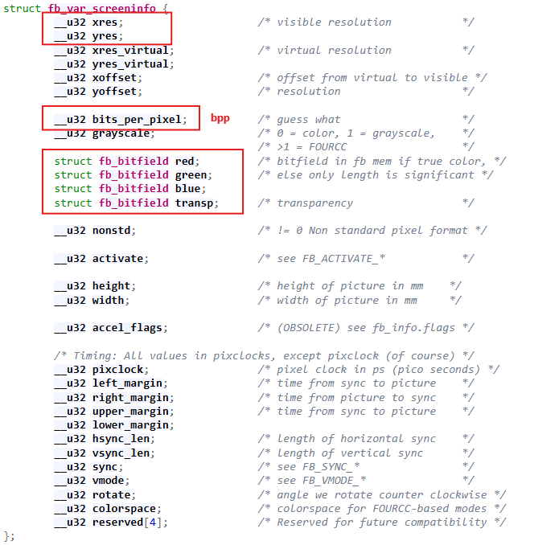

# Framebuffer

## Mở đầu

Trước thập niên 1990, trên Linux, mỗi card đồ họa đều có driver riêng biệt, cung cấp API và cách lập trình khác nhau -> Không có sự thống nhất.

Để giải quyết điều này, Linux giới thiệu framebuffer subsystem từ kernel 2.x với mục tiêu cung cấp một giao diện thống nhất giữa user-space và bất kỳ phần cứng hiển thị nào.

Framebuffer là vùng nhớ RAM mà mỗi ô trong đó tương ứng với một điểm ảnh trên màn hình.

Nói cách khác:
- Ứng dụng không cần quan tâm phần cứng.
- Kernel cung cấp thiết bị `/dev/fbX`.
- Ghi dữ liệu vào `/dev/fbX` → hình ảnh hiển thị lên màn hình.

Tuy nhiên, nó vẫn gặp một số hạn chế:

| Hạn chế                           | Hậu quả                          |
| --------------------------------- | -------------------------------- |
| Chỉ có 1 buffer duy nhất          | Dễ bị "xé hình" (tearing)        |
| Không hỗ trợ multi-display        | Không dùng cho GPU phức tạp      |
| Không có concept CRTC/encoder     | Không phù hợp cho video pipeline |
| Không có buffer sharing (DMA-BUF) | Không tối ưu cho render đa luồng |
| Không có hardware acceleration    | Chậm, phụ thuộc CPU              |

Do đó, DRM/KMS ra đời để giải quyết các hạn chế này.

## Direct Rendering Manager - DRM

DRM là một subsystem trong Linux kernel dùng để:
- Quản lý GPU, display controller, và các thiết bị xuất hình ảnh (như HDMI, LVDS, SPI display,...).
- Cho phép user-space giao tiếp an toàn và hiệu quả với phần cứng đồ họa.

Mục tiêu: Cung cấp một API chung để driver GPU, driver framebuffer, và các ứng dụng đồ họa có thể giao tiếp thống nhất.

DRM là một phần của kernel graphics subsystem, được đặt trong folder `drivers/gpu/drm/`.

## Sự khác biệt giữa framebuffer và DRM

| Tiêu chí                        | Framebuffer (fbdev)                               | DRM / TinyDRM                                   |
| ------------------------------- | ------------------------------------------------- | ----------------------------------------------- |
| **Device node**                 | `/dev/fb0`, `/dev/fb1`                            | `/dev/dri/card0`, `/dev/dri/planeX`             |
| **Quản lý buffer**              | 1 buffer duy nhất (linear)                        | Nhiều buffer (double/triple buffering)          |
| **Cập nhật hình ảnh**           | Ghi pixel trực tiếp                               | Atomic commit (chuyển toàn khung hình cùng lúc) |
| **Hiệu năng**                   | Thấp, CPU copy pixel                              | Cao hơn (async DMA, vsync)                      |
| **Đồng bộ hiển thị (vsync)**    | Không hỗ trợ                                      | Hỗ trợ vsync/tearing-free                       |
| **Đa màn hình (multi-display)** | Không hỗ trợ                                      | Hỗ trợ                                          |
| **Hỗ trợ GPU**                  | Không hỗ trợ                                      | Hỗ trợ                                          |
| **Ứng dụng đồ họa hiện đại**    | Không tương thích với Wayland, X.Org mới          | Tương thích hoàn toàn (KMS API)                 |
| **Driver mẫu trong kernel**     | `drivers/video/fbdev/`                            | `drivers/gpu/drm/` và `drivers/gpu/drm/tiny/`   |

## Framebuffer console driver - fbcon

fbcon là một client đặc biệt của fbdev trong kernel. Nhiệm vụ của nó là hiển thị console text bằng cách “vẽ chữ” lên framebuffer.

fbcon tự động chạy khi:
- Một driver framebuffer được đăng ký.
- Không có console nào khác chiếm quyền.
- Kernel được build với: `FRAMEBUFFER_CONSOLE=y`

fbcon chiếm framebuffer, nên khi chạy ứng dụng ghi dữ liệu lên framebuffer như LVGL, qt,..., nó có thể va chạm với nhau. Lúc này có hai giải pháp:

**1. Trong quá trình runtime, tắt fbcon trước khi chạy GUI**

```bash
echo 1 > /sys/class/graphics/fbcon/blank
```

**2. Trước khi build, disable fbcon**

```
Device Drivers  --->
  Graphics support  --->
    Console display driver support  (FRAMEBUFFER_CONSOLE)
```

→ bỏ chọn mục này, rebuild kernel.

## Cách sử dụng framebuffer

**Open device**

Trước tiên, ta cần open device:

```c
fd_fb = open("/dev/fb0", O_RDWR);
if (fd_fb < 0)
{
  printf("can't open /dev/fb0\n");
  return -1;
}
```

**Lấy thông số LCD**

LCD driver cung cấp hai loại struct là [fb_var_screeninfo](https://elixir.bootlin.com/linux/v5.4.288/source/include/uapi/linux/fb.h#L241) và [fb_fix_screeninfo](https://elixir.bootlin.com/linux/v5.4.288/source/include/uapi/linux/fb.h#L157). Khi viết application, ta cần quan tâm đến các thông số sau:



Code sau được sử dụng để lấy thông tin [fb_var_screeninfo](https://elixir.bootlin.com/linux/v5.4.288/source/include/uapi/linux/fb.h#L241):

```c
static struct fb_var_screeninfo var; /* Current var */

if (ioctl(fd_fb, FBIOGET_VSCREENINFO, &var))
{
  printf("can't get var\n");
  return -1;
}
```

Ngoài ra, thông tin của [fb_fix_screeninfo](https://elixir.bootlin.com/linux/v5.4.288/source/include/uapi/linux/fb.h#L157) cũng có thể được lấy bằng ioctl `FBIOGET_FSCREENINFO`.

**Map framebuffer**

```c
line_width = var.xres * var.bits_per_pixel / 8;
pixel_width = var.bits_per_pixel / 8;
screen_size = var.xres * var.yres * var.bits_per_pixel / 8;
fb_base = (unsigned char *)mmap(NULL , screen_size, PROT_READ | PROT_WRITE, MAP_SHARED, fd_fb, 0);

if (fb_base == (unsigned char *)-1)
{
  printf("can't mmap\n");
  return -1;
}
```

**Vẽ pixel**

```c
void lcd_put_pixel(int x, int y, unsigned int color)
{
  unsigned char *pen_8 = fb_base + y*line_width + x*pixel_width;
  unsigned short *pen_16;
  unsigned int *pen_32;
  unsigned int red, green, blue;

  pen_16 = (unsigned short *)pen_8;
  pen_32 = (unsigned int *)pen_8;

  switch (var.bits_per_pixel)
  {
    case 8:
    {
      *pen_8 = color;
      break;
    }
    case 16:
    {
      /* 565 */
      red = (color >> 16) & 0xff;
      green = (color >> 8) & 0xff;
      blue = (color >> 0) & 0xff;
      color = ((red >> 3) << 11) | ((green >> 2) << 5) | (blue >> 3);
      *pen_16 = color;
      break;
    }
    case 32:
    {
      *pen_32 = color;
      break;
    }
    default:
    {
      printf("can't surport %dbpp\n",var.bits_per_pixel);
      break;
    }
  }
}
```