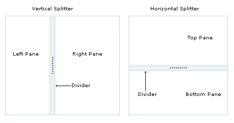
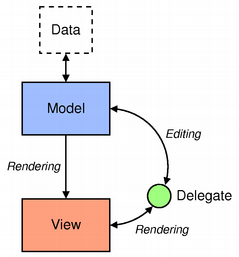

# Qt

## Toolbar


Nhìn vào thanh toolbar lần lượt có:
- Edit widget
- Edit Signals/Slots
- Edit Buddies
- Edit Tab Order
- Lay Out Horizontally
- Lay Out Vertically
- Lay Out Horizontally in Splitter
- Lay Out Vertically in Splitter
- Break layout
- Adjust size

## Layout

Layout trong Qt là cơ chế tự động quản lý vị trí và kích thước của các widget con bên trong một widget cha.

TA không cần tính toán thủ công tọa độ như:

```cpp
button->setGeometry(x, y, w, h);
```

Điều này có một số vấn đề khi kích thước cửa sổ thay đổi:
- Các widget không tự co giãn.
- UI bị méo, tràn hoặc đè nhau.

Phải tính toán lại từng vị trí → rất tốn công. Thay vào đó, layout giúp:
- Co giãn giao diện theo kích thước cửa sổ.
- Giữ khoảng cách chuẩn giữa các widget.
- Sắp xếp widget theo hàng/cột hoặc theo lưới.
- Tự động bố trí lại khi theme thay đổi hoặc DPI thay đổi.
- Tự động quản lý minimum/maximum size, sizePolicy, stretch factors.

### Stretch factor

Stretch factor quy định phân chia tỷ lệ giữa các widget con.

Ví dụ:

```cpp
auto *layout = new QHBoxLayout();
layout->addWidget(btn1, 1);   // Stretch = 1
layout->addWidget(btn2, 3);   // Stretch = 3
```

Nếu layout có 400 px chiều rộng còn lại để chia:
- btn1 nhận: 1 phần → 100 px
- btn2 nhận: 3 phần → 300 px

### Size Policy

Size policy quyết định cách widget phản ứng với layout:
- Có cho phép giãn không?
- Có muốn giãn không?
- Có nên ưu tiên widget này khi co/giãn không?

### Spacer item

Spacer item là một đối tượng đặc biệt không hiển thị, có tác dụng nhằm chiếm chỗ trong layout. Khi layout tính toán vị trí các widget con, spacer được dùng để:
- Tạo khoảng trống cố định hoặc giãn linh hoạt giữa các widget.
- Cân bằng, đẩy widget ra biên trái/phải, trên/dưới.
- Giúp UI tự động co giãn khi cửa sổ thay đổi kích thước.

## Signals/Slots

Signal/Slot là cơ chế truyền thông điệp bất đồng bộ trong Qt, dùng để:
- Một đối tượng bắn một sự kiện → gọi là signal
- Một đối tượng khác hứng và xử lý sự kiện đó → gọi là slot

### Manual Connect

Đây là cách bạn chủ động kết nối signal ↔ slot bằng code C++.

Ví dụ (new syntax – khuyến dùng):

```cpp
connect(button, &QPushButton::clicked,
        this, &MainWindow::handleClick);
```

Hoặc old syntax:

```cpp
connect(button, SIGNAL(clicked()),
        this, SLOT(handleClick()));
```

👉 Ưu điểm
- Linh hoạt, rõ ràng.
- Không bị phụ thuộc quy ước tên: objectName, tên hàm slot.
- Dễ kiểm soát.

👉 Nhược điểm
- Tốn thời gian viết code nếu nhiều widget.
- Phải tự connect từng widget.

### Auto connect

Auto-connect được dùng với Qt Designer và ta viết tên hàm theo đúng pattern:

```
on_<objectName>_<signalName>()
```

Ví dụ widget có:
- objectName = `lightButton`
- Signal = `clicked()`

→ slot:

```cpp
void MainWindow::on_lightButton_clicked();
```

Qt sẽ tự động connect mà bạn không cần viết connect().

:::tip
Manual connect + Auto-connect không ghi đè nhau
:::

Nếu ta có:

```cpp
connect(lightButton, &QPushButton::clicked, this, &MainWindow::foo);
```

Và bạn có slot auto-connect:

```cpp
void MainWindow::on_lightButton_clicked();
```

→ Khi click:

✔ `on_lightButton_clicked()` được gọi (auto)
✔ `foo()` được gọi (manual)

=> Hai kết nối độc lập, không overwrite.

## Splitter

QSplitter là một container widget cho phép chứa nhiều widget con và ngăn cách chúng bằng một thanh chia gọi là split handle. Người dùng có thể kéo handle để thay đổi kích thước widget con.

Nói cách khác, nó là layout có thể kéo giãn động bằng chuột.



## Buddy

Buddy là một widget được gán cho một QLabel để khi người dùng nhấn tổ hợp phím tắt thì sẽ tự động chuyển đến widget đó.

Cơ chế hoạt động: **Ký tự sau dấu “&” sẽ làm phím tắt.**

Ví dụ:

```cpp
QLabel *label = new QLabel("&Username:");
QLineEdit *lineEdit = new QLineEdit;
label->setBuddy(lineEdit);
```

- Dấu “&” trong "&Username:" cho Qt biết rằng phím “U” là phím tắt.
- Khi ứng dụng chạy, label sẽ hiển thị “Username:” với ký tự “U” có gạch chân.
- Khi người dùng nhấn Alt + U, focus sẽ nhảy vào ô lineEdit.

## Cơ chế Meta-Object Compiler (MOC)

MOC là bộ tiền xử lý (preprocessor) do Qt cung cấp. Nó phân tích mã nguồn C++ và tự động sinh ra mã C++ bổ sung để hỗ trợ các tính năng mà C++ chuẩn không có, như:
- Signal & Slot (giao tiếp giữa các đối tượng)
- Q_OBJECT macro
- Q_PROPERTY / Q_CLASSINFO / Q_ENUM
- Reflection (truy cập thông tin class lúc runtime)

**Cơ chế hoạt động**

1. Khi biên dịch project Qt, build system sẽ tự động detect các class chứa `Q_OBJECT`. Ví dụ:

    ```cpp
    class MyClass : public QObject {
        Q_OBJECT

    public:
        explicit MyClass(QObject *parent = nullptr);

    signals:
        void valueChanged(int);

    private slots:
        void updateValue(int v);
    };
    ```

2. Chạy moc để xử lý và Qt compiler sẽ tạo thêm file `moc_myclass.cpp` tương ứng với class chứa `Q_OBJECT`.

3. File này sẽ chứa các metadata object `QMetaObject` chứa danh sách signal, slot, property.

## Reflection

Trong quá trình runtime, khi ta muốn:
- Lấy type property
- Liệt kế tất cả property của một object
- Đọc giá trị của property bằng tên chuỗi
- Gọi method bằng tên chuỗi
- Kiểm tra xem class có thuộc tính mong muốn hay không

-> Những điều này C++ không hỗ trợ, do đó Qt sinh ra MOC để mô phỏng reflection.

Với cơ chế này, ta có thể truy cập vào thuộc tính của một QObject khi chương trình đang chạy bằng tên chuỗi. Ví dụ:

```cpp
QObject *obj = ...
obj->setProperty("temperature", 25);
qDebug() << obj->property("temperature");
```

<b style="color:red; font-size: 20px">Tại sao lại cần truy cập thuộc tính bằng string</b>

**Khi build UI từ file config, json hoặc XML.**

Ví dụ:

```json
{
  "speed": 120,
  "mode": "auto",
  "accel": 10
}
```

Ta không thể hardcode kiểu này:

```cpp
motor.Speed = json["speed"];
motor.Mode = json["mode"];
motor.Accel = json["accel"];
```

Vì nếu thêm trường mới thì ta lại phải chỉnh sửa lại code. Ta có thể làm như sau để linh hoạt hơn:

```cpp
foreach (var kv in json)
{
    var prop = t.GetProperty(kv.Key);
    if (prop != null)
        prop.SetValue(motor, kv.Value);
}
```

**Kết nối với QML**

QML dùng property theo tên chuỗi:

```qml
Text { 
    text: device.temperature
}
```

Nếu không có property dưới dạng meta-object:
- QML không thể biết temperature là gì
- Không thể binding
- Không thể animate

## Signal/slot

Signal là một hàm đặc biệt được MOC sinh ra để phát thông điệp ra ngoài. Nó không có phần thân trong code, nhưng MOC tự sinh ra phần gọi.

Khi chạy, QT sẽ tìm tất cả slot được connect tới signal và gọi slot tương ứng (ngay lập tức hoặc thông qua queued nếu khác thread).

## Property

`Q_PROPERTY` có tác dụng biến một biến member thành property động, từ đó có thể:
- Được đọc/ghi bởi Qt Meta-Object System
- Sử dụng trong QML, QDesigner, hoặc QVariant
- Được dùng trong binding, animation, data serialization

Cú pháp đơn giản như sau:

```CPP
Q_PROPERTY(type name
           READ getFunction
           WRITE writeFunction
           NOTIFY notifySignal
           RESET resetFunction)
```

## Kiến trúc Model-View-Controler (MVC)

MVC là một mẫu kiến trúc phần mềm để tạo giao diện người dùng. Nó chia thành ba phần được kết nối với nhau và mỗi thành phần đều có một nhiệm vụ riêng của nó và độc lập với các thành phần khác.

1. Model

- Có nhiệm vụ thao tác với Database
- Nó chứa tất cả các hàm, các phương thức truy vấn trực tiếp với dữ liệu
- Controller sẽ thông qua các hàm, phương thức đó để lấy dữ liệu rồi gửi qua View

2. View
- Là giao diện người dùng (User Interface)
- Chứa các thành phần tương tác với người dùng như menu, button, image, text,...
- Nơi nhận dữ liệu từ Controller và hiển thị

3. Controller
- Là thành phần trung gian giữa Model và View
- Đảm nhận vai trò tiếp nhận yêu cầu từ người dùng, thông qua Model để lấy dữ liệu sau đó thông qua View để hiển thị cho người dùng

### MVC trong QT

Qt dùng một biến thể của mô hình MVC, chính xác hơn là Model-View-Delegate.



Nó tách rõ 3 vai trò:

| Thành phần   | Vai trò                             | Lớp cơ sở             |
| ------------ | ----------------------------------- | --------------------- |
| **Model**    | Lưu và quản lý dữ liệu              | `QAbstractItemModel`  |
| **View**     | Hiển thị và xử lý tương tác         | `QAbstractItemView`   |
| **Delegate** | Quy định cách hiển thị và chỉnh sửa | `QStyledItemDelegate` |

Qt không có Controller riêng như MVC, mà View kiêm luôn vai trò của Controller (nhận input, tương tác người dùng, rồi báo lại Model).

1. Model

Model là nơi dữ liệu trung tâm.
View không giữ dữ liệu, mà chỉ hỏi model để lấy thông tin hiển thị.
Model chịu trách nhiệm:
- Lưu và tổ chức dữ liệu (list, bảng, cây, database…)
- Cung cấp dữ liệu cho view
- Nhận dữ liệu từ view khi người dùng chỉnh sửa
- Báo cho view biết khi dữ liệu thay đổi

2. View
View là lớp giao diện, chịu trách nhiệm:
- Hiển thị dữ liệu từ Model (list, tree, table)
- Nhận tương tác từ người dùng (click, chọn, edit)
- Thông báo lại cho Model khi có thay đổi

3. Delegate

Delegate là lớp trung gian giữa Model và View, phụ trách:
- Vẽ dữ liệu (paint) – định nghĩa cách hiển thị mỗi item.
- Tạo editor (createEditor) – định nghĩa cách chỉnh sửa dữ liệu (textbox, combobox…).

## QString

QString lưu trữ chuỗi dưới dạng UNICODE UTF-16 và cung cấp nhiều method để thao tác với chuỗi.

Một số ví dụ:

- *Hiển thị chuỗi trong GUI*

```cpp
ui->label->setText("Temperature: " + QString::number(temp) + "°C");
```

- *Đọc chuỗi từ file*

```cpp
QFile file("data.txt");
if (file.open(QIODevice::ReadOnly | QIODevice::Text)) {
    QString content = file.readAll();
    file.close();
}
```

**Placeholder format**

Qt định nghĩa cú pháp `%1`, `%2`, `%3`, ... làm placeholder, đây là vị trí chèn giá trị vào chuỗi. Mỗi `arg()` sẽ thay lần lượt các placeholder này bằng giá trị tương ứng. Ví dụ như sau:

```cpp
QString s = QString("Hello %1, temperature is %2°C")
                .arg("BBB")
                .arg(27);
```

Hàm `arg` có nhiều overload hỗ trợ các kiểu dữ liệu khác nhau.

- Nhóm số nguyên

Cú pháp:

```cpp
QString QString::arg(
    int value,
    int fieldWidth = 0,
    int base = 10,
    QChar fillChar = QLatin1Char(' ')
) const;
```

Trong đó:
- `value`: Giá trị số cần thay thế vào placeholder.
- `fieldWidth`: Độ rộng tối thiểu của phần in ra.
  + Nếu > 0 → căn phải, chèn ký tự `fillChar` bên trái.
  + Nếu < 0 → căn trái, chèn ký tự `fillChar` bên phải.
- `base`: Hệ cơ số: 2 (nhị phân), 8 (bát phân), 10 (thập phân), 16 (thập lục phân).
- `fillChar`: Ký tự padding để đủ độ rộng.

- Nhóm số thực

Cú pháp:

```cpp
QString QString::arg(
    double value,
    int fieldWidth = 0,
    char format = 'g',
    int precision = -1,
    QChar fillChar = QLatin1Char(' ')
) const;
```

Trong đó:
- `value`: Giá trị dấu phẩy động cần thay vào.
- `fieldWidth`: Tương tự nhóm số nguyên.
- `format`: Kiểu định dạng số:
  + 'f': fixed-point
  + 'e': exponential (dạng khoa học, e.g. 3.14e+02)
  + 'g': general (Qt tự chọn giữa 'f' hoặc 'e')
- `precision`: Số chữ số sau dấu thập phân
- `fillChar`: Tương tự nhóm số nguyên.

- Nhóm ký tự

Cú pháp:

```cpp
QString QString::arg(
    QChar ch,
    int fieldWidth = 0,
    QChar fillChar = QLatin1Char(' ')
) const;
```

- Nhóm string

```cpp
QString QString::arg(
    const QString &value,
    int fieldWidth = 0,
    QChar fillChar = QLatin1Char(' ')
) const;
```