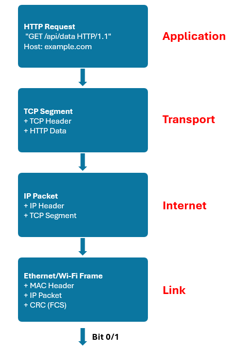

# Network basic

## Kiến thức cơ sở

### Mac address

- MAC: Media Access Control.
- MAC là địa chỉ phần cứng của card mạng.
- Định dạng hex dài 6 byte: `A4:5E:60:1B:2C:3D`.
- Mỗi thiết bị có một MAC duy nhất do nhà sản xuất cung cấp.
- Mỗi thiết bị hoạt động trong mạng LAN thì cần có địa chỉ MAC.

### IP Address

- IP: Internet Protocol.
- IP là địa chỉ logic để định tuyến thiết bị trong internet hoặc nhiều mạng kết nối với nhau.
- Có thể thay đổi do router cấp qua DHCP hoặc cài tĩnh.

### Subnet

Subnet có tác dụng chia nhỏ một dải địa chỉ IP thành nhiều phần để:

**1. Dễ quản lý**

Ví dụ:

Ta có dải IP `192.168.1.0` – `192.168.1.255` (tổng cộng 256 địa chỉ).

Nếu không chia subnet → tất cả thiết bị đều nói chuyện trong một mạng duy nhất.

Nếu chia subnet:

- `192.168.1.0` – `192.168.1.127` → cho văn phòng.
- `192.168.1.128`– `192.168.1.255` → cho IoT.

=> Dễ quản lý hơn

**2. Giảm broadcast**

Trong mạng LAN, khi một thiết bị muốn tìm MAC của một IP → nó gửi broadcast ARP đến toàn bộ mạng.

Do đó, nếu có hàng nghìn thiết bị trong một subnet, tất cả đều phải nghe broadcast → tốn băng thông.

### Subnet mask

Subnet mask cho biết bao nhiêu bit là phần mạng, bao nhiêu bit là phần host.

Ví dụ:

IP: `192.168.1.10`
Mask: `255.255.255.0 `

Nghĩa là:
- 24 bit đầu (`192.168.1`) = network address
- 8 bit cuối (`.10`) = host address

Qua ví dụ, ta có hai định nghĩa:
- network address: địa chỉ chung đại diện cho toàn bộ subnet.
- host address: Dùng để phân biệt thiết bị trong cùng subnet.

Trong subnet, có 2 giá trị đặc biệt không được gán cho thiết bị:
- Tất cả bit host = 0 → Network Address.
- Tất cả bit host = 1 → Broadcast Address.

=> Công thức tính số thiết bị tối đa trong một subnet = `2^(số bit host) - 2`.

Ví dụ:
- `/24` → 8 bit host  → 2^8 - 2 = 254 thiết bị.
- `/16` → 16 bit host → 2^16 - 2 = 65,534 thiết bị.
- `/8`  → 24 bit host → 16,777,214 thiết bị.

Nếu 2 thiết bị có cùng network address thì tức là chúng thuộc cùng subnet hoặc gọi là cùng mạng → có thể gửi trực tiếp qua ARP.
Nếu không thì phải gửi qua gateway.

### Gateway

- Gateway là cửa ngõ giúp thiết bị trong cùng một subnet có thể kết nối với subnet khác hoặc internet.
- Nếu không có gateway, thiết bị chỉ giao tiếp trong cùng một subnet.

### Tổng hợp

Router nhận một gói tin từ Internet, quá trình sẽ như sau:
1. Router đọc IP đích của gói tin
- Gói tin có địa chỉ đích: `192.168.1.10`.
- Router kiểm tra trong bảng routing → thấy 192.168.1.10 nằm trong LAN.

2. Router cần biết MAC tương ứng với IP này
- Router sẽ tra bảng ARP cache (bảng ánh xạ IP ↔ MAC).
- Nếu chưa có, router gửi broadcast ARP: *"Ai là 192.168.1.10, cho tôi biết MAC của bạn?"*
- ESP32 trả lời: *"Tôi là 192.168.1.10, MAC của tôi là AA:BB:CC:DD:EE:01"*.
- Router lưu lại ánh xạ này trong bảng ARP.

3. Router đóng gói gói tin với MAC đích
- IP đích = `192.168.1.10`.
- MAC đích = `AA:BB:CC:DD:EE:01`.
- Gói tin được gửi đi trong LAN thông qua Wi-Fi hoặc Ethernet.

4. ESP32 nhận gói
- Card Wi-Fi của ESP32 lắng nghe gói có MAC `AA:BB:CC:DD:EE:01`.
- Khi nhận được, nó giải đóng gói Ethernet, thấy IP đúng là `192.168.1.10` → chuyển tiếp cho stack TCP/IP xử lý.

## OSI & TCP/IP


Follow theo mô hình tcp/ip hơn là mô hình osi do:
- Đơn giản hơn OSI, dễ triển khai.
- Linh hoạt: chỉ cần 4 tầng nhưng bao quát mọi nhu cầu.
- Làm nền tảng cho toàn bộ Internet và IoT hiện nay.

TCP/IP và OSI thì đều tuân thủ theo protocol stack, nghĩa là mỗi tầng có nhiệm vụ riêng và tầng trên sẽ sử dụng dịch vụ của tầng dưới.



Khi code các dự án IoT hay network thì ta sẽ thường làm việc ở tầng application và gọi các API từ lớp TCP/IP stack. Trong lớp này, nó xử lý các bản tin IP, TCP, UDP, ARP,...

TCP/IP stack thường được hỗ trợ bởi phần cứng và ta chỉ cần viết các API để application sử dụng.

## TCP

Không như giao thức UDP – giao thức có thể lập tức gửi bản tin mà không cần thiết lập kết nối, TCP đòi hỏi thiết lập kết nối trước khi bắt đầu gửi dữ liệu và kết thúc kết nối khi việc gửi dữ liệu hoàn tất. Cụ thể, các kết nối TCP có ba giai đoạn:
- Thiết lập kết nối (3-way handshake)
- Truyền dữ liệu
- Kết thúc kết nối (4-way handshake)

### Các cơ chế đảm bảo độ tin cậy của TCP

**Sequence number**

- sequence number là một số ngẫu nhiên.
- Mỗi byte dữ liệu được gửi đi, TCP sẽ đánh số thứ tự là sequence number.
- Sau mỗi byte dữ liệu, sequence number sẽ tăng lên.
- Bên nhận sẽ dựa vào sequence number để sắp xếp đúng thứ tự các gói dữ liệu, ngay cả khi chúng đến không đúng trình tự.

Ví dụ: 

```
Client gửi:
Seq=1000 (dữ liệu "abc")
Seq=1003 (dữ liệu "def")
```

Nếu gói Seq=1003 đến trước, bên nhận vẫn đợi gói 1000, không chuyển dữ liệu lên ứng dụng cho đến khi đủ.

**Acknowledgment Number**

- Sau khi nhận được gói dữ liệu, TCP gửi lại ACK để xác nhận.
- ACK = Sequence Number cuối cùng nhận được + 1.
- Nếu trong một khoảng thời gian không nhận được ACK, thì bên gửi sẽ retransmit lại gói dữ liệu.

**Checksum**

- Mỗi gói TCP có trường checksum (16 bit).
- Khi gửi, TCP tính checksum dựa trên toàn bộ header + payload.
- Khi nhận, bên kia tính lại và so sánh:
  + Nếu sai → bỏ gói, không gửi ACK.
  + Bên gửi thấy không có ACK → tự retransmit.

### 3-Way Handshake

**Bước 1: SYN (Client → Server)**

- Client gửi packet với cờ SYN=1 (synchronize).
- Kèm Sequence Number = x (số ngẫu nhiên ban đầu).
- Nghĩa là: “Tôi muốn kết nối, đây là số thứ tự ban đầu của tôi.”

**Bước 2: SYN-ACK (Server → Client)**

- Server trả lời bằng packet có SYN=1, ACK=1.
- Sequence Number = y (số ngẫu nhiên server chọn).
- Acknowledgment Number = x+1 (xác nhận đã nhận SYN từ client).
- Nghĩa là: “Ok, tôi nhận được yêu cầu, tôi cũng muốn kết nối, số thứ tự ban đầu của tôi là y.”

**Bước 3: ACK (Client → Server)**

- Client gửi packet có ACK=1.
- Acknowledgment Number = y+1 (xác nhận đã nhận SYN từ server).
- Nghĩa là: “Tôi xác nhận kết nối với bạn.”

👉 Sau bước này, kết nối TCP được thiết lập, 2 bên bắt đầu truyền dữ liệu.

### 4-Way Handshake

**Bước 1 – FIN (Client → Server)**

- Client gửi gói với cờ FIN=1 (Finish).
- Nghĩa là: “Tôi đã gửi xong dữ liệu, không gửi thêm nữa, nhưng vẫn sẵn sàng nhận.”
- TCP vẫn có thể nhận dữ liệu từ server trong lúc này.

**Bước 2 – ACK (Server → Client)**

- Server nhận FIN, gửi ACK=1 để xác nhận.
- Nghĩa là: “Tôi đã nhận biết là bạn gửi xong.”
- Lúc này kênh gửi từ Client đóng, nhưng kênh gửi từ Server vẫn mở (server có thể gửi nốt phần còn lại).

**Bước 3 – FIN (Server → Client)**

- Khi server cũng gửi xong hết dữ liệu, nó gửi FIN=1 để nói:
- “Tôi cũng xong rồi, tôi muốn đóng kết nối.”

**Bước 4 – ACK (Client → Server)**

- Client gửi ACK=1 xác nhận.
- Sau đó Client bước vào trạng thái TIME_WAIT (thường khoảng 2 phút) để đảm bảo nếu gói cuối bị trễ, server vẫn nhận được ACK.

### Sự khác nhau giữa UDP và TCP

| **Tiêu chí**           | **TCP**                                                                    | **UDP**                                                               |
| ---------------------- | -------------------------------------------------------------------------- | --------------------------------------------------------------------- |
| **Định nghĩa**         | Giao thức **có kết nối**, đảm bảo truyền dữ liệu **tin cậy, đúng thứ tự**. | Giao thức **không kết nối**, truyền dữ liệu **nhanh, không đảm bảo**. |
| **Cơ chế kết nối**     | Cần 3-way handshake để thiết lập kết nối giữa hai thiết bị.                | Không cần bắt tay — gửi gói tin ngay lập tức.                         |
| **Độ tin cậy**         | Cao – tự động gửi lại nếu mất gói.                                         | Thấp – có thể mất hoặc lộn gói.                                       |
| **Tốc độ**             | Chậm hơn do nhiều kiểm tra và xác nhận                                     | Nhanh hơn, độ trễ thấp hơn.                                           |
| **Thứ tự dữ liệu**     | Bảo đảm đúng thứ tự.                                                       | Không đảm bảo thứ tự.                                                 |
| **Overhead (header)**  | 20 byte.                                                                   | 8 byte.                                                               |
| **Phương thức truyền** | Stream - truyền dòng dữ liệu.                                              | Datagram - truyền từng gói độc lập.                                   |
| **Khi nào nên dùng**   | - Khi cần dữ liệu chính xác tuyệt đối.<br>- Ứng dụng có yêu cầu đảm bảo.   | - Khi cần tốc độ cao, thời gian thực.<br>- Ứng dụng chấp nhận mất dữ liệu nhỏ  |
| **Ví dụ thực tế**      | ESP32 gửi MQTT lên Cloud qua TCP.                                          | ESP32 broadcast dữ liệu cảm biến qua UDP.                             |

## DHCP

DHCP – Dynamic Host Configuration Protocol giúp cấp ip một cách tự động và lấy các thông tin cấu hình khác như subnet mask, gateway,...

DHCP sử dụng dịch vụ không kết nối đó là UDP. Nó được triển khai với hai port UDP cho các hoạt động của nó. Server lắng nghe trên cổng UDP số 67 và client lắng nghe trên cổng UDP số 68.

Quá trình đạt được địa chỉ của giao thức dhcp gồm các bước sau:
- **Bước 1:** Thiết bị phát tán 1 thông điệp DHCP Discover có chứa địa chỉ MAC, tên thiết bị …
- **Bước 2:** Máy chủ nhận thông điệp và chuẩn bị địa chỉ IP cho thiết bị và phát tán bản tin offer lên mạng.
- **Bước 3:** Thiết bị nhận thông điệp, lấy địa chỉ IP và gửi bản tin DHCP Request.
- **Bước 4:** Máy chủ nhận bản tin và trả lời lại bằng bản tin ACK.