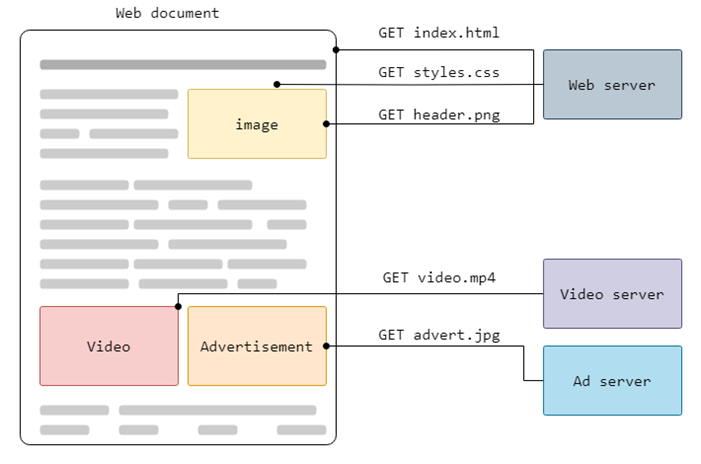

# HTTP

## HTTP Overview

HTTP là một protocol để lấy các resource như HTML document. Đây là nền tảng của bất kỳ trao đổi dữ liệu nào trên Web và là giao thức client-server, nghĩa là các request được khởi tạo bởi người nhận, thường là Web browser. Một document hoàn chỉnh thường được xây dựng từ các tài nguyên như nội dung văn bản, hình ảnh, video,...



Client và Server giao tiếp bằng cách trao đổi các message riêng lẻ. Các message do client gửi đi được gọi là request và các message do server gửi đi dưới dạng câu trả lời được gọi là response.


Giữa client và server có nhiều thực thể hay entity, được gọi chung là proxy, thực hiện các hoạt động khác nhau và hoạt động như port hoặc bộ nhớ đệm.

## HTTP Flow

Khi client muốn giao tiếp với server hoặc server cuối cùng hoặc proxy trung gian thì nó sẽ thực hiện các bước sau:
- Mở kết nối TCP: Kết nối TCP được sử dụng để gửi một request hoặc nhiều request và nhận được câu trả lời. Client có thể mở kết nối mới, sử dụng lại kết nối hiện có hoặc mở nhiều kết nối TCP tới server.

- Gửi HTTP message, ví dụ như:

  ```
  GET / HTTP/1.1
  Host: developer.mozilla.org
  Accept-Language: fr
  ```

- Đọc response được gửi từ server, ví dụ như:

  ```
  HTTP/1.1 200 OK
  Date: Sat, 09 Oct 2010 14:28:02 GMT
  Server: Apache
  Last-Modified: Tue, 01 Dec 2009 20:18:22 GMT
  ETag: "51142bc1-7449-479b075b2891b"
  Accept-Ranges: bytes
  Content-Length: 29769
  Content-Type: text/html
  
  <!doctype html>… (here come the 29769 bytes of the requested web page)
  ```

- Đóng hoặc sử dụng lại kết nối cho các request tiếp theo.

## HTTP Message

HTTP Message là cơ chế được sử dụng để trao đổi dữ liệu giữa client và server trong HTTP protocol.

Để hiểu cách thức hoạt động của HTTP Message, ta sẽ xem cấu trúc của một `HTTP/1.1` Message trông như thế nào.

Cả request và response đều có cấu trúc tương tự nhau:
- Start line là một dòng duy nhất mô tả phiên bản HTTP cùng với request method và kết quả của request.
- Optional HTTP Headers chứa metadata mô tả message. Ví dụ: request một tài nguyên có thể bao gồm các định dạng được phép của tài nguyên đó, trong khi response có thể bao gồm các header để chỉ ra các định dạng thực tế được trả về.
- Một Empty Line cho biết metadata của message đã hoàn tất.
- Optional Body chứa data liên quan đến message. Đây có thể là dữ liệu POST để gửi đến server trong request hoặc tài nguyên được trả về cho client trong response. Message có chứa body hay không được xác định bởi Start Line và HTTP Header.

### HTTP Request Message

**Start line**

Start line sẽ bao gồm 3 thành phần cách nhau bởi space:

```
<method> <request-target> <protocol>
```

Trong đó:

- `method` được gọi là HTTP method xác định ý nghĩa của request và kết quả mong muốn được trả về. Ví dụ, GET chỉ ra rằng client muốn nhận tài nguyên và POST có nghĩa là client đang gửi data đến server.
- `request-target`  thường là URL và phụ thuộc vào HTTP method được sử dụng và request context.
- `protocol` là HTTP version.

**Optional Header**

Một số header phố biến:
- Referer: Cho biết cái URL gốc của Request. Ví dụ từ trang chủ bạn click vào nút Login thì trang Login sẽ có Referer là trang chủ.
- User-Agent: Cung cấp thông tin về Browser để xác định loại thiết bị hoặc Browser đang sử dụng. Các trang web có thể yêu cầu header này để kiểm tra tính hợp lệ của người truy cập.
- Host: Cho biết hostname trong cái URL đầy đủ được truy cập, ví dụ `docs.google.com`
- Cookie: Cái này khá quan trọng đối với HTTP, cho phép Server gửi dữ liệu đến Client. Khi đó Client có thể lưu dữ liệu và gửi lại cho Server để xác định các Session (Phiên). Ví dụ: `Cookie: SessionId=5B70C71F3FD4968935CDB6682E545476`

:::warning Lưu ý
HTTP dùng TCP (stateful protocol) làm cơ chế vận chuyển nhưng bản thân HTTP lại là stateless protocol, nghĩa là mỗi message nó cứ chạy không quan tâm thằng trước/ sau nó đã/ định làm cái gì. Vì vậy, vấn đề quản lý Session (ví dụ Login Session) là khá quan trọng khi sử dụng giao thức này.
:::

### HTTP Response Message

**Start line**

Start line sẽ bao gồm 3 thành phần cách nhau bởi space:

```
<protocol> <status-code> <status-text>
```

- `protocol` là HTTP version.
- `status-code` cho biết request thành công hay thất bại.
- `status-text` mô tả dạng văn bản ngắn gọn, mang tính thông tin thuần túy về status code giúp con người hiểu được HTTP message.

**Optional Header**

Một số header phố biến:
- Server: Thông tin tham khảo về cái Web Server Software đang sử dụng. Ví dụ: `Server: Microsoft-IIS/6.0`
- Set-Cookie: Cái này sẽ được sử dụng trong Cookie Header của Request tiếp theo để duy trì phiên kết nối. Ví dụ: `Set-Cookie:tracking=tI8rk7joMx44S2Uu85nSWc `
- Content-Type: cho biết loại của Message Body. Ví dụ: `Content-Type: text/html; charset=utf-8`
- Content-Length: thông tin độ dài của Message Body theo Byte. Ví dụ: `Content-Length: 1067`