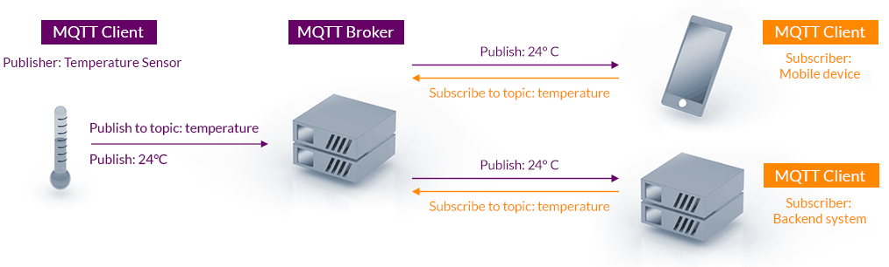

# MQTT

## Khái niệm cơ bản

MQTT (Message Queuing Telemetry Transport) là giao thức truyền thông dạng publish/subscribe, được thiết kế cho các thiết bị IoT có tài nguyên hạn chế.

Đặc điểm của MQTT:
- Nhẹ, ít tốn tài nguyên
- Hoạt động trên TCP/IP
- Chuẩn mở, được chuẩn hóa bởi OASIS và ISO/IEC 20922

Để giao thức hoạt động được, cần có ba thành phần:
- **MQTT Broker**: là thành phần trung gian điều phối bản tin giữa các MQTT Client trong hệ thống:
  + Nhận message từ client
  + Xem message đó thuộc topic nào
  + Gửi message đó cho những client nào đã subscribe topic tương ứng
- **MQTT Client**: Là các thiết bị hoặc ứng dụng kết nối đến Broker để thực hiện truyền nhận dữ liệu.
  + Client publisher: gửi dữ liệu lên broker.
  + Client subscriber: nhận dữ liệu từ broker.
- **Topic**: Topic là chuỗi text phân cấp bằng dấu `/` được Broker sử dụng để phân loại message.



Broker và Client sẽ giao tiếp với nhau thông qua các bản tin MQTT được xây dựng dựa trên chuẩn OASIS. Dữ liệu trong các bản tin là chuỗi binary chứ không phải chuỗi văn bản.

### Wildcard

Wildcard là cách để subscribe nhiều topic cùng lúc bằng ký tự đặc biệt. MQTT hỗ trợ 2 loại wildcard:

| Wildcard | Tên gọi               | Range                  | Vị trí được dùng                            |
| -------- | --------------------- | ---------------------- | ------------------------------------------- |
| `+`      | Single-level wildcard | Chỉ Khớp 1 tầng        | Nằm ở bất cứ đâu                            |
| `#`      | Multi-level wildcard  | Khớp 0 hoặc nhiều tầng | Chỉ được dùng cuối cùng của topic           |

**Ví dụ 1**

```bash
sensor/+/temp
```

→ Khớp các topic như:
- `sensor/room1/temp`
- `sensor/room2/temp`
- `sensor/lab/temp`

→ Không khớp:
- `sensor/room1/child/temp` (vì dư 1 tầng)
- `sensor/temp` (thiếu 1 tầng)

**Ví dụ 2**

```bash
sensor/#
```

→ Khớp vào các topic như:
- `sensor/temp`
- `sensor/humi`
- `sensor/lab/temp`
- `sensor/lab/floor2/light`

### Retained Message

Retained message là message mới nhất mà broker giữ lại (cache) để gửi cho mọi subscriber mới ngay khi chúng subscribe.

Nói cách khác:
- Bình thường: subscriber chỉ nhận những message được gửi sau khi nó subscribe.
- Với retained: Khi client subscribe một topic, nó sẽ nhận ngay message mới nhất mà broker đã lưu cho topic đó.

Ví dụ, ta có một website mà có các trạng thái sensor chậm thay đổi thì khi reload nó sẽ reset trạng thái mặc định và không cập nhập trạng thái thực tế cho đến khi có dữ liệu mới -> ta cần retained message để có thể cập nhập được trạng thái ngay lập tức khi ta subscibe vào topic tương ứng.

### Last Will & Testament

LWT là một message mà broker sẽ tự động gửi khi client chết bất thường.

Khi một Client chết bất thường, ví dụ như mất nguồn, mất wifi, crash, treo task, network timeout, app bị kill…<br>→ Khi đó client không kịp gửi DISCONNECT,<br>→ Broker phát hiện mất kết nối,<br>→ Broker sẽ tự gửi LWT theo cấu hình của client.

### Quality of Service

QoS trong MQTT quyết định độ tin cậy khi gửi PUBLISH giữa:
- Client → Broker
- Broker → Subscriber

| **Mức QoS** | **Tên gọi**     | **Cơ chế gửi**                                                                            | **Ưu điểm**                                                                  | **Nhược điểm**                                                                                     | **Dùng khi nào?**                                                                                                          |
| ----------- | --------------- | ----------------------------------------------------------------------------------------- | ---------------------------------------------------------------------------- | -------------------------------------------------------------------------------------------------- | -------------------------------------------------------------------------------------------------------------------------- |
| **QoS 0**   | *At most once*  | - Gửi **1 lần duy nhất** <br>- Không ACK <br>- Nếu mất gói → không retry                  | - Nhanh nhất <br>- Ít tốn RAM/CPU <br>- Phù hợp dữ liệu tốc độ cao           | - Có thể mất message <br>- Không đảm bảo độ tin cậy                                                | - Sensor gửi liên tục (temp/humi mỗi 1s) <br>- Dữ liệu tốc độ cao, không quan trọng mất gói <br>- Telemetry streaming      |
| **QoS 1**   | *At least once* | - Luôn có ACK (PUBACK) <br>- Broker hoặc client có thể gửi lại → **có thể trùng message** | - Đảm bảo message đến <br>- Độ tin cậy tốt <br>- Phù hợp cho lệnh quan trọng | - Có thể nhận trùng message → phải lọc <br>- Tốn tài nguyên hơn QoS0                               | - Giá trị sensor quan trọng <br>- Thông báo trạng thái (online/offline) <br>- Logging quan trọng <br>- OTA progress/status |
| **QoS 2**   | *Exactly once*  | - Đảm bảo **đến đúng 1 lần** <br>- 4 bước handshake (PUBREC, PUBREL, PUBCOMP)             | - Chắc chắn nhất <br>- Không mất message <br>- Không trùng message           | - Chậm nhất <br>- Tốn băng thông nhất <br>- Phức tạp, nặng với embedded <br>- Rất ít hệ thống dùng | - Banking/Billing <br>- Đơn hàng, giao dịch tài chính <br>- Không được dùng cho IoT streaming                              |

## Mosquitto

### Cài đặt mosquitto trên Yocto image

**Bước 1: Clone meta-openembedded**

Trong thư mục source cùng cấp với folder `poky/`:

```bash
cd ../sources
git clone git://git.openembedded.org/meta-openembedded
```

Trong `meta-openembedded` có nhiều sublayer, trong đó:
- `meta-networking` → chứa recipe mosquitto (broker + libmosquitto).

**Bước 2: Thêm các layer vào `bblayers.conf`**

Mở file: `build/conf/bblayers.conf` và thêm:

```conf
BBLAYERS += " \
  /.../meta-openembedded/meta-networking \
  /.../meta-openembedded/meta-oe \
"
```

Hoặc có thêm bằng cách sử dụng:

```bash
bitbake-layers add-layer ../meta-openembedded/meta-oe
bitbake-layers add-layer ../meta-openembedded/meta-networking
```

**Bước 3: Thêm library mosquitto vào yocto image (rootfs)**

Library mosquitto thường được tách ra thành hai package dạng `libmosquitto` hoặc `libmosquitto1` tuỳ branch. Ta có thể check package nào được sử dụng bằng cách:

```bash
bitbake -e mosquitto | grep ^PACKAGES=
```

hoặc:

```bash
oe-pkgdata-util list-pkgs | grep mosquitto
```

Giả sử ta thấy có `libmosquitto1`, thì trong `conf/local.conf`:

```conf
IMAGE_INSTALL:append = " libmosquitto1"
```

Nếu muốn sử dụng broker mosquitto ngay trên board thì ta cần package `mosquitto`. Ngoài ra, để có thể test mosquitto thì cần package `mosquitto-clients`:

```conf
IMAGE_INSTALL:append = " mosquitto libmosquitto1 mosquitto-clients"
```

**Bước 4: Đưa library vào SDK để cross compiler**

Để build app C trên máy host bằng cross compiler trên Yocto, ta cần thêm các package có file header và .so vào trong SDK. Để biết đúng cần package nào cần thêm ta cần làm:

```bash
# Liệt kê các package mà recipe mosquitto tạo ra -> lấy package có đuôi "-dev" hoặc "-staticdev"
bitbake -e mosquitto | grep ^PACKAGES=

# Tìm đúng package chứa header và .so
oe-pkgdata-util find-path /usr/include/mosquitto.h
oe-pkgdata-util find-path /usr/lib/*mosquitto.so*
```

Khi tìm thấy package ta thêm nó vào cấu hình `TOOLCHAIN_TARGET_TASK` trong file `conf/local.conf`:

```bash
TOOLCHAIN_TARGET_TASK:append = " mosquitto-dev"
```

Sau đó, ta sẽ build lại sdk:

```bash
bitbake <tên-image> -c populate_sdk
```

Lệnh này tạo 1 file `.sh`, khi cài đặt sẽ chứa gcc cross + headers + .so + pkg-config tương ứng với các package đã đưa thêm vào image.

Cài SDK:

```bash
tmp/deploy/sdk/poky-glibc-*-core-image-minimal-*.sh
# chọn path cài, ví dụ /opt/poky
```

Mỗi lần build app:

```bash
source /opt/poky/environment-setup-*-poky-linux-gnueabi
```

Kiểm tra xem trong SDK đã có file header và file .so chưa:

```bash
find $SDKTARGETSYSROOT -name "libmosquitto.so*"
find $SDKTARGETSYSROOT -name "mosquitto.h"
```

Lúc này, ta sẽ có môi trường để cross compiler.

### Cấu hình mosquitto broker

Mở file `/etc/mosquitto/mosquitto.conf` thêm các cấu hình sau:

```conf
listener 1883
protocol mqtt

# Nếu muốn kết nối từ website thì phải thêm cấu hình này
listener 9001
protocol websockets

# Cho phép client không cần user/pass
allow_anonymous true
```

Kiểm tra xem broker mosquitto đã chạy chưa:

```bash
ps aux | grep mosquitto
```

Nếu đang chạy thì cần restart mosquitto như sau:

```bash
killall mosquitto
mosquitto -c /etc/mosquitto/mosquitto.conf -v &
```

Kiểm tra đã có port 1883 cho mosquitto chưa:

```bash
netstat -tulpn | grep 1883
```

Nếu có kết nối từ website thì kiểm tra thêm port websocket:

```bash
netstat -tulpn | grep 9001
```

### Test mosquitto trên BBB

**Test subscribe**

Cú pháp:

```bash
mosquitto_sub -h <host> -p <port> -t <topic> -v
```

Giải thích tham số:

| Option | Ý nghĩa                     |
| ------ | --------------------------- |
| `-h`   | IP hoặc hostname của broker |
| `-p`   | port (mặc định 1883)        |
| `-t`   | topic cần subscribe         |
| `-v`   | hiện cả tên topic + payload |


**Test publish**

Cú pháp:

```bash
mosquitto_pub -h <host> -p <port> -t <topic> -m "<message>"
```

Giải thích tham số:

| Option | Ý nghĩa                     |
| ------ | --------------------------- |
| `-h`   | IP hoặc hostname của broker |
| `-p`   | port (mặc định 1883)        |
| `-t`   | topic cần subscribe         |
| `-m`   | message cần publish         |

**Ví dụ: Giả sử broker chạy trên BBB**

Terminal 1:

```bash
mosquitto_sub -h localhost -t sensor/temp
```

Terminal 2:

```bash
mosquitto_pub -h localhost -t sensor/temp -m "28.5"
```

Kết quả → terminal 1 sẽ in ra:

```bash
28.5
```
