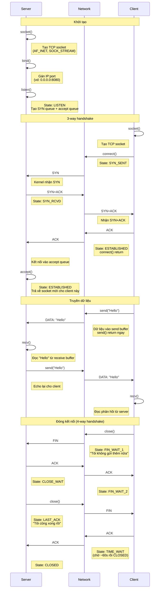

# Socket

## Port

Ta có một cái máy tính, tất cả các dữ liệu của máy tính đấy gửi ra ngoài mạng thì đều có chung một địa chỉ IP và địa chỉ IP này sẽ là định danh cho cái máy tính đấy. Tuy nhiên, máy tính lại chạy rất nhiều ứng dụng cùng lúc, ví dụ như: facebook, youtube,...Mỗi một cái ứng dụng này đều có nhu cầu gửi một gói tin ra ngoài mạng, vậy khi một gói tin đến với máy tính thì làm thế nào mà kernel có thể phân biệt được bản tin đấy thuộc về ứng dụng nào? Câu trả lời là port.

Mỗi một ứng dụng khi muốn kết nối với mạng thì cần phải xin kernel mở một port - một số nguyên không âm từ 0 đến 65535 dùng để định danh. Kernel sẽ dựa vào port để biết được gói tin thuộc về ứng dụng nào và trả về ứng dụng đấy.

Ta có thể hiểu đơn giản như sau: Nếu IP là địa chỉ toà nhà, thì port là số phòng bên trong. Gói tin gửi đến 192.168.1.10:8080 nghĩa là "đến máy 192.168.1.10, tìm ứng dụng đang ở phòng 8080".

Ba dải port quan trọng:
- 0-1023 (well-known ports): dành cho các dịch vụ chuẩn, cần quyền root để bind. Ví dụ: HTTP dùng port 80, HTTPS dùng 443, SSH dùng 22, DNS dùng 53.
- 1024-49151 (registered ports): các ứng dụng phổ biến đăng ký dùng. Ví dụ: MySQL dùng 3306, PostgreSQL dùng 5432, Redis dùng 6379.
- 49152-65535 (ephemeral ports): kernel tự động gán cho client khi gọi `connect()`. Mỗi lần client mở kết nối mới, kernel chọn một port trống trong dải này. Trên Linux thực tế dải mặc định là 32768-60999, xem bằng
`cat /proc/sys/net/ipv4/ip_local_port_range`.

## Socket là gì?

Ta sẽ nhìn socket từ nhiều góc độ:
- Ở góc nhìn đơn giản nhất: socket là một đầu nối mà ứng dụng dùng để gửi/nhận dữ liệu qua mạng. Giống như ổ cắm điện là điểm tiếp xúc giữa thiết bị và mạng lưới điện thì socket là điểm tiếp xúc giữa ứng dụng và mạng lưới internet.
- Ở góc nhìn developer: socket là một file descriptor - một con số nguyên mà kernel cấp cho ứng dụng. Trong Linux mọi thứ đều được đại diện bởi file và socket cũng vậy. Ta có thể dùng `read()`/`write()` trên socket giống hệt như đọc/ghi file. Sự khác biệt là dữ liệu không đi vào ổ cứng mà đi ra mạng.
- Ở góc nhìn kernel: socket là một cấu trúc dữ liệu lớn trong kernel (`struct socket` chứa `struct sock`), bao gồm toàn bộ thông tin cần thiết để quản lý một kết nối: địa chỉ hai đầu (IP + port), trạng thái TCP, send buffer, receive buffer,...

**Định danh một socket**

Một socket được xác định duy nhất bởi bộ 5 thông tin hay 5 tuple: protocol (TCP/UDP), source IP, source port, destination IP, destination port. Đây là lý do một server chạy trên port 80 có thể phục vụ hàng nghìn client cùng lúc - mỗi kết nối có bộ 5 thông tin khác nhau (vì client IP hoặc client port khác nhau), nên kernel phân biệt được chúng.

**Các loại socket**

- `SOCK_STREAM` (TCP): cung cấp luồng byte tin cậy, có thứ tự. Đây là loại ta sẽ dùng cho hầu hết ứng dụng: web, database, SSH, email...
- `SOCK_DGRAM` (UDP): gửi từng datagram độc lập, không đảm bảo đến đích, không đảm bảo thứ tự. Dùng cho DNS, video streaming, game realtime...
- `SOCK_RAW`: truy cập trực tiếp xuống tầng IP, bỏ qua transport layer. Dùng cho các công cụ như ping (giao thức ICMP) hoặc network scanning.

## Luồng hoạt động cơ bản của Socket

Ta sẽ đi qua luồng client-server, vì đây là mô hình phổ biến nhất.

**Phía server thực hiện theo thứ tự:**
- `socket()`: tạo socket, chọn loại giao thức (TCP hay UDP). Tương tự như mua một chiếc điện thoại nhưng chưa gắn SIM.
- `bind()`: gán địa chỉ IP và port cho socket. Giống như gắn SIM với số điện thoại cụ thể để người khác gọi đến được.
- `listen()`: chuyển socket sang trạng thái `LISTEN`, sẵn sàng nhận kết nối. Lúc này kernel tạo hai hàng đợi:
  - SYN queue (chứa kết nối đang handshake)
  - accept queue (chứa kết nối đã hoàn thành handshake, chờ ứng dụng lấy ra).
- `accept()`: lấy một kết nối đã hoàn thành từ accept queue. Hàm này trả về một socket mới dành riêng cho kết nối đó. Socket gốc vẫn tiếp tục listen. Đây là điểm quan trọng: server có một socket để listen, và nhiều socket con - mỗi cái cho một client.
- `recv()` / `send()`: đọc và ghi dữ liệu trên socket con.
- `close()`: đóng kết nối.

**Phía client đơn giản hơn:**
- `socket()`: tạo socket.
- `connect()`: kích hoạt 3-way handshake đến server. Kernel tự động chọn port cho client. Khi hàm này return thành công, kết nối đã ở trạng thái `ESTABLISHED`.
- `send()` / `recv()`: trao đổi dữ liệu.
- `close()`: đóng kết nối.

Đây là một diagram để ta có thể thấy rõ hơn luồng hoạt động giữa server và client:



:::warning Một số điểm quan trọng cần lưu ý
- `accept()` trả về socket mới, trong khi socket ban đầu (listening socket) vẫn tiếp tục nhận kết nối mới $\rightarrow$ Đó là lý do server có thể phục vụ nhiều client cùng lúc.
- `send()` chỉ copy dữ liệu vào kernel send buffer rồi return. Kernel sẽ tự lo phần còn lại. Điều này nghĩa là `send()` return thành công không đảm bảo bên kia đã nhận.
- `recv()` là một blocking API. Nó sẽ chờ cho đến khi có dữ liệu trong receive buffer. Khi `recv()` trả về 0, nghĩa là bên kia đã gọi `close()` (nhận được `FIN`).
- TCP là **byte stream**, không phải message stream. Nếu client gọi `send()` hai lần gửi "Hello" rồi "World", bên server gọi `recv()` một lần có thể nhận được "HelloWorld" gộp lại, hoặc chỉ "Hel" rồi lần sau nhận "loWorld". Nếu ứng dụng cần biết đâu là một "message" hoàn chỉnh, ta phải tự thiết kế protocol ở tầng application (ví dụ thêm length header hoặc dùng delimiter như `\n`).
- File descriptor là tài nguyên hữu hạn - mỗi process có giới hạn số fd mở cùng lúc (mặc định 1024, xem bằng `ulimit -n`). Server phục vụ nhiều client cần tăng giới hạn này.
:::

:::warning Network byte order
Các máy tính dùng kiến trúc CPU khác nhau có thể lưu trữ dữ liệu theo thứ tự byte khác nhau (little endian hoặc big endian). Để đảm bảo mọi máy đều hiểu đúng giá trị, network quy ước một chuẩn chung là big endian (network byte order). Khi lập trình socket, ta dùng các hàm chuyển đổi:
- `htons()` / `htonl()`: host to network (short/long) - dùng khi gửi.
- `ntohs()` / `ntohl()`: network to host - dùng khi nhận.

Ví dụ: `addr.sin_port = htons(8080)` chuyển port 8080 từ host byte order sang network byte order trước khi gán vào socket address.
:::

## Giải thích chi tiết các API

Bên dưới sẽ cho biết giải thích chi tiết xem kernel làm gì bên dưới khi gọi API:

::::content-group
  ::: tab [socket]
  Khi gọi `socket()`, kernel thực hiện:

  1. Cấp phát `struct socket` chứa toàn bộ metadata
  2. Cấp phát `struct sock` (goi la sk) - lõi của TCP stack
  3. Khởi tạo send buffer va receive buffer (mặc định ~128KB mỗi buffer)
  4. Gán một file descriptor (`fd`)
  5. Trả `fd` về cho ứng dụng

  Lúc này socket chưa có địa chị, chưa kết nối đến đâu cả. Nó chỉ là một cái "vỏ" trống.

  **Ví dụ minh họa:**
  ```c
  int sockfd = socket(AF_INET, SOCK_STREAM, 0);
  ```
  :::

  ::: tab [bind]
  `bind()` nói cho kernel: "Socket này sẽ lắng nghe tại địa chỉ và port này."

  Kernel thực hiện:
  1. Kiểm tra port có đang được sử dụng không
  2. Nếu port < 1024, cần quyền root
  3. Gán (IP, port) vào struck sock
  4. Đăng ký socket trong bảng hash của kernel để có thể tìm lại

  **Lưu ý:** Client thường không cần gọi `bind()`, kernel tự chọn port ngẫu nhiên (ephemeral port, thường nằm trong khoảng 32768-60999) khi gọi `connect()`.

  **Ví dụ minh họa:**
  ```c
  struct sockaddr_in addr;
  addr.sin_family = AF_INET;
  addr.sin_port = htons(8080);        // port 8080
  addr.sin_addr.s_addr = INADDR_ANY;  // IP của máy

  bind(sockfd, (struct sockaddr*)&addr, sizeof(addr));
  ```

  Hàm `htons()` sẽ chuyển số port từ byte order của máy (host byte order) sang network byte order (big-endian). Đây là quy ước chung trên mạng để các máy dùng kiến trúc CPU khác nhau vẫn hiểu đúng giá trị port.
  :::

  ::: tab [listen]
  `listen()` chuyển socket từ trạng thái **CLOSED** sang **LISTEN**. Đây là bước then chốt trong quá trình thiết lập server:

  Khi hàm này được gọi, kernel sẽ tạo ra hai cấu trúc dữ liệu quan trọng:
  - **SYN queue (hay syn_backlog):** Chứa các kết nối đang trong quá trình handshake. 
      - Trạng thái: Đã nhận `SYN`, đã gửi `SYN+ACK`, đang chờ `ACK` cuối cùng từ client. 
      - Kích thước mặc định thường là 128.
  - **Accept queue (hay request_sock queue):** Chứa các kết nối đã hoàn thành quá trình bắt tay 3 bước (3-way handshake).
      - Các kết nối này nằm chờ cho đến khi ứng dụng gọi hàm `accept()`. 
      - Kích thước được xác định bởi tham số `backlog`.

  Tham số `backlog` quyết định khả năng chịu tải của server:
  - **Nếu accept queue đầy:** Các kết nối mới từ client sẽ bị từ chối hoặc phải chờ đợi.
  - **Giới hạn hệ thống:** Trên Linux, giá trị thực tế của `backlog` bị giới hạn bởi cấu hình tại `/proc/sys/net/core/somaxconn` (giá trị mặc định thường là 4096).

  **Ví dụ minh họa:**
  ```c
  listen(sockfd, 128); 
  // backlog = 128: Accept queue chứa tối đa 128 kết nối đã sẵn sàng
  ```
  :::

  ::: tab [connect]
  Đây là syscall quan trọng nhất phía client. Khi gọi hàm `connect()`:

  1. Kernel tự động gọi `bind()` nếu client chưa bind.
  2. Gửi gói `SYN` đến server.
  3. Socket chuyển sang trạng thái `SYN_SENT`.
  4. Chờ server gửi lại `SYN+ACK`.
  5. Gửi gói `ACK` cuối cùng.
  6. Socket chuyển sang trạng thái `ESTABLISHED`.
  7. Hàm `connect()` trả về `0` (kết nối thành công).

  Các trường hợp xảy ra lỗi:
  - **Nếu server không phản hồi:** Kernel sẽ thử retry gói `SYN`. Theo mặc định trên linux, nó sẽ thử 6 lần (tổng cộng mất khoảng 127 giây) trước khi bỏ cuộc và trả về lỗi `ETIMEDOUT`.
  - **Nếu server từ chối kết nối:** (Ví dụ: port đích không ở trạng thái listen), kernel sẽ nhận được gói tin mang cờ `RST` và hàm `connect()` ngay lập tức trả về lỗi `ECONNREFUSED`.

  **Ví dụ minh hoạ:**

  ```c
  struct sockaddr_in srv;
  srv.sin_family = AF_INET;
  srv.sin_port = htons(8080);
  inet_pton(AF_INET, "192.168.1.10", &srv.sin_addr);

  int ret = connect(sockfd, (struct sockaddr*)&srv, sizeof(srv));
  ```
  :::

  ::: tab [accept]
  Hàm `accept()` là bước tiếp khách phía server:

  1. Kiểm tra accept queue - xem có kết nối nào đã hoàn thành quá trình bắt tay không?
  2. Nếu có: Tạo một struct socket mới, sao chép thông tin kết nối vào đó và trả về một file descriptor (fd) mới.
  3. Nếu trống: block tiến trình cho đến khi có kết nối mới (hoặc trả về lỗi `EAGAIN` nếu đang ở chế độ non-blocking).

  **Điểm then chốt:** Hàm `accept()` trả về một socket mới (ví dụ `fd = 4`), hoàn toàn khác với listening socket ban đầu (`fd = 3`). Socket gốc vẫn tiếp tục thực hiện nhiệm vụ listen. Mỗi client khi kết nối đến sẽ được cấp một socket riêng biệt.

  Điều này cho phép hệ thống phân biệt rõ ràng:
  - Listening socket (fd=3): 0.0.0.0:8080
  - Client A socket (fd=4): 192.168.1.10:8080 <-> 10.0.0.5:54321
  - Client B socket (fd=5): 192.168.1.10:8080 <-> 10.0.0.6:49876

  **Ví dụ minh hoạ:**

  ```c
  struct sockaddr_in client_addr;
  socklen_t len = sizeof(client_addr);

  int client_fd = accept(sockfd, (struct sockaddr*)&client_addr, &len);
  ```
  :::

  ::: tab [send]
  Hàm `send()` không gửi dữ liệu trực tiếp ra mạng ngay lập tức. Vai trò của nó chỉ bao gồm:
  1. Sao chép dữ liệu từ bộ nhớ ứng dụng vào bộ đệm send buffer của kernel.
  2. Trả về số lượng byte đã được sao chép thành công.
  3. TCP stack (chạy độc lập dưới tầng kernel) sẽ tự động chia dữ liệu thành các phân đoạn (segments) và thực hiện việc gửi đi.

  **Khi bộ đệm send buffer bị đầy:**
  Trường hợp này thường xảy ra khi bên nhận xử lý chậm hoặc do cơ chế flow control đang hạn chế tốc độ.
  - **Chế độ blocking mode:** Hàm `send()` sẽ bị chặn (block) cho đến khi bộ đệm có đủ chỗ trống để chứa dữ liệu.
  - **Chế độ non-blocking mode:** Hàm `send()` sẽ trả về `-1` với mã lỗi `errno = EAGAIN` hoặc `EWOULDBLOCK`.

  **Những lưu ý cực kỳ quan trọng:**
  - `send()` trả về giá trị 100 không có nghĩa là bên kia đã nhận được 100 byte.
  - Nó chỉ có nghĩa là 100 byte đó đã nằm copy vào trong bộ đệm send buffer của Kernel.
  - Kernel sẽ đảm bảo việc truyền tin tin cậy (tự động gửi lại - retry, sắp xếp thứ tự - reorder), nhưng ứng dụng phía trên sẽ không biết chính xác thời điểm dữ liệu thực sự đến đích.

  **Ví dụ minh hoạ:**

  ```c
  char *msg = "Hello, server!";
  int sent = send(client_fd, msg, strlen(msg), 0);

  // sent = 14: Có nghĩa là 14 byte đã được copy vào send buffer thành công.
  // Kernel TCP: Sẽ tự chia segment -> gửi đi -> chờ ACK -> gửi lại nếu cần thiết.

  // Cảnh báo: Trường hợp (sent < strlen(msg)) hoàn toàn có thể xảy ra!
  // Bạn cần kiểm tra và gửi phần dữ liệu còn lại trong một vòng lặp (while loop).
  ```
  :::

  ::: tab [recv]
  Hàm `recv()` đọc dữ liệu mà kernel đã nhận được và đặt vào bộ đệm receive buffer:

  1. Kiểm tra xem bộ đệm nhận có dữ liệu hay không.
  2. Nếu có: Sao chép dữ liệu sang bộ nhớ của ứng dụng và trả về số byte đã nhận.
  3. Nếu trống: Chặn (block) tiến trình cho đến khi có dữ liệu mới (hoặc trả về `EAGAIN` nếu đang ở chế độ non-blocking).

  **Các giá trị trả về đặc biệt:**
  - **> 0:** Số byte thực tế đã đọc được.
  - **= 0:** Bên kia đã gọi hàm `close()` (đã nhận gói `FIN`) - **kết nối đã đóng**.
  - **= -1:** Đã xảy ra lỗi (cần kiểm tra biến `errno`).

  **Lưu ý:**
  - `recv()` trả về 0 là cách TCP báo cho ứng dụng biết: *"Không còn dữ liệu nào nữa, đối phương đã đóng kết nối."* Đây chính là tín hiệu để ứng dụng của ta có thể thực hiện lệnh `close()`.
  - Hàm `recv(fd, buf, 1024)` có thể trả về bất kỳ số lượng byte nào từ 1 đến 1024, không nhất thiết phải bằng đúng số byte mà bên kia đã gửi trong một lần `send()`.

  **Ví dụ minh hoạ:**

  ```c
  char buf[1024];
  int n = recv(client_fd, buf, sizeof(buf), 0);

  if (n > 0) {
      buf[n] = '\0'; // Thêm ký tự kết thúc chuỗi
      printf("Received: %s\n", buf);
  } else if (n == 0) {
      printf("Client disconnected\n");
      close(client_fd);
  } else {
      perror("recv error");
  }
  ```
  :::

  ::: tab [close]
  Hàm `close()` báo cho kernel biết: "Tôi đã xong việc với socket này". Các bước xử lý của hệ thống bao gồm:

  1. Nếu bộ đệm send buffer còn dữ liệu, kernel sẽ cố gắng gửi nốt số dữ liệu đó trước khi đóng.
  2. Gửi gói tin `FIN` cho phía đối phương.
  3. Chờ gói `ACK` (và gói `FIN` từ phía bên kia nếu chưa nhận được) để hoàn tất quy trình ngắt kết nối 4 bước.
  4. Giải phóng fd - lúc này `fd` có thể được hệ điều hành tái sử dụng cho các file hoặc socket khác.
  5. Tuy nhiên, cấu trúc `socket/sock` bên dưới không bị giải phóng ngay lập tức - nó vẫn tồn tại trong trạng thái `TIME_WAIT` (thường khoảng 60 giây).

  **Tại sao cần trạng thái `TIME_WAIT`?**
  - **Đảm bảo độ tin cậy:** Đảm bảo gói `ACK` cuối cùng đến được phía bên kia. Nếu gói này bị thất lạc, bên kia sẽ gửi lại `FIN` và kernel vẫn còn socket ở `TIME_WAIT` để gửi lại `ACK`.
  - **Tránh nhiễu dữ liệu:** Đảm bảo các gói tin cũ còn sót lại trên mạng sẽ không bị nhầm lẫn với một kết nối mới.
  - **An toàn cho kết nối mới:** Nếu không có `TIME_WAIT`, một kết nối mới sử dụng đúng bộ 5 thông số (**5-tuple**) có thể nhận nhầm dữ liệu của kết nối cũ vừa đóng.

  **Lưu ý về tài nguyên:**
  Trên server có hàng nghìn kết nối đồng thời, số lượng socket ở trạng thái `TIME_WAIT` quá lớn có thể chiếm dụng tài nguyên hệ thống. Bạn có thể tùy chỉnh thông số này qua `sysctl` với `net.ipv4.tcp_tw_reuse`.

  **Ví dụ minh hoạ:**
  ```c
  close(client_fd);
  // Kernel: Gửi hết dữ liệu trong send buffer -> Gửi FIN -> Chờ ACK
  // fd = 4: Được giải phóng ngay, có thể dùng cho kết nối khác
  // Socket: Chuyển sang TIME_WAIT ~60 giây trước khi bị xóa hoàn toàn khỏi hệ thống
  :::
::::

## Blocking vs non-blocking socket

### Blocking mode

Khi tạo socket bằng `socket()`, nó mặc định ở chế độ blocking. Nghĩa là các syscall sẽ chờ cho đến khi hoàn thành mới return:
- `recv()`: nếu receive buffer trống, process bị đưa vào trạng thái sleep. Kernel đánh thức nó khi có dữ liệu đến. Trong lúc chờ, process không làm được gì khác.
- `send()`: nếu send buffer đầy, process cũng bị sleep cho đến khi buffer có chỗ trống.
- `accept()`: nếu accept queue trống (không có client nào kết nối), process sleep cho đến khi có kết nối mới.
- `connect()`: chờ cho đến khi 3-way handshake hoàn thành hoặc timeout.

Ở chế độ này sẽ gặp một vấn đề như sau: Nếu server dùng blocking socket và phục vụ một client, nó có thể bị kẹt tại `recv()` để nhận dữ liệu từ client đó. Client thứ hai kết nối vào phải chờ cho đến khi client thứ nhất xong. Server chỉ phục vụ được một client tại một thời điểm.

Để xử lý vấn đề này thì ta có một giải pháp truyền thống là tạo thread hoặc process mới cho mỗi client. Mỗi thread block độc lập, không ảnh hưởng nhau:

```
main thread: accept() → tạo thread mới → quay lại accept()
thread 1:    recv/send với client A
thread 2:    recv/send với client B
thread 3:    recv/send với client C
```

Cách này tuy hoạt động ổn nhưng mỗi thread tốn bộ nhớ (stack mặc định 8MB trên Linux) và context switch giữa hàng nghìn thread rất tốn CPU. Với 10000 client đồng thời, ta cần 10000 thread tương ứng. Điều này tiêu tốn khoảng 80GB stack memory $\rightarrow$ Không khả thi.

### Non-blocking mode

Chuyển socket sang non-blocking bằng `fcntl()` như sau:

```c
int flags = fcntl(sockfd, F_GETFL, 0);
fcntl(sockfd, F_SETFL, flags | O_NONBLOCK);
```

Bây giờ hành vi của các syscall thay đổi hoàn toàn:
- `recv()`: nếu buffer trống, return ngay lập tức với giá trị -1 và `errno = EAGAIN`. Nghĩa là "không có dữ liệu, thử lại sau".
- `send()`: nếu buffer đầy, cũng return -1 với `EAGAIN` thay vì chờ.
- `accept()`: nếu không có kết nối đang chờ, return -1 với `EAGAIN`.
- `connect()`: return ngay, không đợi handshake xong. Ta phải kiểm tra sau bằng `select()`/`epoll` xem kết nối đã thành công chưa.

Điều này giải quyết được vấn đề blocking, nhưng tạo ra vấn đề mới là ta phải liên tục kiểm tra mỗi socket xem có dữ liệu chưa - gọi là busy polling:

```c
while (1) {
    for (mỗi client socket) {
        n = recv(fd, buf, ...);
        if (n > 0) { xử lý dữ liệu }
        // nếu EAGAIN: bỏ qua, kiểm tra fd tiếp theo
    }
}
```

Vòng lặp này cần chạy liên tục, sẽ tiêu tốn 100% CPU ngay cả khi không có dữ liệu nào $\rightarrow$ Rất lãng phí.

## I/O Multiplexing

Thay vì tự hỏi từng socket "có dữ liệu chưa?", ta đưa danh sách socket cho kernel và nói "báo cho tôi khi bất kỳ socket nào trong danh sách này sẵn sàng". Process sẽ sleep và chỉ thức dậy khi thực sự có việc cần làm.

Để làm được điều này, linux cung cấp 3 cơ chế: `select()`, `poll()`, và `epoll`.

### select() và poll()

`select()` và `poll()` hoạt động theo cùng nguyên lý: mỗi lần gọi, ta truyền toàn bộ danh sách socket cần theo dõi cho kernel. Kernel duyệt qua từng socket một để kiểm tra. Tuy nhiên, nó có nhược điểm sau:
- Nếu có 10000 socket mà chỉ 5 cái có dữ liệu, kernel vẫn phải kiểm tra cả 10000 socket. Độ phức tạp O(n) mỗi lần gọi.
- `select()` còn bị giới hạn 1024 fd (do dùng bitmask cố định `FD_SETSIZE`).
- Mỗi lần gọi phải copy toàn bộ danh sách fd từ user space sang kernel space.

### epoll

`epoll` thay đổi kiến trúc hoàn toàn: thay vì ứng dụng đưa danh sách cho kernel, kernel sẽ tự theo dõi danh sách và chỉ trả về những socket thực sự có sự kiện.

**Ba syscall của epoll:**
- `epoll_create1(0)`: tạo một epoll instance. Kernel cấp phát cấu trúc dữ liệu nội bộ gồm: một red-black tree để lưu danh sách socket đang theo dõi, và một ready list để chứa các socket có sự kiện. Hàm trả về một fd đại diện cho epoll instance này.
- `epoll_ctl(epfd, op, fd, event`: thêm (`EPOLL_CTL_ADD`), sửa (`EPOLL_CTL_MOD`), hoặc xoá (`EPOLL_CTL_DEL`) socket khỏi danh sách theo dõi. Khi thêm một socket, kernel đăng ký một callback function vào socket đó. Khi dữ liệu đến socket, callback tự động đưa socket vào ready list. Đây là điểm mấu chốt - kernel không cần duyệt toàn bộ danh sách, mà socket "tự báo" khi có sự kiện.
- `epoll_wait(epfd, events, maxevents, timeout)`: chờ cho đến khi có sự kiện. Nếu ready list trống, process sleep. Khi có ít nhất 1 socket sẵn sàng, kernel đánh thức process và trả về chỉ những socket có sự kiện. Nếu 10000 socket đang theo dõi mà chỉ 3 cái có dữ liệu, `epoll_wait()` chỉ trả về 3 cái đó. Độ phức tạp O(1) cho việc thêm/sửa/xoá socket, O(k) khi trả về sự kiện - với k là số sự kiện thực tế, không phụ thuộc tổng số socket.

**Luồng hoạt động của epoll:**

```c
// 1. Tạo epoll instance
int epfd = epoll_create1(0);

// 2. Thêm listening socket vào epoll
struct epoll_event ev;
ev.events = EPOLLIN;
ev.data.fd = listen_fd;
epoll_ctl(epfd, EPOLL_CTL_ADD, listen_fd, &ev);

// 3. Event loop
struct epoll_event events[MAX_EVENTS];
while (1) {
    // Chờ sự kiện
    int nfds = epoll_wait(epfd, events, MAX_EVENTS, -1);
 
    // Chỉ xử lý socket có sự kiện
    for (int i = 0; i < nfds; i++) {
        if (events[i].data.fd == listen_fd) {
            // Listening socket có sự kiện = có client mới
            int client_fd = accept(listen_fd, ...);

            // Set non-blocking cho client socket
            fcntl(client_fd, F_SETFL, O_NONBLOCK);

            // Thêm client mới vào epoll
            ev.events = EPOLLIN;
            ev.data.fd = client_fd;
            epoll_ctl(epfd, EPOLL_CTL_ADD, client_fd, &ev);
        } else {
            // Client socket có dữ liệu
            int n = recv(events[i].data.fd, buf, sizeof(buf), 0);
            if (n == 0) {
                // Client đóng kết nối
                close(events[i].data.fd);
                // epoll tự xoá fd khi close()
            } else if (n > 0) {
                // Xử lý dữ liệu
                send(events[i].data.fd, buf, n, 0);
            }
            // n == -1 && errno == EAGAIN: chưa có thêm dữ liệu
        }
    }
}
```

Toàn bộ server chỉ có 1 thread, 1 vòng lặp, nhưng có khả năng phục vụ được hàng chục client đồng thời.

:::tip Tại sao epoll nhanh?
Điểm khác biệt cốt lõi so với `select()`/`poll()`: khi ta thêm socket vào epoll qua `epoll_ctl()`, kernel gắn một callback function vào socket đó. Khi network card nhận gói tin và đưa dữ liệu vào receive buffer, callback này tự động chạy và đẩy socket vào ready list. Quá trình này xảy ra ở interrupt context, không cần ứng dụng hỏi. Vì vậy `epoll_wait()` chỉ việc kiểm tra ready list - nếu có thì trả về, nếu không thì sleep. Không cần duyệt qua hàng nghìn socket.
:::

### Level-triggered vs Edge-triggered

epoll có 2 chế độ thông báo sự kiện:
- **Level-triggered (LT)**: mặc định. Mỗi lần gọi `epoll_wait()`, nếu socket vẫn còn dữ liệu chưa đọc hết trong buffer, nó vẫn được báo lại. An toàn vì ta không bao giờ bỏ sót dữ liệu. Tuy nhiên có thể gây ra nhiều lần thông báo không cần thiết.
- **Edge-triggered (ET)**: bật bằng cờ `EPOLLET`. Chỉ thông báo một lần duy nhất khi trạng thái thay đổi (từ "không có dữ liệu" sang "có dữ liệu"). Nếu ta không đọc hết dữ liệu trong lần đó, `epoll_wait()` sẽ không báo lại cho đến khi có dữ liệu mới đến. Hiệu quả hơn nhưng yêu cầu ta phải đọc hết dữ liệu mỗi lần bằng vòng lặp `recv()` cho đến khi gặp `EAGAIN`:

```c
// Edge-triggered: Phải đọc hết dữ liệu mỗi lần
ev.events = EPOLLIN | EPOLLET;  // bật ET

// Trong event loop, khi socket có sự kiện:
while (1) {
    int n = recv(fd, buf, sizeof(buf), 0);
    if (n == -1) {
        if (errno == EAGAIN) break;  // đã đọc hết → thoát vòng lặp
    } else if (n == 0) {
        close(fd);  // client đóng
        break;
    }
    // xử lý n byte dữ liệu
}
```

Nếu dùng ET mà không đọc hết, dữ liệu sẽ bị "kẹt" trong buffer - `epoll_wait()` sẽ không báo lại, gây ra bug rất khó tìm.

**Khi nào dùng LT, khi nào dùng ET?**
- **LT**: an toàn, dễ code. Phù hợp cho hầu hết ứng dụng. Nếu chưa chắc chắn, dùng LT.
- **ET**: hiệu quả hơn khi throughput cao vì giảm số lần `epoll_wait()` return. Nginx dùng ET vì cần xử lý hàng chục nghìn kết nối với hiệu suất tối đa.