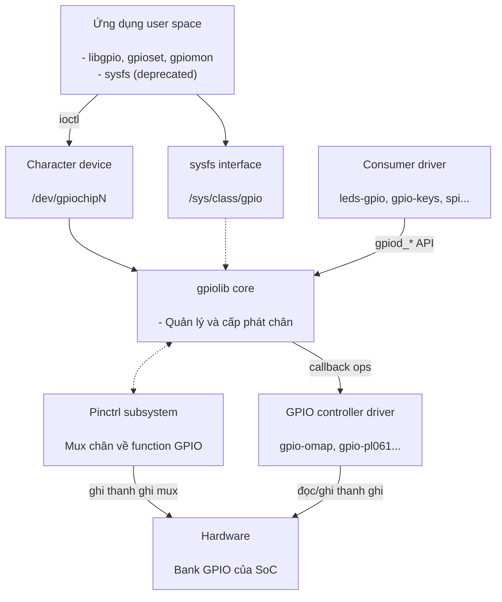
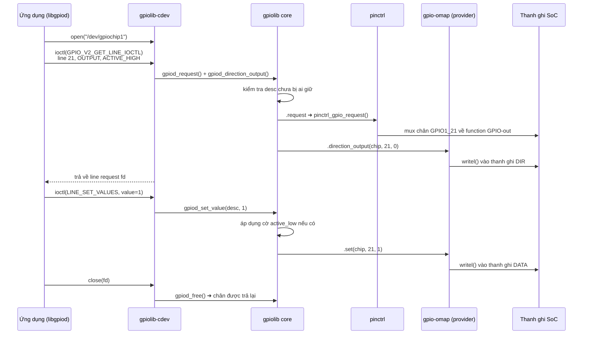

## 1. Mở đầu

GPIO là các chân số đa dụng của SoC, có thể cấu hình làm input hoặc output. Trên board nhúng, GPIO được dùng để điều khiển LED, đọc nút nhấn, reset thiết bị ngoại vi, chip-select cho SPI, nhận ngắt từ cảm biến...

Vấn đề: mỗi SoC có cách điều khiển GPIO khác nhau: thanh ghi khác nhau, số bank khác nhau,...Nếu mỗi driver tự truy cập thanh ghi thì:
- Không có sự thống nhất giữa các SoC.
- Không thể chia sẻ hoặc tránh xung đột khi hai driver cùng dùng một chân.
- Ứng dụng user space không có API chung.

GPIO subsystem (`drivers/gpio/`) ra đời để giải quyết: cung cấp một lớp trừu tượng chung, quản lý việc cấp phát chân và export API thống nhất cho cả kernel lẫn user.

## 2. Kiến trúc tổng thể

### 2.1. Mô hình thiết kế

GPIO subsystem được thiết kế theo mô hình **provider – core – consumer**:

- **Provider** là driver của GPIO controller trong SoC hoặc expanded chip I2C/SPI. Nó là nơi duy nhất được truy cập vào thanh ghi phần cứng.
- **Consumer** là bên request chân từ provider để dùng: có thể là driver khác trong kernel hoặc ứng dụng user space thông qua character device.
- Ở giữa là **core (gpiolib)**, nó không biết gì về thanh ghi cụ thể. Nó quản lý danh sách chip, cấp phát chân, chống xung đột và cung cấp một API thống nhất.

Kết quả là driver LED không cần quan tâm mình chạy trên AM335x hay STM32, còn người viết driver cho SoC mới cũng không cần đụng đến LED, nút nhấn hay SPI.



### 2.2. Quan hệ với pinctrl

GPIO và pinmux là hai phần khác nhau nhưng liên quan chặt chẽ:
- Pinctrl quyết định một chân vật lý hoạt động ở function nào (UART TX? I2C SDA? hay GPIO?) và các thuộc tính điện (pull-up/down, drive strength).
- GPIO chỉ điều khiển được chân khi pinctrl đã mux chân đó về function GPIO. Chân đang mux cho UART thì `gpioset` chạy vẫn thành công nhưng ngoài thực tế không có gì thay đổi - lỗi rất hay gặp khi debug.

Trên AM335x (BeagleBone Black), hai phần này là hai driver riêng: `gpio-omap.c` lo GPIO còn `pinctrl-single.c` lo pinmux. Nhiều SoC khác (Allwinner, STM32, i.MX...) lại gộp vào một driver duy nhất: vừa `gpiochip_add_data()` vừa `pinctrl_register()`. Cầu nối giữa hai bên là callback `.request` của `gpio_chip` $\rightarrow$ gọi `pinctrl_gpio_request()`.

:::warning Chú ý
GPIO chỉ điều khiển được chân khi pinctrl đã mux chân đó về function GPIO. Nếu chân đang được mux cho UART, mọi lệnh `gpioset` sẽ không có tác dụng ngoài thực tế dù kernel không báo lỗi rõ ràng.
:::

### 2.3. Tổ chức mã nguồn trong kernel

Toàn bộ subsystem nằm trong thư mục `drivers/gpio/`, cộng thêm vài header ở `include/`. Quy ước đặt tên rất dễ nhận ra: các file `gpiolib*` là phần core dùng chung, còn hàng trăm file `gpio-*.c` còn lại là driver controller của từng SoC.

```
linux/
├── drivers/
│   ├── gpio/
│   │   ├── gpiolib.c              # core: đăng ký chip, cấp phát chân, API gpiod_*
│   │   ├── gpiolib.h              # định nghĩa private của core
│   │   ├── gpiolib-devres.c       # các biến thể devm_*
│   │   ├── gpiolib-of.c           # parse Device Tree
│   │   ├── gpiolib-of.h
│   │   ├── gpiolib-acpi.c         # parse bảng ACPI
│   │   ├── gpiolib-acpi.h
│   │   ├── gpiolib-swnode.c       # parse software node
│   │   ├── gpiolib-swnode.h
│   │   ├── gpiolib-legacy.c       # API Integer-based cũ
│   │   ├── gpiolib-cdev.c         # Interface /dev/gpiochipN
│   │   ├── gpiolib-cdev.h
│   │   ├── gpiolib-sysfs.c        # Interface /sys/class/gpio (deprecated)
│   │   ├── gpiolib-sysfs.h
│   │   ├── gpio-mmio.c            # thư viện controller memory-mapped
│   │   ├── gpio-regmap.c          # thư viện controller qua regmap
│   │   ├── gpio-omap.c            # ─┐
│   │   ├── gpio-pl061.c           #  ├─ driver provider cho từng controller
│   │   ├── gpio-pca953x.c         # ─┘
│   │   ├── Kconfig
│   │   └── Makefile
│   └── pinctrl/
│       └── pinctrl-single.c       # pinmux của AM335x
└── include/
    ├── linux/
    │   ├── gpio/consumer.h
    │   ├── gpio/driver.h
    │   └── gpio.h
    └── uapi/linux/gpio.h
```

Ý nghĩa từng file và vị trí của nó trong kiến trúc:

| File | Thuộc tầng | Ý nghĩa |
| --- | --- | --- |
| `gpiolib.c` | Core | File chính của subsystem: đăng ký/gỡ gpiochip, cấp phát `gpio_desc`, request/free chân, xử lý active-low, cung cấp toàn bộ API `gpiod_*` |
| `gpiolib-devres.c` | Core | Các biến thể `devm_*`: tự động free chân khi driver unbind |
| `gpiolib-of.c` | Core | Parse Device Tree: đọc property `*-gpios`, lần theo phandle để biết chân thuộc gpiochip nào, offset bao nhiêu |
| `gpiolib-acpi.c` | Core | Tương tự nhưng cho firmware ACPI (thường gặp trên x86) |
| `gpiolib-swnode.c` | Core | Parse software node, dùng khi không có DT lẫn ACPI |
| `gpiolib-legacy.c` | Core | Cầu nối cho API Integer-based (`gpio_request`, `gpio_free`) |
| `gpiolib-cdev.c` | Interface user space | Cài đặt `/dev/gpiochipN`: các ioctl xin line, đọc/ghi giá trị, hàng đợi sự kiện cạnh |
| `gpiolib-sysfs.c` | Interface user space | Cài đặt `/sys/class/gpio` (deprecated), chỉ build khi bật `CONFIG_GPIO_SYSFS` |
| `gpio-*.c` | Provider | Driver cho từng controller: `gpio-omap.c` (AM335x trên BBB), `gpio-pl061.c`, `gpio-pca953x.c`... Mỗi file cài đặt một `struct gpio_chip` |
| `gpio-mmio.c` | Provider | Thư viện dùng chung cho các controller memory-mapped đơn giản, driver chỉ cần khai báo địa chỉ thanh ghi |
| `gpio-regmap.c` | Provider | Tương tự nhưng cho controller truy cập qua regmap (I2C/SPI expander) |

## 3. GPIO Provider

Provider là driver của GPIO controller. Công việc của nó gói gọn trong ba bước:
- Mô tả chip bằng `struct gpio_chip`
- Viết các callback đọc/ghi thanh ghi
- Đăng ký callback với gpiolib.

### 3.1. struct gpio_chip

Đây là interface mà driver controller phải cài đặt:

```c
struct gpio_chip {
    const char *label;
    struct device *parent;

    int  ngpio;          /* số chân của chip */
    int  base;           /* số hiệu global bắt đầu (legacy, nên để -1) */

    int  (*request)(struct gpio_chip *gc, unsigned offset);
    void (*free)(struct gpio_chip *gc, unsigned offset);

    int  (*get_direction)(struct gpio_chip *gc, unsigned offset);
    int  (*direction_input)(struct gpio_chip *gc, unsigned offset);
    int  (*direction_output)(struct gpio_chip *gc, unsigned offset, int value);

    int  (*get)(struct gpio_chip *gc, unsigned offset);
    void (*set)(struct gpio_chip *gc, unsigned offset, int value);

    int  (*set_config)(struct gpio_chip *gc, unsigned offset,
                       unsigned long config);   /* pull-up, open-drain… */

    int  (*to_irq)(struct gpio_chip *gc, unsigned offset);

    struct gpio_irq_chip irq;   /* nếu chip có khả năng gen interrupt */
};
```

Các trường mô tả chip:

| Trường | Ý nghĩa |
| --- | --- |
| `label` | Tên hiện trong `gpiodetect` và `/sys/kernel/debug/gpio`, ví dụ `gpio-32-63` của bank GPIO1 trên AM335x |
| `parent` | `struct device` của controller, dùng để core biết chip thuộc node DT nào |
| `ngpio` | Số chân của chip, quyết định kích thước mảng descriptor mà core cấp phát |
| `base` | Số toàn cục đầu tiên của chip. Để `-1` cho kernel tự cấp, chỉ set cứng khi phải giữ tương thích với sysfs cũ |
| `can_sleep` | Đặt `true` nếu thao tác chân phải đi qua bus chậm (I2C/SPI). Core dựa vào đây để chặn consumer gọi trong atomic context |
| `of_xlate` | Đổi các cell trong DT thành offset. Chỉ cần viết khi `#gpio-cells` khác chuẩn 2 cell |
| `irq` | Nhúng `struct gpio_irq_chip` khi chip có thể sinh ngắt, core sẽ tự dựng irq domain |

Các callback:

| Callback | Core gọi khi nào |
| --- | --- |
| `.get` / `.set` | Consumer đọc hoặc ghi giá trị chân |
| `.direction_input` / `.direction_output` | Lúc consumer request chân kèm flag hướng hoặc đổi hướng runtime |
| `.get_direction` | `gpioinfo` và debugfs cần biết chân đang là in hay out |
| `.request` / `.free` | Chân bắt đầu/kết thúc được sử dụng. Đây là chỗ gọi sang pinctrl để giữ chỗ |
| `.set_config` | Consumer yêu cầu pull-up/pull-down, open-drain, debounce |
| `.to_irq` | Consumer gọi `gpiod_to_irq()` để lấy số IRQ |

### 3.2. Cài đặt callback

Các callback nhận `struct gpio_chip *` và offset trong chip (`0..ngpio-1`), không bao giờ nhận số toàn cục. Dữ liệu riêng của driver lấy lại bằng `gpiochip_get_data()`:

```c
static int my_get(struct gpio_chip *gc, unsigned int offset)
{
    struct my_gpio *priv = gpiochip_get_data(gc);

    return !!(readl(priv->base + REG_DATAIN) & BIT(offset));
}

static void my_set(struct gpio_chip *gc, unsigned int offset, int value)
{
    struct my_gpio *priv = gpiochip_get_data(gc);

    writel(BIT(offset), priv->base + (value ? REG_SETDATAOUT : REG_CLEARDATAOUT));
}

static int my_direction_output(struct gpio_chip *gc, unsigned int offset, int value)
{
    struct my_gpio *priv = gpiochip_get_data(gc);
    unsigned long flags;
    u32 reg;

    my_set(gc, offset, value);          /* đặt level trước khi bật output */

    spin_lock_irqsave(&priv->lock, flags);
    reg = readl(priv->base + REG_OE);
    reg &= ~BIT(offset);                /* AM335x: bit = 0 nghĩa là output */
    writel(reg, priv->base + REG_OE);
    spin_unlock_irqrestore(&priv->lock, flags);

    return 0;
}
```

Thanh ghi direction dùng chung cho cả bank nên bắt buộc phải lock khi read-modify-write, nếu không hai driver cùng đổi hướng hai chân khác nhau sẽ ghi đè lẫn nhau.

### 3.3. Đăng ký với gpiolib

```c
static int my_gpio_probe(struct platform_device *pdev)
{
    struct my_gpio *priv;

    priv = devm_kzalloc(&pdev->dev, sizeof(*priv), GFP_KERNEL);
    if (!priv)
        return -ENOMEM;

    priv->base = devm_platform_ioremap_resource(pdev, 0);
    if (IS_ERR(priv->base))
        return PTR_ERR(priv->base);

    priv->gc.label            = "my-gpio";
    priv->gc.parent           = &pdev->dev;
    priv->gc.owner            = THIS_MODULE;
    priv->gc.base             = -1;     /* để kernel tự cấp số */
    priv->gc.ngpio            = 32;
    priv->gc.direction_input  = my_direction_input;
    priv->gc.direction_output = my_direction_output;
    priv->gc.get              = my_get;
    priv->gc.set              = my_set;

    return devm_gpiochip_add_data(&pdev->dev, &priv->gc, priv);
}
```

Tham số cuối của `devm_gpiochip_add_data()` chính là con trỏ mà `gpiochip_get_data()` trả về trong callback. Bản `devm_` tự gỡ chip khi driver unbind nên không cần `.remove`.

Mỗi `gpio_chip` được đăng ký sẽ tạo ra một node `/dev/gpiochipN` và một entry trong `/sys/bus/gpio/devices/`. Trên BBB, driver `gpio-omap.c` probe 4 lần cho 4 node DT nên có 4 chip từ `gpiochip0` đến `gpiochip3`. Đây không phải quy luật chung: xem [3.4](#34-phân-biệt-gpiochip-và-bank) để biết vì sao có SoC chỉ hiện đúng một `gpiochip` cho toàn bộ các bank.

:::tip Offset và global number
Bên trong một chip, chân được đánh số `0..ngpio-1` (offset). Cách đánh số global (`base + offset`) là di sản của sysfs API cũ, đã deprecated. Code mới luôn làm việc với cặp `(gpiochip, offset)`: chân P9_12 của BBB là `(gpiochip1, 28)` chứ không phải "gpio60".
:::

### 3.4. Phân biệt gpiochip và bank

Người mới hay ngầm hiểu một bank của SoC = một `/dev/gpiochipN`. Điều đó đúng trên BBB nhưng sai trên nhiều SoC khác và khi sai thì mọi phép tính offset đều lệch.

**Bank là chuyện của phần cứng.** Nhà sản xuất SoC gom một nhóm chân dùng chung một cụm thanh ghi, thường là 32 chân. Nhóm đó được đặt tên trong datasheet: GPIO0..GPIO3 trên AM335x, PA..PF trên Allwinner, GPIOA..GPIOK trên STM32.

**gpiochip là chuyện của Linux.** Nó chỉ xuất hiện lúc chạy, khi một driver gọi `gpiochip_add_data()`. Mỗi lần gọi thì core tạo ra một `gpio_device` kèm một node `/dev/gpiochipN` và một entry trong `/sys/bus/gpio/devices/`. Chân trong chip được đánh số lại từ 0 đến `ngpio-1`, gọi là offset. Số `N` thì do core cấp theo thứ tự probe nên nó có thể đổi khi ta sửa Device Tree, nâng kernel hay cắm thêm expander.

Nói ngắn gọn: **bank là cách phần cứng nhóm các chân lại, gpiochip là cách driver trình bày các chân đó cho Linux.** Ánh xạ giữa hai bên hoàn toàn do driver quyết định và user space chỉ nhìn thấy vế sau.

Mấu chốt ánh xạ này nằm ở số lần driver gọi `gpiochip_add_data()`. Gọi bao nhiêu lần thì hệ thống có bấy nhiêu `/dev/gpiochipN`, bất kể phần cứng có bao nhiêu bank. Con số đó phụ thuộc cách Device Tree mô tả controller: mỗi node có `gpio-controller` là một lần probe.

**Kiểu A:** 4 bank $\rightarrow$ 4 node DT $\rightarrow$ gpio-omap probe 4 lần $\rightarrow$ 4 gpiochip

```
bank GPIO0 ──► gpio@44e07000 ──┐
bank GPIO1 ──► gpio@4804c000 ──┤  mỗi node gọi
bank GPIO2 ──► gpio@481ac000 ──┤  gpiochip_add_data() một lần
bank GPIO3 ──► gpio@481ae000 ──┘
                               └──► /dev/gpiochip0..3, mỗi chip 32 line
                                    offset = đúng số chân trong bank
```

**Kiểu B:** 6 bank $\rightarrow$ 1 node DT $\rightarrow$ pinctrl-sunxi probe 1 lần $\rightarrow$ 1 gpiochip

```
bank PA ┐
bank PB │
bank PC ├──► pinctrl@1c20800 ──►  gpiochip_add_data() gọi đúng một lần
bank PD │                      └──► /dev/gpiochip0, 192 line
bank PE │                           offset = bank_index * 32 + pin
bank PF ┘
```

**Ví dụ kiểu A: mỗi bank một gpiochip (AM335x)**

Device Tree khai báo 4 node độc lập, driver `gpio-omap.c` probe 4 lần:

```dts
gpio1: gpio@4804c000 {
    compatible = "ti,omap4-gpio";
    reg = <0x4804c000 0x1000>;
    gpio-controller;
    #gpio-cells = <2>;          /* pin, flags */
    ...
};
```

```bash
$ gpiodetect
gpiochip0 [gpio-0-31]   (32 lines)
gpiochip1 [gpio-32-63]  (32 lines)
gpiochip2 [gpio-64-95]  (32 lines)
gpiochip3 [gpio-96-127] (32 lines)
```

Ở kiểu này bank và gpiochip trùng khít nên không phải quy đổi gì: chân GPIO1_28 chính là `(gpiochip1, offset 28)`.

**Kiểu B: một gpiochip cho tất cả bank (Allwinner F1C100s)**

Allwinner đặt toàn bộ các bank PA..PF trong cùng một vùng thanh ghi tại `0x01C20800` nên Device Tree chỉ có một node và node đó vừa là pinctrl vừa là gpio-controller:

```dts
pio: pinctrl@1c20800 {
    compatible = "allwinner,suniv-f1c100s-pinctrl";
    reg = <0x01c20800 0x400>;
    gpio-controller;
    #gpio-cells = <3>;          /* bank, pin, flags */
    ...
};
```

`pinctrl-sunxi.c` đăng ký đúng một `gpio_chip` phủ hết mọi bank và tự tính `ngpio` từ chân có số thứ tự cao nhất:

```c
/* drivers/pinctrl/sunxi/pinctrl-sunxi.c */
last_pin = pctl->desc->pins[pctl->desc->npins - 1].pin.number;
pctl->chip->ngpio = round_up(last_pin, PINS_PER_BANK) - pctl->desc->pin_base;
pctl->chip->label = dev_name(&pdev->dev);               /* "1c20800.pinctrl" */
ret = gpiochip_add_data(pctl->chip, pctl);              /* gọi đúng một lần */
```

F1C100s có chân cao nhất là PF5 với số thứ tự `5 * 32 + 5 = 165`, làm tròn lên bội của 32 thành 192:

```bash
$ gpiodetect
gpiochip0 [1c20800.pinctrl] (192 lines)
```

Hai chi tiết đọc được ngay từ dòng output này:

- Label là `1c20800.pinctrl` chứ không phải dạng `...gpio`, dấu hiệu cho biết chip do driver pinctrl đăng ký, tức là kiểu gộp.
- 192 là số slot chứ không phải số chân vật lý. F1C100s thật ra chỉ có 53 chân.

Công thức quy đổi từ tên chân trong datasheet sang offset:

```
offset = bank_index * 32 + pin_number
```

Trong đó: PA=0, PB=1, PC=2, PD=3, PE=4, PF=5

| Bank | Dải offset | Chân thật sự có trên F1C100s | Ví dụ |
| --- | --- | --- | --- |
| PA | 0 – 31 | PA0 – PA3 | PA3 $\rightarrow$ 3 |
| PB | 32 – 63 | PB0 – PB3 | PB2 $\rightarrow$ 34 |
| PC | 64 – 95 | PC0 – PC3 | PC1 $\rightarrow$ 65 |
| PD | 96 – 127 | PD0 – PD21 | PD14 $\rightarrow$ 110 |
| PE | 128 – 159 | PE0 – PE12 | PE6 $\rightarrow$ 134 |
| PF | 160 – 191 | PF0 – PF5 | PF5 $\rightarrow$ 165 |

:::tip Thông tin bổ sung
Một số SoC Allwinner khác còn có bank PL do khối R_PIO quản lý, khai báo bằng node riêng `r_pio: pinctrl@1f02c00`. Node riêng nghĩa là thêm một lần probe nên board đó có hai gpiochip dù vẫn là Allwinner. Chip thứ hai có `pin_base` khác 0 và phép trừ `- pctl->desc->pin_base` trong đoạn code trên chính là để nó đếm offset lại từ 0.
:::

### 3.5. Ánh xạ node Device Tree và gpiochip

Mục 3.4 nói về việc một gpiochip có thể gộp nhiều bank. Ở đây là một cái bẫy khác, xảy ra ngay cả khi mỗi bank đúng một gpiochip: số trong tên node DT và số trong tên `/dev/gpiochipN` là hai hệ đánh số hoàn toàn độc lập. Viết `&gpio2` trong DTS không có nghĩa là chân đó sẽ hiện ra ở `gpiochip2`.


**Hiện tượng**

Trên BeagleBone Black, khai báo một `gpio-hog` giữ hai chân P8_7 và P8_8 của bank GPIO2:

```dts
&gpio2 {
    smartfarm_hog {
        pinctrl-names = "default";
        pinctrl-0 = <&smartfarm_gpio_pins>;

        gpio-hog;
        gpios = <2 GPIO_ACTIVE_HIGH>, <3 GPIO_ACTIVE_HIGH>;
        output-low;
        line-name = "smartfarm";
    };
};
```

Nhưng khi boot lên thì hai chân bị giữ lại nằm ở `gpiochip1` chứ không phải `gpiochip2`:

```bash
$ gpioinfo
gpiochip1 - 32 lines:
        line   0: "P9_15B"    unused      input  active-high
        line   1: "P8_18"     unused      input  active-high
        line   2: "P8_7"      "smartfarm" output active-high [used]
        line   3: "P8_8"      "smartfarm" output active-high [used]
gpiochip2 - 32 lines:
        line   0: "[mii col]" unused      input  active-high
        line   1: "[mii crs]" unused      input  active-high
        ...
```

Bản thân việc hog hoạt động là đúng, chỉ là nó không nằm ở chỗ ta tưởng. Nếu lúc này viết script theo giả định `&gpio2` $\rightarrow$ `gpiochip2` thì `gpioset` sẽ tác động lên một chân hoàn toàn khác mà không hề báo lỗi.

**Nguyên nhân: thứ tự probe**

Như đã nói ở 3.4, `N` là ID core cấp tuần tự mỗi lần `gpiochip_add_data()` được gọi. Thứ tự các lần gọi đó là thứ tự driver bind được vào từng node, không phải thứ tự viết trong DTS cũng không phải thứ tự địa chỉ thanh ghi: một node còn chờ clock, pinctrl hay power domain sẽ bị deferred probe và bind sau.

Trên board này bank GPIO0 bind sau cùng nên ba bank còn lại dồn lên một bậc:

| Node DT | Bank phần cứng | Thứ tự bind | Kết quả |
| --- | --- | --- | --- |
| `&gpio1` | GPIO1 | 1 | `gpiochip0` |
| `&gpio2` | GPIO2 | 2 | `gpiochip1` |
| `&gpio3` | GPIO3 | 3 | `gpiochip2` |
| `&gpio0` | GPIO0 | 4 | `gpiochip3` |

**Label cũng không dùng để suy ra bank được**

Nhìn `gpiodetect` thấy `gpiochip1 [gpio-32-63]` rất dễ kết luận chip này là bank có global number 32..63, tức GPIO1. Kết luận đó sai, vì `gpio-omap.c` sinh label từ một biến đếm tĩnh cộng dồn qua từng lần probe chứ không tính từ địa chỉ bank:

```c
/* drivers/gpio/gpio-omap.c */
static int gpio;
...
label = devm_kasprintf(bank->chip.parent, GFP_KERNEL, "gpio-%d-%d",
                       gpio, gpio + bank->width - 1);
bank->chip.label = label;                /* "gpio-0-31", "gpio-32-63"... */
...
gpio += bank->width;                     /* lần probe sau lấy dải kế tiếp */
```

Nên `gpio-32-63` chỉ có nghĩa đây là chip được đăng ký thứ hai, giống hệt thông tin mà số `1` trong `gpiochip1` đã nói. Cả hai đều là hệ quả của thứ tự probe.

**Cách xác định ánh xạ chắc chắn**

Thứ duy nhất buộc chặt gpiochip với node DT là platform device đứng làm parent của nó, mà tên platform device thì lấy từ địa chỉ trong `reg`:

```bash
$ cat /sys/kernel/debug/gpio
gpiochip0: 32 GPIOs, parent: platform/4804c000.gpio, gpio-0-31:
gpiochip1: 32 GPIOs, parent: platform/481ac000.gpio, gpio-32-63:
gpiochip2: 32 GPIOs, parent: platform/481ae000.gpio, gpio-64-95:
gpiochip3: 32 GPIOs, parent: platform/44e07000.gpio, gpio-96-127:

# hoặc đọc đường dẫn sysfs, thư mục cha của gpiochipN chính là platform device
$ ls -l /sys/bus/gpio/devices/
gpiochip1 -> ../../../devices/platform/ocp/481ac000.gpio/gpiochip1
```

Đối chiếu `481ac000.gpio` với `gpio2: gpio@481ac000` trong DTS là ra ngay node cần tìm.

**Cách để không phải quan tâm tới số chip nữa**

Đặt `gpio-line-names` cho từng node provider. Tên gắn theo node DT nên nó vừa lộ ra ánh xạ khi chạy `gpioinfo`, vừa cho phép gọi chân theo tên:

```dts
&gpio2 {
    gpio-line-names = "P9_15B", "P8_18", "P8_7", "P8_8", "P8_10", "P8_9", ...;
};

&gpio3 {
    gpio-line-names = "[mii col]", "[mii crs]", "[mii rx err]", "[mii tx en]", ...;
};
```

Chính nhờ bảng tên này mà ở phần hiện tượng bên trên ta khẳng định được `&gpio2` ra `gpiochip1`: tên khai trong `&gpio2` hiện dưới `gpiochip1`, tên khai trong `&gpio3` hiện dưới `gpiochip2`. Sau đó thì script không cần biết số chip:

```bash
$ gpioset $(gpiofind P8_7)=1      # v1
$ gpioset P8_7=1                  # v2
```

:::warning Chú ý
`gpio-line-names` không phải nguyên nhân gây lệch, nó chỉ là thứ giúp nhìn thấy sự lệch. Nguyên nhân luôn là thứ tự probe.

Consumer trong kernel không bao giờ dính lỗi này vì tham chiếu node qua phandle (`<&gpio2 2 GPIO_ACTIVE_HIGH>`) và core tự tra ra đúng `gpio_device`. Chỉ user space mới phải làm việc với con số `N`, nên tuyệt đối không hardcode `gpiochip2` chỉ vì DTS ghi `&gpio2`.
:::

## 4. GPIO core

### 4.1. Ba struct cần phân biệt

| Struct | Ý nghĩa | Ghi chú |
| --- | --- | --- |
| `struct gpio_chip` | Bảng vtable chứa các callback đến các hàm thao tác với GPIO controller của SoC | Driver provider khai báo |
| `struct gpio_device` | Phần kernel object của controller đó: device, danh sách descriptor, refcount, chardev | Tồn tại độc lập với `gpio_chip`, giúp core hoạt động ổn định khi driver bị gỡ giữa chừng |
| `struct gpio_desc` | Đại diện cho một chân cụ thể: cờ trạng thái (đang dùng/rảnh, hướng, active-low), tên consumer | gpiolib cấp phát mảng descriptor cho mỗi chip, consumer chỉ cầm con trỏ `gpio_desc *`, không bao giờ thấy số hiệu GPIO toàn cục |

### 4.2. Khi provider đăng ký chip

`gpiochip_add_data()` làm lần lượt:

1. Cấp phát `struct gpio_device`, gán ID để thành `gpiochipN`.
2. Cấp phát mảng `ngpio` descriptor, tất cả đánh dấu là chưa có chủ.
3. Tạo character device `/dev/gpiochipN` và entry trong sysfs.
4. Đưa chip vào danh sách toàn cục, đồng thời đăng ký với lớp Device Tree để các consumer tra phandle ra được chip này.
5. Quét các `gpio-hog` khai báo trong node của chip và giữ sẵn những chân đó.

### 4.3. Khi consumer request một chân

Ví dụ driver `leds-gpio` gọi `devm_gpiod_get(dev, "led", GPIOD_OUT_LOW)`:

1. Core đọc node DT của device, tìm property `led-gpios`.
2. `gpiolib-of.c` parse giá trị `<&gpio1 21 GPIO_ACTIVE_HIGH>`: lấy phandle, tra ra `gpio_device` của bank GPIO1.
3. Gọi `.of_xlate()` để đổi cell thành offset 21, đồng thời ghi nhận cờ active-high/active-low.
4. Lấy `gpio_desc` thứ 21 của chip đó, kiểm tra xem đã có ai giữ chưa. Nếu rồi thì trả `-EBUSY` ngay.
5. Đánh dấu descriptor là đã có chủ, lưu tên consumer, gọi `.request()` của provider (thường sẽ báo sang pinctrl).
6. Áp flag `GPIOD_OUT_LOW` bằng cách gọi `.direction_output()` với giá trị 0.
7. Trả về con trỏ `gpio_desc *` cho driver.

Từ đây driver chỉ cầm con trỏ đó, không biết và không cần biết chân thuộc chip nào.

## 5. GPIO Consumer

Consumer trong kernel có hai bộ API để xin và điều khiển chân: Integer-based (deprecated) và Descriptor-based (chuẩn hiện nay). Code mới chỉ dùng loại thứ hai, nhưng vẫn cần biết loại thứ nhất vì rất nhiều driver cũ và ví dụ trên mạng viết theo kiểu đó.

### 5.1. Integer-based API

API này ra đời trước, coi mỗi chân trong hệ thống là một số nguyên toàn cục, tính bằng `base` của chip cộng offset. Trên BBB, LED usr0 là chân 21 của bank GPIO1, mà bank này có `base = 32`, nên số của nó là 53.

```c
#include <linux/gpio.h>
#include <linux/of_gpio.h>

int gpio, irq, ret;

/* lấy số chân từ property led-gpios trong DT */
gpio = of_get_named_gpio(dev->of_node, "led-gpios", 0);
if (!gpio_is_valid(gpio))
    return -EINVAL;

ret = devm_gpio_request_one(dev, gpio, GPIOF_OUT_INIT_LOW, "led");
if (ret)
    return ret;

gpio_set_value(gpio, 1);
val = gpio_get_value(gpio);
irq = gpio_to_irq(gpio);

gpio_free(gpio);
```

| Hàm | Ý nghĩa |
| --- | --- |
| `gpio_is_valid(gpio)` | Kiểm tra chân có hợp lệ không |
| `gpio_request(gpio, label)` | Xin chân, `label` là tên consumer |
| `gpio_request_one(gpio, flags, label)` | Xin chân kèm đặt hướng luôn |
| `gpio_direction_input/output()` | Đổi hướng |
| `gpio_get_value()` / `gpio_set_value()` | Đọc/ghi mức điện áp |
| `gpio_to_irq(gpio)` | Đổi số chân thành số IRQ |
| `gpio_free(gpio)` | Trả chân |

Vấn đề của cách này:

- Số toàn cục không ổn định: Nó phụ thuộc `base` mà kernel cấp theo thứ tự probe. Thêm một GPIO expander qua I2C hoặc đổi phiên bản kernel là số có thể lệch. Driver nào hardcode số sẽ điều khiển nhầm chân.
- Driver phải tự xử lý active-low: Cờ `GPIO_ACTIVE_LOW` trong DT bị bỏ qua, muốn đúng thì tự đảo trong code.
- Không quản lý được nhóm chân và các bản `devm_` cũng không đầy đủ.

### 5.2. Descriptor-based API

Driver xin chân theo tên chức năng và nhận về một con trỏ `struct gpio_desc *`, bên trong nó đã có sẵn thông tin chân thuộc chip nào, offset bao nhiêu, active-high hay active-low.

```c
#include <linux/gpio/consumer.h>

struct gpio_desc *led;

/* led match với property led-gpios trong DT node của device */
led = devm_gpiod_get(dev, "led", GPIOD_OUT_LOW);
if (IS_ERR(led))
    return PTR_ERR(led);

gpiod_set_value(led, 1);
gpiod_set_raw_value(led, 1);      /* bỏ qua active-low, ghi thẳng mức điện */

val = gpiod_get_value(button);

irq = gpiod_to_irq(button);       /* lấy IRQ number để request_irq() */
```

| Hàm | Ý nghĩa |
| --- | --- |
| `devm_gpiod_get(dev, con_id, flags)` | Xin 1 chân, tự free khi driver unbind |
| `devm_gpiod_get_optional()` | Trả `NULL` nếu DT không khai báo (không coi là lỗi) |
| `devm_gpiod_get_index()` | Lấy phần tử thứ n khi property có nhiều chân |
| `devm_gpiod_get_array()` | Xin cả nhóm chân (`data-gpios` nhiều phần tử) |
| `gpiod_direction_input/output()` | Đổi hướng lúc runtime |
| `gpiod_get_value_cansleep()` | Bản dùng được khi chip nằm sau I2C/SPI (có thể ngủ) |
| `gpiod_set_raw_value()` | Ghi thẳng mức điện, bỏ qua cờ active-low |
| `gpiod_put()` | Trả chân, chỉ cần khi không dùng bản `devm_` |

**Quan trọng**: `gpiod_get_value()` chỉ được gọi trong atomic context nếu chip là memory-mapped. Với GPIO expander qua I2C/SPI (PCF8574, MCP23017...) phải dùng biến thể `_cansleep()`.

## 6. Khai báo trong Device Tree

Provider node phải có `gpio-controller` và `#gpio-cells`:

```dts
/* am33xx.dtsi - bank GPIO1 của AM335x */
gpio1: gpio@4804c000 {
    compatible = "ti,omap4-gpio";
    reg = <0x4804c000 0x1000>;
    gpio-controller;
    #gpio-cells = <2>;        /* <&gpio1 pin flags> */
    interrupt-controller;
    #interrupt-cells = <2>;
};
```

Consumer node tham chiếu tới:

```dts
/* am335x-bone-common.dtsi - 4 LED user trên BBB */
leds {
    compatible = "gpio-leds";

    led2 {
        label = "beaglebone:green:usr0";
        /* GPIO1_21, active high */
        gpios = <&gpio1 21 GPIO_ACTIVE_HIGH>;
        linux,default-trigger = "heartbeat";
        default-state = "off";
    };
};

my-device {
    compatible = "vendor,my-device";
    reset-gpios = <&gpio1 2 GPIO_ACTIVE_LOW>;
    irq-gpios   = <&gpio1 3 GPIO_ACTIVE_HIGH>;
};
```

Quy ước tên: property phải kết thúc bằng `-gpios` (hoặc `-gpio`), và `con_id` truyền vào `gpiod_get()` là phần đứng trước. Ví dụ `reset-gpios` → `gpiod_get(dev, "reset", ...)`. Nếu chỉ có property tên `gpios` thì truyền `con_id = NULL`.

Số cell (`#gpio-cells`) tuỳ SoC: AM335x và đa số SoC dùng 2 (`pin, flags`) vì mỗi bank là một node riêng (`gpio0`..`gpio3`); một số SoC như Allwinner gom mọi bank vào một node nên cần 3 (`bank, pin, flags`). Chi tiết về hai kiểu tổ chức này và cách quy đổi sang offset mà user space nhìn thấy nằm ở [3.4](#34-phân-biệt-gpiochip-và-bank).

Flags thông dụng (`include/dt-bindings/gpio/gpio.h`): `GPIO_ACTIVE_HIGH`, `GPIO_ACTIVE_LOW`, `GPIO_OPEN_DRAIN`, `GPIO_PULL_UP`, `GPIO_PULL_DOWN`.

Provider node còn nhận thêm `gpio-line-names`, một mảng chuỗi đặt tên cho từng line theo thứ tự offset. Tên này không ảnh hưởng gì tới kernel, nó chỉ đi thẳng ra user space cho `gpioinfo`, `gpiofind` và các API tra cứu theo tên của libgpiod:

```dts
&gpio1 {
    /* phần tử thứ i đặt tên cho offset i, để "" cho chân không muốn đặt tên */
    gpio-line-names = "", "", ..., "P9_12", ...;
};
```

Nên khai báo property này cho mọi board dùng lâu dài: nó vừa giúp ứng dụng gọi chân theo tên thay vì nhớ offset, vừa là cách nhanh nhất để kiểm tra node DT nào ứng với `/dev/gpiochipN` nào — vấn đề nói ở [3.5](#35-ánh-xạ-node-device-tree-và-gpiochip).

## 7. Interface phía user-space

Kernel mở GPIO ra ngoài bằng hai đường: sysfs (cũ, deprecated) và character device (hiện nay). Cả hai đều đi qua gpiolib nên tuân thủ cùng luật chống xung đột: chân đang bị driver kernel giữ thì user space không xin được, và ngược lại.

### 7.1. sysfs

Interface này làm việc theo số GPIO toàn cục. Muốn dùng một chân, ghi số của nó vào file `export`, kernel sẽ tạo ra thư mục `/sys/class/gpio/gpioN/` chứa các file điều khiển.

Bố cục thư mục:

```
/sys/class/gpio/
├── export              # ghi số chân vào đây để request chân
├── unexport            # ghi số chân vào đây để trả chân
├── gpiochip0/          # thư mục đặt tên theo base của chip, không theo /dev/gpiochipN
├── gpiochip32/
│   ├── base            # 32
│   ├── label           # gpio-32-63
│   └── ngpio           # 32
└── gpio60/             # xuất hiện sau khi export chân 60
    ├── direction
    ├── value
    ├── edge
    └── active_low
```

| File | Cách dùng |
| --- | --- |
| `export` / `unexport` | Ghi số toàn cục của chân để chiếm hoặc trả chân |
| `direction` | Ghi `in` hoặc `out`. Ghi thẳng `high`/`low` sẽ vừa đặt output vừa đặt mức. |
| `value` | Đọc hoặc ghi `0`/`1`. Với chân input, `poll()` trên file này để chờ sự kiện |
| `edge` | `none`, `rising`, `falling`, `both`. Phải đặt trước khi `poll()` |
| `active_low` | Ghi `1` thì mọi thao tác đọc/ghi qua `value` bị đảo mức |
| `gpiochipN/base`, `label`, `ngpio` | Thông tin chip, dùng để tính số toàn cục |

Tính số toàn cục trên BBB: mỗi bank 32 chân, `base` của bank GPIO1 là 32 nên chân P9_12 (GPIO1_28) có số 60. Kiểm tra lại bằng chính sysfs, để ý tên thư mục chip là `gpiochip<base>` chứ không phải `gpiochipN` như trong `/dev`:

```bash
$ cat /sys/class/gpio/gpiochip32/label
gpio-32-63
$ cat /sys/class/gpio/gpiochip32/ngpio
32
```

Điều khiển LED nối vào P9_12:

```bash
echo 60   > /sys/class/gpio/export          # chiếm chân, tạo /sys/class/gpio/gpio60/
echo out  > /sys/class/gpio/gpio60/direction
echo 1    > /sys/class/gpio/gpio60/value    # bật
echo 0    > /sys/class/gpio/gpio60/value    # tắt
echo 60   > /sys/class/gpio/unexport        # trả chân
```

Đọc nút nhấn nối vào P9_15 (GPIO1_16):

```bash
echo 48  > /sys/class/gpio/export
echo in  > /sys/class/gpio/gpio48/direction
cat /sys/class/gpio/gpio48/value            # đọc một lần
```

Chờ sự kiện cạnh thì phải đặt `edge` rồi `poll()` vì file `value` luôn sẵn sàng để đọc nên `select()`/`read()` thông thường không chặn được:

```bash
echo falling > /sys/class/gpio/gpio48/edge
```

```c
int fd = open("/sys/class/gpio/gpio48/value", O_RDONLY);
struct pollfd pfd = { .fd = fd, .events = POLLPRI | POLLERR };
char buf[8];

read(fd, buf, sizeof(buf));

while (1) {
    poll(&pfd, 1, -1);             /* POLLPRI báo có cạnh */
    lseek(fd, 0, SEEK_SET);        /* phải tua về đầu file trước mỗi lần đọc */
    read(fd, buf, sizeof(buf));
    printf("có cạnh, giá trị = %c\n", buf[0]);
}
```

Interface này đã bị deprecated từ kernel 4.8 và đang bị gỡ dần (cần bật `CONFIG_GPIO_SYSFS` mới có). Nhược điểm:

| Vấn đề | Mô tả |
| --- | --- |
| Global number không ổn định | Số hiệu thay đổi theo thứ tự probe, khác nhau giữa các phiên bản kernel |
| Không có ownership | Process chết → chân vẫn export, không ai dọn |
| Không atomic | Không set/get nhiều chân cùng lúc |
| Đọc interrupt vụng về | Phải `poll()` trên file `value` |
| Không có metadata | Không biết chân đang được ai dùng, tên là gì |

### 7.2. Character device

Từ kernel 4.8, mỗi gpiochip có một char device `/dev/gpiochipN`. Cách dùng khác hẳn sysfs: không ghi file text mà gọi `ioctl()` và chân được cấp qua một file descriptor riêng gọi là line request.

Trình tự luôn gồm bốn bước:

1. `open("/dev/gpiochipN")` để lấy fd của chip.
2. Truy vấn thông tin chip và line nếu cần.
3. Gọi `GPIO_V2_GET_LINE_IOCTL` để xin một hoặc nhiều chân, nhận về fd của line request.
4. Đọc/ghi giá trị hoặc chờ sự kiện trên fd đó, xong thì `close()`.

| ioctl | Gọi trên fd nào | Công dụng |
| --- | --- | --- |
| `GPIO_GET_CHIPINFO_IOCTL` | fd của chip | Lấy tên, label và số line của chip |
| `GPIO_V2_GET_LINEINFO_IOCTL` | fd của chip | Thông tin một line: tên, consumer đang giữ, hướng, các cờ |
| `GPIO_V2_GET_LINEINFO_WATCH_IOCTL` | fd của chip | Đăng ký theo dõi, có ai xin/trả line thì được báo |
| `GPIO_V2_GET_LINE_IOCTL` | fd của chip | Xin chân, trả về fd của line request |
| `GPIO_V2_LINE_GET_VALUES_IOCTL` | fd của line request | Đọc giá trị nhiều chân cùng lúc |
| `GPIO_V2_LINE_SET_VALUES_IOCTL` | fd của line request | Ghi giá trị nhiều chân cùng lúc |
| `GPIO_V2_LINE_SET_CONFIG_IOCTL` | fd của line request | Đổi cấu hình (hướng, bias, debounce) mà không cần xin lại chân |

Cấu hình chân nằm ở trường `config.flags` khi xin:

| Cờ | Ý nghĩa |
| --- | --- |
| `GPIO_V2_LINE_FLAG_INPUT` / `OUTPUT` | Hướng của chân |
| `GPIO_V2_LINE_FLAG_ACTIVE_LOW` | Đảo mức logic so với mức điện |
| `GPIO_V2_LINE_FLAG_BIAS_PULL_UP` / `PULL_DOWN` / `DISABLED` | Điện trở kéo |
| `GPIO_V2_LINE_FLAG_OPEN_DRAIN` / `OPEN_SOURCE` | Kiểu ngõ ra |
| `GPIO_V2_LINE_FLAG_EDGE_RISING` / `FALLING` | Bắt sự kiện cạnh, có thể đặt cả hai |

Bật LED ở P9_12 (`gpiochip1` line 28) bằng ioctl:

```c
#include <fcntl.h>
#include <linux/gpio.h>
#include <sys/ioctl.h>
#include <unistd.h>

int chip_fd = open("/dev/gpiochip1", O_RDWR);

struct gpiochip_info info;
ioctl(chip_fd, GPIO_GET_CHIPINFO_IOCTL, &info);
printf("%s: %u lines\n", info.label, info.lines);      /* gpio-32-63: 32 lines */

struct gpio_v2_line_request req = {
    .offsets   = { 28 },
    .num_lines = 1,
    .consumer  = "blinky",
    .config    = { .flags = GPIO_V2_LINE_FLAG_OUTPUT },
};
ioctl(chip_fd, GPIO_V2_GET_LINE_IOCTL, &req);          /* req.fd là fd của line request */

struct gpio_v2_line_values vals = {
    .mask = 1,      /* bit 0 ứng với offsets[0] */
    .bits = 1,      /* đặt mức 1 */
};
ioctl(req.fd, GPIO_V2_LINE_SET_VALUES_IOCTL, &vals);

sleep(2);
close(req.fd);      /* đóng fd là chân được trả lại ngay */
close(chip_fd);
```

Bắt sự kiện cạnh từ nút nhấn ở P9_15 (`gpiochip1` line 16). Không cần `poll()` như sysfs, chỉ cần `read()` trên fd của line request, kernel trả về từng struct sự kiện kèm timestamp:

```c
struct gpio_v2_line_request req = {
    .offsets   = { 16 },
    .num_lines = 1,
    .consumer  = "button",
    .config    = { .flags = GPIO_V2_LINE_FLAG_INPUT |
                            GPIO_V2_LINE_FLAG_EDGE_FALLING |
                            GPIO_V2_LINE_FLAG_BIAS_PULL_UP },
};
ioctl(chip_fd, GPIO_V2_GET_LINE_IOCTL, &req);

struct gpio_v2_line_event ev;
while (read(req.fd, &ev, sizeof(ev)) == sizeof(ev)) {
    printf("cạnh %s, timestamp %llu ns\n",
           ev.id == GPIO_V2_LINE_EVENT_FALLING_EDGE ? "xuống" : "lên",
           ev.timestamp_ns);
}
```

Vài điểm khiến interface này hơn hẳn sysfs:

| Điểm | Chi tiết |
| --- | --- |
| Ownership theo fd | Process chết thì fd đóng, chân tự được giải phóng, không còn cảnh chân kẹt như sysfs |
| Thao tác nhiều chân atomic | Một line request giữ tối đa 64 chân, `mask`/`bits` cho phép đọc hoặc ghi cả nhóm trong một lời gọi |
| Timestamp do kernel gắn | Sự kiện cạnh có mốc thời gian lấy ngay trong handler, chính xác hơn nhiều so với đo trong user space |
| Có metadata | Đọc được tên line, consumer đang giữ, hướng và cờ hiện tại của từng chân |
| Cấu hình đầy đủ | Bias, open-drain, debounce khai báo ngay lúc xin chân |

Có hai thế hệ ABI: v1 (kernel 4.8+, `gpiohandle_request` / `gpioevent_request`) và v2 (kernel 5.10+, `gpio_v2_line_request`). Code mới nên dùng v2. Toàn bộ struct và mã ioctl nằm trong `include/uapi/linux/gpio.h`.

Thao tác trực tiếp bằng ioctl khá dài dòng, thực tế nên dùng libgpiod ở phần sau, chỉ cần biết bên dưới nó gọi đúng những ioctl này.

## 8. Luồng đi của một thao tác

Ví dụ ứng dụng user-space bật một LED bằng `gpioset`:



### 8.1. Các tầng mà lời gọi đi qua

| Tầng | Chạy ở đâu | File | Nhiệm vụ trong luồng |
| --- | --- | --- | --- |
| Ứng dụng + libgpiod | User space | `gpioset`, `libgpiod.so` | Dịch ý định của người dùng thành struct ABI và lời gọi `ioctl()` |
| Syscall + VFS | Kernel | `fs/` | Chuyển ngữ cảnh sang kernel, tra fd ra `struct file`, gọi `.unlocked_ioctl` |
| Character device | Kernel | `gpiolib-cdev.c` | Kiểm tra tham số từ user space, tạo line request, dựng fd riêng cho chân |
| Core | Kernel | `gpiolib.c` | Chống xung đột, áp cờ active-low, gọi callback của provider |
| pinctrl | Kernel | `drivers/pinctrl/` | Giữ chỗ chân và mux về function GPIO |
| Provider | Kernel | `gpio-omap.c` | Đọc/ghi thanh ghi thật của bank GPIO |
| Phần cứng | - | - | Thanh ghi `OE`, `SETDATAOUT`, `CLEARDATAOUT` của bank GPIO1 |

### 8.2. Giai đoạn xin chân

Lệnh `gpioset -t0 -c gpiochip1 21=1` trước hết phải chiếm chân. Call chain đầy đủ:

```
gpioset
└─ gpiod_chip_open("/dev/gpiochip1")           libgpiod
   └─ open()                                   ← syscall, sang kernel
      └─ gpio_chrdev_open()                    gpiolib-cdev.c

└─ gpiod_chip_request_lines()                  libgpiod
   └─ ioctl(chip_fd, GPIO_V2_GET_LINE_IOCTL)   ← syscall, sang kernel
      └─ gpio_ioctl()                          gpiolib-cdev.c
         └─ linereq_create()
            ├─ gpiod_request_user_desc()       gpiolib.c
            │  └─ gpiod_request_commit()
            │     ├─ kiểm tra FLAG_REQUESTED   ← trùng chủ thì trả -EBUSY tại đây
            │     └─ gc->request()
            │        └─ gpiochip_generic_request()
            │           └─ pinctrl_gpio_request()        drivers/pinctrl/
            │              └─ mux chân về function GPIO
            ├─ gpiod_direction_output()        gpiolib.c
            │  └─ gc->direction_output()
            │     └─ omap_gpio_output()        gpio-omap.c
            │        └─ writel_relaxed() vào thanh ghi OE
            └─ anon_inode_getfd()              ← tạo fd riêng cho line request
```

Ba chỗ đáng chú ý:

- `-EBUSY` sinh ra ngay ở `gpiod_request_commit()`, trước khi chạm tới phần cứng. Đó là lý do chân đang bị `leds-gpio` giữ thì `gpioset` fail mà LED không hề nhấp nháy.
- `gc->request()` là móc nối duy nhất giữa GPIO và pinctrl. Provider nào không nối móc này thì chân vẫn ghi được thanh ghi GPIO nhưng pinmux không đổi.
- fd trả về không phải fd của chip mà là một anon inode riêng. Chính nó nắm quyền sở hữu chân, nên process chết là chân được trả.

### 8.3. Giai đoạn ghi giá trị

```
gpiod_line_request_set_value()                 libgpiod
└─ ioctl(line_fd, GPIO_V2_LINE_SET_VALUES_IOCTL)   ← syscall
   └─ linereq_ioctl()                          gpiolib-cdev.c
      └─ linereq_set_values()
         └─ gpiod_set_array_value_complex()    gpiolib.c
            ├─ áp cờ FLAG_ACTIVE_LOW cho từng desc
            └─ gc->set() / gc->set_multiple()
               └─ omap_gpio_set()              gpio-omap.c
                  └─ writel_relaxed() vào SETDATAOUT hoặc CLEARDATAOUT
```

Đường đọc giá trị đối xứng: `GPIO_V2_LINE_GET_VALUES_IOCTL` → `linereq_get_values()` → `gpiod_get_array_value_complex()` → `gc->get()` → `omap_gpio_get()` → `readl_relaxed()` thanh ghi `DATAIN`.

Hàm core dùng biến thể `_array_` vì ABI v2 cho phép đọc/ghi nhiều chân trong một lời gọi. Với chân đơn thì mảng chỉ có một phần tử.

### 8.4. Giai đoạn trả chân

```
close(line_fd)
└─ linereq_release()                           gpiolib-cdev.c
   └─ gpiod_free()                             gpiolib.c
      └─ gpiod_free_commit()
         ├─ xoá FLAG_REQUESTED, xoá label consumer
         └─ gc->free()
            └─ gpiochip_generic_free()
               └─ pinctrl_gpio_free()
```

Không cần ứng dụng làm gì thêm: kernel chạy đường này khi fd đóng, kể cả khi process bị kill. Đây chính là điểm sysfs không có, chân export xong mà process chết thì vẫn nằm đó.

### 8.5. Khi consumer là driver trong kernel

Luồng ngắn hơn hẳn vì bỏ được hai tầng trên cùng:

```
leds-gpio: devm_gpiod_get(dev, "led", GPIOD_OUT_LOW)
└─ gpiod_get_index()                           gpiolib.c
   ├─ of_find_gpio()                           gpiolib-of.c
   │  └─ parse "led-gpios" ➜ gpio_desc
   └─ gpiod_request() ➜ gc->request() ➜ pinctrl_gpio_request()

leds-gpio: gpiod_set_value(led, 1)
└─ gpiod_set_value_nocheck()                   gpiolib.c
   └─ gc->set() ➜ omap_gpio_set() ➜ writel_relaxed()
```

Phần từ `gpiolib.c` trở xuống giống hệt đường của user space. Khác biệt duy nhất là driver kernel lấy `gpio_desc` từ Device Tree, còn user space lấy theo cặp chip và offset qua ioctl.

:::tip Note
Tên hàm trong các call chain trên bám theo mã nguồn kernel 6.x. Giữa các phiên bản, tên hàm nội bộ của `gpiolib-cdev.c` có thể lệch chút ít, nhưng trình tự các tầng thì không đổi.
:::

## 9. libgpiod

Viết ioctl trực tiếp rất dài dòng nên kernel community cung cấp libgpiod: thư viện C wrapper character device ABI kèm bộ công cụ dòng lệnh. Đây là cách dùng GPIO từ user space được khuyến nghị chính thức thay cho sysfs.

Điểm cần nắm trước khi bắt đầu: libgpiod có hai nhánh không tương thích nhau là v1.x và v2.x. Chúng khác nhau cả ở API C lẫn cú pháp công cụ dòng lệnh nhưng lại cùng tên header `<gpiod.h>`, cùng tên lệnh `gpioget`/`gpioset`/`gpiomon`. Đây là nguyên nhân của phần lớn lỗi sao lệnh này chạy trên board này mà không chạy được trên board khác.

### 9.1. Phân biệt hai nhánh v1 và v2

libgpiod v1 vẫn chạy được trên kernel mới miễn là kernel bật `CONFIG_GPIO_CDEV_V1`. Nếu tắt option này thì toàn bộ tool và chương trình v1 sẽ fail ở bước `ioctl()` với `ENOTTY`/`EINVAL` dù `/dev/gpiochipN` vẫn tồn tại. Ngược lại, libgpiod v2 chạy trên kernel < 5.10 sẽ fail ngay từ lúc request line.

Kiểm tra trên board đang có bản nào:

```bash
# Cách 1
$ gpiodetect --version

# Cách 2: hỏi pkg-config khi build (chính xác nhất cho SDK/Yocto)
$ pkg-config --modversion libgpiod
2.1.3

# Cách 3: nhìn SONAME của thư viện đã cài
$ ldconfig -p | grep libgpiod
        libgpiod.so.3 (libc6,AArch64) => /usr/lib/libgpiod.so.3

# Cách 4: kiểm tra kernel có bật ABI v1 hay không
$ zcat /proc/config.gz | grep GPIO_CDEV
CONFIG_GPIO_CDEV=y
CONFIG_GPIO_CDEV_V1=y
```

Bảng tham khảo nhanh phiên bản theo distro (nên kiểm tra lại bằng lệnh trên thay vì tin bảng):

| Môi trường | libgpiod |
| --- | --- |
| Debian 11/12, Ubuntu 20.04/22.04, Raspberry Pi OS bookworm | 1.6.x |
| Debian 13 (trixie), Ubuntu 24.04 trở lên, Fedora mới | 2.x |
| Yocto kirkstone | 1.6.x |
| Yocto scarthgap trở đi | 2.x |

:::warning Chú ý
Không cài song song hai bản `-dev` trên cùng một rootfs: cả hai đều đặt file `/usr/include/gpiod.h` và cùng file `libgpiod.pc`. Phần runtime thì có thể sống chung vì khác SONAME (`.so.2` và `.so.3`), nhưng các lệnh `gpioget`/`gpioset` thì đè lên nhau.
:::

Nếu buộc phải viết code chạy được với cả hai thì cần phân nhánh lúc biên dịch. Macro `GPIOD_LINE_BULK_MAX_LINES` chỉ tồn tại trong header v1:

```c
#include <gpiod.h>

#ifdef GPIOD_LINE_BULK_MAX_LINES
  #define LIBGPIOD_V1 1     /* header 1.6.x */
#else
  #define LIBGPIOD_V1 0     /* header 2.x   */
#endif
```

Hoặc quyết định từ Makefile, cách này rõ ràng hơn:

```make
GPIOD_MAJOR := $(shell pkg-config --modversion libgpiod | cut -d. -f1)
CFLAGS      += -DLIBGPIOD_MAJOR=$(GPIOD_MAJOR) $(shell pkg-config --cflags libgpiod)
LDLIBS      += $(shell pkg-config --libs libgpiod)
```

### 9.2. Công cụ dòng lệnh

#### Tổng quan

| Lệnh | v1.x | v2.x | Công dụng |
| --- | --- | --- | --- |
| `gpiodetect` | ✔ | ✔ | Liệt kê các gpiochip trong hệ thống |
| `gpioinfo` | ✔ | ✔ | In chi tiết từng line: tên, hướng, consumer |
| `gpiofind` | ✔ | ✘ | Tra chip + offset theo tên line (v2 gộp chức năng này vào `gpioinfo`) |
| `gpioget` | ✔ | ✔ | Đọc giá trị một hoặc nhiều line |
| `gpioset` | ✔ | ✔ | Ghi giá trị một hoặc nhiều line |
| `gpiomon` | ✔ | ✔ | Theo dõi sự kiện cạnh (edge event) |
| `gpionotify` | ✘ | ✔ | Theo dõi sự kiện thay đổi trạng thái line: request / release / reconfigure |

Ba khác biệt xuyên suốt, nắm trước thì đọc phần sau:

**1. Cách định danh chân.** v1 luôn là cặp `<chip> <offset>`. v2 lấy tên line làm định danh chính và tự quét mọi chip để tìm tên đó. Muốn chỉ định bằng offset thì bắt buộc thêm `-c/--chip` để giới hạn phạm vi.

```bash
$ gpioget gpiochip1 28          # v1: bắt buộc chip đứng trước offset
$ gpioget P9_12                 # v2: theo tên, không cần biết chân ở chip nào
$ gpioget -c gpiochip1 28       # v2: theo offset thì phải có -c
```

**2. Cách viết khoảng thời gian.** v1 dùng option riêng cho từng đơn vị (`-s` giây, `-u` micro giây). v2 dùng chuỗi có hậu tố, mặc định là mili giây nếu không ghi hậu tố: `10us`, `500ms`, `2s`, `1m`.

**3. Cách in kết quả.** v1 in giá trị trần (`0`, `1`), v2 in dạng `"<line>"=<active|inactive>` và có `--unquoted`, `--numeric` để đổi lại. Đây là chỗ làm script shell cũ sai âm thầm khi nâng cấp.

#### gpiodetect

Liệt kê các gpiochip cùng label và số line. Cú pháp lẫn output giống nhau ở hai version.

```bash
# AM335x có 4 bank, mỗi bank 32 chân
$ gpiodetect
gpiochip0 [gpio-0-31]   (32 lines)
gpiochip1 [gpio-32-63]  (32 lines)
gpiochip2 [gpio-64-95]  (32 lines)
gpiochip3 [gpio-96-127] (32 lines)
```

Đừng suy ra "một chip = một bank 32 chân" từ output này. Số chip và số line hoàn toàn phụ thuộc cách driver đăng ký: trên Allwinner F1C100s chẳng hạn, cả 6 bank PA..PF nằm trong đúng một chip và `gpiodetect` báo `gpiochip0 [1c20800.pinctrl] (192 lines)` dù SoC chỉ có 53 chân thật. Cách quy đổi từ tên chân trong datasheet sang offset của libgpiod nằm ở [3.4](#34-phân-biệt-gpiochip-và-bank).

#### gpioinfo

In chi tiết từng line. Đây là lệnh dùng nhiều nhất khi debug vì nó cho biết chân đang bị ai giữ.

| version | Cú pháp |
| --- | --- |
| v1 | `gpioinfo [<chip>...]`: không có tham số thì in toàn bộ chip |
| v2 | `gpioinfo [OPTIONS] [<line>...]`: lọc theo tên line hoặc theo chip qua `-c` |

Output v1: `<tên line> <consumer> <hướng> <active state>` và cờ `[used]` nếu chân đang bị giữ.

```bash
$ gpioinfo gpiochip1
gpiochip1 - 32 lines:
        line  21: unnamed "beaglebone:green:usr0" output active-high [used]
        line  28: unnamed unused                  input  active-high
```

Output v2: bỏ cột `unused`/`[used]`, consumer in dạng `consumer="..."` và chỉ in ra thuộc tính nào khác mặc định (active-low, bias, edge detection, debounce) nên dòng thường ngắn hơn.

```bash
$ gpioinfo -c gpiochip1
gpiochip1 - 32 lines:
        line  21:  unnamed   output consumer="beaglebone:green:usr0"
        line  28:  unnamed   input

# tra cứu theo tên line, in kèm chip và offset
$ gpioinfo P9_12
gpiochip1 28   "P9_12"   input
```

#### gpiofind

Chỉ có ở v1: tra chip và offset từ tên line, in ra đúng định dạng mà các lệnh v1 khác nhận vào.

```bash
$ gpiofind P9_12
gpiochip1 28

$ gpioget $(gpiofind P9_12)      # thành ngữ quen thuộc của v1
```

v2 bỏ lệnh này vì mọi công cụ đã tự phân giải được tên line, việc tra cứu tương đương là `gpioinfo <tên line>`.

#### gpioget

Đọc giá trị. Mặc định cả hai bản đều ép chân về hướng input trước khi đọc.

| | Cú pháp |
| --- | --- |
| v1 | `gpioget [OPTIONS] <chip> <offset>...` |
| v2 | `gpioget [OPTIONS] <line>...` (offset thì kèm `-c <chip>`) |

Output v1 là giá trị trần, nhiều chân thì cách nhau bởi dấu cách:

```bash
$ gpioget gpiochip1 28
0
$ gpioget gpiochip1 28 29 30
0 1 1
```

Output v2 mặc định là cặp `"<line>"=<trạng thái>`, muốn về dạng cũ thì thêm `--numeric`:

```bash
$ gpioget -c gpiochip1 28
"28"=inactive
$ gpioget -c gpiochip1 28 29 30
"28"=inactive "29"=active "30"=active

$ gpioget -c gpiochip1 --numeric 28
0
```

:::warning Chú ý
Script cũ dạng `if [ "$(gpioget gpiochip1 28)" = "1" ]` sẽ luôn sai trên v2 vì kết quả là `"28"=inactive`. Khi port script, thêm `--numeric` cho mọi lời gọi `gpioget`.
:::

#### gpioset

Ghi giá trị. Điểm chung của hai bản: line bị giải phóng ngay khi thoát process, chân trở về mức mặc định của phần cứng. Muốn giữ mức thì phải giữ process. Nhưng hành vi mặc định lại ngược nhau:

- v1 mặc định `-m exit`: đặt giá trị rồi thoát ngay, tức là gần như không có tác dụng gì.
- v2 mặc định: đặt giá trị rồi block cho đến khi bị kill (SIGINT/SIGTERM).

| | Cú pháp |
| --- | --- |
| v1 | `gpioset [OPTIONS] <chip> <offset>=<value>...` |
| v2 | `gpioset [OPTIONS] <line>=<value>...` (offset thì kèm `-c <chip>`) |

Hành vi sau khi đặt giá trị của v1 do tham số `-m/--mode` quyết định:

```bash
$ gpioset gpiochip1 28=1                     # mặc định: đặt rồi thoát ngay
$ gpioset -m wait   gpiochip1 28=1           # giữ cho tới khi người dùng bấm ENTER
$ gpioset -m signal gpiochip1 28=1           # giữ cho tới khi nhận SIGINT/SIGTERM
$ gpioset -m time -s 2 gpiochip1 28=1        # giữ 2 giây rồi tự động thoát
$ gpioset -m time -u 500 -b gpiochip1 28=1   # giữ 500us, chạy nền
```

Ở v2, việc giữ giá trị sau khi đặt là mặc định, còn tham số `-t/--toggle` lo phần thay đổi theo thời gian:

```bash
$ gpioset -c gpiochip1 28=1                  # đặt rồi giữ cho tới khi Ctrl-C
$ gpioset -c gpiochip1 -t0 28=1              # đặt rồi thoát ngay
$ gpioset -c gpiochip1 -t 2s,0 28=1          # giữ 2 giây rồi thoát
$ gpioset -c gpiochip1 -t 500ms 28=1         # nhấp nháy: đảo mức mỗi 500ms, lặp mãi
$ gpioset -c gpiochip1 -z 28=1               # giữ nhưng detach ra chạy nền
$ gpioset -c gpiochip1 -i 28=1               # chế độ tương tác, gõ set/toggle tại prompt
```

:::tip Note
`-i/--interactive` chỉ có khi libgpiod được build kèm libedit. Nhiều bản đóng gói sẵn (kể cả Debian) không bật nên option này không xuất hiện. Kiểm tra bằng `gpioset --help` trước khi dùng trong script.
:::

#### gpiomon

Theo dõi sự kiện cạnh trên một hoặc nhiều line.

| | Cú pháp |
| --- | --- |
| v1 | `gpiomon [OPTIONS] <chip> <offset>...` |
| v2 | `gpiomon [OPTIONS] <line>...` (offset thì kèm `-c <chip>`) |

v1 chọn cạnh bằng hai cờ riêng, không ghi cờ nào thì bắt cả hai cạnh:

```bash
$ gpiomon -f -n 5 gpiochip1 16             # 5 sự kiện cạnh xuống rồi thoát
$ gpiomon -r gpiochip1 16                  # chỉ cạnh lên
event:  FALLING EDGE offset: 16 timestamp: [    1234.567890123]
```

v2 gộp lại thành một option `-e/--edges`, đồng thời mở ra các tính năng chỉ ABI v2 mới có (debounce trong kernel, chọn nguồn clock):

```bash
$ gpiomon -c gpiochip1 -e falling -n 5 16
$ gpiomon -c gpiochip1 -e both -p 10ms 16       # debounce 10ms, do kernel làm
$ gpiomon -c gpiochip1 --idle-timeout 30s 16    # 30s không có sự kiện thì tự thoát
$ gpiomon -c gpiochip1 --localtime 16
1234.567890123  falling gpiochip1 16
```

Timestamp mặc định lấy từ `CLOCK_MONOTONIC` nên không đối chiếu được với giờ hệ thống. Muốn giờ thật thì v2 dùng `-E realtime` còn v1 phải tự cộng offset.

#### gpionotify

Chỉ có ở v2. Lệnh này không đọc mức logic mà theo dõi ai đang dùng chân: kernel phát sự kiện `requested` / `released` / `reconfigured` qua `GPIO_V2_GET_LINEINFO_WATCH_IOCTL` mỗi khi một consumer xin hoặc trả line. Rất hữu ích để tìm xem driver nào đang giành mất chân của mình.

```bash
$ gpionotify -c gpiochip1 28
1234.567890123  requested       gpiochip1 28
1240.111222333  released        gpiochip1 28

# chỉ quan tâm lúc bị chiếm, và tự thoát nếu 10s không có gì xảy ra
$ gpionotify -c gpiochip1 -e requested --idle-timeout 10s 28
```

### 9.3. Lập trình C với libgpiod v1

Mô hình tuần tự các bước: mở chip, lấy `struct gpiod_line *` theo offset, request line đó rồi đọc/ghi trực tiếp trên nó.

```
gpiod_chip_open_by_name()  ──►  gpiod_chip_get_line()  ──►  gpiod_line_request_output()
                                                              │
                                                              ├─ gpiod_line_set_value()
                                                              └─ gpiod_line_release()
```

Ví dụ blink led:

```c
#include <gpiod.h>
#include <unistd.h>

int main(void)
{
    struct gpiod_chip *chip;
    struct gpiod_line *line;

    chip = gpiod_chip_open_by_name("gpiochip1");   /* hoặc gpiod_chip_open("/dev/gpiochip1") */
    if (!chip)
        return 1;

    line = gpiod_chip_get_line(chip, 28);          /* P9_12 = GPIO1_28 */
    if (!line)
        goto close_chip;

    /* consumer name sẽ hiện lên trong gpioinfo */
    if (gpiod_line_request_output(line, "blinky", 0) < 0)
        goto close_chip;

    for (int i = 0; i < 10; i++) {
        gpiod_line_set_value(line, i & 1);
        sleep(1);
    }

    gpiod_line_release(line);
close_chip:
    gpiod_chip_close(chip);   /* đóng chip cũng giải phóng mọi line của nó */
    return 0;
}
```

Đọc input và chờ sự kiện cạnh:

```c
struct gpiod_line_event ev;
struct timespec ts = { 5, 0 };            /* timeout 5s */

gpiod_line_request_falling_edge_events(line, "button");

while (1) {
    int ret = gpiod_line_event_wait(line, &ts);
    if (ret < 0)  break;
    if (ret == 0) continue;               /* timeout */

    gpiod_line_event_read(line, &ev);
    printf("edge %s at %ld.%09ld\n",
           ev.event_type == GPIOD_LINE_EVENT_RISING_EDGE ? "rising" : "falling",
           ev.ts.tv_sec, ev.ts.tv_nsec);
}
```

Muốn ghép vào event loop có sẵn (`poll`/`epoll`) thì lấy fd bằng `gpiod_line_event_get_fd(line)`.

Nhiều chân cùng lúc phải qua `gpiod_line_bulk` (tối đa 64 line):

```c
struct gpiod_line_bulk bulk;
int values[3] = { 1, 0, 1 };

gpiod_line_bulk_init(&bulk);
gpiod_chip_get_lines(chip, (unsigned int[]){ 28, 29, 30 }, 3, &bulk);
gpiod_line_request_bulk_output(&bulk, "blinky", (const int[]){ 0, 0, 0 });
gpiod_line_set_value_bulk(&bulk, values);      /* 3 chân đổi mức trong một ioctl */
gpiod_line_release_bulk(&bulk);
```

Nếu chỉ cần một thao tác duy nhất rồi thoát, v1 có nhóm hàm `ctxless` gói trọn mở chip - request - thao tác - đóng:

```c
int val = gpiod_ctxless_get_value("gpiochip1", 28, false, "myapp");
gpiod_ctxless_set_value("gpiochip1", 28, 1, false, "myapp", NULL, NULL);
```

Nhóm hàm này không có ở v2 và đây là phần code hay phải viết lại nhiều nhất khi nâng cấp.

### 9.4. Lập trình C với libgpiod v2

Mô hình được viết lại quanh ý tưởng: cấu hình được tách khỏi request. Ta mô tả muốn gì trong `line_settings`, gắn nó cho một nhóm offset trong `line_config`, đặt tên consumer trong `request_config` rồi nộp tất cả cho chip một lần để nhận về `line_request`.

```
gpiod_chip_open("/dev/gpiochipN")  ─┐
gpiod_line_settings_new()  ──► set_direction/set_edge_detection/set_bias/set_debounce
       │                            │
       └──► gpiod_line_config_add_line_settings(offsets[], n)  ─┼──► gpiod_chip_request_lines()
gpiod_request_config_set_consumer() ─┘                          │
                                                                ▼
                                                       struct gpiod_line_request *
                                                         ├─ set_value / get_value
                                                         ├─ read_edge_events
                                                         ├─ reconfigure_lines
                                                         └─ release
```

Nhấp nháy một chân, viết đúng theo kiểu của upstream (giải phóng ngay các object cấu hình sau khi request xong):

```c
#include <gpiod.h>
#include <unistd.h>

int main(void)
{
    struct gpiod_chip *chip;
    struct gpiod_line_settings *settings;
    struct gpiod_line_config *lcfg;
    struct gpiod_request_config *rcfg;
    struct gpiod_line_request *req;
    unsigned int offset = 28;    /* P9_12 = GPIO1_28 */

    chip = gpiod_chip_open("/dev/gpiochip1");   /* v2 chỉ nhận đường dẫn đầy đủ */
    if (!chip)
        return 1;

    settings = gpiod_line_settings_new();
    gpiod_line_settings_set_direction(settings, GPIOD_LINE_DIRECTION_OUTPUT);
    gpiod_line_settings_set_output_value(settings, GPIOD_LINE_VALUE_INACTIVE);

    lcfg = gpiod_line_config_new();
    gpiod_line_config_add_line_settings(lcfg, &offset, 1, settings);

    rcfg = gpiod_request_config_new();
    gpiod_request_config_set_consumer(rcfg, "blinky");

    req = gpiod_chip_request_lines(chip, rcfg, lcfg);

    /* Cấu hình đã nằm trong kernel, các object này không cần giữ nữa.
       Kể cả chip cũng đóng được: line_request giữ fd riêng của nó. */
    gpiod_request_config_free(rcfg);
    gpiod_line_config_free(lcfg);
    gpiod_line_settings_free(settings);
    gpiod_chip_close(chip);

    if (!req)
        return 1;

    for (int i = 0; i < 10; i++) {
        gpiod_line_request_set_value(req, offset,
              (i & 1) ? GPIOD_LINE_VALUE_ACTIVE : GPIOD_LINE_VALUE_INACTIVE);
        sleep(1);
    }

    gpiod_line_request_release(req);
    return 0;
}
```

Điểm khác biệt dễ nhầm: `gpiod_chip_close()` ở v1 sẽ giết luôn các line đang giữ, còn ở v2 thì `line_request` sống độc lập với chip.

Sự kiện cạnh ở v2 đọc theo lô qua một buffer, nên xử lý được cả chuỗi xung dồn dập:

```c
struct gpiod_edge_event_buffer *buf;
struct gpiod_edge_event *ev;
int n;

/* lúc cấu hình: */
gpiod_line_settings_set_direction(settings, GPIOD_LINE_DIRECTION_INPUT);
gpiod_line_settings_set_edge_detection(settings, GPIOD_LINE_EDGE_BOTH);
gpiod_line_settings_set_bias(settings, GPIOD_LINE_BIAS_PULL_UP);
gpiod_line_settings_set_debounce_period_us(settings, 10000);   /* 10ms, v1 không có */

buf = gpiod_edge_event_buffer_new(16);

for (;;) {
    /* chờ có timeout, đơn vị nanosecond; -1 là chờ mãi */
    int ret = gpiod_line_request_wait_edge_events(req, 5000000000);
    if (ret < 0) break;
    if (ret == 0) continue;                    /* timeout */

    n = gpiod_line_request_read_edge_events(req, buf, 16);
    for (int i = 0; i < n; i++) {
        ev = gpiod_edge_event_buffer_get_event(buf, i);
        printf("offset %u  %s  ts=%" PRIu64 "ns  seqno=%lu\n",
               gpiod_edge_event_get_line_offset(ev),
               gpiod_edge_event_get_event_type(ev) == GPIOD_EDGE_EVENT_RISING_EDGE
                     ? "rising" : "falling",
               gpiod_edge_event_get_timestamp_ns(ev),
               gpiod_edge_event_get_line_seqno(ev));
    }
}
gpiod_edge_event_buffer_free(buf);
```

Bảng tra cứu khi port code từ v1 sang v2:

|  | v1.x | v2.x |
| --- | --- | --- |
| Mở chip | `gpiod_chip_open_by_name("gpiochip1")`, `..._by_number(1)` | `gpiod_chip_open("/dev/gpiochip1")` |
| Lấy đối tượng line | `gpiod_chip_get_line(chip, 28)` | Không còn đối tượng line, làm việc theo offset |
| Tra line theo tên | `gpiod_chip_find_line(chip, "P9_12")` | `gpiod_chip_get_line_offset_from_name(chip, "P9_12")` |
| Request output | `gpiod_line_request_output(line, "app", 0)` | `line_settings` + `line_config` + `gpiod_chip_request_lines()` |
| Request nhiều chân | `gpiod_line_request_bulk_*()` | Thêm nhiều offset vào cùng `line_config` |
| Ghi giá trị | `gpiod_line_set_value(line, 1)` | `gpiod_line_request_set_value(req, offset, GPIOD_LINE_VALUE_ACTIVE)` |
| Đọc giá trị | `gpiod_line_get_value(line)` | `gpiod_line_request_get_value(req, offset)` |
| Bật edge detect | `gpiod_line_request_both_edges_events()` | `gpiod_line_settings_set_edge_detection(s, GPIOD_LINE_EDGE_BOTH)` |
| Chờ sự kiện | `gpiod_line_event_wait(line, &timespec)` | `gpiod_line_request_wait_edge_events(req, timeout_ns)` |
| Đọc sự kiện | `gpiod_line_event_read(line, &ev)` | `gpiod_line_request_read_edge_events(req, buf, max)` |
| Lấy fd để `poll()` | `gpiod_line_event_get_fd(line)` | `gpiod_line_request_get_fd(req)` |
| Đổi cấu hình khi đang giữ | `gpiod_line_set_flags()`, `gpiod_line_set_direction_output()` | `gpiod_line_request_reconfigure_lines(req, lcfg)` |
| Xem thông tin line | `gpiod_line_name()`, `gpiod_line_consumer()`, `gpiod_line_is_used()` | `gpiod_chip_get_line_info()` → `gpiod_line_info_get_name()`, `..._get_consumer()` |
| Giải phóng | `gpiod_line_release()` / `gpiod_chip_close()` | `gpiod_line_request_release()` |
| Thao tác one-shot | `gpiod_ctxless_get_value()`, `..._set_value()` | Không có, phải viết đủ chuỗi request |
| Kiểu giá trị | `int` 0/1 | `enum gpiod_line_value`: `..._INACTIVE`, `..._ACTIVE`, `..._ERROR` |

Quy ước báo lỗi thì giống nhau ở cả hai bản: hàm trả con trỏ thì `NULL` là lỗi, hàm trả `int` thì `-1` là lỗi, chi tiết nằm trong `errno`. Lỗi hay gặp nhất vẫn là `EBUSY` (chân đã bị driver khác giữ) và `EACCES` (thiếu quyền trên `/dev/gpiochipN` nên thêm user vào group `gpio` thay vì chạy `sudo`).

### 9.5. Biên dịch và đóng gói

Cả hai bản dùng chung tên module pkg-config nên lệnh biên dịch không đổi:

```bash
gcc blinky.c -o blinky $(pkg-config --cflags --libs libgpiod)
```

Trên Yocto, thêm vào image: `libgpiod` (runtime), `libgpiod-dev` (header cho SDK), `libgpiod-tools` (các lệnh CLI). Recipe nằm ở `meta-openembedded/meta-oe/recipes-support/libgpiod/`. Kiểm tra layer đang cho phiên bản nào trước khi viết code:

```bash
$ bitbake -e libgpiod | grep "^PV="
PV="2.1.3"
```

Nếu layer chỉ có v1 mà code cần v2 thì phải bump recipe hoặc thêm bbappend, chứ không có cách nào ép v1 hiểu API v2.

### 9.6. Binding cho ngôn ngữ khác

Các binding bám theo đúng thế hệ của thư viện C, nên cũng chia hai nhánh không tương thích.

Python — bản v1 thường lấy từ gói distro `python3-libgpiod`:

```python
import gpiod

chip = gpiod.Chip("gpiochip1")
line = chip.get_line(28)
line.request(consumer="blinky", type=gpiod.LINE_REQ_DIR_OUT)
line.set_value(1)
line.release()
```

Python — bản v2 có trên PyPI (`pip install gpiod` hiện cho bản 2.x), API xoay quanh `request_lines()` và dùng được với `with`:

```python
import gpiod
from gpiod.line import Direction, Edge, Value

with gpiod.request_lines(
    "/dev/gpiochip1",
    consumer="blinky",
    config={28: gpiod.LineSettings(direction=Direction.OUTPUT)},
) as request:
    request.set_value(28, Value.ACTIVE)

# đọc sự kiện cạnh
with gpiod.request_lines(
    "/dev/gpiochip1",
    consumer="button",
    config={16: gpiod.LineSettings(edge_detection=Edge.FALLING)},
) as request:
    for event in request.read_edge_events():
        print(event.line_offset, event.event_type, event.timestamp_ns)
```

Ngoài ra còn binding C++ (`gpiod.hpp`, cả hai bản đều có, namespace `gpiod::`) và binding Rust (crate `libgpiod`, chỉ có từ v2.0). Riêng v2 còn thêm một daemon D-Bus (`gpio-manager` trong thư mục `dbus/`) cho phép giữ line liên tục và cho nhiều tiến trình cùng điều khiển qua D-Bus — giải quyết đúng cái bẫy "thoát là mất mức" nói ở trên.

## 10. Cấu hình kernel

```
Device Drivers  --->
  [*] GPIO Support  (GPIOLIB)
      [*]   Character device (/dev/gpiochipN)  (GPIO_CDEV)
      [*]     Support GPIO ABI Version 1       (GPIO_CDEV_V1)
      [ ]   /sys/class/gpio (sysfs interface)  (GPIO_SYSFS)   ← deprecated
      Memory mapped GPIO drivers  --->
      I2C GPIO expanders  --->
      SPI GPIO expanders  --->
```

Driver consumer thường dùng:
- `CONFIG_LEDS_GPIO` — LED nối vào GPIO, xuất ra `/sys/class/leds/`.
- `CONFIG_KEYBOARD_GPIO` — nút nhấn → input event `/dev/input/eventN`.
- `CONFIG_GPIO_PCF857X`, `CONFIG_GPIO_MCP23S08` — GPIO expander qua I2C/SPI.

## 11. Debug

```bash
# Danh sách chip và chân đang được sử dụng (cần CONFIG_DEBUG_FS)
cat /sys/kernel/debug/gpio

# Thông tin theo device
ls /sys/bus/gpio/devices/

# Xem pinmux hiện tại: chân nào đang thuộc function nào
cat /sys/kernel/debug/pinctrl/*/pinmux-pins
cat /sys/kernel/debug/pinctrl/*/pins

# Xem DT mà kernel đang áp dụng
ls /proc/device-tree/
```

Các lỗi thường gặp:

| Triệu chứng | Nguyên nhân thường gặp |
| --- | --- |
| `gpiod_get()` trả `-ENOENT` | Sai tên property trong DT, hoặc thiếu hậu tố `-gpios` |
| `-EBUSY` / `Device or resource busy` | Chân đã bị driver khác giữ (`gpioinfo`: cột `[used]` ở v1, `consumer="..."` ở v2) |
| Ghi giá trị nhưng chân không đổi | pinctrl chưa mux chân về function GPIO |
| Mức logic bị ngược | Nhầm `GPIO_ACTIVE_LOW`, hoặc dùng `gpiod_set_raw_value()` |
| `gpioset` xong chân về mức cũ | Tiến trình thoát → line request bị release (v1 mặc định thoát ngay, xem [9.2](#92-công-cụ-dòng-lệnh)) |
| Tool báo `ENOTTY`/`Inappropriate ioctl` | Dùng libgpiod v1 trên kernel không bật `CONFIG_GPIO_CDEV_V1` |
| Chương trình không compile sau khi đổi board | Lẫn API v1 và v2 của libgpiod, kiểm tra `pkg-config --modversion libgpiod` |
| Script chạy sai chân sau khi nâng kernel | Hardcode `gpiochipN`, số này đổi theo thứ tự probe. Tra theo `label` hoặc `gpio-line-names`, xem [3.5](#35-ánh-xạ-node-device-tree-và-gpiochip) |
| Hog/consumer khai trong `&gpioN` lại hiện ở `gpiochipM` | Bình thường: node DT và `/dev/gpiochipN` là hai hệ đánh số độc lập, xem [3.5](#35-ánh-xạ-node-device-tree-và-gpiochip) |

## Tham khảo

- `Documentation/driver-api/gpio/`: tài liệu kernel cho provider và consumer.
- `Documentation/devicetree/bindings/gpio/gpio.txt`: quy ước Device Tree.
- `include/linux/gpio/consumer.h`, `include/linux/gpio/driver.h`.
- `include/uapi/linux/gpio.h`: định nghĩa ABI của character device.
- https://git.kernel.org/pub/scm/libs/libgpiod/libgpiod.git: source libgpiod (nhánh `master` là v2.x, nhánh `v1.6.x` là bản v1 cuối cùng).
- https://libgpiod.readthedocs.io/: tài liệu API v2.
- Thư mục `examples/` và `tools/` trong source libgpiod: code mẫu chính chủ cho từng bản.
