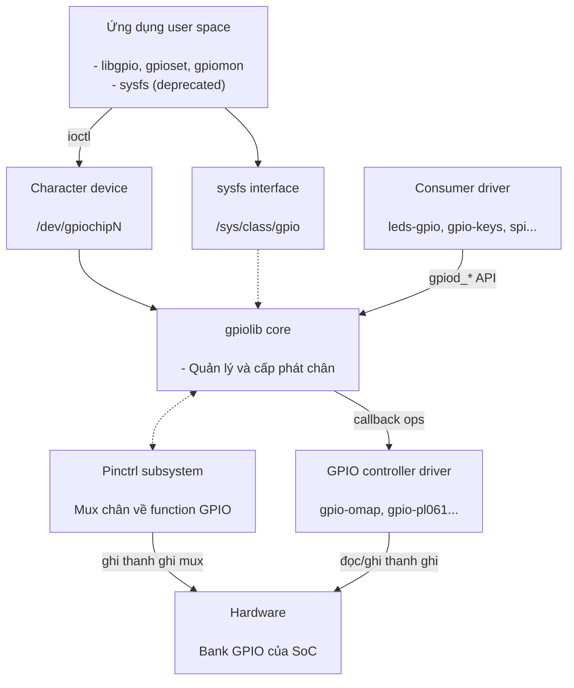
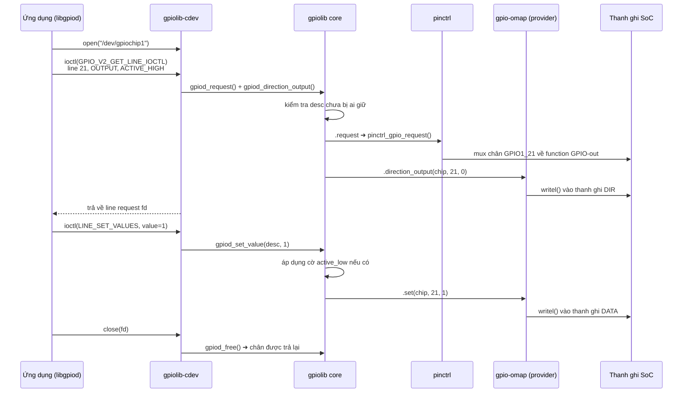

## 1. Mở đầu

GPIO là các chân số đa dụng của SoC, có thể cấu hình làm input hoặc output. Trên board nhúng, GPIO được dùng để điều khiển LED, đọc nút nhấn, reset thiết bị ngoại vi, chip-select cho SPI, nhận ngắt từ cảm biến...

Vấn đề: mỗi SoC có cách điều khiển GPIO khác nhau: thanh ghi khác nhau, số bank khác nhau,...Nếu mỗi driver tự truy cập thanh ghi thì:
- Không có sự thống nhất giữa các SoC.
- Không thể chia sẻ hoặc tránh xung đột khi hai driver cùng dùng một chân.
- Ứng dụng user space không có API chung.

GPIO subsystem (`drivers/gpio/`) ra đời để giải quyết: cung cấp một lớp trừu tượng chung, quản lý việc cấp phát chân và export API thống nhất cho cả kernel lẫn user.

## 2. Kiến trúc tổng thể

### 2.1. Mô hình thiết kế

GPIO subsystem được thiết kế theo mô hình **provider – core – consumer**:

- **Provider** là driver của GPIO controller trong SoC hoặc expanded chip I2C/SPI. Nó là nơi duy nhất được truy cập vào thanh ghi phần cứng.
- **Consumer** là bên request chân từ provider để dùng: có thể là driver khác trong kernel hoặc ứng dụng user space thông qua character device.
- Ở giữa là **core (gpiolib)**, nó không biết gì về thanh ghi cụ thể. Nó quản lý danh sách chip, cấp phát chân, chống xung đột và cung cấp một API thống nhất.

Kết quả là driver LED không cần quan tâm mình chạy trên AM335x hay STM32, còn người viết driver cho SoC mới cũng không cần đụng đến LED, nút nhấn hay SPI.



### 2.2. Quan hệ với pinctrl

GPIO và pinmux là hai phần khác nhau nhưng liên quan chặt chẽ:
- Pinctrl quyết định một chân vật lý hoạt động ở function nào (UART TX? I2C SDA? hay GPIO?) và các thuộc tính điện (pull-up/down, drive strength).
- GPIO chỉ điều khiển được chân khi pinctrl đã mux chân đó về function GPIO. Chân đang mux cho UART thì `gpioset` chạy vẫn thành công nhưng ngoài thực tế không có gì thay đổi - lỗi rất hay gặp khi debug.

Trên AM335x (BeagleBone Black), hai phần này là hai driver riêng: `gpio-omap.c` lo GPIO còn `pinctrl-single.c` lo pinmux. Nhiều SoC khác (Allwinner, STM32, i.MX...) lại gộp vào một driver duy nhất: vừa `gpiochip_add_data()` vừa `pinctrl_register()`. Cầu nối giữa hai bên là callback `.request` của `gpio_chip` $\rightarrow$ gọi `pinctrl_gpio_request()`.

:::warning Chú ý
GPIO chỉ điều khiển được chân khi pinctrl đã mux chân đó về function GPIO. Nếu chân đang được mux cho UART, mọi lệnh `gpioset` sẽ không có tác dụng ngoài thực tế dù kernel không báo lỗi rõ ràng.
:::

### 2.3. Tổ chức mã nguồn trong kernel

Toàn bộ subsystem nằm trong thư mục `drivers/gpio/`, cộng thêm vài header ở `include/`. Quy ước đặt tên rất dễ nhận ra: các file `gpiolib*` là phần core dùng chung, còn hàng trăm file `gpio-*.c` còn lại là driver controller của từng SoC.

```
linux/
├── drivers/
│   ├── gpio/
│   │   ├── gpiolib.c              # core: đăng ký chip, cấp phát chân, API gpiod_*
│   │   ├── gpiolib.h              # định nghĩa private của core
│   │   ├── gpiolib-devres.c       # các biến thể devm_*
│   │   ├── gpiolib-of.c           # parse Device Tree
│   │   ├── gpiolib-of.h
│   │   ├── gpiolib-acpi.c         # parse bảng ACPI
│   │   ├── gpiolib-acpi.h
│   │   ├── gpiolib-swnode.c       # parse software node
│   │   ├── gpiolib-swnode.h
│   │   ├── gpiolib-legacy.c       # API Integer-based cũ
│   │   ├── gpiolib-cdev.c         # Interface /dev/gpiochipN
│   │   ├── gpiolib-cdev.h
│   │   ├── gpiolib-sysfs.c        # Interface /sys/class/gpio (deprecated)
│   │   ├── gpiolib-sysfs.h
│   │   ├── gpio-mmio.c            # thư viện controller memory-mapped
│   │   ├── gpio-regmap.c          # thư viện controller qua regmap
│   │   ├── gpio-omap.c            # ─┐
│   │   ├── gpio-pl061.c           #  ├─ driver provider cho từng controller
│   │   ├── gpio-pca953x.c         # ─┘
│   │   ├── Kconfig
│   │   └── Makefile
│   └── pinctrl/
│       └── pinctrl-single.c       # pinmux của AM335x
└── include/
    ├── linux/
    │   ├── gpio/consumer.h
    │   ├── gpio/driver.h
    │   └── gpio.h
    └── uapi/linux/gpio.h
```

Ý nghĩa từng file và vị trí của nó trong kiến trúc:

| File | Thuộc tầng | Ý nghĩa |
| --- | --- | --- |
| `gpiolib.c` | Core | File chính của subsystem: đăng ký/gỡ gpiochip, cấp phát `gpio_desc`, request/free chân, xử lý active-low, cung cấp toàn bộ API `gpiod_*` |
| `gpiolib-devres.c` | Core | Các biến thể `devm_*`: tự động free chân khi driver unbind |
| `gpiolib-of.c` | Core | Parse Device Tree: đọc property `*-gpios`, lần theo phandle để biết chân thuộc gpiochip nào, offset bao nhiêu |
| `gpiolib-acpi.c` | Core | Tương tự nhưng cho firmware ACPI (thường gặp trên x86) |
| `gpiolib-swnode.c` | Core | Parse software node, dùng khi không có DT lẫn ACPI |
| `gpiolib-legacy.c` | Core | Cầu nối cho API Integer-based (`gpio_request`, `gpio_free`) |
| `gpiolib-cdev.c` | Interface user space | Cài đặt `/dev/gpiochipN`: các ioctl xin line, đọc/ghi giá trị, hàng đợi sự kiện cạnh |
| `gpiolib-sysfs.c` | Interface user space | Cài đặt `/sys/class/gpio` (deprecated), chỉ build khi bật `CONFIG_GPIO_SYSFS` |
| `gpio-*.c` | Provider | Driver cho từng controller: `gpio-omap.c` (AM335x trên BBB), `gpio-pl061.c`, `gpio-pca953x.c`... Mỗi file cài đặt một `struct gpio_chip` |
| `gpio-mmio.c` | Provider | Thư viện dùng chung cho các controller memory-mapped đơn giản, driver chỉ cần khai báo địa chỉ thanh ghi |
| `gpio-regmap.c` | Provider | Tương tự nhưng cho controller truy cập qua regmap (I2C/SPI expander) |

## 3. GPIO Provider

Provider là driver của GPIO controller. Công việc của nó gói gọn trong ba bước:
- Mô tả chip bằng `struct gpio_chip`
- Viết các callback đọc/ghi thanh ghi
- Đăng ký callback với gpiolib.

### 3.1. struct gpio_chip

Đây là interface mà driver controller phải cài đặt:

```c
struct gpio_chip {
    const char *label;
    struct device *parent;

    int  ngpio;          /* số chân của chip */
    int  base;           /* số hiệu global bắt đầu (legacy, nên để -1) */

    int  (*request)(struct gpio_chip *gc, unsigned offset);
    void (*free)(struct gpio_chip *gc, unsigned offset);

    int  (*get_direction)(struct gpio_chip *gc, unsigned offset);
    int  (*direction_input)(struct gpio_chip *gc, unsigned offset);
    int  (*direction_output)(struct gpio_chip *gc, unsigned offset, int value);

    int  (*get)(struct gpio_chip *gc, unsigned offset);
    void (*set)(struct gpio_chip *gc, unsigned offset, int value);

    int  (*set_config)(struct gpio_chip *gc, unsigned offset,
                       unsigned long config);   /* pull-up, open-drain… */

    int  (*to_irq)(struct gpio_chip *gc, unsigned offset);

    struct gpio_irq_chip irq;   /* nếu chip có khả năng gen interrupt */
};
```

Các trường mô tả chip:

| Trường | Ý nghĩa |
| --- | --- |
| `label` | Tên hiện trong `gpiodetect` và `/sys/kernel/debug/gpio`, ví dụ `gpio-32-63` của bank GPIO1 trên AM335x |
| `parent` | `struct device` của controller, dùng để core biết chip thuộc node DT nào |
| `ngpio` | Số chân của chip, quyết định kích thước mảng descriptor mà core cấp phát |
| `base` | Số toàn cục đầu tiên của chip. Để `-1` cho kernel tự cấp, chỉ set cứng khi phải giữ tương thích với sysfs cũ |
| `can_sleep` | Đặt `true` nếu thao tác chân phải đi qua bus chậm (I2C/SPI). Core dựa vào đây để chặn consumer gọi trong atomic context |
| `of_xlate` | Đổi các cell trong DT thành offset. Chỉ cần viết khi `#gpio-cells` khác chuẩn 2 cell |
| `irq` | Nhúng `struct gpio_irq_chip` khi chip có thể sinh ngắt, core sẽ tự dựng irq domain |

Các callback:

| Callback | Core gọi khi nào |
| --- | --- |
| `.get` / `.set` | Consumer đọc hoặc ghi giá trị chân |
| `.direction_input` / `.direction_output` | Lúc consumer request chân kèm flag hướng hoặc đổi hướng runtime |
| `.get_direction` | `gpioinfo` và debugfs cần biết chân đang là in hay out |
| `.request` / `.free` | Chân bắt đầu/kết thúc được sử dụng. Đây là chỗ gọi sang pinctrl để giữ chỗ |
| `.set_config` | Consumer yêu cầu pull-up/pull-down, open-drain, debounce |
| `.to_irq` | Consumer gọi `gpiod_to_irq()` để lấy số IRQ |

### 3.2. Cài đặt callback

Các callback nhận `struct gpio_chip *` và offset trong chip (`0..ngpio-1`), không bao giờ nhận số toàn cục. Dữ liệu riêng của driver lấy lại bằng `gpiochip_get_data()`:

```c
static int my_get(struct gpio_chip *gc, unsigned int offset)
{
    struct my_gpio *priv = gpiochip_get_data(gc);

    return !!(readl(priv->base + REG_DATAIN) & BIT(offset));
}

static void my_set(struct gpio_chip *gc, unsigned int offset, int value)
{
    struct my_gpio *priv = gpiochip_get_data(gc);

    writel(BIT(offset), priv->base + (value ? REG_SETDATAOUT : REG_CLEARDATAOUT));
}

static int my_direction_output(struct gpio_chip *gc, unsigned int offset, int value)
{
    struct my_gpio *priv = gpiochip_get_data(gc);
    unsigned long flags;
    u32 reg;

    my_set(gc, offset, value);          /* đặt level trước khi bật output */

    spin_lock_irqsave(&priv->lock, flags);
    reg = readl(priv->base + REG_OE);
    reg &= ~BIT(offset);                /* AM335x: bit = 0 nghĩa là output */
    writel(reg, priv->base + REG_OE);
    spin_unlock_irqrestore(&priv->lock, flags);

    return 0;
}
```

Thanh ghi direction dùng chung cho cả bank nên bắt buộc phải lock khi read-modify-write, nếu không hai driver cùng đổi hướng hai chân khác nhau sẽ ghi đè lẫn nhau.

### 3.3. Đăng ký với gpiolib

```c
static int my_gpio_probe(struct platform_device *pdev)
{
    struct my_gpio *priv;

    priv = devm_kzalloc(&pdev->dev, sizeof(*priv), GFP_KERNEL);
    if (!priv)
        return -ENOMEM;

    priv->base = devm_platform_ioremap_resource(pdev, 0);
    if (IS_ERR(priv->base))
        return PTR_ERR(priv->base);

    priv->gc.label            = "my-gpio";
    priv->gc.parent           = &pdev->dev;
    priv->gc.owner            = THIS_MODULE;
    priv->gc.base             = -1;     /* để kernel tự cấp số */
    priv->gc.ngpio            = 32;
    priv->gc.direction_input  = my_direction_input;
    priv->gc.direction_output = my_direction_output;
    priv->gc.get              = my_get;
    priv->gc.set              = my_set;

    return devm_gpiochip_add_data(&pdev->dev, &priv->gc, priv);
}
```

Tham số cuối của `devm_gpiochip_add_data()` chính là con trỏ mà `gpiochip_get_data()` trả về trong callback. Bản `devm_` tự gỡ chip khi driver unbind nên không cần `.remove`.

Mỗi `gpio_chip` được đăng ký sẽ tạo ra một node `/dev/gpiochipN` và một entry trong `/sys/bus/gpio/devices/`. Trên BBB có 4 bank nên có 4 node, từ `gpiochip0` đến `gpiochip3`.

:::note Offset và global number
Bên trong một chip, chân được đánh số `0..ngpio-1` (offset). Cách đánh số global (`base + offset`) là di sản của sysfs API cũ, đã deprecated. Code mới luôn làm việc với cặp `(gpiochip, offset)`: chân P9_12 của BBB là `(gpiochip1, 28)` chứ không phải "gpio60".
:::

## 4. GPIO core

### 4.1. Ba struct cần phân biệt

| Struct | Ý nghĩa | Ghi chú |
| --- | --- | --- |
| `struct gpio_chip` | Bảng vtable chứa các callback đến các hàm thao tác với GPIO controller của SoC | Driver provider khai báo |
| `struct gpio_device` | Phần kernel object của controller đó: device, danh sách descriptor, refcount, chardev | Tồn tại độc lập với `gpio_chip`, giúp core hoạt động ổn định khi driver bị gỡ giữa chừng |
| `struct gpio_desc` | Đại diện cho một chân cụ thể: cờ trạng thái (đang dùng/rảnh, hướng, active-low), tên consumer | gpiolib cấp phát mảng descriptor cho mỗi chip, consumer chỉ cầm con trỏ `gpio_desc *`, không bao giờ thấy số hiệu GPIO toàn cục |

### 4.2. Khi provider đăng ký chip

`gpiochip_add_data()` làm lần lượt:

1. Cấp phát `struct gpio_device`, gán ID để thành `gpiochipN`.
2. Cấp phát mảng `ngpio` descriptor, tất cả đánh dấu là chưa có chủ.
3. Tạo character device `/dev/gpiochipN` và entry trong sysfs.
4. Đưa chip vào danh sách toàn cục, đồng thời đăng ký với lớp Device Tree để các consumer tra phandle ra được chip này.
5. Quét các `gpio-hog` khai báo trong node của chip và giữ sẵn những chân đó.

### 4.3. Khi consumer request một chân

Ví dụ driver `leds-gpio` gọi `devm_gpiod_get(dev, "led", GPIOD_OUT_LOW)`:

1. Core đọc node DT của device, tìm property `led-gpios`.
2. `gpiolib-of.c` parse giá trị `<&gpio1 21 GPIO_ACTIVE_HIGH>`: lấy phandle, tra ra `gpio_device` của bank GPIO1.
3. Gọi `.of_xlate()` để đổi cell thành offset 21, đồng thời ghi nhận cờ active-high/active-low.
4. Lấy `gpio_desc` thứ 21 của chip đó, kiểm tra xem đã có ai giữ chưa. Nếu rồi thì trả `-EBUSY` ngay.
5. Đánh dấu descriptor là đã có chủ, lưu tên consumer, gọi `.request()` của provider (thường sẽ báo sang pinctrl).
6. Áp flag `GPIOD_OUT_LOW` bằng cách gọi `.direction_output()` với giá trị 0.
7. Trả về con trỏ `gpio_desc *` cho driver.

Từ đây driver chỉ cầm con trỏ đó, không biết và không cần biết chân thuộc chip nào.

## 5. GPIO Consumer

Consumer trong kernel có hai bộ API để xin và điều khiển chân: Integer-based (deprecated) và Descriptor-based (chuẩn hiện nay). Code mới chỉ dùng loại thứ hai, nhưng vẫn cần biết loại thứ nhất vì rất nhiều driver cũ và ví dụ trên mạng viết theo kiểu đó.

### 5.1. Integer-based API

API này ra đời trước, coi mỗi chân trong hệ thống là một số nguyên toàn cục, tính bằng `base` của chip cộng offset. Trên BBB, LED usr0 là chân 21 của bank GPIO1, mà bank này có `base = 32`, nên số của nó là 53.

```c
#include <linux/gpio.h>
#include <linux/of_gpio.h>

int gpio, irq, ret;

/* lấy số chân từ property led-gpios trong DT */
gpio = of_get_named_gpio(dev->of_node, "led-gpios", 0);
if (!gpio_is_valid(gpio))
    return -EINVAL;

ret = devm_gpio_request_one(dev, gpio, GPIOF_OUT_INIT_LOW, "led");
if (ret)
    return ret;

gpio_set_value(gpio, 1);
val = gpio_get_value(gpio);
irq = gpio_to_irq(gpio);

gpio_free(gpio);
```

| Hàm | Ý nghĩa |
| --- | --- |
| `gpio_is_valid(gpio)` | Kiểm tra chân có hợp lệ không |
| `gpio_request(gpio, label)` | Xin chân, `label` là tên consumer |
| `gpio_request_one(gpio, flags, label)` | Xin chân kèm đặt hướng luôn |
| `gpio_direction_input/output()` | Đổi hướng |
| `gpio_get_value()` / `gpio_set_value()` | Đọc/ghi mức điện áp |
| `gpio_to_irq(gpio)` | Đổi số chân thành số IRQ |
| `gpio_free(gpio)` | Trả chân |

Vấn đề của cách này:

- Số toàn cục không ổn định: Nó phụ thuộc `base` mà kernel cấp theo thứ tự probe. Thêm một GPIO expander qua I2C hoặc đổi phiên bản kernel là số có thể lệch. Driver nào hardcode số sẽ điều khiển nhầm chân.
- Driver phải tự xử lý active-low: Cờ `GPIO_ACTIVE_LOW` trong DT bị bỏ qua, muốn đúng thì tự đảo trong code.
- Không quản lý được nhóm chân và các bản `devm_` cũng không đầy đủ.

### 5.2. Descriptor-based API

Driver xin chân theo tên chức năng và nhận về một con trỏ `struct gpio_desc *`, bên trong nó đã có sẵn thông tin chân thuộc chip nào, offset bao nhiêu, active-high hay active-low.

```c
#include <linux/gpio/consumer.h>

struct gpio_desc *led;

/* led match với property led-gpios trong DT node của device */
led = devm_gpiod_get(dev, "led", GPIOD_OUT_LOW);
if (IS_ERR(led))
    return PTR_ERR(led);

gpiod_set_value(led, 1);
gpiod_set_raw_value(led, 1);      /* bỏ qua active-low, ghi thẳng mức điện */

val = gpiod_get_value(button);

irq = gpiod_to_irq(button);       /* lấy IRQ number để request_irq() */
```

| Hàm | Ý nghĩa |
| --- | --- |
| `devm_gpiod_get(dev, con_id, flags)` | Xin 1 chân, tự free khi driver unbind |
| `devm_gpiod_get_optional()` | Trả `NULL` nếu DT không khai báo (không coi là lỗi) |
| `devm_gpiod_get_index()` | Lấy phần tử thứ n khi property có nhiều chân |
| `devm_gpiod_get_array()` | Xin cả nhóm chân (`data-gpios` nhiều phần tử) |
| `gpiod_direction_input/output()` | Đổi hướng lúc runtime |
| `gpiod_get_value_cansleep()` | Bản dùng được khi chip nằm sau I2C/SPI (có thể ngủ) |
| `gpiod_set_raw_value()` | Ghi thẳng mức điện, bỏ qua cờ active-low |
| `gpiod_put()` | Trả chân, chỉ cần khi không dùng bản `devm_` |

**Quan trọng**: `gpiod_get_value()` chỉ được gọi trong atomic context nếu chip là memory-mapped. Với GPIO expander qua I2C/SPI (PCF8574, MCP23017...) phải dùng biến thể `_cansleep()`.

## 6. Khai báo trong Device Tree

Provider node phải có `gpio-controller` và `#gpio-cells`:

```dts
/* am33xx.dtsi - bank GPIO1 của AM335x */
gpio1: gpio@4804c000 {
    compatible = "ti,omap4-gpio";
    reg = <0x4804c000 0x1000>;
    gpio-controller;
    #gpio-cells = <2>;        /* <&gpio1 pin flags> */
    interrupt-controller;
    #interrupt-cells = <2>;
};
```

Consumer node tham chiếu tới:

```dts
/* am335x-bone-common.dtsi - 4 LED user trên BBB */
leds {
    compatible = "gpio-leds";

    led2 {
        label = "beaglebone:green:usr0";
        /* GPIO1_21, active high */
        gpios = <&gpio1 21 GPIO_ACTIVE_HIGH>;
        linux,default-trigger = "heartbeat";
        default-state = "off";
    };
};

my-device {
    compatible = "vendor,my-device";
    reset-gpios = <&gpio1 2 GPIO_ACTIVE_LOW>;
    irq-gpios   = <&gpio1 3 GPIO_ACTIVE_HIGH>;
};
```

Quy ước tên: property phải kết thúc bằng `-gpios` (hoặc `-gpio`), và `con_id` truyền vào `gpiod_get()` là phần đứng trước. Ví dụ `reset-gpios` → `gpiod_get(dev, "reset", ...)`. Nếu chỉ có property tên `gpios` thì truyền `con_id = NULL`.

Số cell (`#gpio-cells`) tuỳ SoC: AM335x và đa số SoC dùng 2 (`pin, flags`) vì mỗi bank là một node riêng (`gpio0`..`gpio3`); một số SoC như Allwinner gom mọi bank vào một node nên cần 3 (`bank, pin, flags`).

Flags thông dụng (`include/dt-bindings/gpio/gpio.h`): `GPIO_ACTIVE_HIGH`, `GPIO_ACTIVE_LOW`, `GPIO_OPEN_DRAIN`, `GPIO_PULL_UP`, `GPIO_PULL_DOWN`.

## 7. Interface phía user-space

Kernel mở GPIO ra ngoài bằng hai đường: sysfs (cũ, deprecated) và character device (hiện nay). Cả hai đều đi qua gpiolib nên tuân thủ cùng luật chống xung đột: chân đang bị driver kernel giữ thì user space không xin được, và ngược lại.

### 7.1. sysfs

Interface này làm việc theo số GPIO toàn cục. Muốn dùng một chân, ghi số của nó vào file `export`, kernel sẽ tạo ra thư mục `/sys/class/gpio/gpioN/` chứa các file điều khiển.

Bố cục thư mục:

```
/sys/class/gpio/
├── export              # ghi số chân vào đây để request chân
├── unexport            # ghi số chân vào đây để trả chân
├── gpiochip0/          # thư mục đặt tên theo base của chip, không theo /dev/gpiochipN
├── gpiochip32/
│   ├── base            # 32
│   ├── label           # gpio-32-63
│   └── ngpio           # 32
└── gpio60/             # xuất hiện sau khi export chân 60
    ├── direction
    ├── value
    ├── edge
    └── active_low
```

| File | Cách dùng |
| --- | --- |
| `export` / `unexport` | Ghi số toàn cục của chân để chiếm hoặc trả chân |
| `direction` | Ghi `in` hoặc `out`. Ghi thẳng `high`/`low` sẽ vừa đặt output vừa đặt mức. |
| `value` | Đọc hoặc ghi `0`/`1`. Với chân input, `poll()` trên file này để chờ sự kiện |
| `edge` | `none`, `rising`, `falling`, `both`. Phải đặt trước khi `poll()` |
| `active_low` | Ghi `1` thì mọi thao tác đọc/ghi qua `value` bị đảo mức |
| `gpiochipN/base`, `label`, `ngpio` | Thông tin chip, dùng để tính số toàn cục |

Tính số toàn cục trên BBB: mỗi bank 32 chân, `base` của bank GPIO1 là 32 nên chân P9_12 (GPIO1_28) có số 60. Kiểm tra lại bằng chính sysfs, để ý tên thư mục chip là `gpiochip<base>` chứ không phải `gpiochipN` như trong `/dev`:

```bash
$ cat /sys/class/gpio/gpiochip32/label
gpio-32-63
$ cat /sys/class/gpio/gpiochip32/ngpio
32
```

Điều khiển LED nối vào P9_12:

```bash
echo 60   > /sys/class/gpio/export          # chiếm chân, tạo /sys/class/gpio/gpio60/
echo out  > /sys/class/gpio/gpio60/direction
echo 1    > /sys/class/gpio/gpio60/value    # bật
echo 0    > /sys/class/gpio/gpio60/value    # tắt
echo 60   > /sys/class/gpio/unexport        # trả chân
```

Đọc nút nhấn nối vào P9_15 (GPIO1_16):

```bash
echo 48  > /sys/class/gpio/export
echo in  > /sys/class/gpio/gpio48/direction
cat /sys/class/gpio/gpio48/value            # đọc một lần
```

Chờ sự kiện cạnh thì phải đặt `edge` rồi `poll()` vì file `value` luôn sẵn sàng để đọc nên `select()`/`read()` thông thường không chặn được:

```bash
echo falling > /sys/class/gpio/gpio48/edge
```

```c
int fd = open("/sys/class/gpio/gpio48/value", O_RDONLY);
struct pollfd pfd = { .fd = fd, .events = POLLPRI | POLLERR };
char buf[8];

read(fd, buf, sizeof(buf));

while (1) {
    poll(&pfd, 1, -1);             /* POLLPRI báo có cạnh */
    lseek(fd, 0, SEEK_SET);        /* phải tua về đầu file trước mỗi lần đọc */
    read(fd, buf, sizeof(buf));
    printf("có cạnh, giá trị = %c\n", buf[0]);
}
```

Interface này đã bị deprecated từ kernel 4.8 và đang bị gỡ dần (cần bật `CONFIG_GPIO_SYSFS` mới có). Nhược điểm:

| Vấn đề | Mô tả |
| --- | --- |
| Global number không ổn định | Số hiệu thay đổi theo thứ tự probe, khác nhau giữa các phiên bản kernel |
| Không có ownership | Process chết → chân vẫn export, không ai dọn |
| Không atomic | Không set/get nhiều chân cùng lúc |
| Đọc interrupt vụng về | Phải `poll()` trên file `value` |
| Không có metadata | Không biết chân đang được ai dùng, tên là gì |

### 7.2. Character device

Từ kernel 4.8, mỗi gpiochip có một char device `/dev/gpiochipN`. Cách dùng khác hẳn sysfs: không ghi file text mà gọi `ioctl()` và chân được cấp qua một file descriptor riêng gọi là line request.

Trình tự luôn gồm bốn bước:

1. `open("/dev/gpiochipN")` để lấy fd của chip.
2. Truy vấn thông tin chip và line nếu cần.
3. Gọi `GPIO_V2_GET_LINE_IOCTL` để xin một hoặc nhiều chân, nhận về fd của line request.
4. Đọc/ghi giá trị hoặc chờ sự kiện trên fd đó, xong thì `close()`.

| ioctl | Gọi trên fd nào | Công dụng |
| --- | --- | --- |
| `GPIO_GET_CHIPINFO_IOCTL` | fd của chip | Lấy tên, label và số line của chip |
| `GPIO_V2_GET_LINEINFO_IOCTL` | fd của chip | Thông tin một line: tên, consumer đang giữ, hướng, các cờ |
| `GPIO_V2_GET_LINEINFO_WATCH_IOCTL` | fd của chip | Đăng ký theo dõi, có ai xin/trả line thì được báo |
| `GPIO_V2_GET_LINE_IOCTL` | fd của chip | Xin chân, trả về fd của line request |
| `GPIO_V2_LINE_GET_VALUES_IOCTL` | fd của line request | Đọc giá trị nhiều chân cùng lúc |
| `GPIO_V2_LINE_SET_VALUES_IOCTL` | fd của line request | Ghi giá trị nhiều chân cùng lúc |
| `GPIO_V2_LINE_SET_CONFIG_IOCTL` | fd của line request | Đổi cấu hình (hướng, bias, debounce) mà không cần xin lại chân |

Cấu hình chân nằm ở trường `config.flags` khi xin:

| Cờ | Ý nghĩa |
| --- | --- |
| `GPIO_V2_LINE_FLAG_INPUT` / `OUTPUT` | Hướng của chân |
| `GPIO_V2_LINE_FLAG_ACTIVE_LOW` | Đảo mức logic so với mức điện |
| `GPIO_V2_LINE_FLAG_BIAS_PULL_UP` / `PULL_DOWN` / `DISABLED` | Điện trở kéo |
| `GPIO_V2_LINE_FLAG_OPEN_DRAIN` / `OPEN_SOURCE` | Kiểu ngõ ra |
| `GPIO_V2_LINE_FLAG_EDGE_RISING` / `FALLING` | Bắt sự kiện cạnh, có thể đặt cả hai |

Bật LED ở P9_12 (`gpiochip1` line 28) bằng ioctl:

```c
#include <fcntl.h>
#include <linux/gpio.h>
#include <sys/ioctl.h>
#include <unistd.h>

int chip_fd = open("/dev/gpiochip1", O_RDWR);

struct gpiochip_info info;
ioctl(chip_fd, GPIO_GET_CHIPINFO_IOCTL, &info);
printf("%s: %u lines\n", info.label, info.lines);      /* gpio-32-63: 32 lines */

struct gpio_v2_line_request req = {
    .offsets   = { 28 },
    .num_lines = 1,
    .consumer  = "blinky",
    .config    = { .flags = GPIO_V2_LINE_FLAG_OUTPUT },
};
ioctl(chip_fd, GPIO_V2_GET_LINE_IOCTL, &req);          /* req.fd là fd của line request */

struct gpio_v2_line_values vals = {
    .mask = 1,      /* bit 0 ứng với offsets[0] */
    .bits = 1,      /* đặt mức 1 */
};
ioctl(req.fd, GPIO_V2_LINE_SET_VALUES_IOCTL, &vals);

sleep(2);
close(req.fd);      /* đóng fd là chân được trả lại ngay */
close(chip_fd);
```

Bắt sự kiện cạnh từ nút nhấn ở P9_15 (`gpiochip1` line 16). Không cần `poll()` như sysfs, chỉ cần `read()` trên fd của line request, kernel trả về từng struct sự kiện kèm timestamp:

```c
struct gpio_v2_line_request req = {
    .offsets   = { 16 },
    .num_lines = 1,
    .consumer  = "button",
    .config    = { .flags = GPIO_V2_LINE_FLAG_INPUT |
                            GPIO_V2_LINE_FLAG_EDGE_FALLING |
                            GPIO_V2_LINE_FLAG_BIAS_PULL_UP },
};
ioctl(chip_fd, GPIO_V2_GET_LINE_IOCTL, &req);

struct gpio_v2_line_event ev;
while (read(req.fd, &ev, sizeof(ev)) == sizeof(ev)) {
    printf("cạnh %s, timestamp %llu ns\n",
           ev.id == GPIO_V2_LINE_EVENT_FALLING_EDGE ? "xuống" : "lên",
           ev.timestamp_ns);
}
```

Vài điểm khiến interface này hơn hẳn sysfs:

| Điểm | Chi tiết |
| --- | --- |
| Ownership theo fd | Process chết thì fd đóng, chân tự được giải phóng, không còn cảnh chân kẹt như sysfs |
| Thao tác nhiều chân atomic | Một line request giữ tối đa 64 chân, `mask`/`bits` cho phép đọc hoặc ghi cả nhóm trong một lời gọi |
| Timestamp do kernel gắn | Sự kiện cạnh có mốc thời gian lấy ngay trong handler, chính xác hơn nhiều so với đo trong user space |
| Có metadata | Đọc được tên line, consumer đang giữ, hướng và cờ hiện tại của từng chân |
| Cấu hình đầy đủ | Bias, open-drain, debounce khai báo ngay lúc xin chân |

Có hai thế hệ ABI: v1 (kernel 4.8+, `gpiohandle_request` / `gpioevent_request`) và v2 (kernel 5.10+, `gpio_v2_line_request`). Code mới nên dùng v2. Toàn bộ struct và mã ioctl nằm trong `include/uapi/linux/gpio.h`.

Thao tác trực tiếp bằng ioctl khá dài dòng, thực tế nên dùng libgpiod ở phần sau, chỉ cần biết bên dưới nó gọi đúng những ioctl này.

## 8. Luồng đi của một thao tác

Ví dụ ứng dụng user-space bật một LED bằng `gpioset`:



### 8.1. Các tầng mà lời gọi đi qua

| Tầng | Chạy ở đâu | File | Nhiệm vụ trong luồng |
| --- | --- | --- | --- |
| Ứng dụng + libgpiod | User space | `gpioset`, `libgpiod.so` | Dịch ý định của người dùng thành struct ABI và lời gọi `ioctl()` |
| Syscall + VFS | Kernel | `fs/` | Chuyển ngữ cảnh sang kernel, tra fd ra `struct file`, gọi `.unlocked_ioctl` |
| Character device | Kernel | `gpiolib-cdev.c` | Kiểm tra tham số từ user space, tạo line request, dựng fd riêng cho chân |
| Core | Kernel | `gpiolib.c` | Chống xung đột, áp cờ active-low, gọi callback của provider |
| pinctrl | Kernel | `drivers/pinctrl/` | Giữ chỗ chân và mux về function GPIO |
| Provider | Kernel | `gpio-omap.c` | Đọc/ghi thanh ghi thật của bank GPIO |
| Phần cứng | - | - | Thanh ghi `OE`, `SETDATAOUT`, `CLEARDATAOUT` của bank GPIO1 |

### 8.2. Giai đoạn xin chân

Lệnh `gpioset -t0 -c gpiochip1 21=1` trước hết phải chiếm chân. Call chain đầy đủ:

```
gpioset
└─ gpiod_chip_open("/dev/gpiochip1")           libgpiod
   └─ open()                                   ← syscall, sang kernel
      └─ gpio_chrdev_open()                    gpiolib-cdev.c

└─ gpiod_chip_request_lines()                  libgpiod
   └─ ioctl(chip_fd, GPIO_V2_GET_LINE_IOCTL)   ← syscall, sang kernel
      └─ gpio_ioctl()                          gpiolib-cdev.c
         └─ linereq_create()
            ├─ gpiod_request_user_desc()       gpiolib.c
            │  └─ gpiod_request_commit()
            │     ├─ kiểm tra FLAG_REQUESTED   ← trùng chủ thì trả -EBUSY tại đây
            │     └─ gc->request()
            │        └─ gpiochip_generic_request()
            │           └─ pinctrl_gpio_request()        drivers/pinctrl/
            │              └─ mux chân về function GPIO
            ├─ gpiod_direction_output()        gpiolib.c
            │  └─ gc->direction_output()
            │     └─ omap_gpio_output()        gpio-omap.c
            │        └─ writel_relaxed() vào thanh ghi OE
            └─ anon_inode_getfd()              ← tạo fd riêng cho line request
```

Ba chỗ đáng chú ý:

- `-EBUSY` sinh ra ngay ở `gpiod_request_commit()`, trước khi chạm tới phần cứng. Đó là lý do chân đang bị `leds-gpio` giữ thì `gpioset` fail mà LED không hề nhấp nháy.
- `gc->request()` là móc nối duy nhất giữa GPIO và pinctrl. Provider nào không nối móc này thì chân vẫn ghi được thanh ghi GPIO nhưng pinmux không đổi.
- fd trả về không phải fd của chip mà là một anon inode riêng. Chính nó nắm quyền sở hữu chân, nên process chết là chân được trả.

### 8.3. Giai đoạn ghi giá trị

```
gpiod_line_request_set_value()                 libgpiod
└─ ioctl(line_fd, GPIO_V2_LINE_SET_VALUES_IOCTL)   ← syscall
   └─ linereq_ioctl()                          gpiolib-cdev.c
      └─ linereq_set_values()
         └─ gpiod_set_array_value_complex()    gpiolib.c
            ├─ áp cờ FLAG_ACTIVE_LOW cho từng desc
            └─ gc->set() / gc->set_multiple()
               └─ omap_gpio_set()              gpio-omap.c
                  └─ writel_relaxed() vào SETDATAOUT hoặc CLEARDATAOUT
```

Đường đọc giá trị đối xứng: `GPIO_V2_LINE_GET_VALUES_IOCTL` → `linereq_get_values()` → `gpiod_get_array_value_complex()` → `gc->get()` → `omap_gpio_get()` → `readl_relaxed()` thanh ghi `DATAIN`.

Hàm core dùng biến thể `_array_` vì ABI v2 cho phép đọc/ghi nhiều chân trong một lời gọi. Với chân đơn thì mảng chỉ có một phần tử.

### 8.4. Giai đoạn trả chân

```
close(line_fd)
└─ linereq_release()                           gpiolib-cdev.c
   └─ gpiod_free()                             gpiolib.c
      └─ gpiod_free_commit()
         ├─ xoá FLAG_REQUESTED, xoá label consumer
         └─ gc->free()
            └─ gpiochip_generic_free()
               └─ pinctrl_gpio_free()
```

Không cần ứng dụng làm gì thêm: kernel chạy đường này khi fd đóng, kể cả khi process bị kill. Đây chính là điểm sysfs không có, chân export xong mà process chết thì vẫn nằm đó.

### 8.5. Khi consumer là driver trong kernel

Luồng ngắn hơn hẳn vì bỏ được hai tầng trên cùng:

```
leds-gpio: devm_gpiod_get(dev, "led", GPIOD_OUT_LOW)
└─ gpiod_get_index()                           gpiolib.c
   ├─ of_find_gpio()                           gpiolib-of.c
   │  └─ parse "led-gpios" ➜ gpio_desc
   └─ gpiod_request() ➜ gc->request() ➜ pinctrl_gpio_request()

leds-gpio: gpiod_set_value(led, 1)
└─ gpiod_set_value_nocheck()                   gpiolib.c
   └─ gc->set() ➜ omap_gpio_set() ➜ writel_relaxed()
```

Phần từ `gpiolib.c` trở xuống giống hệt đường của user space. Khác biệt duy nhất là driver kernel lấy `gpio_desc` từ Device Tree, còn user space lấy theo cặp chip và offset qua ioctl.

:::note
Tên hàm trong các call chain trên bám theo mã nguồn kernel 6.x. Giữa các phiên bản, tên hàm nội bộ của `gpiolib-cdev.c` có thể lệch chút ít, nhưng trình tự các tầng thì không đổi.
:::

## 9. libgpiod

Viết ioctl rất dài dòng nên kernel community cung cấp libgpiod, thư viện C wrapper lại character device ABI, kèm một bộ công cụ dòng lệnh.

| Phiên bản | Ghi chú |
| --- | --- |
| libgpiod v1.x | API `gpiod_chip_open()`, `gpiod_line_request_output()`... Rất phổ biến, còn nhiều trên các distro cũ |
| libgpiod v2.x | Viết lại API quanh `line_request` + `line_config`, chỉ dùng ABI v2, cần kernel ≥ 5.10 |

Hai API không tương thích ngược. Kiểm tra phiên bản bằng `gpiodetect --version`.

### 9.1. Công cụ dòng lệnh

```bash
# Liệt kê các gpiochip trong hệ thống: AM335x có 4 bank, mỗi bank 32 chân
$ gpiodetect
gpiochip0 [gpio-0-31]   (32 lines)
gpiochip1 [gpio-32-63]  (32 lines)
gpiochip2 [gpio-64-95]  (32 lines)
gpiochip3 [gpio-96-127] (32 lines)

# Xem chi tiết từng line: tên, hướng, ai đang giữ
$ gpioinfo gpiochip1
gpiochip1 - 32 lines:
        line  21: unnamed "beaglebone:green:usr0" output active-high [used]
        ...
        line  28: unnamed  unused  input  active-high
        ...

# Đọc giá trị chân P9_12 (GPIO1_28)
$ gpioget gpiochip1 28            # v1
$ gpioget -c gpiochip1 28         # v2

# Ghi giá trị rồi giữ 2 giây (thoát là chân được release!)
$ gpioset -m time -s 2 gpiochip1 28=1     # v1
$ gpioset -t 2s -c gpiochip1 28=1         # v2

# Theo dõi sự kiện cạnh, ví dụ nút nhấn nối vào P9_15 (GPIO1_16)
$ gpiomon -f -n 5 gpiochip1 16            # v1: 5 sự kiện cạnh xuống
$ gpiomon -e falling -c gpiochip1 16      # v2
```

Hai điểm cần biết khi chạy trên BBB:
- Chân LED user (line 21..24 của gpiochip1) đã bị driver `leds-gpio` giữ nên `gpioset` sẽ báo `Device or resource busy`. Muốn thử thì dùng chân trống trên header P8/P9.
- `gpiofind` chỉ tra được khi Device Tree có khai báo `gpio-line-names`; DTS gốc của AM335x không có nên mọi line đều hiện `unnamed`.

Bẫy hay gặp: `gpioset` giải phóng chân ngay khi thoát, nên mức output trở về mặc định. Muốn giữ mức phải giữ tiến trình sống (`-m wait`, `-t 0`, hoặc viết chương trình C).

### 9.2. Lập trình C: libgpiod v1

```c
#include <gpiod.h>
#include <unistd.h>

int main(void)
{
    struct gpiod_chip *chip;
    struct gpiod_line *line;

    chip = gpiod_chip_open_by_name("gpiochip1");
    if (!chip)
        return 1;

    line = gpiod_chip_get_line(chip, 28);   /* P9_12 = GPIO1_28 */
    if (!line)
        goto close_chip;

    /* consumer name sẽ hiện lên trong gpioinfo */
    if (gpiod_line_request_output(line, "blinky", 0) < 0)
        goto close_chip;

    for (int i = 0; i < 10; i++) {
        gpiod_line_set_value(line, i & 1);
        sleep(1);
    }

    gpiod_line_release(line);
close_chip:
    gpiod_chip_close(chip);
    return 0;
}
```

Đọc input và chờ sự kiện:

```c
struct gpiod_line_event ev;
struct timespec ts = { 5, 0 };            /* timeout 5s */

gpiod_line_request_falling_edge_events(line, "button");

while (1) {
    int ret = gpiod_line_event_wait(line, &ts);
    if (ret < 0)  break;
    if (ret == 0) continue;               /* timeout */

    gpiod_line_event_read(line, &ev);
    printf("edge %s at %ld.%09ld\n",
           ev.event_type == GPIOD_LINE_EVENT_RISING_EDGE ? "rising" : "falling",
           ev.ts.tv_sec, ev.ts.tv_nsec);
}
```

### 9.3. Lập trình C: libgpiod v2

```c
#include <gpiod.h>
#include <unistd.h>

int main(void)
{
    struct gpiod_chip *chip;
    struct gpiod_line_settings *settings;
    struct gpiod_line_config *lcfg;
    struct gpiod_request_config *rcfg;
    struct gpiod_line_request *req;
    unsigned int offset = 28;    /* P9_12 = GPIO1_28 */

    chip = gpiod_chip_open("/dev/gpiochip1");

    settings = gpiod_line_settings_new();
    gpiod_line_settings_set_direction(settings, GPIOD_LINE_DIRECTION_OUTPUT);
    gpiod_line_settings_set_output_value(settings, GPIOD_LINE_VALUE_INACTIVE);

    lcfg = gpiod_line_config_new();
    gpiod_line_config_add_line_settings(lcfg, &offset, 1, settings);

    rcfg = gpiod_request_config_new();
    gpiod_request_config_set_consumer(rcfg, "blinky");

    req = gpiod_chip_request_lines(chip, rcfg, lcfg);

    for (int i = 0; i < 10; i++) {
        gpiod_line_request_set_value(req, offset,
              (i & 1) ? GPIOD_LINE_VALUE_ACTIVE : GPIOD_LINE_VALUE_INACTIVE);
        sleep(1);
    }

    gpiod_line_request_release(req);
    gpiod_request_config_free(rcfg);
    gpiod_line_config_free(lcfg);
    gpiod_line_settings_free(settings);
    gpiod_chip_close(chip);
    return 0;
}
```

Biên dịch:

```bash
gcc blinky.c -o blinky $(pkg-config --cflags --libs libgpiod)
```

Trên Yocto: thêm `libgpiod` (runtime), `libgpiod-dev` (header cho SDK), `libgpiod-tools` (các lệnh CLI). Recipe nằm ở `meta-openembedded/meta-oe/recipes-support/libgpiod/`.

### 9.4. Python

```bash
pip install gpiod        # binding chính thức, version bám theo thư viện C
```

```python
import gpiod
from gpiod.line import Direction, Value

with gpiod.request_lines(
    "/dev/gpiochip1",
    consumer="blinky",
    config={28: gpiod.LineSettings(direction=Direction.OUTPUT)},
) as request:
    request.set_value(28, Value.ACTIVE)
```

## 10. Cấu hình kernel

```
Device Drivers  --->
  [*] GPIO Support  (GPIOLIB)
      [*]   Character device (/dev/gpiochipN)  (GPIO_CDEV)
      [*]     Support GPIO ABI Version 1       (GPIO_CDEV_V1)
      [ ]   /sys/class/gpio (sysfs interface)  (GPIO_SYSFS)   ← deprecated
      Memory mapped GPIO drivers  --->
      I2C GPIO expanders  --->
      SPI GPIO expanders  --->
```

Driver consumer thường dùng:
- `CONFIG_LEDS_GPIO` — LED nối vào GPIO, xuất ra `/sys/class/leds/`.
- `CONFIG_KEYBOARD_GPIO` — nút nhấn → input event `/dev/input/eventN`.
- `CONFIG_GPIO_PCF857X`, `CONFIG_GPIO_MCP23S08` — GPIO expander qua I2C/SPI.

## 11. Debug

```bash
# Danh sách chip và chân đang được sử dụng (cần CONFIG_DEBUG_FS)
cat /sys/kernel/debug/gpio

# Thông tin theo device
ls /sys/bus/gpio/devices/

# Xem pinmux hiện tại: chân nào đang thuộc function nào
cat /sys/kernel/debug/pinctrl/*/pinmux-pins
cat /sys/kernel/debug/pinctrl/*/pins

# Xem DT mà kernel đang áp dụng
ls /proc/device-tree/
```

Các lỗi thường gặp:

| Triệu chứng | Nguyên nhân thường gặp |
| --- | --- |
| `gpiod_get()` trả `-ENOENT` | Sai tên property trong DT, hoặc thiếu hậu tố `-gpios` |
| `-EBUSY` / `Device or resource busy` | Chân đã bị driver khác giữ (xem cột `[used]` trong `gpioinfo`) |
| Ghi giá trị nhưng chân không đổi | pinctrl chưa mux chân về function GPIO |
| Mức logic bị ngược | Nhầm `GPIO_ACTIVE_LOW`, hoặc dùng `gpiod_set_raw_value()` |
| `gpioset` xong chân về mức cũ | Tiến trình thoát → line request bị release |

## Tham khảo

- `Documentation/driver-api/gpio/`: tài liệu kernel cho provider và consumer.
- `Documentation/devicetree/bindings/gpio/gpio.txt`: quy ước Device Tree.
- `include/linux/gpio/consumer.h`, `include/linux/gpio/driver.h`.
- `include/uapi/linux/gpio.h`: định nghĩa ABI của character device.
- https://git.kernel.org/pub/scm/libs/libgpiod/libgpiod.git: source libgpiod.
