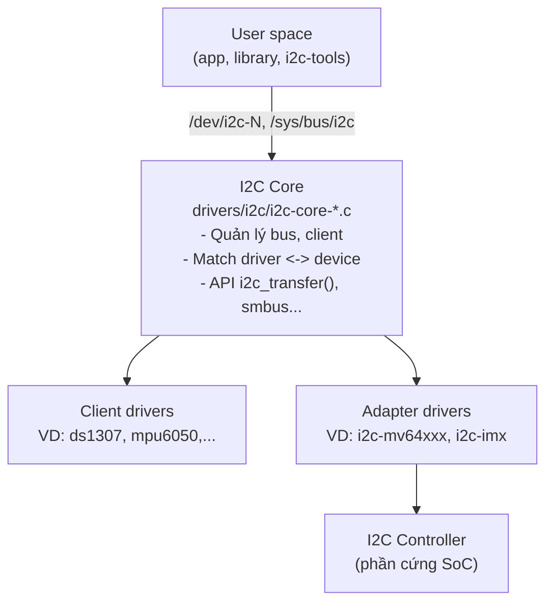

# I2C Subsystem

## 1. Giới thiệu

I2C là một chuẩn giao tiếp nối tiếp, đồng bộ, hai chiều, chỉ dùng 2 dây:

- SDA (Serial Data): đường truyền dữ liệu.
- SCL (Serial Clock): đường xung clock do master phát ra.

Đặc điểm chính:

- Kiểu master–slave: master điều khiển clock và khởi tạo transaction, slave phản hồi.
- Mỗi slave có một địa chỉ 7-bit (hoặc 10-bit) duy nhất trên bus.
- Là bus open-drain, cần điện trở pull-up trên SDA và SCL.
- Tốc độ phổ biến: 100 kHz (Standard), 400 kHz (Fast), 1 MHz (Fast+), 3.4 MHz (High-speed).

I2C thường được dùng để kết nối các cảm biến, EEPROM, RTC, PMIC, codec âm thanh... với SoC.

:::tip Master và Slave dưới góc nhìn Linux
Trong Linux kernel, phía master (thường là controller I2C tích hợp trong SoC) được gọi là adapter hoặc bus, còn phía slave (cảm biến, EEPROM...) được gọi là client.
:::

## 2. Kiến trúc I2C trong Linux kernel

I2C subsystem được thiết kế phân tầng để tách biệt phần controller khỏi phần driver của device. Nhờ đó một driver cảm biến có thể chạy trên bất kỳ SoC nào mà không cần biết controller I2C bên dưới là loại gì.



3 tầng chính:

| Tầng | Vai trò | Ai viết |
| --- | --- | --- |
| **I2C Core** | Khung xương chung: đăng ký bus, quản lý adapter/client, match driver, export API chung | Kernel |
| **Adapter driver** | Điều khiển controller I2C của SoC | Nhà sản xuất SoC |
| **Client driver**| Điều khiển một device cụ thể trên bus, dùng API của core để giao tiếp | Người viết driver thiết bị |

:::tip Ý nghĩa của phân tầng
Client driver (ví dụ cảm biển DS1307) không bao giờ truy cập trực tiếp vào thanh ghi của controller. Nó chỉ gọi `i2c_transfer()` / `i2c_smbus_*()`. Core sẽ định tuyến xuống đúng adapter driver. Nhờ vậy driver DS1307 chạy được trên STM32, Allwinner... mà không cần sửa gì.
:::

## 3. Các khái niệm cốt lõi

### 3.1. `struct i2c_adapter` — đại diện cho một bus

Mỗi controller I2C của SoC = một `i2c_adapter` = một bus (thường xuất hiện dưới dạng `/dev/i2c-0`, `/dev/i2c-1`...).

```c
struct i2c_adapter {
    struct module *owner;
    const struct i2c_algorithm *algo;  // cách truyền dữ liệu mức thấp
    void *algo_data;
    struct device dev;                 // gắn vào device model
    int nr;                            // số thứ tự bus (i2c-N)
    char name[48];
    ...
};
```

### 3.2. `struct i2c_algorithm` — cách nói chuyện với phần cứng

Đây là trái tim của adapter driver: nó định nghĩa cách thực hiện một giao dịch trên dây.

```c
struct i2c_algorithm {
    /* Thực hiện một chuỗi message I2C thô */
    int (*master_xfer)(struct i2c_adapter *adap,
                       struct i2c_msg *msgs, int num);
    /* (tùy chọn) hiện thực SMBus tối ưu bằng phần cứng */
    int (*smbus_xfer)(...);
    u32 (*functionality)(struct i2c_adapter *adap);
};
```

Adapter driver chỉ cần hiện thực `master_xfer()` là core có thể chạy mọi thứ bên trên.

### 3.3. `struct i2c_msg` — đơn vị giao dịch

Mọi trao đổi trên bus đều được biểu diễn bằng một mảng `i2c_msg`:

```c
struct i2c_msg {
    __u16 addr;    // địa chỉ slave 7-bit
    __u16 flags;   // 0 = ghi, I2C_M_RD = đọc
    __u16 len;     // số byte
    __u8  *buf;    // con trỏ buffer dữ liệu
};
```

Ví dụ đọc thanh ghi `0x00` của một cảm biến thì cần 2 message trong một transfer: ghi địa chỉ thanh ghi rồi đọc dữ liệu:

```c
u8 reg = 0x00, val;
struct i2c_msg msgs[2] = {
    { .addr = client->addr, .flags = 0,        .len = 1, .buf = &reg },
    { .addr = client->addr, .flags = I2C_M_RD, .len = 1, .buf = &val },
};
i2c_transfer(client->adapter, msgs, 2);
```

### 3.4. `struct i2c_client` — đại diện cho một chip trên bus

Mỗi thiết bị slave = một `i2c_client`. Nó biết mình nằm trên adapter nào và có địa chỉ gì.

```c
struct i2c_client {
    unsigned short flags;
    unsigned short addr;          // địa chỉ 7-bit của chip
    char name[I2C_NAME_SIZE];
    struct i2c_adapter *adapter;  // bus mà chip nằm trên đó
    struct device dev;
    ...
};
```

### 3.5. `struct i2c_driver` — driver cho một họ chip

```c
struct i2c_driver {
    int (*probe)(struct i2c_client *client);
    void (*remove)(struct i2c_client *client);
    struct device_driver driver;
    const struct i2c_device_id *id_table;  // match cổ điển
};
```

Tóm tắt:

| Struct | Là gì | Tương ứng phần cứng |
| --- | --- | --- |
| `i2c_adapter` | Một bus | Controller I2C của SoC |
| `i2c_algorithm` | Cách truyền mức thấp | Logic đọc/ghi thanh ghi controller |
| `i2c_client` | Một thiết bị slave | Con chip trên bus |
| `i2c_driver` | Driver cho một họ chip | (phần mềm) |
| `i2c_msg` | Một message | Một transaction đọc/ghi |

## 4. Cơ chế probe & matching

Bus I2C dùng device model của Linux: device (`i2c_client`) và driver (`i2c_driver`) được ghép nối bởi core khi match. Có nhiều cách match, xét theo thứ tự ưu tiên:

1. **Device Tree** (`of_match_table`): phổ biến nhất trên hệ thống nhúng.
2. **ACPI** (`acpi_match_table`): trên x86/laptop.
3. **id_table** (`i2c_device_id`): kiểu cổ điển, match theo tên.

Khi match thành công, core gọi hàm `probe()` của driver với `i2c_client` tương ứng.

### 4.1. Khai báo thiết bị qua Device Tree

Đây là cách chuẩn để báo cho kernel biết có con chip nào trên bus nào:

```dts
&i2c1 {                          // node controller I2C của SoC
    status = "okay";
    clock-frequency = <400000>;

    rtc@68 {                     // một client
        compatible = "dallas,ds1307";
        reg = <0x68>;            // địa chỉ I2C = 0x68
    };

    eeprom@50 {
        compatible = "atmel,24c256";
        reg = <0x50>;
    };
};
```

- `reg` chính là địa chỉ 7-bit của chip -> đi vào `client->addr`.
- `compatible` được so với `of_match_table` của driver để chọn driver.

### 4.2. Template một client driver đơn giản

```c
static int foo_probe(struct i2c_client *client)
{
    /* kiểm tra khả năng của bus nếu cần */
    if (!i2c_check_functionality(client->adapter, I2C_FUNC_I2C))
        return -EOPNOTSUPP;

    /* đọc/ghi chip qua các API smbus/transfer ... */
    dev_info(&client->dev, "probed at addr 0x%02x\n", client->addr);
    return 0;
}

static const struct of_device_id foo_of_match[] = {
    { .compatible = "vendor,foo" },
    { }
};
MODULE_DEVICE_TABLE(of, foo_of_match);

static struct i2c_driver foo_driver = {
    .driver = {
        .name           = "foo",
        .of_match_table = foo_of_match,
    },
    .probe  = foo_probe,
    .remove = foo_remove,
};
module_i2c_driver(foo_driver);   // macro tự sinh init/exit
```

## 5. API giao tiếp dữ liệu

I2C Core cung cấp 2 nhóm API cho client driver:

### 5.1. API low level

Cho phép gửi một chuỗi `i2c_msg` tùy ý, dùng khi cần điều khiển chính xác START/STOP/repeated-START.

```c
int i2c_transfer(struct i2c_adapter *adap, struct i2c_msg *msgs, int num);
int i2c_master_send(const struct i2c_client *client, const char *buf, int count);
int i2c_master_recv(const struct i2c_client *client, char *buf, int count);
```

### 5.2. API SMBus

SMBus là một tập con của I2C. Đa số chip đều theo mô hình thanh ghi, nên các hàm này rất tiện:

```c
s32 i2c_smbus_read_byte_data(client, u8 command);        // đọc 1 byte tại reg
s32 i2c_smbus_write_byte_data(client, u8 command, u8 value);
s32 i2c_smbus_read_word_data(client, u8 command);        // đọc 2 byte
s32 i2c_smbus_write_word_data(client, u8 command, u16 value);
s32 i2c_smbus_read_i2c_block_data(client, u8 command, u8 length, u8 *values);
```

:::tip Nên dùng cái nào?
- Chip theo mô hình thanh ghi đơn giản -> dùng SMBus cho gọn.
- Chip cần đọc/ghi khối lớn hoặc timing đặc biệt -> dùng `i2c_transfer` với mảng `i2c_msg`.
- Nếu adapter không hỗ trợ SMBus bằng phần cứng, Core sẽ tự giả lập SMBus bằng `i2c_transfer`, nên hầu như luôn dùng được.
:::

Có thể kiểm tra khả năng của bus:

```c
u32 func = i2c_get_functionality(adapter);
// I2C_FUNC_I2C, I2C_FUNC_SMBUS_BYTE_DATA, I2C_FUNC_SMBUS_WORD_DATA...
```

## 6. Sysfs của I2C

I2C subsystem phơi bày cấu trúc của nó qua sysfs tại `/sys/bus/i2c/`. Đây là nơi để quan sát và điều khiển bus từ user space.

### 6.1. Cấu trúc thư mục

```
/sys/bus/i2c/
├── devices/            # tất cả adapter và client hiện có
│   ├── i2c-0           # adapter (bus) số 0
│   ├── i2c-1
│   ├── 1-0068          # client: bus 1, địa chỉ 0x68
│   └── 1-0050          # client: bus 1, địa chỉ 0x50
├── drivers/            # các i2c_driver đã đăng ký
│   ├── ds1307/
│   └── at24/
├── drivers_probe
├── drivers_autoprobe
└── uevent
```

:::tip Quy ước tên
- Adapter hiển thị dạng `i2c-N` (N = số bus).
- Client hiển thị dạng `B-XXXX` với `B` là số bus và `XXXX` là địa chỉ 7-bit ở dạng hex 4 chữ số. Ví dụ `1-0068` = chip ở bus 1, địa chỉ `0x68`.
:::

### 6.2. Thuộc tính của adapter

Thư mục một adapter, ví dụ `/sys/bus/i2c/devices/i2c-1/`:

| File | Kiểu | Ý nghĩa |
| --- | --- | --- |
| `name` | R | Tên adapter (thường là tên controller SoC, ví dụ `mv64xxx_i2c`). `i2cdetect -l` lấy từ đây. |
| `new_device` | W | Tạo client thủ công. Ghi `<tên_chip> <địa_chỉ>`, ví dụ `echo ds1307 0x68`. |
| `delete_device` | W | Gỡ một client đã tạo qua `new_device`. Ghi địa chỉ, ví dụ `echo 0x68`. |
| `of_node` | symlink | Trỏ tới node Device Tree của controller (chỉ có khi khai báo bằng DT). |
| `device` | symlink | Trỏ ngược lên thiết bị cha (controller trong `/sys/devices/...`). |
| `subsystem` | symlink | Trỏ tới `/sys/bus/i2c`. |
| `i2c-dev/i2c-1/` | thư mục | Xuất hiện khi module `i2c-dev` được nạp, chứa `dev` (số major:minor của `/dev/i2c-1`). |

### 6.3. Thuộc tính của client

Thư mục một client, ví dụ `/sys/bus/i2c/devices/1-0068/`:

| File | Kiểu | Ý nghĩa |
| --- | --- | --- |
| `name` | đọc | Tên chip mà client mang (do DT/`new_device`/`id_table` đặt). |
| `driver` | symlink | Trỏ tới driver đang bind. **Không tồn tại nếu chưa bind** — đây là cách nhanh nhất để kiểm tra probe có thành công hay không. |
| `modalias` | đọc | Chuỗi để udev/kernel chọn module, ví dụ `i2c:ds1307` hoặc `of:N...Tdallas,ds1307`. |
| `uevent` | đọc/ghi | Đọc ra các biến môi trường (MODALIAS, OF_...); ghi `add`/`change` để phát lại uevent. |
| `of_node` | symlink | Trỏ tới node DT của chip (nếu khai báo bằng DT). |
| `power/` | thư mục | Điều khiển runtime PM của chip. |
| (tùy driver) | — | Các attribute riêng do client driver tạo. Ví dụ hwmon xuất `temp1_input`; nhiều driver còn đăng ký lên subsystem khác nên chip hiện ra ở `/sys/class/rtc/`, `/sys/class/leds/`... thay vì ở đây. |

### 6.4. Thuộc tính của driver

Mỗi `i2c_driver` đã đăng ký nằm ở `/sys/bus/i2c/drivers/<tên_driver>/`, ví dụ `/sys/bus/i2c/drivers/rtc-ds1307/`:

| File | Kiểu | Ý nghĩa |
| --- | --- | --- |
| `<B-XXXX>` | symlink | Mỗi client mà driver này đang điều khiển hiện ra một symlink (ví dụ `1-0068`). Đây là chiều ngược của `driver` bên client. |
| `bind` | ghi | Ghi tên một client (ví dụ `1-0068`) để **ép bind** driver này vào nó. |
| `unbind` | ghi | Ghi tên client để **gỡ bind** (gọi `remove()`) mà không xoá client. |
| `new_id` | ghi | Thêm động một cặp `<vendor> <device>` / tên để driver nhận thêm chip mới lúc chạy. |
| `uevent` | ghi | Phát lại uevent cho driver. |
| `module` | symlink | Trỏ tới `/sys/module/<tên>` của module chứa driver (nếu là module). |

Ngoài ra, ở cấp bus có 2 file điều khiển việc tự dò:

| File | Ý nghĩa |
| --- | --- |
| `/sys/bus/i2c/drivers_autoprobe` | `1` (mặc định) = tự động match & probe khi có device/driver mới; `0` = tắt. |
| `/sys/bus/i2c/drivers_probe` | Ghi tên một client để yêu cầu bus thử probe lại nó ngay. |

### 6.5. Thêm / gỡ thiết bị bằng thủ công

Rất hữu ích khi thử nghiệm một chip mà chưa khai báo trong DTS:

```bash
# Thêm chip ds1307 tại địa chỉ 0x68 trên bus 1
echo ds1307 0x68 > /sys/bus/i2c/devices/i2c-1/new_device

# Gỡ nó ra
echo 0x68 > /sys/bus/i2c/devices/i2c-1/delete_device
```

Sau khi `new_device` thì core sẽ tạo `i2c_client`, tìm driver phù hợp và gọi `probe()`.

## 7. Giao diện i2c-dev (`/dev/i2c-N`)

Sysfs cho ta *quan sát và quản lý* cấu trúc bus, nhưng để **đọc/ghi dữ liệu thực sự** với một chip từ user space, ta dùng module `i2c-dev`. Khi nạp (`modprobe i2c-dev`), nó tạo một character device cho mỗi adapter: `/dev/i2c-0`, `/dev/i2c-1`... Đây là cách một chương trình user space "trở thành master" trên bus.

:::tip Quan hệ giữa các thành phần
`i2c-dev` là một **client driver đặc biệt** không gắn với chip cụ thể nào — nó chỉ mở cửa cho user space nói chuyện với **mọi** địa chỉ trên adapter. Còn `i2c-tools` (mục 8) chỉ là bộ chương trình dòng lệnh gọi vào chính giao diện `/dev/i2c-N` này.
:::

### 7.1. Ba cách giao tiếp qua `/dev/i2c-N`

Sau khi `open("/dev/i2c-1", O_RDWR)`, có 3 cách gửi giao dịch:

| Cách | Cơ chế | Khi nào dùng |
| --- | --- | --- |
| `read()` / `write()` thường | Đọc/ghi thô một chiều tới địa chỉ đã chọn bằng `ioctl(I2C_SLAVE)` | Giao dịch đơn giản, một chiều |
| `ioctl(I2C_RDWR)` | Gửi mảng `i2c_msg` — tương đương `i2c_transfer()` trong kernel | Cần repeated-START, đọc/ghi liền mạch |
| `ioctl(I2C_SMBUS)` | Gọi một khuôn SMBus — tương đương `i2c_smbus_*()` | Chip theo mô hình thanh ghi |

### 7.2. Chọn địa chỉ slave rồi read/write thô

```c
int fd = open("/dev/i2c-1", O_RDWR);

/* Chọn địa chỉ chip (0x68). Dùng I2C_SLAVE_FORCE nếu địa chỉ đã bị kernel driver chiếm */
ioctl(fd, I2C_SLAVE, 0x68);

/* Ghi địa chỉ thanh ghi 0x00 rồi đọc 1 byte — LƯU Ý: đây là 2 giao dịch riêng,
   có STOP ở giữa, KHÔNG phải repeated-START */
u8 reg = 0x00, val;
write(fd, &reg, 1);
read(fd, &val, 1);

close(fd);
```

:::warning `write()` rồi `read()` không phải repeated-START
Hai lời gọi tách rời sẽ tạo START–...–STOP rồi START–...–STOP. Nhiều chip yêu cầu **repeated-START** (không có STOP ở giữa) để giữ "con trỏ thanh ghi". Với các chip đó phải dùng `I2C_RDWR` bên dưới.
:::

### 7.3. `I2C_RDWR` — tương đương `i2c_transfer()`

Đây là cách đúng để "ghi reg rồi đọc" trong một giao dịch liền mạch:

```c
u8 reg = 0x00, val;
struct i2c_msg msgs[2] = {
    { .addr = 0x68, .flags = 0,        .len = 1, .buf = &reg },
    { .addr = 0x68, .flags = I2C_M_RD, .len = 1, .buf = &val },
};
struct i2c_rdwr_ioctl_data xfer = { .msgs = msgs, .nmsgs = 2 };

ioctl(fd, I2C_RDWR, &xfer);   // core tự sinh repeated-START giữa 2 message
```

### 7.4. `I2C_SMBUS` — tương đương `i2c_smbus_*()`

Thay vì tự đóng gói `i2c_smbus_ioctl_data`, nên dùng các helper trong `<i2c/smbus.h>` (thư viện `libi2c`), mang đúng ngữ nghĩa và bẫy đã nói ở [mục 5.3](#53-api-smbus):

```c
#include <i2c/smbus.h>

s32 v = i2c_smbus_read_byte_data(fd, 0x00);   // tham số đầu là fd, không phải client
i2c_smbus_write_byte_data(fd, 0x00, 0x15);
```

:::tip Kiểm tra functionality trước
Y như trong kernel, adapter có thể không hỗ trợ đủ khuôn SMBus. Từ user space:
`ioctl(fd, I2C_FUNCS, &funcs)` rồi kiểm tra bit `I2C_FUNC_SMBUS_*` / `I2C_FUNC_I2C`.
:::

## 8. Userspace tool

`i2c-tools` là bộ chương trình dòng lệnh gói sẵn giao diện `/dev/i2c-N`, rất tiện để dò và thử chip mà không cần viết code. Cài bằng `apt install i2c-tools`. Các lệnh chính:

| Lệnh | Công dụng |
| --- | --- |
| `i2cdetect` | Liệt kê bus / quét địa chỉ trên một bus |
| `i2cget` | Đọc từ một thanh ghi |
| `i2cset` | Ghi vào một thanh ghi |
| `i2cdump` | Dump toàn bộ vùng thanh ghi |
| `i2ctransfer` | Gửi giao dịch `i2c_msg` thô tùy ý (mạnh nhất) |

:::tip Ý nghĩa cờ `-y`
Mặc định các lệnh ghi/đọc sẽ hỏi xác nhận vì có thể gây hại. Cờ `-y` bỏ qua câu hỏi (dùng trong script). Cờ `-f` (force) truy cập cả địa chỉ đang bị kernel driver chiếm (nguy hiểm, chỉ dùng khi biết chắc).
:::

### 8.1. `i2cdetect`

```bash
# Liệt kê tất cả bus I2C (số bus + tên adapter, lấy từ sysfs 'name')
i2cdetect -l

# Quét toàn bộ địa chỉ trên bus 1
i2cdetect -y 1

# Xem adapter hỗ trợ những khuôn SMBus/I2C nào (đọc I2C_FUNCS)
i2cdetect -F 1
```

Bảng kết quả `i2cdetect -y 1` đọc như sau:

- `--` : không có gì trả lời ở địa chỉ đó.
- một số hex (ví dụ `68`) : có chip trả lời ở địa chỉ đó.
- `UU` : địa chỉ đang bị một kernel driver chiếm (probe thành công) nên `i2cdetect` bỏ qua, không dò. Đây là dấu hiệu tốt: chip đã có driver.

:::warning `i2cdetect` quét bằng cách gửi lệnh thật
Việc quét sẽ ghi/đọc thử lên từng địa chỉ. Một vài chip "nhạy" (ví dụ chip có thanh ghi tự tăng, hoặc write-only) có thể bị đổi trạng thái chỉ vì bị quét. Có thể chọn chế độ dò an toàn hơn bằng đối số phạm vi, ví dụ `i2cdetect -y -r 1` (dùng SMBus read byte) hoặc `-q` (quick write).
:::

### 8.2. `i2cget`

```bash
# Đọc 1 byte tại thanh ghi 0x00 của chip 0x68 trên bus 1
i2cget -y 1 0x68 0x00

# Chỉ định kiểu đọc bằng tham số cuối (mode):
i2cget -y 1 0x68 0x00 b   # byte data (mặc định)
i2cget -y 1 0x68 0x00 w   # word data (2 byte, little-endian — xem bẫy ở mục 5.3)
i2cget -y 1 0x68 0x00 c   # 'byte' không command: đọc 1 byte trần
```

### 8.3. `i2cset`

```bash
# Ghi 0x15 vào thanh ghi 0x00 (byte data)
i2cset -y 1 0x68 0x00 0x15

# Ghi word (2 byte)
i2cset -y 1 0x68 0x00 0x1234 w

# Ghi khối nhiều byte liên tiếp từ reg 0x00 (i2c block)
i2cset -y 1 0x68 0x00 0x11 0x22 0x33 i
```

### 8.4. `i2cdump`

```bash
# Dump 256 thanh ghi của chip 0x68 — dạng bảng hex + ASCII
i2cdump -y 1 0x68

# Giới hạn phạm vi và chọn mode
i2cdump -y -r 0x00-0x0f 1 0x68 b
```

### 8.5. `i2ctransfer`

Khi chip có địa chỉ thanh ghi 16-bit hoặc cần repeated-START mà `i2cget/i2cset` không làm được, dùng `i2ctransfer`. Nó ánh xạ trực tiếp sang mảng `i2c_msg` (`w` = write, `r` = read, kèm số byte):

```bash
# Ghi reg 0x0000 (2 byte địa chỉ) rồi đọc 4 byte, TRONG MỘT giao dịch (repeated-START)
i2ctransfer -y 1 w2@0x50 0x00 0x00 r4

# Đọc thẳng 8 byte từ chip 0x68 (không gửi command)
i2ctransfer -y 1 r8@0x68
```

`w2@0x50` = ghi 2 byte tới địa chỉ 0x50; `r4` = đọc 4 byte (dùng lại địa chỉ trước đó với repeated-START).

:::warning Cẩn thận khi ghi
`i2cset`, `i2ctransfer` (phần `w`) ghi trực tiếp lên chip. Ghi sai thanh ghi có thể làm chip hoạt động sai hoặc hỏng cấu hình vĩnh viễn. Chỉ thao tác khi đã đối chiếu datasheet.
:::

:::tip Xung đột với kernel driver
Nếu một chip đã được kernel driver quản lý (có symlink `driver` trong sysfs, và hiện `UU` trong `i2cdetect`), truy cập nó qua `/dev/i2c-N` sẽ bị từ chối, trừ khi ép bằng cờ `-f`. Ép truy cập song song với driver có thể gây tranh chấp và dữ liệu sai. Nên thao tác thủ công chỉ với các địa chỉ **chưa** có driver.
:::

## 9. Tổng kết luồng hoạt động

Ví dụ luồng đầy đủ khi hệ thống có một RTC DS1307 trên bus 1:

1. Device Tree khai báo `rtc@68 { compatible = "dallas,ds1307"; reg = <0x68>; }` dưới node `&i2c1`.
2. I2C core tạo `i2c_adapter` cho controller.
3. Core tạo `i2c_client` cho `rtc@68`, thấy sysfs hiển thị `1-0068`.
4. Core so `compatible` với `of_match_table` của các driver $\rightarrow$ match driver `rtc-ds1307`.
5. Core gọi `probe()` của driver $\rightarrow$ driver dùng `i2c_smbus_*()` để đọc/ghi chip.
6. Driver đăng ký thiết bị lên tầng RTC $\rightarrow$ xuất hiện `/dev/rtc0`, `/sys/class/rtc/rtc0`.
7. Khi driver cần đọc giờ: gọi `i2c_transfer()` $\rightarrow$ Core $\rightarrow$ `master_xfer()` của adapter $\rightarrow$ controller phát tín hiệu trên SDA/SCL.

Nhìn từ dưới lên: **phần cứng $\rightarrow$ adapter driver $\rightarrow$ I2C Core $\rightarrow$ client driver $\rightarrow$ subsystem tương ứng $\rightarrow$ user space**.
