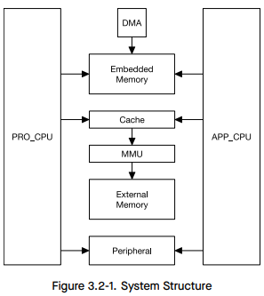
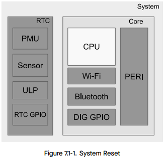
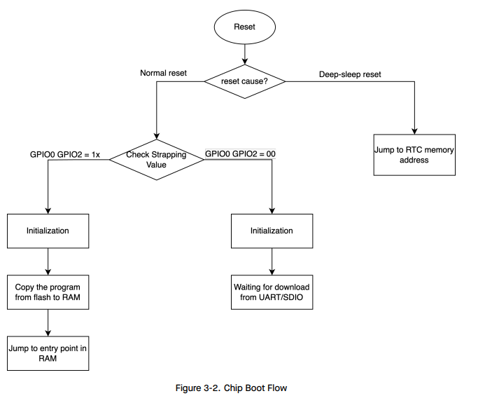

# Overview

## Đặc điểm

- ESP32 có 2 core là PRO_CPU và APP_CPU, viết tắt của protocol và application.
- Mỗi core sử dụng CPU low power Xtensa 32 bit LX6 với kiến trúc Harvard.
- Clock: up to 240MHz
- RAM: 520KB
- Flash nội: 448KB
- Flash ngoài: 4MB



ESP32 có 3 cấp độ reset: CPU reset, Core reset, System reset.
- CPU reset: reset một hoặc cả hai CPU core.
- Core reset: reset cả hai CPU core, nhưng RTC không reset.
- System reset: reset cả hai CPU core và RTC.



## Strapping pin

Strapping pin là những chân GPIO đặc biệt, được đọc khi ESP32 reset để xác định một số chế độ hoạt động ban đầu như:
- Boot mode: SPI flash boot hay UART download
- Tần số clock
- Điện áp flash
- Tùy chọn debug

Cách hoạt động:
- Khi ESP32 reset, Boot ROM sẽ đọc mức logic trên các chân Strapping.
- Dựa trên mức này, hệ thống sẽ thiết lập cấu hình tương ứng.
- Sau khi boot xong, các chân này có thể được sử dụng như GPIO bình thường.

**Một số strapping pin quan trọng**

| Pin     | Mục đích khi khởi động |
|---------|------------------------|
| GPIO0   | Chọn boot mode <br> `0` → UART Download mode <br> `1` → SPI Flash bootloader |
| GPIO2   | Phải là mức Low để boot từ flash (tùy flash) |
| GPIO5   | Chọn tần số SPI Flash (default 40 MHz) |
| GPIO12  | Chọn điện áp hoạt động của flash VDD_SDIO <br> `0` → 3.3V <br> `1` → 1.8V |

## Boot process

### Boot rom

Firmware được nạp sẵn trong ROM của ESP32 và không thể sửa đổi. Nó được chạy ngay khi reset và tuỳ thuộc vào reset reason mà có cách thức xử lý khác nhau:
- Reset khi power on sequence, software system reset và watchdog system reset: Thực hiện kiểm tra chân strapping pin GPIO0:
  - Nếu GPIO0 = LOW ➜ vào chế độ UART Download Mode để nạp firmware qua UART.
  - Nếu GPIO0 = HIGH ➜ thực hiện load second bootloader trong external flash tại offset 0x1000 lên RAM.
- Reset khi software CPU reset và watchdog CPU reset: cấu hình SPI flash dựa trên giá trị efuse.
- Reset khi deep sleep



### Second Stage Bootloader

Đây là bootloader được load từ flash bắt đầu từ offset 0x1000. Source của Second Stage Bootloader nằm tại thư mục `components/bootloader` của ESP-IDF.

*Nếu Secure boot được sử dụng thì 4KB sector đầu tiên của flash được sử dụng để lưu secure boot và digest của bootloader image. Ngược lại, thì sector này không được sử dụng.*

Bootloader này thực hiện:
- Khởi tạo flash và SPI driver
- Đọc partition table từ flash tại offset 0x8000.
- Xác định phân vùng application firmware cần được load dựa vào partition table.
- Verify application firmware nếu bật Secure boot.
- Tiến hành load các segment trong firmware vào RAM (IRAM/DRAM).
  + IRAM: Chứa mã chương trình
  + DRAM: Chứa dữ liệu khởi tạo và chưa khởi tạo.
- Nhảy tới entry point của application.

**Partition table**

Partition table là một bảng mô tả cách bố trí vùng nhớ trong flash. Nó cho biết mỗi phân vùng nằm tại offset bao nhiêu trong flash, chứa cái gì (app, dữ liệu, NVS, OTA…), dung lượng bao nhiêu và các thuộc tính bảo mật của nó.

=> Bảng này có tác dụng quản lý nhiều phân vùng firmware, từ đó có thể chuyển đổi qua lại. Ngoài ra, nó cũng lưu dữ liệu liên quan đến cấu hình người dùng, dump crash và hệ thống file.

**Parse partition table sau khi build**

Sau khi chạy `idf.py build`, một file binary partition table sẽ được tạo ra:

```bash
build/partition_table/partition-table.bin
```

**Dùng tool sau để parse dữ liệu**

```bash
python $IDF_PATH/components/partition_table/gen_esp32part.py build/partition_table/partition-table.bin
```

Ví dụ nội dung của partition table:

```
# Name,     Type, SubType, Offset,  Size
nvs,        data, nvs,     0x9000,  0x6000
otadata,    data, ota,     0xf000,  0x2000
phy_init,   data, phy,     0x10000, 0x1000
factory,    app,  factory, 0x10000, 1M
ota_0,      app,  ota_0,   0x110000,1M
ota_1,      app,  ota_1,   0x210000,1M
spiffs,     data, spiffs,  0x310000,1M
```

### Application Starup

Application Starup thực hiện một số khởi tạo trước khi hàm `app_main` bắt đầu chạy. Điều này chia thành ba giai đoạn:

- Khởi tạo port: Chạy hàm `call_start_cpu0` nằm trong file `$IDF_PATH/components/esp_system/port/cpu_start.c`.
- Khởi tạo system: Chạy hàm `start_cpu0`, mặc định hàm này được ghi đè bởi hàm `start_cpu0_default` nằm trong file `$IDF_PATH/components/esp_system/startup.c`.
- Chạy `main_task` và gọi `app_main`.

## Một số lệnh thường dùng

**Chỉnh thông số của project (bộ nhớ flash, tốc độ, GPIO,...)**

```bash
idf.py menuconfig
```

**Clean project**

```bash
idf.py fullclean
```

**Build project**

```bash
idf.py build
```

Lệnh này tạo ra folder `build\` chứa các file bin:
- `bootloader.bin`
- `partition_table.bin`
- `your_project.bin`

**Nạp firmware**

```bash
idf.py -p COMx flash
```

- `-p COMx`: Thay bằng cổng serial, ví dụ COM3 trên Windows hoặc /dev/ttyUSB0 trên Linux.

**Mở terminal để đọc log**

```bash
idf.py -p COMx monitor
```

**Nạp firmware và mở terminal để đọc log**

```bash
idf.py -p COM5 flash monitor
```

**Tạo project mới**

```bash
idf.py create-project -p <name>
```

## Tài liệu tham khảo

https://www.espressif.com/sites/default/files/documentation/esp32_datasheet_en.pdf

https://www.espressif.com/sites/default/files/documentation/esp32_technical_reference_manual_en.pdf 

https://docs.espressif.com/projects/esp-idf/en/stable/esp32/api-reference/index.html