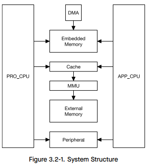
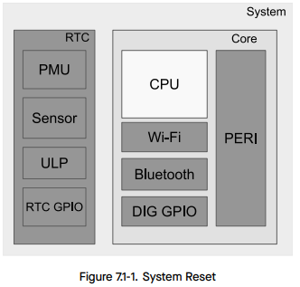
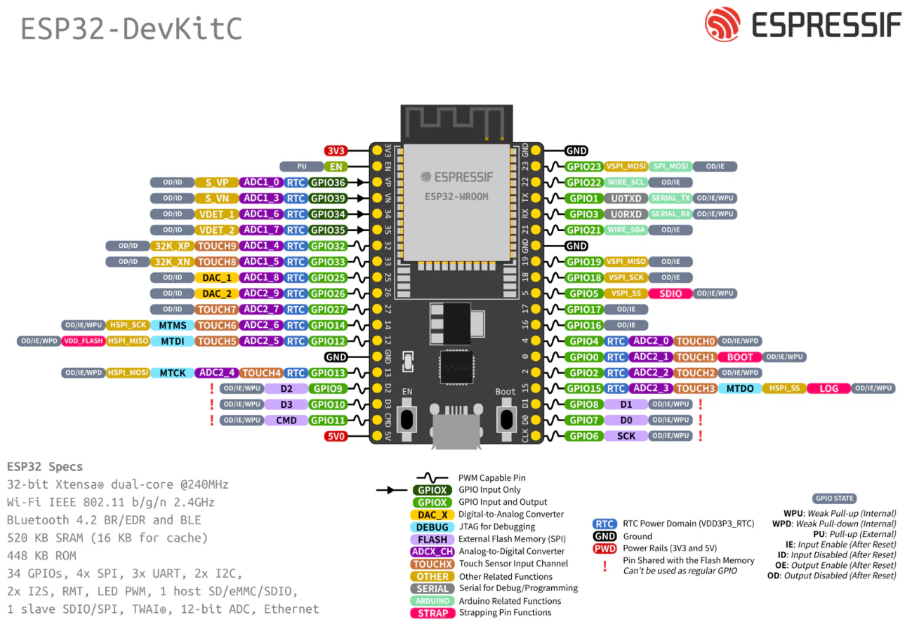
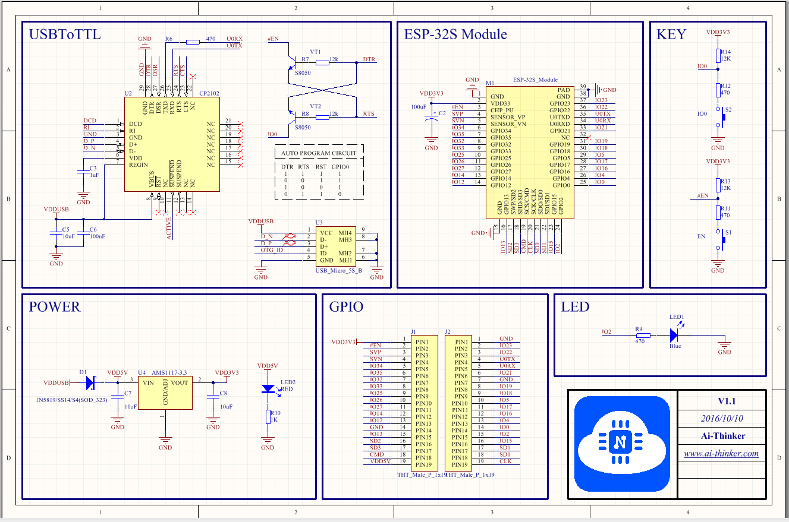
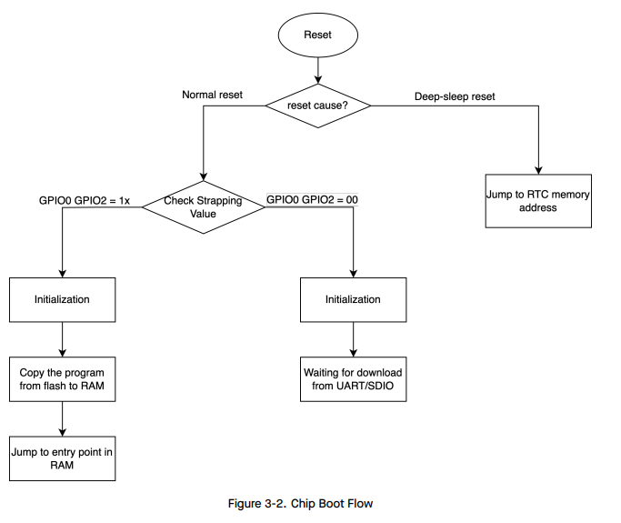

## Mục lục

- [Đặc điểm](#1-đặc-điểm)
- [ESP32 pinout](#2-esp32-pinout)
- [ESP32 schematic](#3-esp32-schematic)
- [Strapping pin](#4-strapping-pin)
- [GPIO matrix](#5-gpio-matrix)
- [Boot process](#6-boot-process)
  - [Boot rom](#61-boot-rom)
  - [Second stage bootloader](#62-second-stage-bootloader)
  - [Application startup](#63-application-starup)
- [Một số lệnh thường dùng](#7-một-số-lệnh-thường-dùng)

## 1. Đặc điểm

- ESP32 có 2 core là PRO_CPU và APP_CPU, viết tắt của protocol và application.
- Mỗi core sử dụng CPU low power Xtensa 32 bit LX6 với kiến trúc Harvard.
- Clock: up to 240MHz
- RAM: 520KB
- Flash nội: 448KB
- Flash ngoài: 4MB



ESP32 có 3 cấp độ reset: CPU reset, Core reset, System reset.
- CPU reset: reset một hoặc cả hai CPU core.
- Core reset: reset cả hai CPU core, nhưng RTC không reset.
- System reset: reset cả hai CPU core và RTC.



## 2. ESP32 pinout



## 3. ESP32 schematic



## 4. Strapping pin

Strapping pin là những chân GPIO đặc biệt, được đọc khi ESP32 reset để xác định một số chế độ hoạt động ban đầu như:
- Boot mode: SPI flash boot hay UART download
- Tần số clock
- Điện áp flash
- Tùy chọn debug

Cách hoạt động:
- Khi ESP32 reset, Boot ROM sẽ đọc mức logic trên các chân Strapping.
- Dựa trên mức này, hệ thống sẽ thiết lập cấu hình tương ứng.
- Sau khi boot xong, các chân này có thể được sử dụng như GPIO bình thường.

**Một số strapping pin quan trọng**

| Pin     | Mục đích khi khởi động |
|---------|------------------------|
| GPIO0   | Chọn boot mode <br> `0` → UART Download mode <br> `1` → SPI Flash bootloader |
| GPIO2   | Phải là mức Low để boot từ flash (tùy flash) |
| GPIO5   | Chọn tần số SPI Flash (default 40 MHz) |
| GPIO12  | Chọn điện áp hoạt động của flash VDD_SDIO <br> `0` → 3.3V <br> `1` → 1.8V |

## 5. GPIO Matrix

Với các vi điều khiển họ stm32 thì ta đã quen với việc sử dụng pinmuxing để thực hiện một alternate function cho các chân GPIO.

Ví dụ hai chân pin của vi điều khiển stm32 như sau:

```
PB6  -> I2C1_SCL / TIM4_CH1 / USART1_TX
PB7  -> I2C1_SDA / TIM4_CH2 / USART1_RX
```

Ta có thể thấy mỗi pin sẽ có chức năng cố định. Khi ta muốn sử dụng ngoại vi `i2c1` thì ta bắt buộc phải cấu hình alternate function cho hai chân pin `PB6` và `PB7` thành i2c.

Giả sử nếu hai chân pin này gặp vấn đề như bị gãy hoặc gặp vấn đề khi đi dây mạch PCH thì đây là một vấn đế rất khó giải quyết.

-> ESP32 giải quyết vấn đề này bằng cách sử dụng một phương pháp khác để thực hiện alternate function cho các chân pin được gọi là GPIO matrix.

GPIO Matrix là một kiến trúc phần cứng nội bộ cho phép ta có thể route các tín hiệu từ các ngoại vi bên trong như UART, SPI, PWM, I2C,... ra hầu hết các chân pin vật lý bên ngoài, thay vì bị cố định vào các chân cụ thể như các dòng vi điều khiển truyền thống, ví dụ như stm32 đã nói ở trên.

Ta có thể hiểu đơn giản là GPIO matix sẽ nằm ở giữa tín hiệu ngoại vi và chân vật lý.
- Chiều Output: Bất kỳ tín hiệu đầu ra nào từ ngoại vi (ví dụ: U0TXD - tín hiệu truyền của UART0) có thể được định tuyến qua matrix để đi ra bất kỳ chân GPIO nào (ví dụ: GPIO 4, GPIO 16, v.v.).
- Chiều Input: Bất kỳ chân GPIO nào cũng có thể được định tuyến qua matrix để đi vào một ngoại vi (ví dụ: chân GPIO 15 có thể được nối vào tín hiệu U0RXD của bộ UART).

Ngoài ra, GPIO maxtrix còn có các chức năng đặc biệt:
- Một ra nhiều: Một tín hiệu ngoại vi có thể được xuất ra nhiều chân GPIO cùng một lúc.
- Nhiều vào một: Ta có thể cấu hình để tín hiệu đầu vào của ngoại vi là kết quả logic của nhiều chân GPIO.
- Đảo ngược mức logic: Cho phép ta đảo ngược tín hiệu (invert) ngay trong phần cứng mà không cần tốn chu kỳ CPU để xử lý code (ví dụ: biến tín hiệu active High thành active Low).

Không phải chân pin nào cũng có thể sử dụng GPIO Matrix:
- ADC/DAC: GPIO Matrix là một hệ thống định tuyến tín hiệu digital. Nó không thể định tuyến tín hiệu analog, cho nên ta phải dùng đúng các chân ADC.
- Touch Sensor: Giống như analog, chức năng cảm ứng điện dung dựa trên mạch vật lý cụ thể tại chân đó. Ta không thể định tuyến chức năng cảm ứng này sang một chân khác qua GPIO Matrix.
- Ethernet/SDIO/SPI: Đối với các giao tiếp yêu cầu tốc độ cực cao và timing khắt khe như ethernet MAC hoặc SDIO, việc đi qua GPIO Matrix sẽ gây ra độ trễ không mong muốn
- Input only: Đây là các chân pin	chỉ nhận input: GPIO 34 đến 39 trên ESP32 thường không có mạch điều khiển đầu ra, nên không thể gán tín hiệu output của matrix vào đây.
- Các chân flash SPI: Mặc dù về lý thuyết, các chân này có kết nối với GPIO Matrix, nhưng trong thực tế ta không nên sử dụng chúng. Đây là các chân kết nối với bộ nhớ flash của ESP32. Nếu ta cố tình cấu hình lại các chân này qua matrix, ESP32 sẽ bị mất kết nối với bộ nhớ và crash ngay lập tức: GPIO 6 đến 11.
- RTC gpio: Khi ESP32 đi vào chế độ deep sleep, GPIO matrix sẽ bị tắt nguồn. Chỉ có phần RTC controller là còn hoạt động. Lúc này, ta không thể sử dụng tính năng định tuyến của matrix. Ta chỉ có thể điều khiển các chân thuộc nhóm RTC GPIO và phải dùng bộ điều khiển RTC MUX chứ không phải GPIO matrix.

:::tip
Khi thiết kế mạch, hãy luôn ưu tiên dùng các chân GPIO từ 34 đến 39 cho các nút nhấn hoặc cảm biến, và để dành các chân GPIO như 16, 17, 18, 19, 21, 22, 23...cho các chức năng output phức tạp cần qua GPIO matrix như SPI, I2C, UART,...
:::

## 6. Boot process

### 6.1. Boot rom

Firmware được nạp sẵn trong ROM của ESP32 và không thể sửa đổi. Nó được chạy ngay khi reset và tuỳ thuộc vào reset reason mà có cách thức xử lý khác nhau:
- Reset khi power on sequence, software system reset và watchdog system reset: Thực hiện kiểm tra chân strapping pin GPIO0:
  - Nếu GPIO0 = LOW ➜ vào chế độ UART Download Mode để nạp firmware qua UART.
  - Nếu GPIO0 = HIGH ➜ thực hiện load second bootloader trong external flash tại offset 0x1000 lên RAM.
- Reset khi software CPU reset và watchdog CPU reset: cấu hình SPI flash dựa trên giá trị efuse.
- Reset khi deep sleep



### 6.2. Second stage bootloader

Đây là bootloader được load từ flash bắt đầu từ offset 0x1000. Source của Second Stage Bootloader nằm tại thư mục `components/bootloader` của ESP-IDF.

*Nếu Secure boot được sử dụng thì 4KB sector đầu tiên của flash được sử dụng để lưu secure boot và digest của bootloader image. Ngược lại, thì sector này không được sử dụng.*

Bootloader này thực hiện:
- Khởi tạo flash và SPI driver
- Đọc partition table từ flash tại offset 0x8000.
- Xác định phân vùng application firmware cần được load dựa vào partition table.
- Verify application firmware nếu bật Secure boot.
- Tiến hành load các segment trong firmware vào RAM (IRAM/DRAM).
  + IRAM: Chứa mã chương trình
  + DRAM: Chứa dữ liệu khởi tạo và chưa khởi tạo.
- Nhảy tới entry point của application.

### 6.3. Application starup

Application starup thực hiện một số khởi tạo trước khi hàm `app_main` bắt đầu chạy. Điều này chia thành ba giai đoạn:

- Khởi tạo port: Chạy hàm `call_start_cpu0` nằm trong file `$IDF_PATH/components/esp_system/port/cpu_start.c`.
- Khởi tạo system: Chạy hàm `start_cpu0`, mặc định hàm này được ghi đè bởi hàm `start_cpu0_default` nằm trong file `$IDF_PATH/components/esp_system/startup.c`.
- Chạy `main_task` và gọi `app_main`.

## 7. Một số lệnh thường dùng

**Chỉnh thông số của project (bộ nhớ flash, tốc độ, GPIO,...)**

```bash
idf.py menuconfig
```

**Clean project**

```bash
idf.py fullclean
```

**Build project**

```bash
idf.py build
```

Lệnh này tạo ra folder `build\` chứa các file bin:
- `bootloader.bin`
- `partition_table.bin`
- `your_project.bin`

**Nạp firmware**

```bash
idf.py -p COMx flash
```

- `-p COMx`: Thay bằng cổng serial, ví dụ COM3 trên Windows hoặc /dev/ttyUSB0 trên Linux.

**Mở terminal để đọc log**

```bash
idf.py -p COMx monitor
```

**Nạp firmware và mở terminal để đọc log**

```bash
idf.py -p COM5 flash monitor
```

**Tạo project mới**

```bash
idf.py create-project -p <name>
```

## Tài liệu tham khảo

https://www.espressif.com/sites/default/files/documentation/esp32_datasheet_en.pdf

https://www.espressif.com/sites/default/files/documentation/esp32_technical_reference_manual_en.pdf 

https://docs.espressif.com/projects/esp-idf/en/stable/esp32/api-reference/index.html