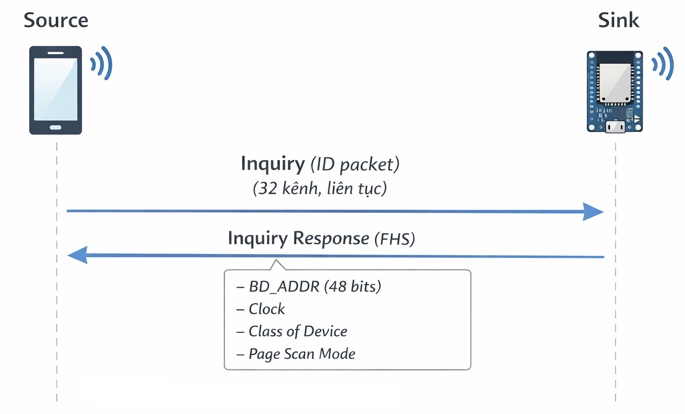
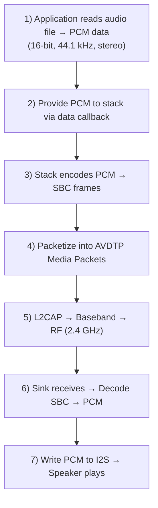
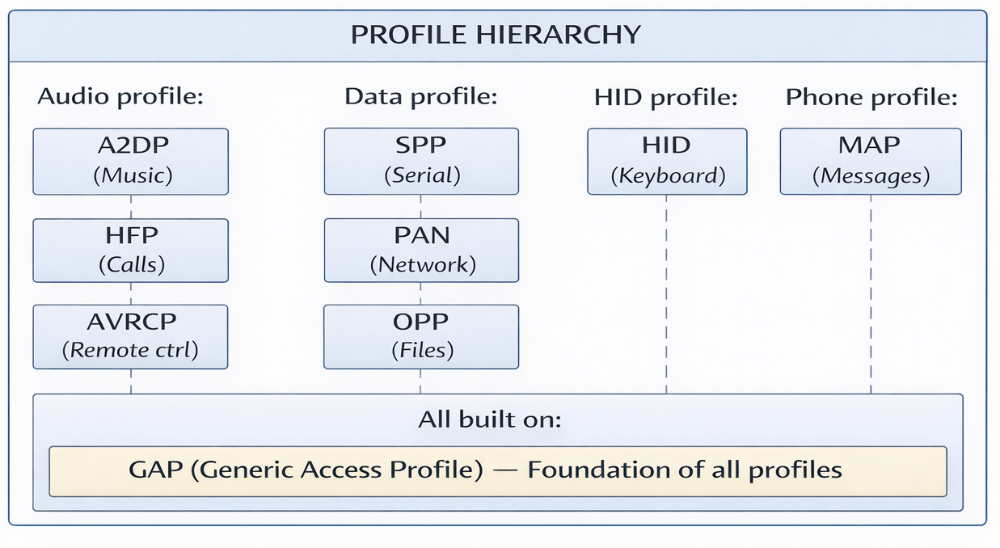
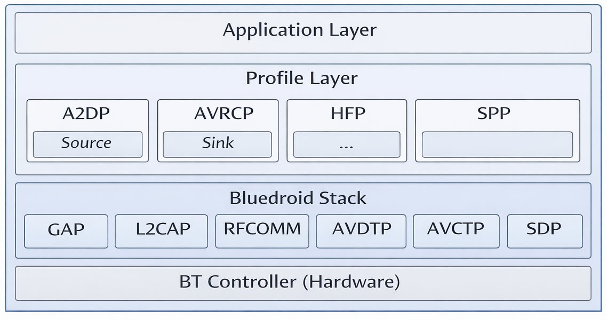

## Mục lục

- [Bluetooth là gì?](#1-bluetooth-là-gì)
- [Cơ chế cốt lõi của bluetooth](#2-cơ-chế-cốt-lõi-của-bluetooth)
  - [Frequency Hopping Spread Spectrum (FHSS)](#21-frequency-hopping-spread-spectrum-fhss)
  - [Time slot scheduling](#22-time-slot-scheduling)
  - [Piconet](#23-piconet)
  - [Cấu trúc packet bluetooth](#24-cấu-trúc-packet-bluetooth)
- [Cách bluetooth classic hoạt động](#3-cách-bluetooth-classic-hoạt-động)
- [Bluetooth profile](#4-bluetooth-profile)
- [Kiến trúc bluetooth trong ESP-IDF](#5-kiến-trúc-bluetooth-trong-esp-idf)
- [Thứ tự khởi tạo A2DP profile](#6-thứ-tự-khởi-tạo-a2dp-profile)
- [Giải thích các event trong callback](#7-giải-thích-các-event-trong-callback)
  - [GAP callback event](#71-gap-callback-event)
  - [A2DP callback event](#72-a2dp-callback-event)

## 1. Bluetooth là gì?

Bluetooth là một tiêu chuẩn công nghệ truyền thông không dây tầm ngắn (thường 1–100 m) bằng sóng vô tuyến tần số 2.4 GHz.

Nó được thiết kế để:
- Kết nối thiết bị ở khoảng cách ngắn
- Tiêu thụ năng lượng thấp
- Thay thế dây nối

**Đặc điểm kỹ thuật**

| Thuộc tính | Giá trị |
| ---------- | ------- |
| Tần số | 2.400 – 2.4835 GHz (ISM band, 79 kênh × 1 MHz) |
| Phiên bản hiện tại | Bluetooth 5.4 (2023) |
| Tốc độ tối đa | 3 Mbps (BR/EDR), 2 Mbps (BLE 2M PHY) |
| Khoảng cách | 1–100 m (tùy công suất phát) |
| Tiêu thụ điện | ~1–30 mW |

## 2. Cơ chế cốt lõi của bluetooth

### 2.1. Frequency Hopping Spread Spectrum (FHSS)

**Vấn đề:** Băng tần 2.4 GHz là băng tần không cần cấp phép. Rất nhiều thiết bị cùng sử dụng: Wi-Fi, ZigBee, lò vi sóng... Nếu phát trên một tần số cố định, rất dễ bị nhiễu gây mất kết nối.

**Giải pháp:** Bluetooth thực hiện frequency hopping — nhảy tần liên tục qua 79 kênh (mỗi kênh rộng 1 MHz) với tốc độ 1600 lần/giây (mỗi 625 µs).

**Ví dụ channels:**
- Channel 0 = 2402 MHz
- Channel 1 = 2403 MHz
- ...
- Channel 78 = 2480 MHz

**Kết quả:** Khi Bluetooth và nguồn nhiễu cùng ở một channel tại một thời điểm, chỉ có một packet bị ảnh hưởng và có thể được gửi lại trên channel khác.

### 2.2. Time slot scheduling

**Vấn đề:** Khi nhiều thiết bị chia sẻ cùng một piconet, cần có cơ chế quyết định ai được phát lúc nào. Nếu không, hai thiết bị phát đồng thời sẽ collision và cả hai đều mất gói.

**Giải pháp:** Bluetooth dùng TDD (Time Division Duplex) — chia thời gian thành các slot luân phiên, mỗi slot chỉ một thiết bị được phát.

**Cấu trúc:**
- Mỗi slot: 625 µs
- Master luôn phát ở slot chẵn (0, 2, 4, 6...)
- Slave luôn phát ở slot lẻ (1, 3, 5, 7...)

→ Hai bên không bao giờ phát đồng thời, không xảy ra collision.

**Packet types:** Một packet có thể chiếm 1, 3, hoặc 5 slot liên tiếp tùy payload:
- DH1: 1 slot (27 bytes)
- DH3: 3 slots (183 bytes)
- DH5: 5 slots (339 bytes) — dùng cho A2DP

### 2.3. Piconet

**Định nghĩa:** Khi kết nối Bluetooth giữa các thiết bị được thiết lập, một mạng nhỏ gọi là piconet được hình thành.

**Cấu trúc:**
- 1 Master (thiết bị khởi tạo kết nối)
- Tối đa 7 Slaves active (thiết bị nhận kết nối)

**Vai trò master:**
- Quyết định frequency hopping (dựa trên clock + `BD_ADDR` của master)
- Quyết định khi nào phát và slave nào được phát
- Định kỳ poll mỗi slave để giữ kết nối và truyền/nhận data

**Vai trò slave:**
- Phải đồng bộ clock với master
- Không tự phát, chỉ được phát khi master poll

### 2.4. Cấu trúc packet bluetooth

Mỗi Bluetooth packet gồm ba phần chính:

|      | Kích thước | Nội dung |
| ---- | ---------- | -------- |
| Access Code | 72 bit | Dùng để đồng bộ và nhận dạng piconet |
| Packet Header | 54 bit | AM_ADDR, TYPE, ARQN, SEQN, HEC |
| Payload | 0–2745 bit | Dữ liệu thực tế |

**Chi tiết Packet Header:**

| Trường | Bit | Mô tả |
| ------ |---- | ----- |
| AM_ADDR | 3 bit | Active Member Address (001-111 cho 7 slave) |
| TYPE | 4 bit | Loại packet (DM1, DH1, DM3, DH3, DM5, DH5, HV1, HV2, HV3) |
| ARQN | 1 bit | ACK/NAK cho packet trước (1 = ACK, 0 = NAK) |
| SEQN | 1 bit | Sequence number (tránh duplicate) |
| HE* | 8 bit | Header Error Check (CRC cho header) |

**Lưu ý:** AM_ADDR = 000 là broadcast address (gửi đến tất cả slave trong piconet).

## 3. Cách bluetooth classic hoạt động

Một kết nối bluetooth classic luôn đi qua 4 giai đoạn chính:

### 3.1. Discovery — Tìm kiếm thiết bị



**Mục đích:** Thiết bị chủ động (Master) tìm kiếm các thiết bị lân cận đang ở chế độ discoverable.

**Hai vai trò:**

| Vai trò | Tên gọi | Nhiệm vụ |
| ------- | ------- | -------- |
| Inquirer | Master/Source (VD: điện thoại) | Phát **inquiry packet** liên tục trên 32 kênh đặc biệt |
| Responder | Slave/Sink (VD: ESP32) | Ở chế độ **inquiry scan**, lắng nghe và phản hồi bằng **FHS packet** |

Thông tin trong FHS response:
| Field | Nội dung | Mục đích |
| ----- | -------- | -------- |
| BD_ADDR | Địa chỉ Bluetooth 48-bit (MAC) | Định danh thiết bị duy nhất |
| Clock | Clock hiện tại | Để đồng bộ hop sequence |
| Class of Device (CoD) | Loại thiết bị (xem bảng dưới) | Lọc thiết bị theo mục đích |
| Page scan mode | Chế độ scan của thiết bị | Cách thiết bị lắng nghe page request |

CoD là bitmask 24-bit cho biết loại thiết bị:

**Major Device Class (bit 8-12):**
| Giá trị | Loại thiết bị |
| ------- | ------------- |
| 00001 | Computer |
| 00010 | Phone |
| 00100 | Audio/Video (Loa, tai nghe) |
| 00101 | Peripheral (chuột, bàn phím) |
| 00111 | Wearable |

**Minor Device Class cho Audio/Video (bit 2-7):**
| Giá trị | Loại |
| ------- | ---- |
| 000001 | Headset |
| 000010 | Hands-free |
| 000101 | Loudspeaker (loa) |
| 000110 | Headphones (tai nghe) |

Inquirer có thể lọc thiết bị theo CoD. Ví dụ source chỉ kết nối đến thiết bị audio, bỏ qua chuột, bàn phím, điện thoại khi đang tìm loa.

**Events được trigger:**

Tại giai đoạn này, sẽ có một số event được trigger là:

| Event | Trigger |
| ----- | ------- |
| `ESP_BT_GAP_DISC_RES_EVT` | Khi tìm thấy thiết bị |
| `ESP_BT_GAP_DISC_STATE_CHANGED_EVT` | Khi discovery bắt đầu/kết thúc |

### 3.2. Pairing — Ghép đôi và bảo mật

**Mục đích:** Hai thiết bị trao đổi link key để mã hóa kết nối và xác thực lẫn nhau.

**Phương thức:** Simple Secure Pairing (SSP) — Bluetooth 2.1+

**4 chế độ pairing:**

| Mode | Điều kiện | Bảo mật | Cách thực hiện |
| ---- | --------- | ------- | -------------- |
| Numeric Comparison | Cả hai có display + button | Cao | Hiển thị 6 chữ số, người dùng xác nhận |
| Passkey Entry | Một bên có keyboard | Cao | Nhập PIN hiển thị ở bên kia |
| Just Works | Không display/keyboard | Thấp | Tự động accept — dùng cho ESP32 |
| Out of Band (OOB) | Có kênh khác (NFC) | Rất cao | Trao đổi key qua NFC |

> ESP32 A2DP thường dùng just works với `ESP_BT_IO_CAP_NONE`.

**Pairing vs Bonding:**

|     | Pairing | Bonding |
| --- | ------- | ------- |
| Định nghĩa | Xác thực một lần | Lưu link key vào NVS |
| Thời gian | Mỗi lần kết nối | Một lần, dùng lại sau |
| Kết quả | Link Key tạm thời | Link Key permanent |

**Events được trigger:**

Tại giai đoạn này, sẽ có một số event được trigger là:

| Event | Trigger |
| ----- | ------- |
| `ESP_BT_GAP_CFM_REQ_EVT` | Khi cần xác nhận passkey |
| `ESP_BT_GAP_AUTH_CMPL_EVT` | Khi pairing hoàn thành |

### 3.3. Connecting — Thiết lập kết nối

**Mục đích:** Thiết lập kết nối ACL (Asynchronous Connection Less) và thỏa thuận codec.

**Quy trình:**

1. **Page procedure:**
   - Người dùng chọn kết nối trên điện thoại
   - Điện thoại gửi **Page packet** đến địa chỉ MAC của ESP32
   - ESP32 ở chế độ **Page Scan**, nhận được Page và phản hồi **Page Response**
   - ACL link được thiết lập

2. **L2CAP connection:**
   - Mở L2CAP channels cho AVDTP (Audio/Video Distribution Transport Protocol)
   - Được phân bổ Channel ID (CID) động

3. **AVDTP Signaling:**
   - **Discover:** Source hỏi sink có bao nhiêu Stream End Points (SEP)
   - **Get Capabilities:** Hỏi sink hỗ trợ codec nào (SBC, AAC, aptX...)
   - **Set Configuration:** Thỏa thuận codec và parameters (sample rate, bitpool...)
   - **Open:** Mở stream (chưa truyền data)

4. **Media control start:**
   - Source gọi `esp_a2d_media_ctrl(ESP_A2D_MEDIA_CTRL_START)`
   - Chuyển sang state streaming

**Events được trigger:**

Tại giai đoạn này, sẽ có một số event được trigger là:

| Event | Trigger |
| ----- | ------- |
| `ESP_A2D_CONNECTION_STATE_EVT` | Khi kết nối A2DP thay đổi |
| `ESP_A2D_AUDIO_CFG_EVT` | Khi sink thông báo codec config |
| `ESP_A2D_MEDIA_CTRL_ACK_EVT` | Khi media control command được ACK |

### 3.4. Data Transfer — Truyền dữ liệu audio

**Mục đích:** Stream audio data từ source đến sink.

**Luồng dữ liệu (Source → Sink):**



## 4. Bluetooth profile

Một profile là một tập hợp các quy tắc và giao thức xác định cách hai thiết bị Bluetooth phải hoạt động để thực hiện một chức năng cụ thể.

Hãy tưởng tượng:
- Hãng A làm tai nghe Bluetooth.
- Hãng B làm điện thoại.

Nếu không có profile, hãng A có thể gửi packet theo cấu trúc khác với hãng B -> Tai nghe hãng A sẽ không hoạt động với điện thoại hãng B.



### Các profile phổ biến

| Profile | Tên đầy đủ | Vai trò |
| ------- | ---------- | ------- |
| A2DP    | Advanced Audio Distribution Profile | Truyền tải audio chất lượng cao (stereo) từ source đến sink |
| AVRCP	  | Audio/Video Remote Control Profile | Điều khiển phát nhạc: play, pause, skip, volume |
| HFP	  | Hands-Free Profile | Audio 2 chiều cho cuộc gọi điện thoại |
| HID	  | Human Interface Device Profile | Điều khiển qua bàn phím, chuột bluetooth |

### SBC codec

SBC là thuật toán nén audio, thiết kế đặc biệt cho bluetooth A2DP và là codec bắt buộc — mọi thiết bị A2DP đều phải hỗ trợ.

**Tại sao cần codec?**
- PCM thô: 44100 Hz × 2ch × 16-bit = 1.41 Mbps
- Bluetooth A2DP bandwidth: ~768 Kbps
- SBC nén xuống: 192–360 Kbps (hệ số 4–7×)

**Chất lượng theo bitpool:**
| Bitpool | Bitrate | Chất lượng |
| ------- | ------- | ---------- |
| 2–17 | ~64–128 Kbps | Kém |
| 18–28 | ~128–192 Kbps | Trung bình |
| 29–37 | ~192–256 Kbps | Khá tốt |
| 38–47 | ~256–320 Kbps | Tốt |
| 48–53 | ~320–360 Kbps | Tốt nhất của SBC |

> ESP-IDF tự động encode/decode SBC. Application chỉ cần cung cấp/nhận PCM data.

## 5. Kiến trúc bluetooth trong ESP-IDF

ESP-IDF tổ chức bluetooth theo mô hình 4 lớp từ hardware lên application. Mỗi lớp có trách nhiệm riêng và API riêng.



Chi tiết các lớp như sau:

### 5.1. BT Controller

**File header:** `esp_bt.h`

Đây là lớp thấp nhất, giao tiếp trực tiếp với hardware bluetooth.

Các API chính:
```c
esp_bt_controller_config_t cfg = BT_CONTROLLER_INIT_CONFIG_DEFAULT();
esp_bt_controller_init(&cfg);
esp_bt_controller_enable(ESP_BT_MODE_CLASSIC_BT);
```

Hỗ trợ 3 mode:

| Mode            | Macro                    | Mô tả |
| --------------- | ------------------------ | ----- |
| Classic BT only | `ESP_BT_MODE_CLASSIC_BT` | Chỉ chạy bluetooth classic. |
| BLE only	      | `ESP_BT_MODE_BLE`        | Chỉ chạy BLE. |
| Dual mode       | `ESP_BT_MODE_BTDM`	     | Hỗ trợ cả hai. |

### 5.2. Bluedroid stack

**File header:** `esp_bt_main.h`

Bluedroid là bluetooth protocol stack mã nguồn mở (gốc từ android). Đây là tầng trung gian xử lý các bluetooth protocols: GAP, L2CAP, AVDTP, AVCTP, SDP, RFCOMM...

**API chính:**
```c
esp_bluedroid_init();
esp_bluedroid_enable();
```

### 5.3. Profile layer

Cung cấp API cấp cao cho từng profile.

**File headers:**
- `esp_gap_bt_api.h` — GAP (discovery, pairing, security)
- `esp_a2dp_api.h` — A2DP Source và Sink
- `esp_avrc_api.h` — AVRCP (remote control)
- `esp_hf_client_api.h`, `esp_hf_ag_api.h` — HFP
- `esp_spp_api.h` — SPP (Serial Port Profile)

## 6. Thứ tự khởi tạo A2DP profile

### 6.1. Sơ đồ khởi tạo bắt buộc

```
app_main()
  │
  ├─ 1. nvs_flash_init()                // NVS cho BT bonding keys
  │
  ├─ 2. esp_bt_controller_init()        // Khởi tạo BT hardware
  ├─    esp_bt_controller_enable()
  │
  ├─ 3. esp_bluedroid_init()            // Khởi tạo bluedroid stack
  ├─    esp_bluedroid_enable()
  │
  ├─ 4. esp_bt_gap_register_callback()  // Đăng ký GAP events
  ├─ 5. esp_a2d_register_callback()     // Đăng ký A2DP events
  ├─ 6. [Source] esp_a2d_source_register_data_callback() // Đăng ký data callback
  │     [Sink]   esp_a2d_sink_register_data_callback()
  │
  ├─ 7. [Source] esp_a2d_source_init()  // Khởi tạo profile
  │     [Sink]   esp_a2d_sink_init()
  │
  ├─ 8. esp_bt_gap_set_device_name()    // Đặt tên thiết bị
  ├─ 9. esp_bt_gap_set_scan_mode()      // Cho phép connect hoặc/và discovery
  │
  └─ 10. [Source] esp_bt_gap_start_discovery()  // Start discovery
         [Sink]   Chờ source kết nối
```

### 6.2. A2DP source

Source chủ động tìm kiếm và kết nối đến sink. Cung cấp PCM data qua data callback và stack tự encode sang SBC và phát.

```c
// ── Bước 1-3: Khởi tạo BT stack (xem sơ đồ trên) ──────────────

// ── Bước 4-6: Đăng ký cabllback ───────────────────────────────
esp_bt_gap_register_callback(bt_app_gap_cb);
esp_a2d_register_callback(bt_app_a2d_cb);
esp_a2d_source_register_data_callback(bt_app_a2d_data_cb);

// ── Bước 7: Khởi tạo profile A2DP source ──────────────────────
esp_a2d_source_init();

// ── Bước 8-9: BT setting ──────────────────────────────────────
esp_bt_gap_set_device_name("ESP32_Source");
esp_bt_gap_set_scan_mode(ESP_BT_CONNECTABLE, ESP_BT_GENERAL_DISCOVERABLE);

// ── Bước 10: Tìm thiết bị sink
esp_bt_gap_start_discovery(ESP_BT_INQ_MODE_GENERAL_INQUIRY,
                           10,   // 10 × 1.28s = ~13s
                           0);   // Unlimited response

// ── Data callback (cung cấp PCM data cho BT stack) ────────────
// buf: buffer cần fill PCM data
// len: số bytes cần (thường 512)
// return: số bytes đã fill
static int32_t bt_app_a2d_data_cb(uint8_t *buf, int32_t len)
{
    // ⚠️ Callback chạy trong BT task, cho nên:
    //   - KHÔNG block lâu (< 5ms)
    //   - KHÔNG malloc/free
    //   - KHÔNG log quá nhiều

    size_t got = circular_buf_read(buf, len);
    if (got < len) memset(buf + got, 0, len - got); // silence nếu thiếu data
    return len; // Luôn trả về len để tránh underrun
}

// ── GAP callback (kết nối khi tìm thấy thiết bị) ──────────────
static void bt_app_gap_cb(
    esp_bt_gap_cb_event_t event,
    esp_bt_gap_cb_param_t *param
)
{
    if (event == ESP_BT_GAP_DISC_RES_EVT) {
        // Tìm thấy thiết bị → kết nối ngay
        esp_a2d_source_connect(param->disc_res.bda);
        esp_bt_gap_cancel_discovery();
    }
}

// ── A2DP callback (xử lý connection & audio state) ───────────
static void bt_app_a2d_cb(esp_a2d_cb_event_t event,
                           esp_a2d_cb_param_t *param)
{
    switch (event) {
    case ESP_A2D_CONNECTION_STATE_EVT:
        if (param->conn_stat.state == ESP_A2D_CONNECTION_STATE_CONNECTED) {
            ESP_LOGI(TAG, "A2DP Connected");
            // Trigger media start
            esp_a2d_media_ctrl(ESP_A2D_MEDIA_CTRL_START);
        }
        break;

    case ESP_A2D_AUDIO_STATE_EVT:
        if (param->audio_stat.state == ESP_A2D_AUDIO_STATE_STARTED) {
            ESP_LOGI(TAG, "Audio stream started");
            // Signal reader task bắt đầu đọc file
            xEventGroupSetBits(s_evt, BIT_STREAMING);
        }
        break;

    // ... handle other events ...
    }
}
```

### 6.3. A2DP sink

Cấu hình A2DP sink không cần gọi `start_discovery()`, chỉ cần bật discovery và chờ source kết nối.

```c
// ── Bước 1-3: Khởi tạo BT stack (xem sơ đồ trên) ──────────────

// ── Bước 4-6: Đăng ký cabllback ───────────────────────────────
esp_bt_gap_register_callback(bt_app_gap_cb);
esp_a2d_register_callback(bt_app_a2d_cb);
esp_a2d_sink_register_data_callback(bt_app_a2d_data_cb);

// ── Bước 7: Khởi tạo profile A2DP sink
esp_a2d_sink_init();

// ── Bước 8-9: BT settings ─────────────────────────────────────
esp_bt_gap_set_device_name("ESP32_Sink");

// Auto-accept pairing
esp_bt_sp_param_t param = ESP_BT_SP_IOCAP_MODE;
esp_bt_io_cap_t iocap   = ESP_BT_IO_CAP_NONE;
esp_bt_gap_set_security_param(param, &iocap, sizeof(iocap));

// Cho phép source tìm thấy và kết nối
esp_bt_gap_set_scan_mode(ESP_BT_CONNECTABLE, ESP_BT_GENERAL_DISCOVERABLE);

// ── Data Callback (nhận PCM data từ BT stack) ─────────────────
static void bt_app_a2d_data_cb(const uint8_t *buf, uint32_t len)
{
    // Data đã decode từ SBC → PCM (16-bit, 44.1kHz, stereo)
    // Ghi thẳng vào I2S để phát ra loa

    size_t written = 0;
    i2s_channel_write(tx_handle, buf, len, &written, portMAX_DELAY);
}

// ── A2DP callback ─────────────────────────────────────────────
static void bt_app_a2d_cb(esp_a2d_cb_event_t event,
                           esp_a2d_cb_param_t *param)
{
    switch (event) {
    case ESP_A2D_CONNECTION_STATE_EVT:
        if (param->conn_stat.state == ESP_A2D_CONNECTION_STATE_CONNECTED) {
            ESP_LOGI(TAG, "A2DP Connected");
        }
        break;

    case ESP_A2D_AUDIO_STATE_EVT:
        if (param->audio_stat.state == ESP_A2D_AUDIO_STATE_STARTED) {
            ESP_LOGI(TAG, "Audio stream started");
            // Init I2S nếu chưa
        }
        break;

    // ... handle other events ...
    }
}
```

## 7. Giải thích các event trong callback

### 7.1. GAP callback event

Đăng ký bằng `esp_bt_gap_register_callback(callback)`. Callback prototype: `void cb(esp_bt_gap_cb_event_t event, esp_bt_gap_cb_param_t *param)`.


**1. `ESP_BT_GAP_DISC_RES_EVT` — Tìm thấy thiết bị**

Kích hoạt mỗi lần scan thấy một thiết bị. Chỉ xảy ra ở source sau khi gọi `esp_bt_gap_start_discovery()`.

| Field | Kiểu | Mô tả |
| ----- | ---- | ----- |
| `disc_res.bda` | `esp_bd_addr_t` | MAC address (6 bytes) |
| `disc_res.num_prop` | `int` | Số property có trong response |
| `disc_res.prop[i].type` | `esp_bt_gap_dev_prop_type_t` | Loại property: `BDNAME`, `RSSI`, `COD`, `EIR`... |
| `disc_res.prop[i].val` | `void *` | Giá trị property (cast tùy theo type) |
| `disc_res.prop[i].len` | `int` | Độ dài của val (tính theo byte) |

Ví dụ:

```c
case ESP_BT_GAP_DISC_RES_EVT: {
    const uint8_t *bda = param->disc_res.bda; // MAC address (6 bytes)

    // Lấy tên thiết bị
    char name[ESP_BT_GAP_MAX_BDNAME_LEN + 1] = {0};
    for (int i = 0; i < param->disc_res.num_prop; i++) {
        esp_bt_gap_dev_prop_t *p = &param->disc_res.prop[i];

        if (p->type == ESP_BT_GAP_DEV_PROP_BDNAME) {
            // p->val = tên thiết bị (char*)
            // p->len = độ dài tên
            memcpy(name, p->val, p->len);

        } else if (p->type == ESP_BT_GAP_DEV_PROP_RSSI) {
            // p->val = RSSI (int8_t*)
            int8_t rssi = *(int8_t *)p->val;
            ESP_LOGI(TAG, "RSSI: %d dBm", rssi);

        } else if (p->type == ESP_BT_GAP_DEV_PROP_COD) {
            // p->val = Class of Device (uint32_t*)
            uint32_t cod = *(uint32_t *)p->val;
            // Bits 8-12: Major Class (4 = Audio/Video)
            int major = (cod >> 8) & 0x1F;
            if (major == 4) {
                ESP_LOGI(TAG, "Audio device found!");
            }
        }
    }

    ESP_LOGI(TAG, "Found: \"%s\" [%02x:%02x:%02x:%02x:%02x:%02x]",
             name, bda[0],bda[1],bda[2],bda[3],bda[4],bda[5]);

    // Kết nối đến thiết bị tìm thấy
    esp_a2d_source_connect(bda);
    esp_bt_gap_cancel_discovery();
    break;
}
```

**2. `ESP_BT_GAP_DISC_STATE_CHANGED_EVT` — Discovery state thay đổi**

Kích hoạt khi trạng thái discovery thay đổi (bắt đầu hoặc kết thúc scan).

| State                          | Ý nghĩa |
| ------------------------------ | ------- |
| `ESP_BT_GAP_DISCOVERY_STARTED` | Bắt đầu scan thiết bị |
| `ESP_BT_GAP_DISCOVERY_STOPPED` | Kết thúc scan (hết thời gian hoặc bị cancel) |

Ví dụ:

```c
case ESP_BT_GAP_DISC_STATE_CHANGED_EVT:
    if (param->disc_st_chg.state == ESP_BT_GAP_DISCOVERY_STARTED) {
        ESP_LOGI(TAG, "Scanning started...");
    } else if (param->disc_st_chg.state == ESP_BT_GAP_DISCOVERY_STOPPED) {
        ESP_LOGI(TAG, "Scanning stopped");
        // Nếu chưa kết nối được → scan lại
        if (!connected) {
            esp_bt_gap_start_discovery(...);
        }
    }
    break;
```


**3. `ESP_BT_GAP_AUTH_CMPL_EVT` — Ghép đôi hoàn thành**

Kích hoạt khi hoàn thành quá trình xác thực và ghép đôi thiết bị.

| Field   | Mô tả |
| ------- | ----- |
| `param->auth_cmpl.stat` | `ESP_BT_STATUS_SUCCESS` hoặc error code |
| `param->auth_cmpl.device_name` | Tên thiết bị đã xác thực |
| `param->auth_cmpl.bda` | Địa chỉ bluetooth của thiết bị |

Ví dụ:

```c
case ESP_BT_GAP_AUTH_CMPL_EVT:
    if (param->auth_cmpl.stat == ESP_BT_STATUS_SUCCESS) {
        ESP_LOGI(TAG, "Paired with: %s", param->auth_cmpl.device_name);
        // Từ đây kết nối được mã hóa và xác thực
    } else {
        ESP_LOGE(TAG, "Pairing failed: %d", param->auth_cmpl.stat);
        // Lỗi thường gặp:
        // 0x05 = Authentication failure (sai PIN/key)
        // 0x06 = Pin/Key missing
        // 0x18 = Pairing not allowed
    }
    break;
```

**4. `ESP_BT_GAP_CFM_REQ_EVT` — Yêu cầu confirm passkey**

Kích hoạt khi thiết bị yêu cầu xác nhận passkey (Numeric Comparison SSP). Cần gọi `esp_bt_gap_ssp_confirm_reply()` để accept hoặc reject.

Ví dụ:

```c
case ESP_BT_GAP_CFM_REQ_EVT:
    ESP_LOGI(TAG, "Passkey: %06lu — Accept? (auto-accepting)",
             param->cfm_req.num_val);
    // true = accept, false = reject
    esp_bt_gap_ssp_confirm_reply(param->cfm_req.bda, true);
    break;
```

**5. `ESP_BT_GAP_MODE_CHG_EVT` — Power mode thay đổi**

Kích hoạt khi power mode của kết nối thay đổi (Active, Hold, Sniff, Park).

| Mode | Mô tả |
| ---- | ----- |
| `ESP_BT_PM_SET_MODE_SUCCESS` | Thay đổi mode thành công |
| `ESP_BT_PM_ACT_ACTIVE`       | Full power, đang truyền data |
| `ESP_BT_PM_ACT_SNIFF`	       | Low power, kiểm tra định kỳ |

Ví dụ:

```c
case ESP_BT_GAP_MODE_CHG_EVT:
    ESP_LOGI(TAG, "Power mode changed to: %d", param->mode_chg.mode);
    break;
```

### 7.2. A2DP callback event

Đăng ký bằng `esp_a2d_register_callback(callback)`. Callback prototype: `void cb(esp_a2d_cb_event_t event, esp_a2d_cb_param_t *param)`

**1. `ESP_A2D_CONNECTION_STATE_EVT` — Trạng thái kết nối A2DP**

Kích hoạt khi trạng thái kết nối A2DP thay đổi. Xảy ra ở cả source và sink.

| State | Mô tả |
| ----- | ----- |
| ESP_A2D_CONNECTION_STATE_CONNECTING    | Đang trong quá trình kết nối |
| ESP_A2D_CONNECTION_STATE_CONNECTED     | Kết nối thành công |
| ESP_A2D_CONNECTION_STATE_DISCONNECTING | Đang ngắt kết nối |
| ESP_A2D_CONNECTION_STATE_DISCONNECTED	 | Đã ngắt kết nối |

Ví dụ:

```c
case ESP_A2D_CONNECTION_STATE_EVT: {
    // param->conn_stat.remote_bda : MAC address đầu kia
    // param->conn_stat.state      : Trạng thái mới

    const uint8_t *bda = param->conn_stat.remote_bda;

    switch (param->conn_stat.state) {
    case ESP_A2D_CONNECTION_STATE_CONNECTING:
        // Đang kết nối...
        // Không làm gì, chờ CONNECTED
        break;

    case ESP_A2D_CONNECTION_STATE_CONNECTED:
        ESP_LOGI(TAG, "A2DP Connected to [%02x:%02x:%02x:%02x:%02x:%02x]",
                 bda[0],bda[1],bda[2],bda[3],bda[4],bda[5]);
        // [Source] Trigger start media stream
        esp_a2d_media_ctrl(ESP_A2D_MEDIA_CTRL_START);
        break;

    case ESP_A2D_CONNECTION_STATE_DISCONNECTING:
        // Đang ngắt kết nối...
        // Bắt đầu dừng audio operations
        break;

    case ESP_A2D_CONNECTION_STATE_DISCONNECTED:
        ESP_LOGI(TAG, "A2DP Disconnected");
        // Dọn dẹp state, clear audio buffer
        break;
    }
    break;
}
```

**2. `ESP_A2D_AUDIO_STATE_EVT` — Trạng thái audio stream**

Kích hoạt khi trạng thái audio stream thay đổi. Đây là event quan trọng nhất để điều khiển việc đọc/ghi audio data.

| State | Mô tả |
| ----- | ----- |
| ESP_A2D_AUDIO_STATE_STARTED | BT stack bắt đầu kéo/đẩy audio data |
| ESP_A2D_AUDIO_STATE_STOPPED | Audio stream dừng hoàn toàn |
| ESP_A2D_AUDIO_STATE_REMOTE_SUSPEND | Tạm dừng audio, giữ connection |

Ví dụ:

```c
case ESP_A2D_AUDIO_STATE_EVT:
    switch (param->audio_stat.state) {

    case ESP_A2D_AUDIO_STATE_STARTED:
        ESP_LOGI(TAG, "Audio stream STARTED");
        xEventGroupSetBits(s_evt, BIT_STREAMING);
        break;

    case ESP_A2D_AUDIO_STATE_STOPPED:
        ESP_LOGI(TAG, "Audio stream STOPPED");
        xEventGroupClearBits(s_evt, BIT_STREAMING | BIT_PREFILLED);
        break;

    case ESP_A2D_AUDIO_STATE_REMOTE_SUSPEND:
        ESP_LOGI(TAG, "Audio stream SUSPENDED by remote");
        break;
    }
    break;
```

:::warning Quan trọng
Chỉ bắt đầu cung cấp audio data sau khi nhận được STARTED. Cung cấp data trước sẽ gây buffer underrun vì sink chưa sẵn sàng nhận.
:::

**3. `ESP_A2D_AUDIO_CFG_EVT` — Codec được cấu hình**

Kích hoạt khi sink thông báo cho source về cấu hình codec đã chọn (sample rate, channels...). Chỉ xảy ra ở source side.

| Field | Mô tả |
| ----- | ----- |
| `param->audio_cfg.mcc.type`       | Loại codec: ESP_A2D_MCT_SBC (luôn là SBC trong ESP-IDF) |
| `param->audio_cfg.mcc.cie.sbc[0]` | Byte cấu hình SBC: bits 4-7 là sample rate, bits 0-3 là channel mode |
| `param->audio_cfg.mcc.cie.sbc[1]` | Byte cấu hình SBC: block length, subbands, allocation method |
| `param->audio_cfg.mcc.cie.sbc[2]` | Min bitpool value |
| `param->audio_cfg.mcc.cie.sbc[3]` | Max bitpool value |

Ví dụ:

```c
case ESP_A2D_AUDIO_CFG_EVT: {
    uint8_t oct0 = param->audio_cfg.mcc.cie.sbc[0];
    int sample_rate;
    if      (oct0 & 0x40) sample_rate = 32000;
    else if (oct0 & 0x20) sample_rate = 44100;
    else if (oct0 & 0x10) sample_rate = 48000;
    else                  sample_rate = 16000;
    ESP_LOGI(TAG, "SBC codec configured: %d Hz", sample_rate);
    break;
}
```

**4. `ESP_A2D_MEDIA_CTRL_ACK_EVT` — ACK lệnh media control**

Kích hoạt khi stack phản hồi sau khi gọi `esp_a2d_media_ctrl()`. Dùng để xác nhận lệnh đã được thực thi.

| Field | Giá trị | Mô tả |
| ----- | ------- | ----- |
| `param->media_ctrl_stat.cmd` | `ESP_A2D_MEDIA_CTRL_START` (2) | Lệnh START |
|                              | `ESP_A2D_MEDIA_CTRL_STOP` (3)	| Lệnh STOP |
|                              | `ESP_A2D_MEDIA_CTRL_SUSPEND` (4) | Lệnh SUSPEND |
| `param->media_ctrl_stat.status` | 0 = Success | Lệnh thực thi thành công |
|                                 | 1 = Failure | Lệnh thất bại (thường do chưa kết nối) |

Ví dụ:

```c
case ESP_A2D_MEDIA_CTRL_ACK_EVT:
    ESP_LOGI(TAG, "Media ctrl cmd=%d status=%d",
             param->media_ctrl_stat.cmd,
             param->media_ctrl_stat.status);
    break;
```

## Tài liệu tham khảo

- [ESP-IDF Bluetooth API Reference](https://docs.espressif.com/projects/esp-idf/en/latest/esp32/api-reference/bluetooth/)
- [Bluetooth Core Specification](https://www.bluetooth.com/specifications/bluetooth-core-specification/)
- [A2DP Profile Specification](https://www.bluetooth.com/specifications/specs/advanced-audio-distribution-profile-1-4/)