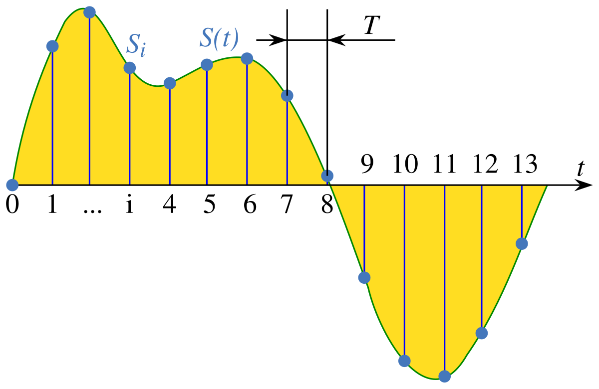
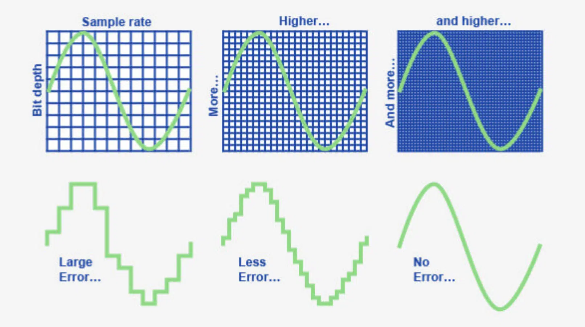
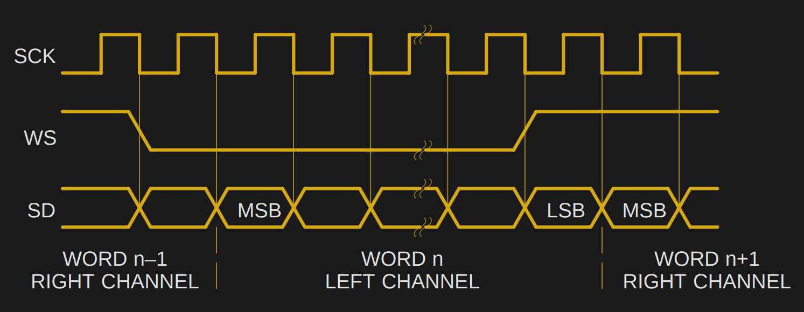

## Mục lục
[Tổng quan](#1-tổng-quan)
[Kiến thức phần cứng](#2-kiến-thức-phần-cứng)
[Kiến thức cơ bản về Pulse code modulation](#3-kiến-thức-cơ-bản-về-pulse-code-modulation)
[Giao thức I2S](#4-giao-thức-i2s)
[Driver I2S trong ESP-IDF](#5-driver-i2s-trong-esp-idf)
[Cấu trúc file wav](#6-cấu-trúc-file-wav)
[Cấu trúc file mp3](#7-cấu-trúc-file-mp3)
[Lookup table](#8-lookup-table)
[Workflow xử lý audio](#9-workflow-xử-lý-audio)

## 1. Tổng quan

Topic này tổng hợp các kiến thức nền tảng cần thiết để phát triển ứng dụng âm thanh trên vi điều khiển ESP32 sử dụng ESP-IDF. Nội dung bao gồm các khái niệm phần cứng, lý thuyết xử lý tín hiệu số cơ bản, và kiến trúc phần mềm trong hệ thống nhúng.

## 2. Kiến thức phần cứng

### 2.1. Passive speaker

Passive speaker không có mạch khuếch đại bên trong. Nó chỉ là củ loa (driver) thuần cơ–điện.

**Đặc điểm kỹ thuật:**
- Trở kháng phổ biến: 4Ω / 8Ω
- Cần công suất dòng và áp tương đối lớn
- Không thể nối trực tiếp vào GPIO hoặc DAC của MCU

Tín hiệu từ chân GPIO hoặc DAC của ESP32 không đủ công suất để kéo trực tiếp loa này -> Bắt buộc phải có amply rời. Ví dụ: LM386, PAM8302, MAX98357A,...

### 2.2. Active speaker

Active speaker tích hợp sẵn mạch khuếch đại bên trong.

**Đặc điểm kỹ thuật:**
- Có thể hoạt động với 3.3V hoặc 5V
- Chỉ nhận tín hiệu mức thấp (tức là tín hiệu điện áp nhỏ, chưa có công suất) từ nguồn phát, sau đó mạch amply bên trong sẽ tự khuếch đại lên để phát ra tiếng.

:::warning Chú ý
Không được nối active speaker vào đầu ra của bộ amply khác vìaAmply nối tiếp amply sẽ gây méo tiếng hoặc cháy mạch.
:::

### 2.3. Bộ khuếch đại âm thanh (amply)

Hãy tưởng tượng tín hiệu âm thanh đi ra từ chân DAC của chip:
- Điện áp: 3.3V hoặc 5V
- Dòng điện: Cực nhỏ, khoảng 12–40 mA (tùy chế độ).

Tuy nhiên, speaker là một thiết bị vật lý cần lực từ trường để đẩy màng loa rung động:
- Trở kháng: Rất thấp, thường là $4\Omega$ hoặc $8\Omega$.
- Theo dịnh luật Ohm: $I = U / R$. Nếu điện áp 3.3V vào loa $8\Omega$, dòng điện yêu cầu là khoảng $0.412A$ (412mA).
  $\rightarrow$ Gấp hơn 10 lần khả năng cung cấp của chân DAC
  $\rightarrow$ Nó sẽ bị sụt áp ngay lập tức hoặc tệ hơn là cháy chip DAC.

Amply không tự sinh ra năng lượng. Nó thực chất là một cái van điều khiển dòng điện.
- Đầu vào 1: Nguồn điện từ pin hoặc adapter. Đây là bể nước.
- Đầu vào 2: Tín hiệu âm thanh từ DAC. Đây là tay vặn van.
- Đầu ra: Dòng điện lớn chảy ra loa.

Amply dùng tín hiệu âm thanh từ DAC để điều khiển đóng/mở dòng điện từ nguồn điện sao cho dòng điện lớn này có hình dạng sóng y hệt tín hiệu nhỏ ban đầu, nhưng với biên độ điện áp và dòng điện lớn hơn gấp nhiều lần.

Amply gồm hai loại:

**Linear amplifier (Class AB)**

- Hoạt động: Các transistor luôn mở một phần để dẫn điện tuyến tính.
- Ưu điểm: Âm thanh rất sạch, ít nhiễu, trung thực.
- Nhược điểm: Hiệu suất thấp khoảng 50-60%. Năng lượng còn lại tỏa nhiệt rất nóng. Cần tản nhiệt to.
- Ví dụ: LM386

**Switching amplifier (Class D)**

- Hoạt động giống hệt PWM:
  - Nó băm xung tín hiệu audio thành chuỗi xung vuông tốc độ cao với tần số rất lớn.
  - Khi cần điện áp cao $\rightarrow$ Độ rộng xung lớn.
  - Khi điện áp thấp $\rightarrow$ Độ rộng xung nhỏ.
  - Sau đó đi qua một bộ lọc LC để làm mượt xung vuông trở lại thành sóng sin đẩy ra loa.
- Ưu điểm: Hiệu suất cực cao (90% trở lên). Gần như không tỏa nhiệt, không cần tản nhiệt, rất tiết kiệm pin.
- Nhược điểm: Có thể gây nhiễu điện từ do tần số đóng cắt cao.
- Ví dụ điển hình: MAX98357, PAM8403.

### 2.4. Codec

Trong hệ thống audio số, khái niệm codec xuất hiện rất thường xuyên và rất dễ bị hiểu nhầm

Từ Codec là viết tắt của Coder - Decoder (Mã hóa - Giải mã).

Trong audio, codec là khối thực hiện mã hóa (encode) và/hoặc giải mã (decode) âm thanh.

Tùy ngữ cảnh, codec có thể là:
- Thuật toán/định dạng (MP3, AAC, PCM…)
- IC phần cứng tích hợp ADC + DAC + xử lý audio

**Hardware codec**

Đây là một con chip vật lý nằm trên bo mạch, nó tích hợp.
- DAC: Nhận dữ liệu PCM từ ESP32 qua giao tiếp I2S, chuyển thành tín hiệu điện analog để phát ra loa/tai nghe.
- ADC: Thu tín hiệu điện analog từ micro, chuyển đổi thành dữ liệu PCM để gửi về ESP32 qua I2S.
- Mixer & routing: Trộn các luồng âm thanh, điều chỉnh đường đi. Vví dụ: chọn thu từ micro 1 hay micro 2, phát ra loa ngoài hay tai nghe.
- Volume/Gain control: Chỉnh âm lượng bằng phần cứng.

Ví dụ thực tế:
- ES8388: Chip rất phổ biến trên các board ESP32-LyraT. Hỗ trợ cả micro và loa.
- PCM5102: Chỉ là DAC. Rất rẻ, dễ dùng cho project chỉ cần phát nhạc.
- ICS-43434: Micro I2S (đã tích hợp sẵn ADC bên trong micro).

**Software codec**

Dữ liệu PCM rất nặng. Để lưu trữ hoặc truyền tải, người ta thường nén nó lại. Software codec có nhiệm vụ nén (encode) và giải nén (decode) dữ liệu này.
- Decoder: Đọc file MP3/AAC/FLAC $\rightarrow$ chuyển thành PCM để gửi ra I2S.
- Encoder (Mã hóa): Lấy dữ liệu PCM thu từ Micro $\rightarrow$ nén thành file MP3/WAV/AMR để ghi vào thẻ nhớ hoặc gửi qua mạng.

Các loại phổ biến:
- MP3, AAC: Nén có khả năng mất dữ liệu, nhưng file rất nhẹ. Phổ biến nhất.
- FLAC: Nén không mất dữ liệu, chất lượng cao, file nặng.
- WAV: Thường là PCM thô, không nén hoặc nén rất ít.

## 3. Kiến thức cơ bản về Pulse Code Modulation

PCM là phương pháp tiêu chuẩn để biểu diễn tín hiệu âm thanh analog liên tục thành chuỗi số digital để lưu trữ và truyền đi.

### 3.1. Sample rate

Sample rate được hiểu là số lần tín hiệu âm thanh được "chụp ảnh" trong 1 giây.



Ta cũng có thể hiểu sample rate nó giống như frame rate đối với video vậy. Ví dụ như video về chuyển động cánh tay:
- Nếu ta chụp 1 bức ảnh mỗi giây tương ứng với 1 FPS thì khi xem lại, ta thấy cánh tay dịch chuyển tức thời từ dưới lên trên. Chuyển động bị giật cục, mất chi tiết.
- Nếu ta chụp 60 bức ảnh mỗi giây tương ứng với 60 FPS thì ta thấy cánh tay di chuyển mượt mà, bắt được từng khoảnh khắc nhỏ.

Audio cũng như vậy, nếu ta đo điện áp của sóng âm 1000 lần/giây (1kHz) thì ta sẽ bỏ lỡ các dao động nhanh như âm cao, tiếng sáo,...Âm thanh nghe sẽ ồm ồm, thiếu chi tiết giống như giọng nói qua điện thoại bàn cũ.

**Định lý Nyquist:** Sample rate phải lớn hơn gấp đôi tần số cao nhất của âm thanh cần thu. Ví dụ: Tai người nghe tối đa khoảng 20kHz $\rightarrow$ Cần sample rate tối thiểu 40kHz.

Các chuẩn phổ biến sẽ gặp trong ESP-IDF:
- 8000 Hz / 16000 Hz: Dùng cho giọng nói (VoIP, bộ đàm). Lý do: Giọng người chủ yếu nằm dưới 4kHz. Dùng rate thấp để tiết kiệm băng thông mạng và RAM.
- 44100 Hz (44.1kHz): Chuẩn đĩa CD. Đây là chuẩn phổ biến nhất cho nghe nhạc MP3.
- 48000 Hz (48kHz): Chuẩn âm thanh trong video (DVD, TV).

Góc nhìn dev: Sample rate quyết định tần số interrupt hoặc tốc độ DMA. Ví dụ: Ở 48kHz, cứ mỗi 20.8μs ($1/48000$) sẽ có một mẫu dữ liệu mới cần được đẩy ra I2S. Nếu code block quá thời gian này, âm thanh sẽ bị méo.

### 3.2. Bit depth

Bit depth cho biết số lượng bit dùng để lưu trữ giá trị biên độ của mỗi sample. Nó quyết định độ phân giải của âm thanh:
- 8 bit: Chất lượng thấp, nghe có tiếng noise rất rõ. Giống âm thanh điện tử 4 nút ngày xưa.
- 16 bit: Chuẩn CD. Đủ tốt cho hầu hết ứng dụng.
- 24-bit/32-bit: Độ chính xác cực cao, dùng trong phòng studio.



$\rightarrow$ Bit depth giống như ảnh có độ phân giải. Độ phân giải càng cao thì hình ảnh hoặc âm thanh càng sắc nét và rõ ràng.

### 3.3. Channel

Quy định số lượng nguồn âm thanh độc lập.
- Mono (1 kênh): Chỉ có 1 luồng dữ liệu. Tất cả loa đều phát giống nhau.
- Stereo (2 kênh): Có kênh trái (Left) và phải (Right). Tạo hiệu ứng không gian.

Trong bộ nhớ, dữ liệu stereo thường được sắp xếp theo kiểu xen kẽ. Nếu ta khai báo buffer là `int16_t` cho stereo thì:
- buffer[0] : Sample 1 của kênh trái (Left)
- buffer[1] : Sample 1 của kênh phải (Right)
- buffer[2] : Sample 2 của kênh trái (Left)
- buffer[3] : Sample 2 của kênh phải (Right)
- ...

:::warning Chú ý
Khi xử lý stereo, nếu for-loop qua buffer, hãy nhớ bước nhảy là 2. Nếu xử lý nhầm thì âm thanh sẽ bị biến dạng.
:::

### 3.4. Tính toán băng thông

Là kỹ sư nhúng, ta cần tính được lượng dữ liệu chạy qua hệ thống để chọn kích thước buffer cho đúng.

Công thức:

$$Bitrate = SampleRate \times BitDepth \times Channels$$

Ví dụ thực tế: Ta muốn phát nhạc chuẩn CD (44.1kHz, 16-bit, stereo) qua esp32. 
- Sample Rate: 44,100Hz
- Bit Depth: 16 bit
- Channel: 2

Thì ta có:

$$Bitrate = 44,100 \times 16 \times 2 = 1,411,200 \text{ bits/s} \approx 1.4 \text{ Mbps}$$

$$ByteRate = 1,411,200 / 8 = 176,400 \text{ Bytes/s} \approx 176 \text{ KB/s}$$

Ý nghĩa: Nếu ta dùng một ring buffer kích thước 16KB, nó sẽ chứa được:

$$16 \times 1024 / 176,400 \approx 0.09 \text{ giây}$$

=> Buffer chỉ chịu được độ trễ mạng tối đa là 90ms. Nếu mạng lag 100ms, nhạc sẽ bị khựng.

## 4. Giao thức I2S

### 4.1. Các chân tín hiệu

Giao tiếp I2S tiêu chuẩn cần 3 đường tín hiệu chính và 1 đường phụ trợ:

**SCK (Serial clock) - còn gọi là BCLK (Bit clock)**

Đây là xung nhịp để đẩy từng bit dữ liệu đi, tương tự như SCK trong SPI.

Tần số được tính toán chính xác theo công thức:

$$F_{SCK} = SampleRate \times BitDepth \times Channels$$

Ví dụ: Với 44.1kHz, 16-bit, stereo (2 kênh), $F_{SCK} = 44100 \times 16 \times 2 \approx 1.411 \text{ MHz}$.

**WS (Word select) - còn gọi là LRCLK (Left/right clock)**

Chân này phân định dữ liệu đang truyền là của kênh trái hay kênh phải.

Tần số bằng đúng sample rate.

Select như sau:
- Mức thấp: Kênh trái.
- Mức cao: Kênh phải.

**SD (Serial data) - còn gọi là SDATA/DIN/DOUT**

Chân truyền dữ liệu âm thanh PCM. Dữ liệu được gửi nối tiếp từng bit một.

Hệ thống có thể có `SD_IN` (thu từ micro) và `SD_OUT` (phát ra loa).

**MCLK (Master clock)**

- Các codec xịn như ES8388, WM8960 thường cần thêm một xung nhịp tham chiếu tốc độ cao gọi là SysClk hay MCLK để bộ xử lý số bên trong hoạt động.
- Tần số thường là bộ số của sample rate. Ví dụ: $256 \times Fs$.
- esp32: Có thể tạo ra xung MCLK này từ GPIO 0, 1 hoặc 3, nhưng rất hay bị xung đột với chân boot hoặc uart log.

### 4.2 Chuẩn I2S

Có nhiều chuẩn truyền I2S (Standard, MSB Justified, LSB Justified, PCM...), nhưng chuẩn phổ biến nhất là Philips Standard.

**Đặc điểm của chuẩn Philips:**

- Độ trễ 1 bit:
  - Đây là điểm đặc biệt nhất. Bit dữ liệu đầu tiên (MSB) của một kênh không xuất hiện ngay khi cạnh WS thay đổi.
  - Nó xuất hiện ở xung clock (BCLK) thứ 2 sau khi WS đổi trạng thái.
  - Điều này giúp phần cứng bên nhận có thời gian chuẩn bị sau khi phát hiện sự thay đổi kênh.

  

- Alignment:
  - WS chuyển xuống thấp -> Bắt đầu kênh trái.
  - WS chuyển lên cao -> Bắt đầu kênh phải.

## 5. Driver I2S trong esp idf

Trong chương này, ta sẽ đi tìm hiểu các API liên quan đến i2s trong esp idf và cách mà nó hoạt động.

:::tip
Các API này sẽ xoay quanh channel handle `i2s_chan_handle_t`.
:::

:::warning Phiên bản yêu cầu
Các API sau chỉ áp dụng đối với các ESP-IDF phiên bản 5.x.
:::

### 5.1. Khởi tạo channel

```c
esp_err_t i2s_new_channel(const i2s_chan_config_t *config, i2s_chan_handle_t *tx_handle, i2s_chan_handle_t *rx_handle)
```

API này sẽ cấp pháp tài nguyên phần cứng cho i2s driver:
- Cấp pháp DMA descriptors: Đây là các node trong linked list dùng cho DMA. Số lượng node phụ thuộc vào config `dma_desc_num` và kích thước node là `dma_frame_num`. Các config này có trong struct [`i2s_chan_config_t`](https://docs.espressif.com/projects/esp-idf/en/stable/esp32/api-reference/peripherals/i2s.html#_CPPv417i2s_chan_config_t)
- Cấp pháp ISR: Đăng ký các hàm ISR để CPU biết khi nào DMA chạy xong một buffer.

Cấu hình `auto_clear` trong `i2s_chan_config_t`: Quy định việc driver có tự động xóa dữ liệu trong bộ đệm DMA về 0 sau khi hoàn thành việc truyền tải hay không.
- `auto_clear` = false (Mặc định):
  Driver giữ nguyên dữ liệu cũ trong buffer sau khi phát xong.
  $\rightarrow$ Nếu ứng dụng bị lag, DMA sẽ phát lại dữ liệu cũ, gây ra hiện tượng âm thanh lặp lại hoặc tiếng rè.
- `auto_clear` = true:
  Ngay khi DMA phát xong một buffer, driver sẽ xóa buffer đó về 0.
  $\rightarrow$ Nếu ứng dụng bị lag, loa sẽ im lặng thay vì phát ra tiếng ồn.

Khi cấp pháp thành công thì API này sẽ tạo cho ta hai channel handle:
- `tx_handle` dùng cho các API liên quan đến truyền dữ liệu.
- `rx_handle` dùng cho các API liên quan đến nhận dữ liệu.

### 5.2. Cấu hình mode

```c
esp_err_t i2s_channel_init_std_mode(i2s_chan_handle_t handle, const i2s_std_config_t *std_cfg)
```

API này sẽ thực hiện thiếp lâp giao thức I2S.

Thực hiện cấu hình các tham số trong struct [`i2s_std_config_t`](https://docs.espressif.com/projects/esp-idf/en/stable/esp32/api-reference/peripherals/i2s.html#_CPPv416i2s_std_config_t):
- `clk_cfg`: Sample rate (44100, 48000...), nguồn xung (PLL/APLL) -> API sẽ tính toán bộ chia tần số từ clock nguồn để tạo ra MCLK và BCLK chính xác cho sample rate mà ta yêu cầu.
- `slot_cfg`: Data bit width (16/24/32 bits), Mono/Stereo.
- `gpio_cfg`: Mapping GPIO matrix để dẫn tín hiệu từ khối I2S nội bộ ra các chân vật lý (BCLK, WS, SD) mà ta chọn.

:::warning Chú ý
Lúc này, I2S vẫn ở trạng thái IDLE. Chưa có xung clock nào được phát ra chân GPIO cả.
:::

### 5.3. Kích hoạt

```c
esp_err_t i2s_channel_enable(i2s_chan_handle_t handle)
```

API này sẽ bật clock và kích hoạt DMA. Lúc này, chân BCLK và WS bắt đầu dap động và DMA chuyển sang trạng thái ready.

### 5.4. Truyền dữ liệu

```c
esp_err_t i2s_channel_write(i2s_chan_handle_t handle, const void *src, size_t size, size_t *bytes_written, uint32_t timeout_ms)
```

API này sẽ đẩy dữ liệu từ buffer `src` vào vùng nhớ của DMA.

**Quy trình luồng dữ liệu thực tế**

Giả sử:

```c
i2s_channel_write(tx_handle, src_buf, 1024, &bytes_written, 1000);
```

- Kiểm tra
  - Hàm này sẽ check danh sách các DMA descriptor (các vùng nhớ nội bộ mà driver I2S đã cấp pháp lúc khởi tạo).
  - Nếu có descriptor trống:
    - Nó lập tức copy dữ liệu từ `src_buf` vào buffer của descriptor đó.
    - Sau khi copy xong, driver sẽ báo cho DMA controller biết: "Này, ở địa chỉ X có dữ liệu mới, hãy lấy đi".
    - DMA controller sẽ tự động đọc dữ liệu từ DMA descriptor buffer và đẩy từng word vào I2S FIFO.
    - I2S peripheral lấy dữ liệu từ FIFO đẩy ra chân SD theo xung nhịp BCLK.
  - Nếu tất cả descriptor đầy:
    - Điều này xảy ra khi gọi `write` nhanh hơn tốc độ loa phát ra. Ví dụ: CPU xử lý xong 1MB nhạc trong 1 giây, nhưng loa cần 1 phút mới phát hết.
    - Hàm này sẽ block task hiện tại.
- Sự kiện ngắt
  - Khi phần cứng I2S thực hiện hết một desciptor, nó bắn ra một ngắt.
  - Trong ngắt này, nó sẽ báo: "Đã phát xong 1 buffer".
  - Driver sẽ đánh thức task dậy để ghi tiếp dữ liệu mới vào chỗ vừa trống đó. 
- Tiếp tục Copy
  - Task Audio tỉnh dậy, thấy có chỗ trống, tiếp tục copy phần dữ liệu còn lại vào và return.

### 5.5. Nhận dữ liệu

```c
esp_err_t i2s_channel_read(i2s_chan_handle_t handle, void *dest, size_t size, size_t *bytes_read, uint32_t timeout_ms);
```

Ngược lại với write, hàm này lấy dữ liệu từ DMA ra.

Cơ chế:
- Phần cứng I2S tự động thu dữ liệu từ chân SD_IN, lấp đầy vào các DMA descriptor.
- Khi gọi `read`, CPU sẽ copy từ descriptor ra `dest_buf`.

:::warning Lưu ý
Nếu không gọi `read` kịp thời, DMA sẽ hết chỗ chứa. Lúc này dữ liệu mới sẽ đè lên dữ liệu cũ hoặc bị vứt bỏ tùy config, gây ra hiện tượng mất tiếng/méo tiếng.
:::

### 5.6. Callback

Nếu muốn xử lý sự kiện mà không muốn dùng cơ chế blocking, ta dùng `i2s_channel_register_event_callback` để đăng ký các callback:
- `I2S_EVENT_TX_DONE`: Bắn ra mỗi khi DMA gửi xong một cục dữ liệu.
- `I2S_EVENT_RX_DONE`: Bắn ra khi DMA thu đầy một cục dữ liệu.

:::warning Cảnh báo
Code trong callback chạy trong ISR Context.
- Tuyệt đối không dùng `printf`, `vTaskDelay`, hay các hàm blocking nặng trong này.
- Chỉ nên set cờ hoặc gửi notify cho task chính xử lý.
:::

### 5.7. Giải phóng channel

`i2s_channel_disable`: Ngắt xung clock BCLK/WS ngay lập tức. Loa sẽ im bặt. DMA dừng hoạt động.

`i2s_del_channel`: Giải phóng toàn bộ RAM đã cấp phát. Nếu không gọi hàm này thì sẽ bị memory leak nếu khởi tạo lại I2S lần nữa.

## 6. Cấu trúc file WAV

### 6.1. Đặc điểm

- WAV thực chất là một biến thể của định dạng RIFF của Microsoft.
- Nó chia file thành các khối gọi là **Chunks**.
- 99% file WAV chứa dữ liệu linear PCM. Không nén, không mã hóa.
- WAV lưu dữ liệu theo chuẩn little endian . ESP32 cũng là little endian nên ta đọc thẳng biến được luôn, không cần đảo byte.

### 6.2. Cấu trúc 44-byte header

Một file WAV tiêu chuẩn thường có 44 byte đầu tiên là header. Ta phải đọc và phân tích đoạn này trước khi đẩy dữ liệu ra I2S:

Dưới đây là bản đồ từng byte (offset):

| Offset  | Offset | Size   | Tên trường      | Giá trị cố định/Ý nghĩa   |
| ------- | ------ | ------ | --------------- | ------------------------- |
| 0x00    | 0      | 4 byte | Chunk ID        | Chữ ""RIFF"" (0x52494646) |
| 0x04    | 4      | 4 byte | Chunk size      | Kích thước toàn bộ file - 8 byte. |
| 0x08    | 8      | 4 byte | Format          | Chữ "WAVE" (0x57415645) |
| 0x0C    | 12     | 4 byte | Subchunk1 ID    | Chữ "fmt " (Lưu ý có dấu cách ở cuối - 0x666d7420) |
| 0x10    | 16     | 4 byte | Subchunk1 size  | Kích thước của format chunk này. Thường là 16 cho PCM. |
| 0x14    | 20     | 2 byte | Audio format    | 1 = PCM (Uncompressed) |
| 0x16    | 22     | 2 byte | Num channels    | Số channel: <br>- 1 = Mono.<br>- 2 = Stereo. |
| 0x18    | 24     | 4 byte | Sample rate     | Tần số mẫu: 44100, 48000,... |
| 0x1C    | 28     | 4 byte | Byte rate       | Tốc độ byte/giây = `SampleRate` * `NumChannels` * `BitsPerSample`/8 |
| 0x20    | 32     | 2 byte | Block align     | Số byte cho 1 mẫu đồng bộ = `NumChannels` * `BitsPerSample`/8 |
| 0x22    | 34     | 2 byte | BitsPerSample   | Độ sâu bit: 8, 16, 24, 32. |
| 0x24    | 36     | 4 byte | Subchunk2 ID    | Chữ "data" (0x64617461). Đánh dấu bắt đầu dữ liệu âm thanh. |
| 0x28    | 40     | 4 byte | Subchunk2 Size  | Kích thước dữ liệu âm thanh (byte) |
| 0x2C    | 44     | ...    | Data            | Dữ liệu PCM thô bắt đầu từ đây |

### 6.3. Quy trình xử lý WAV trên esp32

Khác với MP3, quy trình WAV đơn giản hơn nhiều vì không có bước Decode:

- Open: Mở file từ thẻ nhớ (`fopen`).
- Parse header: Đọc 44 byte đầu tiên vào struct `wav_header_t`.
  - Kiểm tra xem có phải file WAV hợp lệ không?
  - Lấy `header->sampleRate`, `header->bitsPerSample`, `header->numChannels`.
- Config I2S:
  - Gọi `i2s_set_clk` hoặc `i2s_channel_reconfig` để cài đặt clock theo đúng thông số vừa đọc được.
- Stream data:
  - Dùng `fseek(f, 44, SEEK_SET)` để nhảy qua header (hoặc nhảy đến đúng vị trí data nếu header phức tạp hơn).
  - Đọc từng chunk từ file (`fread`).
  - Đẩy thẳng buffer vừa đọc xuống `i2s_channel_write`.

## 7. Cấu trúc file mp3

### 7.1. Cấu trúc tổng quan

Một file `.mp3` thông thường sẽ gồm 3 phần:
- ID3v2 Tag (Optional): Nằm ngay đầu file. Chứa tên bài hát, ca sĩ, ảnh bìa album... Đây là rác đối với bộ decoder âm thanh, ta phải bỏ qua phần này để nhảy đến dữ liệu âm thanh thật.
- MP3 Frames: Hàng ngàn frame nối tiếp nhau. Đây là chính là audio data.
- ID3v1 Tag (Optional): Nằm ở 128 byte cuối cùng của file.

### 7.2. Cấu trúc của một mp3 frame

Mỗi frame là một đoạn âm thanh nén độc lập (thời lượng khoảng 26ms ở chuẩn 44.1kHz). Một frame bao gồm:

```
[ Frame header (4 Bytes) ] + [ Side information ] + [ Main data audio ]
```

**1. Frame header**

Đây là nơi ta cần parse để biết sample rate, bitrate của file. Nó luôn bắt đầu bằng một dấu hiệu đặc biệt gọi là sync word.

Cấu trúc 4 byte cụ thể như sau:

| Bit   | Tên            | Ý nghĩa |
| ----- | -------------- | ------- |
| 31:21 | Sync word      | 1111 1111 111 (11 bit 1). Thường kết hợp với bit version thành 0xFFF hoặc 0xFFE. Dùng để tìm điểm bắt đầu frame. |
| 20:19 | Version        | 11: MPEG 1 (Chuẩn MP3 phổ biến nhất). |
| 18:17 | Layer          | 01: Layer III (Chính là MP3). |
| 16    | Protection     | - 0: Có CRC sau header.<br>- 1: Không có CRC. |
| 15:12 | Bitrate index  | Tra bảng Lookup Table để ra bitrate (ví dụ: 1001 = 128 kbps). |
| 11:10 | Samplerate idx | Tra bảng để ra tần số mẫu (ví dụ: 00 = 44.1kHz, 01 = 48kHz). |
| 9     | Padding bit    | - 1: Frame này được thêm 1 byte padding (để chỉnh timing).<br>- 0: Không padding.<br>- Cực kỳ quan trọng khi tính kích thước frame. |
| 8     | Private        | Reserved |
| 7:6   | Channel mode   | - 00: Stereo<br>- 01: Joint stereo (Nén chung 2 kênh)<br>- 11: Mono. |
| 5:0   | Khác           | Mode extension, copyright, original, emphasis |

:::warning Endian
File MP3 lưu trữ theo chuẩn Big Endian. ESP32 là Little Endian. Khi đọc 4 byte header vào biến `uint32_t`, ta phải swap byte mới parse đúng được.
:::

**2. Side information**

Nằm ngay sau header và CRC nếu có.
- Độ lớn: 17 bytes (mono) hoặc 32 bytes (stereo).
- Chức năng: Chứa các thông số để giải mã huffman, cho biết main data bắt đầu từ đâu.

**3. Main data audio**

Đây là nơi chứa dữ liệu âm thanh đã nén (Huffman coding).

**Bit reservoir:** Đây là khái niệm của mp3. Dữ liệu của frame hiện tại có thể nằm lấn sang vùng nhớ của frame trước đó. Điều này giúp tận dụng tối đa dung lượng nếu frame trước đó là đoạn nhạc im lặng (ít dữ liệu).

=> Hệ quả: Ta không thể cắt file MP3 ở vị trí bất kỳ giữa 2 frame mà mong nó chạy đúng, vì frame sau có thể phụ thuộc dữ liệu frame trước.

### 7.3. Công thức tính frame size

Khi lập trình đọc file từ thẻ nhớ, ta cần biết frame hiện tại dài bao nhiêu byte để `fseek` hoặc đọc tiếp.

Công thức cho MPEG-1 Layer III:

$$FrameSize = \left( \frac{144 \times BitRate}{SampleRate} \right) + Padding$$

Trong đó:
- BitRate: Tính bằng bit/s. Ví dụ: 128000.
- Samplerate: Tính bằng Hz. Ví dụ: 44100.
- Padding: Phụ thuộc vào padding bit.

Ví dụ: File 128kbps, 44.1kHz, có padding bit = 0.

$$Size = \frac{144 \times 128000}{44100} + 0 \approx 417 \text{ bytes}$$

### 7.4. Các bước decode file mp3

1. Đọc 10 byte đầu file. Nếu thấy chữ "ID3", tính size của nó và skip.
2. Sau đó, dò tìm sync word. Đó là điểm bắt đầu của audio frame.
3. Parse 4 byte header để lấy Bitrate và Samplerate.
4. Tính frame size theo công thức.
5. Đọc đúng số lượng byte đó ném vào decoder.
6. Lặp lại bước 2 (thường sync word frame tiếp theo nằm ngay sau byte cuối của frame trước).

## 8. Lookup table

Lookup table (LUT) là một bảng giá trị được tính sẵn để tra cứu thay vì phải tính toán lại mỗi lần.

Hiểu đơn giản nhất là LUT là việc đánh đổi bộ nhớ để lấy tốc độ.

Thay vì bắt CPU phải tính toán một phép tính phức tạp lặp đi lặp lại tốn nhiều thời gian, ta tính trước tất cả các kết quả có thể xảy ra, lưu vào một cái mảng, và khi cần thì chỉ việc lấy ra dùng.

**Ví dụ điều chỉnh volume**

Tai người nghe theo hàm logarit. Để chỉnh volume mượt mà, công thức chuyển đổi từ mức 0-100 (UI) sang hệ số biên độ (gain) là:

$$Gain = 10^{\frac{Volume_{dB}}{20}}$$

Nếu ta viết dòng code sau trong vòng lặp xử lý âm thanh:

```c
float gain = pow(10, (input_volume - 100) / 20.0);
output = input * gain;
```

ESP32 phải thực hiện phép tính số thực dấu phẩy động hàng nghìn lần mỗi giây. Điều này rất lãng phí.

Vì núm vặn volume chỉ có các mức cố định. Ví dụ từ 0 đến 100, tại sao phải tính lại mỗi lần?

Ta có thể dùng excel hoặc python tính sẵn 101 giá trị kết quả, rồi copy vào code C dưới dạng một mảng const:

```c
static const float volume_lut[101] = {
    0.0000, 0.0001, ... , 0.5011, ... , 0.8912, 1.0000
};

float gain = volume_lut[current_volume_level]; 
output = input * gain;
```

$\rightarrow$ Tốc độ xử lý nhanh gấp hàng trăm lần so với việc tính hàm `pow()`.

Một số ứng dụng khác như tạo sóng sin, điều khiển led,...

Khi file MP3 được tạo ra, nó chỉ ghi số index (ví dụ số 9) vào header để tiết kiệm bit. Khi giải mã, ta phải dùng số 9 đó để tra lookup tale trong code để xem số 9 tương ứng với bao nhiêu kbps.

Dưới đây là các bảng standard table:

## 8.1. Bảng sample rate

Giá trị của sample ratephụ thuộc vào MPEG Version (MPEG 1, MPEG 2, hay MPEG 2.5) mà ta đã parse được ở bit version.

```c
// Bảng tra Sample Rate (Đơn vị: Hz)
// Cột: Index (0, 1, 2) lấy từ Header
// Hàng: Version (MPEG 1, MPEG 2, MPEG 2.5)
static const int samplerate_table[3][3] = {
    {44100, 48000, 32000}, // MPEG 1  (Standard MP3)
    {22050, 24000, 16000}, // MPEG 2
    {11025, 12000,  8000}  // MPEG 2.5
};
```

Cách dùng:
- Lấy `ver_index` từ bit version
- Lấy `srate_index` từ 2 bit Samplerate.
- `int actual_samplerate = samplerate_table[ver_index][srate_index];`

## 8.2. Bảng tra bitrate

Bitrate index chiếm 4 bit:
- Index 0000: Free format.
- Index 1111: Bad (Cấm dùng).

Giá trị thực tế phụ thuộc vào version và layer (MP3 là Layer III).

Dưới đây là bảng rút gọn phổ biến nhất cho MP3 (MPEG-1 Layer III) và MPEG-2/2.5 Layer III:

```c
// Bảng tra Bitrate (Đơn vị: kbps)
// Hàng dọc: index từ 0 đến 15
// Cột 0: MPEG-1 Layer III (MP3 chuẩn)
// Cột 1: MPEG-2/2.5 Layer III

static const int bitrate_table[16][2] = {
    {0,   0},   // Index 0
    {32,  8},   // Index 1
    {40,  16},  // Index 2
    {48,  24},  // Index 3
    {56,  32},  // Index 4
    {64,  64},  // Index 5
    {80,  80},  // Index 6
    {96,  56},  // Index 7
    {112, 64},  // Index 8
    {128, 128}, // Index 9  <-- Phổ biến nhất (128kbps)
    {160, 160}, // Index 10
    {192, 112}, // Index 11
    {224, 128}, // Index 12
    {256, 256}, // Index 13
    {320, 320}, // Index 14 <-- Max quality
    {0,   0}    // Index 15: Forbidden/Bad
};
```

## 9. Workflow xử lý audio

Dưới đây là sơ đồ workflow từ lúc chưa có gì cho đến khi loa phát ra tiếng:

**Giai đoạn 1: Source/input**

Đây là đầu vào của hệ thống. Dữ liệu ở đây thường chưa dùng được ngay.
- Nguồn file (SD Card/flash): Dữ liệu là file nén (MP3/WAV). Tốc độ đọc phụ thuộc vào thẻ nhớ.
- Nguồn mạng (HTTP/WiFi): Dữ liệu là stream gói tin TCP/IP. Tốc độ phụ thuộc vào mạng.
- Nguồn micro (ADC/I2S mic): Dữ liệu là PCM thô. Tốc độ ổn định theo phần cứng.

Nhiệm vụ của code: Đọc dữ liệu thô này và đẩy vào một input ring buffer.

**Giai đoạn 2: Decoder & parser**

Đây là giai đoạn chuyển hoá dữ liệu thô thành dữ liệu tiêu chuẩn.
- Parser: Tách bỏ các header rác (HTTP header, ID3 Tags) để lấy phần dữ liệu âm thanh chính.
- Decoder: Giải nén (MP3/AAC $\rightarrow$ PCM). Ví dụ: 1 frame MP3 400 byte $\rightarrow$ nở ra 4KB PCM.
- Resampler: Nếu file nhạc là 44.1kHz mà phần cứng I2S đang chạy 48kHz, ta phải đổi sample rate ở bước này.

Nhiệm vụ của Code: Lấy từ input buffer, xử lý xong, đẩy kết quả vào output ring buffer.

**Giai đoạn 3: DSP - Digital signal processing**

Giai đoạn này tùy chọn, nhưng thường có trong các ứng dụng lớn.
- Volume control: Nhân sample với hệ số (0.0 - 1.0) để tăng giảm âm lượng.
- Mixer: Cộng gộp 2 mảng PCM (ví dụ: Nhạc nền + giọng thông báo) để phát cùng lúc.
- Equalizer: Chạy qua các bộ lọc số (IIR/FIR Filters) để tăng bass/treble.

:::warning Lưu ý
Bước này ngốn CPU nhất. Cần tối ưu code cẩn thận (dùng thư viện DSP của ESP-IDF hoặc assembly nếu cần).
:::

**4. Giai đoạn 4: Transport/DMA**

- Hàm `i2s_write`: Code gọi hàm này để copy dữ liệu từ output ring buffer vào DMA descriptor.
- DMA controller: Phần cứng DMA âm thầm lấy dữ liệu từ descriptor, đẩy vào I2S FIFO.
- Cơ chế blocking: Nếu DMA đầy, task xử lý ở fiai đoạn 2 & 3 sẽ bị block để chờ.

:::warning Lưu ý
Audio là hệ thống real-time, cho nên DMA buffer luôn phải được nạp đấy trong quá trình phát audio.
:::

**5. Giai đoạn 5: Hardware output**

- I2S port: Đẩy các bit 0/1 ra chân SD theo nhịp xung BCLK/WS.
- DAC/Codec: Nhận bit 0/1, chuyển đổi thành mức điện áp analog.
- Amply: Khuếch đại dòng điện.
- Loa: Rung màng loa tạo ra sóng âm.